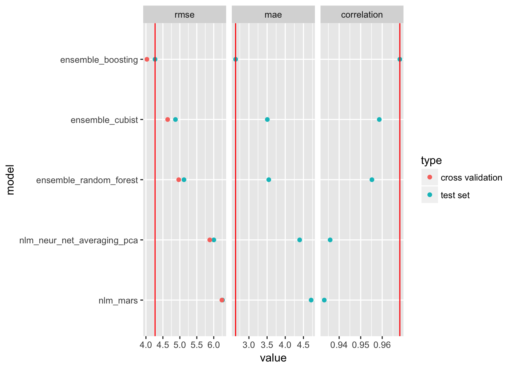

# r-predictive-analysis-template

The main objective of the associated `*.Rmd`s are for finding the best potential predictive models for a given dataset, using a shotgun approach of trying many different models with reasonable defaults.

- Regression: [predictive_analysis_regression.Rmd](./predictive_analysis_regression.Rmd)
- Classification: [predictive_analysis_classification.Rmd](./predictive_analysis_classification.Rmd)

The intent is not to skip the thinking process. The intent is to get a lot of information in a relatively short amount of time.

The information will help determine which potential models are worth spending time on and further optimizing/improving.

## predictive_analysis_regression.Rmd

The two main outputs for the regression analysis are:

- **shotgun approach**: plot showing cross-validated `RMSE` and `R-Squared` for a variety of models (with reasonable defaults) training on a training set.
	- For example:

- **final models**: plot showing `RMSE`, `MAE`, and `correlation` on the top x (e.g. 5) models that have been retrained on the entire training set (as oppossed to cross-validated), and the tested on the test set (data-points that the model has not seen).
	- For example:

## predictive_analysis_classification.Rmd

TBD
