-   [Tuning Parameters](#tuning-parameters)
-   [Dataset](#dataset)
    -   [Summary](#summary)
    -   [Skewness](#skewness)
    -   [Outliers](#outliers)
    -   [Correlation & Collinearity](#correlation-collinearity)
        -   [Correlation](#correlation)
        -   [Collinearity Removal](#collinearity-removal)
    -   [Graphs](#graphs)
        -   [checking\_balance](#checking_balance)
        -   [months\_loan\_duration](#months_loan_duration)
        -   [credit\_history](#credit_history)
        -   [purpose](#purpose)
        -   [amount](#amount)
        -   [savings\_balance](#savings_balance)
        -   [employment\_duration](#employment_duration)
        -   [percent\_of\_income](#percent_of_income)
        -   [years\_at\_residence](#years_at_residence)
        -   [age](#age)
        -   [other\_credit](#other_credit)
        -   [housing](#housing)
        -   [existing\_loans\_count](#existing_loans_count)
        -   [job](#job)
        -   [dependents](#dependents)
        -   [phone](#phone)
-   [Spot-Check](#spot-check)
    -   [Configuration](#configuration)
        -   [Class Balance](#class-balance)
        -   [Training Data](#training-data)
        -   [Test](#test)
        -   [Testing train\_classification](#testing-train_classification)
    -   [Models](#models)
        -   [glm\_no\_pre\_process](#glm_no_pre_process)
        -   [glm\_basic\_processing](#glm_basic_processing)
        -   [glm\_remove\_collinearity\_caret](#glm_remove_collinearity_caret)
        -   [glm\_remove\_collinearity\_custom](#glm_remove_collinearity_custom)
        -   [glm\_yeojohnson](#glm_yeojohnson)
        -   [logistic\_regression\_stepwise\_backward](#logistic_regression_stepwise_backward)
        -   [linear\_discriminant\_analsysis](#linear_discriminant_analsysis)
        -   [linear\_discriminant\_analsysis\_remove\_collinear](#linear_discriminant_analsysis_remove_collinear)
        -   [linear\_discriminant\_analsysis\_remove\_collinear\_skew](#linear_discriminant_analsysis_remove_collinear_skew)
        -   [partial\_least\_squares\_discriminant\_analysis](#partial_least_squares_discriminant_analysis)
        -   [partial\_least\_squares\_discriminant\_analysis\_skew](#partial_least_squares_discriminant_analysis_skew)
        -   [glmnet\_lasso\_ridge](#glmnet_lasso_ridge)
        -   [sparse\_lda](#sparse_lda)
        -   [nearest\_shrunken\_centroids](#nearest_shrunken_centroids)
        -   [regularized\_discriminant\_analysis](#regularized_discriminant_analysis)
        -   [regularized\_discriminant\_analysis\_rc](#regularized_discriminant_analysis_rc)
        -   [mixture\_discriminant\_analysis](#mixture_discriminant_analysis)
        -   [mixture\_discriminant\_analysis\_rc](#mixture_discriminant_analysis_rc)
        -   [neural\_network\_spatial\_rc](#neural_network_spatial_rc)
        -   [neural\_network\_spatial\_rc\_skew](#neural_network_spatial_rc_skew)
        -   [flexible\_discriminant\_analsysis](#flexible_discriminant_analsysis)
        -   [svm\_linear](#svm_linear)
        -   [svm\_polynomial](#svm_polynomial)
        -   [svm\_radial](#svm_radial)
        -   [k\_nearest\_neighbors](#k_nearest_neighbors)
        -   [naive\_bayes](#naive_bayes)
        -   [rpart\_independent\_categories](#rpart_independent_categories)
        -   [rpart\_grouped\_categories](#rpart_grouped_categories)
        -   [treebag\_independent\_categories](#treebag_independent_categories)
        -   [treebag\_grouped\_categories](#treebag_grouped_categories)
        -   [All Models on Page 550 that are classification or both regression and classification](#all-models-on-page-550-that-are-classification-or-both-regression-and-classification)
        -   [Models used for spot-check.Rmd](#models-used-for-spot-check.rmd)
    -   [Resamples & Top Models](#resamples-top-models)
    -   [Resamples](#resamples)
    -   [Train Top Models on Entire Training Dataset & Predict on Test Set](#train-top-models-on-entire-training-dataset-predict-on-test-set)
        -   [Regularized Discriminant Analysis (regularized\_discriminant\_analysis)](#regularized-discriminant-analysis-regularized_discriminant_analysis)
        -   [Generalized Linear Model (logistic\_regression\_stepwise\_backward)](#generalized-linear-model-logistic_regression_stepwise_backward)
        -   [Sparse Linear Discriminant Analysis (sparse\_lda)](#sparse-linear-discriminant-analysis-sparse_lda)
        -   [Neural Network (neural\_network\_spatial\_rc)](#neural-network-neural_network_spatial_rc)
        -   [Support Vector Machines with Polynomial Kernel (svm\_polynomial)](#support-vector-machines-with-polynomial-kernel-svm_polynomial)

Tuning Parameters
=================

``` r
# train/test set
training_percentage <- 0.90

# cross validation
cross_validation_num_folds <- 10
cross_validation_num_repeats <- 3

# tuning parameters
tuning_number_of_latent_variables_to_retain <- 1:10

tuning_glmnet_alpha <- seq(from = 0, to = 1, length = 5) # alpha = 0 is pure ridge regression, and alpha = 1 is pure lasso regression.
tuning_glmnet_lambda <- seq(from = 0.0001, to = 1, length = 50) # lambda values control the amount of penalization in the model.

tuning_nearest_shrunken_centroids_shrinkage_threshold <- data.frame(threshold = 0:25)

tuning_mda_subclasses <- 1:8

tuning_rda_lambda <- seq(from = 0, to = 1, by = 0.2)
tuning_rda_gamma <- seq(from = 0, to = 1, by = 0.2)

tuning_nnet_size <- 1:10
tuning_nnet_decay <- c(0, 0.1, 1, 2)
parameter_nnet_linout <- FALSE
parameter_nnet_max_iterations <- 2000

tuning_svm_linear_num_costs <- 5
tuning_svm_poly_num_costs <- 3
tuning_svm_radial_num_costs <- 6

tuning_knn_tuning_grid <- data.frame(k = c(4 * (0:5) + 1, 20 * (2:5) + 1, 50 * (3:9) + 1))

tuning_naive_bayes_laplace_correction <- c(0, 0.5, 1, 2)
tuning_naive_bayes_distribution_type <- c(TRUE, FALSE)
tuning_naive_bayes_bandwidth_adjustment <- c(0, 0.5, 1.0)
```

Dataset
=======

> Assumes the dataset has factors for strings; logical for TRUE/FALSE; `target` for outcome variable

Summary
-------

> Total predictors: `16`

> Total data-points/rows: `1000`

> Number of training data-points: `900`

Rule of thumbs for dimensions (Probabilistic and Statistical Modeling in Computer Science; pg 430):

> r &lt; sqrt(n); where r is the number of predictors and sqrt(n) is the square root of the sample size (`32`): `TRUE`

> r &lt; sqrt(n\_t); where r is the number of predictors and sqrt(n\_t) is the square root of the training set size (`30`): `TRUE`

    ##  target      checking_balance months_loan_duration   credit_history                 purpose        amount           savings_balance  employment_duration percent_of_income
    ##  yes:300   < 0 DM    :274     Min.   : 4.0         critical :293    business            : 97   Min.   :  250   < 100 DM     :603    < 1 year   :172      Min.   :1.000    
    ##  no :700   > 200 DM  : 63     1st Qu.:12.0         good     :530    car                 :337   1st Qu.: 1366   > 1000 DM    : 48    > 7 years  :253      1st Qu.:2.000    
    ##            1 - 200 DM:269     Median :18.0         perfect  : 40    car0                : 12   Median : 2320   100 - 500 DM :103    1 - 4 years:339      Median :3.000    
    ##            unknown   :394     Mean   :20.9         poor     : 88    education           : 59   Mean   : 3271   500 - 1000 DM: 63    4 - 7 years:174      Mean   :2.973    
    ##                               3rd Qu.:24.0         very good: 49    furniture/appliances:473   3rd Qu.: 3972   unknown      :183    unemployed : 62      3rd Qu.:4.000    
    ##                               Max.   :72.0                          renovations         : 22   Max.   :18424                                             Max.   :4.000    
    ##  years_at_residence      age        other_credit  housing    existing_loans_count         job        dependents      phone    
    ##  Min.   :1.000      Min.   :19.00   bank :139    other:108   Min.   :1.000        management:148   Min.   :1.000   FALSE:596  
    ##  1st Qu.:2.000      1st Qu.:27.00   none :814    own  :713   1st Qu.:1.000        skilled   :630   1st Qu.:1.000   TRUE :404  
    ##  Median :3.000      Median :33.00   store: 47    rent :179   Median :1.000        unemployed: 22   Median :1.000              
    ##  Mean   :2.845      Mean   :35.55                            Mean   :1.407        unskilled :200   Mean   :1.155              
    ##  3rd Qu.:4.000      3rd Qu.:42.00                            3rd Qu.:2.000                         3rd Qu.:1.000              
    ##  Max.   :4.000      Max.   :75.00                            Max.   :4.000                         Max.   :2.000

Skewness
--------

Note: `Box-Cox` can only be applied to sets (i.e. predictors) where all values are `> 0`. So some/most/all? `NA`s will be from that limiation.

| column                 |  boxcox\_skewness|
|:-----------------------|-----------------:|
| target                 |                NA|
| checking\_balance      |                NA|
| months\_loan\_duration |         1.0909038|
| credit\_history        |                NA|
| purpose                |                NA|
| amount                 |         1.9437827|
| savings\_balance       |                NA|
| employment\_duration   |                NA|
| percent\_of\_income    |        -0.5297551|
| years\_at\_residence   |        -0.2717526|
| age                    |         1.0176791|
| other\_credit          |                NA|
| housing                |                NA|
| existing\_loans\_count |         1.2687608|
| job                    |                NA|
| dependents             |         1.9037202|
| phone                  |                NA|

Outliers
--------

| columns                | lower\_outlier\_count | upper\_outlier\_count |
|:-----------------------|:----------------------|:----------------------|
| months\_loan\_duration | 0                     | 16                    |
| amount                 | 0                     | 50                    |
| percent\_of\_income    | 0                     | 0                     |
| years\_at\_residence   | 0                     | 0                     |
| age                    | 0                     | 6                     |
| existing\_loans\_count | 0                     | 0                     |
| dependents             | 0                     | 155                   |

Correlation & Collinearity
--------------------------

### Correlation


### Collinearity Removal

#### Caret's `findCorrelation`

Shows caret's recommendation of removing collinear columns based on correlation threshold of `0.9`

> columns recommended for removal: \`\`

> final columns recommended: `target, checking_balance, months_loan_duration, credit_history, purpose, amount, savings_balance, employment_duration, percent_of_income, years_at_residence, age, other_credit, housing, existing_loans_count, job, dependents, phone`

#### Heuristic

This method is described in APM pg 47 as the following steps

-   calculate the correlation matrix of predictors
-   determine the two predictors associated with the largest absolute pairwise correlation (call them predictors `A` and `B`)
-   Determine the average correlation between `A` and the other variables.
    -   Do the same for `B`
-   If `A` has a larger average correlation, remove it; otherwise, remove predcitor `B`
-   Repeat until no absolute correlations are above the threshold (`0.9`)

> columns recommended for removal: \`\`

> final columns recommended: `months_loan_duration, amount, percent_of_income, years_at_residence, age, existing_loans_count, dependents, target, checking_balance, credit_history, purpose, savings_balance, employment_duration, other_credit, housing, job, phone`

Graphs
------

### checking\_balance


> Chi-Square p-value: `0`

### months\_loan\_duration


statistically different means (check assumptions for t-test): TRUE

The Wilcoxon-Matt-Whitney test (or Wilcoxon rank sum test, or Mann-Whitney U-test) is used when is asked to compare the means of two groups that do not follow a normal distribution: it is a non-parametrical test. (<https://www.r-bloggers.com/wilcoxon-mann-whitney-rank-sum-test-or-test-u/>)

statistically different means (Wilcoxon-Matt-Whitney): TRUE

### credit\_history


> Chi-Square p-value: `0`

### purpose


    Warning in chisq.test(count_table): Chi-squared approximation may be incorrect


> Chi-Square p-value: `0.145`

### amount


statistically different means (check assumptions for t-test): TRUE

The Wilcoxon-Matt-Whitney test (or Wilcoxon rank sum test, or Mann-Whitney U-test) is used when is asked to compare the means of two groups that do not follow a normal distribution: it is a non-parametrical test. (<https://www.r-bloggers.com/wilcoxon-mann-whitney-rank-sum-test-or-test-u/>)

statistically different means (Wilcoxon-Matt-Whitney): TRUE

### savings\_balance


> Chi-Square p-value: `0`

### employment\_duration


> Chi-Square p-value: `0.001`

### percent\_of\_income


statistically different means (check assumptions for t-test): TRUE

The Wilcoxon-Matt-Whitney test (or Wilcoxon rank sum test, or Mann-Whitney U-test) is used when is asked to compare the means of two groups that do not follow a normal distribution: it is a non-parametrical test. (<https://www.r-bloggers.com/wilcoxon-mann-whitney-rank-sum-test-or-test-u/>)

statistically different means (Wilcoxon-Matt-Whitney): TRUE

### years\_at\_residence

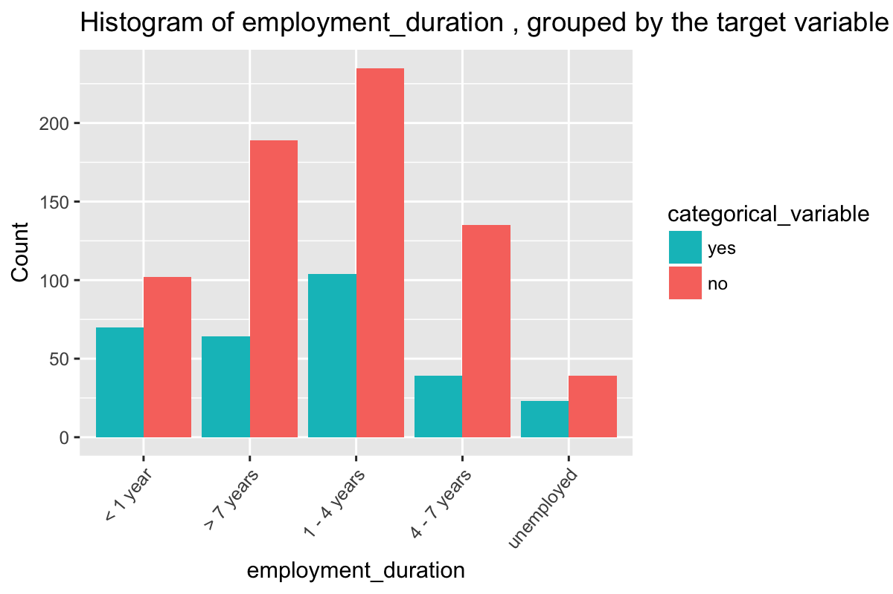

statistically different means (check assumptions for t-test): FALSE

The Wilcoxon-Matt-Whitney test (or Wilcoxon rank sum test, or Mann-Whitney U-test) is used when is asked to compare the means of two groups that do not follow a normal distribution: it is a non-parametrical test. (<https://www.r-bloggers.com/wilcoxon-mann-whitney-rank-sum-test-or-test-u/>)

statistically different means (Wilcoxon-Matt-Whitney): FALSE

### age


statistically different means (check assumptions for t-test): TRUE

The Wilcoxon-Matt-Whitney test (or Wilcoxon rank sum test, or Mann-Whitney U-test) is used when is asked to compare the means of two groups that do not follow a normal distribution: it is a non-parametrical test. (<https://www.r-bloggers.com/wilcoxon-mann-whitney-rank-sum-test-or-test-u/>)

statistically different means (Wilcoxon-Matt-Whitney): TRUE

### other\_credit


> Chi-Square p-value: `0.002`

### housing

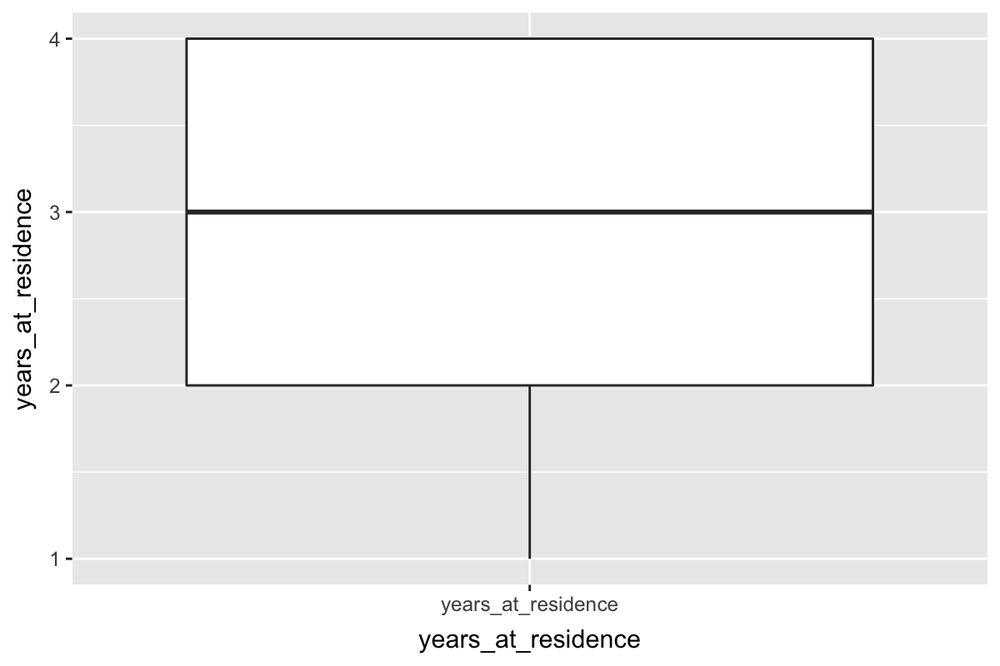

> Chi-Square p-value: `0`

### existing\_loans\_count

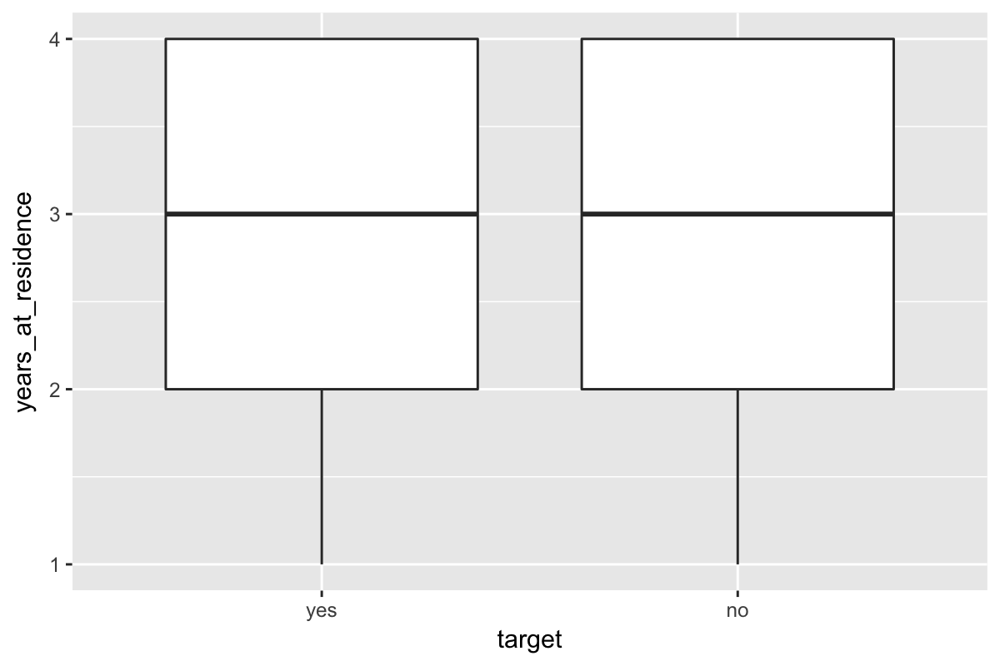

statistically different means (check assumptions for t-test): FALSE

The Wilcoxon-Matt-Whitney test (or Wilcoxon rank sum test, or Mann-Whitney U-test) is used when is asked to compare the means of two groups that do not follow a normal distribution: it is a non-parametrical test. (<https://www.r-bloggers.com/wilcoxon-mann-whitney-rank-sum-test-or-test-u/>)

statistically different means (Wilcoxon-Matt-Whitney): FALSE

### job


> Chi-Square p-value: `0.597`

### dependents


statistically different means (check assumptions for t-test): FALSE

The Wilcoxon-Matt-Whitney test (or Wilcoxon rank sum test, or Mann-Whitney U-test) is used when is asked to compare the means of two groups that do not follow a normal distribution: it is a non-parametrical test. (<https://www.r-bloggers.com/wilcoxon-mann-whitney-rank-sum-test-or-test-u/>)

statistically different means (Wilcoxon-Matt-Whitney): FALSE

### phone


> Chi-Square p-value: `0.279`

Spot-Check
==========

Configuration
-------------

### Class Balance

Make sure class balance is even amount training/test datasets.

### Training Data

    ## 
    ## yes  no 
    ## 0.3 0.7

### Test

    ## 
    ## yes  no 
    ## 0.3 0.7

> Using `10`-fold cross-validation with `3` repeats, using the `ROC` statistic to evaluate each model.

> used `90%` of data for `training` set (`900`), and `10%` for `test` set (`100`).

### Testing train\_classification

> NOTE that for logistic regression (GLM), caret's `train()` (because of `glm()`) uses the second-level factor value as the success/postive event but `resamples()` uses the first-level as the success event. The result is either the `sensitivity` and `specificity` for `resamples()` will be reversed (and so I would be unable to compare apples to apples with other models), or I need to keep the first-level factor as the positive event (the default approach), which will mean that THE COEFFICIENTS WILL BE REVERSED, MAKIN THE MODEL RELATIVE TO THE NEGATIVE EVENT. I chose the latter, in order to compare models below, but this means that when using the logistic model to explain the data, the reader needs to mentally reverse the direction/sign of the coefficients, or correct the problem in the final stages of model building.

> NOTE: "Logistic regression does not make many of the key assumptions of linear regression and general linear models that are based on ordinary least squares algorithms – particularly regarding linearity, normality, homoscedasticity, and measurement level." [link](http://www.statisticssolutions.com/assumptions-of-logistic-regression/)

Using formula in `train()`

#### Model Summary


    Call:
    NULL

    Deviance Residuals: 
        Min       1Q   Median       3Q      Max  
    -2.5895  -0.8436   0.4207   0.7751   2.0452  

    Coefficients:
                                      Estimate Std. Error z value             Pr(>|z|)    
    (Intercept)                       1.147190   0.094081  12.194 < 0.0000000000000002 ***
    `checking_balance> 200 DM`        0.238392   0.090948   2.621             0.008763 ** 
    `checking_balance1 - 200 DM`      0.169782   0.093537   1.815             0.069503 .  
    checking_balanceunknown           0.864977   0.112309   7.702   0.0000000000000134 ***
    months_loan_duration             -0.243480   0.109843  -2.217             0.026649 *  
    credit_historygood               -0.296156   0.119650  -2.475             0.013317 *  
    credit_historypoor               -0.109460   0.090283  -1.212             0.225354    
    `credit_historyvery good`        -0.241627   0.089351  -2.704             0.006846 ** 
    purposecar                        0.034689   0.130295   0.266             0.790058    
    purposeeducation                 -0.088180   0.099152  -0.889             0.373819    
    `purposefurniture/appliances`     0.180758   0.135377   1.335             0.181803    
    amount                           -0.400086   0.120926  -3.309             0.000938 ***
    `savings_balance100 - 500 DM`     0.015658   0.085541   0.183             0.854758    
    `savings_balance500 - 1000 DM`    0.054567   0.098771   0.552             0.580635    
    savings_balanceunknown            0.329990   0.100635   3.279             0.001041 ** 
    `employment_duration> 7 years`    0.255840   0.126875   2.016             0.043749 *  
    `employment_duration1 - 4 years`  0.099657   0.111016   0.898             0.369353    
    `employment_duration4 - 7 years`  0.371148   0.112825   3.290             0.001003 ** 
    employment_durationunemployed     0.050138   0.097707   0.513             0.607846    
    percent_of_income                -0.383384   0.097775  -3.921   0.0000881507786376 ***
    years_at_residence                0.005518   0.095818   0.058             0.954075    
    age                               0.128240   0.104123   1.232             0.218093    
    other_creditnone                  0.187232   0.083529   2.242             0.024992 *  
    housingown                        0.151433   0.135406   1.118             0.263413    
    housingrent                      -0.084313   0.130666  -0.645             0.518761    
    existing_loans_count             -0.178839   0.108980  -1.641             0.100790    
    jobskilled                        0.007380   0.130238   0.057             0.954813    
    jobunskilled                      0.044701   0.131371   0.340             0.733655    
    dependents                       -0.041299   0.086738  -0.476             0.633977    
    phoneTRUE                         0.222771   0.099246   2.245             0.024791 *  
    ---
    Signif. codes:  0 '***' 0.001 '**' 0.01 '*' 0.05 '.' 0.1 ' ' 1

    (Dispersion parameter for binomial family taken to be 1)

        Null deviance: 1099.56  on 899  degrees of freedom
    Residual deviance:  872.53  on 870  degrees of freedom
    AIC: 932.53

    Number of Fisher Scoring iterations: 5

#### Model Predictors

     [1] "checking_balance> 200 DM"       "checking_balance1 - 200 DM"     "checking_balanceunknown"        "months_loan_duration"           "credit_historygood"            
     [6] "credit_historypoor"             "credit_historyvery good"        "purposecar"                     "purposeeducation"               "purposefurniture/appliances"   
    [11] "amount"                         "savings_balance100 - 500 DM"    "savings_balance500 - 1000 DM"   "savings_balanceunknown"         "employment_duration> 7 years"  
    [16] "employment_duration1 - 4 years" "employment_duration4 - 7 years" "employment_durationunemployed"  "percent_of_income"              "years_at_residence"            
    [21] "age"                            "other_creditnone"               "housingown"                     "housingrent"                    "existing_loans_count"          
    [26] "jobskilled"                     "jobunskilled"                   "dependents"                     "phoneTRUE"                     

#### Variable Importance

    glm variable importance

      only 20 most important variables shown (out of 29)

     Overall
      7.7017
      3.9211
      3.3085
      3.2896
      3.2791
      2.7042
      2.6212
      2.4752
      2.2446
      2.2415
      2.2166
      2.0165
      1.8151
      1.6410
      1.3352
      1.2316
      1.2124
      1.1184
      0.8977
      0.8893

Models
------

### glm\_no\_pre\_process

#### Model Summary


    Call:
    NULL

    Deviance Residuals: 
        Min       1Q   Median       3Q      Max  
    -2.6364  -0.7956   0.4122   0.7664   1.8864  

    Coefficients:
                                        Estimate  Std. Error z value          Pr(>|z|)    
    (Intercept)                       1.67233497  0.93888105   1.781          0.074880 .  
    `checking_balance> 200 DM`        0.91202032  0.36959975   2.468          0.013603 *  
    `checking_balance1 - 200 DM`      0.36146669  0.21675128   1.668          0.095384 .  
    checking_balanceunknown           1.69919542  0.23318347   7.287 0.000000000000317 ***
    months_loan_duration             -0.01909034  0.00930934  -2.051          0.040300 *  
    credit_historygood               -0.83854132  0.26057700  -3.218          0.001291 ** 
    credit_historyperfect            -1.18300647  0.42783664  -2.765          0.005691 ** 
    credit_historypoor               -0.70792254  0.34560901  -2.048          0.040527 *  
    `credit_historyvery good`        -1.43539610  0.42810208  -3.353          0.000800 ***
    purposecar                       -0.14052327  0.32598325  -0.431          0.666414    
    purposecar0                       0.63233919  0.81457907   0.776          0.437585    
    purposeeducation                 -0.58632030  0.43971583  -1.333          0.182398    
    `purposefurniture/appliances`     0.16610147  0.31881865   0.521          0.602373    
    purposerenovations               -0.68269967  0.60731250  -1.124          0.260957    
    amount                           -0.00013829  0.00004389  -3.151          0.001627 ** 
    `savings_balance> 1000 DM`        1.03432320  0.51321912   2.015          0.043867 *  
    `savings_balance100 - 500 DM`     0.13185558  0.28429005   0.464          0.642786    
    `savings_balance500 - 1000 DM`    0.27415120  0.41264732   0.664          0.506452    
    savings_balanceunknown            0.90758459  0.26502755   3.424          0.000616 ***
    `employment_duration> 7 years`    0.51216659  0.29605002   1.730          0.083630 .  
    `employment_duration1 - 4 years`  0.16207344  0.23846600   0.680          0.496726    
    `employment_duration4 - 7 years`  0.92790647  0.30112909   3.081          0.002060 ** 
    employment_durationunemployed     0.14840842  0.43655991   0.340          0.733894    
    percent_of_income                -0.34774866  0.08869354  -3.921 0.000088259512881 ***
    years_at_residence               -0.00385951  0.08729784  -0.044          0.964736    
    age                               0.01108220  0.00927862   1.194          0.232329    
    other_creditnone                  0.52544326  0.24108458   2.179          0.029295 *  
    other_creditstore                 0.12816587  0.42389741   0.302          0.762384    
    housingown                        0.27205220  0.30231677   0.900          0.368178    
    housingrent                      -0.25445634  0.34509987  -0.737          0.460915    
    existing_loans_count             -0.33507655  0.19199533  -1.745          0.080944 .  
    jobskilled                        0.04584693  0.28901415   0.159          0.873959    
    jobunemployed                     0.09476193  0.65453976   0.145          0.884887    
    jobunskilled                      0.14669504  0.35145618   0.417          0.676392    
    dependents                       -0.11052559  0.24712936  -0.447          0.654703    
    phoneTRUE                         0.41866313  0.20925782   2.001          0.045424 *  
    ---
    Signif. codes:  0 '***' 0.001 '**' 0.01 '*' 0.05 '.' 0.1 ' ' 1

    (Dispersion parameter for binomial family taken to be 1)

        Null deviance: 1099.56  on 899  degrees of freedom
    Residual deviance:  857.01  on 864  degrees of freedom
    AIC: 929.01

    Number of Fisher Scoring iterations: 5

#### Model Predictors

     [1] "checking_balance> 200 DM"       "checking_balance1 - 200 DM"     "checking_balanceunknown"        "months_loan_duration"           "credit_historygood"            
     [6] "credit_historyperfect"          "credit_historypoor"             "credit_historyvery good"        "purposecar"                     "purposecar0"                   
    [11] "purposeeducation"               "purposefurniture/appliances"    "purposerenovations"             "amount"                         "savings_balance> 1000 DM"      
    [16] "savings_balance100 - 500 DM"    "savings_balance500 - 1000 DM"   "savings_balanceunknown"         "employment_duration> 7 years"   "employment_duration1 - 4 years"
    [21] "employment_duration4 - 7 years" "employment_durationunemployed"  "percent_of_income"              "years_at_residence"             "age"                           
    [26] "other_creditnone"               "other_creditstore"              "housingown"                     "housingrent"                    "existing_loans_count"          
    [31] "jobskilled"                     "jobunemployed"                  "jobunskilled"                   "dependents"                     "phoneTRUE"                     

#### Variable Importance

    glm variable importance

      only 20 most important variables shown (out of 35)

     Overall
       7.287
       3.921
       3.424
       3.353
       3.218
       3.151
       3.081
       2.765
       2.468
       2.179
       2.051
       2.048
       2.015
       2.001
       1.745
       1.730
       1.668
       1.333
       1.194
       1.124

### glm\_basic\_processing

#### Model Summary


    Call:
    NULL

    Deviance Residuals: 
        Min       1Q   Median       3Q      Max  
    -2.5895  -0.8436   0.4207   0.7751   2.0452  

    Coefficients:
                                      Estimate Std. Error z value             Pr(>|z|)    
    (Intercept)                       1.147190   0.094081  12.194 < 0.0000000000000002 ***
    `checking_balance> 200 DM`        0.238392   0.090948   2.621             0.008763 ** 
    `checking_balance1 - 200 DM`      0.169782   0.093537   1.815             0.069503 .  
    checking_balanceunknown           0.864977   0.112309   7.702   0.0000000000000134 ***
    months_loan_duration             -0.243480   0.109843  -2.217             0.026649 *  
    credit_historygood               -0.296156   0.119650  -2.475             0.013317 *  
    credit_historypoor               -0.109460   0.090283  -1.212             0.225354    
    `credit_historyvery good`        -0.241627   0.089351  -2.704             0.006846 ** 
    purposecar                        0.034689   0.130295   0.266             0.790058    
    purposeeducation                 -0.088180   0.099152  -0.889             0.373819    
    `purposefurniture/appliances`     0.180758   0.135377   1.335             0.181803    
    amount                           -0.400086   0.120926  -3.309             0.000938 ***
    `savings_balance100 - 500 DM`     0.015658   0.085541   0.183             0.854758    
    `savings_balance500 - 1000 DM`    0.054567   0.098771   0.552             0.580635    
    savings_balanceunknown            0.329990   0.100635   3.279             0.001041 ** 
    `employment_duration> 7 years`    0.255840   0.126875   2.016             0.043749 *  
    `employment_duration1 - 4 years`  0.099657   0.111016   0.898             0.369353    
    `employment_duration4 - 7 years`  0.371148   0.112825   3.290             0.001003 ** 
    employment_durationunemployed     0.050138   0.097707   0.513             0.607846    
    percent_of_income                -0.383384   0.097775  -3.921   0.0000881507786376 ***
    years_at_residence                0.005518   0.095818   0.058             0.954075    
    age                               0.128240   0.104123   1.232             0.218093    
    other_creditnone                  0.187232   0.083529   2.242             0.024992 *  
    housingown                        0.151433   0.135406   1.118             0.263413    
    housingrent                      -0.084313   0.130666  -0.645             0.518761    
    existing_loans_count             -0.178839   0.108980  -1.641             0.100790    
    jobskilled                        0.007380   0.130238   0.057             0.954813    
    jobunskilled                      0.044701   0.131371   0.340             0.733655    
    dependents                       -0.041299   0.086738  -0.476             0.633977    
    phoneTRUE                         0.222771   0.099246   2.245             0.024791 *  
    ---
    Signif. codes:  0 '***' 0.001 '**' 0.01 '*' 0.05 '.' 0.1 ' ' 1

    (Dispersion parameter for binomial family taken to be 1)

        Null deviance: 1099.56  on 899  degrees of freedom
    Residual deviance:  872.53  on 870  degrees of freedom
    AIC: 932.53

    Number of Fisher Scoring iterations: 5

#### Model Predictors

     [1] "checking_balance> 200 DM"       "checking_balance1 - 200 DM"     "checking_balanceunknown"        "months_loan_duration"           "credit_historygood"            
     [6] "credit_historypoor"             "credit_historyvery good"        "purposecar"                     "purposeeducation"               "purposefurniture/appliances"   
    [11] "amount"                         "savings_balance100 - 500 DM"    "savings_balance500 - 1000 DM"   "savings_balanceunknown"         "employment_duration> 7 years"  
    [16] "employment_duration1 - 4 years" "employment_duration4 - 7 years" "employment_durationunemployed"  "percent_of_income"              "years_at_residence"            
    [21] "age"                            "other_creditnone"               "housingown"                     "housingrent"                    "existing_loans_count"          
    [26] "jobskilled"                     "jobunskilled"                   "dependents"                     "phoneTRUE"                     

#### Variable Importance

    glm variable importance

      only 20 most important variables shown (out of 29)

     Overall
      7.7017
      3.9211
      3.3085
      3.2896
      3.2791
      2.7042
      2.6212
      2.4752
      2.2446
      2.2415
      2.2166
      2.0165
      1.8151
      1.6410
      1.3352
      1.2316
      1.2124
      1.1184
      0.8977
      0.8893

### glm\_remove\_collinearity\_caret

> No collinear columns removed... skipping.

### glm\_remove\_collinearity\_custom

> No collinear columns removed... skipping.

### glm\_yeojohnson

#### Model Summary


    Call:
    NULL

    Deviance Residuals: 
        Min       1Q   Median       3Q      Max  
    -2.6109  -0.8652   0.4351   0.7762   1.9022  

    Coefficients:
                                     Estimate Std. Error z value             Pr(>|z|)    
    (Intercept)                       1.14412    0.09387  12.188 < 0.0000000000000002 ***
    `checking_balance> 200 DM`        0.24800    0.09058   2.738              0.00618 ** 
    `checking_balance1 - 200 DM`      0.14181    0.09266   1.530              0.12592    
    checking_balanceunknown           0.84683    0.11174   7.578    0.000000000000035 ***
    months_loan_duration             -0.37111    0.12392  -2.995              0.00275 ** 
    credit_historygood               -0.28423    0.12404  -2.292              0.02193 *  
    credit_historypoor               -0.09885    0.09005  -1.098              0.27234    
    `credit_historyvery good`        -0.23044    0.09013  -2.557              0.01057 *  
    purposecar                        0.02868    0.12795   0.224              0.82264    
    purposeeducation                 -0.09452    0.09774  -0.967              0.33355    
    `purposefurniture/appliances`     0.20303    0.13313   1.525              0.12725    
    amount                           -0.17853    0.13343  -1.338              0.18090    
    `savings_balance100 - 500 DM`     0.02200    0.08474   0.260              0.79519    
    `savings_balance500 - 1000 DM`    0.06394    0.09920   0.645              0.51919    
    savings_balanceunknown            0.31708    0.10004   3.169              0.00153 ** 
    `employment_duration> 7 years`    0.25067    0.12583   1.992              0.04636 *  
    `employment_duration1 - 4 years`  0.09564    0.11026   0.867              0.38571    
    `employment_duration4 - 7 years`  0.35903    0.11203   3.205              0.00135 ** 
    employment_durationunemployed     0.05352    0.09701   0.552              0.58113    
    percent_of_income                -0.29189    0.10029  -2.911              0.00361 ** 
    years_at_residence                0.01564    0.09497   0.165              0.86919    
    age                               0.13466    0.10272   1.311              0.18988    
    other_creditnone                  0.18621    0.08298   2.244              0.02482 *  
    housingown                        0.16967    0.13346   1.271              0.20361    
    housingrent                      -0.05022    0.12909  -0.389              0.69728    
    existing_loans_count             -0.16304    0.11190  -1.457              0.14513    
    jobskilled                        0.07133    0.12760   0.559              0.57614    
    jobunskilled                      0.08496    0.13031   0.652              0.51440    
    dependents                       -0.05138    0.08726  -0.589              0.55599    
    phoneTRUE                         0.18234    0.09788   1.863              0.06247 .  
    ---
    Signif. codes:  0 '***' 0.001 '**' 0.01 '*' 0.05 '.' 0.1 ' ' 1

    (Dispersion parameter for binomial family taken to be 1)

        Null deviance: 1099.56  on 899  degrees of freedom
    Residual deviance:  881.96  on 870  degrees of freedom
    AIC: 941.96

    Number of Fisher Scoring iterations: 5

#### Model Predictors

     [1] "checking_balance> 200 DM"       "checking_balance1 - 200 DM"     "checking_balanceunknown"        "months_loan_duration"           "credit_historygood"            
     [6] "credit_historypoor"             "credit_historyvery good"        "purposecar"                     "purposeeducation"               "purposefurniture/appliances"   
    [11] "amount"                         "savings_balance100 - 500 DM"    "savings_balance500 - 1000 DM"   "savings_balanceunknown"         "employment_duration> 7 years"  
    [16] "employment_duration1 - 4 years" "employment_duration4 - 7 years" "employment_durationunemployed"  "percent_of_income"              "years_at_residence"            
    [21] "age"                            "other_creditnone"               "housingown"                     "housingrent"                    "existing_loans_count"          
    [26] "jobskilled"                     "jobunskilled"                   "dependents"                     "phoneTRUE"                     

#### Variable Importance

    glm variable importance

      only 20 most important variables shown (out of 29)

     Overall
      7.5785
      3.2046
      3.1695
      2.9948
      2.9106
      2.7380
      2.5567
      2.2915
      2.2441
      1.9921
      1.8629
      1.5304
      1.5250
      1.4570
      1.3380
      1.3109
      1.2713
      1.0977
      0.9670
      0.8674

### logistic\_regression\_stepwise\_backward

#### Model Summary


    Call:
    NULL

    Deviance Residuals: 
        Min       1Q   Median       3Q      Max  
    -2.5554  -0.8800   0.4347   0.7691   2.0064  

    Coefficients:
                                      Estimate Std. Error z value             Pr(>|z|)    
    (Intercept)                       1.131640   0.092838  12.189 < 0.0000000000000002 ***
    `checking_balance> 200 DM`        0.245993   0.089350   2.753             0.005903 ** 
    `checking_balance1 - 200 DM`      0.165115   0.091617   1.802             0.071508 .  
    checking_balanceunknown           0.859391   0.111245   7.725   0.0000000000000112 ***
    credit_historygood               -0.283603   0.117919  -2.405             0.016169 *  
    credit_historypoor               -0.120046   0.088977  -1.349             0.177278    
    `credit_historyvery good`        -0.246000   0.088881  -2.768             0.005645 ** 
    `savings_balance100 - 500 DM`     0.001352   0.084900   0.016             0.987294    
    `savings_balance500 - 1000 DM`    0.070428   0.098308   0.716             0.473743    
    savings_balanceunknown            0.312059   0.098696   3.162             0.001568 ** 
    `employment_duration> 7 years`    0.295568   0.116962   2.527             0.011502 *  
    `employment_duration1 - 4 years`  0.103760   0.109846   0.945             0.344866    
    `employment_duration4 - 7 years`  0.372998   0.111061   3.359             0.000784 ***
    employment_durationunemployed     0.059406   0.089472   0.664             0.506715    
    other_creditnone                  0.183429   0.082681   2.219             0.026519 *  
    housingown                        0.178234   0.123668   1.441             0.149520    
    housingrent                      -0.081868   0.122738  -0.667             0.504761    
    phoneTRUE                         0.210035   0.091554   2.294             0.021785 *  
    months_loan_duration             -0.251555   0.107446  -2.341             0.019221 *  
    amount                           -0.409812   0.117708  -3.482             0.000498 ***
    percent_of_income                -0.372375   0.096322  -3.866             0.000111 ***
    existing_loans_count             -0.180763   0.106837  -1.692             0.090654 .  
    ---
    Signif. codes:  0 '***' 0.001 '**' 0.01 '*' 0.05 '.' 0.1 ' ' 1

    (Dispersion parameter for binomial family taken to be 1)

        Null deviance: 1099.56  on 899  degrees of freedom
    Residual deviance:  879.81  on 878  degrees of freedom
    AIC: 923.81

    Number of Fisher Scoring iterations: 5

#### Model Predictors

     [1] "checking_balance> 200 DM"       "checking_balance1 - 200 DM"     "checking_balanceunknown"        "credit_historygood"             "credit_historypoor"            
     [6] "credit_historyvery good"        "savings_balance100 - 500 DM"    "savings_balance500 - 1000 DM"   "savings_balanceunknown"         "employment_duration> 7 years"  
    [11] "employment_duration1 - 4 years" "employment_duration4 - 7 years" "employment_durationunemployed"  "other_creditnone"               "housingown"                    
    [16] "housingrent"                    "phoneTRUE"                      "months_loan_duration"           "amount"                         "percent_of_income"             
    [21] "existing_loans_count"          

#### Variable Importance

    glm variable importance

      only 20 most important variables shown (out of 21)

     Overall
      7.7252
      3.8659
      3.4816
      3.3585
      3.1618
      2.7677
      2.7531
      2.5271
      2.4051
      2.3412
      2.2941
      2.2185
      1.8022
      1.6920
      1.4412
      1.3492
      0.9446
      0.7164
      0.6670
      0.6640

### linear\_discriminant\_analsysis

#### Model Summary

                Length Class      Mode     
    prior        2     -none-     numeric  
    counts       2     -none-     numeric  
    means       58     -none-     numeric  
    scaling     29     -none-     numeric  
    lev          2     -none-     character
    svd          1     -none-     numeric  
    N            1     -none-     numeric  
    call         3     -none-     call     
    xNames      29     -none-     character
    problemType  1     -none-     character
    tuneValue    1     data.frame list     
    obsLevels    2     -none-     character
    param        0     -none-     list     

#### Model Predictors

     [1] "checking_balance> 200 DM"       "checking_balance1 - 200 DM"     "checking_balanceunknown"        "months_loan_duration"           "credit_historygood"            
     [6] "credit_historypoor"             "credit_historyvery good"        "purposecar"                     "purposeeducation"               "purposefurniture/appliances"   
    [11] "amount"                         "savings_balance100 - 500 DM"    "savings_balance500 - 1000 DM"   "savings_balanceunknown"         "employment_duration> 7 years"  
    [16] "employment_duration1 - 4 years" "employment_duration4 - 7 years" "employment_durationunemployed"  "percent_of_income"              "years_at_residence"            
    [21] "age"                            "other_creditnone"               "housingown"                     "housingrent"                    "existing_loans_count"          
    [26] "jobskilled"                     "jobunskilled"                   "dependents"                     "phoneTRUE"                     

#### Variable Importance

    ROC curve variable importance

     Importance
         0.6906
         0.6195
         0.6146
         0.5906
         0.5700
         0.5533
         0.5470
         0.5279
         0.5275
         0.5258
         0.5252
         0.5204
         0.5193
         0.5105
         0.5065
         0.5063

### linear\_discriminant\_analsysis\_remove\_collinear

> No collinear columns removed... skipping.

### linear\_discriminant\_analsysis\_remove\_collinear\_skew

#### Model Summary

                Length Class      Mode     
    prior        2     -none-     numeric  
    counts       2     -none-     numeric  
    means       58     -none-     numeric  
    scaling     29     -none-     numeric  
    lev          2     -none-     character
    svd          1     -none-     numeric  
    N            1     -none-     numeric  
    call         3     -none-     call     
    xNames      29     -none-     character
    problemType  1     -none-     character
    tuneValue    1     data.frame list     
    obsLevels    2     -none-     character
    param        0     -none-     list     

#### Model Predictors

     [1] "checking_balance> 200 DM"       "checking_balance1 - 200 DM"     "checking_balanceunknown"        "months_loan_duration"           "credit_historygood"            
     [6] "credit_historypoor"             "credit_historyvery good"        "purposecar"                     "purposeeducation"               "purposefurniture/appliances"   
    [11] "amount"                         "savings_balance100 - 500 DM"    "savings_balance500 - 1000 DM"   "savings_balanceunknown"         "employment_duration> 7 years"  
    [16] "employment_duration1 - 4 years" "employment_duration4 - 7 years" "employment_durationunemployed"  "percent_of_income"              "years_at_residence"            
    [21] "age"                            "other_creditnone"               "housingown"                     "housingrent"                    "existing_loans_count"          
    [26] "jobskilled"                     "jobunskilled"                   "dependents"                     "phoneTRUE"                     

#### Variable Importance

    ROC curve variable importance

     Importance
         0.6906
         0.6195
         0.6146
         0.5906
         0.5700
         0.5533
         0.5470
         0.5279
         0.5275
         0.5258
         0.5252
         0.5204
         0.5193
         0.5105
         0.5065
         0.5063

### partial\_least\_squares\_discriminant\_analysis

Data: X dimension: 900 29 Y dimension: 900 2 Fit method: oscorespls Number of components considered: 4 TRAINING: % variance explained

#### Model Predictors

     [1] "checking_balance> 200 DM"       "checking_balance1 - 200 DM"     "checking_balanceunknown"        "months_loan_duration"           "credit_historygood"            
     [6] "credit_historypoor"             "credit_historyvery good"        "purposecar"                     "purposeeducation"               "purposefurniture/appliances"   
    [11] "amount"                         "savings_balance100 - 500 DM"    "savings_balance500 - 1000 DM"   "savings_balanceunknown"         "employment_duration> 7 years"  
    [16] "employment_duration1 - 4 years" "employment_duration4 - 7 years" "employment_durationunemployed"  "percent_of_income"              "years_at_residence"            
    [21] "age"                            "other_creditnone"               "housingown"                     "housingrent"                    "existing_loans_count"          
    [26] "jobskilled"                     "jobunskilled"                   "dependents"                     "phoneTRUE"                     

#### Model Tuning Grid Performance


#### Variable Importance

    pls variable importance

      only 20 most important variables shown (out of 29)

     Overall
     0.07640
     0.04441
     0.03569
     0.03420
     0.03307
     0.03221
     0.02983
     0.02795
     0.02299
     0.02299
     0.02162
     0.02091
     0.01912
     0.01669
     0.01606
     0.01457
     0.01339
     0.01202
     0.01105
     0.01049

### partial\_least\_squares\_discriminant\_analysis\_skew

Data: X dimension: 900 29 Y dimension: 900 2 Fit method: oscorespls Number of components considered: 4 TRAINING: % variance explained

#### Model Predictors

     [1] "checking_balance> 200 DM"       "checking_balance1 - 200 DM"     "checking_balanceunknown"        "months_loan_duration"           "credit_historygood"            
     [6] "credit_historypoor"             "credit_historyvery good"        "purposecar"                     "purposeeducation"               "purposefurniture/appliances"   
    [11] "amount"                         "savings_balance100 - 500 DM"    "savings_balance500 - 1000 DM"   "savings_balanceunknown"         "employment_duration> 7 years"  
    [16] "employment_duration1 - 4 years" "employment_duration4 - 7 years" "employment_durationunemployed"  "percent_of_income"              "years_at_residence"            
    [21] "age"                            "other_creditnone"               "housingown"                     "housingrent"                    "existing_loans_count"          
    [26] "jobskilled"                     "jobunskilled"                   "dependents"                     "phoneTRUE"                     

#### Model Tuning Grid Performance


#### Variable Importance

    pls variable importance

      only 20 most important variables shown (out of 29)

     Overall
     0.07757
     0.04637
     0.03396
     0.03391
     0.03246
     0.03047
     0.02846
     0.02615
     0.02488
     0.02391
     0.02239
     0.02073
     0.01960
     0.01679
     0.01644
     0.01405
     0.01357
     0.01241
     0.01114
     0.01100

### glmnet\_lasso\_ridge

#### Model Summary

                Length Class      Mode     
    a0            66   -none-     numeric  
    beta        1914   dgCMatrix  S4       
    df            66   -none-     numeric  
    dim            2   -none-     numeric  
    lambda        66   -none-     numeric  
    dev.ratio     66   -none-     numeric  
    nulldev        1   -none-     numeric  
    npasses        1   -none-     numeric  
    jerr           1   -none-     numeric  
    offset         1   -none-     logical  
    classnames     2   -none-     character
    call           5   -none-     call     
    nobs           1   -none-     numeric  
    lambdaOpt      1   -none-     numeric  
    xNames        29   -none-     character
    problemType    1   -none-     character
    tuneValue      2   data.frame list     
    obsLevels      2   -none-     character
    param          0   -none-     list     

#### Model Predictors

     [1] "checking_balance> 200 DM"       "checking_balance1 - 200 DM"     "checking_balanceunknown"        "months_loan_duration"           "credit_historygood"            
     [6] "credit_historyvery good"        "purposeeducation"               "purposefurniture/appliances"    "amount"                         "savings_balance500 - 1000 DM"  
    [11] "savings_balanceunknown"         "employment_duration> 7 years"   "employment_duration4 - 7 years" "percent_of_income"              "age"                           
    [16] "other_creditnone"               "housingown"                     "housingrent"                    "phoneTRUE"                     

#### Model Tuning Grid Performance


#### Variable Importance

    glmnet variable importance

      only 20 most important variables shown (out of 29)

     Overall
     0.65776
     0.22805
     0.22683
     0.21889
     0.21305
     0.17986
     0.14292
     0.13728
     0.13057
     0.12062
     0.10410
     0.10060
     0.08770
     0.07662
     0.05505
     0.04112
     0.03713
     0.01972
     0.01924
     0.00000

### sparse\_lda

#### Model Summary

                Length Class      Mode     
    call         5     -none-     call     
    beta        22     -none-     numeric  
    theta        2     -none-     numeric  
    varNames    22     -none-     character
    varIndex    22     -none-     numeric  
    origP        1     -none-     numeric  
    rss          1     -none-     numeric  
    fit          8     lda        list     
    classes      2     -none-     character
    lambda       1     -none-     numeric  
    stop         1     -none-     numeric  
    xNames      29     -none-     character
    problemType  1     -none-     character
    tuneValue    2     data.frame list     
    obsLevels    2     -none-     character
    param        0     -none-     list     

#### Model Predictors

     [1] "checking_balance> 200 DM"       "checking_balance1 - 200 DM"     "checking_balanceunknown"        "months_loan_duration"           "credit_historygood"            
     [6] "credit_historypoor"             "credit_historyvery good"        "purposeeducation"               "purposefurniture/appliances"    "amount"                        
    [11] "savings_balance500 - 1000 DM"   "savings_balanceunknown"         "employment_duration> 7 years"   "employment_duration4 - 7 years" "percent_of_income"             
    [16] "age"                            "other_creditnone"               "housingown"                     "housingrent"                    "existing_loans_count"          
    [21] "dependents"                     "phoneTRUE"                     

#### Model Tuning Grid Performance


#### Variable Importance

    ROC curve variable importance

     Importance
         0.6906
         0.6195
         0.6146
         0.5906
         0.5700
         0.5533
         0.5470
         0.5279
         0.5275
         0.5258
         0.5252
         0.5204
         0.5193
         0.5105
         0.5065
         0.5063

### nearest\_shrunken\_centroids

> was causing an error, turned off

### regularized\_discriminant\_analysis

#### Model Summary

                   Length Class      Mode     
    call              5   -none-     call     
    regularization    2   -none-     numeric  
    classes           2   -none-     character
    prior             2   -none-     numeric  
    error.rate        1   -none-     numeric  
    varnames         29   -none-     character
    means            58   -none-     numeric  
    covariances    1682   -none-     numeric  
    covpooled       841   -none-     numeric  
    converged         1   -none-     logical  
    iter              1   -none-     numeric  
    xNames           29   -none-     character
    problemType       1   -none-     character
    tuneValue         2   data.frame list     
    obsLevels         2   -none-     character
    param             0   -none-     list     

#### Model Predictors

     [1] "checking_balance> 200 DM"       "checking_balance1 - 200 DM"     "checking_balanceunknown"        "months_loan_duration"           "credit_historygood"            
     [6] "credit_historypoor"             "credit_historyvery good"        "purposecar"                     "purposeeducation"               "purposefurniture/appliances"   
    [11] "amount"                         "savings_balance100 - 500 DM"    "savings_balance500 - 1000 DM"   "savings_balanceunknown"         "employment_duration> 7 years"  
    [16] "employment_duration1 - 4 years" "employment_duration4 - 7 years" "employment_durationunemployed"  "percent_of_income"              "years_at_residence"            
    [21] "age"                            "other_creditnone"               "housingown"                     "housingrent"                    "existing_loans_count"          
    [26] "jobskilled"                     "jobunskilled"                   "dependents"                     "phoneTRUE"                     

#### Model Tuning Grid Performance


#### Variable Importance

    ROC curve variable importance

     Importance
         0.6906
         0.6195
         0.6146
         0.5906
         0.5700
         0.5533
         0.5470
         0.5279
         0.5275
         0.5258
         0.5252
         0.5204
         0.5193
         0.5105
         0.5065
         0.5063

### regularized\_discriminant\_analysis\_rc

> No collinear columns removed... skipping.

### mixture\_discriminant\_analysis

#### Model Summary

                      Length Class      Mode     
    percent.explained  1     -none-     numeric  
    values             1     -none-     numeric  
    means              2     -none-     numeric  
    theta.mod          1     -none-     numeric  
    dimension          1     -none-     numeric  
    sub.prior          2     -none-     list     
    fit                5     polyreg    list     
    call               4     -none-     call     
    weights            2     -none-     list     
    prior              2     table      numeric  
    assign.theta       2     -none-     list     
    deviance           1     -none-     numeric  
    confusion          4     table      numeric  
    terms              3     terms      call     
    xNames            29     -none-     character
    problemType        1     -none-     character
    tuneValue          1     data.frame list     
    obsLevels          2     -none-     character
    param              0     -none-     list     

#### Model Predictors

     [1] "checking_balance> 200 DM"       "checking_balance1 - 200 DM"     "checking_balanceunknown"        "months_loan_duration"           "credit_historygood"            
     [6] "credit_historypoor"             "credit_historyvery good"        "purposecar"                     "purposeeducation"               "purposefurniture/appliances"   
    [11] "amount"                         "savings_balance100 - 500 DM"    "savings_balance500 - 1000 DM"   "savings_balanceunknown"         "employment_duration> 7 years"  
    [16] "employment_duration1 - 4 years" "employment_duration4 - 7 years" "employment_durationunemployed"  "percent_of_income"              "years_at_residence"            
    [21] "age"                            "other_creditnone"               "housingown"                     "housingrent"                    "existing_loans_count"          
    [26] "jobskilled"                     "jobunskilled"                   "dependents"                     "phoneTRUE"                     

#### Model Tuning Grid Performance


#### Variable Importance

    ROC curve variable importance

     Importance
         0.6906
         0.6195
         0.6146
         0.5906
         0.5700
         0.5533
         0.5470
         0.5279
         0.5275
         0.5258
         0.5252
         0.5204
         0.5193
         0.5105
         0.5065
         0.5063

### mixture\_discriminant\_analysis\_rc

> No collinear columns removed... skipping.

### neural\_network\_spatial\_rc

#### Model Summary

    a 29-1-1 network with 32 weights
    options were - entropy fitting  decay=1
      b->h1  i1->h1  i2->h1  i3->h1  i4->h1  i5->h1  i6->h1  i7->h1  i8->h1  i9->h1 i10->h1 i11->h1 i12->h1 i13->h1 i14->h1 i15->h1 i16->h1 i17->h1 i18->h1 i19->h1 i20->h1 i21->h1 
      -0.05    0.71    0.11    2.67   -1.18   -0.54   -0.31   -1.04    0.04   -0.44    0.52   -1.13    0.08    0.34    0.97    0.63    0.03    0.83   -0.32   -0.96    0.03    0.50 
    i22->h1 i23->h1 i24->h1 i25->h1 i26->h1 i27->h1 i28->h1 i29->h1 
       0.78    0.72   -0.38   -0.11    0.02    0.18   -0.10    0.60 
     b->o h1->o 
    -1.18  4.39 

#### Model Predictors

    Loading required package: nnet

     [1] "checking_balance> 200 DM"       "checking_balance1 - 200 DM"     "checking_balanceunknown"        "months_loan_duration"           "credit_historygood"            
     [6] "credit_historypoor"             "credit_historyvery good"        "purposecar"                     "purposeeducation"               "purposefurniture/appliances"   
    [11] "amount"                         "savings_balance100 - 500 DM"    "savings_balance500 - 1000 DM"   "savings_balanceunknown"         "employment_duration> 7 years"  
    [16] "employment_duration1 - 4 years" "employment_duration4 - 7 years" "employment_durationunemployed"  "percent_of_income"              "years_at_residence"            
    [21] "age"                            "other_creditnone"               "housingown"                     "housingrent"                    "existing_loans_count"          
    [26] "jobskilled"                     "jobunskilled"                   "dependents"                     "phoneTRUE"                     

#### Model Tuning Grid Performance


#### Variable Importance

    nnet variable importance

      only 20 most important variables shown (out of 29)

     Overall
      16.370
       7.252
       6.960
       6.389
       5.955
       5.869
       5.108
       4.761
       4.415
       4.384
       3.841
       3.698
       3.331
       3.192
       3.087
       2.709
       2.360
       2.090
       1.972
       1.925

### neural\_network\_spatial\_rc\_skew

#### Model Summary

    a 29-1-1 network with 32 weights
    options were - entropy fitting  decay=1
      b->h1  i1->h1  i2->h1  i3->h1  i4->h1  i5->h1  i6->h1  i7->h1  i8->h1  i9->h1 i10->h1 i11->h1 i12->h1 i13->h1 i14->h1 i15->h1 i16->h1 i17->h1 i18->h1 i19->h1 i20->h1 i21->h1 
      -0.08    0.74    0.01    2.69   -1.40   -0.52   -0.31   -1.03    0.02   -0.46    0.59   -0.60    0.10    0.34    0.96    0.60    0.00    0.80   -0.30   -0.81    0.08    0.58 
    i22->h1 i23->h1 i24->h1 i25->h1 i26->h1 i27->h1 i28->h1 i29->h1 
       0.81    0.77   -0.30   -0.07    0.13    0.23   -0.14    0.51 
     b->o h1->o 
    -1.11  4.32 

#### Model Predictors

     [1] "checking_balance> 200 DM"       "checking_balance1 - 200 DM"     "checking_balanceunknown"        "months_loan_duration"           "credit_historygood"            
     [6] "credit_historypoor"             "credit_historyvery good"        "purposecar"                     "purposeeducation"               "purposefurniture/appliances"   
    [11] "amount"                         "savings_balance100 - 500 DM"    "savings_balance500 - 1000 DM"   "savings_balanceunknown"         "employment_duration> 7 years"  
    [16] "employment_duration1 - 4 years" "employment_duration4 - 7 years" "employment_durationunemployed"  "percent_of_income"              "years_at_residence"            
    [21] "age"                            "other_creditnone"               "housingown"                     "housingrent"                    "existing_loans_count"          
    [26] "jobskilled"                     "jobunskilled"                   "dependents"                     "phoneTRUE"                     

#### Model Tuning Grid Performance


#### Variable Importance

    nnet variable importance

      only 20 most important variables shown (out of 29)

     Overall
      16.945
       8.837
       6.512
       6.060
       5.101
       5.091
       5.020
       4.845
       4.631
       3.756
       3.753
       3.694
       3.671
       3.250
       3.201
       2.877
       2.148
       1.966
       1.913
       1.875

### flexible\_discriminant\_analsysis

#### Model Summary

                      Length Class      Mode     
    percent.explained  1     -none-     numeric  
    values             1     -none-     numeric  
    means              2     -none-     numeric  
    theta.mod          1     -none-     numeric  
    dimension          1     -none-     numeric  
    prior              2     table      numeric  
    fit               29     earth      list     
    call               7     -none-     call     
    terms              3     terms      call     
    confusion          4     table      numeric  
    xNames            29     -none-     character
    problemType        1     -none-     character
    tuneValue          2     data.frame list     
    obsLevels          2     -none-     character
    param              0     -none-     list     

#### Model Predictors

    Loading required package: earth

    Loading required package: plotmo

    Loading required package: plotrix


    Attaching package: 'plotrix'

    The following object is masked from 'package:gplots':

        plotCI

    The following object is masked from 'package:scales':

        rescale

    The following object is masked from 'package:psych':

        rescale

    Loading required package: TeachingDemos


    Attaching package: 'TeachingDemos'

    The following object is masked from 'package:klaR':

        triplot

    The following objects are masked from 'package:Hmisc':

        cnvrt.coords, subplot

     [1] "checking_balanceunknown"       "months_loan_duration"          "amount"                        "savings_balanceunknown"        "`checking_balance>200DM`"     
     [6] "housingown"                    "`credit_historyverygood`"      "`employment_duration4-7years`" "`checking_balance1-200DM`"     "percent_of_income"            
    [11] "`employment_duration>7years`"  "phoneTRUE"                    

#### Model Tuning Grid Performance


#### Variable Importance

    fda variable importance

      only 20 most important variables shown (out of 29)

     Overall
      100.00
       64.00
       54.82
       52.24
       48.51
       47.77
       41.48
       35.00
       23.89
       21.20
       18.69
       15.11
        0.00
        0.00
        0.00
        0.00
        0.00
        0.00
        0.00
        0.00

### svm\_linear

#### Model Summary


    Call:
    svm.default(x = as.matrix(x), y = y, kernel = "linear", cost = param$cost, probability = classProbs)


    Parameters:
       SVM-Type:  C-classification 
     SVM-Kernel:  linear 
           cost:  0.5 
          gamma:  0.02857143 

    Number of Support Vectors:  500

     ( 256 244 )


    Number of Classes:  2 

    Levels: 
     yes no

#### Model Predictors

     [1] "checking_balance> 200 DM"       "checking_balance1 - 200 DM"     "checking_balanceunknown"        "months_loan_duration"           "credit_historygood"            
     [6] "credit_historyperfect"          "credit_historypoor"             "credit_historyvery good"        "purposecar"                     "purposecar0"                   
    [11] "purposeeducation"               "purposefurniture/appliances"    "purposerenovations"             "amount"                         "savings_balance> 1000 DM"      
    [16] "savings_balance100 - 500 DM"    "savings_balance500 - 1000 DM"   "savings_balanceunknown"         "employment_duration> 7 years"   "employment_duration1 - 4 years"
    [21] "employment_duration4 - 7 years" "employment_durationunemployed"  "percent_of_income"              "years_at_residence"             "age"                           
    [26] "other_creditnone"               "other_creditstore"              "housingown"                     "housingrent"                    "existing_loans_count"          
    [31] "jobskilled"                     "jobunemployed"                  "jobunskilled"                   "dependents"                     "phoneTRUE"                     

#### Model Tuning Grid Performance


#### Variable Importance

    ROC curve variable importance

     Importance
         0.6906
         0.6195
         0.6146
         0.5906
         0.5700
         0.5533
         0.5470
         0.5279
         0.5275
         0.5258
         0.5252
         0.5204
         0.5193
         0.5105
         0.5065
         0.5063

### svm\_polynomial

#### Model Summary

    Length  Class   Mode 
         1   ksvm     S4 

#### Model Predictors

    Loading required package: kernlab


    Attaching package: 'kernlab'

    The following object is masked from 'package:scales':

        alpha

    The following object is masked from 'package:psych':

        alpha

    The following object is masked from 'package:ggplot2':

        alpha

    [1] NA

#### Model Tuning Grid Performance


#### Variable Importance

    ROC curve variable importance

     Importance
         0.6906
         0.6195
         0.6146
         0.5906
         0.5700
         0.5533
         0.5470
         0.5279
         0.5275
         0.5258
         0.5252
         0.5204
         0.5193
         0.5105
         0.5065
         0.5063

### svm\_radial

#### Model Summary

    Length  Class   Mode 
         1   ksvm     S4 

#### Model Predictors

     [1] "checking_balance..200.DM"       "checking_balance1...200.DM"     "checking_balanceunknown"        "months_loan_duration"           "credit_historygood"            
     [6] "credit_historyperfect"          "credit_historypoor"             "credit_historyvery.good"        "purposecar"                     "purposecar0"                   
    [11] "purposeeducation"               "purposefurniture.appliances"    "purposerenovations"             "amount"                         "savings_balance..1000.DM"      
    [16] "savings_balance100...500.DM"    "savings_balance500...1000.DM"   "savings_balanceunknown"         "employment_duration..7.years"   "employment_duration1...4.years"
    [21] "employment_duration4...7.years" "employment_durationunemployed"  "percent_of_income"              "years_at_residence"             "age"                           
    [26] "other_creditnone"               "other_creditstore"              "housingown"                     "housingrent"                    "existing_loans_count"          
    [31] "jobskilled"                     "jobunemployed"                  "jobunskilled"                   "dependents"                     "phoneTRUE"                     

#### Model Tuning Grid Performance


#### Variable Importance

    ROC curve variable importance

     Importance
         0.6906
         0.6195
         0.6146
         0.5906
         0.5700
         0.5533
         0.5470
         0.5279
         0.5275
         0.5258
         0.5252
         0.5204
         0.5193
         0.5105
         0.5065
         0.5063

### k\_nearest\_neighbors

#### Model Summary

                Length Class      Mode     
    learn        2     -none-     list     
    k            1     -none-     numeric  
    theDots      0     -none-     list     
    xNames      35     -none-     character
    problemType  1     -none-     character
    tuneValue    1     data.frame list     
    obsLevels    2     -none-     character
    param        0     -none-     list     

#### Model Predictors

     [1] "checking_balance> 200 DM"       "checking_balance1 - 200 DM"     "checking_balanceunknown"        "months_loan_duration"           "credit_historygood"            
     [6] "credit_historyperfect"          "credit_historypoor"             "credit_historyvery good"        "purposecar"                     "purposecar0"                   
    [11] "purposeeducation"               "purposefurniture/appliances"    "purposerenovations"             "amount"                         "savings_balance> 1000 DM"      
    [16] "savings_balance100 - 500 DM"    "savings_balance500 - 1000 DM"   "savings_balanceunknown"         "employment_duration> 7 years"   "employment_duration1 - 4 years"
    [21] "employment_duration4 - 7 years" "employment_durationunemployed"  "percent_of_income"              "years_at_residence"             "age"                           
    [26] "other_creditnone"               "other_creditstore"              "housingown"                     "housingrent"                    "existing_loans_count"          
    [31] "jobskilled"                     "jobunemployed"                  "jobunskilled"                   "dependents"                     "phoneTRUE"                     

#### Model Tuning Grid Performance


#### Variable Importance

    ROC curve variable importance

     Importance
         0.6906
         0.6195
         0.6146
         0.5906
         0.5700
         0.5533
         0.5470
         0.5279
         0.5275
         0.5258
         0.5252
         0.5204
         0.5193
         0.5105
         0.5065
         0.5063

### naive\_bayes

#### Model Summary

                Length Class      Mode     
    apriori      2     table      numeric  
    tables      29     -none-     list     
    levels       2     -none-     character
    call         6     -none-     call     
    x           29     data.frame list     
    usekernel    1     -none-     logical  
    varnames    29     -none-     character
    xNames      29     -none-     character
    problemType  1     -none-     character
    tuneValue    3     data.frame list     
    obsLevels    2     -none-     character
    param        0     -none-     list     

#### Model Predictors

     [1] "checking_balance..200.DM"       "checking_balance1...200.DM"     "checking_balanceunknown"        "months_loan_duration"           "credit_historygood"            
     [6] "credit_historypoor"             "credit_historyvery.good"        "purposecar"                     "purposeeducation"               "purposefurniture.appliances"   
    [11] "amount"                         "savings_balance100...500.DM"    "savings_balance500...1000.DM"   "savings_balanceunknown"         "employment_duration..7.years"  
    [16] "employment_duration1...4.years" "employment_duration4...7.years" "employment_durationunemployed"  "percent_of_income"              "years_at_residence"            
    [21] "age"                            "other_creditnone"               "housingown"                     "housingrent"                    "existing_loans_count"          
    [26] "jobskilled"                     "jobunskilled"                   "dependents"                     "phoneTRUE"                     

#### Model Tuning Grid Performance


#### Variable Importance

    ROC curve variable importance

     Importance
         0.6906
         0.6195
         0.6146
         0.5906
         0.5700
         0.5533
         0.5470
         0.5279
         0.5275
         0.5258
         0.5252
         0.5204
         0.5193
         0.5105
         0.5065
         0.5063

### rpart\_independent\_categories

> See APM pg 373/405 for descriptions on independent categories (binary dummy variables) vs grouped categories
>
> When you use the formula interface, most modeling functions (including train, lm, glm, etc) internally run model.matrix to process the data set. This will create dummy variables from any factor variables. The non-formula interface does not \[1\]. <https://stackoverflow.com/questions/22200923/different-results-with-formula-and-non-formula-for-caret-training>

#### Model Summary

    CART 

    900 samples
     16 predictor
      2 classes: 'yes', 'no' 

    No pre-processing
    Resampling: Cross-Validated (10 fold, repeated 3 times) 
    Summary of sample sizes: 810, 810, 810, 810, 810, 810, ... 
    Resampling results across tuning parameters:

      cp           ROC        Sens        Spec     
      0.000000000  0.6996865  0.42962963  0.7984127
      0.001404853  0.6968352  0.42222222  0.8042328
      0.002809706  0.6966588  0.40493827  0.8142857
      0.004214559  0.7011268  0.37777778  0.8301587
      0.005619413  0.7051342  0.36913580  0.8412698
      0.007024266  0.7053302  0.36049383  0.8465608
      0.008429119  0.7082500  0.35308642  0.8576720
      0.009833972  0.7082109  0.35432099  0.8576720
      0.011238825  0.7050656  0.34444444  0.8640212
      0.012643678  0.7096610  0.33703704  0.8703704
      0.014048531  0.7099157  0.33456790  0.8730159
      0.015453384  0.7083970  0.32962963  0.8756614
      0.016858238  0.7068097  0.32962963  0.8708995
      0.018263091  0.7068097  0.32962963  0.8708995
      0.019667944  0.7031550  0.31481481  0.8740741
      0.021072797  0.6947874  0.28148148  0.8820106
      0.022477650  0.6869684  0.26913580  0.8873016
      0.023882503  0.6792279  0.24567901  0.9010582
      0.025287356  0.6668234  0.20864198  0.9190476
      0.026692209  0.6590927  0.20246914  0.9211640
      0.028097063  0.6596904  0.19382716  0.9264550
      0.029501916  0.6578189  0.18888889  0.9259259
      0.030906769  0.6431119  0.16296296  0.9349206
      0.032311622  0.6431119  0.16296296  0.9349206
      0.033716475  0.6187929  0.14074074  0.9402116
      0.035121328  0.5844503  0.10123457  0.9539683
      0.036526181  0.5844503  0.10123457  0.9539683
      0.037931034  0.5715168  0.08641975  0.9582011
      0.039335888  0.5572996  0.06790123  0.9661376
      0.040740741  0.5572996  0.06790123  0.9661376

    ROC was used to select the optimal model using  the largest value.
    The final value used for the model was cp = 0.01404853.
    NULL

#### Model Predictors

    Loading required package: rpart

     [1] "checking_balanceunknown"       "months_loan_duration"          "employment_durationunemployed" "years_at_residence"            "amount"                       
     [6] "credit_historyvery good"       "purposecar"                    "checking_balance1 - 200 DM"    "savings_balance500 - 1000 DM"  "savings_balanceunknown"       
    [11] "savings_balance> 1000 DM"      "purposecar0"                   "age"                           "purposeeducation"              "existing_loans_count"         
    [16] "purposefurniture/appliances"   "credit_historyperfect"         "percent_of_income"            

#### Model Tuning Grid Performance


#### Variable Importance

    rpart variable importance

      only 20 most important variables shown (out of 39)

     Overall
      48.515
      38.796
      35.218
      23.962
      19.750
      12.775
      12.345
       7.802
       5.558
       5.554
       5.024
       4.283
       4.128
       3.874
       2.962
       2.949
       2.495
       2.420
       0.000
       0.000


### rpart\_grouped\_categories

#### Model Summary

    CART 

    900 samples
     16 predictor
      2 classes: 'yes', 'no' 

    No pre-processing
    Resampling: Cross-Validated (10 fold, repeated 3 times) 
    Summary of sample sizes: 810, 810, 810, 810, 810, 810, ... 
    Resampling results across tuning parameters:

      cp           ROC        Sens       Spec     
      0.000000000  0.7124633  0.4271605  0.8407407
      0.001660281  0.7126984  0.4234568  0.8455026
      0.003320562  0.7123163  0.4172840  0.8507937
      0.004980843  0.7158044  0.4012346  0.8513228
      0.006641124  0.7103860  0.4000000  0.8613757
      0.008301405  0.6988830  0.3901235  0.8629630
      0.009961686  0.6997452  0.3839506  0.8656085
      0.011621967  0.7066725  0.3802469  0.8730159
      0.013282248  0.7080443  0.3814815  0.8767196
      0.014942529  0.7114540  0.3790123  0.8777778
      0.016602810  0.7134039  0.3950617  0.8735450
      0.018263091  0.7134039  0.3950617  0.8735450
      0.019923372  0.7128650  0.3925926  0.8708995
      0.021583653  0.7141289  0.3876543  0.8756614
      0.023243934  0.7119048  0.3691358  0.8804233
      0.024904215  0.7127278  0.3432099  0.8920635
      0.026564496  0.7131981  0.3407407  0.8925926
      0.028224777  0.7131981  0.3407407  0.8925926
      0.029885057  0.7124437  0.3407407  0.8899471
      0.031545338  0.7139918  0.3382716  0.8931217
      0.033205619  0.6895356  0.2975309  0.9042328
      0.034865900  0.6895356  0.2975309  0.9042328
      0.036526181  0.6895356  0.2975309  0.9042328
      0.038186462  0.6894964  0.2925926  0.9063492
      0.039846743  0.6894964  0.2925926  0.9063492
      0.041507024  0.6807858  0.2753086  0.9084656
      0.043167305  0.6807858  0.2753086  0.9084656
      0.044827586  0.6672154  0.2555556  0.9158730
      0.046487867  0.6519988  0.2185185  0.9232804
      0.048148148  0.6170096  0.1703704  0.9407407

    ROC was used to select the optimal model using  the largest value.
    The final value used for the model was cp = 0.004980843.
    NULL

#### Model Predictors

     [1] "checking_balance"     "months_loan_duration" "employment_duration"  "savings_balance"      "age"                  "percent_of_income"    "credit_history"      
     [8] "housing"              "amount"               "purpose"              "existing_loans_count" "years_at_residence"   "other_credit"         "job"                 
    [15] "dependents"           "phone"               

#### Model Tuning Grid Performance


#### Variable Importance

    rpart variable importance

     Overall
      82.021
      53.922
      51.051
      49.945
      46.431
      45.612
      42.355
      30.746
      18.387
      14.663
      14.032
      11.601
       9.531
       8.122
       7.171
       0.000


### treebag\_independent\_categories

#### Model Summary

    Bagged CART 

    900 samples
     16 predictor
      2 classes: 'yes', 'no' 

    No pre-processing
    Resampling: Cross-Validated (10 fold, repeated 3 times) 
    Summary of sample sizes: 810, 810, 810, 810, 810, 810, ... 
    Resampling results:

      ROC        Sens       Spec     
      0.7522438  0.4703704  0.8465608

    NULL

#### Model Predictors

    Loading required package: ipred

    Loading required package: plyr

    ----------------------------------------------------------------------------------------------------------------------------------------------------------------------------------

    You have loaded plyr after dplyr - this is likely to cause problems.
    If you need functions from both plyr and dplyr, please load plyr first, then dplyr:
    library(plyr); library(dplyr)

    ----------------------------------------------------------------------------------------------------------------------------------------------------------------------------------


    Attaching package: 'plyr'

    The following objects are masked from 'package:Hmisc':

        is.discrete, summarize

    The following object is masked from 'package:DMwR':

        join

    The following objects are masked from 'package:dplyr':

        arrange, count, desc, failwith, id, mutate, rename, summarise, summarize

    The following object is masked from 'package:purrr':

        compact

     [1] "checking_balanceunknown"        "months_loan_duration"           "phoneTRUE"                      "percent_of_income"              "housingown"                    
     [6] "age"                            "amount"                         "existing_loans_count"           "checking_balance1 - 200 DM"     "savings_balance> 1000 DM"      
    [11] "years_at_residence"             "employment_duration> 7 years"   "jobskilled"                     "employment_duration4 - 7 years" "employment_duration1 - 4 years"
    [16] "housingrent"                    "jobunskilled"                   "purposefurniture/appliances"    "credit_historygood"             "checking_balance> 200 DM"      
    [21] "credit_historyperfect"          "purposecar"                     "credit_historyvery good"        "purposeeducation"               "dependents"                    
    [26] "credit_historypoor"             "purposerenovations"             "other_creditnone"               "savings_balanceunknown"         "savings_balance100 - 500 DM"   
    [31] "savings_balance500 - 1000 DM"   "purposecar0"                    "employment_durationunemployed"  "jobunemployed"                  "other_creditstore"             

#### Variable Importance

    treebag variable importance

      only 20 most important variables shown (out of 45)

     Overall
      196.14
      136.57
      133.42
       64.97
       59.69
       39.99
       36.03
       35.23
       32.05
       30.71
       27.57
       26.32
       25.32
       24.81
       24.64
       24.50
       24.06
       23.87
       23.27
       22.49

### treebag\_grouped\_categories

#### Model Summary

    Bagged CART 

    900 samples
     16 predictor
      2 classes: 'yes', 'no' 

    No pre-processing
    Resampling: Cross-Validated (10 fold, repeated 3 times) 
    Summary of sample sizes: 810, 810, 810, 810, 810, 810, ... 
    Resampling results:

      ROC        Sens       Spec    
      0.7624535  0.4740741  0.852381

    NULL

#### Model Predictors

     [1] "checking_balance"     "months_loan_duration" "savings_balance"      "employment_duration"  "purpose"              "percent_of_income"    "age"                 
     [8] "amount"               "credit_history"       "job"                  "years_at_residence"   "existing_loans_count" "housing"              "phone"               
    [15] "other_credit"         "dependents"          

#### Variable Importance

    treebag variable importance

     Overall
      185.55
      134.89
      131.73
       97.96
       97.16
       90.85
       85.83
       79.24
       60.97
       59.13
       50.89
       45.28
       35.36
       26.27
       19.84
       13.43

``` r
modelLookup('treebag') # bagged cart
```

    ##     model parameter     label forReg forClass probModel
    ## 1 treebag parameter parameter   TRUE     TRUE      TRUE

``` r
modelLookup('J48')
```

    ##   model parameter                      label forReg forClass probModel
    ## 1   J48         C       Confidence Threshold  FALSE     TRUE      TRUE
    ## 2   J48         M Minimum Instances Per Leaf  FALSE     TRUE      TRUE

``` r
modelLookup('C5.0')
```

    ##   model parameter                 label forReg forClass probModel
    ## 1  C5.0    trials # Boosting Iterations  FALSE     TRUE      TRUE
    ## 2  C5.0     model            Model Type  FALSE     TRUE      TRUE
    ## 3  C5.0    winnow                Winnow  FALSE     TRUE      TRUE

``` r
modelLookup('C5.0Rules')
```

    ##       model parameter label forReg forClass probModel
    ## 1 C5.0Rules parameter  none  FALSE     TRUE      TRUE

``` r
modelLookup('rf')
```

    ##   model parameter                         label forReg forClass probModel
    ## 1    rf      mtry #Randomly Selected Predictors   TRUE     TRUE      TRUE

``` r
modelLookup('adaboost')
```

    ##      model parameter  label forReg forClass probModel
    ## 1 adaboost     nIter #Trees  FALSE     TRUE      TRUE
    ## 2 adaboost    method Method  FALSE     TRUE      TRUE

``` r
modelLookup('AdaBag')
```

    ##    model parameter          label forReg forClass probModel
    ## 1 AdaBag    mfinal         #Trees  FALSE     TRUE      TRUE
    ## 2 AdaBag  maxdepth Max Tree Depth  FALSE     TRUE      TRUE

``` r
modelLookup('gbm') # stochastic gradient boosting
```

    ##   model         parameter                   label forReg forClass probModel
    ## 1   gbm           n.trees   # Boosting Iterations   TRUE     TRUE      TRUE
    ## 2   gbm interaction.depth          Max Tree Depth   TRUE     TRUE      TRUE
    ## 3   gbm         shrinkage               Shrinkage   TRUE     TRUE      TRUE
    ## 4   gbm    n.minobsinnode Min. Terminal Node Size   TRUE     TRUE      TRUE

### All Models on Page 550 that are classification or both regression and classification

### Models used for spot-check.Rmd

Resamples & Top Models
----------------------

Resamples
---------

    ## 
    ## Call:
    ## summary.resamples(object = resamples)
    ## 
    ## Models: glm_no_pre_process, glm_basic_processing, glm_yeojohnson, logistic_regression_stepwise_backward, linear_discriminant_analsysis, linear_discriminant_analsysis_remove_collinear_skew, partial_least_squares_discriminant_analysis, partial_least_squares_discriminant_analysis_skew, glmnet_lasso_ridge, sparse_lda, regularized_discriminant_analysis, mixture_discriminant_analysis, neural_network_spatial_rc, neural_network_spatial_rc_skew, flexible_discriminant_analsysis, svm_linear, svm_polynomial, svm_radial, k_nearest_neighbors, naive_bayes, rpart_independent_categories, rpart_grouped_categories, treebag_independent_categories, treebag_grouped_categories 
    ## Number of resamples: 30 
    ## 
    ## ROC 
    ##                                                          Min.   1st Qu.    Median      Mean   3rd Qu.      Max. NA's
    ## glm_no_pre_process                                  0.6748971 0.7308936 0.7598471 0.7628258 0.7839506 0.8536155    0
    ## glm_basic_processing                                0.6801881 0.7225162 0.7595532 0.7594748 0.7914462 0.8677249    0
    ## glm_yeojohnson                                      0.6737213 0.7191358 0.7507349 0.7523026 0.7839506 0.8565550    0
    ## logistic_regression_stepwise_backward               0.6878307 0.7264844 0.7757202 0.7644523 0.7962963 0.8641975    0
    ## linear_discriminant_analsysis                       0.6937096 0.7182540 0.7645503 0.7610817 0.7948266 0.8665491    0
    ## linear_discriminant_analsysis_remove_collinear_skew 0.6719577 0.7175191 0.7495591 0.7528709 0.7835097 0.8553792    0
    ## partial_least_squares_discriminant_analysis         0.6978248 0.7260435 0.7592593 0.7627670 0.7979130 0.8689006    0
    ## partial_least_squares_discriminant_analysis_skew    0.6778366 0.7150206 0.7527925 0.7544974 0.7851264 0.8559671    0
    ## glmnet_lasso_ridge                                  0.6760729 0.7244268 0.7583774 0.7628258 0.7974721 0.8589065    0
    ## sparse_lda                                          0.6931217 0.7273663 0.7589653 0.7644327 0.7992357 0.8689006    0
    ## regularized_discriminant_analysis                   0.6737213 0.7341270 0.7604350 0.7652361 0.7943857 0.8424456    0
    ## mixture_discriminant_analysis                       0.6937096 0.7182540 0.7645503 0.7610817 0.7948266 0.8665491    0
    ## neural_network_spatial_rc                           0.6984127 0.7273663 0.7601411 0.7632569 0.7907113 0.8471487    0
    ## neural_network_spatial_rc_skew                      0.6913580 0.7244268 0.7522046 0.7576916 0.7946796 0.8447972    0
    ## flexible_discriminant_analsysis                     0.6543210 0.7176661 0.7475015 0.7490790 0.7824074 0.8289242    0
    ## svm_linear                                          0.6819518 0.7214874 0.7544092 0.7583480 0.7836567 0.8512640    0
    ## svm_polynomial                                      0.6954733 0.7382422 0.7624927 0.7631981 0.7846855 0.8436214    0
    ## svm_radial                                          0.7001764 0.7355967 0.7554380 0.7620811 0.7858613 0.8483245    0
    ## k_nearest_neighbors                                 0.6860670 0.7212669 0.7532334 0.7519106 0.7781452 0.8500882    0
    ## naive_bayes                                         0.6666667 0.7026749 0.7375073 0.7360768 0.7642563 0.8500882    0
    ## rpart_independent_categories                        0.5881834 0.6874633 0.7203116 0.7099157 0.7365520 0.7721928    0
    ## rpart_grouped_categories                            0.6334509 0.6829071 0.7170782 0.7158044 0.7395650 0.8059965    0
    ## treebag_independent_categories                      0.6601999 0.7275867 0.7586714 0.7522438 0.7756467 0.8353909    0
    ## treebag_grouped_categories                          0.6587302 0.7337596 0.7646972 0.7624535 0.7939447 0.8518519    0
    ## 
    ## Sens 
    ##                                                           Min.   1st Qu.    Median        Mean   3rd Qu.       Max. NA's
    ## glm_no_pre_process                                  0.25925926 0.4074074 0.4814815 0.453086420 0.5185185 0.55555556    0
    ## glm_basic_processing                                0.22222222 0.3333333 0.4074074 0.411111111 0.4814815 0.62962963    0
    ## glm_yeojohnson                                      0.25925926 0.3055556 0.3888889 0.397530864 0.4722222 0.66666667    0
    ## logistic_regression_stepwise_backward               0.22222222 0.3796296 0.4259259 0.411111111 0.4444444 0.55555556    0
    ## linear_discriminant_analsysis                       0.25925926 0.3703704 0.4444444 0.424691358 0.4814815 0.59259259    0
    ## linear_discriminant_analsysis_remove_collinear_skew 0.22222222 0.3703704 0.4444444 0.425925926 0.4814815 0.62962963    0
    ## partial_least_squares_discriminant_analysis         0.22222222 0.3333333 0.4074074 0.388888889 0.4722222 0.51851852    0
    ## partial_least_squares_discriminant_analysis_skew    0.22222222 0.3333333 0.3703704 0.395061728 0.4814815 0.59259259    0
    ## glmnet_lasso_ridge                                  0.18518519 0.2222222 0.2777778 0.287654321 0.3333333 0.48148148    0
    ## sparse_lda                                          0.25925926 0.3425926 0.4444444 0.422222222 0.4814815 0.62962963    0
    ## regularized_discriminant_analysis                   0.33333333 0.4444444 0.5000000 0.496296296 0.5555556 0.62962963    0
    ## mixture_discriminant_analysis                       0.25925926 0.3703704 0.4444444 0.425925926 0.4814815 0.59259259    0
    ## neural_network_spatial_rc                           0.07407407 0.1851852 0.2592593 0.251851852 0.3240741 0.44444444    0
    ## neural_network_spatial_rc_skew                      0.07407407 0.1851852 0.2592593 0.249382716 0.3240741 0.48148148    0
    ## flexible_discriminant_analsysis                     0.22222222 0.3055556 0.3703704 0.398765432 0.4814815 0.55555556    0
    ## svm_linear                                          0.25925926 0.3703704 0.4074074 0.414814815 0.4814815 0.51851852    0
    ## svm_polynomial                                      0.14814815 0.2962963 0.3333333 0.322222222 0.3703704 0.48148148    0
    ## svm_radial                                          0.14814815 0.2592593 0.3333333 0.317283951 0.3703704 0.51851852    0
    ## k_nearest_neighbors                                 0.00000000 0.0000000 0.0000000 0.009876543 0.0000000 0.07407407    0
    ## naive_bayes                                         0.00000000 0.0000000 0.0000000 0.001234568 0.0000000 0.03703704    0
    ## rpart_independent_categories                        0.14814815 0.2592593 0.3333333 0.334567901 0.4074074 0.51851852    0
    ## rpart_grouped_categories                            0.25925926 0.3333333 0.4074074 0.401234568 0.4444444 0.55555556    0
    ## treebag_independent_categories                      0.33333333 0.4166667 0.4814815 0.470370370 0.5185185 0.62962963    0
    ## treebag_grouped_categories                          0.29629630 0.4074074 0.4444444 0.474074074 0.5462963 0.66666667    0
    ## 
    ## Spec 
    ##                                                          Min.   1st Qu.    Median      Mean   3rd Qu.      Max. NA's
    ## glm_no_pre_process                                  0.7460317 0.8253968 0.8730159 0.8592593 0.8888889 0.9523810    0
    ## glm_basic_processing                                0.7619048 0.8253968 0.8650794 0.8613757 0.8888889 0.9523810    0
    ## glm_yeojohnson                                      0.7777778 0.8253968 0.8571429 0.8571429 0.8888889 0.9523810    0
    ## logistic_regression_stepwise_backward               0.7936508 0.8571429 0.8730159 0.8772487 0.9047619 0.9523810    0
    ## linear_discriminant_analsysis                       0.7619048 0.8293651 0.8571429 0.8576720 0.8888889 0.9523810    0
    ## linear_discriminant_analsysis_remove_collinear_skew 0.7936508 0.8095238 0.8412698 0.8513228 0.8888889 0.9523810    0
    ## partial_least_squares_discriminant_analysis         0.7936508 0.8412698 0.8730159 0.8756614 0.9047619 0.9523810    0
    ## partial_least_squares_discriminant_analysis_skew    0.8095238 0.8293651 0.8730159 0.8730159 0.9047619 0.9523810    0
    ## glmnet_lasso_ridge                                  0.8412698 0.8928571 0.9206349 0.9137566 0.9365079 0.9682540    0
    ## sparse_lda                                          0.7619048 0.8253968 0.8571429 0.8592593 0.8849206 0.9523810    0
    ## regularized_discriminant_analysis                   0.7301587 0.8095238 0.8492063 0.8375661 0.8690476 0.9206349    0
    ## mixture_discriminant_analysis                       0.7619048 0.8293651 0.8571429 0.8576720 0.8888889 0.9523810    0
    ## neural_network_spatial_rc                           0.8730159 0.9047619 0.9365079 0.9312169 0.9523810 0.9841270    0
    ## neural_network_spatial_rc_skew                      0.8571429 0.9047619 0.9285714 0.9264550 0.9523810 0.9841270    0
    ## flexible_discriminant_analsysis                     0.7936508 0.8253968 0.8730159 0.8608466 0.8888889 0.9206349    0
    ## svm_linear                                          0.7777778 0.8571429 0.8730159 0.8746032 0.9047619 0.9523810    0
    ## svm_polynomial                                      0.8253968 0.8888889 0.9206349 0.9089947 0.9365079 0.9682540    0
    ## svm_radial                                          0.8095238 0.8888889 0.9047619 0.9031746 0.9325397 0.9523810    0
    ## k_nearest_neighbors                                 0.9841270 1.0000000 1.0000000 0.9994709 1.0000000 1.0000000    0
    ## naive_bayes                                         0.9841270 1.0000000 1.0000000 0.9984127 1.0000000 1.0000000    0
    ## rpart_independent_categories                        0.7777778 0.8412698 0.8809524 0.8730159 0.9047619 0.9682540    0
    ## rpart_grouped_categories                            0.7460317 0.8253968 0.8492063 0.8513228 0.8888889 0.9365079    0
    ## treebag_independent_categories                      0.7301587 0.8015873 0.8412698 0.8465608 0.8888889 0.9523810    0
    ## treebag_grouped_categories                          0.7777778 0.8253968 0.8571429 0.8523810 0.8888889 0.9365079    0

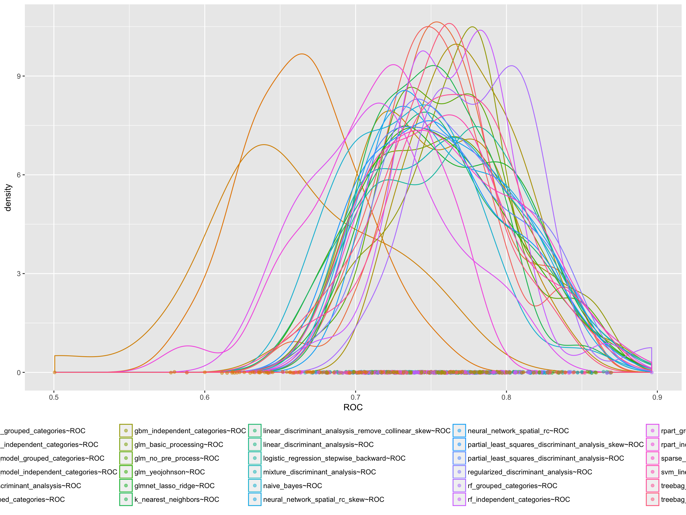

Train Top Models on Entire Training Dataset & Predict on Test Set
-----------------------------------------------------------------

> after using cross-validation to tune, we will take the highest ranked models, retrain the models (with the final tuning parameters) on the entire training set, and predict using the test set.

### Regularized Discriminant Analysis (regularized\_discriminant\_analysis)

> Model Processing: `nzv; center; scale`

                   Length Class      Mode     
    call              5   -none-     call     
    regularization    2   -none-     numeric  
    classes           2   -none-     character
    prior             2   -none-     numeric  
    error.rate        1   -none-     numeric  
    varnames         29   -none-     character
    means            58   -none-     numeric  
    covariances    1682   -none-     numeric  
    covpooled       841   -none-     numeric  
    converged         1   -none-     logical  
    iter              1   -none-     numeric  
    xNames           29   -none-     character
    problemType       1   -none-     character
    tuneValue         2   data.frame list     
    obsLevels         2   -none-     character
    param             0   -none-     list     


    Confusion Matrix and Statistics

              Reference
    Prediction yes no
           yes  16 10
           no   14 60
                                              
                   Accuracy : 0.76            
                     95% CI : (0.6643, 0.8398)
        No Information Rate : 0.7             
        P-Value [Acc > NIR] : 0.1136          
                                              
                      Kappa : 0.4059          
     Mcnemar's Test P-Value : 0.5403          
                                              
                Sensitivity : 0.5333          
                Specificity : 0.8571          
             Pos Pred Value : 0.6154          
             Neg Pred Value : 0.8108          
                 Prevalence : 0.3000          
             Detection Rate : 0.1600          
       Detection Prevalence : 0.2600          
          Balanced Accuracy : 0.6952          
                                              
           'Positive' Class : yes             
                                              

NULL 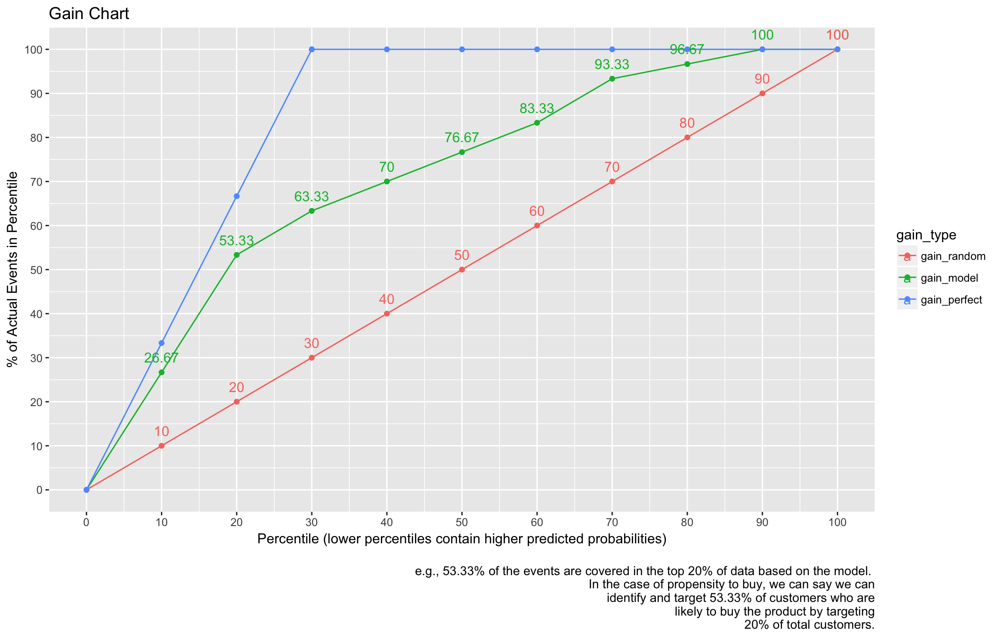

### Generalized Linear Model (logistic\_regression\_stepwise\_backward)

> Model Processing: `nzv; center; scale`


    Call:
    NULL

    Deviance Residuals: 
        Min       1Q   Median       3Q      Max  
    -2.5554  -0.8800   0.4347   0.7691   2.0064  

    Coefficients:
                                      Estimate Std. Error z value             Pr(>|z|)    
    (Intercept)                       1.131640   0.092838  12.189 < 0.0000000000000002 ***
    `checking_balance> 200 DM`        0.245993   0.089350   2.753             0.005903 ** 
    `checking_balance1 - 200 DM`      0.165115   0.091617   1.802             0.071508 .  
    checking_balanceunknown           0.859391   0.111245   7.725   0.0000000000000112 ***
    credit_historygood               -0.283603   0.117919  -2.405             0.016169 *  
    credit_historypoor               -0.120046   0.088977  -1.349             0.177278    
    `credit_historyvery good`        -0.246000   0.088881  -2.768             0.005645 ** 
    `savings_balance100 - 500 DM`     0.001352   0.084900   0.016             0.987294    
    `savings_balance500 - 1000 DM`    0.070428   0.098308   0.716             0.473743    
    savings_balanceunknown            0.312059   0.098696   3.162             0.001568 ** 
    `employment_duration> 7 years`    0.295568   0.116962   2.527             0.011502 *  
    `employment_duration1 - 4 years`  0.103760   0.109846   0.945             0.344866    
    `employment_duration4 - 7 years`  0.372998   0.111061   3.359             0.000784 ***
    employment_durationunemployed     0.059406   0.089472   0.664             0.506715    
    other_creditnone                  0.183429   0.082681   2.219             0.026519 *  
    housingown                        0.178234   0.123668   1.441             0.149520    
    housingrent                      -0.081868   0.122738  -0.667             0.504761    
    phoneTRUE                         0.210035   0.091554   2.294             0.021785 *  
    months_loan_duration             -0.251555   0.107446  -2.341             0.019221 *  
    amount                           -0.409812   0.117708  -3.482             0.000498 ***
    percent_of_income                -0.372375   0.096322  -3.866             0.000111 ***
    existing_loans_count             -0.180763   0.106837  -1.692             0.090654 .  
    ---
    Signif. codes:  0 '***' 0.001 '**' 0.01 '*' 0.05 '.' 0.1 ' ' 1

    (Dispersion parameter for binomial family taken to be 1)

        Null deviance: 1099.56  on 899  degrees of freedom
    Residual deviance:  879.81  on 878  degrees of freedom
    AIC: 923.81

    Number of Fisher Scoring iterations: 5


    Confusion Matrix and Statistics

              Reference
    Prediction yes no
           yes  14  9
           no   16 61
                                              
                   Accuracy : 0.75            
                     95% CI : (0.6534, 0.8312)
        No Information Rate : 0.7             
        P-Value [Acc > NIR] : 0.1631          
                                              
                      Kappa : 0.3622          
     Mcnemar's Test P-Value : 0.2301          
                                              
                Sensitivity : 0.4667          
                Specificity : 0.8714          
             Pos Pred Value : 0.6087          
             Neg Pred Value : 0.7922          
                 Prevalence : 0.3000          
             Detection Rate : 0.1400          
       Detection Prevalence : 0.2300          
          Balanced Accuracy : 0.6690          
                                              
           'Positive' Class : yes             
                                              

NULL 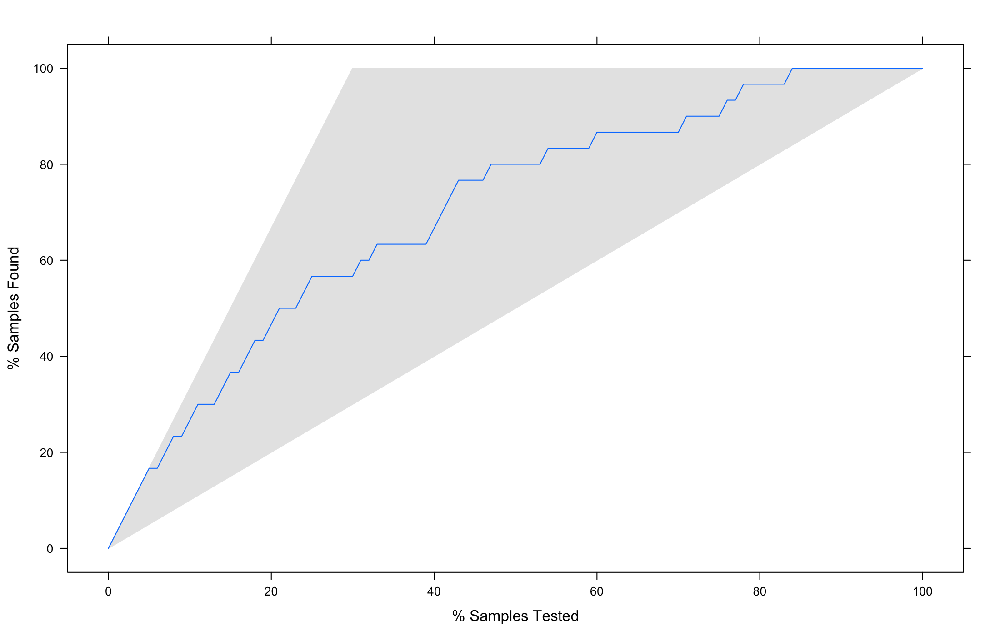

### Sparse Linear Discriminant Analysis (sparse\_lda)

> Model Processing: `nzv; center; scale`

                Length Class      Mode     
    call         5     -none-     call     
    beta        22     -none-     numeric  
    theta        2     -none-     numeric  
    varNames    22     -none-     character
    varIndex    22     -none-     numeric  
    origP        1     -none-     numeric  
    rss          1     -none-     numeric  
    fit          8     lda        list     
    classes      2     -none-     character
    lambda       1     -none-     numeric  
    stop         1     -none-     numeric  
    xNames      29     -none-     character
    problemType  1     -none-     character
    tuneValue    2     data.frame list     
    obsLevels    2     -none-     character
    param        0     -none-     list     

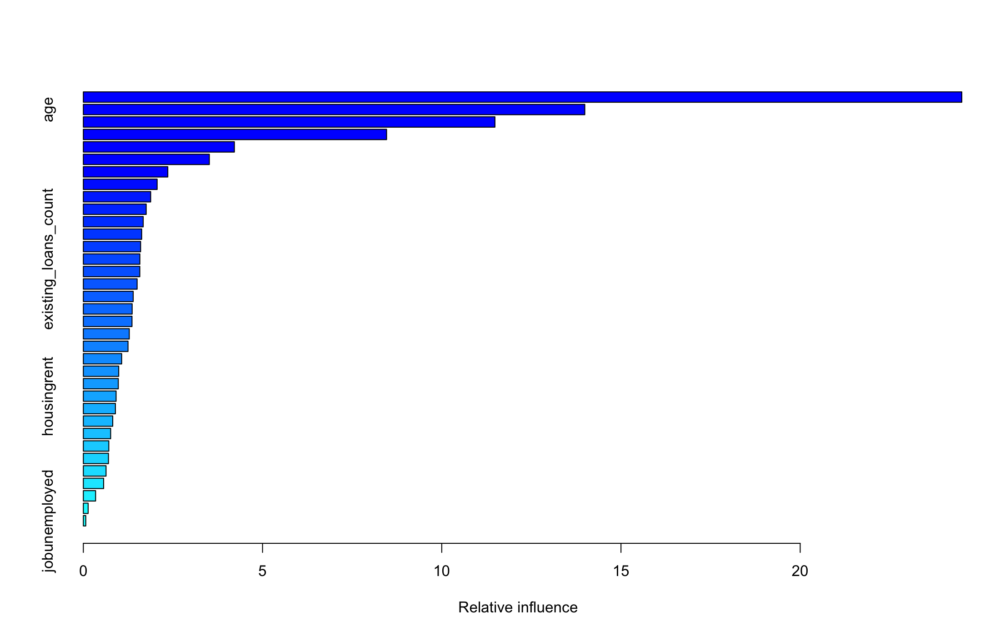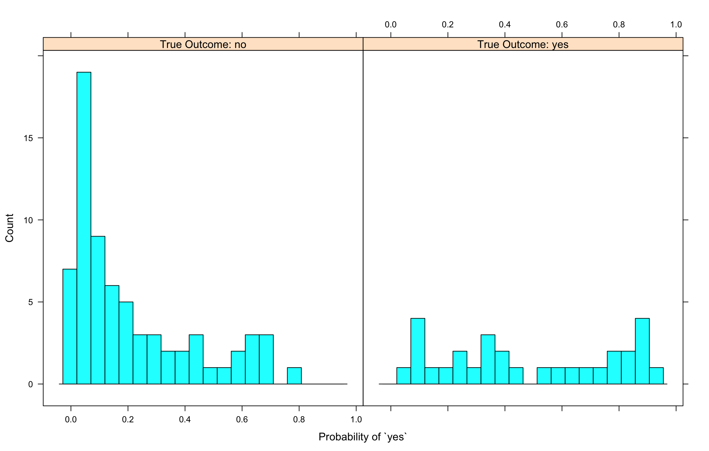

    Confusion Matrix and Statistics

              Reference
    Prediction yes no
           yes  14  9
           no   16 61
                                              
                   Accuracy : 0.75            
                     95% CI : (0.6534, 0.8312)
        No Information Rate : 0.7             
        P-Value [Acc > NIR] : 0.1631          
                                              
                      Kappa : 0.3622          
     Mcnemar's Test P-Value : 0.2301          
                                              
                Sensitivity : 0.4667          
                Specificity : 0.8714          
             Pos Pred Value : 0.6087          
             Neg Pred Value : 0.7922          
                 Prevalence : 0.3000          
             Detection Rate : 0.1400          
       Detection Prevalence : 0.2300          
          Balanced Accuracy : 0.6690          
                                              
           'Positive' Class : yes             
                                              

NULL 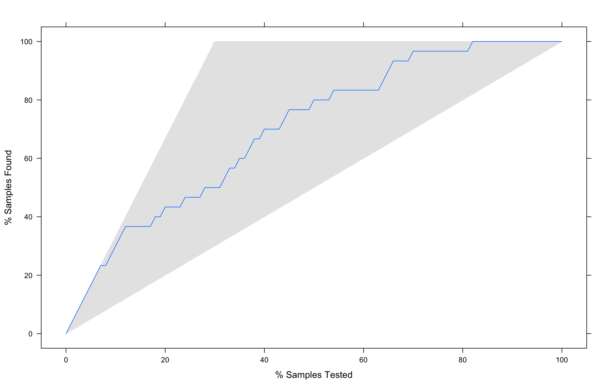

### Neural Network (neural\_network\_spatial\_rc)

> Model Processing: `nzv; center; scale; spatialSign`

    a 29-1-1 network with 32 weights
    options were - entropy fitting  decay=1
      b->h1  i1->h1  i2->h1  i3->h1  i4->h1  i5->h1  i6->h1  i7->h1  i8->h1  i9->h1 i10->h1 i11->h1 i12->h1 i13->h1 i14->h1 i15->h1 i16->h1 i17->h1 i18->h1 i19->h1 i20->h1 i21->h1 
      -0.05    0.71    0.11    2.66   -1.18   -0.54   -0.31   -1.04    0.04   -0.44    0.52   -1.13    0.08    0.34    0.97    0.63    0.03    0.83   -0.32   -0.96    0.03    0.50 
    i22->h1 i23->h1 i24->h1 i25->h1 i26->h1 i27->h1 i28->h1 i29->h1 
       0.78    0.72   -0.38   -0.11    0.02    0.18   -0.10    0.60 
     b->o h1->o 
    -1.18  4.39 

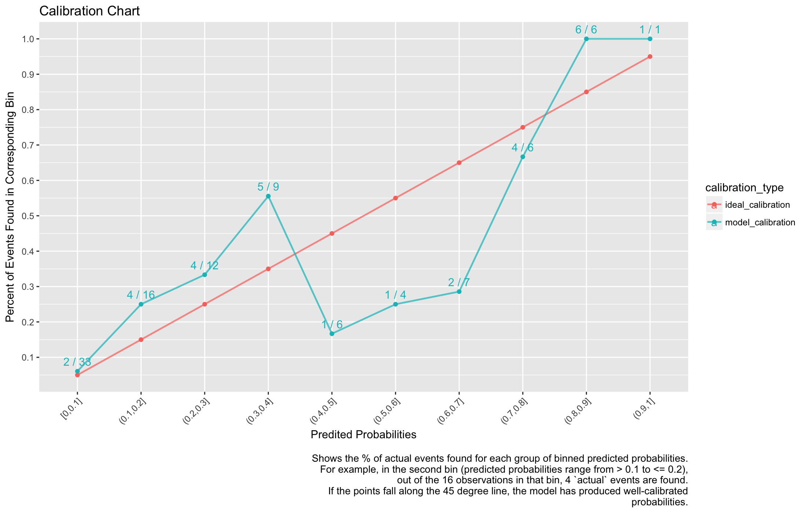

    Confusion Matrix and Statistics

              Reference
    Prediction yes no
           yes  10  5
           no   20 65
                                              
                   Accuracy : 0.75            
                     95% CI : (0.6534, 0.8312)
        No Information Rate : 0.7             
        P-Value [Acc > NIR] : 0.16313         
                                              
                      Kappa : 0.3056          
     Mcnemar's Test P-Value : 0.00511         
                                              
                Sensitivity : 0.3333          
                Specificity : 0.9286          
             Pos Pred Value : 0.6667          
             Neg Pred Value : 0.7647          
                 Prevalence : 0.3000          
             Detection Rate : 0.1000          
       Detection Prevalence : 0.1500          
          Balanced Accuracy : 0.6310          
                                              
           'Positive' Class : yes             
                                              

NULL 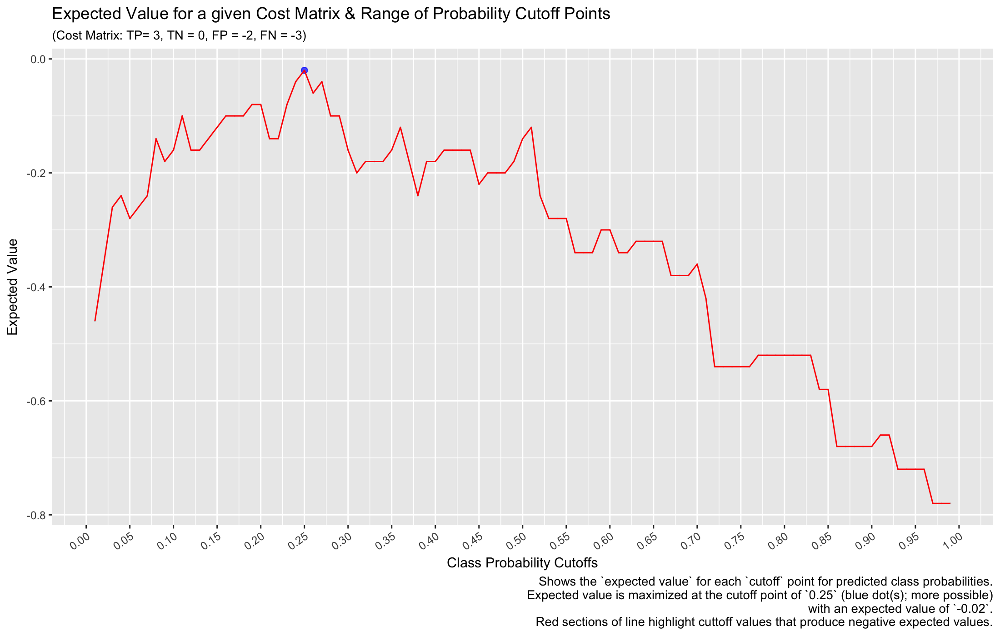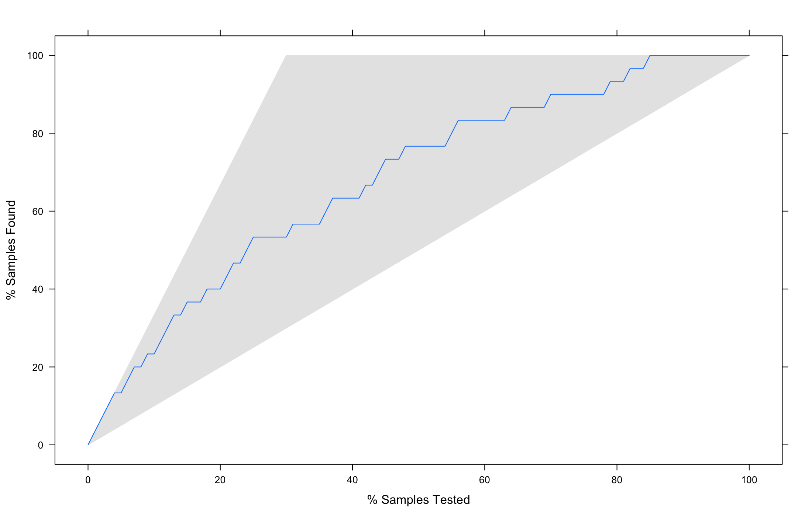

### Support Vector Machines with Polynomial Kernel (svm\_polynomial)

> Model Processing: `center; scale`

    Length  Class   Mode 
         1   ksvm     S4 

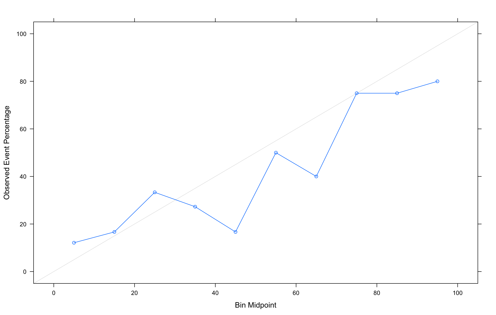

    Confusion Matrix and Statistics

              Reference
    Prediction yes no
           yes  10  5
           no   20 65
                                              
                   Accuracy : 0.75            
                     95% CI : (0.6534, 0.8312)
        No Information Rate : 0.7             
        P-Value [Acc > NIR] : 0.16313         
                                              
                      Kappa : 0.3056          
     Mcnemar's Test P-Value : 0.00511         
                                              
                Sensitivity : 0.3333          
                Specificity : 0.9286          
             Pos Pred Value : 0.6667          
             Neg Pred Value : 0.7647          
                 Prevalence : 0.3000          
             Detection Rate : 0.1000          
       Detection Prevalence : 0.1500          
          Balanced Accuracy : 0.6310          
                                              
           'Positive' Class : yes             
                                              

NULL 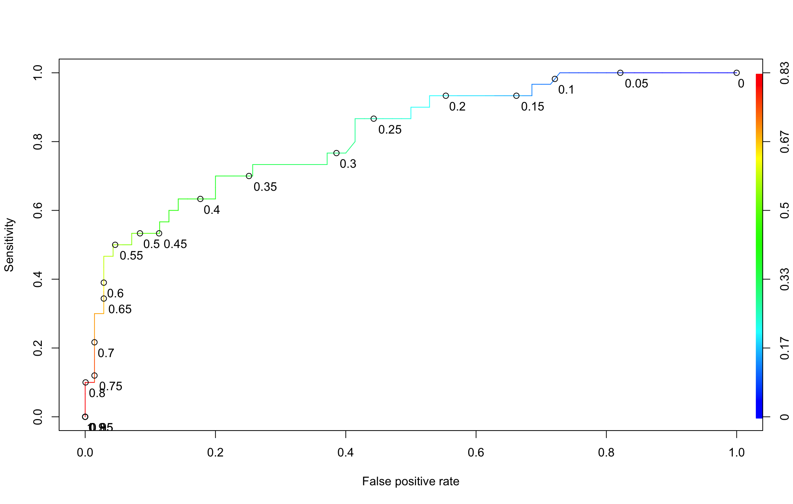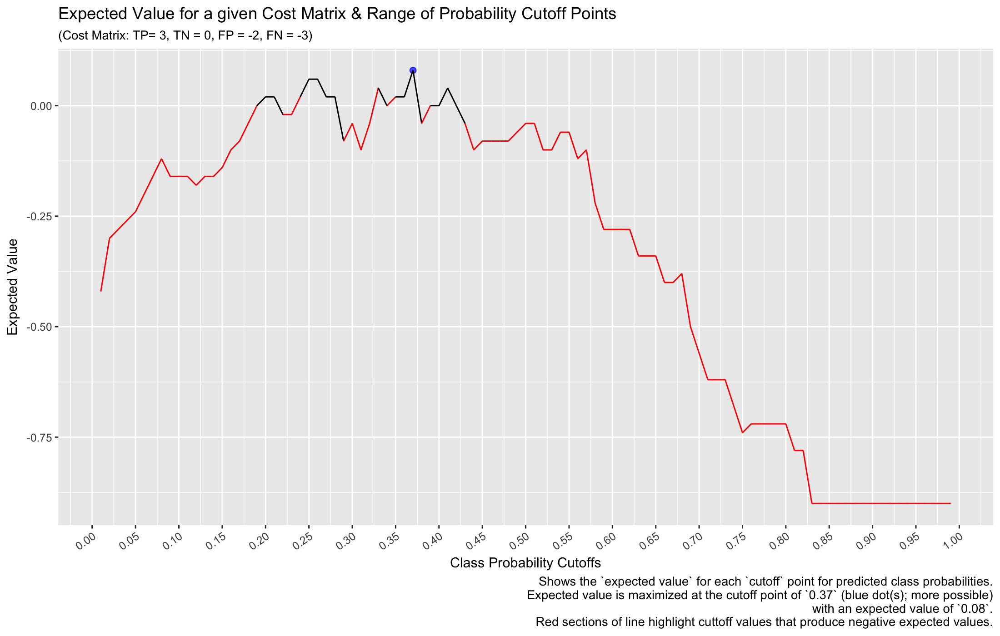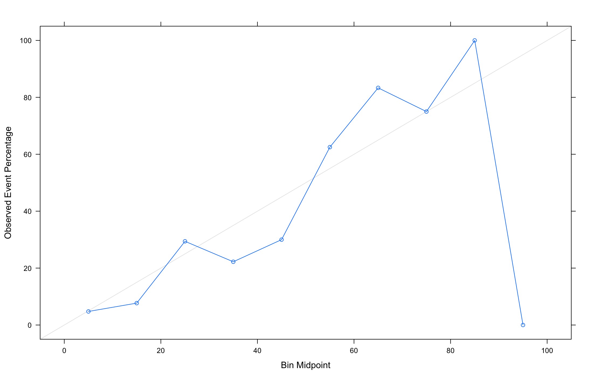
