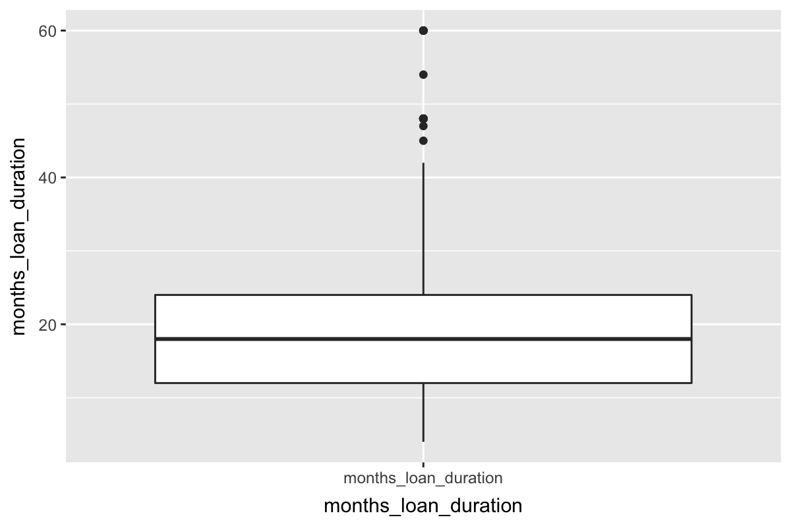
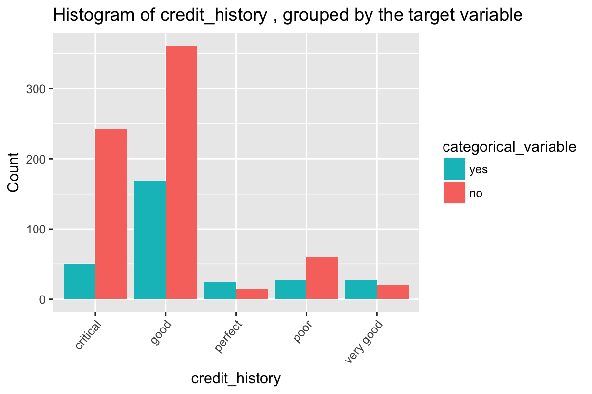
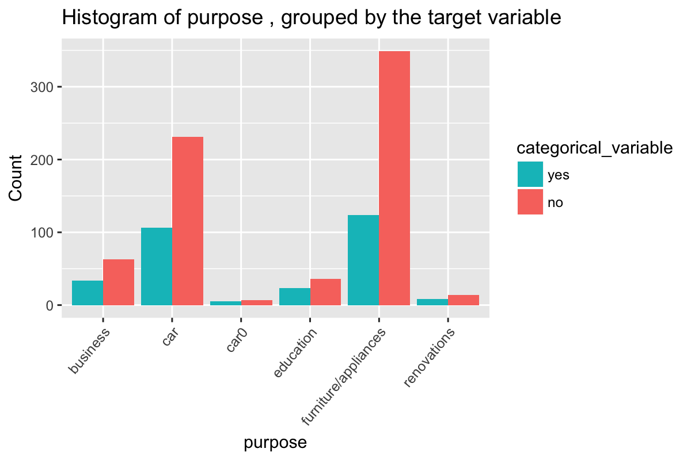
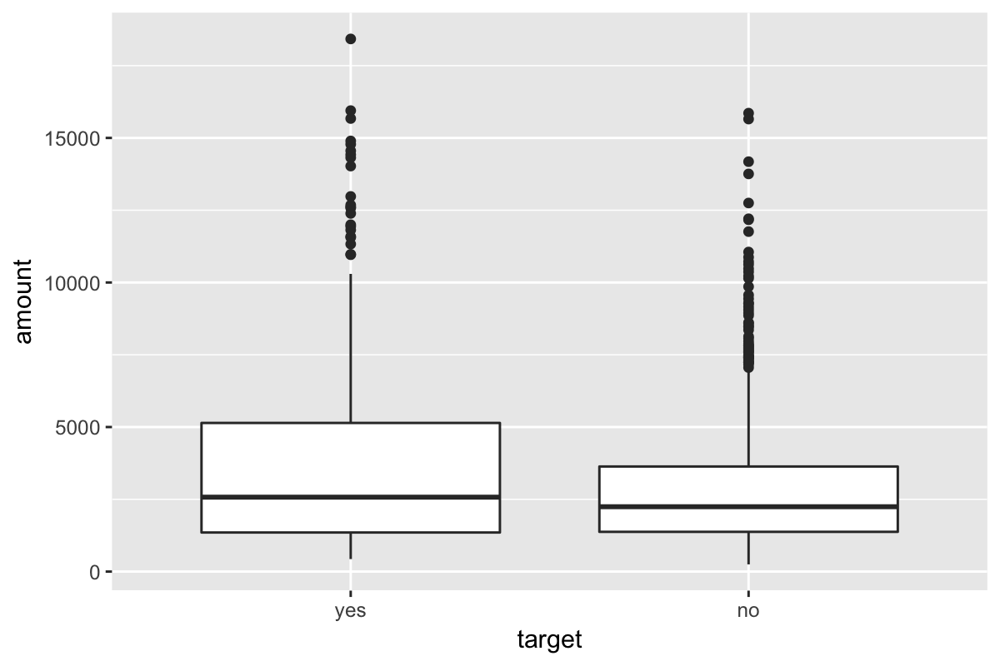
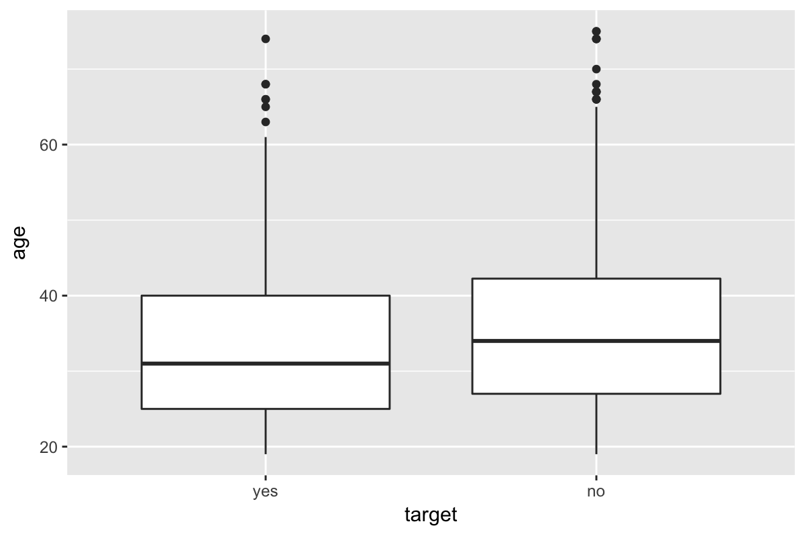

-   [Tuning Parameters](#tuning-parameters)
-   [Dataset](#dataset)
    -   [Summary](#summary)
    -   [Skewness](#skewness)
    -   [Outliers](#outliers)
    -   [Correlation & Collinearity](#correlation-collinearity)
        -   [Collinearity Removal](#collinearity-removal)
    -   [Graphs](#graphs)
        -   [checking\_balance](#checking_balance)
        -   [months\_loan\_duration](#months_loan_duration)
        -   [credit\_history](#credit_history)
        -   [purpose](#purpose)
        -   [amount](#amount)
        -   [savings\_balance](#savings_balance)
        -   [employment\_duration](#employment_duration)
        -   [percent\_of\_income](#percent_of_income)
        -   [years\_at\_residence](#years_at_residence)
        -   [age](#age)
        -   [other\_credit](#other_credit)
        -   [housing](#housing)
        -   [existing\_loans\_count](#existing_loans_count)
        -   [job](#job)
        -   [dependents](#dependents)
        -   [phone](#phone)
-   [Spot-Check](#spot-check)

Tuning Parameters
=================

``` r
# train/test set
training_percentage <- 0.90
```

Dataset
=======

> Assumes the dataset has factors for strings; logical for TRUE/FALSE; `target` for outcome variable

Summary
-------

> Total predictors: `16`

> Total data-points/rows: `1000`

> Number of training data-points: `900`

Rule of thumbs for dimensions (Probabilistic and Statistical Modeling in Computer Science; pg 430):

> r &lt; sqrt(n); where r is the number of predictors and sqrt(n) is the square root of the sample size (`32`): `TRUE`

> r &lt; sqrt(n\_t); where r is the number of predictors and sqrt(n\_t) is the square root of the training set size (`30`): `TRUE`

    ##  target      checking_balance months_loan_duration   credit_history                 purpose        amount           savings_balance  employment_duration percent_of_income
    ##  yes:300   < 0 DM    :274     Min.   : 4.0         critical :293    business            : 97   Min.   :  250   < 100 DM     :603    < 1 year   :172      Min.   :1.000    
    ##  no :700   > 200 DM  : 63     1st Qu.:12.0         good     :530    car                 :337   1st Qu.: 1366   > 1000 DM    : 48    > 7 years  :253      1st Qu.:2.000    
    ##            1 - 200 DM:269     Median :18.0         perfect  : 40    car0                : 12   Median : 2320   100 - 500 DM :103    1 - 4 years:339      Median :3.000    
    ##            unknown   :394     Mean   :20.9         poor     : 88    education           : 59   Mean   : 3271   500 - 1000 DM: 63    4 - 7 years:174      Mean   :2.973    
    ##                               3rd Qu.:24.0         very good: 49    furniture/appliances:473   3rd Qu.: 3972   unknown      :183    unemployed : 62      3rd Qu.:4.000    
    ##                               Max.   :72.0                          renovations         : 22   Max.   :18424                                             Max.   :4.000    
    ##  years_at_residence      age        other_credit  housing    existing_loans_count         job        dependents      phone    
    ##  Min.   :1.000      Min.   :19.00   bank :139    other:108   Min.   :1.000        management:148   Min.   :1.000   FALSE:596  
    ##  1st Qu.:2.000      1st Qu.:27.00   none :814    own  :713   1st Qu.:1.000        skilled   :630   1st Qu.:1.000   TRUE :404  
    ##  Median :3.000      Median :33.00   store: 47    rent :179   Median :1.000        unemployed: 22   Median :1.000              
    ##  Mean   :2.845      Mean   :35.55                            Mean   :1.407        unskilled :200   Mean   :1.155              
    ##  3rd Qu.:4.000      3rd Qu.:42.00                            3rd Qu.:2.000                         3rd Qu.:1.000              
    ##  Max.   :4.000      Max.   :75.00                            Max.   :4.000                         Max.   :2.000

Skewness
--------

Note: `Box-Cox` can only be applied to sets (i.e. predictors) where all values are `> 0`. So some/most/all? `NA`s will be from that limiation.

| column                 |  boxcox\_skewness|
|:-----------------------|-----------------:|
| target                 |                NA|
| checking\_balance      |                NA|
| months\_loan\_duration |         1.0909038|
| credit\_history        |                NA|
| purpose                |                NA|
| amount                 |         1.9437827|
| savings\_balance       |                NA|
| employment\_duration   |                NA|
| percent\_of\_income    |        -0.5297551|
| years\_at\_residence   |        -0.2717526|
| age                    |         1.0176791|
| other\_credit          |                NA|
| housing                |                NA|
| existing\_loans\_count |         1.2687608|
| job                    |                NA|
| dependents             |         1.9037202|
| phone                  |                NA|

Outliers
--------

| columns                | lower\_outlier\_count | upper\_outlier\_count |
|:-----------------------|:----------------------|:----------------------|
| months\_loan\_duration | 0                     | 16                    |
| amount                 | 0                     | 50                    |
| percent\_of\_income    | 0                     | 0                     |
| years\_at\_residence   | 0                     | 0                     |
| age                    | 0                     | 6                     |
| existing\_loans\_count | 0                     | 0                     |
| dependents             | 0                     | 155                   |

Correlation & Collinearity
--------------------------


### Collinearity Removal

#### Caret's `findCorrelation`

Shows caret's recommendation of removing collinear columns based on correlation threshold of `0.9`

> columns recommended for removal: \`\`

> final columns recommended: `target, checking_balance, months_loan_duration, credit_history, purpose, amount, savings_balance, employment_duration, percent_of_income, years_at_residence, age, other_credit, housing, existing_loans_count, job, dependents, phone`

#### Heuristic

This method is described in APM pg 47 as the following steps

-   calculate the correlation matrix of predictors
-   determine the two predictors associated with the largest absolute pairwise correlation (call them predictors `A` and `B`)
-   Determine the average correlation between `A` and the other variables.
    -   Do the same for `B`
-   If `A` has a larger average correlation, remove it; otherwise, remove predcitor `B`
-   Repeat until no absolute correlations are above the threshold (`0.9`)

> columns recommended for removal: \`\`

> final columns recommended: `months_loan_duration, amount, percent_of_income, years_at_residence, age, existing_loans_count, dependents, target, checking_balance, credit_history, purpose, savings_balance, employment_duration, other_credit, housing, job, phone`

Graphs
------

### checking\_balance


> Chi-Square p-value: `0`

### months\_loan\_duration


statistically different means (check assumptions for t-test): TRUE

The Wilcoxon-Matt-Whitney test (or Wilcoxon rank sum test, or Mann-Whitney U-test) is used when is asked to compare the means of two groups that do not follow a normal distribution: it is a non-parametrical test. (<https://www.r-bloggers.com/wilcoxon-mann-whitney-rank-sum-test-or-test-u/>)

statistically different means (Wilcoxon-Matt-Whitney): TRUE

### credit\_history



> Chi-Square p-value: `0`

### purpose


    Warning in chisq.test(count_table): Chi-squared approximation may be incorrect



> Chi-Square p-value: `0.145`

### amount



statistically different means (check assumptions for t-test): TRUE

The Wilcoxon-Matt-Whitney test (or Wilcoxon rank sum test, or Mann-Whitney U-test) is used when is asked to compare the means of two groups that do not follow a normal distribution: it is a non-parametrical test. (<https://www.r-bloggers.com/wilcoxon-mann-whitney-rank-sum-test-or-test-u/>)

statistically different means (Wilcoxon-Matt-Whitney): TRUE

### savings\_balance


> Chi-Square p-value: `0`

### employment\_duration



> Chi-Square p-value: `0.001`

### percent\_of\_income


statistically different means (check assumptions for t-test): TRUE

The Wilcoxon-Matt-Whitney test (or Wilcoxon rank sum test, or Mann-Whitney U-test) is used when is asked to compare the means of two groups that do not follow a normal distribution: it is a non-parametrical test. (<https://www.r-bloggers.com/wilcoxon-mann-whitney-rank-sum-test-or-test-u/>)

statistically different means (Wilcoxon-Matt-Whitney): TRUE

### years\_at\_residence


statistically different means (check assumptions for t-test): FALSE

The Wilcoxon-Matt-Whitney test (or Wilcoxon rank sum test, or Mann-Whitney U-test) is used when is asked to compare the means of two groups that do not follow a normal distribution: it is a non-parametrical test. (<https://www.r-bloggers.com/wilcoxon-mann-whitney-rank-sum-test-or-test-u/>)

statistically different means (Wilcoxon-Matt-Whitney): FALSE

### age


statistically different means (check assumptions for t-test): TRUE

The Wilcoxon-Matt-Whitney test (or Wilcoxon rank sum test, or Mann-Whitney U-test) is used when is asked to compare the means of two groups that do not follow a normal distribution: it is a non-parametrical test. (<https://www.r-bloggers.com/wilcoxon-mann-whitney-rank-sum-test-or-test-u/>)

statistically different means (Wilcoxon-Matt-Whitney): TRUE

### other\_credit


> Chi-Square p-value: `0.002`

### housing


> Chi-Square p-value: `0`

### existing\_loans\_count


statistically different means (check assumptions for t-test): FALSE

The Wilcoxon-Matt-Whitney test (or Wilcoxon rank sum test, or Mann-Whitney U-test) is used when is asked to compare the means of two groups that do not follow a normal distribution: it is a non-parametrical test. (<https://www.r-bloggers.com/wilcoxon-mann-whitney-rank-sum-test-or-test-u/>)

statistically different means (Wilcoxon-Matt-Whitney): FALSE

### job


> Chi-Square p-value: `0.597`

### dependents



statistically different means (check assumptions for t-test): FALSE

The Wilcoxon-Matt-Whitney test (or Wilcoxon rank sum test, or Mann-Whitney U-test) is used when is asked to compare the means of two groups that do not follow a normal distribution: it is a non-parametrical test. (<https://www.r-bloggers.com/wilcoxon-mann-whitney-rank-sum-test-or-test-u/>)

statistically different means (Wilcoxon-Matt-Whitney): FALSE

### phone


> Chi-Square p-value: `0.279`

Spot-Check
==========

    ## 
    ## yes  no 
    ## 0.3 0.7

    ## 
    ## yes  no 
    ## 0.3 0.7

-   Note: e.g. if there are rare values at the target extremes (lows/highs), the train and especially the test set might not be training/testing on them. Is the test set representative? If the test set doesn't have as extreme values, it can even predict better (e.g. lower RMSE higher Rsquared) than the average Cross Validation given on training because it's not using those extreme values.

> used `90%` of data for `training` set (`900`), and `10%` for `test` set (`100`).

    ##                 Length Class  Mode     
    ## call               4   -none- call     
    ## type               1   -none- character
    ## predicted        900   factor numeric  
    ## err.rate        6000   -none- numeric  
    ## confusion          6   -none- numeric  
    ## votes           1800   matrix numeric  
    ## oob.times        900   -none- numeric  
    ## classes            2   -none- character
    ## importance        16   -none- numeric  
    ## importanceSD       0   -none- NULL     
    ## localImportance    0   -none- NULL     
    ## proximity          0   -none- NULL     
    ## ntree              1   -none- numeric  
    ## mtry               1   -none- numeric  
    ## forest            14   -none- list     
    ## y                900   factor numeric  
    ## test               0   -none- NULL     
    ## inbag              0   -none- NULL     
    ## terms              3   terms  call


    ## Confusion Matrix and Statistics
    ## 
    ##           Reference
    ## Prediction yes no
    ##        yes  15  4
    ##        no   15 66
    ##                                           
    ##                Accuracy : 0.81            
    ##                  95% CI : (0.7193, 0.8816)
    ##     No Information Rate : 0.7             
    ##     P-Value [Acc > NIR] : 0.008887        
    ##                                           
    ##                   Kappa : 0.4947          
    ##  Mcnemar's Test P-Value : 0.021781        
    ##                                           
    ##             Sensitivity : 0.5000          
    ##             Specificity : 0.9429          
    ##          Pos Pred Value : 0.7895          
    ##          Neg Pred Value : 0.8148          
    ##              Prevalence : 0.3000          
    ##          Detection Rate : 0.1500          
    ##    Detection Prevalence : 0.1900          
    ##       Balanced Accuracy : 0.7214          
    ##                                           
    ##        'Positive' Class : yes             
    ## 


    ## [1] 0.8235714


    ## Loading required package: klaR

    ## Loading required package: MASS

    ## 
    ## Attaching package: 'MASS'

    ## The following object is masked from 'package:dplyr':
    ## 
    ##     select


