-   [Tuning Parameters](#tuning-parameters)
-   [Dataset](#dataset)
    -   [Summary](#summary)
    -   [Skewness](#skewness)
    -   [Outliers](#outliers)
    -   [Correlation & Collinearity](#correlation-collinearity)
        -   [Correlation](#correlation)
        -   [Collinearity Removal](#collinearity-removal)
    -   [Graphs](#graphs)
        -   [checking\_balance](#checking_balance)
        -   [months\_loan\_duration](#months_loan_duration)
        -   [credit\_history](#credit_history)
        -   [purpose](#purpose)
        -   [amount](#amount)
        -   [savings\_balance](#savings_balance)
        -   [employment\_duration](#employment_duration)
        -   [percent\_of\_income](#percent_of_income)
        -   [years\_at\_residence](#years_at_residence)
        -   [age](#age)
        -   [other\_credit](#other_credit)
        -   [housing](#housing)
        -   [existing\_loans\_count](#existing_loans_count)
        -   [job](#job)
        -   [dependents](#dependents)
        -   [phone](#phone)
-   [Spot-Check](#spot-check)
    -   [Class Balance](#class-balance)
        -   [Training Data](#training-data)
        -   [Test](#test)
        -   [Logistic Regression - no pre processing](#logistic-regression---no-pre-processing)
        -   [Logistic Regression - basic pre-processing](#logistic-regression---basic-pre-processing)
        -   [Logistic Regression - remove collinear data - based on caret's recommendation](#logistic-regression---remove-collinear-data---based-on-carets-recommendation)
        -   [Logistic Regression - remove collinear data - based on calculation](#logistic-regression---remove-collinear-data---based-on-calculation)
        -   [Logistic Regression - remove collinear data - based on calculation](#logistic-regression---remove-collinear-data---based-on-calculation-1)
    -   [Resamples & Top Models](#resamples-top-models)
        -   [Resamples](#resamples)
-   [Train Top Models on Entire Training Dataset & Predict on Test Set](#train-top-models-on-entire-training-dataset-predict-on-test-set)

Tuning Parameters
=================

``` r
# train/test set
training_percentage <- 0.90

# cross validation
cross_validation_num_folds <- 10
cross_validation_num_repeats <- 3
```

Dataset
=======

> Assumes the dataset has factors for strings; logical for TRUE/FALSE; `target` for outcome variable

Summary
-------

> Total predictors: `16`

> Total data-points/rows: `1000`

> Number of training data-points: `900`

Rule of thumbs for dimensions (Probabilistic and Statistical Modeling in Computer Science; pg 430):

> r &lt; sqrt(n); where r is the number of predictors and sqrt(n) is the square root of the sample size (`32`): `TRUE`

> r &lt; sqrt(n\_t); where r is the number of predictors and sqrt(n\_t) is the square root of the training set size (`30`): `TRUE`

    ##  target      checking_balance months_loan_duration   credit_history                 purpose        amount           savings_balance  employment_duration percent_of_income
    ##  yes:300   < 0 DM    :274     Min.   : 4.0         critical :293    business            : 97   Min.   :  250   < 100 DM     :603    < 1 year   :172      Min.   :1.000    
    ##  no :700   > 200 DM  : 63     1st Qu.:12.0         good     :530    car                 :337   1st Qu.: 1366   > 1000 DM    : 48    > 7 years  :253      1st Qu.:2.000    
    ##            1 - 200 DM:269     Median :18.0         perfect  : 40    car0                : 12   Median : 2320   100 - 500 DM :103    1 - 4 years:339      Median :3.000    
    ##            unknown   :394     Mean   :20.9         poor     : 88    education           : 59   Mean   : 3271   500 - 1000 DM: 63    4 - 7 years:174      Mean   :2.973    
    ##                               3rd Qu.:24.0         very good: 49    furniture/appliances:473   3rd Qu.: 3972   unknown      :183    unemployed : 62      3rd Qu.:4.000    
    ##                               Max.   :72.0                          renovations         : 22   Max.   :18424                                             Max.   :4.000    
    ##  years_at_residence      age        other_credit  housing    existing_loans_count         job        dependents      phone    
    ##  Min.   :1.000      Min.   :19.00   bank :139    other:108   Min.   :1.000        management:148   Min.   :1.000   FALSE:596  
    ##  1st Qu.:2.000      1st Qu.:27.00   none :814    own  :713   1st Qu.:1.000        skilled   :630   1st Qu.:1.000   TRUE :404  
    ##  Median :3.000      Median :33.00   store: 47    rent :179   Median :1.000        unemployed: 22   Median :1.000              
    ##  Mean   :2.845      Mean   :35.55                            Mean   :1.407        unskilled :200   Mean   :1.155              
    ##  3rd Qu.:4.000      3rd Qu.:42.00                            3rd Qu.:2.000                         3rd Qu.:1.000              
    ##  Max.   :4.000      Max.   :75.00                            Max.   :4.000                         Max.   :2.000

Skewness
--------

Note: `Box-Cox` can only be applied to sets (i.e. predictors) where all values are `> 0`. So some/most/all? `NA`s will be from that limiation.

| column                 |  boxcox\_skewness|
|:-----------------------|-----------------:|
| target                 |                NA|
| checking\_balance      |                NA|
| months\_loan\_duration |         1.0909038|
| credit\_history        |                NA|
| purpose                |                NA|
| amount                 |         1.9437827|
| savings\_balance       |                NA|
| employment\_duration   |                NA|
| percent\_of\_income    |        -0.5297551|
| years\_at\_residence   |        -0.2717526|
| age                    |         1.0176791|
| other\_credit          |                NA|
| housing                |                NA|
| existing\_loans\_count |         1.2687608|
| job                    |                NA|
| dependents             |         1.9037202|
| phone                  |                NA|

Outliers
--------

| columns                | lower\_outlier\_count | upper\_outlier\_count |
|:-----------------------|:----------------------|:----------------------|
| months\_loan\_duration | 0                     | 16                    |
| amount                 | 0                     | 50                    |
| percent\_of\_income    | 0                     | 0                     |
| years\_at\_residence   | 0                     | 0                     |
| age                    | 0                     | 6                     |
| existing\_loans\_count | 0                     | 0                     |
| dependents             | 0                     | 155                   |

Correlation & Collinearity
--------------------------

### Correlation


### Collinearity Removal

#### Caret's `findCorrelation`

Shows caret's recommendation of removing collinear columns based on correlation threshold of `0.9`

> columns recommended for removal: \`\`

> final columns recommended: `target, checking_balance, months_loan_duration, credit_history, purpose, amount, savings_balance, employment_duration, percent_of_income, years_at_residence, age, other_credit, housing, existing_loans_count, job, dependents, phone`

#### Heuristic

This method is described in APM pg 47 as the following steps

-   calculate the correlation matrix of predictors
-   determine the two predictors associated with the largest absolute pairwise correlation (call them predictors `A` and `B`)
-   Determine the average correlation between `A` and the other variables.
    -   Do the same for `B`
-   If `A` has a larger average correlation, remove it; otherwise, remove predcitor `B`
-   Repeat until no absolute correlations are above the threshold (`0.9`)

> columns recommended for removal: \`\`

> final columns recommended: `months_loan_duration, amount, percent_of_income, years_at_residence, age, existing_loans_count, dependents, target, checking_balance, credit_history, purpose, savings_balance, employment_duration, other_credit, housing, job, phone`

Graphs
------

### checking\_balance


> Chi-Square p-value: `0`

### months\_loan\_duration


statistically different means (check assumptions for t-test): TRUE

The Wilcoxon-Matt-Whitney test (or Wilcoxon rank sum test, or Mann-Whitney U-test) is used when is asked to compare the means of two groups that do not follow a normal distribution: it is a non-parametrical test. (<https://www.r-bloggers.com/wilcoxon-mann-whitney-rank-sum-test-or-test-u/>)

statistically different means (Wilcoxon-Matt-Whitney): TRUE

### credit\_history


> Chi-Square p-value: `0`

### purpose


    Warning in chisq.test(count_table): Chi-squared approximation may be incorrect


> Chi-Square p-value: `0.145`

### amount


statistically different means (check assumptions for t-test): TRUE

The Wilcoxon-Matt-Whitney test (or Wilcoxon rank sum test, or Mann-Whitney U-test) is used when is asked to compare the means of two groups that do not follow a normal distribution: it is a non-parametrical test. (<https://www.r-bloggers.com/wilcoxon-mann-whitney-rank-sum-test-or-test-u/>)

statistically different means (Wilcoxon-Matt-Whitney): TRUE

### savings\_balance


> Chi-Square p-value: `0`

### employment\_duration


> Chi-Square p-value: `0.001`

### percent\_of\_income

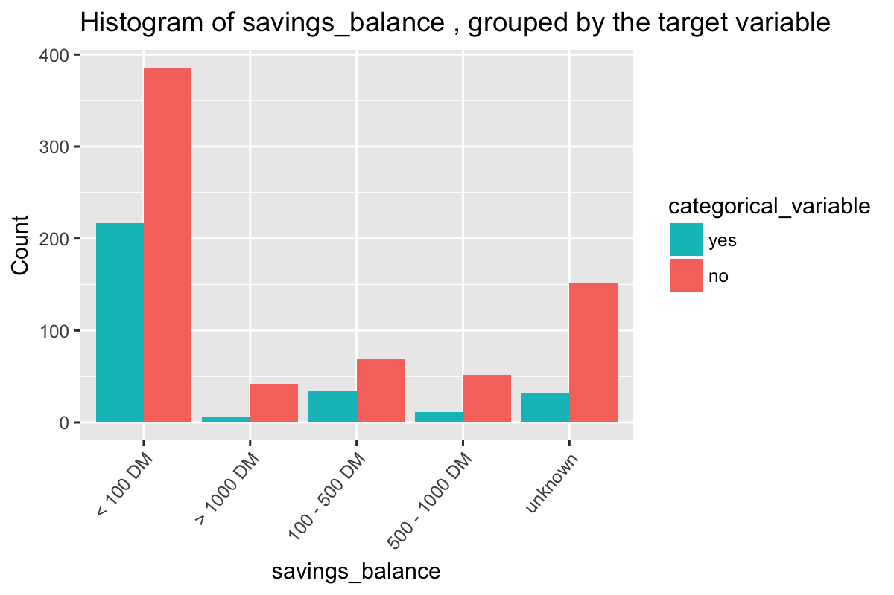

statistically different means (check assumptions for t-test): TRUE

The Wilcoxon-Matt-Whitney test (or Wilcoxon rank sum test, or Mann-Whitney U-test) is used when is asked to compare the means of two groups that do not follow a normal distribution: it is a non-parametrical test. (<https://www.r-bloggers.com/wilcoxon-mann-whitney-rank-sum-test-or-test-u/>)

statistically different means (Wilcoxon-Matt-Whitney): TRUE

### years\_at\_residence


statistically different means (check assumptions for t-test): FALSE

The Wilcoxon-Matt-Whitney test (or Wilcoxon rank sum test, or Mann-Whitney U-test) is used when is asked to compare the means of two groups that do not follow a normal distribution: it is a non-parametrical test. (<https://www.r-bloggers.com/wilcoxon-mann-whitney-rank-sum-test-or-test-u/>)

statistically different means (Wilcoxon-Matt-Whitney): FALSE

### age


statistically different means (check assumptions for t-test): TRUE

The Wilcoxon-Matt-Whitney test (or Wilcoxon rank sum test, or Mann-Whitney U-test) is used when is asked to compare the means of two groups that do not follow a normal distribution: it is a non-parametrical test. (<https://www.r-bloggers.com/wilcoxon-mann-whitney-rank-sum-test-or-test-u/>)

statistically different means (Wilcoxon-Matt-Whitney): TRUE

### other\_credit


> Chi-Square p-value: `0.002`

### housing


> Chi-Square p-value: `0`

### existing\_loans\_count


statistically different means (check assumptions for t-test): FALSE

The Wilcoxon-Matt-Whitney test (or Wilcoxon rank sum test, or Mann-Whitney U-test) is used when is asked to compare the means of two groups that do not follow a normal distribution: it is a non-parametrical test. (<https://www.r-bloggers.com/wilcoxon-mann-whitney-rank-sum-test-or-test-u/>)

statistically different means (Wilcoxon-Matt-Whitney): FALSE

### job


> Chi-Square p-value: `0.597`

### dependents


statistically different means (check assumptions for t-test): FALSE

The Wilcoxon-Matt-Whitney test (or Wilcoxon rank sum test, or Mann-Whitney U-test) is used when is asked to compare the means of two groups that do not follow a normal distribution: it is a non-parametrical test. (<https://www.r-bloggers.com/wilcoxon-mann-whitney-rank-sum-test-or-test-u/>)

statistically different means (Wilcoxon-Matt-Whitney): FALSE

### phone


> Chi-Square p-value: `0.279`

Spot-Check
==========

Class Balance
-------------

Make sure class balance is even amount training/test datasets.

### Training Data

    ## 
    ## yes  no 
    ## 0.3 0.7

### Test

    ## 
    ## yes  no 
    ## 0.3 0.7

> Using `10`-fold cross-validation with `3` repeats, using the `ROC` statistic to evaluate each model.

> used `90%` of data for `training` set (`900`), and `10%` for `test` set (`100`).

### Logistic Regression - no pre processing

> NOTE that for logistic regression (GLM), caret's `train()` (because of `glm()`) uses the second-level factor value as the success/postive event but `resamples()` uses the first-level as the success event. The result is either the `sensitivity` and `specificity` for `resamples()` will be reversed (and so I would be unable to compare apples to apples with other models), or I need to keep the first-level factor as the positive event (the default approach), which will mean that THE COEFFICIENTS WILL BE REVERSED, MAKIN THE MODEL RELATIVE TO THE NEGATIVE EVENT. I chose the latter, in order to compare models below, but this means that when using the logistic model to explain the data, the reader needs to mentally reverse the direction/sign of the coefficients, or correct the problem in the final stages of model building.

``` r
if(refresh_models)
{
    check_data(classification_train, validate_n_p = TRUE)
    set.seed(custom_seed)
    #model_glm_no_pre_processing <- train(target ~ ., data=classification_train %>% mutate(target = factor(target, levels = c('no', 'yes'))), method='glm', metric=metric, trControl=train_control)
    model_glm_no_pre_processing <- train(target ~ ., data=classification_train, method='glm', metric=metric, trControl=train_control)
    saveRDS(model_glm_no_pre_processing, file = './classification_data/model_glm_no_pre_processing.RDS')
} else{
    model_glm_no_pre_processing <- readRDS('./classification_data/model_glm_no_pre_processing.RDS')
}
summary(model_glm_no_pre_processing)
```

    ## 
    ## Call:
    ## NULL
    ## 
    ## Deviance Residuals: 
    ##     Min       1Q   Median       3Q      Max  
    ## -2.6364  -0.7956   0.4122   0.7664   1.8864  
    ## 
    ## Coefficients:
    ##                                     Estimate  Std. Error z value          Pr(>|z|)    
    ## (Intercept)                       1.67233497  0.93888105   1.781          0.074880 .  
    ## `checking_balance> 200 DM`        0.91202032  0.36959975   2.468          0.013603 *  
    ## `checking_balance1 - 200 DM`      0.36146669  0.21675128   1.668          0.095384 .  
    ## checking_balanceunknown           1.69919542  0.23318347   7.287 0.000000000000317 ***
    ## months_loan_duration             -0.01909034  0.00930934  -2.051          0.040300 *  
    ## credit_historygood               -0.83854132  0.26057700  -3.218          0.001291 ** 
    ## credit_historyperfect            -1.18300647  0.42783664  -2.765          0.005691 ** 
    ## credit_historypoor               -0.70792254  0.34560901  -2.048          0.040527 *  
    ## `credit_historyvery good`        -1.43539610  0.42810208  -3.353          0.000800 ***
    ## purposecar                       -0.14052327  0.32598325  -0.431          0.666414    
    ## purposecar0                       0.63233919  0.81457907   0.776          0.437585    
    ## purposeeducation                 -0.58632030  0.43971583  -1.333          0.182398    
    ## `purposefurniture/appliances`     0.16610147  0.31881865   0.521          0.602373    
    ## purposerenovations               -0.68269967  0.60731250  -1.124          0.260957    
    ## amount                           -0.00013829  0.00004389  -3.151          0.001627 ** 
    ## `savings_balance> 1000 DM`        1.03432320  0.51321912   2.015          0.043867 *  
    ## `savings_balance100 - 500 DM`     0.13185558  0.28429005   0.464          0.642786    
    ## `savings_balance500 - 1000 DM`    0.27415120  0.41264732   0.664          0.506452    
    ## savings_balanceunknown            0.90758459  0.26502755   3.424          0.000616 ***
    ## `employment_duration> 7 years`    0.51216659  0.29605002   1.730          0.083630 .  
    ## `employment_duration1 - 4 years`  0.16207344  0.23846600   0.680          0.496726    
    ## `employment_duration4 - 7 years`  0.92790647  0.30112909   3.081          0.002060 ** 
    ## employment_durationunemployed     0.14840842  0.43655991   0.340          0.733894    
    ## percent_of_income                -0.34774866  0.08869354  -3.921 0.000088259512881 ***
    ## years_at_residence               -0.00385951  0.08729784  -0.044          0.964736    
    ## age                               0.01108220  0.00927862   1.194          0.232329    
    ## other_creditnone                  0.52544326  0.24108458   2.179          0.029295 *  
    ## other_creditstore                 0.12816587  0.42389741   0.302          0.762384    
    ## housingown                        0.27205220  0.30231677   0.900          0.368178    
    ## housingrent                      -0.25445634  0.34509987  -0.737          0.460915    
    ## existing_loans_count             -0.33507655  0.19199533  -1.745          0.080944 .  
    ## jobskilled                        0.04584693  0.28901415   0.159          0.873959    
    ## jobunemployed                     0.09476193  0.65453976   0.145          0.884887    
    ## jobunskilled                      0.14669504  0.35145618   0.417          0.676392    
    ## dependents                       -0.11052559  0.24712936  -0.447          0.654703    
    ## phoneTRUE                         0.41866313  0.20925782   2.001          0.045424 *  
    ## ---
    ## Signif. codes:  0 '***' 0.001 '**' 0.01 '*' 0.05 '.' 0.1 ' ' 1
    ## 
    ## (Dispersion parameter for binomial family taken to be 1)
    ## 
    ##     Null deviance: 1099.56  on 899  degrees of freedom
    ## Residual deviance:  857.01  on 864  degrees of freedom
    ## AIC: 929.01
    ## 
    ## Number of Fisher Scoring iterations: 5

> NOTE: "Logistic regression does not make many of the key assumptions of linear regression and general linear models that are based on ordinary least squares algorithms – particularly regarding linearity, normality, homoscedasticity, and measurement level." [link](http://www.statisticssolutions.com/assumptions-of-logistic-regression/)

### Logistic Regression - basic pre-processing

> NOTE that for logistic regression (GLM), caret's `train()` (because of `glm()`) uses the second-level factor value as the success/postive event but `resamples()` uses the first-level as the success event. The result is either the `sensitivity` and `specificity` for `resamples()` will be reversed (and so I would be unable to compare apples to apples with other models), or I need to keep the first-level factor as the positive event (the default approach), which will mean that THE COEFFICIENTS WILL BE REVERSED, MAKIN THE MODEL RELATIVE TO THE NEGATIVE EVENT. I chose the latter, in order to compare models below, but this means that when using the logistic model to explain the data, the reader needs to mentally reverse the direction/sign of the coefficients, or correct the problem in the final stages of model building.

``` r
if(refresh_models)
{
    check_data(classification_train, validate_n_p = TRUE)
    set.seed(custom_seed)
    model_glm_basic_processing <- train(target ~ ., data=classification_train, method='glm', metric=metric, preProc=c('nzv', 'center', 'scale', 'knnImpute'), trControl=train_control)
    saveRDS(model_glm_basic_processing, file = './classification_data/model_glm_basic_processing.RDS')
} else{
    model_glm_basic_processing <- readRDS('./classification_data/model_glm_basic_processing.RDS')
}
summary(model_glm_basic_processing)
```

    ## 
    ## Call:
    ## NULL
    ## 
    ## Deviance Residuals: 
    ##     Min       1Q   Median       3Q      Max  
    ## -2.5895  -0.8436   0.4207   0.7751   2.0452  
    ## 
    ## Coefficients:
    ##                                   Estimate Std. Error z value             Pr(>|z|)    
    ## (Intercept)                       1.147190   0.094081  12.194 < 0.0000000000000002 ***
    ## `checking_balance> 200 DM`        0.238392   0.090948   2.621             0.008763 ** 
    ## `checking_balance1 - 200 DM`      0.169782   0.093537   1.815             0.069503 .  
    ## checking_balanceunknown           0.864977   0.112309   7.702   0.0000000000000134 ***
    ## months_loan_duration             -0.243480   0.109843  -2.217             0.026649 *  
    ## credit_historygood               -0.296156   0.119650  -2.475             0.013317 *  
    ## credit_historypoor               -0.109460   0.090283  -1.212             0.225354    
    ## `credit_historyvery good`        -0.241627   0.089351  -2.704             0.006846 ** 
    ## purposecar                        0.034689   0.130295   0.266             0.790058    
    ## purposeeducation                 -0.088180   0.099152  -0.889             0.373819    
    ## `purposefurniture/appliances`     0.180758   0.135377   1.335             0.181803    
    ## amount                           -0.400086   0.120926  -3.309             0.000938 ***
    ## `savings_balance100 - 500 DM`     0.015658   0.085541   0.183             0.854758    
    ## `savings_balance500 - 1000 DM`    0.054567   0.098771   0.552             0.580635    
    ## savings_balanceunknown            0.329990   0.100635   3.279             0.001041 ** 
    ## `employment_duration> 7 years`    0.255840   0.126875   2.016             0.043749 *  
    ## `employment_duration1 - 4 years`  0.099657   0.111016   0.898             0.369353    
    ## `employment_duration4 - 7 years`  0.371148   0.112825   3.290             0.001003 ** 
    ## employment_durationunemployed     0.050138   0.097707   0.513             0.607846    
    ## percent_of_income                -0.383384   0.097775  -3.921   0.0000881507786376 ***
    ## years_at_residence                0.005518   0.095818   0.058             0.954075    
    ## age                               0.128240   0.104123   1.232             0.218093    
    ## other_creditnone                  0.187232   0.083529   2.242             0.024992 *  
    ## housingown                        0.151433   0.135406   1.118             0.263413    
    ## housingrent                      -0.084313   0.130666  -0.645             0.518761    
    ## existing_loans_count             -0.178839   0.108980  -1.641             0.100790    
    ## jobskilled                        0.007380   0.130238   0.057             0.954813    
    ## jobunskilled                      0.044701   0.131371   0.340             0.733655    
    ## dependents                       -0.041299   0.086738  -0.476             0.633977    
    ## phoneTRUE                         0.222771   0.099246   2.245             0.024791 *  
    ## ---
    ## Signif. codes:  0 '***' 0.001 '**' 0.01 '*' 0.05 '.' 0.1 ' ' 1
    ## 
    ## (Dispersion parameter for binomial family taken to be 1)
    ## 
    ##     Null deviance: 1099.56  on 899  degrees of freedom
    ## Residual deviance:  872.53  on 870  degrees of freedom
    ## AIC: 932.53
    ## 
    ## Number of Fisher Scoring iterations: 5

> NOTE: "Logistic regression does not make many of the key assumptions of linear regression and general linear models that are based on ordinary least squares algorithms – particularly regarding linearity, normality, homoscedasticity, and measurement level." [link](http://www.statisticssolutions.com/assumptions-of-logistic-regression/)

### Logistic Regression - remove collinear data - based on caret's recommendation

> NOTE that for logistic regression (GLM), caret's `train()` (because of `glm()`) uses the second-level factor value as the success/postive event but `resamples()` uses the first-level as the success event. The result is either the `sensitivity` and `specificity` for `resamples()` will be reversed (and so I would be unable to compare apples to apples with other models), or I need to keep the first-level factor as the positive event (the default approach), which will mean that THE COEFFICIENTS WILL BE REVERSED, MAKIN THE MODEL RELATIVE TO THE NEGATIVE EVENT. I chose the latter, in order to compare models below, but this means that when using the logistic model to explain the data, the reader needs to mentally reverse the direction/sign of the coefficients, or correct the problem in the final stages of model building.

``` r
if(refresh_models)
{
    check_data(classification_train[, recommended_columns_caret], validate_n_p = TRUE)
    set.seed(custom_seed)
    glm_remove_collinearity_caret <- train(target ~ ., data = classification_train[, recommended_columns_caret], method = 'glm', metric=metric, preProc=c('nzv', 'center', 'scale', 'knnImpute'), trControl = train_control)
    saveRDS(glm_remove_collinearity_caret, file = './classification_data/glm_remove_collinearity_caret.RDS')
} else{
    glm_remove_collinearity_caret <- readRDS('./classification_data/glm_remove_collinearity_caret.RDS')
}
summary(glm_remove_collinearity_caret)
```

    ## 
    ## Call:
    ## NULL
    ## 
    ## Deviance Residuals: 
    ##     Min       1Q   Median       3Q      Max  
    ## -2.5895  -0.8436   0.4207   0.7751   2.0452  
    ## 
    ## Coefficients:
    ##                                   Estimate Std. Error z value             Pr(>|z|)    
    ## (Intercept)                       1.147190   0.094081  12.194 < 0.0000000000000002 ***
    ## `checking_balance> 200 DM`        0.238392   0.090948   2.621             0.008763 ** 
    ## `checking_balance1 - 200 DM`      0.169782   0.093537   1.815             0.069503 .  
    ## checking_balanceunknown           0.864977   0.112309   7.702   0.0000000000000134 ***
    ## months_loan_duration             -0.243480   0.109843  -2.217             0.026649 *  
    ## credit_historygood               -0.296156   0.119650  -2.475             0.013317 *  
    ## credit_historypoor               -0.109460   0.090283  -1.212             0.225354    
    ## `credit_historyvery good`        -0.241627   0.089351  -2.704             0.006846 ** 
    ## purposecar                        0.034689   0.130295   0.266             0.790058    
    ## purposeeducation                 -0.088180   0.099152  -0.889             0.373819    
    ## `purposefurniture/appliances`     0.180758   0.135377   1.335             0.181803    
    ## amount                           -0.400086   0.120926  -3.309             0.000938 ***
    ## `savings_balance100 - 500 DM`     0.015658   0.085541   0.183             0.854758    
    ## `savings_balance500 - 1000 DM`    0.054567   0.098771   0.552             0.580635    
    ## savings_balanceunknown            0.329990   0.100635   3.279             0.001041 ** 
    ## `employment_duration> 7 years`    0.255840   0.126875   2.016             0.043749 *  
    ## `employment_duration1 - 4 years`  0.099657   0.111016   0.898             0.369353    
    ## `employment_duration4 - 7 years`  0.371148   0.112825   3.290             0.001003 ** 
    ## employment_durationunemployed     0.050138   0.097707   0.513             0.607846    
    ## percent_of_income                -0.383384   0.097775  -3.921   0.0000881507786376 ***
    ## years_at_residence                0.005518   0.095818   0.058             0.954075    
    ## age                               0.128240   0.104123   1.232             0.218093    
    ## other_creditnone                  0.187232   0.083529   2.242             0.024992 *  
    ## housingown                        0.151433   0.135406   1.118             0.263413    
    ## housingrent                      -0.084313   0.130666  -0.645             0.518761    
    ## existing_loans_count             -0.178839   0.108980  -1.641             0.100790    
    ## jobskilled                        0.007380   0.130238   0.057             0.954813    
    ## jobunskilled                      0.044701   0.131371   0.340             0.733655    
    ## dependents                       -0.041299   0.086738  -0.476             0.633977    
    ## phoneTRUE                         0.222771   0.099246   2.245             0.024791 *  
    ## ---
    ## Signif. codes:  0 '***' 0.001 '**' 0.01 '*' 0.05 '.' 0.1 ' ' 1
    ## 
    ## (Dispersion parameter for binomial family taken to be 1)
    ## 
    ##     Null deviance: 1099.56  on 899  degrees of freedom
    ## Residual deviance:  872.53  on 870  degrees of freedom
    ## AIC: 932.53
    ## 
    ## Number of Fisher Scoring iterations: 5

> NOTE: "Logistic regression does not make many of the key assumptions of linear regression and general linear models that are based on ordinary least squares algorithms – particularly regarding linearity, normality, homoscedasticity, and measurement level." [link](http://www.statisticssolutions.com/assumptions-of-logistic-regression/)

### Logistic Regression - remove collinear data - based on calculation

> NOTE that for logistic regression (GLM), caret's `train()` (because of `glm()`) uses the second-level factor value as the success/postive event but `resamples()` uses the first-level as the success event. The result is either the `sensitivity` and `specificity` for `resamples()` will be reversed (and so I would be unable to compare apples to apples with other models), or I need to keep the first-level factor as the positive event (the default approach), which will mean that THE COEFFICIENTS WILL BE REVERSED, MAKIN THE MODEL RELATIVE TO THE NEGATIVE EVENT. I chose the latter, in order to compare models below, but this means that when using the logistic model to explain the data, the reader needs to mentally reverse the direction/sign of the coefficients, or correct the problem in the final stages of model building.

``` r
if(refresh_models)
{
    check_data(classification_train[, recommended_columns_custom], validate_n_p = TRUE)
    set.seed(custom_seed)
    glm_remove_collinearity_custom <- train(target ~ ., data = classification_train[, recommended_columns_custom], method = 'glm', metric=metric, preProc=c('nzv', 'center', 'scale', 'knnImpute'), trControl = train_control)
    saveRDS(glm_remove_collinearity_custom, file = './classification_data/glm_remove_collinearity_custom.RDS')
} else{
    glm_remove_collinearity_custom <- readRDS('./classification_data/glm_remove_collinearity_custom.RDS')
}
summary(glm_remove_collinearity_custom)
```

    ## 
    ## Call:
    ## NULL
    ## 
    ## Deviance Residuals: 
    ##     Min       1Q   Median       3Q      Max  
    ## -2.5895  -0.8436   0.4207   0.7751   2.0452  
    ## 
    ## Coefficients:
    ##                                   Estimate Std. Error z value             Pr(>|z|)    
    ## (Intercept)                       1.147190   0.094081  12.194 < 0.0000000000000002 ***
    ## months_loan_duration             -0.243480   0.109843  -2.217             0.026649 *  
    ## amount                           -0.400086   0.120926  -3.309             0.000938 ***
    ## percent_of_income                -0.383384   0.097775  -3.921   0.0000881507786376 ***
    ## years_at_residence                0.005518   0.095818   0.058             0.954075    
    ## age                               0.128240   0.104123   1.232             0.218093    
    ## existing_loans_count             -0.178839   0.108980  -1.641             0.100790    
    ## dependents                       -0.041299   0.086738  -0.476             0.633977    
    ## `checking_balance> 200 DM`        0.238392   0.090948   2.621             0.008763 ** 
    ## `checking_balance1 - 200 DM`      0.169782   0.093537   1.815             0.069503 .  
    ## checking_balanceunknown           0.864977   0.112309   7.702   0.0000000000000134 ***
    ## credit_historygood               -0.296156   0.119650  -2.475             0.013317 *  
    ## credit_historypoor               -0.109460   0.090283  -1.212             0.225354    
    ## `credit_historyvery good`        -0.241627   0.089351  -2.704             0.006846 ** 
    ## purposecar                        0.034689   0.130295   0.266             0.790058    
    ## purposeeducation                 -0.088180   0.099152  -0.889             0.373819    
    ## `purposefurniture/appliances`     0.180758   0.135377   1.335             0.181803    
    ## `savings_balance100 - 500 DM`     0.015658   0.085541   0.183             0.854758    
    ## `savings_balance500 - 1000 DM`    0.054567   0.098771   0.552             0.580635    
    ## savings_balanceunknown            0.329990   0.100635   3.279             0.001041 ** 
    ## `employment_duration> 7 years`    0.255840   0.126875   2.016             0.043749 *  
    ## `employment_duration1 - 4 years`  0.099657   0.111016   0.898             0.369353    
    ## `employment_duration4 - 7 years`  0.371148   0.112825   3.290             0.001003 ** 
    ## employment_durationunemployed     0.050138   0.097707   0.513             0.607846    
    ## other_creditnone                  0.187232   0.083529   2.242             0.024992 *  
    ## housingown                        0.151433   0.135406   1.118             0.263413    
    ## housingrent                      -0.084313   0.130666  -0.645             0.518761    
    ## jobskilled                        0.007380   0.130238   0.057             0.954813    
    ## jobunskilled                      0.044701   0.131371   0.340             0.733655    
    ## phoneTRUE                         0.222771   0.099246   2.245             0.024791 *  
    ## ---
    ## Signif. codes:  0 '***' 0.001 '**' 0.01 '*' 0.05 '.' 0.1 ' ' 1
    ## 
    ## (Dispersion parameter for binomial family taken to be 1)
    ## 
    ##     Null deviance: 1099.56  on 899  degrees of freedom
    ## Residual deviance:  872.53  on 870  degrees of freedom
    ## AIC: 932.53
    ## 
    ## Number of Fisher Scoring iterations: 5

> NOTE: "Logistic regression does not make many of the key assumptions of linear regression and general linear models that are based on ordinary least squares algorithms – particularly regarding linearity, normality, homoscedasticity, and measurement level." [link](http://www.statisticssolutions.com/assumptions-of-logistic-regression/)

### Logistic Regression - remove collinear data - based on calculation

> NOTE that for logistic regression (GLM), caret's `train()` (because of `glm()`) uses the second-level factor value as the success/postive event but `resamples()` uses the first-level as the success event. The result is either the `sensitivity` and `specificity` for `resamples()` will be reversed (and so I would be unable to compare apples to apples with other models), or I need to keep the first-level factor as the positive event (the default approach), which will mean that THE COEFFICIENTS WILL BE REVERSED, MAKIN THE MODEL RELATIVE TO THE NEGATIVE EVENT. I chose the latter, in order to compare models below, but this means that when using the logistic model to explain the data, the reader needs to mentally reverse the direction/sign of the coefficients, or correct the problem in the final stages of model building.

``` r
if(refresh_models)
{
    check_data(classification_train, validate_n_p = TRUE)
    set.seed(custom_seed)
    
    set.seed(custom_seed)
    pre_processed_numeric_data <- preProcess(classification_train, method = c('nzv', 'center', 'scale', 'knnImpute')) # ignores non-numeric data
    columns_not_in_preprocessed_data <- colnames(classification_train)[!(colnames(classification_train) %in% colnames(pre_processed_numeric_data$data))] # figure out which columns we need to add back in (i.e. all (non-numeric) that are in classification_train but are NOT in pre_processed_numeric_data
    pre_processed_classification_train <- cbind(classification_train[, columns_not_in_preprocessed_data], pre_processed_numeric_data$data)

    set.seed(custom_seed)
    stepwise_glm_model <- step(glm(family = binomial, formula = target ~ ., data = pre_processed_classification_train), direction="backward", trace=0) # do stepwise regression (glm doesn't like factor target variables), then use the formula in train in order to take advantage of k-fold Cross Validation
    # stepwise_glm_model$formula gives the `optimal` formula (need to do this because coefficients will have factor variable names, not original columns. The formula will exclude columns not statistically significant)
    # now feed this back into training to do cross validation
    logistic_regression_stepwise_backward <- train(stepwise_glm_model$formula, data = classification_train, method = 'glm', metric=metric, preProc=c('nzv', 'center', 'scale', 'knnImpute'), trControl = train_control)
    saveRDS(logistic_regression_stepwise_backward, file = './classification_data/logistic_regression_stepwise_backward.RDS')
} else{
    logistic_regression_stepwise_backward <- readRDS('./classification_data/logistic_regression_stepwise_backward.RDS')
}
summary(logistic_regression_stepwise_backward)
```

    ## 
    ## Call:
    ## NULL
    ## 
    ## Deviance Residuals: 
    ##     Min       1Q   Median       3Q      Max  
    ## -2.5554  -0.8800   0.4347   0.7691   2.0064  
    ## 
    ## Coefficients:
    ##                                   Estimate Std. Error z value             Pr(>|z|)    
    ## (Intercept)                       1.131640   0.092838  12.189 < 0.0000000000000002 ***
    ## `checking_balance> 200 DM`        0.245993   0.089350   2.753             0.005903 ** 
    ## `checking_balance1 - 200 DM`      0.165115   0.091617   1.802             0.071508 .  
    ## checking_balanceunknown           0.859391   0.111245   7.725   0.0000000000000112 ***
    ## credit_historygood               -0.283603   0.117919  -2.405             0.016169 *  
    ## credit_historypoor               -0.120046   0.088977  -1.349             0.177278    
    ## `credit_historyvery good`        -0.246000   0.088881  -2.768             0.005645 ** 
    ## `savings_balance100 - 500 DM`     0.001352   0.084900   0.016             0.987294    
    ## `savings_balance500 - 1000 DM`    0.070428   0.098308   0.716             0.473743    
    ## savings_balanceunknown            0.312059   0.098696   3.162             0.001568 ** 
    ## `employment_duration> 7 years`    0.295568   0.116962   2.527             0.011502 *  
    ## `employment_duration1 - 4 years`  0.103760   0.109846   0.945             0.344866    
    ## `employment_duration4 - 7 years`  0.372998   0.111061   3.359             0.000784 ***
    ## employment_durationunemployed     0.059406   0.089472   0.664             0.506715    
    ## other_creditnone                  0.183429   0.082681   2.219             0.026519 *  
    ## housingown                        0.178234   0.123668   1.441             0.149520    
    ## housingrent                      -0.081868   0.122738  -0.667             0.504761    
    ## phoneTRUE                         0.210035   0.091554   2.294             0.021785 *  
    ## months_loan_duration             -0.251555   0.107446  -2.341             0.019221 *  
    ## amount                           -0.409812   0.117708  -3.482             0.000498 ***
    ## percent_of_income                -0.372375   0.096322  -3.866             0.000111 ***
    ## existing_loans_count             -0.180763   0.106837  -1.692             0.090654 .  
    ## ---
    ## Signif. codes:  0 '***' 0.001 '**' 0.01 '*' 0.05 '.' 0.1 ' ' 1
    ## 
    ## (Dispersion parameter for binomial family taken to be 1)
    ## 
    ##     Null deviance: 1099.56  on 899  degrees of freedom
    ## Residual deviance:  879.81  on 878  degrees of freedom
    ## AIC: 923.81
    ## 
    ## Number of Fisher Scoring iterations: 5

> NOTE: "Logistic regression does not make many of the key assumptions of linear regression and general linear models that are based on ordinary least squares algorithms – particularly regarding linearity, normality, homoscedasticity, and measurement level." [link](http://www.statisticssolutions.com/assumptions-of-logistic-regression/)

Resamples & Top Models
----------------------

### Resamples

    ## 
    ## Call:
    ## summary.resamples(object = resamples)
    ## 
    ## Models: model_glm_no_pre_processing, model_glm_basic_processing, glm_remove_collinearity_caret, glm_remove_collinearity_custom, logistic_regression_stepwise_backward 
    ## Number of resamples: 30 
    ## 
    ## ROC 
    ##                                            Min.   1st Qu.    Median      Mean   3rd Qu.      Max. NA's
    ## model_glm_no_pre_processing           0.6748971 0.7308936 0.7598471 0.7628258 0.7839506 0.8536155    0
    ## model_glm_basic_processing            0.6801881 0.7225162 0.7595532 0.7594748 0.7914462 0.8677249    0
    ## glm_remove_collinearity_caret         0.6801881 0.7225162 0.7595532 0.7594748 0.7914462 0.8677249    0
    ## glm_remove_collinearity_custom        0.6801881 0.7225162 0.7595532 0.7594748 0.7914462 0.8677249    0
    ## logistic_regression_stepwise_backward 0.6878307 0.7264844 0.7757202 0.7644523 0.7962963 0.8641975    0
    ## 
    ## Sens 
    ##                                            Min.   1st Qu.    Median      Mean   3rd Qu.      Max. NA's
    ## model_glm_no_pre_processing           0.2592593 0.4074074 0.4814815 0.4530864 0.5185185 0.5555556    0
    ## model_glm_basic_processing            0.2222222 0.3333333 0.4074074 0.4111111 0.4814815 0.6296296    0
    ## glm_remove_collinearity_caret         0.2222222 0.3333333 0.4074074 0.4111111 0.4814815 0.6296296    0
    ## glm_remove_collinearity_custom        0.2222222 0.3333333 0.4074074 0.4111111 0.4814815 0.6296296    0
    ## logistic_regression_stepwise_backward 0.2222222 0.3796296 0.4259259 0.4111111 0.4444444 0.5555556    0
    ## 
    ## Spec 
    ##                                            Min.   1st Qu.    Median      Mean   3rd Qu.     Max. NA's
    ## model_glm_no_pre_processing           0.7460317 0.8253968 0.8730159 0.8592593 0.8888889 0.952381    0
    ## model_glm_basic_processing            0.7619048 0.8253968 0.8650794 0.8613757 0.8888889 0.952381    0
    ## glm_remove_collinearity_caret         0.7619048 0.8253968 0.8650794 0.8613757 0.8888889 0.952381    0
    ## glm_remove_collinearity_custom        0.7619048 0.8253968 0.8650794 0.8613757 0.8888889 0.952381    0
    ## logistic_regression_stepwise_backward 0.7936508 0.8571429 0.8730159 0.8772487 0.9047619 0.952381    0

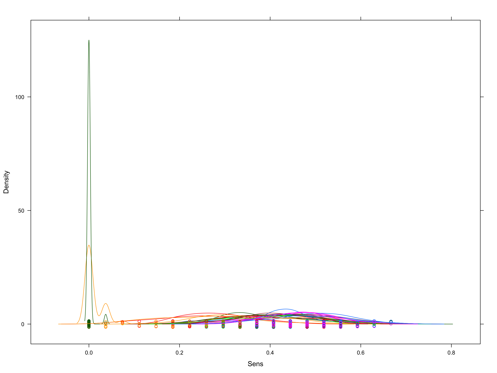

Train Top Models on Entire Training Dataset & Predict on Test Set
=================================================================

> after using cross-validation to tune, we'll take the highest ranked models, retrain the models (with the final tuning parameters) on the entire training set, and predict using the test set.

    ## 
    ## 
    ## ### Generalized Linear Model (glm_remove_collinearity_custom)
    ## 
    ## 
    ## 
    ## Pre-Processing: `nzv, center, scale, knnImpute`
    ## 
    ## 
    ## Call:
    ## NULL
    ## 
    ## Deviance Residuals: 
    ##     Min       1Q   Median       3Q      Max  
    ## -2.5895  -0.8436   0.4207   0.7751   2.0452  
    ## 
    ## Coefficients:
    ##                                   Estimate Std. Error z value             Pr(>|z|)    
    ## (Intercept)                       1.147190   0.094081  12.194 < 0.0000000000000002 ***
    ## `checking_balance> 200 DM`        0.238392   0.090948   2.621             0.008763 ** 
    ## `checking_balance1 - 200 DM`      0.169782   0.093537   1.815             0.069503 .  
    ## checking_balanceunknown           0.864977   0.112309   7.702   0.0000000000000134 ***
    ## months_loan_duration             -0.243480   0.109843  -2.217             0.026649 *  
    ## credit_historygood               -0.296156   0.119650  -2.475             0.013317 *  
    ## credit_historypoor               -0.109460   0.090283  -1.212             0.225354    
    ## `credit_historyvery good`        -0.241627   0.089351  -2.704             0.006846 ** 
    ## purposecar                        0.034689   0.130295   0.266             0.790058    
    ## purposeeducation                 -0.088180   0.099152  -0.889             0.373819    
    ## `purposefurniture/appliances`     0.180758   0.135377   1.335             0.181803    
    ## amount                           -0.400086   0.120926  -3.309             0.000938 ***
    ## `savings_balance100 - 500 DM`     0.015658   0.085541   0.183             0.854758    
    ## `savings_balance500 - 1000 DM`    0.054567   0.098771   0.552             0.580635    
    ## savings_balanceunknown            0.329990   0.100635   3.279             0.001041 ** 
    ## `employment_duration> 7 years`    0.255840   0.126875   2.016             0.043749 *  
    ## `employment_duration1 - 4 years`  0.099657   0.111016   0.898             0.369353    
    ## `employment_duration4 - 7 years`  0.371148   0.112825   3.290             0.001003 ** 
    ## employment_durationunemployed     0.050138   0.097707   0.513             0.607846    
    ## percent_of_income                -0.383384   0.097775  -3.921   0.0000881507786376 ***
    ## years_at_residence                0.005518   0.095818   0.058             0.954075    
    ## age                               0.128240   0.104123   1.232             0.218093    
    ## other_creditnone                  0.187232   0.083529   2.242             0.024992 *  
    ## housingown                        0.151433   0.135406   1.118             0.263413    
    ## housingrent                      -0.084313   0.130666  -0.645             0.518761    
    ## existing_loans_count             -0.178839   0.108980  -1.641             0.100790    
    ## jobskilled                        0.007380   0.130238   0.057             0.954813    
    ## jobunskilled                      0.044701   0.131371   0.340             0.733655    
    ## dependents                       -0.041299   0.086738  -0.476             0.633977    
    ## phoneTRUE                         0.222771   0.099246   2.245             0.024791 *  
    ## ---
    ## Signif. codes:  0 '***' 0.001 '**' 0.01 '*' 0.05 '.' 0.1 ' ' 1
    ## 
    ## (Dispersion parameter for binomial family taken to be 1)
    ## 
    ##     Null deviance: 1099.56  on 899  degrees of freedom
    ## Residual deviance:  872.53  on 870  degrees of freedom
    ## AIC: 932.53
    ## 
    ## Number of Fisher Scoring iterations: 5

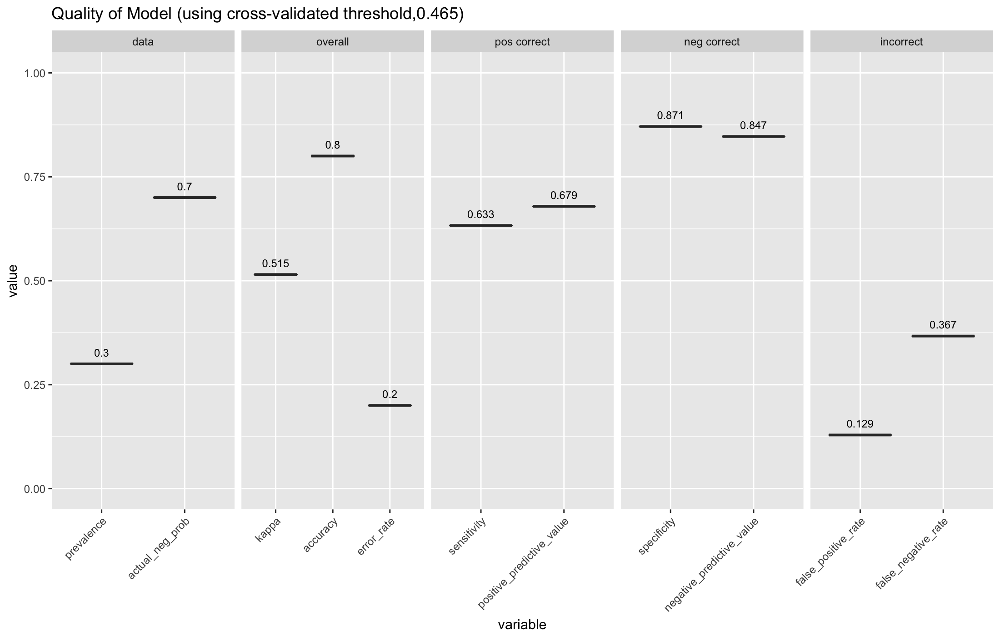

    ## ```
    ## Confusion Matrix and Statistics
    ## 
    ##           Reference
    ## Prediction yes no
    ##        yes  14  8
    ##        no   16 62
    ##                                           
    ##                Accuracy : 0.76            
    ##                  95% CI : (0.6643, 0.8398)
    ##     No Information Rate : 0.7             
    ##     P-Value [Acc > NIR] : 0.1136          
    ##                                           
    ##                   Kappa : 0.3814          
    ##  Mcnemar's Test P-Value : 0.1530          
    ##                                           
    ##             Sensitivity : 0.4667          
    ##             Specificity : 0.8857          
    ##          Pos Pred Value : 0.6364          
    ##          Neg Pred Value : 0.7949          
    ##              Prevalence : 0.3000          
    ##          Detection Rate : 0.1400          
    ##    Detection Prevalence : 0.2200          
    ##       Balanced Accuracy : 0.6762          
    ##                                           
    ##        'Positive' Class : yes             
    ##                                           
    ## ```


    ## NULL

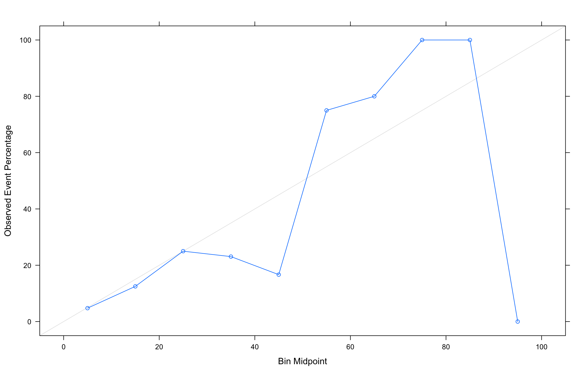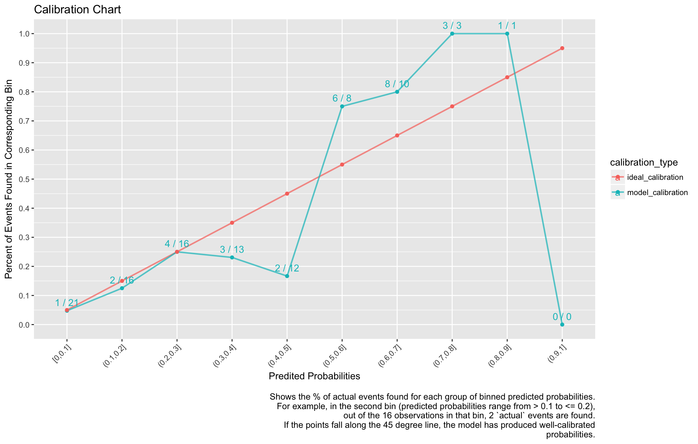

    ## 
    ## 
    ## ### Generalized Linear Model (glm_remove_collinearity_caret)
    ## 
    ## 
    ## 
    ## Pre-Processing: `nzv, center, scale, knnImpute`
    ## 
    ## 
    ## Call:
    ## NULL
    ## 
    ## Deviance Residuals: 
    ##     Min       1Q   Median       3Q      Max  
    ## -2.5895  -0.8436   0.4207   0.7751   2.0452  
    ## 
    ## Coefficients:
    ##                                   Estimate Std. Error z value             Pr(>|z|)    
    ## (Intercept)                       1.147190   0.094081  12.194 < 0.0000000000000002 ***
    ## `checking_balance> 200 DM`        0.238392   0.090948   2.621             0.008763 ** 
    ## `checking_balance1 - 200 DM`      0.169782   0.093537   1.815             0.069503 .  
    ## checking_balanceunknown           0.864977   0.112309   7.702   0.0000000000000134 ***
    ## months_loan_duration             -0.243480   0.109843  -2.217             0.026649 *  
    ## credit_historygood               -0.296156   0.119650  -2.475             0.013317 *  
    ## credit_historypoor               -0.109460   0.090283  -1.212             0.225354    
    ## `credit_historyvery good`        -0.241627   0.089351  -2.704             0.006846 ** 
    ## purposecar                        0.034689   0.130295   0.266             0.790058    
    ## purposeeducation                 -0.088180   0.099152  -0.889             0.373819    
    ## `purposefurniture/appliances`     0.180758   0.135377   1.335             0.181803    
    ## amount                           -0.400086   0.120926  -3.309             0.000938 ***
    ## `savings_balance100 - 500 DM`     0.015658   0.085541   0.183             0.854758    
    ## `savings_balance500 - 1000 DM`    0.054567   0.098771   0.552             0.580635    
    ## savings_balanceunknown            0.329990   0.100635   3.279             0.001041 ** 
    ## `employment_duration> 7 years`    0.255840   0.126875   2.016             0.043749 *  
    ## `employment_duration1 - 4 years`  0.099657   0.111016   0.898             0.369353    
    ## `employment_duration4 - 7 years`  0.371148   0.112825   3.290             0.001003 ** 
    ## employment_durationunemployed     0.050138   0.097707   0.513             0.607846    
    ## percent_of_income                -0.383384   0.097775  -3.921   0.0000881507786376 ***
    ## years_at_residence                0.005518   0.095818   0.058             0.954075    
    ## age                               0.128240   0.104123   1.232             0.218093    
    ## other_creditnone                  0.187232   0.083529   2.242             0.024992 *  
    ## housingown                        0.151433   0.135406   1.118             0.263413    
    ## housingrent                      -0.084313   0.130666  -0.645             0.518761    
    ## existing_loans_count             -0.178839   0.108980  -1.641             0.100790    
    ## jobskilled                        0.007380   0.130238   0.057             0.954813    
    ## jobunskilled                      0.044701   0.131371   0.340             0.733655    
    ## dependents                       -0.041299   0.086738  -0.476             0.633977    
    ## phoneTRUE                         0.222771   0.099246   2.245             0.024791 *  
    ## ---
    ## Signif. codes:  0 '***' 0.001 '**' 0.01 '*' 0.05 '.' 0.1 ' ' 1
    ## 
    ## (Dispersion parameter for binomial family taken to be 1)
    ## 
    ##     Null deviance: 1099.56  on 899  degrees of freedom
    ## Residual deviance:  872.53  on 870  degrees of freedom
    ## AIC: 932.53
    ## 
    ## Number of Fisher Scoring iterations: 5


    ## ```
    ## Confusion Matrix and Statistics
    ## 
    ##           Reference
    ## Prediction yes no
    ##        yes  14  8
    ##        no   16 62
    ##                                           
    ##                Accuracy : 0.76            
    ##                  95% CI : (0.6643, 0.8398)
    ##     No Information Rate : 0.7             
    ##     P-Value [Acc > NIR] : 0.1136          
    ##                                           
    ##                   Kappa : 0.3814          
    ##  Mcnemar's Test P-Value : 0.1530          
    ##                                           
    ##             Sensitivity : 0.4667          
    ##             Specificity : 0.8857          
    ##          Pos Pred Value : 0.6364          
    ##          Neg Pred Value : 0.7949          
    ##              Prevalence : 0.3000          
    ##          Detection Rate : 0.1400          
    ##    Detection Prevalence : 0.2200          
    ##       Balanced Accuracy : 0.6762          
    ##                                           
    ##        'Positive' Class : yes             
    ##                                           
    ## ```


    ## NULL


    ## 
    ## 
    ## ### Generalized Linear Model (model_glm_basic_processing)
    ## 
    ## 
    ## 
    ## Pre-Processing: `nzv, center, scale, knnImpute`
    ## 
    ## 
    ## Call:
    ## NULL
    ## 
    ## Deviance Residuals: 
    ##     Min       1Q   Median       3Q      Max  
    ## -2.5895  -0.8436   0.4207   0.7751   2.0452  
    ## 
    ## Coefficients:
    ##                                   Estimate Std. Error z value             Pr(>|z|)    
    ## (Intercept)                       1.147190   0.094081  12.194 < 0.0000000000000002 ***
    ## `checking_balance> 200 DM`        0.238392   0.090948   2.621             0.008763 ** 
    ## `checking_balance1 - 200 DM`      0.169782   0.093537   1.815             0.069503 .  
    ## checking_balanceunknown           0.864977   0.112309   7.702   0.0000000000000134 ***
    ## months_loan_duration             -0.243480   0.109843  -2.217             0.026649 *  
    ## credit_historygood               -0.296156   0.119650  -2.475             0.013317 *  
    ## credit_historypoor               -0.109460   0.090283  -1.212             0.225354    
    ## `credit_historyvery good`        -0.241627   0.089351  -2.704             0.006846 ** 
    ## purposecar                        0.034689   0.130295   0.266             0.790058    
    ## purposeeducation                 -0.088180   0.099152  -0.889             0.373819    
    ## `purposefurniture/appliances`     0.180758   0.135377   1.335             0.181803    
    ## amount                           -0.400086   0.120926  -3.309             0.000938 ***
    ## `savings_balance100 - 500 DM`     0.015658   0.085541   0.183             0.854758    
    ## `savings_balance500 - 1000 DM`    0.054567   0.098771   0.552             0.580635    
    ## savings_balanceunknown            0.329990   0.100635   3.279             0.001041 ** 
    ## `employment_duration> 7 years`    0.255840   0.126875   2.016             0.043749 *  
    ## `employment_duration1 - 4 years`  0.099657   0.111016   0.898             0.369353    
    ## `employment_duration4 - 7 years`  0.371148   0.112825   3.290             0.001003 ** 
    ## employment_durationunemployed     0.050138   0.097707   0.513             0.607846    
    ## percent_of_income                -0.383384   0.097775  -3.921   0.0000881507786376 ***
    ## years_at_residence                0.005518   0.095818   0.058             0.954075    
    ## age                               0.128240   0.104123   1.232             0.218093    
    ## other_creditnone                  0.187232   0.083529   2.242             0.024992 *  
    ## housingown                        0.151433   0.135406   1.118             0.263413    
    ## housingrent                      -0.084313   0.130666  -0.645             0.518761    
    ## existing_loans_count             -0.178839   0.108980  -1.641             0.100790    
    ## jobskilled                        0.007380   0.130238   0.057             0.954813    
    ## jobunskilled                      0.044701   0.131371   0.340             0.733655    
    ## dependents                       -0.041299   0.086738  -0.476             0.633977    
    ## phoneTRUE                         0.222771   0.099246   2.245             0.024791 *  
    ## ---
    ## Signif. codes:  0 '***' 0.001 '**' 0.01 '*' 0.05 '.' 0.1 ' ' 1
    ## 
    ## (Dispersion parameter for binomial family taken to be 1)
    ## 
    ##     Null deviance: 1099.56  on 899  degrees of freedom
    ## Residual deviance:  872.53  on 870  degrees of freedom
    ## AIC: 932.53
    ## 
    ## Number of Fisher Scoring iterations: 5

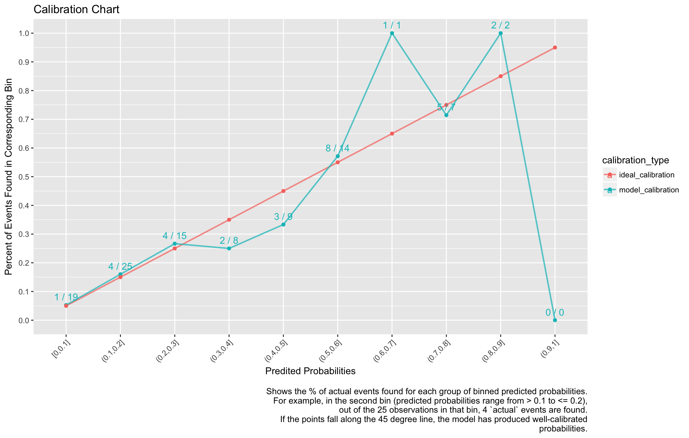

    ## ```
    ## Confusion Matrix and Statistics
    ## 
    ##           Reference
    ## Prediction yes no
    ##        yes  14  8
    ##        no   16 62
    ##                                           
    ##                Accuracy : 0.76            
    ##                  95% CI : (0.6643, 0.8398)
    ##     No Information Rate : 0.7             
    ##     P-Value [Acc > NIR] : 0.1136          
    ##                                           
    ##                   Kappa : 0.3814          
    ##  Mcnemar's Test P-Value : 0.1530          
    ##                                           
    ##             Sensitivity : 0.4667          
    ##             Specificity : 0.8857          
    ##          Pos Pred Value : 0.6364          
    ##          Neg Pred Value : 0.7949          
    ##              Prevalence : 0.3000          
    ##          Detection Rate : 0.1400          
    ##    Detection Prevalence : 0.2200          
    ##       Balanced Accuracy : 0.6762          
    ##                                           
    ##        'Positive' Class : yes             
    ##                                           
    ## ```

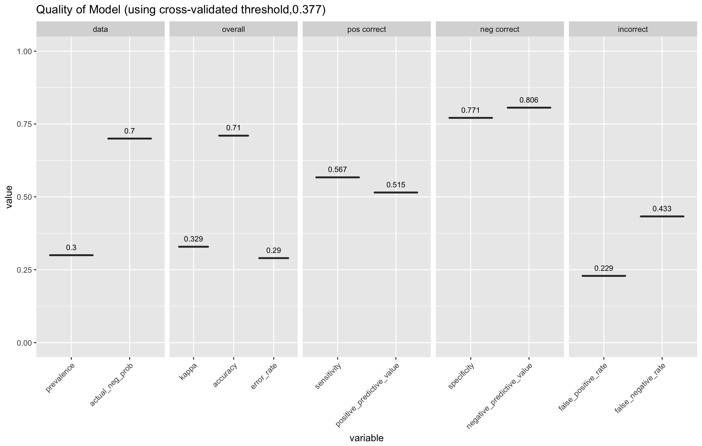

    ## NULL

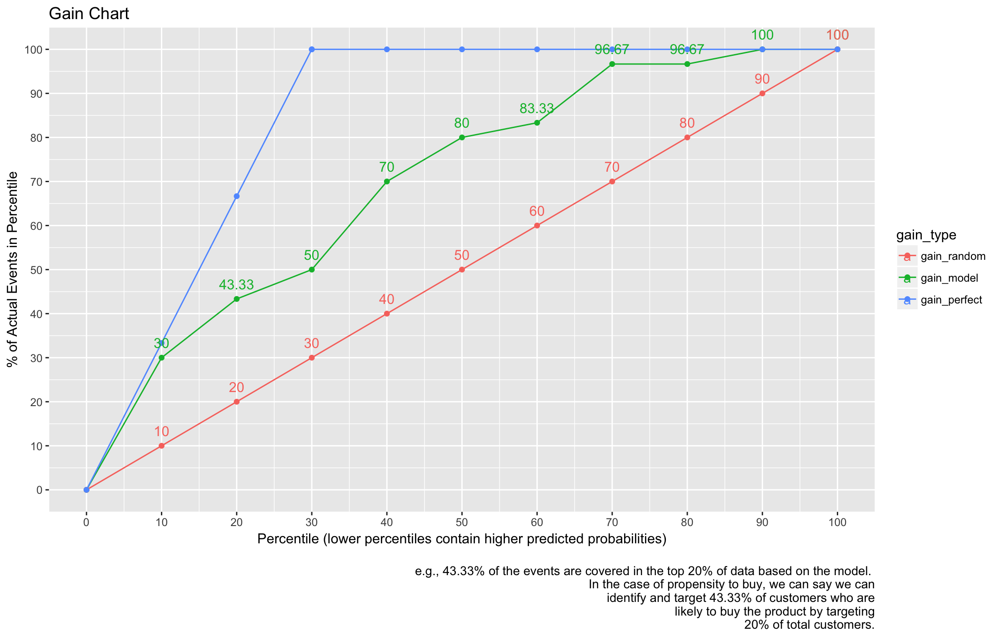

    ## 
    ## 
    ## ### Generalized Linear Model (model_glm_no_pre_processing)
    ## 
    ## 
    ## Call:
    ## NULL
    ## 
    ## Deviance Residuals: 
    ##     Min       1Q   Median       3Q      Max  
    ## -2.6364  -0.7956   0.4122   0.7664   1.8864  
    ## 
    ## Coefficients:
    ##                                     Estimate  Std. Error z value          Pr(>|z|)    
    ## (Intercept)                       1.67233497  0.93888105   1.781          0.074880 .  
    ## `checking_balance> 200 DM`        0.91202032  0.36959975   2.468          0.013603 *  
    ## `checking_balance1 - 200 DM`      0.36146669  0.21675128   1.668          0.095384 .  
    ## checking_balanceunknown           1.69919542  0.23318347   7.287 0.000000000000317 ***
    ## months_loan_duration             -0.01909034  0.00930934  -2.051          0.040300 *  
    ## credit_historygood               -0.83854132  0.26057700  -3.218          0.001291 ** 
    ## credit_historyperfect            -1.18300647  0.42783664  -2.765          0.005691 ** 
    ## credit_historypoor               -0.70792254  0.34560901  -2.048          0.040527 *  
    ## `credit_historyvery good`        -1.43539610  0.42810208  -3.353          0.000800 ***
    ## purposecar                       -0.14052327  0.32598325  -0.431          0.666414    
    ## purposecar0                       0.63233919  0.81457907   0.776          0.437585    
    ## purposeeducation                 -0.58632030  0.43971583  -1.333          0.182398    
    ## `purposefurniture/appliances`     0.16610147  0.31881865   0.521          0.602373    
    ## purposerenovations               -0.68269967  0.60731250  -1.124          0.260957    
    ## amount                           -0.00013829  0.00004389  -3.151          0.001627 ** 
    ## `savings_balance> 1000 DM`        1.03432320  0.51321912   2.015          0.043867 *  
    ## `savings_balance100 - 500 DM`     0.13185558  0.28429005   0.464          0.642786    
    ## `savings_balance500 - 1000 DM`    0.27415120  0.41264732   0.664          0.506452    
    ## savings_balanceunknown            0.90758459  0.26502755   3.424          0.000616 ***
    ## `employment_duration> 7 years`    0.51216659  0.29605002   1.730          0.083630 .  
    ## `employment_duration1 - 4 years`  0.16207344  0.23846600   0.680          0.496726    
    ## `employment_duration4 - 7 years`  0.92790647  0.30112909   3.081          0.002060 ** 
    ## employment_durationunemployed     0.14840842  0.43655991   0.340          0.733894    
    ## percent_of_income                -0.34774866  0.08869354  -3.921 0.000088259512881 ***
    ## years_at_residence               -0.00385951  0.08729784  -0.044          0.964736    
    ## age                               0.01108220  0.00927862   1.194          0.232329    
    ## other_creditnone                  0.52544326  0.24108458   2.179          0.029295 *  
    ## other_creditstore                 0.12816587  0.42389741   0.302          0.762384    
    ## housingown                        0.27205220  0.30231677   0.900          0.368178    
    ## housingrent                      -0.25445634  0.34509987  -0.737          0.460915    
    ## existing_loans_count             -0.33507655  0.19199533  -1.745          0.080944 .  
    ## jobskilled                        0.04584693  0.28901415   0.159          0.873959    
    ## jobunemployed                     0.09476193  0.65453976   0.145          0.884887    
    ## jobunskilled                      0.14669504  0.35145618   0.417          0.676392    
    ## dependents                       -0.11052559  0.24712936  -0.447          0.654703    
    ## phoneTRUE                         0.41866313  0.20925782   2.001          0.045424 *  
    ## ---
    ## Signif. codes:  0 '***' 0.001 '**' 0.01 '*' 0.05 '.' 0.1 ' ' 1
    ## 
    ## (Dispersion parameter for binomial family taken to be 1)
    ## 
    ##     Null deviance: 1099.56  on 899  degrees of freedom
    ## Residual deviance:  857.01  on 864  degrees of freedom
    ## AIC: 929.01
    ## 
    ## Number of Fisher Scoring iterations: 5

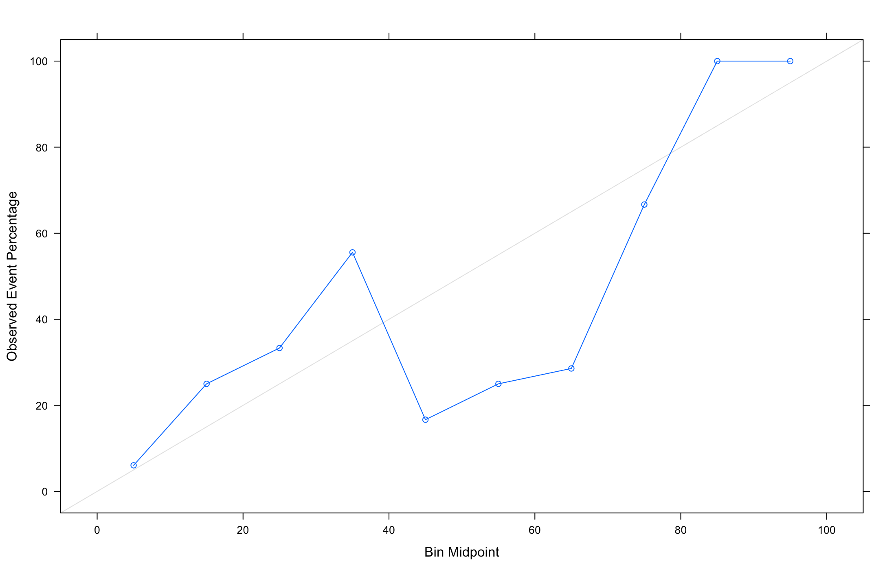

    ## ```
    ## Confusion Matrix and Statistics
    ## 
    ##           Reference
    ## Prediction yes no
    ##        yes  14  9
    ##        no   16 61
    ##                                           
    ##                Accuracy : 0.75            
    ##                  95% CI : (0.6534, 0.8312)
    ##     No Information Rate : 0.7             
    ##     P-Value [Acc > NIR] : 0.1631          
    ##                                           
    ##                   Kappa : 0.3622          
    ##  Mcnemar's Test P-Value : 0.2301          
    ##                                           
    ##             Sensitivity : 0.4667          
    ##             Specificity : 0.8714          
    ##          Pos Pred Value : 0.6087          
    ##          Neg Pred Value : 0.7922          
    ##              Prevalence : 0.3000          
    ##          Detection Rate : 0.1400          
    ##    Detection Prevalence : 0.2300          
    ##       Balanced Accuracy : 0.6690          
    ##                                           
    ##        'Positive' Class : yes             
    ##                                           
    ## ```


    ## NULL


    ## 
    ## 
    ## ### Generalized Linear Model (logistic_regression_stepwise_backward)
    ## 
    ## 
    ## 
    ## Pre-Processing: `nzv, center, scale, knnImpute`
    ## 
    ## 
    ## Call:
    ## NULL
    ## 
    ## Deviance Residuals: 
    ##     Min       1Q   Median       3Q      Max  
    ## -2.5895  -0.8436   0.4207   0.7751   2.0452  
    ## 
    ## Coefficients:
    ##                                   Estimate Std. Error z value             Pr(>|z|)    
    ## (Intercept)                       1.147190   0.094081  12.194 < 0.0000000000000002 ***
    ## `checking_balance> 200 DM`        0.238392   0.090948   2.621             0.008763 ** 
    ## `checking_balance1 - 200 DM`      0.169782   0.093537   1.815             0.069503 .  
    ## checking_balanceunknown           0.864977   0.112309   7.702   0.0000000000000134 ***
    ## months_loan_duration             -0.243480   0.109843  -2.217             0.026649 *  
    ## credit_historygood               -0.296156   0.119650  -2.475             0.013317 *  
    ## credit_historypoor               -0.109460   0.090283  -1.212             0.225354    
    ## `credit_historyvery good`        -0.241627   0.089351  -2.704             0.006846 ** 
    ## purposecar                        0.034689   0.130295   0.266             0.790058    
    ## purposeeducation                 -0.088180   0.099152  -0.889             0.373819    
    ## `purposefurniture/appliances`     0.180758   0.135377   1.335             0.181803    
    ## amount                           -0.400086   0.120926  -3.309             0.000938 ***
    ## `savings_balance100 - 500 DM`     0.015658   0.085541   0.183             0.854758    
    ## `savings_balance500 - 1000 DM`    0.054567   0.098771   0.552             0.580635    
    ## savings_balanceunknown            0.329990   0.100635   3.279             0.001041 ** 
    ## `employment_duration> 7 years`    0.255840   0.126875   2.016             0.043749 *  
    ## `employment_duration1 - 4 years`  0.099657   0.111016   0.898             0.369353    
    ## `employment_duration4 - 7 years`  0.371148   0.112825   3.290             0.001003 ** 
    ## employment_durationunemployed     0.050138   0.097707   0.513             0.607846    
    ## percent_of_income                -0.383384   0.097775  -3.921   0.0000881507786376 ***
    ## years_at_residence                0.005518   0.095818   0.058             0.954075    
    ## age                               0.128240   0.104123   1.232             0.218093    
    ## other_creditnone                  0.187232   0.083529   2.242             0.024992 *  
    ## housingown                        0.151433   0.135406   1.118             0.263413    
    ## housingrent                      -0.084313   0.130666  -0.645             0.518761    
    ## existing_loans_count             -0.178839   0.108980  -1.641             0.100790    
    ## jobskilled                        0.007380   0.130238   0.057             0.954813    
    ## jobunskilled                      0.044701   0.131371   0.340             0.733655    
    ## dependents                       -0.041299   0.086738  -0.476             0.633977    
    ## phoneTRUE                         0.222771   0.099246   2.245             0.024791 *  
    ## ---
    ## Signif. codes:  0 '***' 0.001 '**' 0.01 '*' 0.05 '.' 0.1 ' ' 1
    ## 
    ## (Dispersion parameter for binomial family taken to be 1)
    ## 
    ##     Null deviance: 1099.56  on 899  degrees of freedom
    ## Residual deviance:  872.53  on 870  degrees of freedom
    ## AIC: 932.53
    ## 
    ## Number of Fisher Scoring iterations: 5

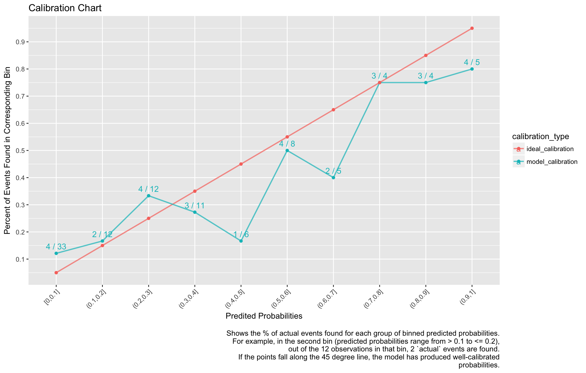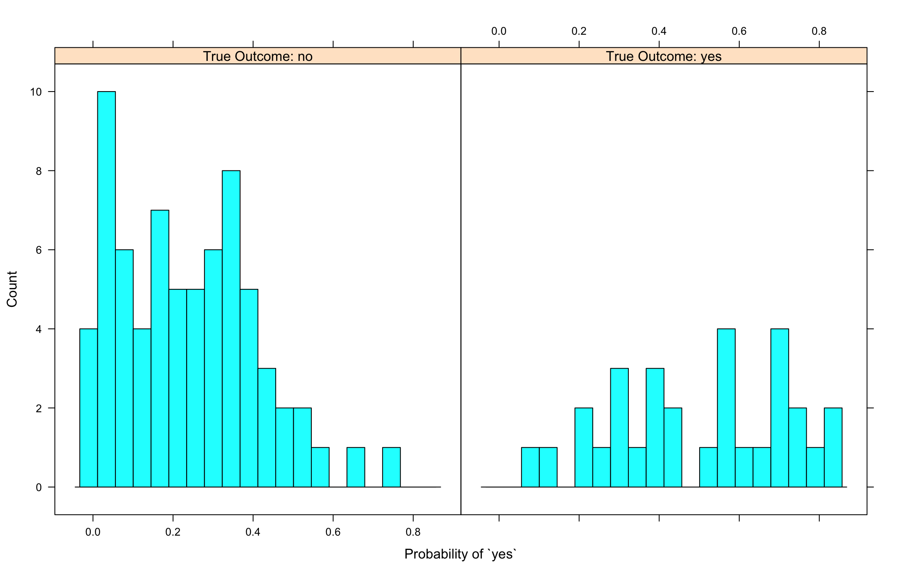

    ## ```
    ## Confusion Matrix and Statistics
    ## 
    ##           Reference
    ## Prediction yes no
    ##        yes  14  8
    ##        no   16 62
    ##                                           
    ##                Accuracy : 0.76            
    ##                  95% CI : (0.6643, 0.8398)
    ##     No Information Rate : 0.7             
    ##     P-Value [Acc > NIR] : 0.1136          
    ##                                           
    ##                   Kappa : 0.3814          
    ##  Mcnemar's Test P-Value : 0.1530          
    ##                                           
    ##             Sensitivity : 0.4667          
    ##             Specificity : 0.8857          
    ##          Pos Pred Value : 0.6364          
    ##          Neg Pred Value : 0.7949          
    ##              Prevalence : 0.3000          
    ##          Detection Rate : 0.1400          
    ##    Detection Prevalence : 0.2200          
    ##       Balanced Accuracy : 0.6762          
    ##                                           
    ##        'Positive' Class : yes             
    ##                                           
    ## ```


    ## NULL


