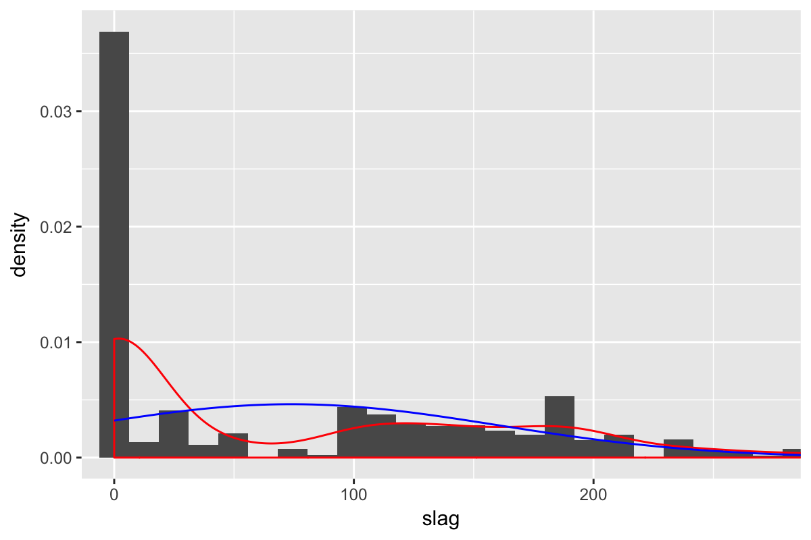
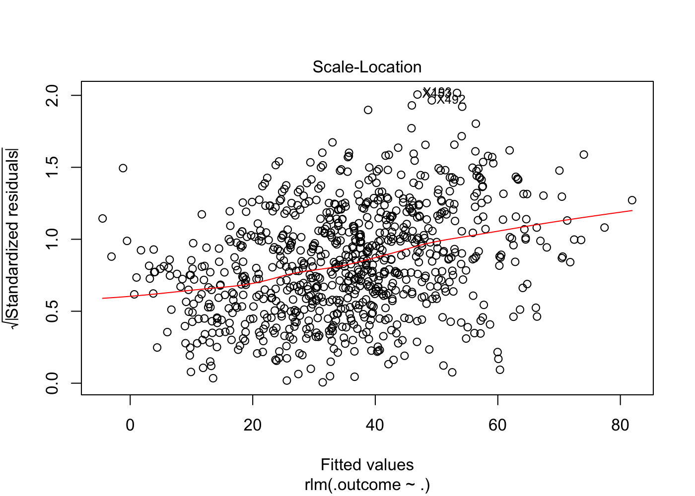
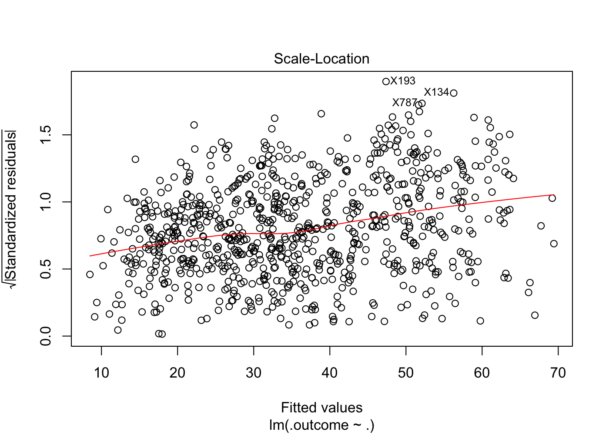
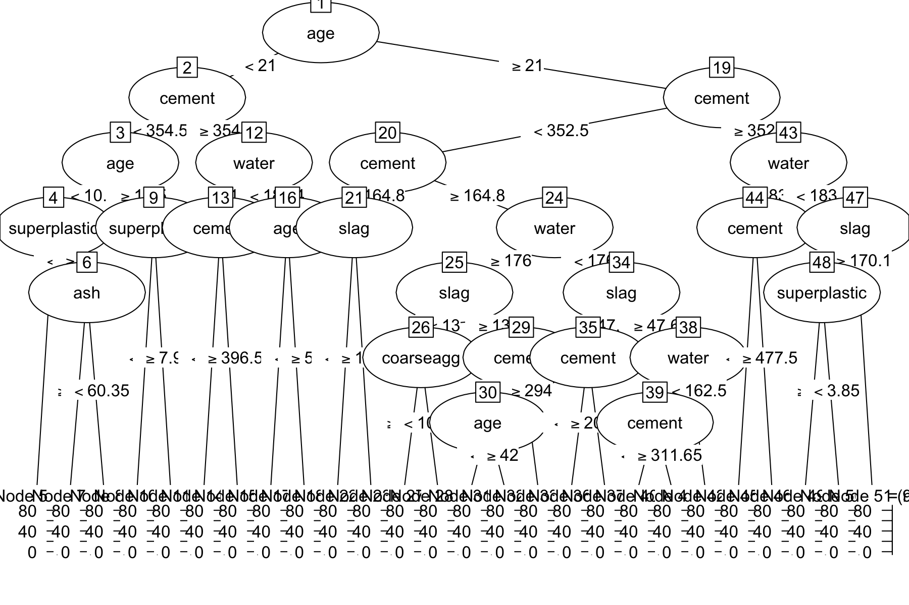
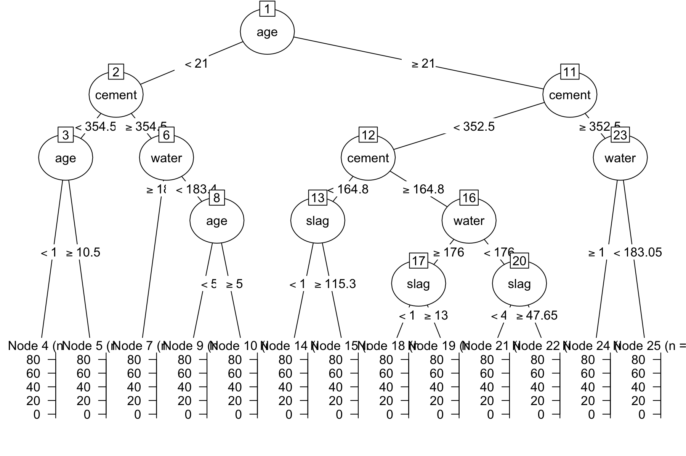
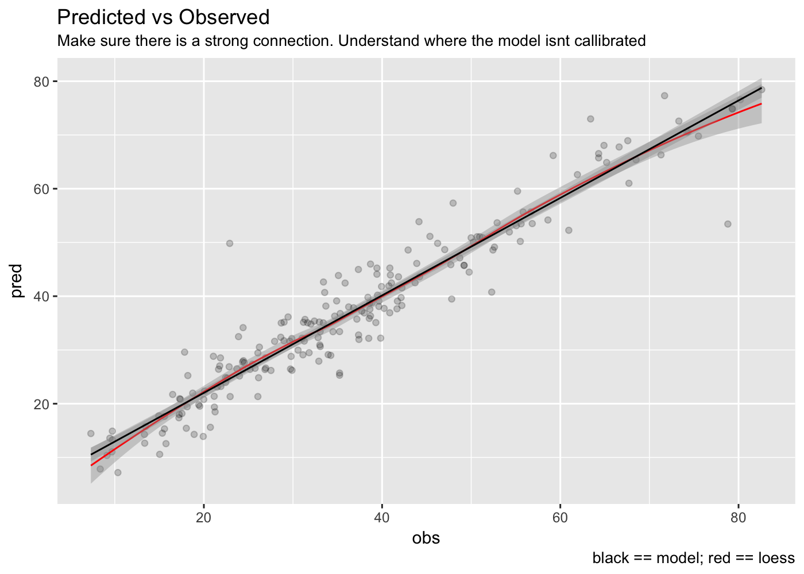
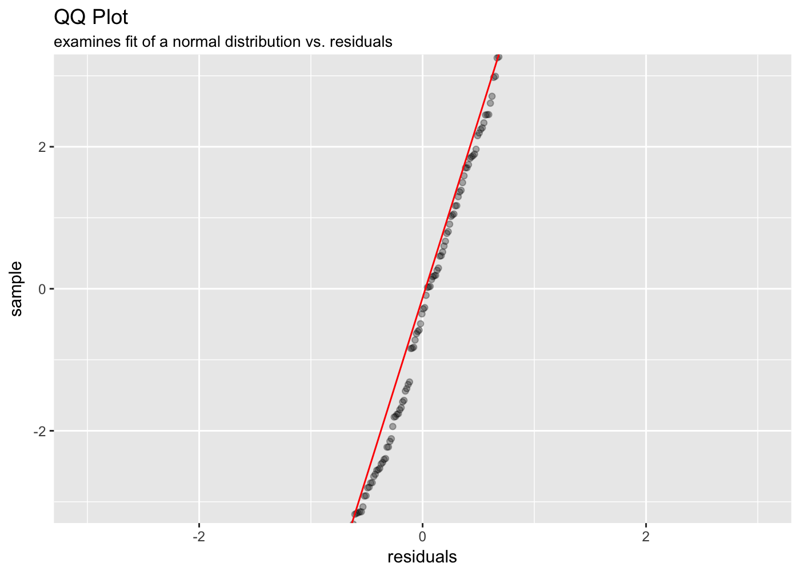
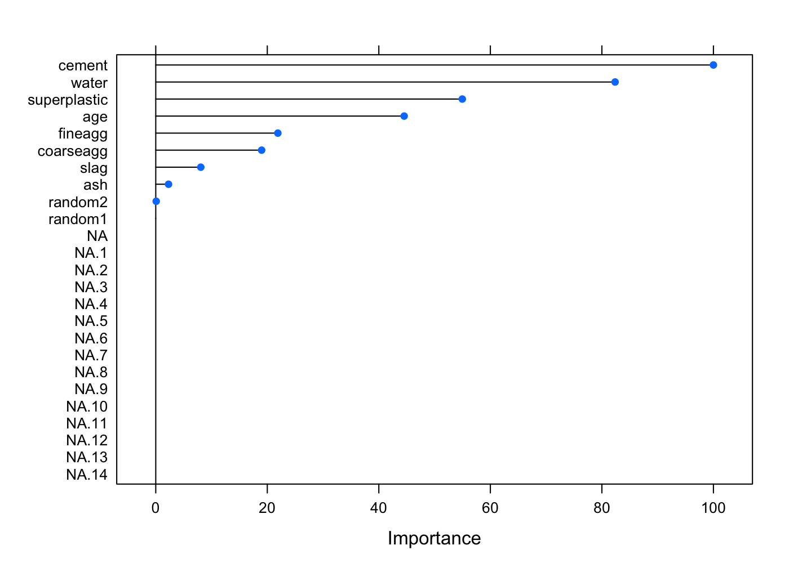

-   [Tuning Parameters](#tuning-parameters)
-   [Dataset](#dataset)
    -   [Summary](#summary)
    -   [Skewness](#skewness)
    -   [Outliers](#outliers)
    -   [Correlation & Collinearity](#correlation-collinearity)
        -   [Correlation](#correlation)
        -   [Collinearity Removal](#collinearity-removal)
    -   [Graphs](#graphs)
        -   [cement](#cement)
        -   [slag](#slag)
        -   [ash](#ash)
        -   [water](#water)
        -   [superplastic](#superplastic)
        -   [coarseagg](#coarseagg)
        -   [fineagg](#fineagg)
        -   [age](#age)
        -   [random1](#random1)
        -   [random2](#random2)
-   [Spot-Check](#spot-check)
    -   [Linear Regression - no pre processing](#linear-regression---no-pre-processing)
    -   [Linear Regression - basic pre processing](#linear-regression---basic-pre-processing)
    -   [Linear Regression - basic pre processing with medianImpute](#linear-regression---basic-pre-processing-with-medianimpute)
    -   [Linear Regression - basic pre processing](#linear-regression---basic-pre-processing-1)
    -   [Linear Regression - skewness - YeoJohnson](#linear-regression---skewness---yeojohnson)
    -   [Linear Regression - skewness - BoxCox](#linear-regression---skewness---boxcox)
    -   [Linear Regression - remove collinear data - based on caret's recommendation](#linear-regression---remove-collinear-data---based-on-carets-recommendation)
    -   [Linear Regression - remove collinear data - based on calculation](#linear-regression---remove-collinear-data---based-on-calculation)
    -   [Robust Linear Regression](#robust-linear-regression)
    -   [Linear Regression - spatial sign](#linear-regression---spatial-sign)
    -   [Linear Regression - principal components analysis](#linear-regression---principal-components-analysis)
    -   [Principal Component Regression](#principal-component-regression)
    -   [Partial Least Squares](#partial-least-squares)
    -   [Ridge Regression](#ridge-regression)
    -   [ridge & lasso combo](#ridge-lasso-combo)
    -   [neural network - basic](#neural-network---basic)
    -   [neural network - basic - removing correlated predictors](#neural-network---basic---removing-correlated-predictors)
    -   [neural network - model averaging - removing correlated predictors](#neural-network---model-averaging---removing-correlated-predictors)
    -   [neural network - model averaging - PCA](#neural-network---model-averaging---pca)
    -   [MARS (Multivariate Adaptive Regression Splines)](#mars-multivariate-adaptive-regression-splines)
    -   [SVM - Support Vector Machine - Radial](#svm---support-vector-machine---radial)
    -   [SVM - Support Vector Machine - Linear](#svm---support-vector-machine---linear)
    -   [SVM - Support Vector Machine - Polynomial](#svm---support-vector-machine---polynomial)
    -   [CART - Classification and Regression Tree - Tuning over maximum depth](#cart---classification-and-regression-tree---tuning-over-maximum-depth)
    -   [CART - Classification and Regression Tree - Tuning over maximum depth](#cart---classification-and-regression-tree---tuning-over-maximum-depth-1)
    -   [Conditional Inference Tree](#conditional-inference-tree)
    -   [Conditional Inference Tree - Tuning over maximum depth](#conditional-inference-tree---tuning-over-maximum-depth)
    -   [Model Trees - M5](#model-trees---m5)
    -   [Model Trees - M5 Rules](#model-trees---m5-rules)
    -   [Bagged Trees](#bagged-trees)
    -   [Random Forest](#random-forest)
    -   [Random Forest - Conditional Inference](#random-forest---conditional-inference)
    -   [Boosting](#boosting)
    -   [Cubist](#cubist)
    -   [Resamples & Top Models](#resamples-top-models)
        -   [Resamples](#resamples)
        -   [Top Models](#top-models)
-   [Train Top Models on Entire Training Dataset & Predict on Test Set](#train-top-models-on-entire-training-dataset-predict-on-test-set)
    -   [Stochastic Gradient Boosting (ensemble\_boosting)](#stochastic-gradient-boosting-ensemble_boosting)
    -   [Cubist (ensemble\_cubist)](#cubist-ensemble_cubist)
    -   [Random Forest (ensemble\_random\_forest)](#random-forest-ensemble_random_forest)
    -   [Model Averaged Neural Network (nlm\_neur\_net\_averaging\_pca)](#model-averaged-neural-network-nlm_neur_net_averaging_pca)
    -   [Multivariate Adaptive Regression Spline (nlm\_mars)](#multivariate-adaptive-regression-spline-nlm_mars)

Tuning Parameters
=================

``` r
# train/test set
training_percentage <- 0.80

# cross validation
cross_validation_num_folds <- 10
cross_validation_num_repeats <- 3

# tuning
tuning_ridge_lambda <- seq(0, 0.1, length = 15) # Weight Decay
tuning_enet_lambda = c(0, 0.01, 0.1) # Weight Decay
tuning_enet_fraction <- seq(0.05, 1, length = 20) # Fraction of Full Solution

tuning_neural_network_decay <- c(0, 0.01, 0.1) # weight decay
tuning_neural_network_size <- c(1, 3, 5, 7, 9, 11, 13) # number of hidden units
tuning_neural_network_bag <- c(FALSE, TRUE) # bagging
parameter_neural_network_linout <- TRUE # use the linear relationship between the hidden units and the prediction (APM pg 162) i.e. linear output units
parameter_neural_network_trace <- FALSE
parameter_neural_network_max_num_weights <- 13 * (ncol(regression_dataset)) + 13 + 1 # The maximum allowable number of weights. There is no intrinsic limit in the code, but increasing MaxNWts will probably allow fits that are very slow and time-consuming.
parameter_neural_network_max_iterations <- 1000 # maximum number of iterations. Default 100

tuning_mars_degree <- 1:2 # Product Degree (of features that are added to the model)
tuning_mars_nprune <- 2:38 # number of terms retained

tuning_svm_poly_degree <- 1:2 # Polynomial Degree
tuning_svm_poly_scale <- c(0.01, 0.005, 0.001) # Scale
tuning_svm_cost <- 2^(-4:10) # Cost

tuning_ctree_mincriterion <- sort(c(0.95, seq(0.75, 0.99, length = 2)))

tuning_treebag_nbagg <- 25 # number of decision trees voting in the ensemble (default for some packages is 25)

parameter_random_forest_ntree <- 1000 # the number of bootstrap samples. althought he default is 500, at least 1,000 bootstrap samples should be used (and perhaps more depending on the number of predictors and the values of mtry).
tuning_random_forest_mtry <- unique(floor(seq(10, ncol(regression_dataset) - 1, length = 10))) # number of predictors that are randomly sampled as randidates for each split (default in regression is number of predictors divded by 3)
if(length(tuning_random_forest_mtry) == 1)
{
    tuning_random_forest_mtry <- c(round(tuning_random_forest_mtry / 2), tuning_random_forest_mtry - 1)
}

tuning_boosting_interaction_depth <- seq(1, 7, by = 2) # Boosting Iterations
tuning_boosting_n_trees <- seq(100, 1000, by = 50) # Max Tree Depth
tuning_boosting_shrinkage <- c(0.01, 0.1) # Shrinkage
tuning_boosting_min_obs_in_node <- 10 # Min. Terminal Node Size

tuning_cubist_committees <- c(1:10, 20, 50, 75, 100)
tuning_cubist_neighbors <- c(0, 1, 5, 9)
```

Dataset
=======

> Assumes the dataset has factors for strings; logical for TRUE/FALSE; `target` for outcome variable

Summary
-------

> Total predictors: `10`

> Total data-points/rows: `1030`

> Number of training data-points: `824`

Rule of thumbs for dimensions (Probabilistic and Statistical Modeling in Computer Science; pg 430):

> r &lt; sqrt(n); where r is the number of predictors and sqrt(n) is the square root of the sample size (`32`): `TRUE`

> r &lt; sqrt(n\_t); where r is the number of predictors and sqrt(n\_t) is the square root of the training set size (`29`): `TRUE`

    ##      target          cement           slag            ash             water        superplastic      coarseagg         fineagg           age          random1     random2   
    ##  Min.   : 2.33   Min.   :102.0   Min.   :  0.0   Min.   :  0.00   Min.   :121.8   Min.   : 0.000   Min.   : 801.0   Min.   :594.0   Min.   :  1.00   FALSE:506   FALSE:543  
    ##  1st Qu.:23.71   1st Qu.:192.4   1st Qu.:  0.0   1st Qu.:  0.00   1st Qu.:164.9   1st Qu.: 0.000   1st Qu.: 932.0   1st Qu.:731.0   1st Qu.:  7.00   TRUE :524   TRUE :487  
    ##  Median :34.45   Median :272.9   Median : 22.0   Median :  0.00   Median :185.0   Median : 6.400   Median : 968.0   Median :779.5   Median : 28.00                          
    ##  Mean   :35.82   Mean   :281.2   Mean   : 73.9   Mean   : 54.19   Mean   :181.6   Mean   : 6.205   Mean   : 972.9   Mean   :773.6   Mean   : 45.66                          
    ##  3rd Qu.:46.13   3rd Qu.:350.0   3rd Qu.:142.9   3rd Qu.:118.30   3rd Qu.:192.0   3rd Qu.:10.200   3rd Qu.:1029.4   3rd Qu.:824.0   3rd Qu.: 56.00                          
    ##  Max.   :82.60   Max.   :540.0   Max.   :359.4   Max.   :200.10   Max.   :247.0   Max.   :32.200   Max.   :1145.0   Max.   :992.6   Max.   :365.00

Skewness
--------

Note: `Box-Cox` can only be applied to sets (i.e. predictors) where all values are `> 0`. So some/most/all? `NA`s will be from that limiation.

| column       |  boxcox\_skewness|
|:-------------|-----------------:|
| target       |         0.4157636|
| cement       |         0.5079982|
| slag         |                NA|
| ash          |                NA|
| water        |         0.0744112|
| superplastic |                NA|
| coarseagg    |        -0.0401027|
| fineagg      |        -0.2522732|
| age          |         3.2596617|
| random1      |                NA|
| random2      |                NA|

Outliers
--------

| columns      | lower\_outlier\_count | upper\_outlier\_count |
|:-------------|:----------------------|:----------------------|
| target       | 0                     | 0                     |
| cement       | 0                     | 0                     |
| slag         | 0                     | 0                     |
| ash          | 0                     | 0                     |
| water        | 5                     | 2                     |
| superplastic | 0                     | 5                     |
| coarseagg    | 0                     | 0                     |
| fineagg      | 0                     | 0                     |
| age          | 0                     | 59                    |

Correlation & Collinearity
--------------------------

### Correlation


### Collinearity Removal

#### Caret's `findCorrelation`

Shows caret's recommendation of removing collinear columns based on correlation threshold of `0.9`

> columns recommended for removal: \`\`

> final columns recommended: `target, cement, slag, ash, water, superplastic, coarseagg, fineagg, age, random1, random2`

#### Heuristic

This method is described in APM pg 47 as the following steps

-   calculate the correlation matrix of predictors
-   determine the two predictors associated with the largest absolute pairwise correlation (call them predictors `A` and `B`)
-   Determine the average correlation between `A` and the other variables.
    -   Do the same for `B`
-   If `A` has a larger average correlation, remove it; otherwise, remove predcitor `B`
-   Repeat until no absolute correlations are above the threshold (`0.9`)

> columns recommended for removal: \`\`

> final columns recommended: `target, random1, random2, cement, slag, ash, water, superplastic, coarseagg, fineagg, age`

Graphs
------


### cement


### slag



Error with boxplot.

### ash


Error with boxplot.

### water


### superplastic


Error with boxplot.

### coarseagg


### fineagg


### age


Error with boxplot.

### random1


### random2


Spot-Check
==========


> Using `10`-fold cross-validation with `3` repeats.

-   Note: e.g. if there are rare values at the target extremes (lows/highs), the train and especially the test set might not be training/testing on them. Is the test set representative? If the test set doesn't have as extreme values, it can even predict better (e.g. lower RMSE higher Rsquared) than the average Cross Validation given on training because it's not using those extreme values.

> used `80%` of data for `training` set (`826`), and `20%` for `test` set (`204`).

### Linear Regression - no pre processing

    ## 
    ## Call:
    ## lm(formula = .outcome ~ ., data = dat)
    ## 
    ## Residuals:
    ##     Min      1Q  Median      3Q     Max 
    ## -27.882  -6.431   0.735   6.936  34.283 
    ## 
    ## Coefficients:
    ##                Estimate Std. Error t value             Pr(>|t|)    
    ## (Intercept)  -23.524282  28.495943  -0.826             0.409312    
    ## cement         0.118779   0.009166  12.958 < 0.0000000000000002 ***
    ## slag           0.105370   0.011037   9.547 < 0.0000000000000002 ***
    ## ash            0.091045   0.013620   6.685      0.0000000000429 ***
    ## water         -0.153178   0.043074  -3.556             0.000398 ***
    ## superplastic   0.252151   0.101542   2.483             0.013220 *  
    ## coarseagg      0.019197   0.010104   1.900             0.057802 .  
    ## fineagg        0.020103   0.011595   1.734             0.083349 .  
    ## age            0.114094   0.006113  18.664 < 0.0000000000000002 ***
    ## random1TRUE    0.290822   0.729389   0.399             0.690204    
    ## random2TRUE   -0.258564   0.732620  -0.353             0.724232    
    ## ---
    ## Signif. codes:  0 '***' 0.001 '**' 0.01 '*' 0.05 '.' 0.1 ' ' 1
    ## 
    ## Residual standard error: 10.44 on 815 degrees of freedom
    ## Multiple R-squared:  0.6103, Adjusted R-squared:  0.6055 
    ## F-statistic: 127.6 on 10 and 815 DF,  p-value: < 0.00000000000000022


### Linear Regression - basic pre processing

    ## 
    ## Call:
    ## lm(formula = .outcome ~ ., data = dat)
    ## 
    ## Residuals:
    ##     Min      1Q  Median      3Q     Max 
    ## -27.882  -6.431   0.735   6.936  34.283 
    ## 
    ## Coefficients:
    ##              Estimate Std. Error t value             Pr(>|t|)    
    ## (Intercept)   35.6050     0.3632  98.027 < 0.0000000000000002 ***
    ## cement        12.5118     0.9655  12.958 < 0.0000000000000002 ***
    ## slag           9.0555     0.9485   9.547 < 0.0000000000000002 ***
    ## ash            5.8400     0.8736   6.685      0.0000000000429 ***
    ## water         -3.2206     0.9056  -3.556             0.000398 ***
    ## superplastic   1.5227     0.6132   2.483             0.013220 *  
    ## coarseagg      1.4982     0.7886   1.900             0.057802 .  
    ## fineagg        1.5839     0.9136   1.734             0.083349 .  
    ## age            7.1341     0.3822  18.664 < 0.0000000000000002 ***
    ## random1TRUE    0.1455     0.3648   0.399             0.690204    
    ## random2TRUE   -0.1291     0.3657  -0.353             0.724232    
    ## ---
    ## Signif. codes:  0 '***' 0.001 '**' 0.01 '*' 0.05 '.' 0.1 ' ' 1
    ## 
    ## Residual standard error: 10.44 on 815 degrees of freedom
    ## Multiple R-squared:  0.6103, Adjusted R-squared:  0.6055 
    ## F-statistic: 127.6 on 10 and 815 DF,  p-value: < 0.00000000000000022


### Linear Regression - basic pre processing with medianImpute

    ## 
    ## Call:
    ## lm(formula = .outcome ~ ., data = dat)
    ## 
    ## Residuals:
    ##     Min      1Q  Median      3Q     Max 
    ## -27.882  -6.431   0.735   6.936  34.283 
    ## 
    ## Coefficients:
    ##              Estimate Std. Error t value             Pr(>|t|)    
    ## (Intercept)   35.6050     0.3632  98.027 < 0.0000000000000002 ***
    ## cement        12.5118     0.9655  12.958 < 0.0000000000000002 ***
    ## slag           9.0555     0.9485   9.547 < 0.0000000000000002 ***
    ## ash            5.8400     0.8736   6.685      0.0000000000429 ***
    ## water         -3.2206     0.9056  -3.556             0.000398 ***
    ## superplastic   1.5227     0.6132   2.483             0.013220 *  
    ## coarseagg      1.4982     0.7886   1.900             0.057802 .  
    ## fineagg        1.5839     0.9136   1.734             0.083349 .  
    ## age            7.1341     0.3822  18.664 < 0.0000000000000002 ***
    ## random1TRUE    0.1455     0.3648   0.399             0.690204    
    ## random2TRUE   -0.1291     0.3657  -0.353             0.724232    
    ## ---
    ## Signif. codes:  0 '***' 0.001 '**' 0.01 '*' 0.05 '.' 0.1 ' ' 1
    ## 
    ## Residual standard error: 10.44 on 815 degrees of freedom
    ## Multiple R-squared:  0.6103, Adjusted R-squared:  0.6055 
    ## F-statistic: 127.6 on 10 and 815 DF,  p-value: < 0.00000000000000022


### Linear Regression - basic pre processing

    ## 
    ## Call:
    ## lm(formula = .outcome ~ ., data = dat)
    ## 
    ## Residuals:
    ##     Min      1Q  Median      3Q     Max 
    ## -27.882  -6.431   0.735   6.936  34.283 
    ## 
    ## Coefficients:
    ##              Estimate Std. Error t value             Pr(>|t|)    
    ## (Intercept)   35.6050     0.3632  98.027 < 0.0000000000000002 ***
    ## cement        12.5118     0.9655  12.958 < 0.0000000000000002 ***
    ## slag           9.0555     0.9485   9.547 < 0.0000000000000002 ***
    ## ash            5.8400     0.8736   6.685      0.0000000000429 ***
    ## water         -3.2206     0.9056  -3.556             0.000398 ***
    ## superplastic   1.5227     0.6132   2.483             0.013220 *  
    ## coarseagg      1.4982     0.7886   1.900             0.057802 .  
    ## fineagg        1.5839     0.9136   1.734             0.083349 .  
    ## age            7.1341     0.3822  18.664 < 0.0000000000000002 ***
    ## random1TRUE    0.1455     0.3648   0.399             0.690204    
    ## random2TRUE   -0.1291     0.3657  -0.353             0.724232    
    ## ---
    ## Signif. codes:  0 '***' 0.001 '**' 0.01 '*' 0.05 '.' 0.1 ' ' 1
    ## 
    ## Residual standard error: 10.44 on 815 degrees of freedom
    ## Multiple R-squared:  0.6103, Adjusted R-squared:  0.6055 
    ## F-statistic: 127.6 on 10 and 815 DF,  p-value: < 0.00000000000000022


### Linear Regression - skewness - YeoJohnson

    ## 
    ## Call:
    ## lm(formula = .outcome ~ ., data = dat)
    ## 
    ## Residuals:
    ##      Min       1Q   Median       3Q      Max 
    ## -21.9000  -4.7851   0.1101   4.4590  26.8109 
    ## 
    ## Coefficients:
    ##                 Estimate  Std. Error t value             Pr(>|t|)    
    ## (Intercept)  35.60497579  0.25605085 139.054 < 0.0000000000000002 ***
    ## cement        9.07110625  0.40922811  22.166 < 0.0000000000000002 ***
    ## slag          5.45715642  0.42840696  12.738 < 0.0000000000000002 ***
    ## ash           1.07145671  0.41888601   2.558             0.010711 *  
    ## water        -5.05962119  0.51171433  -9.888 < 0.0000000000000002 ***
    ## superplastic  1.74322992  0.48030663   3.629             0.000302 ***
    ## coarseagg    -0.32859819  0.43075814  -0.763             0.445781    
    ## fineagg      -1.22625817  0.44103594  -2.780             0.005554 ** 
    ## age          10.01404491  0.26101831  38.365 < 0.0000000000000002 ***
    ## random1TRUE  -0.00002926  0.25721843   0.000             0.999909    
    ## random2TRUE  -0.14107014  0.25748691  -0.548             0.583929    
    ## ---
    ## Signif. codes:  0 '***' 0.001 '**' 0.01 '*' 0.05 '.' 0.1 ' ' 1
    ## 
    ## Residual standard error: 7.359 on 815 degrees of freedom
    ## Multiple R-squared:  0.8063, Adjusted R-squared:  0.804 
    ## F-statistic: 339.3 on 10 and 815 DF,  p-value: < 0.00000000000000022


### Linear Regression - skewness - BoxCox

    ## 
    ## Call:
    ## lm(formula = .outcome ~ ., data = dat)
    ## 
    ## Residuals:
    ##      Min       1Q   Median       3Q      Max 
    ## -20.9589  -4.2744  -0.2363   3.8977  27.4090 
    ## 
    ## Coefficients:
    ##              Estimate Std. Error t value             Pr(>|t|)    
    ## (Intercept)  35.60498    0.24605 144.704 < 0.0000000000000002 ***
    ## cement       13.17055    0.61037  21.578 < 0.0000000000000002 ***
    ## slag          9.31782    0.61333  15.192 < 0.0000000000000002 ***
    ## ash           5.37323    0.56737   9.470 < 0.0000000000000002 ***
    ## water        -3.96743    0.57629  -6.884      0.0000000000116 ***
    ## superplastic  0.17385    0.41601   0.418               0.6761    
    ## coarseagg     1.23272    0.50238   2.454               0.0143 *  
    ## fineagg       1.65975    0.57186   2.902               0.0038 ** 
    ## age          10.35398    0.25163  41.148 < 0.0000000000000002 ***
    ## random1TRUE  -0.08115    0.24724  -0.328               0.7428    
    ## random2TRUE   0.09622    0.24736   0.389               0.6974    
    ## ---
    ## Signif. codes:  0 '***' 0.001 '**' 0.01 '*' 0.05 '.' 0.1 ' ' 1
    ## 
    ## Residual standard error: 7.072 on 815 degrees of freedom
    ## Multiple R-squared:  0.8212, Adjusted R-squared:  0.819 
    ## F-statistic: 374.2 on 10 and 815 DF,  p-value: < 0.00000000000000022


### Linear Regression - remove collinear data - based on caret's recommendation

    ## 
    ## Call:
    ## lm(formula = .outcome ~ ., data = dat)
    ## 
    ## Residuals:
    ##     Min      1Q  Median      3Q     Max 
    ## -27.882  -6.431   0.735   6.936  34.283 
    ## 
    ## Coefficients:
    ##              Estimate Std. Error t value             Pr(>|t|)    
    ## (Intercept)   35.6050     0.3632  98.027 < 0.0000000000000002 ***
    ## cement        12.5118     0.9655  12.958 < 0.0000000000000002 ***
    ## slag           9.0555     0.9485   9.547 < 0.0000000000000002 ***
    ## ash            5.8400     0.8736   6.685      0.0000000000429 ***
    ## water         -3.2206     0.9056  -3.556             0.000398 ***
    ## superplastic   1.5227     0.6132   2.483             0.013220 *  
    ## coarseagg      1.4982     0.7886   1.900             0.057802 .  
    ## fineagg        1.5839     0.9136   1.734             0.083349 .  
    ## age            7.1341     0.3822  18.664 < 0.0000000000000002 ***
    ## random1TRUE    0.1455     0.3648   0.399             0.690204    
    ## random2TRUE   -0.1291     0.3657  -0.353             0.724232    
    ## ---
    ## Signif. codes:  0 '***' 0.001 '**' 0.01 '*' 0.05 '.' 0.1 ' ' 1
    ## 
    ## Residual standard error: 10.44 on 815 degrees of freedom
    ## Multiple R-squared:  0.6103, Adjusted R-squared:  0.6055 
    ## F-statistic: 127.6 on 10 and 815 DF,  p-value: < 0.00000000000000022


### Linear Regression - remove collinear data - based on calculation

    ## 
    ## Call:
    ## lm(formula = .outcome ~ ., data = dat)
    ## 
    ## Residuals:
    ##     Min      1Q  Median      3Q     Max 
    ## -27.882  -6.431   0.735   6.936  34.283 
    ## 
    ## Coefficients:
    ##              Estimate Std. Error t value             Pr(>|t|)    
    ## (Intercept)   35.6050     0.3632  98.027 < 0.0000000000000002 ***
    ## random1TRUE    0.1455     0.3648   0.399             0.690204    
    ## random2TRUE   -0.1291     0.3657  -0.353             0.724232    
    ## cement        12.5118     0.9655  12.958 < 0.0000000000000002 ***
    ## slag           9.0555     0.9485   9.547 < 0.0000000000000002 ***
    ## ash            5.8400     0.8736   6.685      0.0000000000429 ***
    ## water         -3.2206     0.9056  -3.556             0.000398 ***
    ## superplastic   1.5227     0.6132   2.483             0.013220 *  
    ## coarseagg      1.4982     0.7886   1.900             0.057802 .  
    ## fineagg        1.5839     0.9136   1.734             0.083349 .  
    ## age            7.1341     0.3822  18.664 < 0.0000000000000002 ***
    ## ---
    ## Signif. codes:  0 '***' 0.001 '**' 0.01 '*' 0.05 '.' 0.1 ' ' 1
    ## 
    ## Residual standard error: 10.44 on 815 degrees of freedom
    ## Multiple R-squared:  0.6103, Adjusted R-squared:  0.6055 
    ## F-statistic: 127.6 on 10 and 815 DF,  p-value: < 0.00000000000000022


### Robust Linear Regression

    ## 
    ## Call: rlm(formula = .outcome ~ ., data = dat, psi = psi)
    ## Residuals:
    ##      Min       1Q   Median       3Q      Max 
    ## -22.7233  -4.6695   0.2788   4.7608  28.4118 
    ## 
    ## Coefficients:
    ##             Value    Std. Error t value 
    ## (Intercept)  35.5540   0.2678   132.7630
    ## PC1          -1.0440   0.1809    -5.7702
    ## PC2           2.9448   0.2230    13.2040
    ## PC3          -5.1589   0.2444   -21.1088
    ## PC4           8.0885   0.2509    32.2431
    ## PC5          -5.6075   0.2642   -21.2246
    ## PC6           2.7772   0.2716    10.2250
    ## PC7           3.4700   0.2734    12.6911
    ## PC8           7.3701   0.2992    24.6347
    ## 
    ## Residual standard error: 7.014 on 817 degrees of freedom



### Linear Regression - spatial sign

    ## 
    ## Call:
    ## lm(formula = .outcome ~ ., data = dat)
    ## 
    ## Residuals:
    ##     Min      1Q  Median      3Q     Max 
    ## -31.190  -5.417   0.541   6.153  34.370 
    ## 
    ## Coefficients:
    ##              Estimate Std. Error t value             Pr(>|t|)    
    ## (Intercept)   37.2957     0.3383 110.237 < 0.0000000000000002 ***
    ## cement        37.4566     2.7175  13.783 < 0.0000000000000002 ***
    ## slag          25.0943     2.6437   9.492 < 0.0000000000000002 ***
    ## ash           13.7834     2.3924   5.761         0.0000000118 ***
    ## water         -8.6842     2.5269  -3.437             0.000619 ***
    ## superplastic   8.4372     1.8926   4.458         0.0000094308 ***
    ## coarseagg      4.7899     2.1551   2.223             0.026519 *  
    ## fineagg        4.5265     2.5285   1.790             0.073798 .  
    ## age           32.3782     1.4260  22.706 < 0.0000000000000002 ***
    ## random1TRUE    0.4679     0.9478   0.494             0.621703    
    ## random2TRUE   -0.1009     0.9510  -0.106             0.915559    
    ## ---
    ## Signif. codes:  0 '***' 0.001 '**' 0.01 '*' 0.05 '.' 0.1 ' ' 1
    ## 
    ## Residual standard error: 9.613 on 815 degrees of freedom
    ## Multiple R-squared:  0.6696, Adjusted R-squared:  0.6655 
    ## F-statistic: 165.1 on 10 and 815 DF,  p-value: < 0.00000000000000022



### Linear Regression - principal components analysis

    ## 
    ## Call:
    ## lm(formula = .outcome ~ ., data = dat)
    ## 
    ## Residuals:
    ##     Min      1Q  Median      3Q     Max 
    ## -22.556  -4.848   0.162   4.730  28.033 
    ## 
    ## Coefficients:
    ##             Estimate Std. Error t value             Pr(>|t|)    
    ## (Intercept)  35.6050     0.2682 132.764 < 0.0000000000000002 ***
    ## PC1          -1.0340     0.1812  -5.707         0.0000000161 ***
    ## PC2           2.8851     0.2233  12.918 < 0.0000000000000002 ***
    ## PC3          -5.2914     0.2447 -21.620 < 0.0000000000000002 ***
    ## PC4           8.0245     0.2512  31.942 < 0.0000000000000002 ***
    ## PC5          -5.6012     0.2646 -21.170 < 0.0000000000000002 ***
    ## PC6           2.8076     0.2720  10.322 < 0.0000000000000002 ***
    ## PC7           3.5493     0.2738  12.963 < 0.0000000000000002 ***
    ## PC8           7.3946     0.2996  24.681 < 0.0000000000000002 ***
    ## ---
    ## Signif. codes:  0 '***' 0.001 '**' 0.01 '*' 0.05 '.' 0.1 ' ' 1
    ## 
    ## Residual standard error: 7.708 on 817 degrees of freedom
    ## Multiple R-squared:  0.787,  Adjusted R-squared:  0.7849 
    ## F-statistic: 377.4 on 8 and 817 DF,  p-value: < 0.00000000000000022


### Principal Component Regression

    ##               Length Class      Mode     
    ## coefficients    90   -none-     numeric  
    ## scores        7434   scores     numeric  
    ## loadings        90   loadings   numeric  
    ## Yloadings        9   loadings   numeric  
    ## projection      90   -none-     numeric  
    ## Xmeans          10   -none-     numeric  
    ## Ymeans           1   -none-     numeric  
    ## fitted.values 7434   -none-     numeric  
    ## residuals     7434   -none-     numeric  
    ## Xvar             9   -none-     numeric  
    ## Xtotvar          1   -none-     numeric  
    ## fit.time         1   -none-     numeric  
    ## ncomp            1   -none-     numeric  
    ## method           1   -none-     character
    ## call             4   -none-     call     
    ## terms            3   terms      call     
    ## model           11   data.frame list     
    ## xNames          10   -none-     character
    ## problemType      1   -none-     character
    ## tuneValue        1   data.frame list     
    ## obsLevels        1   -none-     logical  
    ## param            0   -none-     list


### Partial Least Squares

    ##                 Length Class      Mode     
    ## coefficients      80   -none-     numeric  
    ## scores          6608   scores     numeric  
    ## loadings          80   loadings   numeric  
    ## loading.weights   80   loadings   numeric  
    ## Yscores         6608   scores     numeric  
    ## Yloadings          8   loadings   numeric  
    ## projection        80   -none-     numeric  
    ## Xmeans            10   -none-     numeric  
    ## Ymeans             1   -none-     numeric  
    ## fitted.values   6608   -none-     numeric  
    ## residuals       6608   -none-     numeric  
    ## Xvar               8   -none-     numeric  
    ## Xtotvar            1   -none-     numeric  
    ## fit.time           1   -none-     numeric  
    ## ncomp              1   -none-     numeric  
    ## method             1   -none-     character
    ## call               5   -none-     call     
    ## terms              3   terms      call     
    ## model             11   data.frame list     
    ## xNames            10   -none-     character
    ## problemType        1   -none-     character
    ## tuneValue          1   data.frame list     
    ## obsLevels          1   -none-     logical  
    ## param              0   -none-     list     
    ## bestIter           1   data.frame list


### Ridge Regression

    ##             Length Class      Mode     
    ## call          4    -none-     call     
    ## actions      13    -none-     list     
    ## allset       10    -none-     numeric  
    ## beta.pure   130    -none-     numeric  
    ## vn           10    -none-     character
    ## mu            1    -none-     numeric  
    ## normx        10    -none-     numeric  
    ## meanx        10    -none-     numeric  
    ## lambda        1    -none-     numeric  
    ## L1norm       13    -none-     numeric  
    ## penalty      13    -none-     numeric  
    ## df           13    -none-     numeric  
    ## Cp           13    -none-     numeric  
    ## sigma2        1    -none-     numeric  
    ## xNames       10    -none-     character
    ## problemType   1    -none-     character
    ## tuneValue     1    data.frame list     
    ## obsLevels     1    -none-     logical  
    ## param         0    -none-     list


### ridge & lasso combo

    ##             Length Class      Mode     
    ## call          4    -none-     call     
    ## actions      13    -none-     list     
    ## allset       10    -none-     numeric  
    ## beta.pure   130    -none-     numeric  
    ## vn           10    -none-     character
    ## mu            1    -none-     numeric  
    ## normx        10    -none-     numeric  
    ## meanx        10    -none-     numeric  
    ## lambda        1    -none-     numeric  
    ## L1norm       13    -none-     numeric  
    ## penalty      13    -none-     numeric  
    ## df           13    -none-     numeric  
    ## Cp           13    -none-     numeric  
    ## sigma2        1    -none-     numeric  
    ## xNames       10    -none-     character
    ## problemType   1    -none-     character
    ## tuneValue     2    data.frame list     
    ## obsLevels     1    -none-     logical  
    ## param         0    -none-     list


### neural network - basic

### neural network - basic - removing correlated predictors

### neural network - model averaging - removing correlated predictors

### neural network - model averaging - PCA

    ##             Length Class      Mode     
    ## model       5      -none-     list     
    ## repeats     1      -none-     numeric  
    ## bag         1      -none-     logical  
    ## seeds       5      -none-     numeric  
    ## names       8      -none-     character
    ## terms       3      terms      call     
    ## coefnames   8      -none-     character
    ## xlevels     0      -none-     list     
    ## xNames      8      -none-     character
    ## problemType 1      -none-     character
    ## tuneValue   3      data.frame list     
    ## obsLevels   1      -none-     logical  
    ## param       4      -none-     list


### MARS (Multivariate Adaptive Regression Splines)

    ##                   Length Class      Mode     
    ## rss                   1  -none-     numeric  
    ## rsq                   1  -none-     numeric  
    ## gcv                   1  -none-     numeric  
    ## grsq                  1  -none-     numeric  
    ## bx                15694  -none-     numeric  
    ## dirs                200  -none-     numeric  
    ## cuts                200  -none-     numeric  
    ## selected.terms       19  -none-     numeric  
    ## prune.terms         400  -none-     numeric  
    ## fitted.values       826  -none-     numeric  
    ## residuals           826  -none-     numeric  
    ## coefficients         19  -none-     numeric  
    ## rss.per.response      1  -none-     numeric  
    ## rsq.per.response      1  -none-     numeric  
    ## gcv.per.response      1  -none-     numeric  
    ## grsq.per.response     1  -none-     numeric  
    ## rss.per.subset       20  -none-     numeric  
    ## gcv.per.subset       20  -none-     numeric  
    ## leverages           826  -none-     numeric  
    ## pmethod               1  -none-     character
    ## nprune                1  -none-     numeric  
    ## penalty               1  -none-     numeric  
    ## nk                    1  -none-     numeric  
    ## thresh                1  -none-     numeric  
    ## termcond              1  -none-     numeric  
    ## weights               0  -none-     NULL     
    ## call                  6  -none-     call     
    ## namesx.org           10  -none-     character
    ## namesx               10  -none-     character
    ## x                  8260  -none-     numeric  
    ## y                   826  -none-     numeric  
    ## xNames               10  -none-     character
    ## problemType           1  -none-     character
    ## tuneValue             2  data.frame list     
    ## obsLevels             1  -none-     logical  
    ## param                 0  -none-     list


    ## Loading required package: earth

    ## Loading required package: plotmo

    ## Loading required package: plotrix

    ## 
    ## Attaching package: 'plotrix'

    ## The following object is masked from 'package:scales':
    ## 
    ##     rescale

    ## The following object is masked from 'package:psych':
    ## 
    ##     rescale

    ## Loading required package: TeachingDemos

    ## 
    ## Attaching package: 'TeachingDemos'

    ## The following object is masked _by_ '.GlobalEnv':
    ## 
    ##     outliers

    ## The following objects are masked from 'package:Hmisc':
    ## 
    ##     cnvrt.coords, subplot

    ##  plotmo grid:    cement slag ash water superplastic coarseagg fineagg age random1TRUE random2TRUE
    ##                   275.1   20   0 185.7          6.1       968   780.1  28           1           0


### SVM - Support Vector Machine - Radial

    ## Support Vector Machine object of class "ksvm" 
    ## 
    ## SV type: eps-svr  (regression) 
    ##  parameter : epsilon = 0.1  cost C = 16 
    ## 
    ## Gaussian Radial Basis kernel function. 
    ##  Hyperparameter : sigma =  0.0756661229831825 
    ## 
    ## Number of Support Vectors : 607 
    ## 
    ## Objective Function Value : -1441.983 
    ## Training error : 0.049895


### SVM - Support Vector Machine - Linear

    ## Support Vector Machine object of class "ksvm" 
    ## 
    ## SV type: eps-svr  (regression) 
    ##  parameter : epsilon = 0.1  cost C = 0.0625 
    ## 
    ## Linear (vanilla) kernel function. 
    ## 
    ## Number of Support Vectors : 721 
    ## 
    ## Objective Function Value : -21.1551 
    ## Training error : 0.415165


### SVM - Support Vector Machine - Polynomial

    ## Support Vector Machine object of class "ksvm" 
    ## 
    ## SV type: eps-svr  (regression) 
    ##  parameter : epsilon = 0.1  cost C = 16 
    ## 
    ## Polynomial kernel function. 
    ##  Hyperparameters : degree =  2  scale =  0.01  offset =  1 
    ## 
    ## Number of Support Vectors : 660 
    ## 
    ## Objective Function Value : -3607.035 
    ## Training error : 0.213308


### CART - Classification and Regression Tree - Tuning over maximum depth

    ## Loading required package: rpart

    ## Warning in nominalTrainWorkflow(x = x, y = y, wts = weights, info = trainInfo, : There were missing values in resampled performance measures.

    ## n= 826 
    ## 
    ## node), split, n, deviance, yval
    ##       * denotes terminal node
    ## 
    ##   1) root 826 227892.8000 35.60498  
    ##     2) age< 21 264  41973.5400 23.28186  
    ##       4) cement< 354.5 187  15073.1200 18.29551  
    ##         8) age< 10.5 142   7464.1190 15.32063  
    ##          16) superplastic< 8 118   3544.2550 13.67864 *
    ##          17) superplastic>=8 24   2037.5160 23.39375  
    ##            34) ash>=60.35 16    398.4923 18.66250 *
    ##            35) ash< 60.35 8    564.5572 32.85625 *
    ##         9) age>=10.5 45   2386.7830 27.68289  
    ##          18) superplastic< 7.95 26    483.4598 23.53346 *
    ##          19) superplastic>=7.95 19    843.0722 33.36105 *
    ##       5) cement>=354.5 77  10959.2600 35.39156  
    ##        10) water>=183.4 30   3733.9160 28.21033  
    ##          20) cement< 396.5 13    528.9561 19.54923 *
    ##          21) cement>=396.5 17   1484.0350 34.83353 *
    ##        11) water< 183.4 47   4690.7340 39.97532  
    ##          22) age< 5 25    891.4632 32.95080 *
    ##          23) age>=5 22   1163.8590 47.95773 *
    ##     3) age>=21 562 126995.7000 41.39377  
    ##       6) cement< 352.5 433  71901.1000 37.15898  
    ##        12) cement< 164.8 98   8669.9670 25.83520  
    ##          24) slag< 115.3 28    375.9911 14.45750 *
    ##          25) slag>=115.3 70   3219.4510 30.38629 *
    ##        13) cement>=164.8 335  46988.6600 40.47161  
    ##          26) water>=176 217  20892.1600 36.52152  
    ##            52) slag< 13 115   6013.0390 31.65322  
    ##             104) coarseagg>=1086.5 12    159.7631 19.76417 *
    ##             105) coarseagg< 1086.5 103   3959.4670 33.03835 *
    ##            53) slag>=13 102   9080.6630 42.01029  
    ##             106) cement< 294 74   4825.7090 39.16689  
    ##               212) age< 42 50   2534.6270 36.27100 *
    ##               213) age>=42 24    998.2114 45.20000 *
    ##             107) cement>=294 28   2075.4860 49.52500 *
    ##          27) water< 176 118  16483.9900 47.73576  
    ##            54) slag< 47.65 69   5731.4790 42.27319  
    ##             108) cement< 203.35 26   1358.4060 35.97154 *
    ##             109) cement>=203.35 43   2716.3020 46.08349 *
    ##            55) slag>=47.65 49   5794.2470 55.42796  
    ##             110) water>=162.5 31   2141.4850 50.85032  
    ##               220) cement< 311.65 24   1081.1300 47.98333 *
    ##               221) cement>=311.65 7    186.7258 60.68000 *
    ##             111) water< 162.5 18   1884.4130 63.31167 *
    ##       7) cement>=352.5 129  21264.9600 55.60822  
    ##        14) water>=183.05 55   5928.0170 46.05655  
    ##          28) cement< 477.5 39   3426.4250 42.45154 *
    ##          29) cement>=477.5 16    759.3060 54.84375 *
    ##        15) water< 183.05 74   6589.5320 62.70743  
    ##          30) slag< 170.1 62   4544.0740 60.61387  
    ##            60) superplastic>=3.85 53   3256.8960 59.04170 *
    ##            61) superplastic< 3.85 9    384.7234 69.87222 *
    ##          31) slag>=170.1 12    369.6911 73.52417 *



### CART - Classification and Regression Tree - Tuning over maximum depth

    ## n= 826 
    ## 
    ## node), split, n, deviance, yval
    ##       * denotes terminal node
    ## 
    ##  1) root 826 227892.8000 35.60498  
    ##    2) age< 21 264  41973.5400 23.28186  
    ##      4) cement< 354.5 187  15073.1200 18.29551  
    ##        8) age< 10.5 142   7464.1190 15.32063 *
    ##        9) age>=10.5 45   2386.7830 27.68289 *
    ##      5) cement>=354.5 77  10959.2600 35.39156  
    ##       10) water>=183.4 30   3733.9160 28.21033 *
    ##       11) water< 183.4 47   4690.7340 39.97532  
    ##         22) age< 5 25    891.4632 32.95080 *
    ##         23) age>=5 22   1163.8590 47.95773 *
    ##    3) age>=21 562 126995.7000 41.39377  
    ##      6) cement< 352.5 433  71901.1000 37.15898  
    ##       12) cement< 164.8 98   8669.9670 25.83520  
    ##         24) slag< 115.3 28    375.9911 14.45750 *
    ##         25) slag>=115.3 70   3219.4510 30.38629 *
    ##       13) cement>=164.8 335  46988.6600 40.47161  
    ##         26) water>=176 217  20892.1600 36.52152  
    ##           52) slag< 13 115   6013.0390 31.65322 *
    ##           53) slag>=13 102   9080.6630 42.01029 *
    ##         27) water< 176 118  16483.9900 47.73576  
    ##           54) slag< 47.65 69   5731.4790 42.27319 *
    ##           55) slag>=47.65 49   5794.2470 55.42796 *
    ##      7) cement>=352.5 129  21264.9600 55.60822  
    ##       14) water>=183.05 55   5928.0170 46.05655 *
    ##       15) water< 183.05 74   6589.5320 62.70743 *



### Conditional Inference Tree

    ## 
    ## 
    ## > Validating Tune Grid...

    ## Loading required package: party

    ## Loading required package: mvtnorm

    ## Loading required package: modeltools

    ## Loading required package: stats4

    ## Loading required package: strucchange

    ## Loading required package: zoo

    ## 
    ## Attaching package: 'zoo'

    ## The following objects are masked from 'package:base':
    ## 
    ##     as.Date, as.Date.numeric

    ## Loading required package: sandwich

    ## 
    ## Attaching package: 'strucchange'

    ## The following object is masked from 'package:stringr':
    ## 
    ##     boundary

    ## 
    ## Attaching package: 'party'

    ## The following objects are masked from 'package:partykit':
    ## 
    ##     cforest, ctree, ctree_control, edge_simple, mob, mob_control, node_barplot, node_bivplot, node_boxplot, node_inner, node_surv, node_terminal

    ## 
    ##   Conditional inference tree with 51 terminal nodes
    ## 
    ## Response:  .outcome 
    ## Inputs:  cement, slag, ash, water, superplastic, coarseagg, fineagg, age, random1TRUE, random2TRUE 
    ## Number of observations:  826 
    ## 
    ## 1) cement <= 350; criterion = 1, statistic = 192.037
    ##   2) age <= 7; criterion = 1, statistic = 98.204
    ##     3) cement <= 255; criterion = 1, statistic = 35.892
    ##       4) cement <= 153; criterion = 0.999, statistic = 15.606
    ##         5)*  weights = 15 
    ##       4) cement > 153
    ##         6) fineagg <= 694.1; criterion = 0.954, statistic = 7.999
    ##           7)*  weights = 7 
    ##         6) fineagg > 694.1
    ##           8) superplastic <= 6.4; criterion = 0.999, statistic = 14.766
    ##             9)*  weights = 49 
    ##           8) superplastic > 6.4
    ##             10)*  weights = 21 
    ##     3) cement > 255
    ##       11) slag <= 15; criterion = 1, statistic = 22.361
    ##         12) water <= 186; criterion = 0.964, statistic = 8.714
    ##           13)*  weights = 12 
    ##         12) water > 186
    ##           14) age <= 3; criterion = 0.834, statistic = 5.603
    ##             15)*  weights = 13 
    ##           14) age > 3
    ##             16)*  weights = 10 
    ##       11) slag > 15
    ##         17)*  weights = 15 
    ##   2) age > 7
    ##     18) cement <= 164.6; criterion = 1, statistic = 66.154
    ##       19) slag <= 114.6; criterion = 1, statistic = 65.907
    ##         20)*  weights = 28 
    ##       19) slag > 114.6
    ##         21) slag <= 183.9; criterion = 0.998, statistic = 14.284
    ##           22) ash <= 116; criterion = 0.979, statistic = 9.463
    ##             23)*  weights = 27 
    ##           22) ash > 116
    ##             24)*  weights = 14 
    ##         21) slag > 183.9
    ##           25) coarseagg <= 1001.8; criterion = 0.849, statistic = 11.285
    ##             26)*  weights = 20 
    ##           25) coarseagg > 1001.8
    ##             27)*  weights = 9 
    ##     18) cement > 164.6
    ##       28) slag <= 13.6; criterion = 1, statistic = 70.125
    ##         29) superplastic <= 8.7; criterion = 1, statistic = 46.977
    ##           30) age <= 28; criterion = 1, statistic = 20.001
    ##             31) cement <= 296; criterion = 0.999, statistic = 16.425
    ##               32) superplastic <= 1.7; criterion = 1, statistic = 18.085
    ##                 33)*  weights = 19 
    ##               32) superplastic > 1.7
    ##                 34) age <= 14; criterion = 0.902, statistic = 6.588
    ##                   35)*  weights = 19 
    ##                 34) age > 14
    ##                   36)*  weights = 14 
    ##             31) cement > 296
    ##               37)*  weights = 29 
    ##           30) age > 28
    ##             38) water <= 192.9; criterion = 1, statistic = 17.457
    ##               39) superplastic <= 6.4; criterion = 0.972, statistic = 8.942
    ##                 40)*  weights = 32 
    ##               39) superplastic > 6.4
    ##                 41)*  weights = 14 
    ##             38) water > 192.9
    ##               42) fineagg <= 812; criterion = 0.958, statistic = 8.168
    ##                 43)*  weights = 13 
    ##               42) fineagg > 812
    ##                 44)*  weights = 7 
    ##         29) superplastic > 8.7
    ##           45) age <= 28; criterion = 1, statistic = 29.987
    ##             46) water <= 160.6; criterion = 0.917, statistic = 6.901
    ##               47)*  weights = 19 
    ##             46) water > 160.6
    ##               48) cement <= 304.8; criterion = 0.926, statistic = 7.104
    ##                 49)*  weights = 18 
    ##               48) cement > 304.8
    ##                 50)*  weights = 7 
    ##           45) age > 28
    ##             51)*  weights = 22 
    ##       28) slag > 13.6
    ##         52) cement <= 273; criterion = 1, statistic = 23.949
    ##           53) age <= 28; criterion = 0.996, statistic = 12.314
    ##             54)*  weights = 54 
    ##           53) age > 28
    ##             55) superplastic <= 5.7; criterion = 0.994, statistic = 11.829
    ##               56)*  weights = 20 
    ##             55) superplastic > 5.7
    ##               57)*  weights = 22 
    ##         52) cement > 273
    ##           58) water <= 162; criterion = 0.971, statistic = 8.855
    ##             59)*  weights = 13 
    ##           58) water > 162
    ##             60) slag <= 145; criterion = 0.888, statistic = 6.344
    ##               61) slag <= 137.2; criterion = 0.845, statistic = 5.724
    ##                 62) age <= 28; criterion = 0.983, statistic = 9.868
    ##                   63)*  weights = 17 
    ##                 62) age > 28
    ##                   64)*  weights = 7 
    ##               61) slag > 137.2
    ##                 65)*  weights = 13 
    ##             60) slag > 145
    ##               66) superplastic <= 8.5; criterion = 0.984, statistic = 9.911
    ##                 67)*  weights = 12 
    ##               66) superplastic > 8.5
    ##                 68)*  weights = 9 
    ## 1) cement > 350
    ##   69) slag <= 97.1; criterion = 1, statistic = 26.881
    ##     70) cement <= 516; criterion = 1, statistic = 18.361
    ##       71) superplastic <= 0; criterion = 1, statistic = 16.795
    ##         72) age <= 14; criterion = 0.999, statistic = 14.415
    ##           73) age <= 3; criterion = 0.914, statistic = 6.834
    ##             74)*  weights = 7 
    ##           73) age > 3
    ##             75)*  weights = 14 
    ##         72) age > 14
    ##           76) cement <= 475; criterion = 0.921, statistic = 7.001
    ##             77) age <= 56; criterion = 0.967, statistic = 8.583
    ##               78)*  weights = 17 
    ##             77) age > 56
    ##               79)*  weights = 15 
    ##           76) cement > 475
    ##             80)*  weights = 8 
    ##       71) superplastic > 0
    ##         81) age <= 7; criterion = 1, statistic = 36.168
    ##           82) age <= 3; criterion = 0.997, statistic = 13.237
    ##             83)*  weights = 13 
    ##           82) age > 3
    ##             84)*  weights = 12 
    ##         81) age > 7
    ##           85) age <= 28; criterion = 0.951, statistic = 7.857
    ##             86) ash <= 97; criterion = 0.762, statistic = 4.901
    ##               87)*  weights = 18 
    ##             86) ash > 97
    ##               88)*  weights = 9 
    ##           85) age > 28
    ##             89)*  weights = 15 
    ##     70) cement > 516
    ##       90) age <= 14; criterion = 0.894, statistic = 6.446
    ##         91)*  weights = 8 
    ##       90) age > 14
    ##         92)*  weights = 15 
    ##   69) slag > 97.1
    ##     93) age <= 3; criterion = 1, statistic = 25.647
    ##       94)*  weights = 13 
    ##     93) age > 3
    ##       95) age <= 7; criterion = 0.994, statistic = 11.737
    ##         96)*  weights = 10 
    ##       95) age > 7
    ##         97) slag <= 187; criterion = 0.939, statistic = 7.462
    ##           98) coarseagg <= 852.1; criterion = 0.993, statistic = 11.465
    ##             99)*  weights = 13 
    ##           98) coarseagg > 852.1
    ##             100)*  weights = 7 
    ##         97) slag > 187
    ##           101)*  weights = 12


### Conditional Inference Tree - Tuning over maximum depth

    ## 
    ##   Conditional inference tree with 65 terminal nodes
    ## 
    ## Response:  .outcome 
    ## Inputs:  cement, slag, ash, water, superplastic, coarseagg, fineagg, age, random1TRUE, random2TRUE 
    ## Number of observations:  826 
    ## 
    ## 1) cement <= 350; criterion = 1, statistic = 192.037
    ##   2) age <= 7; criterion = 1, statistic = 98.204
    ##     3) cement <= 255; criterion = 1, statistic = 35.892
    ##       4) cement <= 153; criterion = 0.999, statistic = 15.606
    ##         5)*  weights = 15 
    ##       4) cement > 153
    ##         6) fineagg <= 694.1; criterion = 0.954, statistic = 7.999
    ##           7)*  weights = 7 
    ##         6) fineagg > 694.1
    ##           8) superplastic <= 6.4; criterion = 0.999, statistic = 14.766
    ##             9) fineagg <= 757.7; criterion = 0.596, statistic = 3.825
    ##               10)*  weights = 14 
    ##             9) fineagg > 757.7
    ##               11) ash <= 118.3; criterion = 0.187, statistic = 2.029
    ##                 12) age <= 3; criterion = 0.844, statistic = 5.717
    ##                   13)*  weights = 11 
    ##                 12) age > 3
    ##                   14)*  weights = 17 
    ##               11) ash > 118.3
    ##                 15)*  weights = 7 
    ##           8) superplastic > 6.4
    ##             16) water <= 164.8; criterion = 0.747, statistic = 4.779
    ##               17)*  weights = 12 
    ##             16) water > 164.8
    ##               18)*  weights = 9 
    ##     3) cement > 255
    ##       19) slag <= 15; criterion = 1, statistic = 22.361
    ##         20) water <= 186; criterion = 0.964, statistic = 8.714
    ##           21)*  weights = 12 
    ##         20) water > 186
    ##           22) age <= 3; criterion = 0.834, statistic = 5.603
    ##             23)*  weights = 13 
    ##           22) age > 3
    ##             24)*  weights = 10 
    ##       19) slag > 15
    ##         25)*  weights = 15 
    ##   2) age > 7
    ##     26) cement <= 164.6; criterion = 1, statistic = 66.154
    ##       27) slag <= 114.6; criterion = 1, statistic = 65.907
    ##         28)*  weights = 28 
    ##       27) slag > 114.6
    ##         29) slag <= 183.9; criterion = 0.998, statistic = 14.284
    ##           30) ash <= 116; criterion = 0.979, statistic = 9.463
    ##             31) coarseagg <= 958.2; criterion = 0.364, statistic = 2.767
    ##               32)*  weights = 18 
    ##             31) coarseagg > 958.2
    ##               33)*  weights = 9 
    ##           30) ash > 116
    ##             34)*  weights = 14 
    ##         29) slag > 183.9
    ##           35) coarseagg <= 1001.8; criterion = 0.849, statistic = 11.285
    ##             36)*  weights = 20 
    ##           35) coarseagg > 1001.8
    ##             37)*  weights = 9 
    ##     26) cement > 164.6
    ##       38) slag <= 13.6; criterion = 1, statistic = 70.125
    ##         39) superplastic <= 8.7; criterion = 1, statistic = 46.977
    ##           40) age <= 28; criterion = 1, statistic = 20.001
    ##             41) cement <= 296; criterion = 0.999, statistic = 16.425
    ##               42) superplastic <= 1.7; criterion = 1, statistic = 18.085
    ##                 43)*  weights = 19 
    ##               42) superplastic > 1.7
    ##                 44) age <= 14; criterion = 0.902, statistic = 6.588
    ##                   45)*  weights = 19 
    ##                 44) age > 14
    ##                   46)*  weights = 14 
    ##             41) cement > 296
    ##               47)*  weights = 29 
    ##           40) age > 28
    ##             48) water <= 192.9; criterion = 1, statistic = 17.457
    ##               49) superplastic <= 6.4; criterion = 0.972, statistic = 8.942
    ##                 50) superplastic <= 4.5; criterion = 0.157, statistic = 1.893
    ##                   51) cement <= 310; criterion = 0.188, statistic = 2.032
    ##                     52)*  weights = 13 
    ##                   51) cement > 310
    ##                     53)*  weights = 9 
    ##                 50) superplastic > 4.5
    ##                   54)*  weights = 10 
    ##               49) superplastic > 6.4
    ##                 55)*  weights = 14 
    ##             48) water > 192.9
    ##               56) fineagg <= 812; criterion = 0.958, statistic = 8.168
    ##                 57)*  weights = 13 
    ##               56) fineagg > 812
    ##                 58)*  weights = 7 
    ##         39) superplastic > 8.7
    ##           59) age <= 28; criterion = 1, statistic = 29.987
    ##             60) water <= 160.6; criterion = 0.917, statistic = 6.901
    ##               61)*  weights = 19 
    ##             60) water > 160.6
    ##               62) cement <= 304.8; criterion = 0.926, statistic = 7.104
    ##                 63)*  weights = 18 
    ##               62) cement > 304.8
    ##                 64)*  weights = 7 
    ##           59) age > 28
    ##             65) age <= 56; criterion = 0.488, statistic = 3.3
    ##               66)*  weights = 10 
    ##             65) age > 56
    ##               67)*  weights = 12 
    ##       38) slag > 13.6
    ##         68) cement <= 273; criterion = 1, statistic = 23.949
    ##           69) age <= 28; criterion = 0.996, statistic = 12.314
    ##             70) age <= 14; criterion = 0.442, statistic = 3.097
    ##               71)*  weights = 7 
    ##             70) age > 14
    ##               72) superplastic <= 6.5; criterion = 0.879, statistic = 6.198
    ##                 73) slag <= 181.9; criterion = 0.74, statistic = 4.73
    ##                   74) cement <= 238.2; criterion = 0.946, statistic = 7.694
    ##                     75)*  weights = 15 
    ##                   74) cement > 238.2
    ##                     76)*  weights = 10 
    ##                 73) slag > 181.9
    ##                   77)*  weights = 9 
    ##               72) superplastic > 6.5
    ##                 78)*  weights = 13 
    ##           69) age > 28
    ##             79) superplastic <= 5.7; criterion = 0.994, statistic = 11.829
    ##               80) fineagg <= 749.1; criterion = 0.321, statistic = 2.592
    ##                 81)*  weights = 12 
    ##               80) fineagg > 749.1
    ##                 82)*  weights = 8 
    ##             79) superplastic > 5.7
    ##               83) water <= 164.8; criterion = 0.694, statistic = 4.404
    ##                 84)*  weights = 10 
    ##               83) water > 164.8
    ##                 85)*  weights = 12 
    ##         68) cement > 273
    ##           86) water <= 162; criterion = 0.971, statistic = 8.855
    ##             87)*  weights = 13 
    ##           86) water > 162
    ##             88) slag <= 145; criterion = 0.888, statistic = 6.344
    ##               89) slag <= 137.2; criterion = 0.845, statistic = 5.724
    ##                 90) age <= 28; criterion = 0.983, statistic = 9.868
    ##                   91)*  weights = 17 
    ##                 90) age > 28
    ##                   92)*  weights = 7 
    ##               89) slag > 137.2
    ##                 93)*  weights = 13 
    ##             88) slag > 145
    ##               94) superplastic <= 8.5; criterion = 0.984, statistic = 9.911
    ##                 95)*  weights = 12 
    ##               94) superplastic > 8.5
    ##                 96)*  weights = 9 
    ## 1) cement > 350
    ##   97) slag <= 97.1; criterion = 1, statistic = 26.881
    ##     98) cement <= 516; criterion = 1, statistic = 18.361
    ##       99) superplastic <= 0; criterion = 1, statistic = 16.795
    ##         100) age <= 14; criterion = 0.999, statistic = 14.415
    ##           101) age <= 3; criterion = 0.914, statistic = 6.834
    ##             102)*  weights = 7 
    ##           101) age > 3
    ##             103)*  weights = 14 
    ##         100) age > 14
    ##           104) cement <= 475; criterion = 0.921, statistic = 7.001
    ##             105) age <= 56; criterion = 0.967, statistic = 8.583
    ##               106)*  weights = 17 
    ##             105) age > 56
    ##               107)*  weights = 15 
    ##           104) cement > 475
    ##             108)*  weights = 8 
    ##       99) superplastic > 0
    ##         109) age <= 7; criterion = 1, statistic = 36.168
    ##           110) age <= 3; criterion = 0.997, statistic = 13.237
    ##             111)*  weights = 13 
    ##           110) age > 3
    ##             112)*  weights = 12 
    ##         109) age > 7
    ##           113) age <= 28; criterion = 0.951, statistic = 7.857
    ##             114) ash <= 97; criterion = 0.762, statistic = 4.901
    ##               115)*  weights = 18 
    ##             114) ash > 97
    ##               116)*  weights = 9 
    ##           113) age > 28
    ##             117)*  weights = 15 
    ##     98) cement > 516
    ##       118) age <= 14; criterion = 0.894, statistic = 6.446
    ##         119)*  weights = 8 
    ##       118) age > 14
    ##         120)*  weights = 15 
    ##   97) slag > 97.1
    ##     121) age <= 3; criterion = 1, statistic = 25.647
    ##       122)*  weights = 13 
    ##     121) age > 3
    ##       123) age <= 7; criterion = 0.994, statistic = 11.737
    ##         124)*  weights = 10 
    ##       123) age > 7
    ##         125) slag <= 187; criterion = 0.939, statistic = 7.462
    ##           126) coarseagg <= 852.1; criterion = 0.993, statistic = 11.465
    ##             127)*  weights = 13 
    ##           126) coarseagg > 852.1
    ##             128)*  weights = 7 
    ##         125) slag > 187
    ##           129)*  weights = 12


### Model Trees - M5

> This model is failing (not only for me, try in the future, seems like a problem in RWeka): <https://github.com/topepo/caret/issues/618>

### Model Trees - M5 Rules

> This model is failing (not only for me, try in the future, seems like a problem in RWeka): <https://github.com/topepo/caret/issues/618>

### Bagged Trees

    ## Loading required package: ipred

    ## Loading required package: plyr

    ## ----------------------------------------------------------------------------------------------------------------------------------------------------------------------------------

    ## You have loaded plyr after dplyr - this is likely to cause problems.
    ## If you need functions from both plyr and dplyr, please load plyr first, then dplyr:
    ## library(plyr); library(dplyr)

    ## ----------------------------------------------------------------------------------------------------------------------------------------------------------------------------------

    ## 
    ## Attaching package: 'plyr'

    ## The following object is masked from 'package:modeltools':
    ## 
    ##     empty

    ## The following objects are masked from 'package:Hmisc':
    ## 
    ##     is.discrete, summarize

    ## The following object is masked from 'package:DMwR':
    ## 
    ##     join

    ## The following objects are masked from 'package:dplyr':
    ## 
    ##     arrange, count, desc, failwith, id, mutate, rename, summarise, summarize

    ## The following object is masked from 'package:purrr':
    ## 
    ##     compact

    ## Bagged CART 
    ## 
    ## 826 samples
    ##  10 predictor
    ## 
    ## No pre-processing
    ## Resampling: Cross-Validated (10 fold, repeated 3 times) 
    ## Summary of sample sizes: 742, 745, 743, 743, 743, 742, ... 
    ## Resampling results:
    ## 
    ##   RMSE      Rsquared 
    ##   7.609265  0.8008812

    ##             Length Class      Mode     
    ## y           826    -none-     numeric  
    ## X             0    -none-     NULL     
    ## mtrees       25    -none-     list     
    ## OOB           1    -none-     logical  
    ## comb          1    -none-     logical  
    ## xNames       10    -none-     character
    ## problemType   1    -none-     character
    ## tuneValue     1    data.frame list     
    ## obsLevels     1    -none-     logical  
    ## param         1    -none-     list

### Random Forest

    ## 
    ## 
    ## > Validating Tune Grid...

    ## Random Forest 
    ## 
    ## 826 samples
    ##  10 predictor
    ## 
    ## Pre-processing: nearest neighbor imputation (10), centered (10), scaled (10) 
    ## Resampling: Cross-Validated (10 fold, repeated 3 times) 
    ## Summary of sample sizes: 742, 745, 743, 743, 743, 742, ... 
    ## Resampling results across tuning parameters:
    ## 
    ##   mtry  RMSE      Rsquared 
    ##   5     4.973406  0.9174851
    ##   9     4.962339  0.9145189
    ## 
    ## RMSE was used to select the optimal model using  the smallest value.
    ## The final value used for the model was mtry = 9.

    ##                 Length Class      Mode     
    ## call               5   -none-     call     
    ## type               1   -none-     character
    ## predicted        826   -none-     numeric  
    ## mse             1000   -none-     numeric  
    ## rsq             1000   -none-     numeric  
    ## oob.times        826   -none-     numeric  
    ## importance        10   -none-     numeric  
    ## importanceSD       0   -none-     NULL     
    ## localImportance    0   -none-     NULL     
    ## proximity          0   -none-     NULL     
    ## ntree              1   -none-     numeric  
    ## mtry               1   -none-     numeric  
    ## forest            11   -none-     list     
    ## coefs              0   -none-     NULL     
    ## y                826   -none-     numeric  
    ## test               0   -none-     NULL     
    ## inbag              0   -none-     NULL     
    ## xNames            10   -none-     character
    ## problemType        1   -none-     character
    ## tuneValue          1   data.frame list     
    ## obsLevels          1   -none-     logical  
    ## param              1   -none-     list


### Random Forest - Conditional Inference

### Boosting

    ## 
    ## 
    ## > Validating Tune Grid...

    ## Loading required package: gbm

    ## Loading required package: splines

    ## Loaded gbm 2.1.3

    ##                       var    rel.inf
    ## age                   age 29.3256929
    ## cement             cement 28.9573572
    ## water               water 13.5294724
    ## slag                 slag  9.3606612
    ## fineagg           fineagg  5.8741637
    ## superplastic superplastic  5.8489848
    ## coarseagg       coarseagg  4.5995288
    ## ash                   ash  1.6625718
    ## random1TRUE   random1TRUE  0.4654592
    ## random2TRUE   random2TRUE  0.3761080


    ##                       var    rel.inf
    ## age                   age 29.3256929
    ## cement             cement 28.9573572
    ## water               water 13.5294724
    ## slag                 slag  9.3606612
    ## fineagg           fineagg  5.8741637
    ## superplastic superplastic  5.8489848
    ## coarseagg       coarseagg  4.5995288
    ## ash                   ash  1.6625718
    ## random1TRUE   random1TRUE  0.4654592
    ## random2TRUE   random2TRUE  0.3761080


### Cubist

    ## 
    ## 
    ## > Validating Tune Grid...

    ## Loading required package: Cubist

    ## 
    ## Call:
    ## cubist.default(x = x, y = y, committees = param$committees)
    ## 
    ## 
    ## Cubist [Release 2.07 GPL Edition]  Sun Oct  1 13:49:07 2017
    ## ---------------------------------
    ## 
    ##     Target attribute `outcome'
    ## 
    ## Read 826 cases (11 attributes) from undefined.data
    ## 
    ## Model 1:
    ## 
    ##   Rule 1/1: [33 cases, mean 14.915, range 7.4 to 27.42, est err 2.618]
    ## 
    ##     if
    ##  cement <= 273
    ##  ash > 94.1
    ##  age <= 3
    ##     then
    ##  outcome = -19.628 + 0.286 age + 0.083 cement + 0.086 slag + 0.05 ash
    ##            - 0.137 water + 0.019 fineagg + 0.016 coarseagg
    ## 
    ##   Rule 1/2: [29 cases, mean 16.845, range 6.47 to 39.59, est err 1.100]
    ## 
    ##     if
    ##  cement <= 273
    ##  slag <= 76
    ##  ash <= 94.1
    ##  age <= 56
    ##     then
    ##  outcome = -30.275 + 0.347 age + 0.105 cement + 0.141 ash
    ##            + 0.011 coarseagg + 0.009 slag + 0.002 fineagg
    ## 
    ##   Rule 1/3: [27 cases, mean 18.131, range 6.27 to 39.3, est err 2.101]
    ## 
    ##     if
    ##  cement > 273
    ##  slag <= 190.1
    ##  water > 174.8
    ##  age <= 3
    ##     then
    ##  outcome = -31.491 + 6.506 age + 0.083 cement + 0.076 slag - 0.008 water
    ## 
    ##   Rule 1/4: [114 cases, mean 23.340, range 2.33 to 49.25, est err 3.264]
    ## 
    ##     if
    ##  cement <= 273
    ##  slag > 76
    ##  water > 182
    ##  age <= 56
    ##     then
    ##  outcome = 6.045 + 0.74 age + 0.09 cement + 0.046 slag - 0.025 coarseagg
    ##            + 0.005 ash + 0.05 superplastic + 0.002 fineagg
    ## 
    ##   Rule 1/5: [34 cases, mean 24.582, range 9.01 to 56.1, est err 3.789]
    ## 
    ##     if
    ##  cement > 273
    ##  slag <= 190.1
    ##  water > 174.8
    ##  age > 3
    ##  age <= 7
    ##     then
    ##  outcome = 145.634 + 0.578 age + 0.059 cement - 0.272 water
    ##            - 0.065 fineagg + 0.046 slag - 0.047 coarseagg
    ## 
    ##   Rule 1/6: [103 cases, mean 27.443, range 8.54 to 53.96, est err 2.946]
    ## 
    ##     if
    ##  cement <= 273
    ##  slag <= 76
    ##  ash > 94.1
    ##  water > 154.6
    ##  age > 3
    ##  age <= 56
    ##     then
    ##  outcome = -136.899 + 0.298 slag + 0.207 cement + 0.301 age + 0.125 ash
    ##            + 0.067 fineagg + 0.06 coarseagg - 0.11 water
    ## 
    ##   Rule 1/7: [11 cases, mean 28.165, range 14.14 to 49.8, est err 4.781]
    ## 
    ##     if
    ##  cement > 273
    ##  slag > 190.1
    ##  age <= 14
    ##     then
    ##  outcome = -5.447 + 2.866 age + 0.203 slag - 0.149 water
    ##            + 0.04 superplastic
    ## 
    ##   Rule 1/8: [20 cases, mean 31.378, range 18.13 to 44.13, est err 3.094]
    ## 
    ##     if
    ##  cement > 273
    ##  slag <= 190.1
    ##  ash <= 71.5
    ##  water > 198
    ##  age > 7
    ##  age <= 56
    ##     then
    ##  outcome = -30.749 + 0.124 cement + 0.207 age + 0.1 slag + 0.038 ash
    ##            + 0.021 fineagg - 0.067 water + 0.08 superplastic
    ##            + 0.006 coarseagg
    ## 
    ##   Rule 1/9: [50 cases, mean 34.855, range 13.18 to 67.87, est err 4.915]
    ## 
    ##     if
    ##  cement <= 273
    ##  slag > 76
    ##  water <= 182
    ##  age <= 56
    ##     then
    ##  outcome = 6.406 + 0.577 age + 0.244 cement + 0.106 slag - 0.342 water
    ##            + 0.064 ash + 0.006 fineagg + 0.004 coarseagg
    ##            + 0.04 superplastic
    ## 
    ##   Rule 1/10: [39 cases, mean 35.027, range 22.49 to 64.02, est err 2.403]
    ## 
    ##     if
    ##  cement > 273
    ##  water > 174.8
    ##  water <= 198
    ##  superplastic <= 3.9
    ##  age > 7
    ##  age <= 56
    ##     then
    ##  outcome = -22.07 + 0.467 age + 3.84 superplastic + 0.117 cement
    ##            + 0.192 ash + 0.008 slag + 0.021 water - 0.003 fineagg
    ## 
    ##   Rule 1/11: [18 cases, mean 36.481, range 7.75 to 61.99, est err 7.200]
    ## 
    ##     if
    ##  cement <= 273
    ##  water <= 154.6
    ##  age <= 56
    ##     then
    ##  outcome = 11.291 + 0.338 cement + 0.551 age - 0.084 fineagg + 0.015 slag
    ##            + 0.009 ash + 0.005 coarseagg
    ## 
    ##   Rule 1/12: [49 cases, mean 38.042, range 21.91 to 59.09, est err 4.337]
    ## 
    ##     if
    ##  cement > 273
    ##  slag <= 190.1
    ##  water <= 174.8
    ##  age <= 7
    ##     then
    ##  outcome = 4.4 + 3.58 age + 0.039 cement + 0.037 slag - 0.044 ash
    ## 
    ##   Rule 1/13: [24 cases, mean 39.097, range 23.84 to 65.7, est err 3.341]
    ## 
    ##     if
    ##  cement > 273
    ##  ash > 71.5
    ##  water > 174.8
    ##  superplastic > 6.5
    ##  age > 7
    ##     then
    ##  outcome = 16.416 + 0.281 age + 0.15 cement + 0.111 slag - 0.141 water
    ##            + 0.031 ash - 0.009 coarseagg - 0.005 fineagg
    ##            - 0.04 superplastic
    ## 
    ##   Rule 1/14: [36 cases, mean 39.745, range 25.46 to 54.32, est err 2.539]
    ## 
    ##     if
    ##  water > 189
    ##  water <= 192
    ##  age > 56
    ##     then
    ##  outcome = 35.425 + 2.25 superplastic + 0.113 cement + 0.108 slag
    ##            - 0.174 water + 0.016 age - 0.004 fineagg
    ## 
    ##   Rule 1/15: [39 cases, mean 41.314, range 21.95 to 56.14, est err 2.651]
    ## 
    ##     if
    ##  water > 192
    ##  fineagg > 614
    ##  age > 56
    ##     then
    ##  outcome = 102.951 + 2.03 superplastic - 0.072 fineagg + 0.052 cement
    ##            - 0.053 coarseagg + 0.042 slag + 0.106 water + 0.016 age
    ## 
    ##   Rule 1/16: [16 cases, mean 42.705, range 33.12 to 55.16, est err 1.840]
    ## 
    ##     if
    ##  water > 189
    ##  fineagg <= 614
    ##  age > 56
    ##     then
    ##  outcome = 95.664 - 0.294 water + 0.025 cement + 0.012 age
    ## 
    ##   Rule 1/17: [12 cases, mean 49.634, range 40.06 to 61.86, est err 1.284]
    ## 
    ##     if
    ##  cement > 273
    ##  ash > 71.5
    ##  superplastic <= 6.5
    ##  age > 7
    ##     then
    ##  outcome = 29.116 + 2.27 superplastic + 0.106 cement + 0.1 slag
    ##            + 0.104 age - 0.186 water
    ## 
    ##   Rule 1/18: [30 cases, mean 50.368, range 33.54 to 74.17, est err 3.809]
    ## 
    ##     if
    ##  slag <= 42.1
    ##  water <= 189
    ##  age > 56
    ##     then
    ##  outcome = 82.85 - 0.378 slag + 0.087 cement - 0.362 water + 0.016 age
    ##            + 0.013 ash + 0.12 superplastic - 0.003 fineagg
    ##            + 0.003 coarseagg
    ## 
    ##   Rule 1/19: [39 cases, mean 53.212, range 34.67 to 81.75, est err 6.008]
    ## 
    ##     if
    ##  cement > 273
    ##  slag <= 139.9
    ##  water <= 174.8
    ##  coarseagg > 949.9
    ##  age > 7
    ##  age <= 56
    ##     then
    ##  outcome = -40.61 + 0.279 age + 0.101 coarseagg + 0.075 slag
    ##            + 0.061 cement - 0.266 water + 0.003 ash
    ## 
    ##   Rule 1/20: [30 cases, mean 53.251, range 25.1 to 74.7, est err 3.012]
    ## 
    ##     if
    ##  cement > 273
    ##  ash <= 71.5
    ##  water > 174.8
    ##  water <= 198
    ##  superplastic > 3.9
    ##  age > 7
    ##     then
    ##  outcome = -93.659 + 0.268 age + 0.131 cement + 0.135 slag + 0.43 water
    ##            - 0.004 fineagg - 0.003 coarseagg + 0.003 ash
    ## 
    ##   Rule 1/21: [17 cases, mean 54.558, range 33.69 to 76.24, est err 4.583]
    ## 
    ##     if
    ##  cement > 273
    ##  ash > 24.5
    ##  water <= 174.8
    ##  coarseagg <= 949.9
    ##  age > 7
    ##     then
    ##  outcome = 376.776 - 1.112 water + 0.338 age - 0.203 coarseagg + 0.19 ash
    ##            + 0.053 cement - 0.9 superplastic
    ## 
    ##   Rule 1/22: [9 cases, mean 56.579, range 33.04 to 74.7, est err 9.105]
    ## 
    ##     if
    ##  cement > 273
    ##  slag > 190.1
    ##  age > 14
    ##  age <= 56
    ##     then
    ##  outcome = 11.324 + 0.227 age + 0.112 slag + 1.5 superplastic
    ##            + 0.004 cement - 0.008 water
    ## 
    ##   Rule 1/23: [24 cases, mean 60.900, range 48.15 to 79.3, est err 5.298]
    ## 
    ##     if
    ##  slag > 42.1
    ##  water <= 189
    ##  age > 56
    ##     then
    ##  outcome = -41.651 + 1.251 age + 0.139 slag - 0.299 water + 0.054 cement
    ## 
    ##   Rule 1/24: [22 cases, mean 61.313, range 41.37 to 74.99, est err 3.363]
    ## 
    ##     if
    ##  slag <= 139.9
    ##  ash <= 24.5
    ##  water <= 174.8
    ##  coarseagg <= 949.9
    ##  age > 7
    ##     then
    ##  outcome = -190.104 + 0.197 cement + 0.21 slag + 0.134 coarseagg
    ##            + 0.091 age + 0.087 ash + 0.063 fineagg - 0.153 water
    ##            - 0.29 superplastic
    ## 
    ##   Rule 1/25: [22 cases, mean 61.320, range 33.69 to 79.4, est err 5.054]
    ## 
    ##     if
    ##  cement > 273
    ##  slag > 139.9
    ##  slag <= 190.1
    ##  water <= 174.8
    ##  age > 7
    ##  age <= 56
    ##     then
    ##  outcome = -55.566 + 0.538 slag + 0.277 age + 0.015 cement + 0.014 ash
    ##            + 0.007 fineagg + 0.007 coarseagg - 0.05 superplastic
    ## 
    ## Model 2:
    ## 
    ##   Rule 2/1: [333 cases, mean 25.438, range 2.33 to 67.87, est err 4.686]
    ## 
    ##     if
    ##  cement <= 262
    ##  age <= 56
    ##     then
    ##  outcome = -131.299 + 0.528 age + 0.159 cement + 0.136 slag + 0.119 ash
    ##            + 0.067 fineagg + 0.046 coarseagg - 0.036 water
    ## 
    ##   Rule 2/2: [188 cases, mean 34.006, range 6.27 to 72.3, est err 4.662]
    ## 
    ##     if
    ##  cement > 262
    ##  slag <= 189
    ##  water > 174.8
    ##  age <= 56
    ##     then
    ##  outcome = 118.43 + 0.581 age + 0.07 cement + 0.076 slag - 0.244 water
    ##            - 0.046 fineagg - 0.044 coarseagg
    ## 
    ##   Rule 2/3: [47 cases, mean 37.946, range 21.91 to 59.09, est err 4.505]
    ## 
    ##     if
    ##  cement > 262
    ##  slag <= 189
    ##  water <= 174.8
    ##  age <= 7
    ##     then
    ##  outcome = -5.509 + 3.659 age + 0.073 slag + 0.055 cement
    ## 
    ##   Rule 2/4: [22 cases, mean 38.016, range 26.26 to 43.7, est err 3.251]
    ## 
    ##     if
    ##  fineagg <= 594
    ##     then
    ##  outcome = 37.096 + 0.009 cement + 0.008 slag + 0.008 age + 0.007 ash
    ##            - 0.011 water
    ## 
    ##   Rule 2/5: [78 cases, mean 40.968, range 21.95 to 56.14, est err 4.087]
    ## 
    ##     if
    ##  water > 189
    ##  fineagg > 594
    ##  age > 56
    ##     then
    ##  outcome = 56.245 + 0.041 cement - 0.047 fineagg + 0.04 slag + 0.037 ash
    ##            + 0.25 superplastic + 0.014 age + 0.01 coarseagg - 0.025 water
    ## 
    ##   Rule 2/6: [24 cases, mean 42.263, range 14.14 to 74.7, est err 8.296]
    ## 
    ##     if
    ##  cement > 262
    ##  slag > 189
    ##  age <= 56
    ##     then
    ##  outcome = -63.747 + 0.853 age + 0.169 cement + 0.176 slag + 0.006 ash
    ##            - 0.017 water
    ## 
    ##   Rule 2/7: [179 cases, mean 46.695, range 13.46 to 81.75, est err 7.871]
    ## 
    ##     if
    ##  water <= 174.8
    ##  age > 7
    ##  age <= 56
    ##     then
    ##  outcome = -168.97 + 0.195 slag + 0.151 cement + 0.204 age + 0.125 ash
    ##            + 0.095 coarseagg + 0.069 fineagg - 0.18 superplastic
    ## 
    ##   Rule 2/8: [54 cases, mean 55.049, range 33.54 to 79.3, est err 4.949]
    ## 
    ##     if
    ##  water <= 189
    ##  age > 56
    ##     then
    ##  outcome = -3.9 + 0.093 cement + 0.091 slag + 0.062 ash + 0.043 age
    ##            + 0.31 superplastic + 0.016 coarseagg - 0.055 water
    ##            + 0.01 fineagg
    ## 
    ##   Rule 2/9: [44 cases, mean 56.560, range 31.38 to 79.4, est err 5.900]
    ## 
    ##     if
    ##  cement > 262
    ##  slag > 139.9
    ##  slag <= 189
    ##  age > 7
    ##     then
    ##  outcome = -69.131 + 0.769 slag
    ## 
    ## Model 3:
    ## 
    ##   Rule 3/1: [8 cases, mean 18.049, range 7.84 to 49.25, est err 18.569]
    ## 
    ##     if
    ##  cement <= 427.5
    ##  superplastic <= 5.8
    ##  coarseagg > 1113
    ##     then
    ##  outcome = -3386.231 + 2.896 coarseagg + 0.665 cement + 0.117 age
    ##            + 3.3 random2TRUE
    ## 
    ##   Rule 3/2: [81 cases, mean 20.540, range 2.33 to 44.61, est err 4.428]
    ## 
    ##     if
    ##  cement <= 155
    ##  age <= 28
    ##     then
    ##  outcome = 36.382 + 0.939 age - 0.108 cement + 0.099 slag - 0.109 water
    ##            - 0.019 coarseagg
    ## 
    ##   Rule 3/3: [246 cases, mean 22.191, range 2.33 to 57.22, est err 4.405]
    ## 
    ##     if
    ##  cement <= 427.5
    ##  superplastic <= 5.8
    ##  age <= 28
    ##     then
    ##  outcome = -3.135 + 0.857 age + 0.97 superplastic + 0.049 cement
    ##            + 0.073 water - 0.018 coarseagg + 0.012 slag + 0.003 ash
    ## 
    ##   Rule 3/4: [94 cases, mean 22.681, range 7.75 to 44.87, est err 3.854]
    ## 
    ##     if
    ##  cement > 155
    ##  cement <= 427.5
    ##  superplastic <= 5.8
    ##  coarseagg > 979.5
    ##  coarseagg <= 1113
    ##  age <= 28
    ##     then
    ##  outcome = 92.104 + 0.611 age + 0.079 cement - 0.099 coarseagg
    ##            + 1.27 superplastic
    ## 
    ##   Rule 3/5: [47 cases, mean 27.844, range 6.81 to 59.09, est err 10.491]
    ## 
    ##     if
    ##  cement > 155
    ##  slag > 137.2
    ##  age <= 14
    ##     then
    ##  outcome = -46.616 + 6.212 age + 0.15 cement + 0.019 slag
    ## 
    ##   Rule 3/6: [231 cases, mean 34.299, range 7.4 to 81.75, est err 5.721]
    ## 
    ##     if
    ##  slag <= 137.2
    ##  superplastic > 5.8
    ##  age <= 28
    ##     then
    ##  outcome = -176.423 + 0.986 age + 0.157 cement + 0.18 slag + 0.11 ash
    ##            + 0.087 coarseagg + 0.063 fineagg - 0.11 superplastic
    ##            - 0.01 water
    ## 
    ##   Rule 3/7: [20 cases, mean 36.996, range 27.23 to 76.24, est err 4.005]
    ## 
    ##     if
    ##  cement > 155
    ##  cement <= 280
    ##  slag > 137.2
    ##  superplastic > 5.8
    ##     then
    ##  outcome = -68.864 + 0.519 cement + 0.094 slag
    ## 
    ##   Rule 3/8: [32 cases, mean 38.424, range 12.64 to 55.16, est err 4.472]
    ## 
    ##     if
    ##  water > 192.9
    ##  fineagg <= 614
    ##     then
    ##  outcome = 18.94 + 0.048 cement + 0.017 age
    ## 
    ##   Rule 3/9: [46 cases, mean 40.710, range 21.95 to 61.86, est err 6.393]
    ## 
    ##     if
    ##  water > 192.9
    ##  fineagg > 614
    ##  age > 28
    ##     then
    ##  outcome = 248.125 - 0.171 fineagg - 0.09 coarseagg + 0.031 age
    ## 
    ##   Rule 3/10: [73 cases, mean 42.971, range 29.39 to 68.75, est err 4.446]
    ## 
    ##     if
    ##  cement <= 374.3
    ##  slag <= 42.1
    ##  water <= 192.9
    ##  age > 28
    ##     then
    ##  outcome = 106.697 - 0.81 slag + 0.217 cement - 0.543 water + 0.119 ash
    ##            - 0.036 coarseagg + 0.008 age
    ## 
    ##   Rule 3/11: [34 cases, mean 46.361, range 12.64 to 79.99, est err 7.704]
    ## 
    ##     if
    ##  cement > 427.5
    ##  superplastic <= 5.8
    ##  age <= 28
    ##     then
    ##  outcome = -124.386 + 1.065 age + 0.358 cement - 0.185 water + 0.014 slag
    ##            + 0.011 ash + 0.004 fineagg + 0.003 coarseagg
    ## 
    ##   Rule 3/12: [72 cases, mean 51.538, range 25.46 to 79.3, est err 5.724]
    ## 
    ##     if
    ##  cement <= 374.3
    ##  slag > 42.1
    ##  age > 28
    ##     then
    ##  outcome = 76.801 + 0.102 cement - 0.329 water + 0.045 slag + 0.03 ash
    ##            + 0.21 superplastic + 0.015 age + 0.005 coarseagg
    ## 
    ##   Rule 3/13: [38 cases, mean 52.796, range 33.02 to 74.7, est err 7.555]
    ## 
    ##     if
    ##  cement > 280
    ##  slag > 137.2
    ##  age > 14
    ##  age <= 28
    ##     then
    ##  outcome = -57.943 + 0.289 slag + 0.192 cement
    ## 
    ##   Rule 3/14: [30 cases, mean 62.711, range 48.79 to 79.4, est err 5.324]
    ## 
    ##     if
    ##  cement > 374.3
    ##  water <= 192.9
    ##  age > 28
    ##     then
    ##  outcome = 17.122 + 0.098 cement + 0.079 slag + 0.017 age - 0.035 water
    ##            + 0.011 ash
    ## 
    ## Model 4:
    ## 
    ##   Rule 4/1: [42 cases, mean 23.983, range 6.27 to 41.64, est err 3.983]
    ## 
    ##     if
    ##  cement > 252.1
    ##  slag <= 190.1
    ##  ash <= 60
    ##  age <= 3
    ##     then
    ##  outcome = -47.084 + 13.258 age + 0.092 slag + 0.067 cement
    ## 
    ##   Rule 4/2: [168 cases, mean 24.599, range 6.47 to 61.99, est err 4.393]
    ## 
    ##     if
    ##  cement <= 252.1
    ##  slag <= 76
    ##  age <= 56
    ##     then
    ##  outcome = -245.524 + 0.394 age + 0.232 cement + 0.216 slag + 0.18 ash
    ##            + 0.112 fineagg + 0.096 coarseagg
    ## 
    ##   Rule 4/3: [151 cases, mean 26.073, range 2.33 to 67.87, est err 4.678]
    ## 
    ##     if
    ##  cement <= 252.1
    ##  slag > 76
    ##  age <= 56
    ##     then
    ##  outcome = 10.191 + 0.717 age + 0.096 cement + 0.066 slag - 0.169 water
    ##            + 0.048 ash + 0.002 fineagg
    ## 
    ##   Rule 4/4: [89 cases, mean 29.558, range 7.84 to 79.99, est err 5.910]
    ## 
    ##     if
    ##  slag <= 190.1
    ##  ash <= 60
    ##  water > 151
    ##  coarseagg > 1033
    ##  age <= 56
    ##     then
    ##  outcome = 460.869 + 1.366 ash + 0.317 age - 0.186 fineagg
    ##            - 0.181 coarseagg - 0.571 water - 0.126 slag + 0.006 cement
    ##            - 0.04 superplastic
    ## 
    ##   Rule 4/5: [60 cases, mean 30.708, range 10.22 to 64.02, est err 5.370]
    ## 
    ##     if
    ##  cement > 252.1
    ##  ash <= 60
    ##  water > 151
    ##  superplastic <= 5
    ##  coarseagg <= 1033
    ##  age > 3
    ##  age <= 56
    ##     then
    ##  outcome = 109.344 + 5.16 superplastic + 0.292 age + 0.111 cement
    ##            - 0.378 water - 0.06 fineagg + 0.059 ash + 0.038 slag
    ##            - 0.005 coarseagg - 0.4 random2TRUE
    ## 
    ##   Rule 4/6: [32 cases, mean 32.025, range 13.4 to 52.01, est err 6.225]
    ## 
    ##     if
    ##  cement > 252.1
    ##  ash > 60
    ##  age <= 14
    ##     then
    ##  outcome = -8.31 + 2.796 age + 0.066 cement
    ## 
    ##   Rule 4/7: [74 cases, mean 40.559, range 21.95 to 56.14, est err 4.581]
    ## 
    ##     if
    ##  water > 190
    ##  fineagg > 614
    ##  age > 56
    ##     then
    ##  outcome = 153.539 - 0.11 fineagg - 0.147 water - 0.016 slag + 0.012 age
    ##            + 0.005 cement + 0.07 superplastic
    ## 
    ##   Rule 4/8: [20 cases, mean 40.951, range 14.14 to 74.7, est err 9.555]
    ## 
    ##     if
    ##  cement > 252.1
    ##  slag > 190.1
    ##  age <= 56
    ##     then
    ##  outcome = -21.014 + 0.706 age + 0.201 slag + 0.022 cement - 0.051 water
    ##            + 0.015 ash
    ## 
    ##   Rule 4/9: [16 cases, mean 42.705, range 33.12 to 55.16, est err 4.451]
    ## 
    ##     if
    ##  water > 190
    ##  fineagg <= 614
    ##  age > 56
    ##     then
    ##  outcome = 173.445 - 0.655 water + 0.026 cement + 4.5 random2TRUE
    ##            + 0.004 slag + 0.005 age + 0.003 ash
    ## 
    ##   Rule 4/10: [83 cases, mean 45.795, range 23.84 to 76.24, est err 6.148]
    ## 
    ##     if
    ##  cement > 252.1
    ##  ash > 60
    ##  water > 151
    ##  age > 14
    ##  age <= 56
    ##     then
    ##  outcome = -30.568 + 0.329 ash + 0.119 cement + 0.196 age + 0.111 slag
    ##            - 1.09 superplastic - 0.211 water + 0.051 fineagg
    ## 
    ##   Rule 4/11: [49 cases, mean 51.748, range 7.75 to 81.75, est err 10.962]
    ## 
    ##     if
    ##  water <= 151
    ##     then
    ##  outcome = -113.384 + 0.497 age + 1.172 water - 0.173 ash
    ## 
    ##   Rule 4/12: [55 cases, mean 54.788, range 33.54 to 79.3, est err 5.431]
    ## 
    ##     if
    ##  water <= 190
    ##  age > 56
    ##     then
    ##  outcome = 56.763 + 0.069 cement + 0.049 slag - 0.128 water + 0.037 age
    ##            + 0.027 ash + 0.17 superplastic - 0.011 fineagg
    ## 
    ##   Rule 4/13: [77 cases, mean 56.091, range 25.1 to 79.4, est err 6.208]
    ## 
    ##     if
    ##  cement > 252.1
    ##  ash <= 60
    ##  superplastic > 5
    ##  coarseagg <= 1033
    ##  age > 3
    ##  age <= 56
    ##     then
    ##  outcome = -20.372 + 0.489 age + 0.198 slag + 0.127 cement
    ##            - 8 random2TRUE + 0.035 ash - 0.025 water - 0.003 fineagg
    ##            - 0.003 coarseagg - 0.03 superplastic
    ## 
    ## Model 5:
    ## 
    ##   Rule 5/1: [25 cases, mean 17.919, range 8.49 to 29.93, est err 4.734]
    ## 
    ##     if
    ##  cement <= 355.9
    ##  ash > 89.3
    ##  water > 175.6
    ##  age <= 14
    ##     then
    ##  outcome = 2.572 + 1.802 age
    ## 
    ##   Rule 5/2: [169 cases, mean 25.289, range 4.78 to 68.3, est err 4.159]
    ## 
    ##     if
    ##  slag <= 137.2
    ##  ash <= 89.3
    ##  water > 175.6
    ##  age <= 28
    ##     then
    ##  outcome = -22.436 + 0.725 age + 0.106 cement + 0.096 slag + 0.009 ash
    ## 
    ##   Rule 5/3: [151 cases, mean 30.492, range 2.33 to 76.24, est err 5.691]
    ## 
    ##     if
    ##  cement <= 355.9
    ##  slag > 137.2
    ##  age <= 28
    ##     then
    ##  outcome = 2.729 + 0.824 age + 0.105 cement + 0.036 slag
    ##            - 0.034 coarseagg + 0.014 fineagg - 0.008 ash
    ## 
    ##   Rule 5/4: [101 cases, mean 30.570, range 7.4 to 81.75, est err 6.332]
    ## 
    ##     if
    ##  cement <= 355.9
    ##  slag <= 139.9
    ##  water <= 175.6
    ##  age <= 28
    ##     then
    ##  outcome = -225.849 + 1.083 age + 0.179 cement + 0.208 slag
    ##            + 0.103 coarseagg + 0.117 ash + 0.068 fineagg + 0.131 water
    ##            - 0.32 superplastic
    ## 
    ##   Rule 5/5: [110 cases, mean 31.420, range 8.54 to 55.45, est err 5.450]
    ## 
    ##     if
    ##  cement <= 355.9
    ##  slag <= 137.2
    ##  ash > 89.3
    ##  age > 14
    ##  age <= 28
    ##     then
    ##  outcome = -22.875 + 0.149 slag + 0.121 cement + 0.03 age
    ##            + 0.021 coarseagg + 0.003 ash
    ## 
    ##   Rule 5/6: [60 cases, mean 35.967, range 6.27 to 66, est err 6.606]
    ## 
    ##     if
    ##  cement > 355.9
    ##  water > 183
    ##  age <= 28
    ##     then
    ##  outcome = 76.222 + 0.829 age + 1.35 superplastic - 0.055 fineagg
    ##            + 0.037 cement - 0.15 water + 0.025 slag - 0.007 coarseagg
    ##            + 0.008 ash
    ## 
    ##   Rule 5/7: [44 cases, mean 40.140, range 21.95 to 61.86, est err 4.828]
    ## 
    ##     if
    ##  water > 192.9
    ##  fineagg > 643.5
    ##  age > 28
    ##     then
    ##  outcome = 84.118 - 0.123 fineagg + 0.19 water + 0.019 age + 0.01 cement
    ##            + 0.012 slag + 0.009 ash
    ## 
    ##   Rule 5/8: [33 cases, mean 41.821, range 24.1 to 76.24, est err 10.371]
    ## 
    ##     if
    ##  cement <= 355.9
    ##  slag > 139.9
    ##  water <= 175.6
    ##  age <= 28
    ##     then
    ##  outcome = 1091.095 + 1.377 age - 0.576 coarseagg - 0.419 fineagg
    ##            - 1.093 water + 0.228 slag - 0.29 ash - 3.08 superplastic
    ##            - 0.132 cement
    ## 
    ##   Rule 5/9: [71 cases, mean 42.273, range 29.39 to 66.42, est err 4.347]
    ## 
    ##     if
    ##  cement <= 350
    ##  slag <= 42.1
    ##  water <= 192.9
    ##  age > 28
    ##     then
    ##  outcome = 49.264 - 0.461 slag + 0.129 cement - 0.32 water
    ##            + 0.87 superplastic + 0.015 ash + 0.005 fineagg
    ##            + 0.005 coarseagg
    ## 
    ##   Rule 5/10: [18 cases, mean 43.874, range 33.12 to 55.16, est err 3.975]
    ## 
    ##     if
    ##  water > 192.9
    ##  fineagg <= 643.5
    ##  age > 28
    ##     then
    ##  outcome = -76.533 + 0.192 fineagg + 0.027 cement + 0.03 slag + 0.023 ash
    ##            + 0.016 age - 0.045 water + 0.03 superplastic
    ## 
    ##   Rule 5/11: [86 cases, mean 49.155, range 22.75 to 79.99, est err 6.836]
    ## 
    ##     if
    ##  cement > 355.9
    ##  water <= 183
    ##  age <= 28
    ##     then
    ##  outcome = -34.61 + 0.971 age + 0.077 cement + 0.062 slag + 0.025 fineagg
    ##            + 0.021 coarseagg + 0.017 ash - 0.047 water
    ## 
    ##   Rule 5/12: [46 cases, mean 51.679, range 25.46 to 76.8, est err 4.837]
    ## 
    ##     if
    ##  cement <= 350
    ##  slag > 42.1
    ##  water <= 192.9
    ##  age > 28
    ##     then
    ##  outcome = 177.6 - 0.496 water - 0.064 fineagg + 0.038 cement
    ##            + 0.041 slag + 0.038 age - 4.3 random1TRUE - 4 random2TRUE
    ##            + 0.004 ash
    ## 
    ##   Rule 5/13: [22 cases, mean 62.980, range 54.77 to 79.4, est err 5.650]
    ## 
    ##     if
    ##  cement > 350
    ##  water <= 163
    ##  age > 28
    ##     then
    ##  outcome = 29.11 + 0.027 cement + 0.033 slag + 0.027 ash
    ##            + 0.011 coarseagg + 0.01 fineagg
    ## 
    ##   Rule 5/14: [16 cases, mean 67.794, range 48.79 to 79.3, est err 5.193]
    ## 
    ##     if
    ##  cement > 350
    ##  water > 163
    ##  water <= 192.9
    ##  age > 28
    ##     then
    ##  outcome = 204.944 - 0.826 water + 0.014 cement + 0.016 slag + 0.013 ash
    ##            + 0.005 age + 0.002 fineagg + 0.002 coarseagg
    ## 
    ## Model 6:
    ## 
    ##   Rule 6/1: [53 cases, mean 21.095, range 2.33 to 41.1, est err 8.178]
    ## 
    ##     if
    ##  slag > 22
    ##  age <= 3
    ##     then
    ##  outcome = -25.244 + 0.121 cement + 0.105 slag + 0.144 age - 0.06 water
    ##            + 0.017 ash
    ## 
    ##   Rule 6/2: [139 cases, mean 21.839, range 4.78 to 50.77, est err 4.149]
    ## 
    ##     if
    ##  cement <= 313
    ##  slag <= 114
    ##  water > 179.9
    ##  age <= 56
    ##     then
    ##  outcome = -209.098 + 0.226 cement + 0.364 age + 0.201 slag
    ##            + 0.102 fineagg + 0.114 ash + 0.071 coarseagg
    ##            + 0.85 superplastic
    ## 
    ##   Rule 6/3: [49 cases, mean 25.184, range 6.27 to 50.51, est err 5.161]
    ## 
    ##     if
    ##  cement > 313
    ##  slag <= 22
    ##  age <= 7
    ##     then
    ##  outcome = 14.894 + 2.695 age + 0.135 cement - 0.05 coarseagg + 0.026 ash
    ##            - 0.048 water - 0.14 superplastic
    ## 
    ##   Rule 6/4: [378 cases, mean 26.930, range 2.33 to 74.7, est err 5.147]
    ## 
    ##     if
    ##  water > 179.9
    ##  age <= 56
    ##     then
    ##  outcome = 3.306 + 0.705 age + 0.099 cement + 0.07 slag - 0.029 coarseagg
    ##            + 0.017 ash + 0.009 fineagg - 0.022 water + 0.07 superplastic
    ## 
    ##   Rule 6/5: [178 cases, mean 34.098, range 7.4 to 76.24, est err 5.497]
    ## 
    ##     if
    ##  cement <= 313
    ##  water <= 179.9
    ##  age <= 56
    ##     then
    ##  outcome = -283.154 + 0.28 cement + 0.411 age + 0.261 slag + 0.225 ash
    ##            + 0.136 fineagg + 0.098 coarseagg + 0.03 superplastic
    ## 
    ##   Rule 6/6: [74 cases, mean 40.559, range 21.95 to 56.14, est err 4.294]
    ## 
    ##     if
    ##  water > 190
    ##  fineagg > 614
    ##  age > 56
    ##     then
    ##  outcome = 108.032 - 0.079 fineagg + 0.015 cement - 0.06 water
    ##            + 0.012 age + 0.12 superplastic + 0.009 ash
    ## 
    ##   Rule 6/7: [53 cases, mean 44.449, range 12.64 to 74.17, est err 8.637]
    ## 
    ##     if
    ##  fineagg <= 614
    ##     then
    ##  outcome = 95.041 - 0.356 water + 0.057 cement + 0.007 slag + 0.007 age
    ##            + 0.006 ash
    ## 
    ##   Rule 6/8: [86 cases, mean 44.819, range 20.77 to 79.99, est err 5.143]
    ## 
    ##     if
    ##  cement > 313
    ##  slag <= 22
    ##  age > 7
    ##  age <= 56
    ##     then
    ##  outcome = 53.602 + 0.128 cement + 0.186 age + 0.176 ash - 0.368 water
    ##            - 0.95 superplastic - 2.6 random2TRUE
    ## 
    ##   Rule 6/9: [38 cases, mean 51.066, range 30.28 to 81.75, est err 8.541]
    ## 
    ##     if
    ##  cement > 313
    ##  slag > 22
    ##  fineagg <= 750
    ##  age > 3
    ##  age <= 56
    ##     then
    ##  outcome = 24.252 + 0.175 slag + 0.145 age + 0.08 cement + 0.102 fineagg
    ##            - 0.275 water - 0.65 superplastic - 0.042 coarseagg
    ##            - 2.2 random1TRUE + 0.003 ash
    ## 
    ##   Rule 6/10: [55 cases, mean 54.788, range 33.54 to 79.3, est err 6.556]
    ## 
    ##     if
    ##  water <= 190
    ##  age > 56
    ##     then
    ##  outcome = 158.905 - 0.255 water + 0.046 cement + 0.061 age
    ##            - 0.046 coarseagg - 0.045 fineagg + 0.017 slag + 0.015 ash
    ##            + 0.08 superplastic
    ## 
    ##   Rule 6/11: [46 cases, mean 61.257, range 33.4 to 79.4, est err 7.189]
    ## 
    ##     if
    ##  cement > 313
    ##  slag > 22
    ##  fineagg > 750
    ##  age > 3
    ##  age <= 56
    ##     then
    ##  outcome = 1010.223 - 1.746 water - 0.41 fineagg - 0.343 coarseagg
    ##            + 0.306 age - 2.32 superplastic
    ## 
    ## Model 7:
    ## 
    ##   Rule 7/1: [115 cases, mean 18.879, range 2.33 to 41.64, est err 7.183]
    ## 
    ##     if
    ##  age <= 3
    ##     then
    ##  outcome = -74.31 + 13.741 age + 0.053 cement + 0.032 coarseagg
    ## 
    ##   Rule 7/2: [83 cases, mean 20.677, range 7.4 to 52.2, est err 4.526]
    ## 
    ##     if
    ##  cement <= 218.2
    ##  slag <= 76
    ##  age <= 28
    ##     then
    ##  outcome = -205.229 + 0.838 age + 0.361 cement + 0.24 slag + 0.127 ash
    ##            + 0.074 coarseagg + 0.062 fineagg
    ## 
    ##   Rule 7/3: [166 cases, mean 27.427, range 6.27 to 79.99, est err 4.849]
    ## 
    ##     if
    ##  cement > 218.2
    ##  slag <= 121
    ##  superplastic <= 5.8
    ##  age <= 28
    ##     then
    ##  outcome = 117.19 + 0.591 age + 1.58 superplastic - 0.412 water
    ##            + 0.082 cement - 0.034 fineagg - 0.023 coarseagg + 0.013 slag
    ##            + 0.013 ash
    ## 
    ##   Rule 7/4: [264 cases, mean 34.490, range 2.33 to 81.75, est err 5.826]
    ## 
    ##     if
    ##  slag > 76
    ##  age <= 28
    ##     then
    ##  outcome = -139.033 + 0.871 age + 0.158 cement + 0.069 slag + 0.079 ash
    ##            + 0.061 coarseagg + 0.059 fineagg
    ## 
    ##   Rule 7/5: [12 cases, mean 34.754, range 23.85 to 45.85, est err 11.970]
    ## 
    ##     if
    ##  water > 214.6
    ##  superplastic <= 5.8
    ##  age <= 28
    ##     then
    ##  outcome = -824.695 + 4.52 water - 0.348 cement - 0.407 slag
    ## 
    ##   Rule 7/6: [20 cases, mean 35.920, range 27.68 to 44.61, est err 7.803]
    ## 
    ##     if
    ##  cement <= 218.2
    ##  slag > 76
    ##  superplastic > 10.6
    ##     then
    ##  outcome = 133.521 - 0.644 cement - 1.19 superplastic + 0.071 slag
    ##            + 0.047 age + 0.007 ash + 0.004 fineagg + 0.004 coarseagg
    ## 
    ##   Rule 7/7: [148 cases, mean 40.469, range 13.12 to 81.75, est err 6.339]
    ## 
    ##     if
    ##  cement > 218.2
    ##  slag <= 137.2
    ##  superplastic > 5.8
    ##  age <= 28
    ##     then
    ##  outcome = -188.392 + 0.95 age + 0.218 slag + 0.158 cement
    ##            + 0.107 coarseagg + 0.12 ash + 0.05 fineagg
    ## 
    ##   Rule 7/8: [49 cases, mean 41.348, range 21.95 to 61.86, est err 5.743]
    ## 
    ##     if
    ##  water > 192.9
    ##  fineagg > 594
    ##  age > 28
    ##     then
    ##  outcome = 54.433 + 2.16 superplastic - 0.086 fineagg + 0.064 cement
    ##            + 0.072 slag + 0.28 water - 0.041 coarseagg + 0.034 age
    ## 
    ##   Rule 7/9: [120 cases, mean 41.584, range 21.95 to 74.17, est err 6.491]
    ## 
    ##     if
    ##  superplastic <= 6.4
    ##  age > 28
    ##     then
    ##  outcome = 38.775 + 0.031 cement + 0.037 slag + 0.027 ash - 0.056 water
    ##            + 0.012 age
    ## 
    ##   Rule 7/10: [107 cases, mean 41.685, range 21.95 to 74.17, est err 5.070]
    ## 
    ##     if
    ##  superplastic <= 6.4
    ##  fineagg > 594
    ##  age > 28
    ##     then
    ##  outcome = -1.125 + 0.126 cement + 0.14 slag + 0.053 ash
    ##            + 0.25 superplastic + 0.023 age - 0.005 fineagg
    ## 
    ##   Rule 7/11: [87 cases, mean 44.273, range 13.09 to 81.75, est err 14.808]
    ## 
    ##     if
    ##  cement > 218.2
    ##  slag > 121
    ##  water <= 214.6
    ##  age <= 28
    ##     then
    ##  outcome = 0.81 + 0.668 age + 3.76 superplastic + 0.409 water
    ##            - 0.066 coarseagg + 0.003 cement
    ## 
    ##   Rule 7/12: [21 cases, mean 45.391, range 25.2 to 76.24, est err 17.216]
    ## 
    ##     if
    ##  cement > 218.2
    ##  cement <= 318.8
    ##  slag > 137.2
    ##  superplastic > 5.8
    ##  age <= 28
    ##     then
    ##  outcome = 147.883 + 1.458 age - 0.636 cement + 0.272 slag
    ## 
    ##   Rule 7/13: [34 cases, mean 52.701, range 24.1 to 74.7, est err 7.875]
    ## 
    ##     if
    ##  cement > 318.8
    ##  slag > 137.2
    ##  superplastic > 5.8
    ##  age <= 28
    ##     then
    ##  outcome = -48.501 + 1.23 age + 0.148 cement + 0.154 slag
    ## 
    ##   Rule 7/14: [97 cases, mean 55.821, range 31.72 to 79.4, est err 4.991]
    ## 
    ##     if
    ##  superplastic > 6.4
    ##  age > 28
    ##     then
    ##  outcome = 103.079 + 0.112 slag - 0.425 water + 0.079 cement
    ##            - 0.95 superplastic + 0.024 ash + 0.01 age
    ## 
    ## Model 8:
    ## 
    ##   Rule 8/1: [161 cases, mean 23.149, range 6.47 to 53.77, est err 4.018]
    ## 
    ##     if
    ##  cement <= 255.5
    ##  slag <= 98.1
    ##  water > 157
    ##  age <= 56
    ##     then
    ##  outcome = -171.314 + 0.363 age + 0.242 slag + 0.146 cement + 0.133 ash
    ##            + 0.093 fineagg + 0.061 coarseagg
    ## 
    ##   Rule 8/2: [140 cases, mean 25.613, range 2.33 to 67.87, est err 5.885]
    ## 
    ##     if
    ##  cement <= 255.5
    ##  slag > 98.1
    ##  age <= 56
    ##     then
    ##  outcome = 87.911 + 0.686 age + 0.06 slag - 0.85 superplastic
    ##            - 0.05 coarseagg + 0.034 cement - 0.142 water + 0.037 ash
    ##            - 0.025 fineagg
    ## 
    ##   Rule 8/3: [66 cases, mean 30.973, range 4.83 to 74.7, est err 5.463]
    ## 
    ##     if
    ##  slag > 190.1
    ##  age <= 56
    ##     then
    ##  outcome = -4.102 + 0.576 age + 0.077 cement + 0.063 slag + 0.049 ash
    ##            + 0.42 superplastic - 0.104 water + 0.012 fineagg
    ## 
    ##   Rule 8/4: [191 cases, mean 33.995, range 6.27 to 72.3, est err 4.982]
    ## 
    ##     if
    ##  cement > 255.5
    ##  slag <= 190.1
    ##  water > 174.8
    ##  age <= 56
    ##     then
    ##  outcome = 37.814 + 0.605 age + 0.089 cement + 0.081 slag
    ##            - 0.031 coarseagg + 0.023 ash - 0.061 water - 0.015 fineagg
    ## 
    ##   Rule 8/5: [28 cases, mean 36.020, range 7.75 to 61.99, est err 8.191]
    ## 
    ##     if
    ##  cement <= 255.5
    ##  water <= 157
    ##  age <= 56
    ##     then
    ##  outcome = -165.579 + 0.557 age + 0.616 water + 0.102 fineagg
    ##            + 9 random1TRUE + 0.018 cement + 0.016 slag + 0.014 ash
    ##            + 0.005 coarseagg + 0.05 superplastic
    ## 
    ##   Rule 8/6: [55 cases, mean 38.091, range 21.95 to 55.16, est err 4.341]
    ## 
    ##     if
    ##  water > 189
    ##  water <= 203.2
    ##  age > 56
    ##     then
    ##  outcome = 375.649 - 1.237 water - 0.129 fineagg + 0.011 cement
    ##            + 0.13 superplastic + 0.004 slag + 0.004 ash + 0.004 age
    ## 
    ##   Rule 8/7: [55 cases, mean 38.616, range 21.91 to 59.76, est err 5.340]
    ## 
    ##     if
    ##  cement > 255.5
    ##  slag <= 190.1
    ##  water <= 174.8
    ##  age <= 14
    ##     then
    ##  outcome = -9.71 + 2.593 age + 0.076 cement + 0.068 slag
    ## 
    ##   Rule 8/8: [122 cases, mean 40.292, range 7.51 to 77.3, est err 6.742]
    ## 
    ##     if
    ##  slag > 98.1
    ##  water > 157
    ##  water <= 187
    ##  age <= 56
    ##     then
    ##  outcome = 112.663 + 0.592 age - 0.896 water + 0.147 cement + 0.095 slag
    ##            + 0.113 ash + 0.009 fineagg + 0.005 coarseagg
    ## 
    ##   Rule 8/9: [53 cases, mean 44.449, range 12.64 to 74.17, est err 7.632]
    ## 
    ##     if
    ##  fineagg <= 614
    ##     then
    ##  outcome = 55.873 + 0.059 cement - 0.113 water - 0.029 fineagg
    ##            + 0.34 superplastic + 0.008 slag + 0.008 ash + 0.008 age
    ## 
    ##   Rule 8/10: [23 cases, mean 47.848, range 29.23 to 56.14, est err 4.753]
    ## 
    ##     if
    ##  water > 203.2
    ##  fineagg > 614
    ##  age > 56
    ##     then
    ##  outcome = 84.487 + 0.061 cement - 0.079 fineagg + 0.022 age
    ## 
    ##   Rule 8/11: [54 cases, mean 55.049, range 33.54 to 79.3, est err 6.067]
    ## 
    ##     if
    ##  water <= 189
    ##  age > 56
    ##     then
    ##  outcome = 55.473 + 0.078 cement + 0.06 slag + 0.038 age + 0.035 ash
    ##            - 0.098 water - 0.021 fineagg + 2.1 random1TRUE
    ##            + 0.09 superplastic
    ## 
    ##   Rule 8/12: [117 cases, mean 55.886, range 25.72 to 81.75, est err 8.208]
    ## 
    ##     if
    ##  ash <= 118.6
    ##  water <= 174.8
    ##  age > 14
    ##     then
    ##  outcome = -213.673 + 0.168 slag + 0.148 coarseagg + 0.107 cement
    ##            + 0.085 fineagg + 0.047 age + 0.054 water
    ## 
    ##   Rule 8/13: [39 cases, mean 56.471, range 31.38 to 79.4, est err 10.978]
    ## 
    ##     if
    ##  cement > 255.5
    ##  slag > 139.9
    ##  slag <= 190.1
    ##  ash <= 118.6
    ##  age > 14
    ##  age <= 56
    ##     then
    ##  outcome = -137.392 + 0.64 slag + 0.383 age - 0.198 ash + 0.097 fineagg
    ##            + 0.003 cement + 0.003 coarseagg
    ## 
    ##   Rule 8/14: [10 cases, mean 61.611, range 47.28 to 76.24, est err 22.719]
    ## 
    ##     if
    ##  cement > 255.5
    ##  ash > 118.6
    ##  water <= 174.8
    ##  age > 14
    ##     then
    ##  outcome = 78.141 - 0.831 ash + 0.242 cement + 0.392 age + 0.209 slag
    ## 
    ## Model 9:
    ## 
    ##   Rule 9/1: [44 cases, mean 19.535, range 8.54 to 43.73, est err 5.343]
    ## 
    ##     if
    ##  cement <= 288.4
    ##  slag <= 135.7
    ##  ash > 99.6
    ##  water > 177.6
    ##  age <= 28
    ##     then
    ##  outcome = -86.2 + 0.877 age + 0.219 cement + 0.241 slag + 0.04 coarseagg
    ##            + 0.006 ash + 0.004 fineagg
    ## 
    ##   Rule 9/2: [129 cases, mean 21.125, range 4.78 to 45.85, est err 4.375]
    ## 
    ##     if
    ##  cement <= 288.4
    ##  slag <= 135.7
    ##  water > 177.6
    ##  age <= 28
    ##     then
    ##  outcome = -37.501 + 0.607 age + 0.162 cement + 0.087 slag + 0.053 ash
    ##            + 0.006 coarseagg
    ## 
    ##   Rule 9/3: [111 cases, mean 30.448, range 7.4 to 76.24, est err 5.461]
    ## 
    ##     if
    ##  cement <= 288.4
    ##  water <= 177.6
    ##  age <= 28
    ##     then
    ##  outcome = -78.544 + 0.855 age + 0.235 cement + 0.123 slag + 0.109 ash
    ##            + 0.016 fineagg + 0.013 coarseagg + 0.08 superplastic
    ## 
    ##   Rule 9/4: [25 cases, mean 31.677, range 14.14 to 41.1, est err 9.443]
    ## 
    ##     if
    ##  cement > 288.4
    ##  slag > 22
    ##  age <= 3
    ##     then
    ##  outcome = -9.665 + 0.178 cement + 0.106 slag - 0.305 water
    ## 
    ##   Rule 9/5: [178 cases, mean 33.953, range 2.33 to 81.75, est err 6.598]
    ## 
    ##     if
    ##  slag > 135.7
    ##  age <= 28
    ##     then
    ##  outcome = -4.776 + 0.894 age + 0.113 cement + 0.027 slag
    ##            - 0.018 coarseagg - 0.016 ash + 0.004 fineagg
    ## 
    ##   Rule 9/6: [167 cases, mean 34.054, range 6.27 to 79.99, est err 5.272]
    ## 
    ##     if
    ##  cement > 288.4
    ##  slag <= 22
    ##  age <= 28
    ##     then
    ##  outcome = 93.592 + 0.816 age + 0.083 cement - 0.334 water
    ##            - 0.035 fineagg + 0.021 slag - 0.018 coarseagg + 0.01 ash
    ## 
    ##   Rule 9/7: [108 cases, mean 36.048, range 9.01 to 81.75, est err 5.988]
    ## 
    ##     if
    ##  cement > 288.4
    ##  superplastic <= 6.1
    ##  age > 3
    ##  age <= 28
    ##     then
    ##  outcome = 4.731 + 0.416 age + 2.8 superplastic + 0.066 cement
    ##            + 0.063 slag - 0.039 water
    ## 
    ##   Rule 9/8: [120 cases, mean 41.584, range 21.95 to 74.17, est err 6.238]
    ## 
    ##     if
    ##  superplastic <= 6.4
    ##  age > 28
    ##     then
    ##  outcome = -54.626 + 0.115 cement + 0.131 slag + 1.58 superplastic
    ##            + 0.035 fineagg + 0.03 coarseagg + 0.025 age - 0.033 water
    ## 
    ##   Rule 9/9: [22 cases, mean 47.879, range 33.4 to 74.7, est err 12.086]
    ## 
    ##     if
    ##  cement > 288.4
    ##  cement <= 326
    ##  slag > 22
    ##  superplastic > 6.1
    ##  age > 3
    ##  age <= 28
    ##     then
    ##  outcome = -608.795 + 1.686 cement + 1.5 age + 0.247 slag + 0.264 water
    ## 
    ##   Rule 9/10: [97 cases, mean 55.821, range 31.72 to 79.4, est err 5.219]
    ## 
    ##     if
    ##  superplastic > 6.4
    ##  age > 28
    ##     then
    ##  outcome = 51.986 + 0.074 cement + 0.085 slag - 0.152 water + 0.051 age
    ##            + 0.029 ash + 0.08 superplastic - 0.005 fineagg
    ## 
    ##   Rule 9/11: [39 cases, mean 56.725, range 38.02 to 74.5, est err 5.964]
    ## 
    ##     if
    ##  cement > 326
    ##  slag > 22
    ##  superplastic > 6.1
    ##  age > 3
    ##  age <= 28
    ##     then
    ##  outcome = -38.737 + 0.368 age + 0.169 cement + 0.174 slag
    ## 
    ## Model 10:
    ## 
    ##   Rule 10/1: [182 cases, mean 23.131, range 6.27 to 59.76, est err 4.296]
    ## 
    ##     if
    ##  slag <= 98.1
    ##  age <= 14
    ##     then
    ##  outcome = 11.714 + 1.474 age + 0.105 cement + 0.108 slag - 0.254 water
    ##            + 0.059 ash + 2.9 random2TRUE + 0.006 fineagg
    ##            + 0.004 coarseagg
    ## 
    ##   Rule 10/2: [48 cases, mean 26.815, range 6.27 to 41.64, est err 4.648]
    ## 
    ##     if
    ##  cement > 313
    ##  age <= 3
    ##     then
    ##  outcome = -61.067 + 13.354 age + 0.103 cement + 0.055 slag + 0.007 ash
    ##            + 0.003 fineagg - 0.009 water
    ## 
    ##   Rule 10/3: [25 cases, mean 28.986, range 9.01 to 50.51, est err 5.837]
    ## 
    ##     if
    ##  cement > 313
    ##  slag <= 22
    ##  age > 3
    ##  age <= 7
    ##     then
    ##  outcome = -33.42 + 0.781 slag + 0.172 cement + 0.098 age + 0.022 ash
    ##            - 0.053 water - 0.15 superplastic - 0.7 random2TRUE
    ## 
    ##   Rule 10/4: [143 cases, mean 31.323, range 8.54 to 66.82, est err 5.714]
    ## 
    ##     if
    ##  cement <= 313
    ##  slag <= 98.1
    ##  age > 14
    ##  age <= 56
    ##     then
    ##  outcome = -269.629 + 0.38 slag + 0.289 cement + 0.279 age + 0.22 ash
    ##            + 0.137 fineagg + 0.085 coarseagg
    ## 
    ##   Rule 10/5: [241 cases, mean 34.372, range 8.54 to 79.99, est err 6.530]
    ## 
    ##     if
    ##  slag <= 22
    ##  age > 7
    ##  age <= 56
    ##     then
    ##  outcome = 66.222 + 0.146 cement + 0.195 ash + 0.18 age - 0.458 water
    ##            - 1.33 superplastic - 4.8 random2TRUE
    ## 
    ##   Rule 10/6: [260 cases, mean 36.428, range 2.33 to 81.75, est err 7.187]
    ## 
    ##     if
    ##  slag > 98.1
    ##  age <= 56
    ##     then
    ##  outcome = 15.655 + 0.724 age + 0.086 cement + 0.066 slag + 0.046 ash
    ##            - 0.03 coarseagg - 0.057 water + 0.006 fineagg
    ## 
    ##   Rule 10/7: [18 cases, mean 36.481, range 7.75 to 61.99, est err 9.059]
    ## 
    ##     if
    ##  cement <= 313
    ##  slag <= 98.1
    ##  water <= 154.6
    ##  age <= 56
    ##     then
    ##  outcome = 38.246 + 0.518 cement + 0.595 age - 0.159 fineagg + 0.008 slag
    ##            + 0.006 ash + 0.002 coarseagg
    ## 
    ##   Rule 10/8: [27 cases, mean 39.839, range 26.26 to 56.5, est err 8.101]
    ## 
    ##     if
    ##  fineagg <= 605
    ##     then
    ##  outcome = -420.365 + 0.722 fineagg + 0.065 cement
    ## 
    ##   Rule 10/9: [41 cases, mean 42.062, range 21.95 to 56.14, est err 7.942]
    ## 
    ##     if
    ##  water > 192.9
    ##  fineagg > 605
    ##  age > 56
    ##     then
    ##  outcome = 12.118 + 0.583 water - 0.114 fineagg - 0.019 slag
    ##            + 0.07 superplastic - 0.005 coarseagg
    ## 
    ##   Rule 10/10: [33 cases, mean 44.216, range 19.42 to 76.8, est err 9.438]
    ## 
    ##     if
    ##  cement <= 313
    ##  slag > 98.1
    ##  water <= 175.1
    ##     then
    ##  outcome = -686.002 + 0.651 slag + 0.369 cement + 0.339 fineagg
    ##            + 0.415 ash + 0.183 coarseagg + 0.497 water + 0.1 age
    ## 
    ##   Rule 10/11: [46 cases, mean 46.145, range 23.35 to 74.7, est err 6.900]
    ## 
    ##     if
    ##  cement > 313
    ##  slag > 22
    ##  fineagg <= 728
    ##  age <= 56
    ##     then
    ##  outcome = -58.611 + 0.387 age + 0.11 slag + 0.084 cement + 0.075 fineagg
    ##            + 0.019 ash - 0.024 water + 0.004 coarseagg
    ## 
    ##   Rule 10/12: [145 cases, mean 46.193, range 21.95 to 79.3, est err 6.381]
    ## 
    ##     if
    ##  age > 56
    ##     then
    ##  outcome = 194.933 - 0.392 water - 0.099 fineagg + 0.047 cement
    ##            + 0.032 slag + 0.21 superplastic - 0.015 coarseagg + 0.006 ash
    ##            + 0.005 age
    ## 
    ##   Rule 10/13: [38 cases, mean 52.786, range 25.2 to 73.7, est err 6.575]
    ## 
    ##     if
    ##  cement > 313
    ##  slag > 22
    ##  fineagg > 756.7
    ##  age <= 56
    ##     then
    ##  outcome = 102.163 + 0.518 age - 0.07 fineagg + 0.027 slag + 0.021 cement
    ##            - 0.06 water + 0.016 ash - 0.14 superplastic - 0.7 random2TRUE
    ## 
    ##   Rule 10/14: [24 cases, mean 58.651, range 24.1 to 81.75, est err 15.079]
    ## 
    ##     if
    ##  cement > 313
    ##  slag > 22
    ##  fineagg > 728
    ##  fineagg <= 756.7
    ##  age <= 56
    ##     then
    ##  outcome = 11867.332 - 16.403 fineagg + 2.033 slag + 0.55 cement
    ##            + 0.601 age - 0.013 water + 0.003 ash - 0.03 superplastic
    ## 
    ## Model 11:
    ## 
    ##   Rule 11/1: [16 cases, mean 15.720, range 8.54 to 29.41, est err 11.989]
    ## 
    ##     if
    ##  ash > 174.7
    ##     then
    ##  outcome = 60.357 + 0.219 age - 0.166 ash + 0.054 cement + 0.04 slag
    ##            + 0.53 superplastic - 0.03 fineagg - 0.02 coarseagg
    ## 
    ##   Rule 11/2: [102 cases, mean 26.091, range 6.27 to 64.02, est err 3.960]
    ## 
    ##     if
    ##  cement > 255.5
    ##  water > 174.8
    ##  superplastic <= 3.6
    ##  coarseagg <= 1104
    ##  age <= 28
    ##     then
    ##  outcome = 31.139 + 9.58 superplastic + 0.536 age + 0.047 cement
    ##            - 0.04 fineagg + 0.007 slag
    ## 
    ##   Rule 11/3: [53 cases, mean 27.684, range 4.83 to 49.25, est err 6.315]
    ## 
    ##     if
    ##  cement <= 255.5
    ##  slag > 183.9
    ##  age <= 28
    ##     then
    ##  outcome = 68.637 + 1.131 age + 0.312 cement - 0.204 slag - 0.335 water
    ##            - 0.1 ash
    ## 
    ##   Rule 11/4: [92 cases, mean 28.099, range 7.4 to 67.87, est err 6.553]
    ## 
    ##     if
    ##  cement <= 255.5
    ##  water <= 176
    ##  age <= 28
    ##     then
    ##  outcome = 108.778 + 0.792 age + 0.236 cement - 0.08 coarseagg
    ##            - 0.071 fineagg - 0.38 superplastic + 0.024 slag
    ##            + 2.7 random1TRUE - 0.015 ash
    ## 
    ##   Rule 11/5: [609 cases, mean 31.207, range 2.33 to 81.75, est err 6.764]
    ## 
    ##     if
    ##  age <= 28
    ##     then
    ##  outcome = -59.643 + 0.531 age + 0.142 cement + 0.086 slag + 0.082 ash
    ##            - 0.36 superplastic + 0.027 fineagg + 0.01 coarseagg
    ## 
    ##   Rule 11/6: [13 cases, mean 33.804, range 11.47 to 55.94, est err 13.428]
    ## 
    ##     if
    ##  cement > 255.5
    ##  water > 174.8
    ##  coarseagg > 1104
    ##  age <= 28
    ##     then
    ##  outcome = 5.92 + 0.761 age + 0.301 cement + 0.249 slag - 0.688 water
    ## 
    ##   Rule 11/7: [17 cases, mean 36.179, range 14.14 to 74.7, est err 9.406]
    ## 
    ##     if
    ##  cement > 255.5
    ##  slag > 190.1
    ##  age <= 28
    ##     then
    ##  outcome = -62.52 + 1.426 age + 0.365 slag + 0.005 cement - 0.009 water
    ## 
    ##   Rule 11/8: [44 cases, mean 39.597, range 22.75 to 59.09, est err 6.194]
    ## 
    ##     if
    ##  cement > 314
    ##  slag <= 190.1
    ##  water <= 174.8
    ##  age <= 7
    ##     then
    ##  outcome = -39.627 + 5.345 age + 0.114 cement + 0.122 slag
    ##            - 6 random1TRUE
    ## 
    ##   Rule 11/9: [26 cases, mean 39.717, range 26.26 to 64.9, est err 6.521]
    ## 
    ##     if
    ##  superplastic <= 10.8
    ##  fineagg <= 611.8
    ##     then
    ##  outcome = 27.907 + 3.13 superplastic + 0.013 cement + 0.014 slag
    ##            + 0.012 age + 0.004 ash + 0.002 fineagg
    ## 
    ##   Rule 11/10: [51 cases, mean 41.284, range 21.95 to 61.86, est err 3.487]
    ## 
    ##     if
    ##  water > 192
    ##  fineagg > 611.8
    ##  age > 28
    ##     then
    ##  outcome = -75.667 + 3.31 superplastic + 0.091 cement + 0.105 slag
    ##            + 0.365 water + 0.037 age
    ## 
    ##   Rule 11/11: [31 cases, mean 41.713, range 21.91 to 76.24, est err 8.574]
    ## 
    ##     if
    ##  cement > 255.5
    ##  cement <= 314
    ##  water <= 174.8
    ##  age <= 28
    ##     then
    ##  outcome = 212.473 - 0.662 cement + 0.886 age + 0.086 slag
    ## 
    ##   Rule 11/12: [82 cases, mean 42.232, range 13.4 to 74.7, est err 7.248]
    ## 
    ##     if
    ##  cement > 255.5
    ##  water > 174.8
    ##  superplastic > 3.6
    ##  age <= 28
    ##     then
    ##  outcome = -30.305 + 1.242 age + 0.11 cement + 0.117 slag
    ##            + 0.05 superplastic
    ## 
    ##   Rule 11/13: [131 cases, mean 43.797, range 13.46 to 81.75, est err 11.135]
    ## 
    ##     if
    ##  water <= 174.8
    ##  age > 7
    ##  age <= 28
    ##     then
    ##  outcome = -32.446 + 0.737 age + 0.152 slag + 0.086 cement
    ##            + 0.022 coarseagg + 0.014 fineagg - 1.6 random1TRUE
    ## 
    ##   Rule 11/14: [107 cases, mean 45.498, range 25.46 to 74.17, est err 5.266]
    ## 
    ##     if
    ##  water <= 192
    ##  superplastic <= 10.8
    ##  fineagg > 611.8
    ##  age > 28
    ##     then
    ##  outcome = -21.973 + 0.075 cement + 1.23 superplastic + 0.082 slag
    ##            + 0.056 ash + 0.036 coarseagg + 0.01 age
    ## 
    ##   Rule 11/15: [51 cases, mean 47.864, range 29.39 to 74.17, est err 5.781]
    ## 
    ##     if
    ##  water <= 192
    ##  coarseagg > 1026.6
    ##  fineagg > 611.8
    ##  age > 28
    ##     then
    ##  outcome = -46.692 + 2.53 superplastic + 0.136 cement + 0.161 slag
    ##            + 0.132 water + 0.02 age + 0.018 ash + 0.006 fineagg
    ##            + 0.006 coarseagg
    ## 
    ##   Rule 11/16: [17 cases, mean 60.645, range 37.27 to 79.3, est err 5.937]
    ## 
    ##     if
    ##  water > 158
    ##  superplastic > 10.8
    ##  age > 28
    ##     then
    ##  outcome = -934.98 + 6.056 water + 0.272 age
    ## 
    ##   Rule 11/17: [28 cases, mean 64.475, range 51.43 to 79.4, est err 5.180]
    ## 
    ##     if
    ##  water <= 158
    ##  superplastic > 10.8
    ##  age > 28
    ##     then
    ##  outcome = 46.331 + 0.018 slag + 0.014 cement + 0.014 ash + 0.006 fineagg
    ##            + 0.07 superplastic + 0.005 coarseagg + 0.003 age
    ## 
    ## Model 12:
    ## 
    ##   Rule 12/1: [22 cases, mean 19.608, range 2.33 to 40.6, est err 8.824]
    ## 
    ##     if
    ##  slag > 155.5
    ##  age <= 3
    ##     then
    ##  outcome = -6.396 + 0.244 cement - 0.345 water + 0.029 age + 0.005 slag
    ##            + 0.005 ash + 0.003 fineagg + 0.003 coarseagg
    ## 
    ##   Rule 12/2: [210 cases, mean 23.010, range 2.33 to 52.2, est err 4.669]
    ## 
    ##     if
    ##  cement <= 218.2
    ##  age <= 28
    ##     then
    ##  outcome = -245.568 + 0.771 age + 0.279 cement + 0.191 slag + 0.172 ash
    ##            + 0.121 fineagg + 0.078 coarseagg
    ## 
    ##   Rule 12/3: [182 cases, mean 26.492, range 6.27 to 59.76, est err 5.887]
    ## 
    ##     if
    ##  cement > 218.2
    ##  age <= 14
    ##     then
    ##  outcome = 29.667 + 2.343 age + 0.081 cement - 0.308 water + 0.055 slag
    ##            + 0.008 ash + 0.005 coarseagg + 0.004 fineagg
    ## 
    ##   Rule 12/4: [226 cases, mean 28.923, range 6.27 to 66, est err 4.849]
    ## 
    ##     if
    ##  cement > 218.2
    ##  water > 183.8
    ##  age <= 28
    ##     then
    ##  outcome = 17.342 + 0.72 age + 0.094 cement + 1.21 superplastic
    ##            + 0.066 slag - 0.204 water
    ## 
    ##   Rule 12/5: [20 cases, mean 37.924, range 19.01 to 56.5, est err 10.185]
    ## 
    ##     if
    ##  slag > 139.9
    ##  slag <= 155.5
    ##  water <= 183.8
    ##  age > 14
    ##     then
    ##  outcome = 2.358 - 0.054 ash + 0.025 cement + 0.021 slag
    ##            + 0.015 coarseagg + 0.011 fineagg + 0.008 age
    ## 
    ##   Rule 12/6: [84 cases, mean 40.272, range 21.95 to 61.86, est err 3.923]
    ## 
    ##     if
    ##  water > 189
    ##  fineagg > 614
    ##  age > 28
    ##     then
    ##  outcome = 57.161 + 0.089 cement + 0.076 slag - 0.05 fineagg
    ##            - 0.047 water + 0.015 ash + 0.01 age
    ## 
    ##   Rule 12/7: [53 cases, mean 44.449, range 12.64 to 74.17, est err 8.785]
    ## 
    ##     if
    ##  fineagg <= 614
    ##     then
    ##  outcome = 26.559 + 0.071 cement + 0.026 slag - 0.054 water + 0.016 ash
    ##            + 0.009 age - 0.003 fineagg
    ## 
    ##   Rule 12/8: [89 cases, mean 51.060, range 31.72 to 79.3, est err 5.027]
    ## 
    ##     if
    ##  cement <= 366
    ##  water <= 189
    ##  age > 28
    ##     then
    ##  outcome = -324.424 + 0.262 cement + 0.264 slag + 0.234 ash
    ##            + 0.149 coarseagg + 0.14 fineagg + 0.158 age
    ## 
    ##   Rule 12/9: [96 cases, mean 51.289, range 17.34 to 81.75, est err 8.408]
    ## 
    ##     if
    ##  cement > 218.2
    ##  water <= 183.8
    ##  age > 14
    ##  age <= 28
    ##     then
    ##  outcome = -7.89 + 0.135 cement + 0.157 slag - 0.411 water + 0.108 ash
    ##            + 0.064 coarseagg - 0.3 superplastic + 0.014 age
    ##            + 0.008 fineagg
    ## 
    ##   Rule 12/10: [23 cases, mean 59.173, range 33.4 to 76.24, est err 9.830]
    ## 
    ##     if
    ##  cement > 218.2
    ##  slag > 155.5
    ##  water <= 183.8
    ##  age > 3
    ##  age <= 28
    ##     then
    ##  outcome = -59.442 + 0.733 age + 0.132 cement + 0.116 slag + 0.104 ash
    ##            + 0.046 fineagg - 0.136 water + 0.033 coarseagg
    ##            + 0.07 superplastic
    ## 
    ##   Rule 12/11: [28 cases, mean 64.081, range 54.77 to 79.4, est err 4.975]
    ## 
    ##     if
    ##  cement > 366
    ##  water <= 189
    ##  age > 28
    ##     then
    ##  outcome = -112.189 + 0.175 cement + 0.174 slag + 0.09 ash
    ##            + 0.048 fineagg + 0.044 coarseagg + 0.049 age
    ## 
    ## Model 13:
    ## 
    ##   Rule 13/1: [161 cases, mean 23.152, range 6.47 to 60.32, est err 4.192]
    ## 
    ##     if
    ##  cement <= 255.5
    ##  slag <= 42.2
    ##  age <= 56
    ##     then
    ##  outcome = -201.186 + 0.417 age + 0.241 cement + 0.166 ash
    ##            + 0.082 fineagg + 0.075 coarseagg
    ## 
    ##   Rule 13/2: [56 cases, mean 24.952, range 6.27 to 41.64, est err 4.907]
    ## 
    ##     if
    ##  cement > 255.5
    ##  slag <= 189.2
    ##  age <= 3
    ##     then
    ##  outcome = -51.509 + 14.507 age + 0.074 cement + 0.082 slag
    ## 
    ##   Rule 13/3: [168 cases, mean 27.344, range 2.33 to 67.87, est err 5.678]
    ## 
    ##     if
    ##  cement <= 255.5
    ##  slag > 42.2
    ##  age <= 56
    ##     then
    ##  outcome = -1.49 + 0.796 age + 0.051 cement
    ## 
    ##   Rule 13/4: [57 cases, mean 37.231, range 21.95 to 54.32, est err 3.292]
    ## 
    ##     if
    ##  water > 190
    ##  fineagg > 680
    ##  age > 56
    ##     then
    ##  outcome = 99.355 - 0.371 water + 0.053 cement + 0.053 slag
    ##            + 0.51 superplastic - 0.038 fineagg + 0.04 ash
    ##            + 0.024 coarseagg + 0.005 age
    ## 
    ##   Rule 13/5: [39 cases, mean 38.245, range 15.52 to 67.87, est err 6.893]
    ## 
    ##     if
    ##  cement <= 255.5
    ##  slag > 42.2
    ##  water <= 175.6
    ##  age <= 56
    ##     then
    ##  outcome = -52.684 + 0.685 age + 0.239 cement + 0.085 slag + 0.025 ash
    ##            + 0.013 fineagg + 0.01 coarseagg
    ## 
    ##   Rule 13/6: [21 cases, mean 41.553, range 14.14 to 74.7, est err 8.761]
    ## 
    ##     if
    ##  cement > 255.5
    ##  slag > 189.2
    ##  age <= 56
    ##     then
    ##  outcome = -40.973 + 0.854 age + 0.281 slag
    ## 
    ##   Rule 13/7: [116 cases, mean 42.557, range 13.4 to 76.24, est err 6.763]
    ## 
    ##     if
    ##  cement > 255.5
    ##  ash > 24.5
    ##  age <= 56
    ##     then
    ##  outcome = 39.982 + 0.603 age + 0.189 ash + 0.12 slag - 1.27 superplastic
    ##            + 0.063 cement - 0.264 water
    ## 
    ##   Rule 13/8: [175 cases, mean 43.380, range 9.01 to 81.75, est err 5.540]
    ## 
    ##     if
    ##  cement > 255.5
    ##  slag <= 189.2
    ##  ash <= 24.5
    ##  age > 3
    ##  age <= 56
    ##     then
    ##  outcome = 123.857 + 1.111 ash + 0.447 age + 0.138 slag + 0.108 cement
    ##            - 0.337 water - 0.64 superplastic - 0.046 coarseagg
    ##            - 0.039 fineagg - 3.8 random2TRUE
    ## 
    ##   Rule 13/9: [33 cases, mean 47.348, range 33.12 to 56.14, est err 4.650]
    ## 
    ##     if
    ##  water > 190
    ##  fineagg <= 680
    ##  age > 56
    ##     then
    ##  outcome = -66.987 + 0.26 fineagg - 0.281 water + 0.022 cement
    ##            + 0.024 age
    ## 
    ##   Rule 13/10: [55 cases, mean 54.788, range 33.54 to 79.3, est err 4.878]
    ## 
    ##     if
    ##  water <= 190
    ##  age > 56
    ##     then
    ##  outcome = 7.981 + 0.091 cement + 0.063 slag + 0.051 ash + 0.035 age
    ##            + 0.35 superplastic - 0.065 water + 0.017 coarseagg
    ## 
    ## Model 14:
    ## 
    ##   Rule 14/1: [212 cases, mean 23.058, range 2.33 to 52.2, est err 5.098]
    ## 
    ##     if
    ##  cement <= 218.9
    ##  age <= 28
    ##     then
    ##  outcome = -261.226 + 0.836 age + 0.279 cement + 0.2 slag + 0.187 ash
    ##            + 0.124 fineagg + 0.089 coarseagg
    ## 
    ##   Rule 14/2: [397 cases, mean 35.558, range 6.27 to 81.75, est err 5.881]
    ## 
    ##     if
    ##  cement > 218.9
    ##  age <= 28
    ##     then
    ##  outcome = -7.213 + 0.754 age + 0.093 cement + 0.064 slag
    ##            + 0.67 superplastic - 0.067 water + 0.016 ash
    ## 
    ##   Rule 14/3: [172 cases, mean 44.003, range 21.95 to 74.17, est err 5.312]
    ## 
    ##     if
    ##  superplastic <= 10.8
    ##  age > 28
    ##     then
    ##  outcome = 27.928 + 0.091 cement + 0.101 slag + 0.99 superplastic
    ##            - 0.126 water + 0.038 ash + 0.025 age
    ## 
    ##   Rule 14/4: [140 cases, mean 45.936, range 15.36 to 81.75, est err 8.119]
    ## 
    ##     if
    ##  cement > 218.9
    ##  water <= 176
    ##  age <= 28
    ##     then
    ##  outcome = -270.654 + 1.082 age + 0.195 cement + 0.193 slag + 0.193 ash
    ##            + 0.127 coarseagg + 0.106 fineagg
    ## 
    ##   Rule 14/5: [45 cases, mean 63.028, range 37.27 to 79.4, est err 5.685]
    ## 
    ##     if
    ##  superplastic > 10.8
    ##  age > 28
    ##     then
    ##  outcome = 45.762 + 0.156 slag + 0.091 ash + 0.016 cement - 0.041 water
    ##            + 0.008 age
    ## 
    ## Model 15:
    ## 
    ##   Rule 15/1: [104 cases, mean 19.323, range 2.33 to 41.64, est err 5.007]
    ## 
    ##     if
    ##  slag <= 190.1
    ##  age <= 3
    ##     then
    ##  outcome = 4.984 + 12.674 age + 0.06 cement - 0.244 water + 0.049 slag
    ##            - 0.4 superplastic
    ## 
    ##   Rule 15/2: [53 cases, mean 20.673, range 2.33 to 36.44, est err 5.441]
    ## 
    ##     if
    ##  cement <= 155.2
    ##  slag > 42.2
    ##  water > 175.6
    ##  age <= 56
    ##     then
    ##  outcome = 72.825 + 0.713 age - 0.96 superplastic - 0.051 coarseagg
    ##            - 0.022 fineagg + 0.002 cement
    ## 
    ##   Rule 15/3: [221 cases, mean 21.055, range 2.33 to 59.76, est err 5.193]
    ## 
    ##     if
    ##  water > 157
    ##  age <= 14
    ##     then
    ##  outcome = 31.662 + 1.048 age + 0.048 cement - 0.026 fineagg + 0.029 ash
    ##            - 0.014 coarseagg
    ## 
    ##   Rule 15/4: [140 cases, mean 21.479, range 6.47 to 45.08, est err 8.765]
    ## 
    ##     if
    ##  cement <= 255.5
    ##  slag <= 42.2
    ##  water > 157
    ##  age <= 56
    ##     then
    ##  outcome = -62.781 + 0.517 age + 0.131 cement + 0.073 ash + 0.047 slag
    ##            + 0.026 fineagg - 0.097 water + 0.024 coarseagg
    ## 
    ##   Rule 15/5: [98 cases, mean 21.710, range 6.47 to 44.64, est err 4.335]
    ## 
    ##     if
    ##  cement <= 255.5
    ##  slag <= 42.2
    ##  water > 157
    ##  coarseagg <= 1056.4
    ##  age <= 56
    ##     then
    ##  outcome = -168.422 + 0.386 age + 0.16 cement + 0.086 coarseagg
    ##            + 0.064 fineagg + 0.067 ash
    ## 
    ##   Rule 15/6: [161 cases, mean 23.152, range 6.47 to 60.32, est err 7.226]
    ## 
    ##     if
    ##  cement <= 255.5
    ##  slag <= 42.2
    ##  age <= 56
    ##     then
    ##  outcome = -132.641 + 0.184 cement - 0.214 slag + 0.248 age + 0.111 ash
    ##            + 0.062 fineagg + 0.053 coarseagg
    ## 
    ##   Rule 15/7: [129 cases, mean 24.048, range 2.33 to 50.77, est err 4.845]
    ## 
    ##     if
    ##  cement <= 255.5
    ##  slag > 42.2
    ##  water > 175.6
    ##  age <= 56
    ##     then
    ##  outcome = 7.027 + 0.807 age + 0.026 cement - 0.02 water
    ##            + 0.06 superplastic
    ## 
    ##   Rule 15/8: [251 cases, mean 29.725, range 7.51 to 81.75, est err 5.891]
    ## 
    ##     if
    ##  water > 141.8
    ##  superplastic <= 6.1
    ##  age > 3
    ##  age <= 56
    ##     then
    ##  outcome = 92.385 + 0.328 age + 2.26 superplastic + 0.109 cement
    ##            - 0.37 water + 0.086 slag - 0.026 fineagg - 0.017 coarseagg
    ##            + 0.004 ash
    ## 
    ##   Rule 15/9: [114 cases, mean 31.808, range 7.4 to 67.87, est err 7.794]
    ## 
    ##     if
    ##  cement <= 255.5
    ##  water <= 175.6
    ##  age <= 56
    ##     then
    ##  outcome = 7.827 + 0.688 age + 0.348 cement + 0.106 slag
    ##            - 0.82 superplastic - 0.058 coarseagg + 0.01 ash
    ##            + 0.007 fineagg
    ## 
    ##   Rule 15/10: [42 cases, mean 36.318, range 7.84 to 81.75, est err 14.198]
    ## 
    ##     if
    ##  superplastic <= 6.1
    ##  coarseagg > 1104
    ##     then
    ##  outcome = 52.706 + 0.557 slag + 0.345 cement - 0.95 water + 0.007 age
    ##            + 0.03 superplastic
    ## 
    ##   Rule 15/11: [17 cases, mean 39.070, range 21.91 to 52.83, est err 16.950]
    ## 
    ##     if
    ##  cement > 255.5
    ##  cement <= 315
    ##  superplastic > 9.4
    ##  superplastic <= 10
    ##  age <= 56
    ##     then
    ##  outcome = 557.473 - 24.59 superplastic - 0.252 cement + 0.335 age
    ##            - 0.77 water - 0.101 fineagg + 0.084 slag
    ## 
    ##   Rule 15/12: [27 cases, mean 39.839, range 26.26 to 56.5, est err 8.195]
    ## 
    ##     if
    ##  fineagg <= 605
    ##     then
    ##  outcome = -591.57 + 1.013 fineagg + 0.059 cement
    ## 
    ##   Rule 15/13: [20 cases, mean 40.951, range 14.14 to 74.7, est err 7.621]
    ## 
    ##     if
    ##  cement > 255.5
    ##  slag > 190.1
    ##  age <= 56
    ##     then
    ##  outcome = -45.919 + 0.858 age + 0.309 slag
    ## 
    ##   Rule 15/14: [41 cases, mean 42.062, range 21.95 to 56.14, est err 7.233]
    ## 
    ##     if
    ##  water > 192.9
    ##  fineagg > 605
    ##  age > 56
    ##     then
    ##  outcome = 4.927 + 0.554 water - 0.106 fineagg + 0.006 cement
    ##            + 0.005 slag + 0.05 superplastic + 0.004 ash
    ## 
    ##   Rule 15/15: [30 cases, mean 42.852, range 25.1 to 64.9, est err 6.891]
    ## 
    ##     if
    ##  cement > 255.5
    ##  cement <= 315
    ##  superplastic > 6.1
    ##  superplastic <= 9.4
    ##  age > 3
    ##     then
    ##  outcome = 123.674 + 0.146 slag - 0.452 water + 0.121 ash - 0.067 cement
    ##            - 0.65 superplastic + 0.056 age
    ## 
    ##   Rule 15/16: [22 cases, mean 42.931, range 23.14 to 76.24, est err 15.478]
    ## 
    ##     if
    ##  cement > 255.5
    ##  cement <= 315
    ##  slag <= 190.1
    ##  superplastic > 10
    ##     then
    ##  outcome = -21.832 + 0.329 slag - 3.96 superplastic + 0.173 fineagg
    ##            - 0.03 cement - 0.143 water
    ## 
    ##   Rule 15/17: [82 cases, mean 43.653, range 21.95 to 74.17, est err 7.447]
    ## 
    ##     if
    ##  slag <= 42.1
    ##  age > 56
    ##     then
    ##  outcome = 4.42 - 0.673 slag + 0.202 cement + 0.176 ash - 0.336 water
    ##            + 0.041 fineagg
    ## 
    ##   Rule 15/18: [63 cases, mean 49.499, range 25.46 to 79.3, est err 8.065]
    ## 
    ##     if
    ##  slag > 42.1
    ##  age > 56
    ##     then
    ##  outcome = 132.192 - 0.383 water + 0.075 cement - 0.085 fineagg
    ##            + 0.037 coarseagg + 0.017 slag + 0.018 ash + 0.07 superplastic
    ## 
    ##   Rule 15/19: [153 cases, mean 50.655, range 23.84 to 79.4, est err 8.501]
    ## 
    ##     if
    ##  cement > 255.5
    ##  water > 141.8
    ##  superplastic > 6.1
    ##  age > 3
    ##  age <= 56
    ##     then
    ##  outcome = 34.901 + 0.287 age + 0.188 slag + 0.101 cement + 0.098 ash
    ##            - 0.211 water - 0.73 superplastic
    ## 
    ##   Rule 15/20: [12 cases, mean 52.470, range 40.2 to 69.3, est err 12.011]
    ## 
    ##     if
    ##  cement > 255.5
    ##  water <= 141.8
    ##  age <= 56
    ##     then
    ##  outcome = 275.37 - 3.32 water + 0.445 cement + 0.374 age + 0.211 slag
    ## 
    ## Model 16:
    ## 
    ##   Rule 16/1: [321 cases, mean 24.669, range 2.33 to 74.7, est err 4.556]
    ## 
    ##     if
    ##  cement <= 355.9
    ##  water > 177.6
    ##  age <= 28
    ##     then
    ##  outcome = -126.275 + 0.743 age + 0.139 cement + 0.097 slag
    ##            + 0.053 fineagg + 0.058 ash + 0.46 superplastic
    ##            + 0.03 coarseagg + 0.092 water + 2.2 random2TRUE
    ## 
    ##   Rule 16/2: [224 cases, mean 38.934, range 7.4 to 81.75, est err 6.587]
    ## 
    ##     if
    ##  water <= 177.6
    ##  age <= 28
    ##     then
    ##  outcome = -390.688 + 0.928 age + 0.227 cement + 0.218 slag + 0.231 ash
    ##            + 0.153 coarseagg + 0.151 fineagg + 0.26 water
    ## 
    ##   Rule 16/3: [26 cases, mean 39.717, range 26.26 to 64.9, est err 6.054]
    ## 
    ##     if
    ##  superplastic <= 10.8
    ##  fineagg <= 611.8
    ##     then
    ##  outcome = 17.297 + 1.88 superplastic + 0.031 cement + 0.027 slag
    ##            + 0.026 age
    ## 
    ##   Rule 16/4: [146 cases, mean 43.735, range 6.27 to 79.99, est err 6.482]
    ## 
    ##     if
    ##  cement > 355.9
    ##  age <= 28
    ##     then
    ##  outcome = -11.309 + 0.809 age + 0.111 cement + 0.125 slag - 0.182 water
    ##            + 0.019 ash + 0.011 fineagg + 0.01 coarseagg
    ##            + 0.06 superplastic
    ## 
    ##   Rule 16/5: [158 cases, mean 44.137, range 21.95 to 74.17, est err 4.956]
    ## 
    ##     if
    ##  superplastic <= 10.8
    ##  fineagg > 611.8
    ##  age > 28
    ##     then
    ##  outcome = -0.258 + 0.092 cement + 0.094 slag + 1.09 superplastic
    ##            + 0.061 ash + 0.055 age
    ## 
    ##   Rule 16/6: [45 cases, mean 63.028, range 37.27 to 79.4, est err 5.551]
    ## 
    ##     if
    ##  superplastic > 10.8
    ##  age > 28
    ##     then
    ##  outcome = 52.157 + 0.102 slag + 0.008 cement + 0.006 ash - 0.013 water
    ##            + 0.004 age + 0.03 superplastic
    ## 
    ## Model 17:
    ## 
    ##   Rule 17/1: [30 cases, mean 14.429, range 6.47 to 26.2, est err 4.950]
    ## 
    ##     if
    ##  cement <= 273
    ##  slag <= 54.6
    ##  superplastic <= 3.1
    ##  age <= 28
    ##     then
    ##  outcome = 23.189 + 1.277 slag + 0.157 cement - 0.278 water + 0.041 age
    ##            + 0.019 ash + 0.005 coarseagg
    ## 
    ##   Rule 17/2: [115 cases, mean 18.879, range 2.33 to 41.64, est err 7.775]
    ## 
    ##     if
    ##  age <= 3
    ##     then
    ##  outcome = -28.464 + 12.219 age + 0.079 cement - 0.038 water
    ##            - 0.007 fineagg - 0.007 coarseagg + 0.006 slag
    ##            - 0.06 superplastic
    ## 
    ##   Rule 17/3: [70 cases, mean 22.440, range 8.54 to 44.64, est err 5.201]
    ## 
    ##     if
    ##  cement <= 273
    ##  slag <= 54.6
    ##  water > 157
    ##  superplastic > 3.1
    ##  age > 7
    ##  age <= 28
    ##     then
    ##  outcome = -11.918 + 0.248 cement - 0.176 water + 0.042 age + 0.027 slag
    ##            + 0.015 ash + 0.007 fineagg + 0.006 coarseagg
    ## 
    ##   Rule 17/4: [87 cases, mean 23.147, range 2.33 to 49.25, est err 4.981]
    ## 
    ##     if
    ##  cement <= 273
    ##  slag > 54.6
    ##  water > 188.6
    ##  age <= 28
    ##     then
    ##  outcome = 88.028 + 0.965 age - 1.42 superplastic + 0.076 cement
    ##            - 0.174 water - 0.036 fineagg - 0.032 coarseagg
    ##            - 3.3 random2TRUE + 0.013 slag + 0.01 ash
    ## 
    ##   Rule 17/5: [73 cases, mean 29.394, range 7.51 to 67.87, est err 5.078]
    ## 
    ##     if
    ##  cement <= 273
    ##  slag > 54.6
    ##  water <= 188.6
    ##  age <= 28
    ##     then
    ##  outcome = 114.572 + 0.847 age - 0.851 water + 0.15 cement + 0.023 slag
    ##            + 0.018 ash + 0.012 fineagg + 0.007 coarseagg
    ## 
    ##   Rule 17/6: [22 cases, mean 31.880, range 7.75 to 52.5, est err 10.483]
    ## 
    ##     if
    ##  cement <= 273
    ##  water <= 157
    ##  age <= 28
    ##     then
    ##  outcome = -116.951 + 0.917 age + 0.237 cement + 0.211 slag + 0.588 water
    ## 
    ##   Rule 17/7: [284 cases, mean 35.042, range 7.4 to 72.1, est err 6.538]
    ## 
    ##     if
    ##  slag <= 54.6
    ##  superplastic > 3.1
    ##     then
    ##  outcome = -15.273 + 0.355 age + 0.128 cement + 0.073 slag + 0.055 ash
    ##            - 0.123 water + 0.009 coarseagg + 0.007 fineagg
    ## 
    ##   Rule 17/8: [145 cases, mean 35.805, range 9.01 to 68.3, est err 4.873]
    ## 
    ##     if
    ##  cement > 273
    ##  slag <= 190.1
    ##  water > 174.8
    ##  age > 3
    ##  age <= 28
    ##     then
    ##  outcome = 236.84 + 0.477 age - 0.496 water + 0.089 slag + 0.064 cement
    ##            - 0.083 fineagg - 0.08 coarseagg - 0.25 superplastic
    ## 
    ##   Rule 17/9: [17 cases, mean 36.179, range 14.14 to 74.7, est err 9.253]
    ## 
    ##     if
    ##  cement > 273
    ##  slag > 190.1
    ##  age <= 28
    ##     then
    ##  outcome = -61.987 + 1.389 age + 0.349 slag
    ## 
    ##   Rule 17/10: [51 cases, mean 37.700, range 21.91 to 59.09, est err 5.852]
    ## 
    ##     if
    ##  cement > 273
    ##  water <= 174.8
    ##  age <= 7
    ##     then
    ##  outcome = 3.052 + 5.844 age + 0.056 slag + 0.009 cement
    ## 
    ##   Rule 17/11: [196 cases, mean 39.466, range 7.4 to 81.75, est err 7.005]
    ## 
    ##     if
    ##  slag <= 190.1
    ##  water <= 174.8
    ##  age <= 28
    ##     then
    ##  outcome = 17.412 + 0.793 age + 0.082 cement + 0.097 slag - 0.14 water
    ##            + 0.04 ash - 0.09 superplastic
    ## 
    ##   Rule 17/12: [46 cases, mean 40.710, range 21.95 to 61.86, est err 5.129]
    ## 
    ##     if
    ##  water > 192.9
    ##  fineagg > 614
    ##  age > 28
    ##     then
    ##  outcome = 252.592 - 0.168 fineagg - 0.093 coarseagg + 0.014 water
    ## 
    ##   Rule 17/13: [53 cases, mean 44.449, range 12.64 to 74.17, est err 10.014]
    ## 
    ##     if
    ##  fineagg <= 614
    ##     then
    ##  outcome = 28.86 + 0.037 cement - 0.005 fineagg + 0.017 water
    ## 
    ##   Rule 17/14: [23 cases, mean 45.417, range 33.69 to 76.24, est err 9.940]
    ## 
    ##     if
    ##  cement > 273
    ##  cement <= 313.3
    ##  water <= 174.8
    ##  age > 7
    ##  age <= 28
    ##     then
    ##  outcome = 292.39 - 0.861 cement + 0.131 slag + 0.024 age
    ##            - 0.06 superplastic + 0.003 ash - 0.009 water
    ## 
    ##   Rule 17/15: [155 cases, mean 50.638, range 25.46 to 79.4, est err 5.774]
    ## 
    ##     if
    ##  water <= 192.9
    ##  age > 28
    ##     then
    ##  outcome = 119.976 + 0.073 slag + 0.056 cement - 0.249 water
    ##            - 0.057 fineagg + 0.31 superplastic - 0.021 age + 0.006 ash
    ## 
    ##   Rule 17/16: [56 cases, mean 61.570, range 38.46 to 81.75, est err 9.155]
    ## 
    ##     if
    ##  cement > 313.3
    ##  slag <= 190.1
    ##  water <= 174.8
    ##  superplastic <= 16.1
    ##  age > 7
    ##     then
    ##  outcome = 73.428 - 2.74 superplastic + 0.15 slag + 0.105 age
    ##            + 0.012 cement - 0.037 water + 0.011 ash
    ## 
    ##   Rule 17/17: [8 cases, mean 64.705, range 54.9 to 74.17, est err 32.740]
    ## 
    ##     if
    ##  water <= 192.9
    ##  fineagg <= 662
    ##  age > 28
    ##     then
    ##  outcome = -4693.051 + 8.103 fineagg - 1.024 water - 0.024 cement
    ##            + 0.003 slag + 0.003 ash + 0.003 age
    ## 
    ## Model 18:
    ## 
    ##   Rule 18/1: [508 cases, mean 28.819, range 2.33 to 81.75, est err 5.245]
    ## 
    ##     if
    ##  cement <= 350
    ##  age <= 56
    ##     then
    ##  outcome = -153.555 + 0.514 age + 0.17 cement + 0.132 slag + 0.124 ash
    ##            + 0.075 fineagg + 0.052 coarseagg + 0.35 superplastic
    ## 
    ##   Rule 18/2: [32 cases, mean 38.424, range 12.64 to 55.16, est err 5.302]
    ## 
    ##     if
    ##  water > 189
    ##  fineagg <= 614
    ##     then
    ##  outcome = 109.716 - 0.415 water + 0.028 cement + 0.024 slag + 0.025 age
    ##            + 0.019 ash + 0.18 superplastic + 0.008 coarseagg
    ##            - 0.005 fineagg
    ## 
    ##   Rule 18/3: [75 cases, mean 40.561, range 21.95 to 56.14, est err 6.254]
    ## 
    ##     if
    ##  water > 189
    ##  fineagg > 614
    ##  age > 56
    ##     then
    ##  outcome = 36.334 + 0.063 cement + 0.044 slag + 0.04 age - 0.028 fineagg
    ##            - 0.039 water + 0.011 ash + 0.11 superplastic
    ##            + 0.005 coarseagg
    ## 
    ##   Rule 18/4: [92 cases, mean 42.239, range 6.27 to 79.99, est err 6.839]
    ## 
    ##     if
    ##  cement > 350
    ##  slag <= 22
    ##  age <= 56
    ##     then
    ##  outcome = 105.01 + 0.724 age - 0.459 water + 0.07 cement - 0.049 fineagg
    ##            - 5.9 random2TRUE + 0.033 slag + 0.026 ash + 0.011 coarseagg
    ## 
    ##   Rule 18/5: [81 cases, mean 51.676, range 23.35 to 79.4, est err 7.618]
    ## 
    ##     if
    ##  cement > 350
    ##  slag > 22
    ##  age <= 56
    ##     then
    ##  outcome = 16.901 + 0.553 age + 0.185 cement + 0.216 slag - 0.395 water
    ##            - 0.99 superplastic
    ## 
    ##   Rule 18/6: [54 cases, mean 55.049, range 33.54 to 79.3, est err 4.841]
    ## 
    ##     if
    ##  water <= 189
    ##  age > 56
    ##     then
    ##  outcome = -33.167 + 0.09 cement + 0.103 slag + 0.051 ash + 0.046 age
    ##            + 0.036 coarseagg + 0.02 fineagg + 0.25 superplastic
    ##            - 0.039 water
    ## 
    ## Model 19:
    ## 
    ##   Rule 19/1: [35 cases, mean 13.603, range 6.27 to 33.8, est err 5.588]
    ## 
    ##     if
    ##  slag <= 22
    ##  water > 176.5
    ##  age <= 3
    ##     then
    ##  outcome = 75.871 + 15.935 age - 0.588 slag - 0.085 fineagg
    ##            - 0.96 superplastic - 0.043 coarseagg
    ## 
    ##   Rule 19/2: [90 cases, mean 20.716, range 2.33 to 44.61, est err 4.570]
    ## 
    ##     if
    ##  cement <= 158.8
    ##  age <= 28
    ##     then
    ##  outcome = 6.856 + 0.901 age + 0.126 slag - 0.135 water
    ## 
    ##   Rule 19/3: [25 cases, mean 27.975, range 7.4 to 39.3, est err 11.034]
    ## 
    ##     if
    ##  water > 147.4
    ##  superplastic > 10.2
    ##  age <= 3
    ##     then
    ##  outcome = -1.985 + 1.167 age + 0.08 cement - 0.119 water + 0.009 slag
    ##            + 0.07 superplastic + 0.005 coarseagg
    ## 
    ##   Rule 19/4: [107 cases, mean 31.077, range 7.4 to 59.76, est err 7.384]
    ## 
    ##     if
    ##  water <= 176.5
    ##  age <= 14
    ##     then
    ##  outcome = -34.536 + 1.777 age + 0.107 cement + 0.018 ash
    ##            + 0.009 coarseagg + 0.007 fineagg
    ## 
    ##   Rule 19/5: [609 cases, mean 31.207, range 2.33 to 81.75, est err 6.515]
    ## 
    ##     if
    ##  age <= 28
    ##     then
    ##  outcome = 166.141 + 0.396 age + 0.071 cement - 0.308 water
    ##            - 0.065 fineagg - 0.059 coarseagg + 0.008 ash + 0.005 slag
    ## 
    ##   Rule 19/6: [118 cases, mean 33.782, range 4.9 to 68.3, est err 6.873]
    ## 
    ##     if
    ##  cement > 158.8
    ##  slag > 22
    ##  ash <= 94.1
    ##  water > 147.4
    ##  superplastic <= 10.2
    ##  age <= 28
    ##     then
    ##  outcome = 22.787 + 1.228 age + 1.64 superplastic - 0.113 ash
    ##            + 0.025 cement - 0.025 coarseagg
    ## 
    ##   Rule 19/7: [32 cases, mean 37.731, range 15.52 to 67.87, est err 9.437]
    ## 
    ##     if
    ##  cement > 158.8
    ##  slag > 22
    ##  ash > 94.1
    ##  water > 147.4
    ##  superplastic <= 10.2
    ##  age <= 28
    ##     then
    ##  outcome = 106.972 + 1.406 age - 0.205 ash - 0.476 water + 0.087 cement
    ## 
    ##   Rule 19/8: [109 cases, mean 42.409, range 21.95 to 74.17, est err 6.212]
    ## 
    ##     if
    ##  slag <= 13.6
    ##  age > 28
    ##     then
    ##  outcome = 33.695 - 1.883 slag + 0.198 cement + 0.214 ash - 0.478 water
    ##            - 1.38 superplastic + 0.035 fineagg + 0.004 age
    ## 
    ##   Rule 19/9: [72 cases, mean 42.839, range 7.4 to 76.24, est err 10.742]
    ## 
    ##     if
    ##  slag > 22
    ##  water > 147.4
    ##  superplastic > 10.2
    ##  age <= 28
    ##     then
    ##  outcome = 95.61 + 0.725 age - 3.09 superplastic + 0.113 cement
    ##            + 0.107 slag - 0.422 water + 0.004 ash
    ## 
    ##   Rule 19/10: [55 cases, mean 42.916, range 13.46 to 79.99, est err 6.797]
    ## 
    ##     if
    ##  slag <= 22
    ##  water <= 176.5
    ##  age > 14
    ##  age <= 28
    ##     then
    ##  outcome = -254.998 + 0.256 cement + 0.279 ash + 0.117 coarseagg
    ##            + 0.092 fineagg
    ## 
    ##   Rule 19/11: [17 cases, mean 44.769, range 7.75 to 81.75, est err 13.050]
    ## 
    ##     if
    ##  slag > 22
    ##  water <= 147.4
    ##  age <= 28
    ##     then
    ##  outcome = -326.132 + 0.917 age + 0.341 cement + 0.253 coarseagg
    ##            + 0.03 superplastic
    ## 
    ##   Rule 19/12: [63 cases, mean 51.627, range 33.12 to 74.17, est err 6.620]
    ## 
    ##     if
    ##  fineagg <= 753.5
    ##  age > 28
    ##     then
    ##  outcome = 46.913 + 10.2 random1TRUE + 0.026 cement + 0.023 ash
    ##            - 0.035 water
    ## 
    ##   Rule 19/13: [82 cases, mean 51.760, range 25.46 to 79.3, est err 7.704]
    ## 
    ##     if
    ##  cement <= 376
    ##  slag > 13.6
    ##  age > 28
    ##     then
    ##  outcome = -63.635 + 0.115 cement + 0.075 coarseagg + 0.06 slag
    ##            + 0.023 ash + 0.012 fineagg
    ## 
    ##   Rule 19/14: [26 cases, mean 59.152, range 40.56 to 79.4, est err 6.807]
    ## 
    ##     if
    ##  cement > 376
    ##  slag > 13.6
    ##  age > 28
    ##     then
    ##  outcome = 109.573 - 0.052 coarseagg - 0.126 water + 0.023 cement
    ##            + 0.026 slag + 0.017 ash + 0.005 fineagg
    ## 
    ## Model 20:
    ## 
    ##   Rule 20/1: [53 cases, mean 21.095, range 2.33 to 41.1, est err 8.469]
    ## 
    ##     if
    ##  slag > 22
    ##  age <= 3
    ##     then
    ##  outcome = -18.06 + 0.155 cement + 0.138 slag - 0.237 water + 0.029 age
    ##            + 0.006 ash + 0.004 fineagg + 0.003 coarseagg
    ## 
    ##   Rule 20/2: [309 cases, mean 27.468, range 4.78 to 66.82, est err 4.390]
    ## 
    ##     if
    ##  cement <= 313
    ##  slag <= 137.2
    ##  age <= 56
    ##     then
    ##  outcome = -180.272 + 0.446 age + 0.21 cement + 0.204 slag + 0.148 ash
    ##            + 0.081 fineagg + 0.063 coarseagg
    ## 
    ##   Rule 20/3: [156 cases, mean 34.382, range 7.4 to 76.24, est err 5.805]
    ## 
    ##     if
    ##  cement <= 313
    ##  water <= 177.6
    ##  age <= 56
    ##     then
    ##  outcome = -460.189 + 0.321 cement + 0.444 age + 0.322 slag + 0.29 ash
    ##            + 0.195 fineagg + 0.156 coarseagg + 0.306 water
    ##            + 0.08 superplastic
    ## 
    ##   Rule 20/4: [184 cases, mean 35.522, range 2.33 to 79.4, est err 7.533]
    ## 
    ##     if
    ##  slag > 137.2
    ##  age <= 56
    ##     then
    ##  outcome = -6.312 + 0.706 age + 0.09 cement + 0.078 slag
    ##            - 0.027 coarseagg + 0.021 ash + 0.013 fineagg
    ## 
    ##   Rule 20/5: [135 cases, mean 37.692, range 6.27 to 79.99, est err 5.986]
    ## 
    ##     if
    ##  cement > 313
    ##  slag <= 22
    ##  age <= 56
    ##     then
    ##  outcome = -63.203 + 0.688 age + 0.13 cement + 0.101 slag + 0.062 ash
    ##            - 0.155 water + 0.039 fineagg + 0.03 coarseagg
    ## 
    ##   Rule 20/6: [22 cases, mean 38.016, range 26.26 to 43.7, est err 9.973]
    ## 
    ##     if
    ##  fineagg <= 594
    ##     then
    ##  outcome = -5.153 + 0.072 cement + 0.008 slag + 0.007 ash + 0.006 age
    ##            + 0.004 fineagg + 0.004 coarseagg
    ## 
    ##   Rule 20/7: [127 cases, mean 43.837, range 21.95 to 74.17, est err 7.675]
    ## 
    ##     if
    ##  superplastic <= 11
    ##  age > 56
    ##     then
    ##  outcome = 109.735 + 2.41 superplastic + 0.06 cement - 0.068 fineagg
    ##            - 0.041 coarseagg + 0.037 age + 0.009 slag + 0.008 ash
    ## 
    ##   Rule 20/8: [195 cases, mean 47.884, range 9.01 to 81.75, est err 6.222]
    ## 
    ##     if
    ##  cement > 313
    ##  age > 3
    ##  age <= 56
    ##     then
    ##  outcome = -89.744 + 0.408 age + 0.125 cement + 0.145 slag + 0.072 ash
    ##            + 0.05 fineagg + 0.035 coarseagg + 0.12 superplastic
    ##            - 0.025 water - 1 random1TRUE
    ## 
    ##   Rule 20/9: [63 cases, mean 56.678, range 30.28 to 81.75, est err 10.051]
    ## 
    ##     if
    ##  cement > 313
    ##  slag > 22
    ##  fineagg <= 795.3
    ##  age > 3
    ##  age <= 56
    ##     then
    ##  outcome = -87.311 + 0.391 age + 0.175 slag + 0.127 fineagg + 0.08 cement
    ##            - 6.9 random1TRUE - 0.015 water
    ## 
    ##   Rule 20/10: [18 cases, mean 62.816, range 46.23 to 79.3, est err 8.726]
    ## 
    ##     if
    ##  superplastic > 11
    ##  age > 56
    ##     then
    ##  outcome = 9.46 + 0.051 cement + 0.045 slag + 0.04 ash + 0.034 age
    ##            + 0.34 superplastic + 0.019 coarseagg + 0.016 fineagg
    ##            - 0.022 water
    ## 
    ## Model 21:
    ## 
    ##   Rule 21/1: [212 cases, mean 23.058, range 2.33 to 52.2, est err 4.901]
    ## 
    ##     if
    ##  cement <= 218.9
    ##  age <= 28
    ##     then
    ##  outcome = -214.929 + 0.868 age + 0.218 cement + 0.162 slag + 0.137 ash
    ##            + 0.093 fineagg + 0.085 coarseagg
    ## 
    ##   Rule 21/2: [243 cases, mean 29.869, range 6.27 to 68.3, est err 4.800]
    ## 
    ##     if
    ##  cement > 218.9
    ##  slag <= 190.1
    ##  water > 174.8
    ##  age <= 28
    ##     then
    ##  outcome = 115.838 + 0.725 age + 0.062 cement + 0.049 slag - 0.2 water
    ##            - 0.053 coarseagg - 0.042 fineagg + 0.35 superplastic
    ## 
    ##   Rule 21/3: [23 cases, mean 34.690, range 14.14 to 74.7, est err 7.138]
    ## 
    ##     if
    ##  cement > 218.9
    ##  slag > 190.1
    ##  age <= 28
    ##     then
    ##  outcome = -104.159 + 1.109 age + 0.326 cement + 0.11 slag
    ## 
    ##   Rule 21/4: [46 cases, mean 40.122, range 21.95 to 61.86, est err 5.868]
    ## 
    ##     if
    ##  water > 192
    ##  fineagg > 643.5
    ##  age > 28
    ##     then
    ##  outcome = 110.323 - 0.118 fineagg + 0.084 slag + 0.048 cement
    ##            + 0.004 ash - 0.012 water + 0.004 age
    ## 
    ##   Rule 21/5: [131 cases, mean 46.263, range 15.36 to 81.75, est err 7.616]
    ## 
    ##     if
    ##  cement > 218.9
    ##  slag <= 190.1
    ##  water <= 174.8
    ##  age <= 28
    ##     then
    ##  outcome = -49.674 + 1.036 age + 0.087 cement + 0.103 slag
    ##            + 0.046 coarseagg - 0.03 water + 0.009 ash
    ## 
    ##   Rule 21/6: [217 cases, mean 47.948, range 21.95 to 79.4, est err 6.450]
    ## 
    ##     if
    ##  age > 28
    ##     then
    ##  outcome = 11.564 + 0.149 slag + 0.098 cement + 0.088 ash - 0.186 water
    ##            + 0.031 coarseagg - 0.34 superplastic
    ## 
    ##   Rule 21/7: [26 cases, mean 50.284, range 33.12 to 74.17, est err 12.674]
    ## 
    ##     if
    ##  fineagg <= 643.5
    ##  age > 28
    ##     then
    ##  outcome = -277.411 + 0.517 fineagg + 0.023 slag + 0.014 cement
    ##            + 2.4 random2TRUE - 0.031 water + 0.009 ash
    ##            - 0.06 superplastic + 0.003 coarseagg
    ## 
    ## Model 22:
    ## 
    ##   Rule 22/1: [115 cases, mean 18.879, range 2.33 to 41.64, est err 11.531]
    ## 
    ##     if
    ##  age <= 3
    ##     then
    ##  outcome = -58.672 + 0.163 cement + 0.176 age + 0.114 slag - 0.178 water
    ##            + 0.037 ash + 0.024 fineagg + 0.016 coarseagg
    ## 
    ##   Rule 22/2: [102 cases, mean 24.218, range 2.33 to 49.25, est err 4.614]
    ## 
    ##     if
    ##  cement <= 313
    ##  slag > 137.2
    ##  water > 177.6
    ##  age <= 56
    ##     then
    ##  outcome = 123.568 + 0.625 age - 0.09 coarseagg - 0.062 ash
    ##            - 0.044 fineagg + 0.025 cement + 0.015 slag
    ## 
    ##   Rule 22/3: [309 cases, mean 27.468, range 4.78 to 66.82, est err 5.151]
    ## 
    ##     if
    ##  cement <= 313
    ##  slag <= 137.2
    ##  age <= 56
    ##     then
    ##  outcome = -184.95 + 0.364 age + 0.208 cement + 0.201 slag + 0.144 ash
    ##            + 0.085 fineagg + 0.066 coarseagg
    ## 
    ##   Rule 22/4: [349 cases, mean 29.690, range 6.27 to 79.99, est err 5.617]
    ## 
    ##     if
    ##  slag <= 22
    ##  age <= 56
    ##     then
    ##  outcome = -27.147 + 0.618 age + 0.316 slag + 0.127 cement - 0.152 water
    ##            + 0.03 ash + 0.02 fineagg + 0.013 coarseagg - 1.1 random2TRUE
    ## 
    ##   Rule 22/5: [96 cases, mean 29.718, range 7.4 to 60.32, est err 5.636]
    ## 
    ##     if
    ##  cement <= 313
    ##  slag <= 42.2
    ##  water <= 177.6
    ##  age <= 56
    ##     then
    ##  outcome = -447.913 + 0.346 cement + 0.426 age + 0.319 ash
    ##            + 0.198 fineagg + 0.162 coarseagg + 0.097 slag + 0.114 water
    ##            + 0.12 superplastic
    ## 
    ##   Rule 22/6: [156 cases, mean 34.382, range 7.4 to 76.24, est err 7.259]
    ## 
    ##     if
    ##  cement <= 313
    ##  water <= 177.6
    ##  age <= 56
    ##     then
    ##  outcome = -141.914 + 0.543 age + 0.173 cement + 0.125 slag + 0.104 ash
    ##            + 0.071 fineagg + 0.049 coarseagg + 0.026 water
    ##            + 0.07 superplastic
    ## 
    ##   Rule 22/7: [75 cases, mean 40.561, range 21.95 to 56.14, est err 5.941]
    ## 
    ##     if
    ##  water > 189
    ##  fineagg > 614
    ##  age > 56
    ##     then
    ##  outcome = 108.016 - 0.1 fineagg + 0.026 cement - 0.026 slag
    ##            + 0.28 superplastic + 0.026 age + 0.025 ash
    ## 
    ##   Rule 22/8: [22 cases, mean 49.142, range 33.12 to 74.17, est err 9.741]
    ## 
    ##     if
    ##  fineagg <= 614
    ##  age > 56
    ##     then
    ##  outcome = -7.624 + 0.093 cement + 0.027 age + 0.016 ash + 0.011 slag
    ##            + 0.13 superplastic + 0.003 fineagg + 0.003 coarseagg
    ## 
    ##   Rule 22/9: [20 cases, mean 51.064, range 30.45 to 76.24, est err 10.761]
    ## 
    ##     if
    ##  cement > 233.8
    ##  cement <= 313
    ##  slag > 42.2
    ##  water <= 177.6
    ##  age <= 56
    ##     then
    ##  outcome = 79.69 - 0.582 cement + 0.809 age + 0.082 slag + 0.075 ash
    ##            + 0.054 fineagg + 0.042 coarseagg + 0.096 water
    ##            + 0.1 superplastic
    ## 
    ##   Rule 22/10: [38 cases, mean 51.066, range 30.28 to 81.75, est err 8.897]
    ## 
    ##     if
    ##  cement > 313
    ##  slag > 22
    ##  fineagg <= 750
    ##  age > 3
    ##  age <= 56
    ##     then
    ##  outcome = -125.232 + 0.289 age + 0.18 slag + 0.192 fineagg
    ##            + 0.086 cement - 5.4 random1TRUE - 0.039 water
    ##            - 0.11 superplastic - 0.004 coarseagg
    ## 
    ##   Rule 22/11: [54 cases, mean 55.049, range 33.54 to 79.3, est err 7.423]
    ## 
    ##     if
    ##  water <= 189
    ##  age > 56
    ##     then
    ##  outcome = -88.348 + 0.142 cement + 0.105 slag + 0.106 ash + 0.094 age
    ##            + 0.05 fineagg + 0.04 coarseagg + 0.4 superplastic
    ## 
    ##   Rule 22/12: [46 cases, mean 61.257, range 33.4 to 79.4, est err 6.986]
    ## 
    ##     if
    ##  cement > 313
    ##  slag > 22
    ##  fineagg > 750
    ##  age > 3
    ##  age <= 56
    ##     then
    ##  outcome = 990.36 - 1.812 water - 0.375 fineagg - 0.341 coarseagg
    ##            + 0.38 age - 2.46 superplastic + 0.003 cement + 0.002 slag
    ## 
    ## Model 23:
    ## 
    ##   Rule 23/1: [210 cases, mean 23.010, range 2.33 to 52.2, est err 4.934]
    ## 
    ##     if
    ##  cement <= 218.2
    ##  age <= 28
    ##     then
    ##  outcome = -231.281 + 0.798 age + 0.257 cement + 0.175 slag + 0.159 ash
    ##            + 0.107 fineagg + 0.082 coarseagg
    ## 
    ##   Rule 23/2: [244 cases, mean 29.761, range 6.27 to 68.3, est err 5.135]
    ## 
    ##     if
    ##  cement > 218.2
    ##  slag <= 180
    ##  water > 173.5
    ##  superplastic <= 12
    ##  age <= 28
    ##     then
    ##  outcome = 103.967 + 0.627 age + 0.058 cement + 0.054 slag - 0.168 water
    ##            - 0.043 coarseagg - 0.042 fineagg + 0.037 ash
    ##            + 0.23 superplastic
    ## 
    ##   Rule 23/3: [84 cases, mean 41.923, range 21.95 to 74.17, est err 4.885]
    ## 
    ##     if
    ##  slag <= 13.6
    ##  coarseagg > 967.4
    ##  age > 28
    ##     then
    ##  outcome = 85.954 + 0.153 cement - 0.535 water + 0.085 ash + 0.005 slag
    ##            + 0.005 age
    ## 
    ##   Rule 23/4: [109 cases, mean 42.409, range 21.95 to 74.17, est err 6.946]
    ## 
    ##     if
    ##  slag <= 13.6
    ##  age > 28
    ##     then
    ##  outcome = 43.873 + 0.025 cement - 0.06 water + 0.018 ash + 0.006 slag
    ##            + 0.003 age
    ## 
    ##   Rule 23/5: [45 cases, mean 42.484, range 14.14 to 74.7, est err 8.724]
    ## 
    ##     if
    ##  cement > 218.2
    ##  slag > 180
    ##  age <= 28
    ##     then
    ##  outcome = 17.41 + 0.892 age + 1.77 superplastic + 0.022 cement
    ##            + 0.016 slag + 0.016 ash - 0.046 water
    ## 
    ##   Rule 23/6: [50 cases, mean 43.470, range 15.36 to 74.5, est err 7.023]
    ## 
    ##     if
    ##  cement > 218.2
    ##  superplastic > 12
    ##  age <= 28
    ##     then
    ##  outcome = -1.019 + 0.729 age + 0.096 cement + 4.1 random1TRUE
    ##            + 0.023 slag + 0.025 ash - 0.053 water
    ## 
    ##   Rule 23/7: [66 cases, mean 47.185, range 22.5 to 81.75, est err 8.726]
    ## 
    ##     if
    ##  cement > 218.2
    ##  slag <= 180
    ##  water <= 173.5
    ##  superplastic <= 12
    ##  age <= 28
    ##     then
    ##  outcome = -96.463 + 0.806 age + 0.138 cement + 0.112 slag + 0.111 ash
    ##            + 0.046 fineagg + 0.039 coarseagg - 0.04 water
    ## 
    ##   Rule 23/8: [108 cases, mean 53.539, range 25.46 to 79.4, est err 8.590]
    ## 
    ##     if
    ##  slag > 13.6
    ##  age > 28
    ##     then
    ##  outcome = 23.568 + 0.092 cement + 0.065 slag - 0.212 water
    ##            + 0.04 coarseagg + 0.02 ash + 0.014 age
    ## 
    ##   Rule 23/9: [23 cases, mean 56.945, range 40.56 to 72.3, est err 8.244]
    ## 
    ##     if
    ##  cement > 366
    ##  slag > 13.6
    ##  water > 147.4
    ##  age > 28
    ##     then
    ##  outcome = 6.398 + 0.102 cement + 0.083 slag - 0.03 age + 0.026 ash
    ##            - 0.071 water + 0.014 coarseagg - 0.07 superplastic
    ## 
    ##   Rule 23/10: [15 cases, mean 63.249, range 32.85 to 79.4, est err 12.120]
    ## 
    ##     if
    ##  water <= 147.4
    ##  age > 28
    ##     then
    ##  outcome = -163.769 + 1.6 water + 7.9 random2TRUE
    ## 
    ## Model 24:
    ## 
    ##   Rule 24/1: [129 cases, mean 16.744, range 2.33 to 42.29, est err 4.472]
    ## 
    ##     if
    ##  cement <= 273
    ##  age <= 14
    ##     then
    ##  outcome = -13.264 + 1.312 age + 0.018 cement + 0.016 slag + 0.012 ash
    ##            + 0.008 fineagg + 0.006 coarseagg + 0.05 superplastic
    ## 
    ##   Rule 24/2: [121 cases, mean 28.919, range 6.27 to 59.09, est err 6.990]
    ## 
    ##     if
    ##  cement > 273
    ##  age <= 7
    ##     then
    ##  outcome = 4.788 + 4.289 age + 0.107 slag + 0.081 cement - 0.204 water
    ## 
    ##   Rule 24/3: [51 cases, mean 29.108, range 16.5 to 49.25, est err 5.189]
    ## 
    ##     if
    ##  cement <= 273
    ##  slag > 134
    ##  water > 172.4
    ##  superplastic <= 10.5
    ##  age > 14
    ##  age <= 56
    ##     then
    ##  outcome = 65.477 - 0.89 superplastic - 0.042 coarseagg + 0.019 slag
    ## 
    ##   Rule 24/4: [417 cases, mean 30.090, range 4.78 to 79.99, est err 6.731]
    ## 
    ##     if
    ##  slag <= 134
    ##  water > 157
    ##  age <= 56
    ##     then
    ##  outcome = -193.98 + 0.385 age + 0.249 slag + 0.193 cement + 0.15 ash
    ##            + 0.079 fineagg + 0.079 coarseagg + 0.03 superplastic
    ## 
    ##   Rule 24/5: [154 cases, mean 32.709, range 12.25 to 64.02, est err 6.167]
    ## 
    ##     if
    ##  water > 179
    ##  superplastic <= 6.1
    ##  age > 7
    ##  age <= 56
    ##     then
    ##  outcome = 39.928 + 2.47 superplastic + 0.138 cement + 0.132 slag
    ##            - 0.43 water + 0.031 ash + 0.019 fineagg + 0.011 coarseagg
    ## 
    ##   Rule 24/6: [92 cases, mean 34.879, range 9.87 to 76.24, est err 9.095]
    ## 
    ##     if
    ##  cement > 273
    ##  cement <= 314
    ##  slag <= 190.1
    ##  age <= 56
    ##     then
    ##  outcome = 163.431 - 0.591 cement + 0.224 age + 0.114 slag + 0.038 ash
    ##            + 0.021 fineagg + 0.02 coarseagg - 0.09 superplastic
    ## 
    ##   Rule 24/7: [16 cases, mean 35.424, range 27.68 to 44.61, est err 8.406]
    ## 
    ##     if
    ##  cement <= 273
    ##  slag > 134
    ##  water > 172.4
    ##  superplastic > 10.5
    ##     then
    ##  outcome = 184.622 - 4.13 superplastic + 0.279 slag - 0.904 water
    ##            + 0.202 ash
    ## 
    ##   Rule 24/8: [28 cases, mean 36.020, range 7.75 to 61.99, est err 8.672]
    ## 
    ##     if
    ##  cement <= 273
    ##  water <= 157
    ##  age <= 56
    ##     then
    ##  outcome = -79.048 + 0.559 age + 0.757 water - 0.169 ash
    ##            + 8.3 random2TRUE + 0.01 cement + 0.009 slag + 0.005 fineagg
    ##            + 0.05 superplastic + 0.003 coarseagg
    ## 
    ##   Rule 24/9: [8 cases, mean 38.068, range 26.92 to 67.87, est err 17.081]
    ## 
    ##     if
    ##  cement <= 273
    ##  slag > 134
    ##  water <= 172.4
    ##     then
    ##  outcome = 361.743 - 1.687 water + 0.246 slag + 0.18 cement
    ##            - 0.119 coarseagg
    ## 
    ##   Rule 24/10: [103 cases, mean 39.369, range 18.13 to 72.3, est err 6.315]
    ## 
    ##     if
    ##  cement > 273
    ##  slag <= 190.1
    ##  water > 179
    ##  age > 7
    ##  age <= 56
    ##     then
    ##  outcome = 38.773 + 0.177 cement + 0.17 slag - 0.276 water
    ##            - 0.017 coarseagg
    ## 
    ##   Rule 24/11: [75 cases, mean 40.561, range 21.95 to 56.14, est err 5.714]
    ## 
    ##     if
    ##  water > 189
    ##  fineagg > 614
    ##  age > 56
    ##     then
    ##  outcome = 92.656 - 0.097 fineagg + 0.071 cement + 0.02 ash + 0.018 age
    ##            + 0.14 superplastic + 0.009 slag
    ## 
    ##   Rule 24/12: [20 cases, mean 40.951, range 14.14 to 74.7, est err 8.330]
    ## 
    ##     if
    ##  cement > 273
    ##  slag > 190.1
    ##  age <= 56
    ##     then
    ##  outcome = -38.333 + 0.911 age + 0.261 slag + 0.002 cement
    ## 
    ##   Rule 24/13: [22 cases, mean 49.142, range 33.12 to 74.17, est err 10.768]
    ## 
    ##     if
    ##  fineagg <= 614
    ##  age > 56
    ##     then
    ##  outcome = 77.067 + 0.094 cement - 0.382 water + 0.021 age
    ## 
    ##   Rule 24/14: [54 cases, mean 55.049, range 33.54 to 79.3, est err 6.673]
    ## 
    ##     if
    ##  water <= 189
    ##  age > 56
    ##     then
    ##  outcome = -15.386 + 0.112 cement + 0.065 slag + 0.068 ash + 0.059 age
    ##            + 0.34 superplastic + 0.018 fineagg + 0.018 coarseagg
    ##            - 0.054 water
    ## 
    ##   Rule 24/15: [125 cases, mean 56.382, range 25.1 to 81.75, est err 8.902]
    ## 
    ##     if
    ##  cement > 273
    ##  slag <= 190.1
    ##  water <= 179
    ##  age > 7
    ##     then
    ##  outcome = -32.247 + 0.166 slag + 0.063 cement + 0.061 ash + 0.049 age
    ##            + 0.034 fineagg + 0.032 coarseagg - 0.12 superplastic
    ##            - 0.019 water
    ## 
    ##   Rule 24/16: [48 cases, mean 57.366, range 38.77 to 81.75, est err 10.865]
    ## 
    ##     if
    ##  cement > 273
    ##  water <= 163
    ##  superplastic <= 16.1
    ##  age > 7
    ##  age <= 56
    ##     then
    ##  outcome = 124.454 - 3.74 superplastic + 0.343 age - 0.11 cement
    ##            + 0.06 slag + 0.029 ash - 3.6 random2TRUE - 2.8 random1TRUE
    ## 
    ##   Rule 24/17: [19 cases, mean 66.035, range 49.9 to 77.3, est err 10.528]
    ## 
    ##     if
    ##  cement > 314
    ##  water > 163
    ##  water <= 179
    ##  superplastic <= 16.1
    ##  age > 7
    ##  age <= 56
    ##     then
    ##  outcome = 759.442 - 2.89 water - 0.287 cement - 0.237 slag + 0.234 age
    ##            - 1.19 superplastic - 0.067 fineagg + 0.005 ash
    ##            - 0.6 random2TRUE - 0.5 random1TRUE
    ## 
    ## Model 25:
    ## 
    ##   Rule 25/1: [236 cases, mean 25.321, range 2.33 to 61.99, est err 5.558]
    ## 
    ##     if
    ##  cement <= 218.2
    ##  age <= 56
    ##     then
    ##  outcome = -184.92 + 0.58 age + 0.218 cement + 0.151 slag + 0.146 ash
    ##            + 0.09 fineagg + 0.06 coarseagg + 0.37 superplastic
    ## 
    ##   Rule 25/2: [386 cases, mean 36.298, range 6.27 to 81.75, est err 5.970]
    ## 
    ##     if
    ##  cement > 218.2
    ##  superplastic <= 12
    ##  age <= 56
    ##     then
    ##  outcome = 73.233 + 0.551 age + 0.066 cement + 0.94 superplastic
    ##            - 0.175 water + 0.032 slag - 0.026 fineagg - 0.026 coarseagg
    ## 
    ##   Rule 25/3: [55 cases, mean 41.719, range 21.95 to 56.14, est err 7.360]
    ## 
    ##     if
    ##  water > 192
    ##  age > 56
    ##     then
    ##  outcome = 15.17 - 0.1 fineagg + 0.248 water + 0.057 coarseagg
    ##            - 0.039 cement + 0.006 age + 0.004 slag + 0.005 ash
    ## 
    ##   Rule 25/4: [48 cases, mean 44.076, range 12.64 to 79.99, est err 9.546]
    ## 
    ##     if
    ##  cement > 218.2
    ##  superplastic <= 12
    ##  fineagg <= 678
    ##  age <= 56
    ##     then
    ##  outcome = 261.563 + 0.671 age - 0.185 coarseagg + 0.132 cement
    ##            - 0.483 water
    ## 
    ##   Rule 25/5: [52 cases, mean 45.675, range 29.39 to 74.17, est err 4.534]
    ## 
    ##     if
    ##  slag <= 42.1
    ##  water <= 192
    ##  age > 56
    ##     then
    ##  outcome = 111.754 - 0.608 slag + 0.126 cement - 0.435 water
    ##            + 0.97 superplastic - 0.032 coarseagg + 0.006 age + 0.005 ash
    ## 
    ##   Rule 25/6: [59 cases, mean 46.184, range 15.36 to 79.4, est err 7.277]
    ## 
    ##     if
    ##  cement > 218.2
    ##  superplastic > 12
    ##  age <= 56
    ##     then
    ##  outcome = 40.55 + 0.47 age + 0.088 cement - 0.147 water + 0.031 slag
    ##            + 0.033 ash - 0.013 fineagg - 0.011 coarseagg
    ##            + 1.7 random1TRUE
    ## 
    ##   Rule 25/7: [63 cases, mean 49.499, range 25.46 to 79.3, est err 9.877]
    ## 
    ##     if
    ##  slag > 42.1
    ##  age > 56
    ##     then
    ##  outcome = 172.161 - 0.598 water + 0.087 slag - 0.6 superplastic
    ##            - 0.031 fineagg + 0.014 cement + 0.014 age + 0.012 ash
    ## 
    ## Model 26:
    ## 
    ##   Rule 26/1: [264 cases, mean 23.282, range 2.33 to 59.76, est err 5.400]
    ## 
    ##     if
    ##  age <= 14
    ##     then
    ##  outcome = 37.174 + 1.667 age + 1.2 superplastic + 0.028 cement
    ##            - 0.033 ash - 0.024 fineagg - 0.022 coarseagg
    ## 
    ##   Rule 26/2: [123 cases, mean 28.499, range 7.4 to 63.53, est err 6.610]
    ## 
    ##     if
    ##  cement <= 218.2
    ##  slag <= 76
    ##     then
    ##  outcome = -236.996 + 0.35 cement + 0.335 slag + 0.239 age + 0.187 ash
    ##            + 0.088 coarseagg + 0.086 fineagg
    ## 
    ##   Rule 26/3: [28 cases, mean 29.620, range 6.27 to 59.76, est err 7.333]
    ## 
    ##     if
    ##  cement > 359
    ##  slag <= 0
    ##  age <= 14
    ##     then
    ##  outcome = -55.953 + 2.448 age + 0.175 cement + 0.033 slag - 0.049 water
    ##            + 0.008 ash + 0.002 fineagg
    ## 
    ##   Rule 26/4: [90 cases, mean 33.087, range 16.5 to 53.9, est err 6.302]
    ## 
    ##     if
    ##  cement <= 218.2
    ##  slag > 76
    ##  ash <= 128
    ##  age > 14
    ##     then
    ##  outcome = -123.678 + 0.259 cement + 0.11 slag + 0.083 ash
    ##            + 0.056 coarseagg + 0.043 fineagg + 0.032 age
    ## 
    ##   Rule 26/5: [46 cases, mean 36.759, range 24.29 to 53.69, est err 7.324]
    ## 
    ##     if
    ##  cement <= 218.2
    ##  slag > 183.4
    ##  age > 14
    ##     then
    ##  outcome = 99.237 - 0.083 fineagg + 0.012 cement + 0.003 slag
    ## 
    ##   Rule 26/6: [27 cases, mean 38.174, range 22.93 to 55.02, est err 6.569]
    ## 
    ##     if
    ##  slag > 76
    ##  ash > 128
    ##  age > 14
    ##     then
    ##  outcome = -378.665 + 0.209 fineagg + 0.184 coarseagg + 0.138 slag
    ##            + 0.403 water
    ## 
    ##   Rule 26/7: [46 cases, mean 39.375, range 22.75 to 59.09, est err 6.958]
    ## 
    ##     if
    ##  cement > 359
    ##  slag > 0
    ##  age <= 14
    ##     then
    ##  outcome = -7.813 + 6.011 age + 0.126 slag + 0.025 cement - 0.043 water
    ## 
    ##   Rule 26/8: [268 cases, mean 39.661, range 8.54 to 79.3, est err 6.698]
    ## 
    ##     if
    ##  water > 160.7
    ##  superplastic > 4.1
    ##  age > 14
    ##     then
    ##  outcome = -134.12 + 0.19 slag + 0.155 cement + 0.152 ash + 0.108 age
    ##            + 0.082 fineagg - 0.58 superplastic + 0.044 coarseagg
    ## 
    ##   Rule 26/9: [135 cases, mean 39.990, range 17.34 to 79.99, est err 6.295]
    ## 
    ##     if
    ##  cement > 218.2
    ##  slag <= 162
    ##  superplastic <= 4.1
    ##  age > 14
    ##     then
    ##  outcome = -73.932 + 0.204 cement + 0.171 slag + 0.089 fineagg
    ##            - 0.249 water + 0.041 ash + 0.04 age + 0.013 coarseagg
    ##            - 0.12 superplastic
    ## 
    ##   Rule 26/10: [44 cases, mean 46.193, range 33.02 to 58.52, est err 6.722]
    ## 
    ##     if
    ##  cement > 218.2
    ##  cement <= 500.1
    ##  slag <= 162
    ##  water > 160.7
    ##  fineagg <= 678
    ##  age > 14
    ##     then
    ##  outcome = -131.927 + 0.281 fineagg - 0.062 slag + 0.031 age
    ##            + 0.003 cement + 0.003 ash
    ## 
    ##   Rule 26/11: [67 cases, mean 46.986, range 15.36 to 74.99, est err 12.815]
    ## 
    ##     if
    ##  cement > 218.2
    ##  slag <= 101
    ##  water <= 160.7
    ##     then
    ##  outcome = 162.241 - 0.794 water - 1.95 superplastic + 0.092 cement
    ##            + 0.127 age
    ## 
    ##   Rule 26/12: [14 cases, mean 48.996, range 30.08 to 65.91, est err 10.597]
    ## 
    ##     if
    ##  cement > 218.2
    ##  slag > 162
    ##  water > 188
    ##  age > 14
    ##     then
    ##  outcome = -71.798 + 0.413 cement + 0.23 superplastic
    ## 
    ##   Rule 26/13: [18 cases, mean 55.486, range 31.38 to 76.24, est err 11.944]
    ## 
    ##     if
    ##  cement > 218.2
    ##  slag > 162
    ##  water <= 188
    ##  superplastic <= 10.6
    ##  age > 14
    ##     then
    ##  outcome = 93.894 + 5.93 superplastic - 0.237 cement + 0.004 slag
    ##            + 0.003 ash
    ## 
    ##   Rule 26/14: [11 cases, mean 56.628, range 30.22 to 71.99, est err 23.132]
    ## 
    ##     if
    ##  cement > 218.2
    ##  slag <= 162
    ##  water <= 160.7
    ##  fineagg > 785.6
    ##  fineagg <= 802.3
    ##  age > 14
    ##     then
    ##  outcome = 308.311 - 2.091 water + 0.469 slag + 0.186 cement + 0.198 age
    ## 
    ##   Rule 26/15: [15 cases, mean 59.767, range 33.8 to 79.99, est err 12.817]
    ## 
    ##     if
    ##  cement > 500.1
    ##  fineagg <= 678
    ##     then
    ##  outcome = 13.507 + 0.069 cement + 0.057 slag + 0.057 fineagg + 0.064 ash
    ##            - 0.56 superplastic - 0.099 water + 0.028 age
    ## 
    ##   Rule 26/16: [13 cases, mean 61.539, range 44.52 to 70.7, est err 9.075]
    ## 
    ##     if
    ##  slag > 101
    ##  slag <= 162
    ##  water <= 160.7
    ##  fineagg > 802.3
    ##  age > 14
    ##     then
    ##  outcome = 502.585 - 1.848 slag - 1.588 water + 0.007 cement + 0.005 ash
    ##            + 0.003 fineagg + 0.003 age
    ## 
    ##   Rule 26/17: [14 cases, mean 63.508, range 51.33 to 81.75, est err 10.911]
    ## 
    ##     if
    ##  cement > 218.2
    ##  water <= 160.7
    ##  fineagg <= 785.6
    ##  age > 14
    ##     then
    ##  outcome = -55.15 + 0.149 fineagg + 0.016 cement + 0.016 slag + 0.013 ash
    ##            + 0.006 coarseagg + 0.006 age
    ## 
    ##   Rule 26/18: [16 cases, mean 72.612, range 55.5 to 79.4, est err 15.938]
    ## 
    ##     if
    ##  cement > 218.2
    ##  slag > 162
    ##  superplastic > 10.6
    ##  age > 14
    ##     then
    ##  outcome = 969.334 - 8.477 slag - 4.571 cement + 11.965 water
    ##            + 34.64 superplastic + 0.004 ash
    ## 
    ## Model 27:
    ## 
    ##   Rule 27/1: [99 cases, mean 17.234, range 2.33 to 41.64, est err 5.375]
    ## 
    ##     if
    ##  water <= 210
    ##  superplastic <= 11.9
    ##  age <= 3
    ##     then
    ##  outcome = -79.27 + 10.104 age + 0.113 cement + 0.061 slag
    ##            + 0.64 superplastic + 0.037 fineagg
    ## 
    ##   Rule 27/2: [170 cases, mean 29.608, range 2.33 to 74.7, est err 4.928]
    ## 
    ##     if
    ##  slag > 98.1
    ##  water > 176.5
    ##  age <= 56
    ##     then
    ##  outcome = -100.739 + 0.72 age + 0.137 cement + 0.081 slag
    ##            + 0.051 fineagg + 0.05 ash + 0.132 water + 0.004 coarseagg
    ## 
    ##   Rule 27/3: [421 cases, mean 31.450, range 6.27 to 79.99, est err 6.334]
    ## 
    ##     if
    ##  slag <= 98.1
    ##  age <= 56
    ##     then
    ##  outcome = -167.689 + 0.572 age + 0.214 slag + 0.135 cement + 0.108 ash
    ##            + 0.077 fineagg + 0.072 coarseagg
    ## 
    ##   Rule 27/4: [18 cases, mean 31.887, range 16.28 to 45.85, est err 6.665]
    ## 
    ##     if
    ##  cement > 255.5
    ##  water > 210
    ##  age <= 56
    ##     then
    ##  outcome = -284.582 + 1.405 water + 0.32 age
    ## 
    ##   Rule 27/5: [28 cases, mean 36.020, range 7.75 to 61.99, est err 9.388]
    ## 
    ##     if
    ##  cement <= 255.5
    ##  water <= 157
    ##  age <= 56
    ##     then
    ##  outcome = -104.81 + 0.705 age + 0.762 water + 0.009 cement + 0.008 slag
    ##            + 0.007 ash + 0.005 fineagg + 0.004 coarseagg
    ## 
    ##   Rule 27/6: [20 cases, mean 40.951, range 14.14 to 74.7, est err 8.017]
    ## 
    ##     if
    ##  cement > 255.5
    ##  slag > 190.1
    ##  age <= 56
    ##     then
    ##  outcome = -35.457 + 0.668 age + 0.29 slag + 0.007 cement - 0.017 water
    ##            + 0.004 ash
    ## 
    ##   Rule 27/7: [39 cases, mean 41.314, range 21.95 to 56.14, est err 6.525]
    ## 
    ##     if
    ##  water > 192
    ##  fineagg > 614
    ##  age > 56
    ##     then
    ##  outcome = 54.206 - 0.109 fineagg + 0.347 water
    ## 
    ##   Rule 27/8: [154 cases, mean 41.648, range 9.01 to 79.99, est err 6.144]
    ## 
    ##     if
    ##  cement > 255.5
    ##  ash <= 78
    ##  superplastic <= 11.9
    ##  coarseagg <= 1104
    ##  age > 3
    ##  age <= 56
    ##     then
    ##  outcome = -51.503 + 0.388 age + 0.124 cement + 0.173 ash
    ##            + 1.75 superplastic + 0.092 slag + 0.029 coarseagg
    ## 
    ##   Rule 27/9: [16 cases, mean 42.705, range 33.12 to 55.16, est err 5.311]
    ## 
    ##     if
    ##  water > 189
    ##  fineagg <= 614
    ##  age > 56
    ##     then
    ##  outcome = 97.77 - 0.217 water - 0.006 fineagg + 0.005 slag + 0.004 ash
    ## 
    ##   Rule 27/10: [15 cases, mean 44.921, range 11.47 to 81.75, est err 13.839]
    ## 
    ##     if
    ##  cement > 255.5
    ##  superplastic <= 11.9
    ##  coarseagg > 1104
    ##  age > 3
    ##  age <= 56
    ##     then
    ##  outcome = -21.542 + 0.678 slag + 0.349 cement - 0.633 water
    ##            + 11.3 random2TRUE
    ## 
    ##   Rule 27/11: [97 cases, mean 44.928, range 23.84 to 76.24, est err 7.255]
    ## 
    ##     if
    ##  cement > 255.5
    ##  ash > 78
    ##  age > 3
    ##  age <= 56
    ##     then
    ##  outcome = 153.716 + 0.462 age - 0.345 water + 0.088 ash - 0.057 fineagg
    ##            + 0.033 cement - 0.042 coarseagg + 0.028 slag
    ##            + 0.24 superplastic
    ## 
    ##   Rule 27/12: [123 cases, mean 45.666, range 21.95 to 79.3, est err 5.491]
    ## 
    ##     if
    ##  fineagg > 614
    ##  age > 56
    ##     then
    ##  outcome = 53.068 + 0.077 slag + 0.055 cement + 0.071 ash
    ##            + 0.42 superplastic - 0.032 fineagg - 0.005 coarseagg
    ## 
    ##   Rule 27/13: [47 cases, mean 48.409, range 22.75 to 79.4, est err 7.404]
    ## 
    ##     if
    ##  cement > 255.5
    ##  slag <= 190.1
    ##  superplastic > 11.9
    ##  age <= 56
    ##     then
    ##  outcome = 43.092 + 0.508 age + 0.077 cement + 0.035 slag - 0.108 water
    ##            - 3 random2TRUE - 0.016 fineagg + 0.018 ash - 0.012 coarseagg
    ## 
    ##   Rule 27/14: [90 cases, mean 49.310, range 19.42 to 81.75, est err 7.632]
    ## 
    ##     if
    ##  slag > 98.1
    ##  water <= 176.5
    ##  age <= 56
    ##     then
    ##  outcome = 1.1 + 0.609 age + 0.097 cement + 0.067 slag + 0.05 ash
    ##            - 0.106 water + 0.008 fineagg
    ## 
    ##   Rule 27/15: [30 cases, mean 50.368, range 33.54 to 74.17, est err 5.214]
    ## 
    ##     if
    ##  slag <= 42.1
    ##  water <= 189
    ##  age > 56
    ##     then
    ##  outcome = 8.984 + 0.109 cement + 1.88 superplastic
    ## 
    ##   Rule 27/16: [24 cases, mean 60.900, range 48.15 to 79.3, est err 6.326]
    ## 
    ##     if
    ##  slag > 42.1
    ##  water <= 189
    ##  age > 56
    ##     then
    ##  outcome = 48.735 + 0.097 slag + 0.007 cement
    ## 
    ## Model 28:
    ## 
    ##   Rule 28/1: [187 cases, mean 18.296, range 2.33 to 49.8, est err 3.785]
    ## 
    ##     if
    ##  cement <= 350
    ##  age <= 14
    ##     then
    ##  outcome = 66.089 + 1.55 age + 0.99 superplastic + 0.035 cement
    ##            - 0.031 fineagg - 0.028 coarseagg - 0.095 water
    ## 
    ##   Rule 28/2: [200 cases, mean 33.511, range 8.54 to 63.53, est err 5.670]
    ## 
    ##     if
    ##  cement <= 218.2
    ##  age > 14
    ##     then
    ##  outcome = -251.956 + 0.332 cement + 0.229 slag + 0.192 ash
    ##            + 0.11 fineagg + 0.099 coarseagg + 0.065 age
    ## 
    ##   Rule 28/3: [116 cases, mean 35.071, range 17.54 to 65.91, est err 4.777]
    ## 
    ##     if
    ##  cement > 218.2
    ##  water > 183.8
    ##  superplastic <= 8.2
    ##  fineagg > 733
    ##  age > 14
    ##     then
    ##  outcome = 103.272 + 0.172 cement - 0.452 water + 1.47 superplastic
    ##            + 0.097 slag + 0.059 ash - 0.046 coarseagg + 0.026 age
    ##            + 0.005 fineagg
    ## 
    ##   Rule 28/4: [77 cases, mean 35.392, range 6.27 to 59.76, est err 5.657]
    ## 
    ##     if
    ##  cement > 350
    ##  age <= 14
    ##     then
    ##  outcome = 8.059 + 3.09 age + 0.114 cement + 0.099 slag - 0.229 water
    ##            - 0.004 fineagg + 0.05 superplastic - 0.003 coarseagg
    ## 
    ##   Rule 28/5: [20 cases, mean 35.944, range 23.84 to 66, est err 3.700]
    ## 
    ##     if
    ##  cement > 218.2
    ##  water > 183.8
    ##  superplastic > 8.2
    ##  fineagg > 675
    ##  age > 14
    ##     then
    ##  outcome = 2 + 8.24 superplastic + 0.161 slag - 0.277 water
    ## 
    ##   Rule 28/6: [31 cases, mean 39.400, range 23.84 to 56.74, est err 7.575]
    ## 
    ##     if
    ##  cement > 277.2
    ##  cement <= 342
    ##  ash > 24.5
    ##  superplastic > 8.2
    ##  age > 14
    ##     then
    ##  outcome = 129.104 - 0.464 cement + 0.739 ash - 2.58 superplastic
    ##            + 0.142 age + 0.088 slag - 0.049 water
    ## 
    ##   Rule 28/7: [10 cases, mean 40.169, range 30.08 to 54.6, est err 9.032]
    ## 
    ##     if
    ##  cement > 218.2
    ##  slag > 189.2
    ##  water > 183.8
    ##  age > 14
    ##     then
    ##  outcome = -40.583 + 0.277 cement + 0.1 slag - 0.071 water + 0.016 ash
    ##            + 0.016 age + 0.1 superplastic - 0.007 coarseagg
    ## 
    ##   Rule 28/8: [19 cases, mean 42.258, range 23.85 to 61.86, est err 6.979]
    ## 
    ##     if
    ##  cement > 218.2
    ##  slag <= 189.2
    ##  water > 183.8
    ##  superplastic <= 8.2
    ##  fineagg > 675
    ##  fineagg <= 733
    ##  age > 14
    ##     then
    ##  outcome = 638.82 - 0.759 fineagg + 2.17 superplastic - 0.445 water
    ##            + 0.071 cement + 0.008 slag + 0.006 ash
    ## 
    ##   Rule 28/9: [131 cases, mean 43.661, range 23.84 to 72.1, est err 6.387]
    ## 
    ##     if
    ##  cement > 218.2
    ##  slag <= 155.5
    ##  ash > 24.5
    ##  age > 14
    ##     then
    ##  outcome = -71.125 + 0.23 ash + 0.125 cement + 0.108 slag
    ##            - 0.88 superplastic + 0.066 fineagg - 0.231 water
    ##            + 0.044 coarseagg + 0.042 age
    ## 
    ##   Rule 28/10: [18 cases, mean 47.003, range 30.22 to 66.42, est err 13.311]
    ## 
    ##     if
    ##  cement > 218.2
    ##  cement <= 277.2
    ##  slag <= 155.5
    ##  ash > 24.5
    ##  water <= 183.8
    ##  superplastic > 8.2
    ##  age > 14
    ##     then
    ##  outcome = -392.191 + 0.756 cement + 1.223 ash + 10.14 superplastic
    ##            + 0.338 slag + 8 random1TRUE - 0.06 water + 0.009 age
    ## 
    ##   Rule 28/11: [43 cases, mean 47.558, range 33.02 to 67.11, est err 4.961]
    ## 
    ##     if
    ##  cement > 218.2
    ##  slag <= 189.2
    ##  water > 183.8
    ##  fineagg <= 675
    ##  age > 14
    ##     then
    ##  outcome = -161.253 + 0.424 fineagg + 0.223 cement + 0.156 slag
    ##            - 0.37 water - 0.079 coarseagg + 0.021 age
    ## 
    ##   Rule 28/12: [46 cases, mean 50.955, range 12.25 to 81.75, est err 9.170]
    ## 
    ##     if
    ##  slag <= 155.5
    ##  ash <= 24.5
    ##  water <= 183.8
    ##  coarseagg > 861
    ##  age > 14
    ##     then
    ##  outcome = -210.638 + 1.566 ash + 0.272 cement + 0.122 slag + 0.1 fineagg
    ##            + 0.075 coarseagg
    ## 
    ##   Rule 28/13: [154 cases, mean 55.353, range 17.34 to 81.75, est err 7.310]
    ## 
    ##     if
    ##  cement > 218.2
    ##  water <= 183.8
    ##  age > 14
    ##     then
    ##  outcome = 41.638 + 0.106 cement + 0.097 slag - 0.279 water + 0.083 ash
    ##            + 0.082 age + 0.009 fineagg - 0.05 superplastic
    ## 
    ##   Rule 28/14: [23 cases, mean 57.076, range 44.03 to 72.1, est err 8.111]
    ## 
    ##     if
    ##  cement > 342
    ##  ash > 24.5
    ##  water <= 183.8
    ##  superplastic > 8.2
    ##  age > 14
    ##     then
    ##  outcome = 41.76 + 0.386 ash - 1.96 superplastic + 0.016 cement
    ##            - 0.054 water + 0.012 slag + 0.011 age
    ## 
    ##   Rule 28/15: [28 cases, mean 59.675, range 23.85 to 72.3, est err 6.525]
    ## 
    ##     if
    ##  cement > 218.2
    ##  ash <= 24.5
    ##  coarseagg <= 861
    ##  age > 14
    ##     then
    ##  outcome = -337.791 + 0.321 coarseagg + 0.24 ash + 0.132 cement
    ##            + 0.13 slag + 0.071 fineagg - 0.21 superplastic + 0.013 age
    ## 
    ##   Rule 28/16: [14 cases, mean 64.171, range 41.05 to 81.75, est err 10.597]
    ## 
    ##     if
    ##  slag <= 155.5
    ##  ash <= 24.5
    ##  water <= 183.8
    ##  fineagg <= 763
    ##  age > 14
    ##     then
    ##  outcome = 327.242 - 1.559 water - 3.54 superplastic + 0.081 ash
    ##            + 0.015 cement + 0.007 slag + 0.007 fineagg + 0.005 coarseagg
    ## 
    ##   Rule 28/17: [9 cases, mean 67.341, range 55.5 to 76.8, est err 9.659]
    ## 
    ##     if
    ##  cement > 218.2
    ##  slag > 155.5
    ##  water <= 183.8
    ##  fineagg > 762.2
    ##  age > 14
    ##     then
    ##  outcome = 114.331 - 0.281 water + 0.01 cement + 0.009 slag + 0.009 ash
    ##            + 0.003 age - 0.03 superplastic
    ## 
    ##   Rule 28/18: [12 cases, mean 74.750, range 66 to 79.4, est err 7.627]
    ## 
    ##     if
    ##  cement > 218.2
    ##  slag > 155.5
    ##  superplastic > 10.2
    ##  fineagg <= 762.2
    ##  age > 14
    ##     then
    ##  outcome = -49.813 + 0.249 slag + 0.132 fineagg - 0.347 water
    ##            + 0.058 cement + 0.053 ash + 0.021 coarseagg + 0.015 age
    ##            - 0.04 superplastic
    ## 
    ## Model 29:
    ## 
    ##   Rule 29/1: [140 cases, mean 21.479, range 6.47 to 45.08, est err 4.088]
    ## 
    ##     if
    ##  cement <= 255.3
    ##  slag <= 42.2
    ##  water > 157
    ##  age <= 56
    ##     then
    ##  outcome = -33.972 + 0.505 age + 0.108 cement + 0.059 slag + 0.046 ash
    ##            - 0.126 water + 0.025 fineagg + 0.016 coarseagg
    ## 
    ##   Rule 29/2: [79 cases, mean 21.697, range 2.33 to 49.25, est err 3.947]
    ## 
    ##     if
    ##  cement <= 255.3
    ##  slag > 42.2
    ##  water > 189.3
    ##  age <= 56
    ##     then
    ##  outcome = -17.937 + 0.74 age + 0.082 cement + 0.014 slag + 0.011 ash
    ##            + 0.007 fineagg + 0.004 coarseagg
    ## 
    ##   Rule 29/3: [49 cases, mean 22.879, range 6.27 to 41.64, est err 3.864]
    ## 
    ##     if
    ##  cement > 255.3
    ##  superplastic <= 11.8
    ##  age <= 3
    ##     then
    ##  outcome = 21.072 + 0.367 age + 0.054 cement + 0.054 slag - 0.142 water
    ##            + 0.47 superplastic + 0.019 ash + 0.003 fineagg
    ## 
    ##   Rule 29/4: [195 cases, mean 34.806, range 6.27 to 79.99, est err 5.260]
    ## 
    ##     if
    ##  cement > 255.3
    ##  slag <= 22
    ##  age <= 56
    ##     then
    ##  outcome = 26.238 + 0.516 age + 0.105 cement + 0.125 ash - 0.245 water
    ##            - 0.41 superplastic
    ## 
    ##   Rule 29/5: [28 cases, mean 36.020, range 7.75 to 61.99, est err 8.252]
    ## 
    ##     if
    ##  cement <= 255.3
    ##  water <= 157
    ##  age <= 56
    ##     then
    ##  outcome = -108.053 + 0.663 age + 0.175 cement + 0.6 water + 0.004 slag
    ##            + 0.003 ash + 0.002 fineagg
    ## 
    ##   Rule 29/6: [149 cases, mean 40.015, range 7.51 to 77.3, est err 6.699]
    ## 
    ##     if
    ##  slag > 42.2
    ##  water > 157
    ##  water <= 189.3
    ##  age <= 56
    ##     then
    ##  outcome = 133.334 + 0.714 age - 0.897 water + 0.122 cement + 0.031 slag
    ##            + 0.013 ash + 0.008 fineagg + 0.004 coarseagg
    ## 
    ##   Rule 29/7: [91 cases, mean 40.938, range 21.95 to 56.14, est err 5.547]
    ## 
    ##     if
    ##  water > 189
    ##  age > 56
    ##     then
    ##  outcome = 22.168 + 0.087 ash + 0.051 cement + 0.059 slag - 0.004 fineagg
    ## 
    ##   Rule 29/8: [78 cases, mean 40.968, range 21.95 to 56.14, est err 5.211]
    ## 
    ##     if
    ##  water > 189
    ##  fineagg > 594
    ##  age > 56
    ##     then
    ##  outcome = 67.244 + 0.068 ash + 0.04 cement + 0.046 slag - 0.048 fineagg
    ## 
    ##   Rule 29/9: [33 cases, mean 49.817, range 25.2 to 79.4, est err 8.790]
    ## 
    ##     if
    ##  cement > 255.3
    ##  slag > 22
    ##  superplastic > 11.8
    ##  age <= 56
    ##     then
    ##  outcome = -48.348 + 0.556 age + 0.172 cement + 0.132 slag + 0.01 ash
    ##            - 0.029 water
    ## 
    ##   Rule 29/10: [107 cases, mean 50.953, range 19.77 to 81.75, est err 6.614]
    ## 
    ##     if
    ##  cement > 255.3
    ##  slag > 22
    ##  superplastic <= 11.8
    ##  age > 3
    ##  age <= 56
    ##     then
    ##  outcome = -14.373 + 0.402 age + 1.86 superplastic + 0.103 slag
    ##            + 0.081 cement
    ## 
    ##   Rule 29/11: [54 cases, mean 55.049, range 33.54 to 79.3, est err 6.545]
    ## 
    ##     if
    ##  water <= 189
    ##  age > 56
    ##     then
    ##  outcome = 33.557 + 0.09 slag + 0.069 cement + 0.067 ash + 0.023 age
    ##            - 0.042 water
    ## 
    ## Model 30:
    ## 
    ##   Rule 30/1: [264 cases, mean 23.282, range 2.33 to 59.76, est err 4.876]
    ## 
    ##     if
    ##  age <= 14
    ##     then
    ##  outcome = -13.951 + 1.739 age + 0.059 cement + 0.85 superplastic
    ##            + 0.035 slag + 0.037 ash
    ## 
    ##   Rule 30/2: [53 cases, mean 32.201, range 6.27 to 59.76, est err 6.981]
    ## 
    ##     if
    ##  cement > 350
    ##  slag <= 95
    ##  age <= 14
    ##     then
    ##  outcome = -29.022 + 2.411 age + 0.283 slag + 0.156 cement
    ##            - 5.9 random1TRUE - 0.138 water + 0.05 superplastic
    ## 
    ##   Rule 30/3: [200 cases, mean 33.511, range 8.54 to 63.53, est err 5.714]
    ## 
    ##     if
    ##  cement <= 218.2
    ##  age > 14
    ##     then
    ##  outcome = -245.395 + 0.357 cement + 0.232 slag + 0.181 ash
    ##            + 0.112 fineagg + 0.087 coarseagg + 0.07 age
    ## 
    ##   Rule 30/4: [223 cases, mean 33.825, range 8.54 to 66, est err 5.458]
    ## 
    ##     if
    ##  water > 183.8
    ##  fineagg > 670
    ##  age > 14
    ##     then
    ##  outcome = -102.882 + 0.194 cement + 0.146 slag + 0.09 fineagg
    ##            + 0.104 ash + 0.85 superplastic - 0.182 water
    ##            + 0.033 coarseagg + 0.024 age
    ## 
    ##   Rule 30/5: [24 cases, mean 42.437, range 28.1 to 59.09, est err 5.513]
    ## 
    ##     if
    ##  cement > 350
    ##  slag > 95
    ##  age <= 14
    ##     then
    ##  outcome = -21.565 + 6.08 age + 0.094 cement + 0.032 slag - 0.049 water
    ## 
    ##   Rule 30/6: [128 cases, mean 43.761, range 23.84 to 72.1, est err 7.360]
    ## 
    ##     if
    ##  cement > 218.2
    ##  slag <= 139.9
    ##  ash > 24.5
    ##  age > 14
    ##     then
    ##  outcome = 28.424 + 0.318 ash + 0.195 slag - 0.47 water + 0.089 cement
    ##            + 0.137 age + 0.015 coarseagg + 0.014 fineagg
    ##            - 0.05 superplastic
    ## 
    ##   Rule 30/7: [81 cases, mean 47.625, range 16.5 to 74.7, est err 8.168]
    ## 
    ##     if
    ##  fineagg <= 670
    ##  age > 14
    ##     then
    ##  outcome = -195.584 + 0.34 fineagg + 0.078 cement + 0.016 age
    ##            + 0.004 slag + 0.004 ash - 0.009 water
    ## 
    ##   Rule 30/8: [18 cases, mean 50.377, range 33.69 to 76.24, est err 9.168]
    ## 
    ##     if
    ##  cement > 218.2
    ##  slag > 139.9
    ##  slag <= 183.9
    ##  water <= 183.8
    ##  age > 14
    ##     then
    ##  outcome = -179.726 + 1.373 slag + 0.013 cement + 0.014 ash
    ##            + 0.008 fineagg + 0.008 coarseagg - 0.03 superplastic
    ## 
    ##   Rule 30/9: [54 cases, mean 56.455, range 12.25 to 81.75, est err 9.031]
    ## 
    ##     if
    ##  slag <= 139.9
    ##  ash <= 24.5
    ##  water <= 183.8
    ##  age > 14
    ##     then
    ##  outcome = -193.592 + 0.738 ash + 0.233 cement + 0.271 slag
    ##            + 0.159 coarseagg - 0.4 water + 0.08 fineagg - 0.067 age
    ##            - 0.66 superplastic
    ## 
    ##   Rule 30/10: [42 cases, mean 60.932, range 33.69 to 79.4, est err 12.716]
    ## 
    ##     if
    ##  cement > 218.2
    ##  slag > 139.9
    ##  water <= 183.8
    ##  age > 14
    ##     then
    ##  outcome = 97.074 + 0.11 cement - 0.473 water + 0.071 slag + 0.005 age
    ##            + 0.004 ash
    ## 
    ## Model 31:
    ## 
    ##   Rule 31/1: [221 cases, mean 24.553, range 6.47 to 60.32, est err 4.443]
    ## 
    ##     if
    ##  cement <= 313
    ##  slag <= 42.2
    ##  age <= 56
    ##     then
    ##  outcome = -160.838 + 0.529 age + 0.217 cement + 0.147 ash + 0.07 fineagg
    ##            + 0.049 coarseagg + 0.018 slag + 0.05 superplastic
    ## 
    ##   Rule 31/2: [157 cases, mean 26.434, range 2.33 to 53.52, est err 4.745]
    ## 
    ##     if
    ##  cement <= 313
    ##  slag > 42.2
    ##  water > 177.6
    ##  age <= 56
    ##     then
    ##  outcome = -87.734 + 0.768 age + 0.12 cement + 0.209 water + 0.033 slag
    ##            + 0.034 fineagg + 0.034 ash
    ## 
    ##   Rule 31/3: [60 cases, mean 41.845, range 15.52 to 76.24, est err 7.060]
    ## 
    ##     if
    ##  cement <= 313
    ##  slag > 42.2
    ##  water <= 177.6
    ##  age <= 56
    ##     then
    ##  outcome = 6.597 + 0.71 age + 0.054 cement + 0.007 slag + 0.006 ash
    ##            + 0.003 fineagg
    ## 
    ##   Rule 31/4: [243 cases, mean 43.722, range 6.27 to 81.75, est err 6.969]
    ## 
    ##     if
    ##  cement > 313
    ##  age <= 56
    ##     then
    ##  outcome = 197.689 + 0.539 age - 0.433 water + 0.079 slag + 0.06 cement
    ##            - 0.072 fineagg - 0.062 coarseagg - 0.59 superplastic
    ##            + 0.006 ash
    ## 
    ##   Rule 31/5: [145 cases, mean 46.193, range 21.95 to 79.3, est err 6.678]
    ## 
    ##     if
    ##  age > 56
    ##     then
    ##  outcome = 42.391 + 0.12 slag + 0.097 cement + 0.132 ash - 0.178 water
    ## 
    ## Model 32:
    ## 
    ##   Rule 32/1: [264 cases, mean 23.282, range 2.33 to 59.76, est err 5.904]
    ## 
    ##     if
    ##  age <= 14
    ##     then
    ##  outcome = 13.813 + 1.801 age + 0.035 cement + 0.59 superplastic
    ##            - 0.104 water + 0.019 slag
    ## 
    ##   Rule 32/2: [26 cases, mean 28.546, range 16.5 to 39.46, est err 8.831]
    ## 
    ##     if
    ##  cement <= 218.2
    ##  slag > 76
    ##  ash <= 128
    ##  superplastic > 7.6
    ##     then
    ##  outcome = -2905.521 + 1.442 cement + 1.316 slag + 1.401 ash
    ##            + 1.136 fineagg + 1.132 coarseagg + 2.499 water
    ## 
    ##   Rule 32/3: [25 cases, mean 29.604, range 6.27 to 59.76, est err 8.372]
    ## 
    ##     if
    ##  cement > 359
    ##  superplastic <= 13.9
    ##  coarseagg > 955.8
    ##  age <= 14
    ##     then
    ##  outcome = -56.679 + 2.708 age + 0.157 cement + 0.61 superplastic
    ##            - 6.2 random1TRUE
    ## 
    ##   Rule 32/4: [83 cases, mean 32.456, range 8.54 to 63.53, est err 5.659]
    ## 
    ##     if
    ##  cement <= 218.2
    ##  slag <= 76
    ##  age > 14
    ##     then
    ##  outcome = -21.897 + 0.313 cement + 0.247 slag - 0.301 water + 0.039 ash
    ##            + 0.022 fineagg + 0.021 coarseagg + 0.014 age
    ## 
    ##   Rule 32/5: [18 cases, mean 33.643, range 19.11 to 50.51, est err 8.050]
    ## 
    ##     if
    ##  cement > 359
    ##  superplastic <= 10.6
    ##  coarseagg <= 955.8
    ##  age <= 14
    ##     then
    ##  outcome = -72.536 + 4.706 age + 1.22 superplastic + 0.068 cement
    ##            + 0.051 coarseagg + 0.006 slag - 0.024 water
    ## 
    ##   Rule 32/6: [222 cases, mean 33.799, range 8.54 to 66, est err 5.484]
    ## 
    ##     if
    ##  water > 183.8
    ##  fineagg > 676
    ##  age > 14
    ##     then
    ##  outcome = -108.062 + 0.187 cement + 0.15 slag + 1.4 superplastic
    ##            + 0.101 fineagg - 0.218 water + 0.07 ash + 0.038 coarseagg
    ##            + 0.023 age
    ## 
    ##   Rule 32/7: [64 cases, mean 34.931, range 17.6 to 53.9, est err 6.935]
    ## 
    ##     if
    ##  cement <= 218.2
    ##  slag > 76
    ##  ash <= 128
    ##  superplastic <= 7.6
    ##  age > 14
    ##     then
    ##  outcome = -387.534 + 0.288 cement + 0.164 slag + 0.666 water + 0.195 ash
    ##            + 1.77 superplastic + 0.131 coarseagg + 0.104 fineagg
    ##            + 0.04 age
    ## 
    ##   Rule 32/8: [32 cases, mean 37.627, range 19.11 to 56.1, est err 13.745]
    ## 
    ##     if
    ##  cement > 359
    ##  superplastic <= 13.9
    ##  coarseagg <= 955.8
    ##  age <= 14
    ##     then
    ##  outcome = -27.736 + 8.327 age + 0.38 superplastic + 0.02 cement
    ##            + 0.024 coarseagg
    ## 
    ##   Rule 32/9: [27 cases, mean 38.174, range 22.93 to 55.02, est err 6.429]
    ## 
    ##     if
    ##  slag > 76
    ##  ash > 128
    ##  age > 14
    ##     then
    ##  outcome = -28.785 - 0.128 ash + 0.06 cement + 0.078 fineagg + 0.036 slag
    ##            + 0.016 coarseagg + 0.013 age
    ## 
    ##   Rule 32/10: [17 cases, mean 38.542, range 30.22 to 46.23, est err 4.961]
    ## 
    ##     if
    ##  cement > 218.2
    ##  ash > 24.5
    ##  fineagg > 778
    ##  fineagg <= 796.2
    ##  age > 14
    ##     then
    ##  outcome = 326.474 - 0.371 fineagg + 0.079 age + 0.02 ash - 0.029 water
    ##            + 0.005 cement + 0.006 slag - 0.06 superplastic
    ## 
    ##   Rule 32/11: [17 cases, mean 40.969, range 22.75 to 59.09, est err 9.083]
    ## 
    ##     if
    ##  cement > 359
    ##  superplastic > 13.9
    ##  age <= 14
    ##     then
    ##  outcome = -10.33 + 5.921 age + 1.03 superplastic + 0.004 cement
    ##            - 0.009 water + 0.002 slag
    ## 
    ##   Rule 32/12: [70 cases, mean 44.064, range 23.84 to 76.24, est err 9.981]
    ## 
    ##     if
    ##  cement > 218.2
    ##  ash > 24.5
    ##  fineagg <= 778
    ##  age > 14
    ##     then
    ##  outcome = -122.763 + 0.313 ash + 0.182 fineagg + 0.099 cement
    ##            - 0.138 water + 0.026 slag - 0.31 superplastic
    ## 
    ##   Rule 32/13: [8 cases, mean 47.314, range 24.24 to 63.53, est err 10.197]
    ## 
    ##     if
    ##  cement <= 218.2
    ##  water <= 154.6
    ##  age > 14
    ##     then
    ##  outcome = -106.933 + 0.782 cement + 0.004 slag
    ## 
    ##   Rule 32/14: [70 cases, mean 50.448, range 30.08 to 79.99, est err 11.597]
    ## 
    ##     if
    ##  cement > 218.2
    ##  fineagg <= 676
    ##  age > 14
    ##     then
    ##  outcome = -269.587 + 0.483 fineagg + 0.092 cement - 0.111 water
    ##            + 0.022 age
    ## 
    ##   Rule 32/15: [73 cases, mean 53.082, range 17.34 to 76.8, est err 9.695]
    ## 
    ##     if
    ##  cement > 218.2
    ##  water <= 183.8
    ##  fineagg > 796.2
    ##  age > 14
    ##     then
    ##  outcome = 225.757 - 0.708 water + 0.197 ash + 0.125 slag - 0.121 fineagg
    ##            + 0.093 age + 0.054 cement
    ## 
    ##   Rule 32/16: [18 cases, mean 59.750, range 28.6 to 81.75, est err 18.769]
    ## 
    ##     if
    ##  slag <= 163
    ##  ash <= 24.5
    ##  water <= 183.8
    ##  fineagg <= 750
    ##     then
    ##  outcome = -491.563 + 0.432 fineagg + 0.268 coarseagg - 0.196 slag
    ##            + 0.007 cement + 0.008 ash
    ## 
    ##   Rule 32/17: [85 cases, mean 59.832, range 17.34 to 81.75, est err 9.812]
    ## 
    ##     if
    ##  cement > 218.2
    ##  ash <= 24.5
    ##  water <= 183.8
    ##  age > 14
    ##     then
    ##  outcome = -349.068 + 1.411 ash + 0.276 cement + 0.19 slag
    ##            + 0.149 fineagg + 0.144 coarseagg + 0.172 water
    ## 
    ##   Rule 32/18: [20 cases, mean 60.615, range 41.37 to 72.3, est err 14.604]
    ## 
    ##     if
    ##  slag <= 163
    ##  ash <= 24.5
    ##  water <= 183.8
    ##  coarseagg <= 861
    ##  age > 14
    ##     then
    ##  outcome = -800.856 + 0.535 cement + 0.623 coarseagg + 0.508 slag
    ##            + 0.198 fineagg - 0.591 water - 1.6 superplastic - 0.099 age
    ## 
    ##   Rule 32/19: [10 cases, mean 66.188, range 53.58 to 76.8, est err 19.027]
    ## 
    ##     if
    ##  cement > 218.2
    ##  cement <= 321
    ##  slag > 163
    ##  water <= 183.8
    ##  age > 14
    ##     then
    ##  outcome = 240.334 - 0.704 cement + 2.33 superplastic + 0.014 slag
    ##            + 0.014 ash + 0.007 fineagg + 0.007 coarseagg
    ## 
    ##   Rule 32/20: [28 cases, mean 68.533, range 49.9 to 79.4, est err 13.013]
    ## 
    ##     if
    ##  cement > 218.2
    ##  slag > 163
    ##  water <= 183.8
    ##  age > 14
    ##     then
    ##  outcome = 63.564 + 0.111 cement + 0.108 slag - 0.306 water + 0.089 ash
    ##            + 0.043 age + 0.003 fineagg + 0.003 coarseagg
    ## 
    ## Model 33:
    ## 
    ##   Rule 33/1: [115 cases, mean 23.045, range 2.33 to 49.25, est err 4.022]
    ## 
    ##     if
    ##  cement <= 255.5
    ##  slag > 100.5
    ##  water > 176
    ##  age <= 56
    ##     then
    ##  outcome = 55.496 + 0.771 age + 0.077 cement - 0.046 coarseagg
    ##            - 0.45 superplastic - 0.028 fineagg + 0.006 slag + 0.015 water
    ## 
    ##   Rule 33/2: [40 cases, mean 24.744, range 6.27 to 41.64, est err 6.565]
    ## 
    ##     if
    ##  cement > 255.5
    ##  slag <= 189.2
    ##  ash <= 60
    ##  age <= 3
    ##     then
    ##  outcome = -113.161 + 10.498 age + 1.017 ash + 0.143 cement + 0.122 slag
    ##            + 0.128 water + 0.032 fineagg
    ## 
    ##   Rule 33/3: [191 cases, mean 25.147, range 6.47 to 61.99, est err 7.002]
    ## 
    ##     if
    ##  cement <= 255.5
    ##  slag <= 100.5
    ##  age <= 56
    ##     then
    ##  outcome = -37.901 + 0.408 age + 0.127 cement + 0.121 slag
    ##            + 0.54 superplastic + 0.026 ash + 0.009 fineagg
    ##            + 0.007 coarseagg - 0.012 water
    ## 
    ##   Rule 33/4: [76 cases, mean 28.288, range 7.4 to 60.32, est err 6.457]
    ## 
    ##     if
    ##  cement <= 255.5
    ##  slag <= 42.2
    ##  water <= 176
    ##  age <= 56
    ##     then
    ##  outcome = -130.027 + 0.539 age + 0.286 cement + 0.169 ash + 0.087 slag
    ##            + 0.053 fineagg + 0.105 water + 3.8 random1TRUE
    ##            - 0.2 superplastic
    ## 
    ##   Rule 33/5: [117 cases, mean 31.685, range 7.4 to 67.87, est err 8.553]
    ## 
    ##     if
    ##  cement <= 255.5
    ##  water <= 176
    ##  age <= 56
    ##     then
    ##  outcome = -28.292 + 0.628 age + 0.139 cement + 0.05 slag + 0.037 ash
    ##            + 0.06 water + 0.009 fineagg - 0.11 superplastic
    ##            + 1 random1TRUE
    ## 
    ##   Rule 33/6: [156 cases, mean 41.138, range 9.01 to 79.99, est err 5.131]
    ## 
    ##     if
    ##  cement > 255.5
    ##  slag <= 189.2
    ##  ash <= 60
    ##  water > 151
    ##  age > 3
    ##  age <= 56
    ##     then
    ##  outcome = 153.113 + 0.439 ash + 0.423 age + 0.104 slag + 0.072 cement
    ##            - 0.351 water - 0.056 fineagg - 0.048 coarseagg
    ##            - 0.21 superplastic
    ## 
    ##   Rule 33/7: [21 cases, mean 41.553, range 14.14 to 74.7, est err 8.657]
    ## 
    ##     if
    ##  cement > 255.5
    ##  slag > 189.2
    ##  age <= 56
    ##     then
    ##  outcome = -48.793 + 0.759 age + 0.345 slag + 0.005 cement - 0.01 water
    ##            + 0.003 ash
    ## 
    ##   Rule 33/8: [16 cases, mean 42.142, range 11.47 to 67.31, est err 8.912]
    ## 
    ##     if
    ##  cement > 255.5
    ##  water > 151
    ##  coarseagg > 1104
    ##  age > 3
    ##  age <= 56
    ##     then
    ##  outcome = -409.564 + 0.602 cement + 0.614 slag + 0.249 fineagg
    ##            + 0.035 ash + 0.03 age - 0.026 water - 0.004 coarseagg
    ## 
    ##   Rule 33/9: [114 cases, mean 42.240, range 13.4 to 76.24, est err 6.708]
    ## 
    ##     if
    ##  cement > 255.5
    ##  ash > 60
    ##  age <= 56
    ##     then
    ##  outcome = 65.796 + 0.49 age + 0.097 slag + 0.067 cement - 0.311 water
    ##            - 0.86 superplastic + 0.007 ash
    ## 
    ##   Rule 33/10: [26 cases, mean 44.773, range 7.75 to 81.75, est err 13.917]
    ## 
    ##     if
    ##  slag <= 189.2
    ##  water <= 151
    ##  coarseagg > 956.9
    ##     then
    ##  outcome = -338.153 + 1.312 water + 0.19 coarseagg + 0.043 age
    ##            + 0.013 cement + 0.015 slag - 0.06 superplastic
    ## 
    ##   Rule 33/11: [145 cases, mean 46.193, range 21.95 to 79.3, est err 6.980]
    ## 
    ##     if
    ##  age > 56
    ##     then
    ##  outcome = 272.195 - 0.531 water - 0.098 fineagg - 0.054 coarseagg
    ##            + 0.033 slag + 0.008 cement + 0.009 age + 0.006 ash
    ## 
    ##   Rule 33/12: [28 cases, mean 58.247, range 40.2 to 81.75, est err 9.855]
    ## 
    ##     if
    ##  cement > 255.5
    ##  water <= 151
    ##  age <= 56
    ##     then
    ##  outcome = -21.187 + 0.442 age + 0.102 slag + 0.373 water + 0.052 cement
    ##            - 0.75 superplastic
    ## 
    ## Model 34:
    ## 
    ##   Rule 34/1: [264 cases, mean 23.282, range 2.33 to 59.76, est err 4.959]
    ## 
    ##     if
    ##  age <= 14
    ##     then
    ##  outcome = -17.66 + 2.017 age + 0.067 cement + 0.76 superplastic
    ##            + 0.038 slag + 0.022 ash
    ## 
    ##   Rule 34/2: [83 cases, mean 32.456, range 8.54 to 63.53, est err 4.946]
    ## 
    ##     if
    ##  cement <= 218.2
    ##  slag <= 76
    ##  age > 14
    ##     then
    ##  outcome = -222.987 + 0.433 cement + 0.323 slag + 0.11 ash + 0.08 fineagg
    ##            + 0.071 coarseagg + 0.103 water + 0.026 age
    ##            + 0.21 superplastic
    ## 
    ##   Rule 34/3: [57 cases, mean 35.228, range 18.42 to 54.32, est err 12.945]
    ## 
    ##     if
    ##  slag <= 22
    ##  water > 164.9
    ##  superplastic <= 3.9
    ##  coarseagg <= 1014.3
    ##  age > 14
    ##     then
    ##  outcome = -371.025 + 0.328 cement + 4.64 superplastic + 0.221 fineagg
    ##            + 0.182 coarseagg - 0.314 water + 0.005 slag + 0.003 age
    ## 
    ##   Rule 34/4: [86 cases, mean 39.700, range 12.25 to 63.53, est err 5.544]
    ## 
    ##     if
    ##  cement <= 218.2
    ##  coarseagg > 1003.8
    ##  age > 14
    ##     then
    ##  outcome = -359.254 + 0.387 cement + 0.248 slag + 0.206 ash
    ##            + 0.149 fineagg + 0.132 coarseagg + 0.185 water + 0.051 age
    ##            + 0.4 superplastic
    ## 
    ##   Rule 34/5: [376 cases, mean 41.117, range 8.54 to 79.4, est err 6.999]
    ## 
    ##     if
    ##  coarseagg <= 1003.8
    ##  age > 14
    ##     then
    ##  outcome = -16.155 + 0.16 cement + 0.105 slag + 0.057 age + 0.04 ash
    ##            + 0.022 fineagg - 0.02 coarseagg + 0.06 superplastic
    ##            - 0.008 water
    ## 
    ##   Rule 34/6: [86 cases, mean 41.902, range 23.84 to 72.1, est err 6.266]
    ## 
    ##     if
    ##  cement > 218.2
    ##  slag <= 22
    ##  superplastic > 3.9
    ##  superplastic <= 12
    ##  fineagg > 678
    ##  age > 14
    ##     then
    ##  outcome = -39.903 + 0.871 slag + 0.126 cement + 0.126 age + 0.046 ash
    ##            - 4 random1TRUE + 0.024 fineagg + 0.015 coarseagg
    ##            + 0.06 superplastic
    ## 
    ##   Rule 34/7: [92 cases, mean 43.828, range 17.34 to 81.75, est err 7.106]
    ## 
    ##     if
    ##  cement > 218.2
    ##  coarseagg > 1014.3
    ##  age > 14
    ##     then
    ##  outcome = -110.967 + 0.17 cement + 2.92 superplastic + 0.105 fineagg
    ##            + 0.027 slag + 0.023 ash + 0.013 age + 0.008 coarseagg
    ##            - 0.012 water
    ## 
    ##   Rule 34/8: [50 cases, mean 46.486, range 30.08 to 67.11, est err 10.362]
    ## 
    ##     if
    ##  cement > 218.2
    ##  water > 184.4
    ##  fineagg <= 678
    ##  age > 14
    ##     then
    ##  outcome = -104.567 + 0.364 fineagg - 1.5 superplastic - 0.085 slag
    ##            - 0.334 water + 0.018 age
    ## 
    ##   Rule 34/9: [61 cases, mean 47.458, range 26.91 to 72.3, est err 4.456]
    ## 
    ##     if
    ##  cement > 218.2
    ##  slag > 22
    ##  water > 165.6
    ##  fineagg > 678
    ##  age > 14
    ##     then
    ##  outcome = 24.504 + 0.145 cement + 0.138 slag - 0.053 coarseagg
    ##            + 0.38 superplastic + 0.027 age + 0.012 ash + 0.006 fineagg
    ##            - 0.012 water
    ## 
    ##   Rule 34/10: [12 cases, mean 53.805, range 26.91 to 81.75, est err 20.955]
    ## 
    ##     if
    ##  cement > 218.2
    ##  slag > 22
    ##  superplastic <= 12
    ##  coarseagg > 1007.8
    ##  age > 14
    ##     then
    ##  outcome = 69.493
    ## 
    ##   Rule 34/11: [32 cases, mean 54.459, range 30.85 to 70.7, est err 5.783]
    ## 
    ##     if
    ##  cement > 218.2
    ##  slag <= 129.9
    ##  superplastic > 12
    ##  age > 14
    ##     then
    ##  outcome = -38.307 + 0.161 slag + 0.131 cement + 0.141 ash + 0.022 age
    ##            + 0.017 fineagg + 0.012 coarseagg + 0.09 superplastic
    ## 
    ##   Rule 34/12: [37 cases, mean 56.054, range 23.35 to 79.3, est err 15.840]
    ## 
    ##     if
    ##  cement > 218.2
    ##  slag > 22
    ##  water <= 165.6
    ##  superplastic <= 12
    ##  coarseagg <= 1007.8
    ##     then
    ##  outcome = 165.361 + 4.51 superplastic - 0.181 coarseagg + 0.16 slag
    ##            + 0.105 age
    ## 
    ##   Rule 34/13: [25 cases, mean 56.902, range 30.22 to 79.99, est err 12.504]
    ## 
    ##     if
    ##  cement > 218.2
    ##  slag <= 22
    ##  water <= 164.9
    ##  superplastic <= 12
    ##  age > 14
    ##     then
    ##  outcome = 283.782 + 0.706 slag - 1.635 water + 0.021 cement + 0.021 ash
    ##            + 0.009 fineagg + 0.007 coarseagg + 0.005 age
    ## 
    ##   Rule 34/14: [10 cases, mean 57.911, range 33.69 to 79.4, est err 21.537]
    ## 
    ##     if
    ##  cement > 218.2
    ##  slag > 129.9
    ##  superplastic > 12
    ##  age > 14
    ##     then
    ##  outcome = -5240.53 - 59.911 slag + 13.915 cement + 16.217 fineagg
    ##            - 47.25 superplastic
    ## 
    ##   Rule 34/15: [13 cases, mean 66.818, range 57.23 to 79.99, est err 14.812]
    ## 
    ##     if
    ##  cement > 218.2
    ##  water <= 184.4
    ##  superplastic <= 12
    ##  fineagg <= 678
    ##  age > 14
    ##     then
    ##  outcome = 47.51 + 0.163 cement - 0.151 coarseagg + 0.552 water
    ##            + 0.026 fineagg + 0.009 slag + 0.006 ash + 0.005 age
    ## 
    ## Model 35:
    ## 
    ##   Rule 35/1: [152 cases, mean 23.480, range 6.47 to 53.96, est err 4.432]
    ## 
    ##     if
    ##  cement <= 252.1
    ##  slag <= 76
    ##  water > 154.6
    ##  age <= 56
    ##     then
    ##  outcome = 80.026 + 0.472 age + 0.216 slag + 0.171 cement - 0.435 water
    ##            + 0.087 ash - 0.87 superplastic - 0.033 coarseagg
    ## 
    ##   Rule 35/2: [199 cases, mean 33.425, range 6.27 to 72.3, est err 5.187]
    ## 
    ##     if
    ##  cement > 252.1
    ##  slag <= 190.1
    ##  water > 174.8
    ##  age <= 56
    ##     then
    ##  outcome = 170.791 + 0.416 age - 0.343 water + 0.068 cement + 0.067 slag
    ##            - 0.068 fineagg - 0.058 coarseagg
    ## 
    ##   Rule 35/3: [16 cases, mean 35.235, range 7.75 to 61.99, est err 9.599]
    ## 
    ##     if
    ##  cement <= 252.1
    ##  water <= 154.6
    ##  age <= 56
    ##     then
    ##  outcome = -336.566 + 0.555 age + 0.233 cement + 0.195 slag + 0.723 water
    ##            + 0.191 coarseagg
    ## 
    ##   Rule 35/4: [286 cases, mean 36.785, range 2.33 to 81.75, est err 6.266]
    ## 
    ##     if
    ##  slag > 76
    ##  age <= 56
    ##     then
    ##  outcome = 56.065 + 0.678 age + 0.103 cement - 0.249 water + 0.028 slag
    ##            - 0.029 coarseagg + 0.021 ash + 0.007 fineagg
    ## 
    ##   Rule 35/5: [22 cases, mean 38.016, range 26.26 to 43.7, est err 5.055]
    ## 
    ##     if
    ##  fineagg <= 594
    ##     then
    ##  outcome = 44.273 + 0.016 cement - 0.019 fineagg - 0.007 age
    ## 
    ##   Rule 35/6: [31 cases, mean 38.100, range 22.75 to 55.9, est err 7.602]
    ## 
    ##     if
    ##  cement > 314
    ##  slag <= 190.1
    ##  water <= 174.8
    ##  superplastic <= 16.1
    ##  age <= 7
    ##     then
    ##  outcome = 39.156 + 5.171 age - 1.95 superplastic + 0.01 slag
    ##            - 0.02 water
    ## 
    ##   Rule 35/7: [20 cases, mean 40.951, range 14.14 to 74.7, est err 9.582]
    ## 
    ##     if
    ##  cement > 252.1
    ##  slag > 190.1
    ##  age <= 56
    ##     then
    ##  outcome = 35.2 - 0.859 cement + 0.809 age + 4.35 superplastic
    ##            + 0.274 slag + 0.919 water
    ## 
    ##   Rule 35/8: [38 cases, mean 44.049, range 21.91 to 76.24, est err 7.348]
    ## 
    ##     if
    ##  cement > 252.1
    ##  cement <= 314
    ##  water <= 174.8
    ##  age <= 56
    ##     then
    ##  outcome = 175.32 - 0.492 cement + 0.567 age + 0.071 slag
    ##            - 0.53 superplastic + 0.004 ash - 0.012 water
    ## 
    ##   Rule 35/9: [132 cases, mean 46.728, range 21.95 to 79.3, est err 7.152]
    ## 
    ##     if
    ##  fineagg > 594
    ##  age > 56
    ##     then
    ##  outcome = 263.654 - 0.127 fineagg - 0.08 coarseagg - 0.24 water
    ##            + 0.007 cement + 0.008 slag + 0.01 ash
    ## 
    ##   Rule 35/10: [106 cases, mean 52.552, range 22.75 to 81.75, est err 8.810]
    ## 
    ##     if
    ##  cement > 314
    ##  slag <= 190.1
    ##  water <= 174.8
    ##  age <= 56
    ##     then
    ##  outcome = 32.782 + 0.474 age + 0.107 slag
    ## 
    ##   Rule 35/11: [54 cases, mean 55.049, range 33.54 to 79.3, est err 8.275]
    ## 
    ##     if
    ##  water <= 189
    ##  age > 56
    ##     then
    ##  outcome = 45.192 + 0.093 cement + 0.072 slag + 0.08 ash - 0.149 water
    ##            + 0.041 age
    ## 
    ##   Rule 35/12: [49 cases, mean 61.609, range 41.37 to 81.75, est err 7.979]
    ## 
    ##     if
    ##  cement > 314
    ##  water <= 174.8
    ##  superplastic <= 16.1
    ##  age > 7
    ##  age <= 56
    ##     then
    ##  outcome = 76.453 + 0.527 age - 3.44 superplastic + 0.148 slag
    ##            + 0.087 ash - 0.015 cement - 0.039 water - 0.5 random2TRUE
    ## 
    ## Model 36:
    ## 
    ##   Rule 36/1: [190 cases, mean 18.451, range 2.33 to 49.8, est err 4.186]
    ## 
    ##     if
    ##  cement <= 359
    ##  age <= 14
    ##     then
    ##  outcome = 10.131 + 1.787 age + 0.8 superplastic + 0.041 cement
    ##            - 0.022 fineagg + 0.013 slag + 0.004 ash
    ## 
    ##   Rule 36/2: [29 cases, mean 23.159, range 7.75 to 39.61, est err 7.692]
    ## 
    ##     if
    ##  cement <= 218.2
    ##  slag <= 76
    ##  superplastic <= 6.2
    ##     then
    ##  outcome = -264.816 + 0.259 cement + 0.211 slag + 0.163 ash
    ##            + 0.109 fineagg + 0.108 coarseagg + 0.059 age
    ##            + 0.37 superplastic + 0.087 water
    ## 
    ##   Rule 36/3: [25 cases, mean 29.604, range 6.27 to 59.76, est err 8.920]
    ## 
    ##     if
    ##  cement > 359
    ##  superplastic <= 11.8
    ##  coarseagg > 955.8
    ##  age <= 14
    ##     then
    ##  outcome = -121.939 + 2.316 age + 0.118 cement + 2.05 superplastic
    ##            - 15.2 random1TRUE + 0.079 coarseagg
    ## 
    ##   Rule 36/4: [87 cases, mean 31.690, range 16.5 to 53.69, est err 4.585]
    ## 
    ##     if
    ##  cement <= 218.2
    ##  slag > 76
    ##  coarseagg <= 1003.8
    ##  age > 14
    ##     then
    ##  outcome = 267.077 - 0.114 coarseagg - 0.098 fineagg - 0.323 water
    ##            - 0.079 ash + 0.065 age + 0.027 cement - 0.37 superplastic
    ##            + 0.021 slag
    ## 
    ##   Rule 36/5: [67 cases, mean 33.321, range 8.54 to 63.53, est err 3.785]
    ## 
    ##     if
    ##  cement <= 218.2
    ##  slag <= 76
    ##  superplastic > 6.2
    ##  age > 14
    ##     then
    ##  outcome = -229.748 + 0.41 cement + 0.348 slag + 0.105 age
    ##            + 0.078 fineagg + 0.093 ash + 0.075 coarseagg
    ##            + 0.58 superplastic + 0.137 water
    ## 
    ##   Rule 36/6: [29 cases, mean 38.088, range 19.11 to 56.1, est err 6.491]
    ## 
    ##     if
    ##  cement > 359
    ##  superplastic <= 11.8
    ##  coarseagg <= 955.8
    ##  age <= 14
    ##     then
    ##  outcome = -135.389 + 5.236 age + 2.3 superplastic + 0.087 cement
    ##            + 0.115 coarseagg - 0.037 water - 0.007 fineagg
    ## 
    ##   Rule 36/7: [20 cases, mean 39.799, range 22.75 to 59.09, est err 9.393]
    ## 
    ##     if
    ##  cement > 359
    ##  superplastic > 11.8
    ##  age <= 14
    ##     then
    ##  outcome = 33.052 + 5.477 age + 0.8 superplastic - 0.095 water
    ##            - 0.018 fineagg - 0.012 coarseagg
    ## 
    ##   Rule 36/8: [86 cases, mean 40.115, range 23.84 to 65.7, est err 5.008]
    ## 
    ##     if
    ##  cement > 218.2
    ##  ash > 24.5
    ##  water > 168.4
    ##  age > 14
    ##     then
    ##  outcome = 35.344 + 0.142 cement + 0.093 age - 0.272 water + 0.034 slag
    ##            + 0.039 ash - 0.11 superplastic + 0.006 fineagg
    ##            + 0.006 coarseagg
    ## 
    ##   Rule 36/9: [231 cases, mean 41.912, range 12.25 to 81.75, est err 6.271]
    ## 
    ##     if
    ##  ash <= 24.5
    ##  fineagg > 680
    ##  age > 14
    ##     then
    ##  outcome = -258.913 + 1.504 ash + 0.223 cement + 0.23 slag
    ##            + 0.121 fineagg + 0.088 coarseagg + 0.165 water
    ##            - 0.26 superplastic + 0.023 age + 2.2 random1TRUE
    ## 
    ##   Rule 36/10: [23 cases, mean 42.436, range 23.84 to 64.02, est err 6.973]
    ## 
    ##     if
    ##  cement > 218.2
    ##  ash > 24.5
    ##  water > 168.4
    ##  fineagg <= 734.3
    ##  age > 14
    ##     then
    ##  outcome = 205.582 - 0.29 fineagg + 0.122 cement + 0.095 slag
    ##            - 1.17 superplastic
    ## 
    ##   Rule 36/11: [46 cases, mean 47.199, range 17.6 to 81.75, est err 9.410]
    ## 
    ##     if
    ##  slag > 76
    ##  coarseagg > 1003.8
    ##  age > 14
    ##     then
    ##  outcome = -101.331 + 0.134 cement + 0.126 slag + 0.115 ash + 0.113 age
    ##            + 0.054 coarseagg + 0.046 fineagg + 0.46 superplastic
    ## 
    ##   Rule 36/12: [47 cases, mean 51.357, range 30.22 to 76.24, est err 7.903]
    ## 
    ##     if
    ##  cement > 218.2
    ##  ash > 24.5
    ##  water <= 168.4
    ##  age > 14
    ##     then
    ##  outcome = 61.439 + 0.367 ash + 0.254 age + 0.141 cement - 0.692 water
    ##            + 0.005 slag - 0.06 superplastic
    ## 
    ##   Rule 36/13: [49 cases, mean 51.389, range 33.02 to 79.99, est err 5.546]
    ## 
    ##     if
    ##  slag <= 178.1
    ##  ash <= 24.5
    ##  fineagg <= 680
    ##  age > 14
    ##     then
    ##  outcome = -158.432 + 0.353 fineagg + 0.197 cement + 0.129 slag
    ##            - 0.22 water - 0.058 coarseagg + 0.034 ash + 0.034 age
    ## 
    ##   Rule 36/14: [26 cases, mean 54.437, range 30.08 to 76.8, est err 10.095]
    ## 
    ##     if
    ##  cement > 218.2
    ##  slag > 178.1
    ##  superplastic <= 11.4
    ##  age > 14
    ##     then
    ##  outcome = 294.731 + 2.33 superplastic - 0.143 coarseagg - 0.376 water
    ##            - 0.076 fineagg + 0.038 cement
    ## 
    ##   Rule 36/15: [13 cases, mean 72.769, range 55.5 to 79.4, est err 4.136]
    ## 
    ##     if
    ##  cement > 218.2
    ##  slag > 178.1
    ##  superplastic > 11.4
    ##  age > 14
    ##     then
    ##  outcome = 174.744 - 0.547 slag + 0.032 cement + 0.023 ash - 0.049 water
    ##            + 0.016 age + 0.05 superplastic
    ## 
    ## Model 37:
    ## 
    ##   Rule 37/1: [197 cases, mean 21.284, range 2.33 to 50.77, est err 4.897]
    ## 
    ##     if
    ##  cement <= 255.5
    ##  water > 179.9
    ##  age <= 56
    ##     then
    ##  outcome = -51.899 + 0.464 age + 0.12 cement + 0.08 slag + 0.035 fineagg
    ##            + 0.41 superplastic + 0.033 ash - 0.009 water
    ## 
    ##   Rule 37/2: [28 cases, mean 30.630, range 12.64 to 45.85, est err 7.087]
    ## 
    ##     if
    ##  cement > 255.5
    ##  slag <= 190.1
    ##  ash <= 24.5
    ##  water > 198
    ##  age <= 56
    ##     then
    ##  outcome = -203.457 + 0.713 water + 0.204 ash + 0.118 age
    ##            + 0.08 coarseagg + 0.022 slag + 0.017 cement - 0.013 fineagg
    ## 
    ##   Rule 37/3: [132 cases, mean 31.276, range 7.4 to 67.87, est err 6.009]
    ## 
    ##     if
    ##  cement <= 255.5
    ##  water <= 179.9
    ##  age <= 56
    ##     then
    ##  outcome = -122.365 + 0.318 cement + 0.526 age + 0.189 slag + 0.154 ash
    ##            + 0.06 fineagg
    ## 
    ##   Rule 37/4: [278 cases, mean 32.247, range 2.33 to 79.99, est err 6.342]
    ## 
    ##     if
    ##  slag <= 190.1
    ##  ash <= 24.5
    ##  water > 146.3
    ##  age <= 56
    ##     then
    ##  outcome = 104.754 + 0.841 ash + 0.519 age + 0.072 cement + 0.074 slag
    ##            - 0.054 fineagg - 0.049 coarseagg - 0.109 water
    ##            + 0.34 superplastic
    ## 
    ##   Rule 37/5: [73 cases, mean 40.214, range 21.95 to 56.14, est err 5.177]
    ## 
    ##     if
    ##  water > 189
    ##  fineagg > 643.5
    ##  age > 56
    ##     then
    ##  outcome = 332.02 - 0.138 fineagg - 0.108 coarseagg - 0.396 water
    ##            + 0.005 cement + 0.005 slag + 0.005 ash
    ## 
    ##   Rule 37/6: [20 cases, mean 40.951, range 14.14 to 74.7, est err 7.476]
    ## 
    ##     if
    ##  cement > 255.5
    ##  slag > 190.1
    ##  age <= 56
    ##     then
    ##  outcome = -23.122 + 0.675 age + 0.242 slag + 0.031 cement - 0.07 water
    ##            + 0.021 ash
    ## 
    ##   Rule 37/7: [116 cases, mean 42.557, range 13.4 to 76.24, est err 6.900]
    ## 
    ##     if
    ##  cement > 255.5
    ##  ash > 24.5
    ##  age <= 56
    ##     then
    ##  outcome = 75.316 + 0.508 age + 0.097 slag - 0.346 water + 0.057 cement
    ##            - 0.81 superplastic + 0.008 ash
    ## 
    ##   Rule 37/8: [24 cases, mean 49.483, range 33.12 to 74.17, est err 4.664]
    ## 
    ##     if
    ##  fineagg <= 643.5
    ##  age > 56
    ##     then
    ##  outcome = -210.571 + 0.543 cement + 0.55 slag - 0.017 water
    ##            - 0.004 fineagg - 0.003 coarseagg
    ## 
    ##   Rule 37/9: [54 cases, mean 55.049, range 33.54 to 79.3, est err 5.175]
    ## 
    ##     if
    ##  water <= 189
    ##  age > 56
    ##     then
    ##  outcome = 47.41 + 0.101 cement + 0.086 slag + 0.082 ash - 0.221 water
    ##            + 0.044 age
    ## 
    ##   Rule 37/10: [27 cases, mean 59.340, range 40.2 to 81.75, est err 11.239]
    ## 
    ##     if
    ##  cement > 255.5
    ##  water <= 146.3
    ##     then
    ##  outcome = -170.517 + 1.508 water + 0.43 age + 0.078 slag
    ## 
    ## Model 38:
    ## 
    ##   Rule 38/1: [190 cases, mean 18.451, range 2.33 to 49.8, est err 4.350]
    ## 
    ##     if
    ##  cement <= 359
    ##  age <= 14
    ##     then
    ##  outcome = -17.086 + 1.703 age + 0.93 superplastic + 0.041 cement
    ##            + 0.011 slag + 0.011 ash + 0.005 coarseagg + 0.004 fineagg
    ## 
    ##   Rule 38/2: [28 cases, mean 30.199, range 6.27 to 41.64, est err 12.971]
    ## 
    ##     if
    ##  cement > 359
    ##  ash <= 86.5
    ##  age <= 3
    ##     then
    ##  outcome = 17.907 + 11.883 age - 0.261 ash + 0.123 cement - 0.474 water
    ##            + 0.46 superplastic - 1.1 random1TRUE
    ## 
    ##   Rule 38/3: [83 cases, mean 32.456, range 8.54 to 63.53, est err 5.157]
    ## 
    ##     if
    ##  cement <= 218.2
    ##  slag <= 76
    ##  age > 14
    ##     then
    ##  outcome = -325.04 + 0.4 cement + 0.362 slag + 0.203 ash
    ##            + 0.132 coarseagg + 0.127 fineagg + 0.08 water + 0.022 age
    ##            + 0.13 superplastic
    ## 
    ##   Rule 38/4: [108 cases, mean 33.653, range 17.54 to 48.85, est err 3.718]
    ## 
    ##     if
    ##  cement > 218.2
    ##  slag <= 153
    ##  water > 183.8
    ##  superplastic <= 8.5
    ##  fineagg > 733
    ##  age > 14
    ##     then
    ##  outcome = -134.554 + 3.74 superplastic + 0.195 cement + 0.07 fineagg
    ##            + 0.042 slag + 0.045 coarseagg + 0.029 age + 0.01 ash
    ## 
    ##   Rule 38/5: [46 cases, mean 34.172, range 6.27 to 59.76, est err 10.706]
    ## 
    ##     if
    ##  cement > 359
    ##  ash <= 86.5
    ##  superplastic <= 11.8
    ##  age <= 14
    ##     then
    ##  outcome = -63.076 + 0.707 age + 0.217 cement - 0.345 ash
    ##            + 3.54 superplastic - 11.9 random1TRUE + 0.006 slag
    ##            - 0.015 water
    ## 
    ##   Rule 38/6: [19 cases, mean 35.651, range 23.84 to 66, est err 5.034]
    ## 
    ##     if
    ##  cement > 218.2
    ##  water > 183.8
    ##  superplastic > 8.5
    ##  age > 14
    ##     then
    ##  outcome = -117.642 + 0.149 cement + 0.147 slag + 0.148 ash
    ##            + 0.063 fineagg + 0.05 coarseagg + 0.04 age
    ## 
    ##   Rule 38/7: [74 cases, mean 35.684, range 6.27 to 59.76, est err 6.114]
    ## 
    ##     if
    ##  cement > 359
    ##  age <= 14
    ##     then
    ##  outcome = 5.659 + 3.203 age + 0.13 cement + 0.117 slag - 0.284 water
    ##            + 0.08 superplastic
    ## 
    ##   Rule 38/8: [21 cases, mean 37.323, range 13.57 to 65.91, est err 11.918]
    ## 
    ##     if
    ##  cement > 218.2
    ##  slag > 153
    ##  superplastic <= 8.5
    ##  fineagg > 694.1
    ##     then
    ##  outcome = -45.534 - 1.489 slag + 0.681 cement + 3.064 water
    ##            - 0.584 fineagg + 0.126 age
    ## 
    ##   Rule 38/9: [20 cases, mean 39.799, range 22.75 to 59.09, est err 12.192]
    ## 
    ##     if
    ##  cement > 359
    ##  superplastic > 11.8
    ##  age <= 14
    ##     then
    ##  outcome = -31.914 + 6.603 age + 0.71 superplastic + 0.024 fineagg
    ##            + 0.011 cement + 0.01 slag - 0.025 water
    ## 
    ##   Rule 38/10: [30 cases, mean 41.716, range 17.6 to 55.02, est err 9.579]
    ## 
    ##     if
    ##  cement <= 218.2
    ##  slag > 76
    ##  coarseagg > 1003.8
    ##  age > 14
    ##     then
    ##  outcome = -179.296 + 0.183 cement + 0.146 slag + 0.152 ash
    ##            + 0.104 coarseagg + 0.093 fineagg + 0.07 age - 0.087 water
    ## 
    ##   Rule 38/11: [244 cases, mean 43.981, range 16.5 to 81.75, est err 7.265]
    ## 
    ##     if
    ##  slag > 76
    ##  age > 14
    ##     then
    ##  outcome = -87.572 + 0.166 cement + 0.107 slag + 0.064 ash + 0.054 age
    ##            + 0.039 fineagg + 0.023 coarseagg + 0.082 water
    ## 
    ##   Rule 38/12: [17 cases, mean 44.408, range 23.85 to 61.86, est err 7.193]
    ## 
    ##     if
    ##  slag <= 153
    ##  water > 183.8
    ##  superplastic <= 8.5
    ##  fineagg > 694.1
    ##  fineagg <= 733
    ##  age > 14
    ##     then
    ##  outcome = 561.066 - 0.717 fineagg + 2.21 superplastic + 0.094 cement
    ##            - 0.322 water + 0.028 slag + 0.028 ash + 0.01 coarseagg
    ##            + 0.008 age
    ## 
    ##   Rule 38/13: [78 cases, mean 45.157, range 12.64 to 79.99, est err 7.919]
    ## 
    ##     if
    ##  cement > 218.2
    ##  superplastic <= 8.5
    ##  fineagg <= 694.1
    ##     then
    ##  outcome = -122.126 + 0.203 fineagg + 0.084 cement + 0.019 slag
    ##            + 0.026 age + 0.015 ash + 0.15 superplastic + 0.005 coarseagg
    ## 
    ##   Rule 38/14: [42 cases, mean 47.930, range 30.22 to 68.75, est err 5.923]
    ## 
    ##     if
    ##  cement > 218.2
    ##  ash > 24.5
    ##  water <= 183.8
    ##  fineagg > 778
    ##  age > 14
    ##     then
    ##  outcome = 71.333 + 0.396 ash + 0.197 slag + 0.242 age - 0.666 water
    ##            + 0.085 cement
    ## 
    ##   Rule 38/15: [26 cases, mean 51.898, range 33.69 to 72.1, est err 8.506]
    ## 
    ##     if
    ##  cement > 218.2
    ##  slag <= 163
    ##  ash > 24.5
    ##  water <= 183.8
    ##  fineagg <= 778
    ##  age > 14
    ##     then
    ##  outcome = -170.916 + 0.374 ash + 0.14 cement + 0.182 fineagg + 0.009 age
    ##            - 0.02 water + 0.004 slag + 0.003 coarseagg
    ## 
    ##   Rule 38/16: [67 cases, mean 53.861, range 12.25 to 81.75, est err 7.046]
    ## 
    ##     if
    ##  slag <= 163
    ##  ash <= 24.5
    ##  water <= 183.8
    ##  age > 14
    ##     then
    ##  outcome = -165.822 + 1.17 ash + 0.22 cement + 0.13 slag + 0.084 fineagg
    ##            + 0.083 coarseagg - 0.118 water - 0.31 superplastic
    ##            + 0.003 age
    ## 
    ##   Rule 38/17: [20 cases, mean 60.615, range 41.37 to 72.3, est err 8.026]
    ## 
    ##     if
    ##  slag <= 163
    ##  ash <= 24.5
    ##  water <= 183.8
    ##  coarseagg <= 861
    ##  age > 14
    ##     then
    ##  outcome = -635.884 + 0.871 coarseagg + 0.372 cement + 0.353 slag
    ##            - 1.301 water - 2.34 superplastic
    ## 
    ##   Rule 38/18: [11 cases, mean 61.109, range 49.9 to 67.87, est err 5.189]
    ## 
    ##     if
    ##  cement > 218.2
    ##  slag > 163
    ##  water <= 183.8
    ##  superplastic <= 10.2
    ##  age > 14
    ##     then
    ##  outcome = 62.942
    ## 
    ##   Rule 38/19: [15 cases, mean 63.390, range 41.05 to 81.75, est err 14.732]
    ## 
    ##     if
    ##  slag <= 163
    ##  ash <= 24.5
    ##  water <= 183.8
    ##  fineagg <= 770.1
    ##  age > 14
    ##     then
    ##  outcome = 448.724 - 1.602 water - 3.63 superplastic - 0.093 coarseagg
    ##            + 0.096 ash + 0.012 cement
    ## 
    ##   Rule 38/20: [17 cases, mean 73.337, range 55.5 to 79.4, est err 16.194]
    ## 
    ##     if
    ##  cement > 218.2
    ##  slag > 163
    ##  water <= 183.8
    ##  superplastic > 10.2
    ##  age > 14
    ##     then
    ##  outcome = 106.031 - 0.239 slag + 0.759 water - 0.12 cement
    ##            - 0.086 fineagg + 0.55 superplastic + 0.003 ash
    ## 
    ## Model 39:
    ## 
    ##   Rule 39/1: [164 cases, mean 26.981, range 2.33 to 67.87, est err 5.273]
    ## 
    ##     if
    ##  cement <= 255.5
    ##  slag > 47.5
    ##  water > 144.7
    ##  age <= 56
    ##     then
    ##  outcome = 15.573 + 0.66 age + 0.077 cement + 0.044 slag - 0.126 water
    ##            + 0.021 ash - 0.012 coarseagg + 0.008 fineagg
    ##            + 0.06 superplastic
    ## 
    ##   Rule 39/2: [98 cases, mean 27.069, range 6.27 to 79.99, est err 4.901]
    ## 
    ##     if
    ##  cement > 255.5
    ##  slag <= 190.1
    ##  ash <= 78
    ##  water > 158.5
    ##  superplastic <= 3.9
    ##  coarseagg <= 1104
    ##  age <= 56
    ##     then
    ##  outcome = 132.999 + 7.93 superplastic + 0.533 ash + 0.344 age
    ##            - 0.069 fineagg - 0.185 water - 0.033 coarseagg + 0.024 cement
    ## 
    ##   Rule 39/3: [381 cases, mean 30.547, range 6.27 to 79.99, est err 5.444]
    ## 
    ##     if
    ##  slag <= 47.5
    ##  age <= 56
    ##     then
    ##  outcome = 23.268 + 0.414 age + 0.138 cement - 0.275 water + 0.067 ash
    ##            + 0.007 slag
    ## 
    ##   Rule 39/4: [110 cases, mean 31.096, range 7.4 to 67.87, est err 6.265]
    ## 
    ##     if
    ##  cement <= 255.5
    ##  water > 144.7
    ##  water <= 176.5
    ##  age <= 56
    ##     then
    ##  outcome = -63.025 + 0.668 age + 0.31 cement + 0.158 slag + 0.12 ash
    ##            - 0.011 water
    ## 
    ##   Rule 39/5: [16 cases, mean 38.010, range 11.47 to 67.31, est err 11.462]
    ## 
    ##     if
    ##  cement > 255.5
    ##  water > 158.5
    ##  coarseagg > 1104
    ##  age <= 56
    ##     then
    ##  outcome = 27.699 + 0.844 age + 0.243 cement - 0.672 water + 0.009 ash
    ## 
    ##   Rule 39/6: [13 cases, mean 39.504, range 7.75 to 66.42, est err 13.089]
    ## 
    ##     if
    ##  cement <= 255.5
    ##  water <= 144.7
    ##     then
    ##  outcome = -200.431 + 1.636 water + 0.489 age + 0.002 cement
    ## 
    ##   Rule 39/7: [20 cases, mean 40.951, range 14.14 to 74.7, est err 7.343]
    ## 
    ##     if
    ##  cement > 255.5
    ##  slag > 190.1
    ##  age <= 56
    ##     then
    ##  outcome = -42.574 + 0.826 age + 0.325 slag + 0.015 cement - 0.047 water
    ##            + 0.012 ash - 0.04 superplastic
    ## 
    ##   Rule 39/8: [113 cases, mean 42.173, range 13.4 to 76.24, est err 6.641]
    ## 
    ##     if
    ##  cement > 255.5
    ##  ash > 78
    ##  age <= 56
    ##     then
    ##  outcome = 72.846 + 0.539 age + 0.097 slag - 0.341 water + 0.056 cement
    ##            - 0.87 superplastic + 0.017 ash
    ## 
    ##   Rule 39/9: [18 cases, mean 43.874, range 33.12 to 55.16, est err 9.738]
    ## 
    ##     if
    ##  water > 189
    ##  fineagg <= 643.5
    ##  age > 56
    ##     then
    ##  outcome = -678.462 + 1.043 fineagg + 0.347 water + 0.036 cement
    ## 
    ##   Rule 39/10: [121 cases, mean 45.541, range 21.95 to 79.3, est err 5.624]
    ## 
    ##     if
    ##  fineagg > 643.5
    ##  age > 56
    ##     then
    ##  outcome = 334.272 - 0.15 fineagg - 0.445 water - 0.088 coarseagg
    ##            + 0.003 slag + 0.002 cement + 0.03 superplastic
    ## 
    ##   Rule 39/11: [54 cases, mean 51.065, range 22.75 to 81.75, est err 8.205]
    ## 
    ##     if
    ##  cement > 255.5
    ##  water > 141.8
    ##  water <= 158.5
    ##  age <= 56
    ##     then
    ##  outcome = 369.952 - 2.195 water + 0.697 age
    ## 
    ##   Rule 39/12: [96 cases, mean 52.351, range 24.1 to 79.4, est err 7.782]
    ## 
    ##     if
    ##  cement > 255.5
    ##  slag <= 190.1
    ##  ash <= 78
    ##  superplastic > 3.9
    ##  coarseagg <= 1104
    ##  age <= 56
    ##     then
    ##  outcome = -44.267 + 0.755 age + 0.51 ash + 0.149 slag + 0.103 cement
    ##            + 0.035 coarseagg - 4.5 random2TRUE - 0.035 water
    ##            - 0.006 fineagg + 0.05 superplastic
    ## 
    ##   Rule 39/13: [12 cases, mean 52.470, range 40.2 to 69.3, est err 16.515]
    ## 
    ##     if
    ##  cement > 255.5
    ##  water <= 141.8
    ##  age <= 56
    ##     then
    ##  outcome = 147.188 - 1.836 water + 0.53 age + 0.273 cement + 0.164 slag
    ## 
    ##   Rule 39/14: [54 cases, mean 55.049, range 33.54 to 79.3, est err 6.576]
    ## 
    ##     if
    ##  water <= 189
    ##  age > 56
    ##     then
    ##  outcome = 45.259 + 0.102 slag + 0.051 cement + 0.071 age - 0.063 water
    ##            + 0.008 ash + 0.08 superplastic - 0.006 fineagg
    ## 
    ## Model 40:
    ## 
    ##   Rule 40/1: [13 cases, mean 13.431, range 8.54 to 15.57, est err 6.361]
    ## 
    ##     if
    ##  slag <= 76
    ##  ash > 174.7
    ##     then
    ##  outcome = -10.566 + 0.024 fineagg
    ## 
    ##   Rule 40/2: [190 cases, mean 18.451, range 2.33 to 49.8, est err 4.226]
    ## 
    ##     if
    ##  cement <= 359
    ##  age <= 14
    ##     then
    ##  outcome = -10.723 + 1.862 age + 0.045 cement + 0.72 superplastic
    ##            + 0.031 slag + 0.021 ash
    ## 
    ##   Rule 40/3: [72 cases, mean 31.580, range 8.54 to 63.53, est err 5.888]
    ## 
    ##     if
    ##  cement <= 218.2
    ##  slag <= 76
    ##  fineagg <= 891.9
    ##  age > 14
    ##     then
    ##  outcome = 0.655 + 0.315 cement + 0.371 slag + 0.121 ash - 0.296 water
    ##            + 0.05 age
    ## 
    ##   Rule 40/4: [87 cases, mean 31.690, range 16.5 to 53.69, est err 4.953]
    ## 
    ##     if
    ##  cement <= 218.2
    ##  slag > 76
    ##  coarseagg <= 1003.8
    ##  age > 14
    ##     then
    ##  outcome = -64.022 + 0.149 cement + 0.113 slag + 0.058 ash + 0.038 age
    ##            + 0.027 fineagg + 0.21 superplastic + 0.015 coarseagg
    ##            + 0.055 water
    ## 
    ##   Rule 40/5: [50 cases, mean 32.443, range 6.27 to 59.76, est err 7.171]
    ## 
    ##     if
    ##  cement > 359
    ##  slag <= 95
    ##  age <= 14
    ##     then
    ##  outcome = -8.039 + 2.931 age + 0.254 slag + 0.106 cement - 0.167 water
    ##            + 0.11 superplastic
    ## 
    ##   Rule 40/6: [34 cases, mean 33.636, range 18.42 to 53.3, est err 5.664]
    ## 
    ##     if
    ##  cement > 218.2
    ##  cement <= 401.8
    ##  slag <= 22
    ##  water > 192.9
    ##  superplastic <= 7.5
    ##  age > 14
    ##     then
    ##  outcome = -148.104 + 0.836 water + 2.06 superplastic + 0.02 cement
    ##            + 0.004 slag + 0.004 ash + 0.004 age
    ## 
    ##   Rule 40/7: [21 cases, mean 35.492, range 23.84 to 65.7, est err 6.298]
    ## 
    ##     if
    ##  cement > 218.2
    ##  slag <= 22
    ##  water > 174.9
    ##  superplastic > 7.5
    ##  age > 14
    ##     then
    ##  outcome = 78.152 + 1.077 slag - 0.059 coarseagg + 0.032 cement
    ##            + 0.039 ash - 0.16 superplastic - 0.026 water + 0.004 fineagg
    ##            + 0.003 age
    ## 
    ##   Rule 40/8: [132 cases, mean 36.152, range 17.34 to 67.11, est err 4.878]
    ## 
    ##     if
    ##  cement > 218.2
    ##  slag <= 22
    ##  water > 174.9
    ##  superplastic <= 7.5
    ##  age > 14
    ##     then
    ##  outcome = -3.618 + 0.119 cement + 0.079 ash + 0.66 superplastic
    ##            + 0.024 age + 0.014 slag + 0.015 fineagg - 0.01 coarseagg
    ##            - 0.022 water
    ## 
    ##   Rule 40/9: [11 cases, mean 38.185, range 25.72 to 47.74, est err 7.271]
    ## 
    ##     if
    ##  cement <= 218.2
    ##  slag <= 76
    ##  fineagg > 891.9
    ##  age > 14
    ##     then
    ##  outcome = 4125.455 - 4.639 fineagg + 0.538 cement + 0.002 slag
    ## 
    ##   Rule 40/10: [62 cases, mean 41.492, range 17.96 to 73.7, est err 4.097]
    ## 
    ##     if
    ##  slag > 22
    ##  fineagg > 803.7
    ##  age > 14
    ##     then
    ##  outcome = -116.243 + 0.16 cement + 0.157 slag + 0.145 ash
    ##            + 0.063 fineagg + 0.04 coarseagg + 0.045 age
    ## 
    ##   Rule 40/11: [24 cases, mean 42.437, range 28.1 to 59.09, est err 7.186]
    ## 
    ##     if
    ##  cement > 359
    ##  slag > 95
    ##  age <= 14
    ##     then
    ##  outcome = -20.301 + 7.394 age + 0.075 cement + 0.007 slag - 0.013 water
    ## 
    ##   Rule 40/12: [54 cases, mean 44.014, range 16.5 to 74.7, est err 9.086]
    ## 
    ##     if
    ##  slag > 22
    ##  fineagg <= 670
    ##  age > 14
    ##     then
    ##  outcome = -260.201 + 0.292 fineagg + 0.174 cement + 0.125 slag
    ##            + 0.218 water + 0.031 age - 0.4 random1TRUE
    ## 
    ##   Rule 40/13: [68 cases, mean 46.651, range 15.42 to 79.99, est err 6.995]
    ## 
    ##     if
    ##  slag <= 22
    ##  water <= 174.9
    ##  coarseagg <= 1053.6
    ##  age > 14
    ##     then
    ##  outcome = -180.315 + 0.144 cement + 0.179 coarseagg + 0.175 age
    ##            + 0.014 ash - 0.018 water - 0.05 superplastic
    ## 
    ##   Rule 40/14: [46 cases, mean 47.199, range 17.6 to 81.75, est err 8.868]
    ## 
    ##     if
    ##  slag > 76
    ##  coarseagg > 1003.8
    ##  age > 14
    ##     then
    ##  outcome = -72.248 + 0.112 cement + 0.106 slag + 0.098 ash + 0.092 age
    ##            + 0.041 fineagg + 0.036 coarseagg + 0.33 superplastic
    ## 
    ##   Rule 40/15: [8 cases, mean 47.314, range 24.24 to 63.53, est err 8.872]
    ## 
    ##     if
    ##  cement <= 218.2
    ##  water <= 154.6
    ##  age > 14
    ##     then
    ##  outcome = -122.414 + 0.716 cement + 0.039 slag + 0.018 ash
    ##            + 0.013 fineagg + 0.01 coarseagg + 0.015 water + 0.005 age
    ## 
    ##   Rule 40/16: [54 cases, mean 47.732, range 26.91 to 72.3, est err 5.185]
    ## 
    ##     if
    ##  cement > 218.2
    ##  slag > 22
    ##  water > 165.6
    ##  fineagg > 670
    ##  fineagg <= 803.7
    ##  age > 14
    ##     then
    ##  outcome = -30.968 + 0.146 cement + 0.109 slag + 0.085 fineagg
    ##            - 0.059 coarseagg + 0.036 water + 0.008 age
    ## 
    ##   Rule 40/17: [18 cases, mean 49.079, range 23.85 to 67.11, est err 6.811]
    ## 
    ##     if
    ##  cement > 401.8
    ##  slag <= 22
    ##  water > 174.9
    ##  superplastic <= 7.5
    ##  age > 14
    ##     then
    ##  outcome = -191.036 + 0.481 cement + 0.036 age + 0.03 ash
    ##            - 0.12 superplastic - 0.02 water + 0.003 fineagg
    ## 
    ##   Rule 40/18: [21 cases, mean 57.672, range 30.22 to 81.75, est err 14.817]
    ## 
    ##     if
    ##  cement > 218.2
    ##  ash <= 124.3
    ##  water <= 174.9
    ##  coarseagg > 1053.6
    ##  age > 14
    ##     then
    ##  outcome = 89.618 - 0.465 ash - 0.072 cement + 0.022 slag
    ##            + 0.012 coarseagg + 0.009 fineagg + 0.009 age
    ## 
    ##   Rule 40/19: [11 cases, mean 60.707, range 47.28 to 72.1, est err 16.664]
    ## 
    ##     if
    ##  cement > 218.2
    ##  ash > 124.3
    ##  water <= 174.9
    ##  age > 14
    ##     then
    ##  outcome = 81.183 - 0.949 ash + 0.644 slag + 0.676 water + 0.01 cement
    ##            + 0.003 coarseagg
    ## 
    ##   Rule 40/20: [33 cases, mean 65.655, range 44.42 to 81.75, est err 7.391]
    ## 
    ##     if
    ##  cement > 218.2
    ##  slag > 22
    ##  water <= 165.6
    ##  fineagg <= 803.7
    ##  age > 14
    ##     then
    ##  outcome = -67.732 + 0.157 fineagg + 0.124 slag
    ## 
    ## Model 41:
    ## 
    ##   Rule 41/1: [154 cases, mean 23.218, range 6.47 to 60.32, est err 4.432]
    ## 
    ##     if
    ##  cement <= 252.1
    ##  slag <= 42.2
    ##  age <= 56
    ##     then
    ##  outcome = -203.715 + 0.453 age + 0.155 cement - 0.172 slag + 0.158 ash
    ##            + 0.09 fineagg + 0.088 coarseagg
    ## 
    ##   Rule 41/2: [165 cases, mean 27.237, range 2.33 to 67.87, est err 4.730]
    ## 
    ##     if
    ##  cement <= 252.1
    ##  slag > 42.2
    ##  age <= 56
    ##     then
    ##  outcome = 7.27 + 0.654 age + 0.108 cement + 0.058 ash - 0.157 water
    ##            + 0.031 slag + 0.004 fineagg + 0.003 coarseagg
    ## 
    ##   Rule 41/3: [202 cases, mean 34.352, range 6.27 to 79.99, est err 5.634]
    ## 
    ##     if
    ##  cement > 252.1
    ##  slag <= 22
    ##  age <= 56
    ##     then
    ##  outcome = 62.82 + 0.487 age - 0.171 slag + 0.109 cement - 0.441 water
    ##            + 0.117 ash - 0.49 superplastic
    ## 
    ##   Rule 41/4: [18 cases, mean 43.874, range 33.12 to 55.16, est err 8.027]
    ## 
    ##     if
    ##  water > 189
    ##  fineagg <= 643.5
    ##  age > 56
    ##     then
    ##  outcome = -392.468 + 0.711 fineagg + 0.012 cement
    ## 
    ##   Rule 41/5: [121 cases, mean 45.541, range 21.95 to 79.3, est err 5.668]
    ## 
    ##     if
    ##  fineagg > 643.5
    ##  age > 56
    ##     then
    ##  outcome = 335.498 - 0.155 fineagg - 0.457 water - 0.083 coarseagg
    ##            + 0.004 slag + 0.003 cement + 0.03 superplastic
    ## 
    ##   Rule 41/6: [127 cases, mean 47.708, range 14.14 to 81.75, est err 7.148]
    ## 
    ##     if
    ##  cement > 252.1
    ##  slag > 22
    ##  superplastic <= 11.8
    ##  age <= 56
    ##     then
    ##  outcome = -7.225 + 0.634 age + 1.68 superplastic + 0.079 slag
    ##            + 0.059 cement - 0.028 water + 0.007 ash
    ## 
    ##   Rule 41/7: [33 cases, mean 49.817, range 25.2 to 79.4, est err 8.762]
    ## 
    ##     if
    ##  cement > 252.1
    ##  slag > 22
    ##  superplastic > 11.8
    ##  age <= 56
    ##     then
    ##  outcome = -89.46 + 0.649 age + 0.208 cement + 0.21 slag + 0.021 fineagg
    ##            - 0.025 water + 0.007 ash - 0.03 superplastic
    ## 
    ##   Rule 41/8: [54 cases, mean 55.049, range 33.54 to 79.3, est err 6.206]
    ## 
    ##     if
    ##  water <= 189
    ##  age > 56
    ##     then
    ##  outcome = 36.071 + 0.085 slag + 0.06 cement - 0.063 water + 0.014 age
    ##            + 0.011 coarseagg + 0.011 ash + 0.09 superplastic
    ##            - 0.004 fineagg
    ## 
    ## Model 42:
    ## 
    ##   Rule 42/1: [190 cases, mean 18.451, range 2.33 to 49.8, est err 4.698]
    ## 
    ##     if
    ##  cement <= 359
    ##  age <= 14
    ##     then
    ##  outcome = 35.346 + 1.856 age + 0.79 superplastic - 0.024 fineagg
    ##            + 0.016 cement - 0.017 coarseagg
    ## 
    ##   Rule 42/2: [87 cases, mean 31.690, range 16.5 to 53.69, est err 5.431]
    ## 
    ##     if
    ##  cement <= 218.2
    ##  slag > 76
    ##  coarseagg <= 1003.8
    ##  age > 14
    ##     then
    ##  outcome = 23.732 + 0.196 cement + 0.094 slag + 0.054 age
    ##            - 0.04 coarseagg - 0.045 water
    ## 
    ##   Rule 42/3: [50 cases, mean 32.443, range 6.27 to 59.76, est err 7.527]
    ## 
    ##     if
    ##  cement > 359
    ##  slag <= 95
    ##  age <= 14
    ##     then
    ##  outcome = -32.841 + 2.833 age + 0.332 slag + 0.121 cement
    ##            + 0.15 superplastic - 0.006 fineagg - 0.005 coarseagg
    ##            - 0.008 water
    ## 
    ##   Rule 42/4: [83 cases, mean 32.456, range 8.54 to 63.53, est err 5.671]
    ## 
    ##     if
    ##  cement <= 218.2
    ##  slag <= 76
    ##  age > 14
    ##     then
    ##  outcome = -473.187 + 0.442 cement + 0.459 slag + 0.261 ash
    ##            + 0.194 fineagg + 0.166 coarseagg + 1.14 superplastic
    ##            + 0.284 water + 0.005 age
    ## 
    ##   Rule 42/5: [23 cases, mean 32.603, range 20.59 to 44.7, est err 7.025]
    ## 
    ##     if
    ##  cement <= 142
    ##  slag > 76
    ##  age > 14
    ##     then
    ##  outcome = -29.993 + 0.654 cement - 0.11 slag
    ## 
    ##   Rule 42/6: [38 cases, mean 36.857, range 16.5 to 56.5, est err 6.939]
    ## 
    ##     if
    ##  slag > 139.9
    ##  slag <= 162
    ##  age > 14
    ##     then
    ##  outcome = -82.947 + 0.078 cement + 0.076 slag + 0.059 ash
    ##            + 0.045 coarseagg + 0.042 fineagg + 0.055 water + 0.014 age
    ## 
    ##   Rule 42/7: [252 cases, mean 42.235, range 12.25 to 81.75, est err 6.202]
    ## 
    ##     if
    ##  ash <= 86.1
    ##  fineagg > 675
    ##  age > 14
    ##     then
    ##  outcome = -72.45 + 0.152 cement + 0.129 slag + 0.045 fineagg + 0.023 ash
    ##            + 0.018 coarseagg + 0.014 age
    ## 
    ##   Rule 42/8: [24 cases, mean 42.437, range 28.1 to 59.09, est err 6.813]
    ## 
    ##     if
    ##  cement > 359
    ##  slag > 95
    ##  age <= 14
    ##     then
    ##  outcome = 3.483 + 7.21 age + 0.012 cement + 0.013 slag - 0.013 water
    ## 
    ##   Rule 42/9: [91 cases, mean 43.931, range 24.48 to 76.24, est err 9.351]
    ## 
    ##     if
    ##  cement > 218.2
    ##  ash > 86.1
    ##  fineagg > 730.4
    ##  age > 14
    ##     then
    ##  outcome = 1.572 + 0.2 cement - 0.142 ash - 1.13 superplastic
    ##            + 0.018 slag + 0.011 age + 0.005 fineagg + 0.004 coarseagg
    ## 
    ##   Rule 42/10: [17 cases, mean 44.125, range 23.84 to 61.86, est err 11.584]
    ## 
    ##     if
    ##  cement > 218.2
    ##  ash > 86.1
    ##  water > 174.9
    ##  fineagg <= 730.4
    ##  age > 14
    ##     then
    ##  outcome = 174.952 - 0.343 fineagg - 0.36 age + 0.196 cement + 0.094 slag
    ##            - 0.103 ash + 0.289 water
    ## 
    ##   Rule 42/11: [46 cases, mean 47.199, range 17.6 to 81.75, est err 9.182]
    ## 
    ##     if
    ##  slag > 76
    ##  coarseagg > 1003.8
    ##  age > 14
    ##     then
    ##  outcome = -70.933 + 0.12 cement + 0.111 slag + 0.099 ash + 0.101 age
    ##            + 0.038 fineagg + 0.036 coarseagg + 0.46 superplastic
    ## 
    ##   Rule 42/12: [38 cases, mean 47.538, range 33.02 to 67.11, est err 5.834]
    ## 
    ##     if
    ##  slag <= 162
    ##  ash <= 86.1
    ##  water > 174.9
    ##  fineagg <= 675
    ##  age > 14
    ##     then
    ##  outcome = -2541.975 + 1.57 cement + 2.053 fineagg + 1.536 slag
    ##            + 2.724 water + 0.024 age
    ## 
    ##   Rule 42/13: [21 cases, mean 50.851, range 30.08 to 74.7, est err 11.144]
    ## 
    ##     if
    ##  cement > 218.2
    ##  slag > 178.1
    ##  water > 167.5
    ##  age > 14
    ##     then
    ##  outcome = -217.909 + 0.502 cement + 0.23 slag + 0.341 water
    ##            - 8.6 random2TRUE + 0.048 age
    ## 
    ##   Rule 42/14: [9 cases, mean 53.904, range 32.05 to 66, est err 16.731]
    ## 
    ##     if
    ##  cement > 218.2
    ##  slag > 162
    ##  slag <= 178.1
    ##  age > 14
    ##     then
    ##  outcome = 351.107 - 2.545 slag + 0.287 cement + 0.059 fineagg
    ## 
    ##   Rule 42/15: [81 cases, mean 54.879, range 30.22 to 81.75, est err 6.544]
    ## 
    ##     if
    ##  cement > 218.2
    ##  slag <= 139.9
    ##  ash <= 124.3
    ##  water <= 174.9
    ##  age > 14
    ##     then
    ##  outcome = -243.582 + 0.193 slag + 0.146 coarseagg + 0.102 cement
    ##            + 0.096 fineagg + 0.237 water - 0.063 ash
    ## 
    ##   Rule 42/16: [21 cases, mean 59.635, range 41.37 to 74.99, est err 6.085]
    ## 
    ##     if
    ##  slag <= 139.9
    ##  ash <= 124.3
    ##  water <= 174.9
    ##  coarseagg <= 909.8
    ##  age > 14
    ##     then
    ##  outcome = -420.603 + 0.603 coarseagg + 0.097 slag - 0.043 fineagg
    ## 
    ##   Rule 42/17: [11 cases, mean 60.707, range 47.28 to 72.1, est err 12.381]
    ## 
    ##     if
    ##  cement > 218.2
    ##  ash > 124.3
    ##  water <= 174.9
    ##  age > 14
    ##     then
    ##  outcome = 192.232 + 0.729 slag - 0.963 ash
    ## 
    ##   Rule 42/18: [18 cases, mean 71.860, range 53.58 to 79.4, est err 8.570]
    ## 
    ##     if
    ##  cement > 218.2
    ##  slag > 162
    ##  water <= 167.5
    ##  age > 14
    ##     then
    ##  outcome = 170.963 - 0.581 slag + 0.03 cement + 0.022 ash + 0.009 fineagg
    ##            - 0.023 water + 0.006 coarseagg + 0.006 age
    ## 
    ## Model 43:
    ## 
    ##   Rule 43/1: [155 cases, mean 23.349, range 6.47 to 60.32, est err 4.328]
    ## 
    ##     if
    ##  cement <= 252.1
    ##  slag <= 47.5
    ##  age <= 56
    ##     then
    ##  outcome = -207.736 + 0.468 age + 0.167 cement + 0.153 ash
    ##            + 0.09 coarseagg + 0.089 fineagg + 0.002 slag
    ## 
    ##   Rule 43/2: [164 cases, mean 27.138, range 2.33 to 67.87, est err 4.892]
    ## 
    ##     if
    ##  cement <= 252.1
    ##  slag > 47.5
    ##  age <= 56
    ##     then
    ##  outcome = -45.664 + 0.679 age + 0.173 cement + 0.061 slag + 0.076 ash
    ##            + 0.042 fineagg - 0.112 water + 0.33 superplastic
    ## 
    ##   Rule 43/3: [22 cases, mean 38.016, range 26.26 to 43.7, est err 4.732]
    ## 
    ##     if
    ##  fineagg <= 594
    ##     then
    ##  outcome = 36.591
    ## 
    ##   Rule 43/4: [362 cases, mean 40.447, range 6.27 to 81.75, est err 6.685]
    ## 
    ##     if
    ##  cement > 252.1
    ##  age <= 56
    ##     then
    ##  outcome = 134.413 + 0.594 age - 0.454 water + 0.081 slag + 0.063 cement
    ##            - 0.035 fineagg + 0.037 ash - 0.35 superplastic
    ##            - 0.027 coarseagg
    ## 
    ##   Rule 43/5: [42 cases, mean 42.016, range 21.95 to 56.14, est err 4.234]
    ## 
    ##     if
    ##  water > 192
    ##  fineagg > 594
    ##  age > 56
    ##     then
    ##  outcome = 139.075 - 0.119 fineagg - 0.021 cement + 0.005 slag
    ##            - 0.016 water + 0.005 age + 0.004 ash
    ## 
    ##   Rule 43/6: [90 cases, mean 48.927, range 25.46 to 79.3, est err 5.468]
    ## 
    ##     if
    ##  water <= 192
    ##  age > 56
    ##     then
    ##  outcome = 46.769 + 0.102 cement + 0.102 slag + 0.11 ash - 0.196 water
    ## 
    ## Model 44:
    ## 
    ##   Rule 44/1: [13 cases, mean 13.431, range 8.54 to 15.57, est err 1.769]
    ## 
    ##     if
    ##  slag <= 76
    ##  ash > 174.7
    ##     then
    ##  outcome = -50.895 + 0.088 slag + 0.071 cement + 0.035 fineagg
    ##            + 0.036 ash + 0.019 coarseagg + 0.11 superplastic
    ## 
    ##   Rule 44/2: [187 cases, mean 18.296, range 2.33 to 49.8, est err 4.669]
    ## 
    ##     if
    ##  cement <= 350
    ##  age <= 14
    ##     then
    ##  outcome = -3.994 + 1.856 age + 0.8 superplastic + 0.026 cement
    ##            + 0.011 slag + 0.003 ash
    ## 
    ##   Rule 44/3: [19 cases, mean 21.901, range 10.34 to 81.75, est err 9.676]
    ## 
    ##     if
    ##  cement > 218.2
    ##  coarseagg > 1100
    ##  fineagg > 680
    ##     then
    ##  outcome = 647.041 - 2.163 water - 0.27 fineagg - 0.058 cement
    ##            - 0.058 slag
    ## 
    ##   Rule 44/4: [23 cases, mean 32.603, range 20.59 to 44.7, est err 6.016]
    ## 
    ##     if
    ##  cement <= 142
    ##  slag > 76
    ##  age > 14
    ##     then
    ##  outcome = -48.421 + 0.631 cement
    ## 
    ##   Rule 44/5: [102 cases, mean 32.809, range 12.25 to 74.99, est err 4.739]
    ## 
    ##     if
    ##  slag <= 162
    ##  ash <= 24.5
    ##  superplastic <= 4.1
    ##  coarseagg > 853
    ##  fineagg > 680
    ##  age > 14
    ##     then
    ##  outcome = -81.873 + 6.44 superplastic + 0.204 cement + 0.161 slag
    ##            + 0.09 fineagg - 0.157 water + 0.045 ash + 0.017 age
    ##            + 0.003 coarseagg
    ## 
    ##   Rule 44/6: [117 cases, mean 34.261, range 16.5 to 55.02, est err 7.489]
    ## 
    ##     if
    ##  cement <= 218.2
    ##  slag > 76
    ##  age > 14
    ##     then
    ##  outcome = -301.183 + 0.308 cement + 0.206 slag + 0.162 ash
    ##            + 0.128 coarseagg + 0.124 fineagg + 0.048 age + 0.13 water
    ##            + 0.45 superplastic
    ## 
    ##   Rule 44/7: [77 cases, mean 35.392, range 6.27 to 59.76, est err 9.106]
    ## 
    ##     if
    ##  cement > 350
    ##  age <= 14
    ##     then
    ##  outcome = -41.017 + 3.028 age + 0.215 slag + 0.132 cement - 0.036 water
    ##            + 0.11 superplastic
    ## 
    ##   Rule 44/8: [70 cases, mean 35.989, range 9.74 to 63.53, est err 6.552]
    ## 
    ##     if
    ##  cement <= 218.2
    ##  slag <= 76
    ##  ash <= 174.7
    ##  age > 14
    ##     then
    ##  outcome = -50.46 + 0.295 cement + 0.338 slag + 0.137 ash - 0.262 water
    ##            + 0.028 fineagg + 0.027 coarseagg + 0.17 superplastic
    ## 
    ##   Rule 44/9: [8 cases, mean 39.914, range 25.72 to 47.74, est err 12.226]
    ## 
    ##     if
    ##  slag <= 76
    ##  fineagg > 900.9
    ##  age > 14
    ##     then
    ##  outcome = -1175.625 + 2.522 cement + 4.317 water + 0.003 slag
    ## 
    ##   Rule 44/10: [24 cases, mean 42.437, range 28.1 to 59.09, est err 11.138]
    ## 
    ##     if
    ##  cement > 350
    ##  slag > 95
    ##  age <= 14
    ##     then
    ##  outcome = -129.957 + 7.715 age + 0.231 slag + 0.162 cement
    ##            + 0.043 fineagg
    ## 
    ##   Rule 44/11: [95 cases, mean 42.930, range 24.48 to 72.1, est err 6.391]
    ## 
    ##     if
    ##  cement > 218.2
    ##  slag <= 162
    ##  ash > 24.5
    ##  fineagg > 734.3
    ##  age > 14
    ##     then
    ##  outcome = 13.287 + 0.147 cement - 0.211 water + 0.036 slag + 0.039 ash
    ##            + 0.014 fineagg + 0.013 coarseagg + 0.014 age
    ## 
    ##   Rule 44/12: [198 cases, mean 43.233, range 16.5 to 79.4, est err 7.039]
    ## 
    ##     if
    ##  slag > 76
    ##  coarseagg <= 1003.8
    ##  age > 14
    ##     then
    ##  outcome = -16.706 + 0.152 cement + 0.097 slag + 0.054 age
    ## 
    ##   Rule 44/13: [36 cases, mean 45.588, range 23.84 to 64.02, est err 8.106]
    ## 
    ##     if
    ##  cement > 218.2
    ##  ash > 24.5
    ##  fineagg <= 734.3
    ##  age > 14
    ##     then
    ##  outcome = 132.066 + 0.184 cement - 0.306 age - 0.216 fineagg + 0.13 slag
    ##            + 0.004 ash
    ## 
    ##   Rule 44/14: [89 cases, mean 47.139, range 13.46 to 79.99, est err 6.919]
    ## 
    ##     if
    ##  fineagg <= 680
    ##  age > 14
    ##     then
    ##  outcome = -261.418 + 0.366 fineagg + 0.184 cement + 0.119 slag
    ##            + 0.035 ash + 0.028 age
    ## 
    ##   Rule 44/15: [15 cases, mean 47.182, range 30.22 to 66.42, est err 12.003]
    ## 
    ##     if
    ##  cement > 218.2
    ##  cement <= 281
    ##  slag <= 162
    ##  ash > 24.5
    ##  water <= 170.2
    ##  age > 14
    ##     then
    ##  outcome = -16.858 + 0.642 cement + 0.634 ash - 1.109 water + 0.142 age
    ## 
    ##   Rule 44/16: [8 cases, mean 47.314, range 24.24 to 63.53, est err 11.264]
    ## 
    ##     if
    ##  cement <= 218.2
    ##  water <= 154.6
    ##  age > 14
    ##     then
    ##  outcome = -108.539 + 0.795 cement
    ## 
    ##   Rule 44/17: [29 cases, mean 49.986, range 25.1 to 81.75, est err 11.292]
    ## 
    ##     if
    ##  cement > 218.2
    ##  slag <= 162
    ##  ash <= 24.5
    ##  superplastic > 4.1
    ##  coarseagg > 853
    ##  fineagg > 680
    ##  age > 14
    ##     then
    ##  outcome = -1510.544 + 1.119 ash + 0.605 cement + 0.658 slag
    ##            + 0.588 coarseagg + 0.537 fineagg + 1.78 water
    ## 
    ##   Rule 44/18: [32 cases, mean 51.214, range 33.69 to 72.1, est err 9.241]
    ## 
    ##     if
    ##  cement > 281
    ##  ash > 24.5
    ##  water <= 170.2
    ##  age > 14
    ##     then
    ##  outcome = 13.681 + 0.505 ash + 0.138 cement - 1.67 superplastic
    ##            - 0.334 water + 0.058 age
    ## 
    ##   Rule 44/19: [48 cases, mean 59.302, range 30.08 to 79.4, est err 9.971]
    ## 
    ##     if
    ##  cement > 218.2
    ##  slag > 162
    ##  age > 14
    ##     then
    ##  outcome = 237.434 + 2.56 superplastic - 0.144 coarseagg - 0.219 water
    ##            + 0.035 cement - 0.045 fineagg
    ## 
    ##   Rule 44/20: [27 cases, mean 59.652, range 23.85 to 72.3, est err 8.042]
    ## 
    ##     if
    ##  cement > 218.2
    ##  ash <= 24.5
    ##  coarseagg <= 853
    ##  age > 14
    ##     then
    ##  outcome = -390.844 + 0.357 coarseagg + 0.277 slag + 0.35 ash
    ##            + 0.192 cement + 0.027 fineagg + 0.071 water + 0.003 age
    ## 
    ##   Rule 44/21: [13 cases, mean 72.769, range 55.5 to 79.4, est err 7.023]
    ## 
    ##     if
    ##  cement > 218.2
    ##  slag > 162
    ##  superplastic > 11.4
    ##  age > 14
    ##     then
    ##  outcome = 265.946 - 0.989 slag + 0.003 cement + 0.003 ash
    ## 
    ## Model 45:
    ## 
    ##   Rule 45/1: [161 cases, mean 23.152, range 6.47 to 60.32, est err 4.464]
    ## 
    ##     if
    ##  cement <= 255.3
    ##  slag <= 42.2
    ##  age <= 56
    ##     then
    ##  outcome = -207.661 + 0.46 age + 0.183 cement + 0.148 ash + 0.097 fineagg
    ##            + 0.081 coarseagg
    ## 
    ##   Rule 45/2: [363 cases, mean 30.325, range 6.27 to 79.99, est err 5.709]
    ## 
    ##     if
    ##  slag <= 24
    ##  age <= 56
    ##     then
    ##  outcome = 136.153 + 0.492 age - 0.422 water + 0.063 cement + 0.042 slag
    ##            - 0.038 fineagg - 0.03 coarseagg + 0.024 ash
    ##            - 0.15 superplastic
    ## 
    ##   Rule 45/3: [303 cases, mean 36.929, range 2.33 to 81.75, est err 6.782]
    ## 
    ##     if
    ##  slag > 42.2
    ##  age <= 56
    ##     then
    ##  outcome = 57.976 + 0.592 age + 0.13 cement - 0.236 water + 0.051 ash
    ##            - 0.033 coarseagg + 0.025 slag
    ## 
    ##   Rule 45/4: [38 cases, mean 40.422, range 12.64 to 67.11, est err 9.663]
    ## 
    ##     if
    ##  water > 176
    ##  fineagg <= 614
    ##     then
    ##  outcome = 1592.626 - 1.982 fineagg - 1.688 water + 0.003 cement
    ##            + 0.003 slag + 0.003 age
    ## 
    ##   Rule 45/5: [100 cases, mean 41.585, range 21.95 to 67.11, est err 7.026]
    ## 
    ##     if
    ##  water > 176
    ##  age > 56
    ##     then
    ##  outcome = 7.482 + 2.16 superplastic + 0.111 cement + 0.11 slag
    ##            - 0.011 water
    ## 
    ##   Rule 45/6: [111 cases, mean 48.155, range 14.14 to 81.75, est err 8.213]
    ## 
    ##     if
    ##  cement > 255.3
    ##  slag > 24
    ##  superplastic <= 11.8
    ##  age <= 56
    ##     then
    ##  outcome = 187.836 + 0.684 age - 0.383 water - 0.064 fineagg
    ##            - 0.063 coarseagg + 0.052 slag + 0.69 superplastic
    ##            + 0.017 cement + 0.005 ash
    ## 
    ##   Rule 45/7: [33 cases, mean 49.817, range 25.2 to 79.4, est err 8.119]
    ## 
    ##     if
    ##  cement > 255.3
    ##  slag > 24
    ##  superplastic > 11.8
    ##  age <= 56
    ##     then
    ##  outcome = -38.591 + 0.656 age + 0.16 cement + 0.093 slag - 0.026 water
    ## 
    ##   Rule 45/8: [45 cases, mean 56.433, range 37.68 to 79.3, est err 6.445]
    ## 
    ##     if
    ##  water <= 176
    ##  age > 56
    ##     then
    ##  outcome = 43.982 + 0.067 cement + 0.064 slag - 0.059 water + 0.019 age
    ##            + 0.012 ash
    ## 
    ## Model 46:
    ## 
    ##   Rule 46/1: [264 cases, mean 23.282, range 2.33 to 59.76, est err 5.766]
    ## 
    ##     if
    ##  age <= 14
    ##     then
    ##  outcome = -8.989 + 1.814 age + 1.02 superplastic + 0.036 cement
    ##            + 0.028 slag
    ## 
    ##   Rule 46/2: [17 cases, mean 26.908, range 16.28 to 43.06, est err 9.565]
    ## 
    ##     if
    ##  cement > 218.2
    ##  slag <= 162
    ##  water > 200.3
    ##  coarseagg > 898
    ##  fineagg > 680
    ##     then
    ##  outcome = -1570.784 + 1.336 cement + 1.451 fineagg
    ## 
    ##   Rule 46/3: [11 cases, mean 28.875, range 12.25 to 81.75, est err 14.403]
    ## 
    ##     if
    ##  coarseagg > 1100
    ##  fineagg > 680
    ##  age > 14
    ##     then
    ##  outcome = 661.466 - 2.175 water - 0.294 fineagg - 0.039 cement
    ##            + 0.004 ash
    ## 
    ##   Rule 46/4: [83 cases, mean 32.456, range 8.54 to 63.53, est err 6.036]
    ## 
    ##     if
    ##  cement <= 218.2
    ##  slag <= 76
    ##  age > 14
    ##     then
    ##  outcome = -239.635 + 0.459 cement + 0.401 slag + 0.187 ash
    ##            + 0.094 fineagg + 0.075 coarseagg + 0.07 age
    ## 
    ##   Rule 46/5: [23 cases, mean 32.603, range 20.59 to 44.7, est err 6.928]
    ## 
    ##     if
    ##  cement <= 142
    ##  slag > 76
    ##  age > 14
    ##     then
    ##  outcome = -33.763 + 0.669 cement - 0.102 slag
    ## 
    ##   Rule 46/6: [79 cases, mean 35.282, range 17.6 to 79.99, est err 4.340]
    ## 
    ##     if
    ##  slag <= 162
    ##  ash <= 24.5
    ##  water <= 200.3
    ##  superplastic <= 4.1
    ##  coarseagg <= 1100
    ##  age > 14
    ##     then
    ##  outcome = -94.438 + 6.79 superplastic + 0.195 cement + 0.158 slag
    ##            + 0.069 fineagg + 0.072 ash + 0.014 age + 0.004 coarseagg
    ##            + 0.013 water
    ## 
    ##   Rule 46/7: [74 cases, mean 35.684, range 6.27 to 59.76, est err 13.412]
    ## 
    ##     if
    ##  cement > 359
    ##  age <= 14
    ##     then
    ##  outcome = -14.301 + 2.995 age + 0.297 slag + 0.137 cement
    ##            - 6.3 random1TRUE - 0.038 coarseagg
    ## 
    ##   Rule 46/8: [287 cases, mean 36.272, range 8.54 to 74.7, est err 6.995]
    ## 
    ##     if
    ##  water > 183.2
    ##  age > 14
    ##     then
    ##  outcome = -85.041 + 0.11 cement + 0.112 slag + 0.109 ash + 0.073 age
    ##            + 0.043 fineagg + 0.038 coarseagg
    ## 
    ##   Rule 46/9: [376 cases, mean 41.117, range 8.54 to 79.4, est err 8.037]
    ## 
    ##     if
    ##  coarseagg <= 1003.8
    ##  age > 14
    ##     then
    ##  outcome = -18.084 + 0.163 cement + 0.105 slag + 0.054 age
    ## 
    ##   Rule 46/10: [23 cases, mean 42.436, range 23.84 to 64.02, est err 10.514]
    ## 
    ##     if
    ##  cement > 218.2
    ##  ash > 24.5
    ##  water > 170.2
    ##  fineagg <= 734.3
    ##  age > 14
    ##     then
    ##  outcome = 161.418 - 0.351 age - 0.269 fineagg + 0.142 cement
    ##            - 1.57 superplastic + 0.139 ash + 0.074 slag + 0.112 water
    ## 
    ##   Rule 46/11: [24 cases, mean 42.437, range 28.1 to 59.09, est err 10.766]
    ## 
    ##     if
    ##  cement > 359
    ##  slag > 95
    ##  age <= 14
    ##     then
    ##  outcome = -54.206 + 7.62 age + 0.174 slag + 0.079 cement
    ## 
    ##   Rule 46/12: [95 cases, mean 42.930, range 24.48 to 72.1, est err 6.576]
    ## 
    ##     if
    ##  cement > 218.2
    ##  slag <= 162
    ##  ash > 24.5
    ##  fineagg > 734.3
    ##  age > 14
    ##     then
    ##  outcome = 33.655 + 0.16 cement - 0.271 water + 0.02 slag + 0.023 ash
    ##            + 0.009 age + 0.007 fineagg + 0.007 coarseagg
    ## 
    ##   Rule 46/13: [78 cases, mean 46.869, range 12.64 to 79.99, est err 8.191]
    ## 
    ##     if
    ##  slag <= 162
    ##  fineagg <= 680
    ##     then
    ##  outcome = -330.694 + 0.468 fineagg + 0.191 cement + 0.14 slag
    ##            + 0.021 ash + 0.02 age
    ## 
    ##   Rule 46/14: [15 cases, mean 47.182, range 30.22 to 66.42, est err 13.117]
    ## 
    ##     if
    ##  cement > 218.2
    ##  cement <= 281
    ##  slag <= 162
    ##  ash > 24.5
    ##  water <= 170.2
    ##  age > 14
    ##     then
    ##  outcome = -36.614 + 0.711 cement + 0.653 ash - 1.117 water + 0.152 age
    ## 
    ##   Rule 46/15: [23 cases, mean 48.897, range 30.08 to 74.7, est err 5.426]
    ## 
    ##     if
    ##  cement > 218.2
    ##  slag > 162
    ##  superplastic <= 11.4
    ##  fineagg <= 756.7
    ##  age > 14
    ##     then
    ##  outcome = 7.302 + 2.42 superplastic + 0.03 cement + 0.035 slag
    ##            + 0.033 ash + 0.013 fineagg + 0.007 age + 0.004 coarseagg
    ## 
    ##   Rule 46/16: [24 cases, mean 50.815, range 25.1 to 81.75, est err 11.204]
    ## 
    ##     if
    ##  cement > 218.2
    ##  slag <= 162
    ##  ash <= 24.5
    ##  superplastic > 4.1
    ##  coarseagg > 898
    ##  fineagg > 680
    ##  age > 14
    ##     then
    ##  outcome = -1355.559 + 1.369 ash + 0.573 cement + 0.628 slag
    ##            + 0.495 fineagg + 0.499 coarseagg + 1.662 water - 0.102 age
    ## 
    ##   Rule 46/17: [32 cases, mean 51.214, range 33.69 to 72.1, est err 9.636]
    ## 
    ##     if
    ##  cement > 281
    ##  ash > 24.5
    ##  water <= 170.2
    ##  age > 14
    ##     then
    ##  outcome = -156.814 + 0.59 ash + 0.242 cement + 0.134 slag
    ##            - 1.63 superplastic + 0.101 fineagg - 0.046 water + 0.009 age
    ## 
    ##   Rule 46/18: [34 cases, mean 52.798, range 37.36 to 81.75, est err 8.624]
    ## 
    ##     if
    ##  slag > 76
    ##  water <= 183.2
    ##  coarseagg > 1003.8
    ##  age > 14
    ##     then
    ##  outcome = 44.825 + 0.012 cement + 0.004 slag + 0.003 coarseagg
    ##            + 0.003 age + 0.03 superplastic
    ## 
    ##   Rule 46/19: [26 cases, mean 56.957, range 23.85 to 74.99, est err 11.403]
    ## 
    ##     if
    ##  cement > 218.2
    ##  slag <= 162
    ##  ash <= 24.5
    ##  coarseagg <= 898
    ##  age > 14
    ##     then
    ##  outcome = -590.008 + 0.337 cement + 0.416 coarseagg + 0.33 slag
    ##            + 0.144 fineagg - 0.73 superplastic
    ## 
    ##   Rule 46/20: [12 cases, mean 64.654, range 56.61 to 76.8, est err 24.795]
    ## 
    ##     if
    ##  cement > 218.2
    ##  slag > 162
    ##  superplastic <= 11.4
    ##  fineagg > 756.7
    ##     then
    ##  outcome = 386.188 - 0.36 fineagg - 0.144 cement + 2.09 superplastic
    ##            - 4.7 random1TRUE + 0.01 slag + 0.01 ash + 0.003 age
    ## 
    ##   Rule 46/21: [13 cases, mean 72.769, range 55.5 to 79.4, est err 8.102]
    ## 
    ##     if
    ##  cement > 218.2
    ##  slag > 162
    ##  superplastic > 11.4
    ##  age > 14
    ##     then
    ##  outcome = 229.55 - 0.794 slag + 0.17 superplastic
    ## 
    ## Model 47:
    ## 
    ##   Rule 47/1: [61 cases, mean 24.752, range 6.27 to 41.64, est err 3.891]
    ## 
    ##     if
    ##  cement > 255.5
    ##  age <= 3
    ##     then
    ##  outcome = 14.668 + 0.317 age + 0.055 cement + 0.051 slag
    ##            + 0.4 superplastic - 0.096 water + 0.026 ash - 0.003 coarseagg
    ## 
    ##   Rule 47/2: [329 cases, mean 25.293, range 2.33 to 67.87, est err 4.978]
    ## 
    ##     if
    ##  cement <= 255.5
    ##  age <= 56
    ##     then
    ##  outcome = -30.963 + 0.553 age + 0.14 cement + 0.096 slag + 0.084 ash
    ##            - 0.162 water + 0.038 fineagg
    ## 
    ##   Rule 47/3: [195 cases, mean 34.806, range 6.27 to 79.99, est err 5.682]
    ## 
    ##     if
    ##  cement > 255.5
    ##  slag <= 22
    ##  age <= 56
    ##     then
    ##  outcome = 38.15 + 0.48 age + 0.106 cement + 0.124 ash - 0.292 water
    ##            - 0.57 superplastic
    ## 
    ##   Rule 47/4: [35 cases, mean 39.718, range 25.46 to 54.32, est err 5.039]
    ## 
    ##     if
    ##  water > 190
    ##  water <= 192
    ##  age > 56
    ##     then
    ##  outcome = -371.462 + 2.623 water - 0.099 fineagg + 0.021 cement
    ##            + 0.023 slag + 0.026 ash + 0.27 superplastic - 0.013 coarseagg
    ##            - 0.016 age - 1.6 random1TRUE
    ## 
    ##   Rule 47/5: [55 cases, mean 41.719, range 21.95 to 56.14, est err 10.772]
    ## 
    ##     if
    ##  water > 192
    ##  age > 56
    ##     then
    ##  outcome = 111.914 - 0.13 fineagg + 0.146 water - 0.021 age + 0.005 slag
    ##            + 0.004 cement + 0.005 ash + 0.05 superplastic
    ## 
    ##   Rule 47/6: [22 cases, mean 49.142, range 33.12 to 74.17, est err 11.963]
    ## 
    ##     if
    ##  fineagg <= 614
    ##  age > 56
    ##     then
    ##  outcome = 168.525 - 0.58 water - 0.021 age
    ## 
    ##   Rule 47/7: [33 cases, mean 49.817, range 25.2 to 79.4, est err 8.050]
    ## 
    ##     if
    ##  cement > 255.5
    ##  slag > 22
    ##  superplastic > 11.8
    ##  age <= 56
    ##     then
    ##  outcome = -42.391 + 0.68 age + 0.171 cement + 0.116 slag - 0.034 water
    ## 
    ##   Rule 47/8: [106 cases, mean 51.132, range 19.77 to 81.75, est err 6.542]
    ## 
    ##     if
    ##  cement > 255.5
    ##  slag > 22
    ##  superplastic <= 11.8
    ##  age > 3
    ##  age <= 56
    ##     then
    ##  outcome = -2.751 + 0.435 age + 1.66 superplastic + 0.098 slag
    ##            + 0.066 cement - 0.034 water + 0.009 ash
    ## 
    ##   Rule 47/9: [55 cases, mean 54.788, range 33.54 to 79.3, est err 7.721]
    ## 
    ##     if
    ##  water <= 190
    ##  age > 56
    ##     then
    ##  outcome = 38.979 + 0.077 cement + 0.065 slag + 0.024 ash + 0.021 age
    ##            - 0.052 water + 0.08 superplastic
    ## 
    ## Model 48:
    ## 
    ##   Rule 48/1: [103 cases, mean 14.116, range 2.33 to 30.96, est err 3.803]
    ## 
    ##     if
    ##  cement <= 359
    ##  superplastic <= 4.1
    ##  age <= 14
    ##     then
    ##  outcome = 80.516 + 1.101 age + 3.45 superplastic - 0.05 fineagg
    ##            - 0.033 slag - 0.033 coarseagg + 1.2 random1TRUE
    ## 
    ##   Rule 48/2: [65 cases, mean 21.896, range 7.4 to 42.29, est err 5.526]
    ## 
    ##     if
    ##  cement <= 359
    ##  slag <= 45.2
    ##  superplastic > 4.1
    ##  age <= 14
    ##     then
    ##  outcome = -45.437 + 1.719 age - 0.341 slag + 1.14 superplastic
    ##            + 0.063 cement + 0.03 coarseagg
    ## 
    ##   Rule 48/3: [149 cases, mean 26.680, range 7.51 to 59.76, est err 8.999]
    ## 
    ##     if
    ##  age > 3
    ##  age <= 14
    ##     then
    ##  outcome = -23.856 + 1.694 age + 0.145 cement + 0.151 slag - 0.108 water
    ##            - 3.1 random1TRUE + 0.11 superplastic
    ## 
    ##   Rule 48/4: [38 cases, mean 27.407, range 10.54 to 44.7, est err 9.008]
    ## 
    ##     if
    ##  cement <= 145.9
    ##  age > 14
    ##     then
    ##  outcome = -129.515 + 0.401 cement + 0.466 water + 0.043 age + 0.011 slag
    ##            + 0.011 ash + 0.008 coarseagg + 0.007 fineagg
    ## 
    ##   Rule 48/5: [68 cases, mean 28.328, range 8.54 to 59.3, est err 6.577]
    ## 
    ##     if
    ##  cement <= 218.2
    ##  slag <= 42.1
    ##  age > 14
    ##     then
    ##  outcome = -166.373 + 0.406 cement - 0.168 slag + 0.088 ash
    ##            + 0.069 coarseagg + 0.066 fineagg - 0.12 water
    ##            + 0.23 superplastic + 0.022 age
    ## 
    ##   Rule 48/6: [22 cases, mean 28.573, range 13.18 to 49.8, est err 6.413]
    ## 
    ##     if
    ##  cement <= 359
    ##  slag > 45.2
    ##  superplastic > 4.1
    ##  age <= 14
    ##     then
    ##  outcome = -27.294 + 1.876 age + 0.78 superplastic + 0.016 cement
    ##            + 0.071 water + 0.019 coarseagg + 0.013 slag
    ## 
    ##   Rule 48/7: [34 cases, mean 28.751, range 8.54 to 66, est err 3.620]
    ## 
    ##     if
    ##  water > 183.8
    ##  superplastic > 8.5
    ##  age > 14
    ##     then
    ##  outcome = -70.672 + 0.158 cement + 0.087 slag + 0.063 ash
    ##            + 0.042 fineagg + 0.47 superplastic + 0.044 age
    ##            + 0.013 coarseagg
    ## 
    ##   Rule 48/8: [34 cases, mean 29.879, range 6.27 to 41.64, est err 5.805]
    ## 
    ##     if
    ##  cement > 359
    ##  age <= 3
    ##     then
    ##  outcome = -30.251 + 14.375 age + 0.144 cement + 0.125 slag - 0.269 water
    ##            - 0.62 superplastic
    ## 
    ##   Rule 48/9: [8 cases, mean 34.427, range 27.68 to 44.61, est err 13.591]
    ## 
    ##     if
    ##  cement <= 218.2
    ##  slag > 42.1
    ##  water <= 175.6
    ##  coarseagg <= 971
    ##     then
    ##  outcome = 304.617 + 0.925 cement + 0.513 slag - 0.527 coarseagg
    ## 
    ##   Rule 48/10: [162 cases, mean 34.943, range 8.54 to 63.53, est err 6.471]
    ## 
    ##     if
    ##  cement > 145.9
    ##  cement <= 218.2
    ##  age > 14
    ##     then
    ##  outcome = -250.808 + 0.324 cement + 0.149 slag + 0.127 ash
    ##            + 0.099 coarseagg + 0.092 fineagg + 0.155 water + 0.026 age
    ##            + 0.12 superplastic
    ## 
    ##   Rule 48/11: [166 cases, mean 37.732, range 17.34 to 81.75, est err 5.619]
    ## 
    ##     if
    ##  cement > 218.2
    ##  superplastic <= 8.5
    ##  fineagg > 694.1
    ##  age > 14
    ##     then
    ##  outcome = -3.241 + 0.137 cement + 1.72 superplastic + 0.079 slag
    ##            + 0.042 age + 0.023 fineagg - 0.086 water + 0.024 ash
    ##            - 0.015 coarseagg
    ## 
    ##   Rule 48/12: [51 cases, mean 41.653, range 21.92 to 56.14, est err 5.809]
    ## 
    ##     if
    ##  water > 183.8
    ##  superplastic <= 8.5
    ##  coarseagg <= 959.4
    ##  fineagg <= 694.1
    ##     then
    ##  outcome = -853.725 + 8.03 superplastic + 0.587 fineagg + 0.337 cement
    ##            + 1.681 water + 0.295 slag + 0.006 age + 0.004 ash
    ## 
    ##   Rule 48/13: [14 cases, mean 45.729, range 33.69 to 56.5, est err 9.995]
    ## 
    ##     if
    ##  cement > 218.2
    ##  slag > 139.9
    ##  slag <= 163
    ##  water <= 183.8
    ##  age > 14
    ##     then
    ##  outcome = -43.485 + 0.054 cement + 0.05 slag + 0.055 ash
    ##            + 0.034 coarseagg + 0.032 fineagg - 0.14 superplastic
    ## 
    ##   Rule 48/14: [26 cases, mean 46.017, range 25.1 to 79.99, est err 7.434]
    ## 
    ##     if
    ##  cement > 218.2
    ##  water <= 183.8
    ##  superplastic <= 8.4
    ##  coarseagg <= 1086.8
    ##  age > 14
    ##     then
    ##  outcome = 46.329 - 5.66 superplastic + 0.058 slag + 0.044 cement
    ##            + 0.039 ash - 0.118 water + 0.027 coarseagg + 0.009 fineagg
    ## 
    ##   Rule 48/15: [67 cases, mean 49.172, range 30.22 to 72.1, est err 8.688]
    ## 
    ##     if
    ##  cement > 218.2
    ##  slag <= 163
    ##  ash > 24.5
    ##  water <= 183.8
    ##  age > 14
    ##     then
    ##  outcome = -161.631 + 0.522 ash + 0.253 slag + 0.179 cement
    ##            - 1.49 superplastic + 0.118 age + 0.066 fineagg
    ##            + 0.063 coarseagg - 0.083 water
    ## 
    ##   Rule 48/16: [20 cases, mean 49.508, range 30.22 to 76.24, est err 17.217]
    ## 
    ##     if
    ##  cement > 218.2
    ##  cement <= 277.2
    ##  ash > 24.5
    ##  water <= 183.8
    ##  superplastic > 8.4
    ##  age > 14
    ##     then
    ##  outcome = -1363.709 + 1.372 cement + 20.93 superplastic + 0.827 slag
    ##            + 0.579 coarseagg + 0.431 ash + 1.088 water + 0.111 age
    ## 
    ##   Rule 48/17: [13 cases, mean 50.908, range 36.96 to 67.11, est err 11.010]
    ## 
    ##     if
    ##  cement > 218.2
    ##  water > 183.8
    ##  superplastic <= 8.5
    ##  coarseagg > 959.4
    ##  fineagg <= 694.1
    ##  age > 14
    ##     then
    ##  outcome = 303.234 - 0.999 water - 0.247 coarseagg + 0.175 cement
    ##            + 0.203 fineagg + 1.69 superplastic + 0.064 age
    ## 
    ##   Rule 48/18: [45 cases, mean 51.973, range 26.92 to 81.75, est err 13.223]
    ## 
    ##     if
    ##  slag > 42.1
    ##  water <= 175.6
    ##  coarseagg > 971
    ##  age > 14
    ##     then
    ##  outcome = 286.657 + 0.126 cement - 0.568 water - 0.122 fineagg
    ##            - 0.072 coarseagg + 0.044 ash - 0.26 superplastic + 0.013 slag
    ##            + 0.012 age
    ## 
    ##   Rule 48/19: [10 cases, mean 55.644, range 17.34 to 81.75, est err 11.055]
    ## 
    ##     if
    ##  cement > 218.2
    ##  slag <= 139.9
    ##  water <= 183.8
    ##  coarseagg > 1086.8
    ##  age > 14
    ##     then
    ##  outcome = -50.675 + 0.569 slag + 0.194 cement + 0.02 ash + 0.012 fineagg
    ##            + 0.012 coarseagg - 0.05 superplastic
    ## 
    ##   Rule 48/20: [26 cases, mean 63.682, range 50.7 to 73.7, est err 12.979]
    ## 
    ##     if
    ##  slag <= 139.9
    ##  ash <= 24.5
    ##  superplastic > 8.4
    ##  age > 14
    ##     then
    ##  outcome = -211.546 + 1.992 ash + 0.431 cement + 0.352 slag - 0.847 water
    ##            + 0.168 coarseagg - 2.01 superplastic + 0.088 fineagg
    ##            - 0.105 age
    ## 
    ##   Rule 48/21: [10 cases, mean 66.188, range 53.58 to 76.8, est err 13.581]
    ## 
    ##     if
    ##  cement > 218.2
    ##  cement <= 321
    ##  slag > 163
    ##  water <= 183.8
    ##  age > 14
    ##     then
    ##  outcome = 181.665 - 0.555 cement + 2.78 superplastic + 0.018 slag
    ##            + 0.017 ash + 0.009 fineagg + 0.009 coarseagg
    ## 
    ##   Rule 48/22: [18 cases, mean 69.836, range 49.9 to 79.4, est err 7.885]
    ## 
    ##     if
    ##  cement > 321
    ##  slag > 163
    ##  water <= 183.8
    ##  age > 14
    ##     then
    ##  outcome = 1172.595 - 5.354 water - 0.698 cement + 0.67 slag
    ##            - 7.43 superplastic
    ## 
    ## Model 49:
    ## 
    ##   Rule 49/1: [196 cases, mean 21.111, range 2.33 to 49.25, est err 4.257]
    ## 
    ##     if
    ##  cement <= 273
    ##  water > 179.9
    ##  age <= 28
    ##     then
    ##  outcome = -51.547 + 0.55 age + 0.133 cement + 0.066 slag
    ##            + 0.63 superplastic + 0.023 fineagg + 1.7 random2TRUE
    ##            + 0.012 ash + 0.006 coarseagg
    ## 
    ##   Rule 49/2: [107 cases, mean 28.107, range 7.4 to 67.87, est err 4.883]
    ## 
    ##     if
    ##  cement <= 273
    ##  water <= 179.9
    ##  age <= 28
    ##     then
    ##  outcome = -246.134 + 0.639 age + 0.318 cement + 0.232 slag + 0.2 ash
    ##            + 0.113 fineagg + 0.074 coarseagg
    ## 
    ##   Rule 49/3: [181 cases, mean 33.624, range 6.27 to 79.99, est err 5.616]
    ## 
    ##     if
    ##  cement > 273
    ##  slag <= 22
    ##  age <= 28
    ##     then
    ##  outcome = 54.585 + 0.541 age + 0.093 cement - 0.364 water + 0.119 ash
    ##            - 0.57 superplastic
    ## 
    ##   Rule 49/4: [46 cases, mean 40.710, range 21.95 to 61.86, est err 4.164]
    ## 
    ##     if
    ##  water > 192.9
    ##  fineagg > 614
    ##  age > 28
    ##     then
    ##  outcome = 149.153 - 0.142 fineagg + 0.013 cement + 0.014 slag
    ##            + 0.013 ash - 0.032 water + 0.009 age
    ## 
    ##   Rule 49/5: [43 cases, mean 45.257, range 22.75 to 74.5, est err 9.260]
    ## 
    ##     if
    ##  cement > 273
    ##  superplastic > 11.8
    ##  age <= 28
    ##     then
    ##  outcome = -43.027 + 0.737 age + 0.182 cement + 0.113 slag - 0.074 water
    ##            + 0.011 ash
    ## 
    ##   Rule 49/6: [98 cases, mean 46.162, range 14.14 to 81.75, est err 7.059]
    ## 
    ##     if
    ##  cement > 273
    ##  slag > 22
    ##  superplastic <= 11.8
    ##  age <= 28
    ##     then
    ##  outcome = -17.762 + 0.872 age + 1.71 superplastic + 0.074 cement
    ##            + 0.067 slag - 0.009 water
    ## 
    ##   Rule 49/7: [24 cases, mean 50.038, range 33.12 to 74.17, est err 7.321]
    ## 
    ##     if
    ##  fineagg <= 614
    ##  age > 28
    ##     then
    ##  outcome = 99.947 - 0.271 water + 0.011 cement + 0.013 age + 0.009 slag
    ##            + 0.009 ash
    ## 
    ##   Rule 49/8: [155 cases, mean 50.638, range 25.46 to 79.4, est err 6.718]
    ## 
    ##     if
    ##  water <= 192.9
    ##  age > 28
    ##     then
    ##  outcome = -129.024 + 0.154 cement + 0.183 slag + 0.183 ash
    ##            + 0.079 fineagg + 0.055 coarseagg
    ## 
    ## Model 50:
    ## 
    ##   Rule 50/1: [190 cases, mean 18.451, range 2.33 to 49.8, est err 4.409]
    ## 
    ##     if
    ##  cement <= 359
    ##  age <= 14
    ##     then
    ##  outcome = -30.632 + 1.785 age + 1.13 superplastic + 0.037 cement
    ##            + 0.114 water + 0.027 slag
    ## 
    ##   Rule 50/2: [39 cases, mean 24.994, range 8.54 to 65.7, est err 12.312]
    ## 
    ##     if
    ##  slag <= 42.2
    ##  water > 176
    ##  superplastic > 7.5
    ##  age > 14
    ##     then
    ##  outcome = 84.857 + 1.406 slag - 0.059 coarseagg + 0.003 cement
    ## 
    ##   Rule 50/3: [100 cases, mean 25.483, range 7.75 to 59.3, est err 7.274]
    ## 
    ##     if
    ##  cement <= 218.2
    ##  slag <= 42.1
    ##     then
    ##  outcome = -2.397 - 0.419 slag + 0.307 cement + 0.1 age - 0.286 water
    ##            + 0.015 ash + 0.008 fineagg + 0.007 coarseagg
    ## 
    ##   Rule 50/4: [76 cases, mean 33.671, range 12.25 to 53.9, est err 7.350]
    ## 
    ##     if
    ##  cement <= 218.2
    ##  water > 175.6
    ##  superplastic <= 7.4
    ##  age > 14
    ##     then
    ##  outcome = -186.618 + 0.21 cement + 2.08 superplastic + 0.1 slag
    ##            + 0.325 water + 0.061 coarseagg + 0.056 fineagg + 0.01 ash
    ##            + 0.006 age
    ## 
    ##   Rule 50/5: [117 cases, mean 34.592, range 17.34 to 56.14, est err 4.330]
    ## 
    ##     if
    ##  cement > 218.2
    ##  cement <= 401.8
    ##  slag <= 42.2
    ##  water > 176
    ##  superplastic <= 7.5
    ##  age > 14
    ##     then
    ##  outcome = 17.83 + 0.271 slag + 2.65 superplastic + 0.141 cement
    ##            - 0.034 coarseagg + 0.029 age - 0.026 ash
    ## 
    ##   Rule 50/6: [74 cases, mean 35.684, range 6.27 to 59.76, est err 6.315]
    ## 
    ##     if
    ##  cement > 359
    ##  age <= 14
    ##     then
    ##  outcome = -15.628 + 3.368 age + 0.118 cement + 0.134 slag - 0.163 water
    ##            + 0.1 superplastic
    ## 
    ##   Rule 50/7: [34 cases, mean 38.699, range 26.91 to 52.45, est err 5.298]
    ## 
    ##     if
    ##  cement > 218.2
    ##  cement <= 315
    ##  slag > 42.2
    ##  water > 176
    ##  fineagg > 670
    ##  age > 14
    ##     then
    ##  outcome = 104.378 + 0.164 age - 0.049 coarseagg - 0.154 water
    ##            + 0.004 cement
    ## 
    ##   Rule 50/8: [79 cases, mean 40.077, range 13.46 to 63.53, est err 9.301]
    ## 
    ##     if
    ##  cement <= 218.2
    ##  water <= 175.6
    ##  age > 14
    ##     then
    ##  outcome = -94.751 + 0.323 cement + 0.099 slag + 0.066 ash + 0.04 fineagg
    ##            + 0.039 coarseagg + 0.007 age - 0.015 water
    ## 
    ##   Rule 50/9: [267 cases, mean 44.640, range 8.54 to 79.4, est err 9.354]
    ## 
    ##     if
    ##  superplastic > 7.4
    ##  age > 14
    ##     then
    ##  outcome = -177.25 + 0.224 cement + 0.184 slag + 0.139 ash
    ##            + 0.077 fineagg + 0.07 coarseagg + 0.03 age
    ## 
    ##   Rule 50/10: [81 cases, mean 47.625, range 16.5 to 74.7, est err 7.811]
    ## 
    ##     if
    ##  fineagg <= 670
    ##  age > 14
    ##     then
    ##  outcome = -223.834 + 0.351 fineagg + 0.113 cement + 0.071 slag
    ##            + 5.8 random2TRUE - 0.004 coarseagg
    ## 
    ##   Rule 50/11: [12 cases, mean 49.438, range 33.73 to 74.99, est err 8.688]
    ## 
    ##     if
    ##  cement > 218.2
    ##  water <= 176
    ##  superplastic <= 8.4
    ##  fineagg > 761.5
    ##  age > 14
    ##     then
    ##  outcome = 39.254 - 5.44 superplastic + 0.026 cement + 0.03 slag
    ##            + 0.018 coarseagg + 0.013 fineagg + 0.015 ash
    ## 
    ##   Rule 50/12: [65 cases, mean 52.619, range 30.22 to 76.8, est err 6.909]
    ## 
    ##     if
    ##  ash <= 124.3
    ##  water <= 176
    ##  superplastic > 8.4
    ##  fineagg > 782.5
    ##  age > 14
    ##     then
    ##  outcome = -97.708 + 0.162 slag + 0.121 cement + 0.062 coarseagg
    ##            + 0.075 ash + 0.048 fineagg - 0.19 superplastic + 0.012 age
    ##            - 0.022 water
    ## 
    ##   Rule 50/13: [25 cases, mean 56.159, range 30.22 to 76.8, est err 16.647]
    ## 
    ##     if
    ##  cement > 218.2
    ##  superplastic > 8.4
    ##  coarseagg > 992
    ##  age > 14
    ##     then
    ##  outcome = 402.68 - 1.179 water - 0.101 cement - 1.56 superplastic
    ##            - 0.108 ash - 0.085 coarseagg
    ## 
    ##   Rule 50/14: [32 cases, mean 56.483, range 23.85 to 79.99, est err 8.074]
    ## 
    ##     if
    ##  cement > 401.8
    ##  slag <= 42.2
    ##  superplastic <= 7.5
    ##  age > 14
    ##     then
    ##  outcome = -200.51 + 0.536 cement + 0.426 slag - 0.024 coarseagg
    ##            + 0.026 ash + 0.011 fineagg + 0.007 age
    ## 
    ##   Rule 50/15: [16 cases, mean 58.391, range 15.34 to 81.75, est err 12.765]
    ## 
    ##     if
    ##  water <= 176
    ##  superplastic <= 8.4
    ##  fineagg <= 761.5
    ##  age > 14
    ##     then
    ##  outcome = -71.942 + 0.12 cement + 0.11 slag + 0.093 ash
    ##            + 0.048 coarseagg + 0.047 fineagg + 0.026 age
    ## 
    ##   Rule 50/16: [11 cases, mean 60.707, range 47.28 to 72.1, est err 7.000]
    ## 
    ##     if
    ##  cement > 218.2
    ##  ash > 124.3
    ##  water <= 176
    ##  age > 14
    ##     then
    ##  outcome = 31.507 + 0.061 cement + 0.056 slag + 0.048 ash + 0.038 age
    ##            - 0.073 water + 0.009 fineagg + 0.008 coarseagg
    ## 
    ##   Rule 50/17: [11 cases, mean 60.994, range 52.42 to 72.3, est err 2.502]
    ## 
    ##     if
    ##  cement > 315
    ##  slag > 42.2
    ##  water > 176
    ##  fineagg > 670
    ##  age > 14
    ##     then
    ##  outcome = 75.498 + 0.1 cement - 0.06 coarseagg + 0.039 slag
    ##            - 0.51 superplastic
    ## 
    ##   Rule 50/18: [27 cases, mean 62.626, range 33.69 to 79.4, est err 12.417]
    ## 
    ##     if
    ##  cement > 218.2
    ##  ash <= 124.3
    ##  water <= 176
    ##  coarseagg <= 992
    ##  fineagg <= 782.5
    ##  age > 14
    ##     then
    ##  outcome = 2256.943 - 5.831 water - 0.928 fineagg - 8.58 superplastic
    ##            - 0.485 cement - 0.605 ash - 0.258 coarseagg + 0.114 age
    ## 
    ## Model 51:
    ## 
    ##   Rule 51/1: [136 cases, mean 20.781, range 6.47 to 52.5, est err 4.245]
    ## 
    ##     if
    ##  cement <= 252.1
    ##  slag <= 76
    ##  age <= 28
    ##     then
    ##  outcome = -195.213 + 0.531 age + 0.303 slag + 0.224 cement + 0.147 ash
    ##            + 0.078 coarseagg + 0.075 fineagg
    ## 
    ##   Rule 51/2: [145 cases, mean 25.077, range 2.33 to 67.87, est err 5.323]
    ## 
    ##     if
    ##  cement <= 252.1
    ##  slag > 76
    ##  age <= 28
    ##     then
    ##  outcome = -40.302 + 0.621 age + 0.171 cement + 0.074 slag + 0.073 ash
    ##            + 0.5 superplastic + 0.038 fineagg - 0.134 water
    ## 
    ##   Rule 51/3: [190 cases, mean 33.170, range 6.27 to 79.99, est err 5.642]
    ## 
    ##     if
    ##  cement > 252.1
    ##  slag <= 22
    ##  age <= 28
    ##     then
    ##  outcome = 142.941 + 0.504 age - 0.422 water + 0.06 cement
    ##            - 0.048 fineagg + 0.036 slag - 0.027 coarseagg + 0.029 ash
    ## 
    ##   Rule 51/4: [38 cases, mean 35.812, range 14.14 to 56.1, est err 6.373]
    ## 
    ##     if
    ##  cement > 252.1
    ##  slag > 22
    ##  superplastic <= 11.8
    ##  age <= 14
    ##     then
    ##  outcome = 5.469 + 2.769 age + 1.72 superplastic + 0.013 cement
    ##            + 0.015 slag - 0.002 coarseagg
    ## 
    ##   Rule 51/5: [22 cases, mean 38.016, range 26.26 to 43.7, est err 8.734]
    ## 
    ##     if
    ##  fineagg <= 594
    ##     then
    ##  outcome = 40.805 + 0.026 slag + 0.021 cement + 0.018 ash + 0.017 age
    ##            - 0.042 water + 0.12 superplastic - 0.003 fineagg
    ##            + 0.003 coarseagg
    ## 
    ##   Rule 51/6: [77 cases, mean 43.059, range 25.46 to 74.17, est err 5.891]
    ## 
    ##     if
    ##  water <= 192
    ##  superplastic <= 7.8
    ##  age > 28
    ##     then
    ##  outcome = 52.857 + 0.084 cement + 0.098 slag + 1.02 superplastic
    ##            + 0.043 ash - 0.032 fineagg - 0.106 water + 0.018 age
    ##            + 0.006 coarseagg
    ## 
    ##   Rule 51/7: [27 cases, mean 46.288, range 25.2 to 74.5, est err 7.259]
    ## 
    ##     if
    ##  cement > 252.1
    ##  slag > 22
    ##  superplastic > 11.8
    ##  age <= 28
    ##     then
    ##  outcome = 71.173 + 0.92 age + 0.181 cement - 0.779 water + 0.139 slag
    ##            - 0.71 superplastic
    ## 
    ##   Rule 51/8: [204 cases, mean 48.406, range 21.95 to 79.4, est err 8.416]
    ## 
    ##     if
    ##  fineagg > 594
    ##  age > 28
    ##     then
    ##  outcome = 167.567 - 0.136 fineagg + 1.53 superplastic - 0.029 coarseagg
    ##            + 0.021 age + 0.01 cement + 0.012 slag - 0.018 water
    ## 
    ##   Rule 51/9: [73 cases, mean 49.720, range 31.38 to 81.75, est err 6.777]
    ## 
    ##     if
    ##  cement > 252.1
    ##  slag > 22
    ##  superplastic <= 11.8
    ##  age > 14
    ##  age <= 28
    ##     then
    ##  outcome = 16.022 + 0.325 age + 0.113 slag + 1.45 superplastic
    ##            + 0.079 cement - 0.019 coarseagg - 0.048 water + 0.013 ash
    ## 
    ##   Rule 51/10: [76 cases, mean 58.603, range 31.72 to 79.4, est err 7.960]
    ## 
    ##     if
    ##  superplastic > 7.8
    ##  age > 28
    ##     then
    ##  outcome = 34.19 + 0.118 slag + 0.07 cement + 0.097 ash - 0.083 water
    ##            + 0.026 age + 0.004 coarseagg
    ## 
    ## Model 52:
    ## 
    ##   Rule 52/1: [104 cases, mean 24.590, range 2.33 to 49.25, est err 4.760]
    ## 
    ##     if
    ##  cement <= 314
    ##  slag > 137.2
    ##  water > 177.6
    ##  age <= 28
    ##     then
    ##  outcome = -25.517 + 0.791 age + 0.06 slag + 0.036 cement + 0.018 fineagg
    ##            + 0.064 water - 0.011 coarseagg - 0.007 ash
    ## 
    ##   Rule 52/2: [37 cases, mean 25.187, range 6.27 to 41.64, est err 6.864]
    ## 
    ##     if
    ##  cement > 314
    ##  slag <= 128
    ##  age <= 3
    ##     then
    ##  outcome = -92.51 + 14.784 age + 0.18 slag + 0.099 cement
    ##            + 0.025 coarseagg
    ## 
    ##   Rule 52/3: [265 cases, mean 25.979, range 4.78 to 68.3, est err 4.325]
    ## 
    ##     if
    ##  slag <= 137.2
    ##  water > 177.6
    ##  age <= 28
    ##     then
    ##  outcome = -83.42 + 0.559 age + 0.122 cement + 0.118 slag + 0.074 ash
    ##            + 0.031 fineagg + 0.023 coarseagg + 0.045 water
    ##            + 0.07 superplastic
    ## 
    ##   Rule 52/4: [166 cases, mean 38.534, range 6.27 to 79.99, est err 6.040]
    ## 
    ##     if
    ##  cement > 314
    ##  slag <= 128
    ##  age <= 28
    ##     then
    ##  outcome = -26.059 + 0.752 age + 0.143 cement + 0.052 slag + 0.026 ash
    ##            + 0.016 fineagg - 0.016 coarseagg - 0.04 water
    ## 
    ##   Rule 52/5: [224 cases, mean 38.934, range 7.4 to 81.75, est err 7.467]
    ## 
    ##     if
    ##  water <= 177.6
    ##  age <= 28
    ##     then
    ##  outcome = -457.833 + 1.072 age + 0.25 cement + 0.243 slag + 0.237 ash
    ##            + 0.186 fineagg + 0.156 coarseagg + 0.398 water
    ##            + 0.62 superplastic
    ## 
    ##   Rule 52/6: [33 cases, mean 40.104, range 15.42 to 76.24, est err 8.139]
    ## 
    ##     if
    ##  cement <= 314
    ##  water <= 177.6
    ##  coarseagg <= 971.8
    ##     then
    ##  outcome = 61.849 + 0.357 age + 0.164 cement + 0.179 slag - 0.564 water
    ##            + 0.111 ash + 0.079 fineagg - 0.076 coarseagg
    ## 
    ##   Rule 52/7: [14 cases, mean 41.577, range 24.1 to 56.1, est err 9.510]
    ## 
    ##     if
    ##  cement > 314
    ##  slag > 128
    ##  water > 160
    ##  age <= 14
    ##     then
    ##  outcome = -93.014 + 7.026 age + 5.56 superplastic - 0.109 slag
    ##            + 0.367 water
    ## 
    ##   Rule 52/8: [109 cases, mean 41.952, range 21.95 to 68.75, est err 5.073]
    ## 
    ##     if
    ##  cement <= 491
    ##  slag <= 47.5
    ##  fineagg > 705.2
    ##  age > 28
    ##     then
    ##  outcome = -69.817 + 0.132 cement + 0.078 slag + 0.08 fineagg
    ##            + 0.84 superplastic + 0.053 ash - 0.083 water
    ##            + 0.015 coarseagg + 0.007 age
    ## 
    ##   Rule 52/9: [72 cases, mean 43.071, range 7.75 to 81.75, est err 9.574]
    ## 
    ##     if
    ##  water <= 157
    ##  age <= 28
    ##     then
    ##  outcome = -236.412 + 1.258 age + 0.77 water + 0.077 cement + 0.08 slag
    ##            + 0.08 ash + 0.064 fineagg + 0.054 coarseagg
    ##            + 0.27 superplastic
    ## 
    ##   Rule 52/10: [16 cases, mean 43.826, range 33.12 to 64.9, est err 8.202]
    ## 
    ##     if
    ##  cement <= 491
    ##  superplastic <= 10.8
    ##  fineagg <= 643.5
    ##  age > 28
    ##     then
    ##  outcome = -288.725 + 0.691 cement + 0.621 slag - 4.52 superplastic
    ##            + 0.007 ash + 0.005 fineagg + 0.004 age
    ## 
    ##   Rule 52/11: [34 cases, mean 48.206, range 33.12 to 64.9, est err 6.406]
    ## 
    ##     if
    ##  cement <= 491
    ##  superplastic <= 10.8
    ##  fineagg <= 705.2
    ##  age > 28
    ##     then
    ##  outcome = 107.71 + 8.42 superplastic - 0.147 cement - 0.129 slag
    ## 
    ##   Rule 52/12: [10 cases, mean 49.794, range 25.2 to 81.75, est err 17.719]
    ## 
    ##     if
    ##  cement > 314
    ##  slag > 128
    ##  water <= 160
    ##  age <= 28
    ##     then
    ##  outcome = 593.328 + 1.382 age - 3.685 water
    ## 
    ##   Rule 52/13: [46 cases, mean 50.922, range 31.18 to 72.1, est err 5.891]
    ## 
    ##     if
    ##  cement > 314
    ##  slag <= 128
    ##  superplastic > 8.4
    ##  age > 3
    ##  age <= 28
    ##     then
    ##  outcome = 13.885 + 0.694 age + 0.151 slag + 0.079 cement
    ##            - 0.31 superplastic - 0.076 water
    ## 
    ##   Rule 52/14: [35 cases, mean 53.444, range 12.64 to 79.99, est err 11.880]
    ## 
    ##     if
    ##  cement > 491
    ##     then
    ##  outcome = -386.934 + 0.844 cement + 0.057 age
    ## 
    ##   Rule 52/15: [72 cases, mean 55.191, range 25.46 to 79.4, est err 5.467]
    ## 
    ##     if
    ##  slag > 47.5
    ##  fineagg > 643.5
    ##  age > 28
    ##     then
    ##  outcome = 134.674 + 0.091 cement - 0.39 water - 0.046 fineagg
    ##            + 0.037 age + 0.002 slag
    ## 
    ##   Rule 52/16: [12 cases, mean 56.578, range 37.27 to 66.95, est err 13.389]
    ## 
    ##     if
    ##  slag <= 102
    ##  superplastic > 10.8
    ##  fineagg <= 796.2
    ##  age > 28
    ##     then
    ##  outcome = 781.429 - 0.861 fineagg + 0.536 slag - 0.302 cement
    ##            + 0.006 ash + 0.003 age + 0.002 coarseagg
    ## 
    ##   Rule 52/17: [14 cases, mean 57.674, range 41.37 to 79.99, est err 17.106]
    ## 
    ##     if
    ##  cement > 314
    ##  slag <= 128
    ##  water <= 182
    ##  superplastic <= 8.4
    ##  age > 3
    ##  age <= 28
    ##     then
    ##  outcome = 41.069 + 1.632 age - 5.42 superplastic - 14 random2TRUE
    ##            + 0.011 slag + 0.007 cement
    ## 
    ##   Rule 52/18: [15 cases, mean 59.509, range 42.03 to 73.7, est err 10.402]
    ## 
    ##     if
    ##  slag <= 102
    ##  superplastic > 10.8
    ##  fineagg > 796.2
    ##  age > 28
    ##     then
    ##  outcome = 222.559 + 0.303 slag - 0.193 fineagg + 0.004 cement
    ##            + 0.004 ash + 0.003 age
    ## 
    ##   Rule 52/19: [38 cases, mean 62.541, range 33.02 to 81.75, est err 9.418]
    ## 
    ##     if
    ##  cement > 314
    ##  slag > 128
    ##  age > 14
    ##     then
    ##  outcome = 90.96 + 0.174 slag - 0.401 water + 0.084 age + 0.018 cement
    ##            + 0.008 ash + 0.005 fineagg + 0.003 coarseagg
    ## 
    ##   Rule 52/20: [8 cases, mean 64.100, range 54.9 to 70.7, est err 27.274]
    ## 
    ##     if
    ##  slag > 102
    ##  slag <= 170
    ##  superplastic > 10.8
    ##  age > 28
    ##     then
    ##  outcome = 84.06 - 0.512 slag + 0.04 fineagg + 0.049 age
    ## 
    ##   Rule 52/21: [10 cases, mean 75.189, range 66.1 to 79.4, est err 29.803]
    ## 
    ##     if
    ##  slag > 170
    ##  superplastic > 10.8
    ##  age > 28
    ##     then
    ##  outcome = 294.168 - 0.753 slag + 0.12 age - 0.344 water
    ##            - 1.17 superplastic
    ## 
    ## Model 53:
    ## 
    ##   Rule 53/1: [16 cases, mean 15.720, range 8.54 to 29.41, est err 9.554]
    ## 
    ##     if
    ##  ash > 174.7
    ##     then
    ##  outcome = -106.831 + 0.292 age + 0.171 cement + 0.175 slag + 0.091 ash
    ##            + 0.046 fineagg + 0.038 coarseagg - 0.058 water
    ## 
    ##   Rule 53/2: [96 cases, mean 19.562, range 6.47 to 42.29, est err 3.140]
    ## 
    ##     if
    ##  cement <= 298.1
    ##  slag <= 54.6
    ##  age <= 14
    ##     then
    ##  outcome = -15.811 + 1.171 age + 0.143 cement + 0.072 ash - 0.15 water
    ##            + 0.035 slag + 0.008 fineagg + 0.006 coarseagg
    ## 
    ##   Rule 53/3: [43 cases, mean 21.283, range 4.57 to 49.25, est err 4.962]
    ## 
    ##     if
    ##  cement <= 298.1
    ##  slag > 54.6
    ##  water > 189.3
    ##  water <= 193.3
    ##  age <= 28
    ##     then
    ##  outcome = 2286.995 - 12.048 water + 0.798 age + 0.121 cement
    ##            + 0.073 slag
    ## 
    ##   Rule 53/4: [83 cases, mean 25.706, range 8.54 to 52.5, est err 4.803]
    ## 
    ##     if
    ##  cement <= 298.1
    ##  slag <= 54.6
    ##  age > 14
    ##  age <= 28
    ##     then
    ##  outcome = -119.235 + 0.258 cement + 0.323 age + 0.17 slag + 0.144 ash
    ##            + 0.039 fineagg + 0.03 coarseagg
    ## 
    ##   Rule 53/5: [312 cases, mean 28.069, range 6.27 to 79.99, est err 5.459]
    ## 
    ##     if
    ##  slag <= 22
    ##  age <= 28
    ##     then
    ##  outcome = 76.483 + 0.826 age + 0.109 cement - 0.361 water + 0.077 ash
    ##            - 0.6 superplastic + 0.024 slag - 0.019 fineagg
    ##            - 0.018 coarseagg
    ## 
    ##   Rule 53/6: [25 cases, mean 31.677, range 14.14 to 41.1, est err 6.260]
    ## 
    ##     if
    ##  cement > 298.1
    ##  slag > 22
    ##  age <= 3
    ##     then
    ##  outcome = 91.981 + 0.735 age + 0.096 cement - 0.343 water + 0.073 slag
    ##            - 0.033 fineagg - 0.031 coarseagg - 0.34 superplastic
    ##            + 0.015 ash
    ## 
    ##   Rule 53/7: [89 cases, mean 32.231, range 7.51 to 76.24, est err 5.449]
    ## 
    ##     if
    ##  cement <= 298.1
    ##  slag > 54.6
    ##  water <= 189.3
    ##  age <= 28
    ##     then
    ##  outcome = 82.446 + 0.798 age + 0.186 cement - 0.746 water + 0.063 slag
    ##            + 0.074 ash + 0.008 fineagg + 0.006 coarseagg
    ##            + 0.06 superplastic
    ## 
    ##   Rule 53/8: [173 cases, mean 33.555, range 2.33 to 76.24, est err 7.097]
    ## 
    ##     if
    ##  slag > 139
    ##  age <= 28
    ##     then
    ##  outcome = -1.098 + 1 age + 0.178 cement - 0.031 coarseagg + 0.018 slag
    ## 
    ##   Rule 53/9: [21 cases, mean 33.889, range 4.9 to 53.52, est err 8.843]
    ## 
    ##     if
    ##  cement <= 298.1
    ##  slag > 54.6
    ##  slag <= 139
    ##  water > 193.3
    ##  age <= 28
    ##     then
    ##  outcome = -106.839 + 1.478 age + 0.639 slag + 0.142 cement
    ## 
    ##   Rule 53/10: [62 cases, mean 34.720, range 7.68 to 67.87, est err 6.714]
    ## 
    ##     if
    ##  slag > 22
    ##  fineagg > 795.3
    ##  age > 3
    ##  age <= 28
    ##     then
    ##  outcome = 6.147 + 0.109 cement + 0.069 age + 0.009 slag
    ## 
    ##   Rule 53/11: [69 cases, mean 38.038, range 21.95 to 61.86, est err 3.958]
    ## 
    ##     if
    ##  water > 189
    ##  water <= 206
    ##  age > 28
    ##     then
    ##  outcome = 242.32 - 0.996 water + 0.093 cement + 0.095 slag + 0.09 ash
    ##            - 0.056 fineagg + 0.005 age
    ## 
    ##   Rule 53/12: [26 cases, mean 50.284, range 33.12 to 74.17, est err 6.873]
    ## 
    ##     if
    ##  fineagg <= 643.5
    ##  age > 28
    ##     then
    ##  outcome = -353.918 + 0.639 fineagg + 0.039 cement + 3.9 random2TRUE
    ##            + 0.007 slag + 0.008 ash + 0.004 age - 0.01 water
    ## 
    ##   Rule 53/13: [18 cases, mean 50.651, range 36.3 to 59.59, est err 3.758]
    ## 
    ##     if
    ##  water > 206
    ##  fineagg > 643.5
    ##  age > 28
    ##     then
    ##  outcome = 41.076 + 0.053 cement + 0.033 slag + 0.037 age - 0.023 fineagg
    ##            + 0.027 ash
    ## 
    ##   Rule 53/14: [55 cases, mean 51.810, range 25.89 to 81.75, est err 7.195]
    ## 
    ##     if
    ##  cement > 298.1
    ##  slag > 22
    ##  fineagg <= 795.3
    ##  age > 3
    ##  age <= 28
    ##     then
    ##  outcome = 47.279 + 0.41 age - 0.528 water + 0.104 cement
    ##            - 1.78 superplastic + 0.124 slag + 0.072 fineagg
    ## 
    ##   Rule 53/15: [117 cases, mean 54.176, range 31.72 to 79.4, est err 7.205]
    ## 
    ##     if
    ##  water <= 189
    ##  age > 28
    ##     then
    ##  outcome = 31.833 + 0.083 cement + 0.123 age + 0.07 slag
    ##            + 0.81 superplastic + 0.046 ash - 0.031 fineagg - 0.047 water
    ##            + 0.009 coarseagg
    ## 
    ##   Rule 53/16: [28 cases, mean 64.081, range 54.77 to 79.4, est err 8.172]
    ## 
    ##     if
    ##  cement > 366
    ##  water <= 189
    ##  age > 28
    ##     then
    ##  outcome = 8.061 + 0.093 cement + 0.077 slag + 0.025 ash + 0.012 age
    ##            + 0.08 superplastic + 0.006 coarseagg - 0.019 water
    ##            - 0.002 fineagg
    ## 
    ## Model 54:
    ## 
    ##   Rule 54/1: [187 cases, mean 18.296, range 2.33 to 49.8, est err 3.438]
    ## 
    ##     if
    ##  cement <= 355.9
    ##  age <= 14
    ##     then
    ##  outcome = -4.169 + 1.084 age + 0.84 superplastic + 0.044 cement
    ##            + 0.015 slag
    ## 
    ##   Rule 54/2: [9 cases, mean 20.893, range 6.27 to 41.64, est err 10.336]
    ## 
    ##     if
    ##  cement > 355.9
    ##  slag <= 0
    ##  coarseagg > 909.8
    ##  age <= 3
    ##     then
    ##  outcome = -116.459 + 15.365 age + 0.093 coarseagg
    ## 
    ##   Rule 54/3: [358 cases, mean 27.847, range 4.78 to 81.75, est err 4.928]
    ## 
    ##     if
    ##  cement <= 355.9
    ##  slag <= 139.9
    ##  age <= 56
    ##     then
    ##  outcome = -248.274 + 0.452 age + 0.237 cement + 0.258 slag + 0.161 ash
    ##            + 0.116 fineagg + 0.095 coarseagg + 0.04 superplastic
    ## 
    ##   Rule 54/4: [186 cases, mean 33.729, range 8.54 to 66, est err 5.186]
    ## 
    ##     if
    ##  water > 184.4
    ##  age > 14
    ##  age <= 56
    ##     then
    ##  outcome = -62.844 + 0.13 cement + 0.16 age + 0.098 slag + 0.065 ash
    ##            + 0.047 fineagg + 0.25 superplastic + 0.006 coarseagg
    ## 
    ##   Rule 54/5: [22 cases, mean 38.016, range 26.26 to 43.7, est err 3.049]
    ## 
    ##     if
    ##  fineagg <= 594
    ##     then
    ##  outcome = 10.993 + 0.022 cement + 0.022 slag + 0.021 ash + 0.012 fineagg
    ##            + 0.015 age + 0.008 coarseagg
    ## 
    ##   Rule 54/6: [49 cases, mean 38.689, range 22.75 to 59.09, est err 5.049]
    ## 
    ##     if
    ##  cement > 355.9
    ##  slag > 0
    ##  age <= 14
    ##     then
    ##  outcome = -12.743 + 3.293 age + 0.112 slag + 0.075 cement
    ##            - 4.8 random1TRUE - 0.02 water
    ## 
    ##   Rule 54/7: [87 cases, mean 41.709, range 21.95 to 67.11, est err 4.758]
    ## 
    ##     if
    ##  water > 176
    ##  fineagg > 594
    ##  age > 56
    ##     then
    ##  outcome = 57.407 + 1.88 superplastic - 0.087 ash + 0.032 cement
    ##            - 0.038 fineagg + 0.032 slag + 0.013 age - 0.029 water
    ##            + 0.007 coarseagg
    ## 
    ##   Rule 54/8: [35 cases, mean 42.625, range 11.47 to 79.99, est err 7.123]
    ## 
    ##     if
    ##  cement > 355.9
    ##  slag <= 0
    ##  coarseagg > 1007.8
    ##  age <= 56
    ##     then
    ##  outcome = 34.888 + 0.393 cement + 0.421 age - 0.232 coarseagg
    ##            + 0.105 fineagg - 1 random2TRUE
    ## 
    ##   Rule 54/9: [24 cases, mean 42.759, range 23.22 to 74.99, est err 8.071]
    ## 
    ##     if
    ##  cement > 355.9
    ##  slag <= 0
    ##  coarseagg <= 1007.8
    ##  age > 3
    ##  age <= 56
    ##     then
    ##  outcome = -27.005 + 0.149 cement + 0.085 age - 0.6 random2TRUE
    ## 
    ##   Rule 54/10: [85 cases, mean 45.559, range 19.01 to 79.4, est err 8.233]
    ## 
    ##     if
    ##  slag > 139.9
    ##  water <= 184.4
    ##  age <= 56
    ##     then
    ##  outcome = -81.378 + 0.766 age + 0.181 slag + 0.1 cement + 0.046 ash
    ##            + 0.028 fineagg + 0.023 coarseagg - 0.016 water
    ## 
    ##   Rule 54/11: [12 cases, mean 50.195, range 23.85 to 74.99, est err 13.799]
    ## 
    ##     if
    ##  cement > 355.9
    ##  slag <= 0
    ##  coarseagg <= 909.8
    ##     then
    ##  outcome = -387.097 + 0.394 coarseagg + 0.171 cement + 0.107 age
    ##            + 0.024 slag + 0.019 ash + 0.01 fineagg - 0.6 random2TRUE
    ##            - 0.014 water
    ## 
    ##   Rule 54/12: [45 cases, mean 56.433, range 37.68 to 79.3, est err 5.988]
    ## 
    ##     if
    ##  water <= 176
    ##  age > 56
    ##     then
    ##  outcome = -62.388 + 0.118 cement + 0.12 slag + 0.08 ash + 0.056 age
    ##            + 0.043 fineagg + 0.029 coarseagg
    ## 
    ##   Rule 54/13: [41 cases, mean 56.504, range 23.85 to 74.99, est err 6.569]
    ## 
    ##     if
    ##  cement > 355.9
    ##  coarseagg <= 940
    ##  age > 14
    ##  age <= 56
    ##     then
    ##  outcome = 137.669 + 0.207 age - 0.086 coarseagg + 0.077 slag
    ##            + 0.048 cement - 0.183 water + 0.032 ash - 0.26 superplastic
    ##            - 0.002 fineagg
    ## 
    ##   Rule 54/14: [29 cases, mean 63.403, range 39.38 to 79.4, est err 6.048]
    ## 
    ##     if
    ##  cement > 355.9
    ##  slag > 0
    ##  coarseagg > 940
    ##  age > 14
    ##     then
    ##  outcome = 263.084 - 0.132 cement - 0.143 coarseagg + 0.095 slag
    ##            + 0.073 age - 0.064 water - 0.11 superplastic - 0.008 fineagg
    ## 
    ## Model 55:
    ## 
    ##   Rule 55/1: [90 cases, mean 28.376, range 7.4 to 67.87, est err 5.557]
    ## 
    ##     if
    ##  cement <= 265
    ##  water <= 175.6
    ##  age <= 28
    ##     then
    ##  outcome = -90.241 + 0.918 age + 0.329 cement + 0.148 slag + 0.139 ash
    ##            + 0.01 fineagg + 0.007 coarseagg
    ## 
    ##   Rule 55/2: [609 cases, mean 31.207, range 2.33 to 81.75, est err 6.144]
    ## 
    ##     if
    ##  age <= 28
    ##     then
    ##  outcome = -63.133 + 0.722 age + 0.134 cement + 0.082 slag + 0.067 ash
    ##            + 0.021 fineagg + 0.015 coarseagg
    ## 
    ##   Rule 55/3: [70 cases, mean 31.531, range 7.4 to 59.09, est err 4.419]
    ## 
    ##     if
    ##  slag <= 190.1
    ##  water <= 174.8
    ##  age <= 7
    ##     then
    ##  outcome = -6.341 + 4.504 age + 0.078 slag + 0.044 cement
    ## 
    ##   Rule 55/4: [178 cases, mean 33.033, range 6.27 to 68.3, est err 5.670]
    ## 
    ##     if
    ##  cement > 265
    ##  slag <= 190.1
    ##  water > 174.8
    ##  age <= 28
    ##     then
    ##  outcome = 147.116 + 0.921 age + 0.076 slag - 0.303 water + 0.06 cement
    ##            - 0.057 coarseagg - 0.054 fineagg
    ## 
    ##   Rule 55/5: [17 cases, mean 36.179, range 14.14 to 74.7, est err 7.545]
    ## 
    ##     if
    ##  cement > 265
    ##  slag > 190.1
    ##  age <= 28
    ##     then
    ##  outcome = -44.092 + 1.199 age + 0.309 slag + 0.005 cement - 0.014 water
    ##            + 0.004 ash
    ## 
    ##   Rule 55/6: [32 cases, mean 38.424, range 12.64 to 55.16, est err 5.390]
    ## 
    ##     if
    ##  water > 192.9
    ##  fineagg <= 614
    ##     then
    ##  outcome = 22.981 + 0.055 cement + 0.009 slag + 0.01 age + 0.009 ash
    ##            - 0.021 water
    ## 
    ##   Rule 55/7: [46 cases, mean 40.710, range 21.95 to 61.86, est err 5.479]
    ## 
    ##     if
    ##  water > 192.9
    ##  fineagg > 614
    ##  age > 28
    ##     then
    ##  outcome = 249.607 - 0.184 fineagg - 0.075 coarseagg - 0.018 slag
    ##            + 0.009 cement + 0.008 ash + 0.008 age - 0.017 water
    ## 
    ##   Rule 55/8: [168 cases, mean 45.361, range 21.95 to 79.3, est err 4.758]
    ## 
    ##     if
    ##  cement <= 374.3
    ##  age > 28
    ##     then
    ##  outcome = -38.108 + 0.101 cement + 0.113 slag + 1.08 superplastic
    ##            + 0.074 ash + 0.028 coarseagg + 0.022 fineagg + 0.013 age
    ##            - 0.027 water
    ## 
    ##   Rule 55/9: [40 cases, mean 51.779, range 34.67 to 81.75, est err 7.463]
    ## 
    ##     if
    ##  cement > 265
    ##  slag <= 142.8
    ##  water <= 174.8
    ##  coarseagg > 907.9
    ##  age > 7
    ##  age <= 28
    ##     then
    ##  outcome = -79.673 + 0.115 coarseagg + 0.07 slag + 0.067 age
    ##            + 0.039 cement
    ## 
    ##   Rule 55/10: [32 cases, mean 60.171, range 41.37 to 76.24, est err 9.936]
    ## 
    ##     if
    ##  water <= 174.8
    ##  coarseagg <= 907.9
    ##  age > 7
    ##     then
    ##  outcome = -85.797 + 0.293 coarseagg - 0.131 fineagg + 0.093 age
    ##            + 0.024 slag + 0.015 cement - 0.021 water + 0.006 ash
    ## 
    ##   Rule 55/11: [30 cases, mean 62.711, range 48.79 to 79.4, est err 5.120]
    ## 
    ##     if
    ##  cement > 374.3
    ##  water <= 192.9
    ##  age > 28
    ##     then
    ##  outcome = -16.057 + 0.108 cement + 0.064 slag + 0.063 ash
    ##            + 0.02 coarseagg + 0.021 age + 0.016 fineagg - 0.044 water
    ## 
    ##   Rule 55/12: [22 cases, mean 64.422, range 33.69 to 79.4, est err 6.453]
    ## 
    ##     if
    ##  cement > 265
    ##  slag > 142.8
    ##  water <= 174.8
    ##  coarseagg > 907.9
    ##  age > 7
    ##     then
    ##  outcome = -70.238 + 0.509 slag + 0.133 cement + 0.002 coarseagg
    ## 
    ## Model 56:
    ## 
    ##   Rule 56/1: [91 cases, mean 19.864, range 6.47 to 44.87, est err 4.227]
    ## 
    ##     if
    ##  cement <= 350
    ##  slag <= 47.5
    ##  superplastic <= 4.1
    ##  age <= 56
    ##     then
    ##  outcome = 179.453 - 0.979 slag + 6.51 superplastic + 0.257 age
    ##            - 0.471 water + 0.056 cement - 0.05 coarseagg - 0.049 fineagg
    ##            + 0.006 ash
    ## 
    ##   Rule 56/2: [264 cases, mean 23.282, range 2.33 to 59.76, est err 6.011]
    ## 
    ##     if
    ##  age <= 14
    ##     then
    ##  outcome = 15.772 + 1.434 age + 0.087 cement - 0.206 water + 0.011 ash
    ##            + 0.006 fineagg + 0.006 coarseagg
    ## 
    ##   Rule 56/3: [16 cases, mean 24.577, range 6.27 to 41.64, est err 6.653]
    ## 
    ##     if
    ##  cement > 350
    ##  slag <= 22
    ##  age <= 3
    ##     then
    ##  outcome = -21.42 + 15.239 age + 0.114 cement - 0.271 water
    ## 
    ##   Rule 56/4: [103 cases, mean 27.128, range 2.33 to 52.45, est err 5.051]
    ## 
    ##     if
    ##  cement <= 315
    ##  slag > 137.2
    ##  water > 162.1
    ##  coarseagg <= 1003.8
    ##  age <= 56
    ##     then
    ##  outcome = 825.366 + 0.917 age - 0.341 coarseagg - 0.292 fineagg
    ##            - 0.35 ash - 1.006 water - 0.187 cement - 0.187 slag
    ##            - 1.02 superplastic
    ## 
    ##   Rule 56/5: [349 cases, mean 29.690, range 6.27 to 79.99, est err 6.705]
    ## 
    ##     if
    ##  slag <= 22
    ##  age <= 56
    ##     then
    ##  outcome = 36.646 + 0.462 age + 0.161 cement + 0.175 ash - 0.403 water
    ##            - 0.78 superplastic - 7 random2TRUE
    ## 
    ##   Rule 56/6: [112 cases, mean 31.481, range 8.54 to 60.32, est err 6.683]
    ## 
    ##     if
    ##  cement <= 350
    ##  slag <= 47.5
    ##  superplastic > 4.1
    ##  age > 14
    ##  age <= 56
    ##     then
    ##  outcome = 5.293 + 0.255 cement - 0.439 water + 0.067 slag + 0.044 ash
    ##            + 0.027 fineagg + 0.021 coarseagg + 0.011 age
    ##            - 0.09 superplastic
    ## 
    ##   Rule 56/7: [54 cases, mean 31.782, range 7.51 to 64.9, est err 6.077]
    ## 
    ##     if
    ##  cement <= 315
    ##  slag > 47.5
    ##  water > 162.1
    ##  coarseagg > 1003.8
    ##  age <= 56
    ##     then
    ##  outcome = -1.198 + 0.646 age - 0.669 water + 0.104 coarseagg
    ##            + 0.047 cement + 0.029 slag + 0.021 fineagg + 0.025 ash
    ##            + 0.11 superplastic
    ## 
    ##   Rule 56/8: [49 cases, mean 32.408, range 4.78 to 53.52, est err 4.310]
    ## 
    ##     if
    ##  cement <= 315
    ##  slag > 47.5
    ##  slag <= 137.2
    ##  coarseagg <= 1003.8
    ##  age <= 56
    ##     then
    ##  outcome = 4.984 + 0.789 age + 0.484 slag + 0.105 cement
    ##            - 0.079 coarseagg
    ## 
    ##   Rule 56/9: [17 cases, mean 34.704, range 23.84 to 47.28, est err 9.094]
    ## 
    ##     if
    ##  cement > 298.2
    ##  cement <= 350
    ##  slag <= 47.5
    ##  superplastic > 4.1
    ##     then
    ##  outcome = -287.527 + 1.023 cement - 0.922 slag + 0.07 ash
    ##            - 0.056 fineagg + 0.034 coarseagg - 0.16 superplastic
    ## 
    ##   Rule 56/10: [77 cases, mean 35.392, range 6.27 to 59.76, est err 8.825]
    ## 
    ##     if
    ##  cement > 350
    ##  age <= 14
    ##     then
    ##  outcome = 10.947 + 5.296 age + 0.124 slag + 0.058 cement - 0.215 water
    ## 
    ##   Rule 56/11: [32 cases, mean 38.424, range 12.64 to 55.16, est err 6.769]
    ## 
    ##     if
    ##  water > 189
    ##  fineagg <= 614
    ##     then
    ##  outcome = 151.757 - 0.559 water + 0.014 cement + 0.014 slag + 0.013 age
    ##            + 0.011 ash + 0.004 fineagg + 0.002 coarseagg
    ## 
    ##   Rule 56/12: [18 cases, mean 38.679, range 7.75 to 66.42, est err 10.758]
    ## 
    ##     if
    ##  cement <= 350
    ##  slag <= 47.5
    ##  water <= 154.6
    ##     then
    ##  outcome = -82.598 - 0.401 slag + 0.106 cement + 0.151 age + 0.085 ash
    ##            + 0.052 fineagg + 0.039 coarseagg + 0.05 superplastic
    ## 
    ##   Rule 56/13: [47 cases, mean 39.587, range 13.46 to 76.24, est err 11.493]
    ## 
    ##     if
    ##  cement <= 298.2
    ##  water > 154.6
    ##  water <= 168.4
    ##  superplastic > 4.1
    ##  age > 14
    ##  age <= 56
    ##     then
    ##  outcome = 184.03 - 1.416 water + 0.2 cement - 1.67 superplastic
    ##            + 0.071 slag + 0.045 ash + 0.027 fineagg + 0.022 coarseagg
    ## 
    ##   Rule 56/14: [75 cases, mean 40.561, range 21.95 to 56.14, est err 3.776]
    ## 
    ##     if
    ##  water > 189
    ##  fineagg > 614
    ##  age > 56
    ##     then
    ##  outcome = 96.494 - 0.075 fineagg + 0.021 cement + 0.021 slag + 0.016 age
    ##            - 0.047 water + 0.014 ash + 0.08 superplastic
    ##            + 0.003 coarseagg
    ## 
    ##   Rule 56/15: [16 cases, mean 50.311, range 24.1 to 74.7, est err 9.678]
    ## 
    ##     if
    ##  cement > 315
    ##  cement <= 350
    ##  slag > 47.5
    ##  water > 162.1
    ##  age <= 56
    ##     then
    ##  outcome = 441.951 - 1.299 cement + 0.847 age + 0.018 slag
    ##            + 0.013 fineagg + 0.013 ash + 0.09 superplastic
    ##            + 0.004 coarseagg
    ## 
    ##   Rule 56/16: [21 cases, mean 50.684, range 18.02 to 81.75, est err 15.623]
    ## 
    ##     if
    ##  cement <= 350
    ##  slag > 47.5
    ##  water <= 162.1
    ##  age <= 56
    ##     then
    ##  outcome = 398.488 - 0.479 fineagg + 0.576 age + 0.251 slag
    ##            + 0.003 cement
    ## 
    ##   Rule 56/17: [54 cases, mean 55.049, range 33.54 to 79.3, est err 5.291]
    ## 
    ##     if
    ##  water <= 189
    ##  age > 56
    ##     then
    ##  outcome = 62.253 + 0.083 slag + 0.056 cement - 0.195 water + 0.059 age
    ##            + 0.13 superplastic + 0.009 ash - 0.003 fineagg
    ## 
    ##   Rule 56/18: [20 cases, mean 60.029, range 36.45 to 72.3, est err 6.880]
    ## 
    ##     if
    ##  cement > 350
    ##  slag > 22
    ##  coarseagg <= 932
    ##  age > 14
    ##  age <= 56
    ##     then
    ##  outcome = 126.881 + 0.175 slag + 0.212 age + 0.122 cement
    ##            - 0.13 coarseagg - 0.172 water - 0.25 superplastic + 0.007 ash
    ##            + 0.004 fineagg
    ## 
    ##   Rule 56/19: [26 cases, mean 63.599, range 39.38 to 79.4, est err 5.047]
    ## 
    ##     if
    ##  cement > 350
    ##  slag > 22
    ##  coarseagg > 932
    ##  age > 14
    ##     then
    ##  outcome = 163.146 + 0.196 slag - 0.107 coarseagg + 0.073 cement
    ##            - 0.241 water - 0.56 superplastic + 0.024 age
    ## 
    ## Model 57:
    ## 
    ##   Rule 57/1: [319 cases, mean 25.297, range 2.33 to 67.87, est err 4.943]
    ## 
    ##     if
    ##  cement <= 252.1
    ##  age <= 56
    ##     then
    ##  outcome = -118.841 + 0.591 age + 0.171 cement + 0.133 slag + 0.118 ash
    ##            + 0.049 fineagg + 0.042 coarseagg - 0.022 water
    ## 
    ##   Rule 57/2: [342 cases, mean 40.418, range 6.27 to 81.75, est err 6.152]
    ## 
    ##     if
    ##  cement > 252.1
    ##  slag <= 190.1
    ##  age <= 56
    ##     then
    ##  outcome = 10.814 + 0.611 age + 0.108 slag + 0.082 cement + 0.055 ash
    ##            - 0.128 water
    ## 
    ##   Rule 57/3: [20 cases, mean 40.951, range 14.14 to 74.7, est err 10.379]
    ## 
    ##     if
    ##  cement > 252.1
    ##  slag > 190.1
    ##  age <= 56
    ##     then
    ##  outcome = -42.875 + 0.73 age + 0.329 slag + 0.003 cement
    ## 
    ##   Rule 57/4: [38 cases, mean 41.345, range 21.95 to 56.14, est err 4.022]
    ## 
    ##     if
    ##  water > 192.9
    ##  fineagg > 614
    ##  age > 56
    ##     then
    ##  outcome = 65.139 - 0.112 fineagg + 0.246 water + 0.012 cement
    ##            + 0.011 slag + 0.011 ash + 0.008 age
    ## 
    ##   Rule 57/5: [53 cases, mean 44.449, range 12.64 to 74.17, est err 8.809]
    ## 
    ##     if
    ##  fineagg <= 614
    ##     then
    ##  outcome = 24.003 + 0.054 cement + 0.01 slag + 0.012 age + 0.01 ash
    ##            - 0.021 water
    ## 
    ##   Rule 57/6: [91 cases, mean 48.831, range 25.46 to 79.3, est err 4.176]
    ## 
    ##     if
    ##  water <= 192.9
    ##  age > 56
    ##     then
    ##  outcome = -10.913 + 0.129 cement + 0.128 slag + 0.145 ash
    ##            + 0.015 coarseagg - 0.043 water + 0.008 age
    ## 
    ##   Rule 57/7: [49 cases, mean 51.748, range 7.75 to 81.75, est err 10.555]
    ## 
    ##     if
    ##  water <= 151
    ##     then
    ##  outcome = -164.905 + 1.602 water + 0.394 age - 0.195 ash - 0.031 cement
    ## 
    ## Model 58:
    ## 
    ##   Rule 58/1: [11 cases, mean 14.032, range 8.54 to 23.25, est err 14.561]
    ## 
    ##     if
    ##  cement <= 218.2
    ##  slag <= 76
    ##  coarseagg <= 942
    ##  age > 14
    ##     then
    ##  outcome = 61.982 + 1.401 slag - 0.5 age - 0.214 water
    ## 
    ##   Rule 58/2: [103 cases, mean 14.116, range 2.33 to 30.96, est err 4.564]
    ## 
    ##     if
    ##  cement <= 359
    ##  superplastic <= 4.1
    ##  age <= 14
    ##     then
    ##  outcome = 66.826 + 1.231 age + 3.07 superplastic - 0.039 slag
    ##            - 0.037 coarseagg - 0.027 fineagg
    ## 
    ##   Rule 58/3: [190 cases, mean 18.451, range 2.33 to 49.8, est err 5.666]
    ## 
    ##     if
    ##  cement <= 359
    ##  age <= 14
    ##     then
    ##  outcome = 5.608 + 1.583 age + 0.048 slag + 0.36 superplastic
    ##            + 0.02 cement - 0.029 water + 0.006 ash + 0.6 random2TRUE
    ## 
    ##   Rule 58/4: [27 cases, mean 28.457, range 16.5 to 39.46, est err 4.599]
    ## 
    ##     if
    ##  cement <= 218.2
    ##  slag > 76
    ##  ash <= 128
    ##  superplastic > 7.4
    ##     then
    ##  outcome = 23.75 + 0.186 slag - 0.318 water + 0.036 cement + 0.02 ash
    ##            + 0.014 fineagg + 0.012 coarseagg + 0.01 age
    ## 
    ##   Rule 58/5: [35 cases, mean 28.628, range 7.84 to 67.11, est err 6.302]
    ## 
    ##     if
    ##  water > 177.6
    ##  coarseagg > 1100
    ##     then
    ##  outcome = 538.155 - 1.633 water - 0.281 fineagg + 0.073 age
    ## 
    ##   Rule 58/6: [30 cases, mean 29.550, range 6.27 to 41.1, est err 5.851]
    ## 
    ##     if
    ##  cement > 359
    ##  cement <= 491
    ##  age <= 3
    ##     then
    ##  outcome = -12.918 + 10.643 age + 0.88 superplastic + 0.014 cement
    ##            + 0.016 slag - 0.036 water
    ## 
    ##   Rule 58/7: [23 cases, mean 31.242, range 13.4 to 49.8, est err 10.243]
    ## 
    ##     if
    ##  cement > 252
    ##  cement <= 359
    ##  superplastic > 4.1
    ##  age <= 14
    ##     then
    ##  outcome = -52.648 + 2.618 age + 1.4 superplastic + 0.053 coarseagg
    ## 
    ##   Rule 58/8: [17 cases, mean 31.524, range 20.59 to 44.7, est err 13.109]
    ## 
    ##     if
    ##  cement <= 142
    ##  ash <= 128
    ##  superplastic <= 7.4
    ##  age > 14
    ##     then
    ##  outcome = -92.835 + 0.763 cement - 0.308 slag - 0.27 ash
    ##            + 2.48 superplastic + 0.431 water + 0.047 age
    ## 
    ##   Rule 58/9: [83 cases, mean 32.456, range 8.54 to 63.53, est err 7.349]
    ## 
    ##     if
    ##  cement <= 218.2
    ##  slag <= 76
    ##  age > 14
    ##     then
    ##  outcome = -210.489 + 0.51 cement + 0.44 slag + 0.189 ash + 0.12 age
    ##            + 0.095 fineagg + 0.53 superplastic + 0.143 water
    ##            + 2.6 random1TRUE + 0.008 coarseagg
    ## 
    ##   Rule 58/10: [37 cases, mean 32.691, range 6.27 to 56.1, est err 14.334]
    ## 
    ##     if
    ##  cement > 359
    ##  cement <= 491
    ##  superplastic <= 11.8
    ##  coarseagg > 883
    ##  age <= 14
    ##     then
    ##  outcome = 178.915 + 0.229 age - 0.152 coarseagg + 1.76 superplastic
    ##            + 0.01 slag + 0.008 cement - 0.021 water
    ## 
    ##   Rule 58/11: [68 cases, mean 34.695, range 17.6 to 53.9, est err 8.057]
    ## 
    ##     if
    ##  cement <= 218.2
    ##  slag > 76
    ##  superplastic <= 7.4
    ##  age > 14
    ##     then
    ##  outcome = -35.723 + 0.332 cement + 1.73 superplastic + 0.043 age
    ##            + 0.03 slag + 0.01 water
    ## 
    ##   Rule 58/12: [63 cases, mean 34.811, range 6.27 to 59.09, est err 5.791]
    ## 
    ##     if
    ##  cement > 359
    ##  cement <= 491
    ##  age <= 14
    ##     then
    ##  outcome = 93.664 + 3.694 age + 0.073 slag + 0.059 cement - 0.277 water
    ##            - 0.043 coarseagg - 0.034 fineagg + 0.43 superplastic
    ## 
    ##   Rule 58/13: [104 cases, mean 35.145, range 17.34 to 67.11, est err 5.394]
    ## 
    ##     if
    ##  cement > 218.2
    ##  water > 177.6
    ##  water <= 221.4
    ##  superplastic <= 3.6
    ##  age > 14
    ##     then
    ##  outcome = 88.969 + 5.78 superplastic + 0.105 cement - 0.293 water
    ##            - 0.042 coarseagg + 0.031 age + 0.011 slag + 0.007 fineagg
    ##            + 0.006 ash + 0.4 random2TRUE
    ## 
    ##   Rule 58/14: [27 cases, mean 38.174, range 22.93 to 55.02, est err 5.926]
    ## 
    ##     if
    ##  slag > 76
    ##  ash > 128
    ##  age > 14
    ##     then
    ##  outcome = 53.511 - 0.367 ash - 0.08 slag + 0.058 cement + 0.024 fineagg
    ##            + 0.022 coarseagg + 0.013 age + 0.02 water + 0.05 superplastic
    ## 
    ##   Rule 58/15: [89 cases, mean 38.885, range 21.75 to 72.3, est err 4.777]
    ## 
    ##     if
    ##  cement > 298.2
    ##  slag <= 145
    ##  water > 177.6
    ##  water <= 221.4
    ##  coarseagg <= 1100
    ##  age > 14
    ##     then
    ##  outcome = 22.24 + 0.17 cement - 0.253 water + 0.017 slag + 0.016 age
    ##            + 0.008 ash + 0.003 fineagg + 0.03 superplastic
    ## 
    ##   Rule 58/16: [20 cases, mean 39.799, range 22.75 to 59.09, est err 7.410]
    ## 
    ##     if
    ##  cement > 359
    ##  superplastic > 11.8
    ##  age <= 14
    ##     then
    ##  outcome = 21.833 + 6.107 age + 0.64 superplastic - 0.072 water
    ##            + 0.014 cement + 0.017 slag - 0.013 coarseagg - 0.01 fineagg
    ## 
    ##   Rule 58/17: [13 cases, mean 39.965, range 23.85 to 54.32, est err 7.808]
    ## 
    ##     if
    ##  cement > 218.2
    ##  water > 177.6
    ##  water <= 221.4
    ##  superplastic <= 3.6
    ##  coarseagg <= 940.6
    ##  age > 14
    ##     then
    ##  outcome = -725.674 + 0.584 coarseagg + 1.054 water + 0.127 age
    ##            + 0.036 cement + 0.003 slag
    ## 
    ##   Rule 58/18: [12 cases, mean 40.289, range 26.86 to 51.86, est err 13.387]
    ## 
    ##     if
    ##  cement > 142
    ##  cement <= 218.2
    ##  slag > 193.5
    ##  ash <= 128
    ##  superplastic <= 7.4
    ##  age > 14
    ##     then
    ##  outcome = 438.481 + 0.853 cement - 0.707 slag - 0.255 coarseagg
    ##            - 0.174 fineagg + 0.105 age
    ## 
    ##   Rule 58/19: [11 cases, mean 40.684, range 12.64 to 59.76, est err 12.023]
    ## 
    ##     if
    ##  cement > 491
    ##  age <= 14
    ##     then
    ##  outcome = -365.691 + 2.923 age + 0.764 cement + 0.029 slag - 0.071 water
    ##            - 0.002 coarseagg
    ## 
    ##   Rule 58/20: [86 cases, mean 41.396, range 24.48 to 66.95, est err 5.426]
    ## 
    ##     if
    ##  cement > 218.2
    ##  cement <= 298.2
    ##  slag <= 145
    ##  water <= 221.4
    ##  superplastic > 3.6
    ##  fineagg > 662
    ##  age > 14
    ##     then
    ##  outcome = 36.687 + 0.292 cement + 0.198 age - 0.369 water - 0.098 ash
    ##            - 0.005 coarseagg
    ## 
    ##   Rule 58/21: [45 cases, mean 43.517, range 14.14 to 74.7, est err 11.177]
    ## 
    ##     if
    ##  cement > 218.2
    ##  coarseagg <= 1100
    ##  fineagg <= 662
    ##     then
    ##  outcome = -840.913 + 0.883 fineagg + 0.212 coarseagg + 0.573 water
    ##            + 0.049 cement + 0.024 age + 0.016 slag + 0.01 ash
    ##            + 0.05 superplastic
    ## 
    ##   Rule 58/22: [19 cases, mean 48.249, range 28.63 to 56.14, est err 3.289]
    ## 
    ##     if
    ##  water > 221.4
    ##  fineagg > 662
    ##     then
    ##  outcome = -133.213 + 0.192 coarseagg + 0.022 cement + 0.012 slag
    ##            + 0.01 age + 0.08 superplastic - 0.015 water + 0.004 ash
    ## 
    ##   Rule 58/23: [23 cases, mean 48.369, range 26.91 to 74.7, est err 15.484]
    ## 
    ##     if
    ##  cement > 218.2
    ##  slag > 145
    ##  water > 177.6
    ##  water <= 221.4
    ##  age > 14
    ##     then
    ##  outcome = 13.422 + 0.122 cement + 0.143 age + 0.083 slag
    ##            + 0.14 superplastic - 0.01 coarseagg
    ## 
    ##   Rule 58/24: [21 cases, mean 49.082, range 25.1 to 72.3, est err 8.405]
    ## 
    ##     if
    ##  cement > 298.2
    ##  water > 177.6
    ##  superplastic > 3.6
    ##  fineagg > 733
    ##  age > 14
    ##     then
    ##  outcome = 206.107 + 0.209 cement - 0.247 fineagg - 0.267 age
    ##            + 0.095 slag - 0.04 coarseagg - 0.01 water
    ## 
    ##   Rule 58/25: [22 cases, mean 56.936, range 33.73 to 81.75, est err 13.516]
    ## 
    ##     if
    ##  cement > 218.2
    ##  water <= 177.6
    ##  superplastic <= 8.4
    ##  age > 14
    ##     then
    ##  outcome = -59.74 - 5.04 superplastic + 0.137 fineagg + 0.023 cement
    ##            + 0.019 coarseagg + 0.016 slag + 0.013 ash
    ## 
    ##   Rule 58/26: [131 cases, mean 57.389, range 30.22 to 81.75, est err 7.489]
    ## 
    ##     if
    ##  cement > 218.2
    ##  water <= 177.6
    ##  age > 14
    ##     then
    ##  outcome = -22.793 + 0.14 slag + 0.097 cement + 0.05 ash
    ##            + 0.028 coarseagg + 0.024 fineagg - 0.082 water + 0.021 age
    ##            - 0.11 superplastic
    ## 
    ##   Rule 58/27: [16 cases, mean 57.955, range 47.28 to 69.84, est err 14.876]
    ## 
    ##     if
    ##  cement > 218.2
    ##  superplastic > 8.4
    ##  coarseagg > 992
    ##  fineagg <= 782.5
    ##  age > 14
    ##     then
    ##  outcome = 143.742 - 0.193 ash + 0.134 fineagg - 0.365 water
    ##            - 0.092 coarseagg - 0.67 superplastic + 0.028 slag
    ## 
    ##   Rule 58/28: [11 cases, mean 60.707, range 47.28 to 72.1, est err 9.858]
    ## 
    ##     if
    ##  cement > 218.2
    ##  ash > 124.3
    ##  water <= 177.6
    ##  age > 14
    ##     then
    ##  outcome = -108.171 + 0.148 cement + 0.163 slag + 0.136 ash
    ##            + 0.073 coarseagg + 0.07 fineagg - 0.45 superplastic
    ##            - 0.09 water + 0.021 age
    ## 
    ##   Rule 58/29: [28 cases, mean 62.262, range 33.69 to 79.4, est err 12.284]
    ## 
    ##     if
    ##  cement > 218.2
    ##  ash <= 124.3
    ##  water <= 177.6
    ##  coarseagg <= 992
    ##  fineagg <= 782.5
    ##  age > 14
    ##     then
    ##  outcome = 1965.916 - 5.358 water - 0.722 fineagg - 8.56 superplastic
    ##            - 0.41 cement - 0.557 ash - 0.22 coarseagg
    ## 
    ##   Rule 58/30: [46 cases, mean 62.311, range 33.69 to 81.75, est err 11.248]
    ## 
    ##     if
    ##  cement > 218.2
    ##  ash <= 124.3
    ##  water <= 177.6
    ##  fineagg <= 761.5
    ##  age > 14
    ##     then
    ##  outcome = -122.022 + 0.143 cement + 0.128 slag + 0.107 ash
    ##            + 0.071 coarseagg + 0.067 fineagg + 0.038 age
    ## 
    ## Model 59:
    ## 
    ##   Rule 59/1: [16 cases, mean 15.720, range 8.54 to 29.41, est err 7.795]
    ## 
    ##     if
    ##  ash > 174.7
    ##     then
    ##  outcome = 53.667 - 0.156 water - 0.024 fineagg + 0.025 age
    ##            + 0.009 cement + 0.008 slag + 0.005 ash + 0.002 coarseagg
    ## 
    ##   Rule 59/2: [329 cases, mean 25.293, range 2.33 to 67.87, est err 5.227]
    ## 
    ##     if
    ##  cement <= 255.5
    ##  age <= 56
    ##     then
    ##  outcome = 14.861 + 0.495 age + 0.148 cement + 0.115 slag - 0.249 water
    ##            + 0.078 ash
    ## 
    ##   Rule 59/3: [138 cases, mean 25.494, range 2.33 to 67.87, est err 5.361]
    ## 
    ##     if
    ##  cement <= 255.5
    ##  slag > 100.5
    ##  age <= 56
    ##     then
    ##  outcome = -34.761 + 0.776 age + 0.113 cement + 0.079 slag + 0.079 ash
    ##            + 0.017 fineagg - 0.046 water
    ## 
    ##   Rule 59/4: [181 cases, mean 29.932, range 2.33 to 81.75, est err 6.778]
    ## 
    ##     if
    ##  slag > 22
    ##  superplastic <= 8.2
    ##  age <= 56
    ##     then
    ##  outcome = 112.402 + 0.543 age + 1.69 superplastic - 0.062 coarseagg
    ##            - 0.057 fineagg + 0.017 cement + 0.014 slag + 0.006 ash
    ##            - 0.014 water
    ## 
    ##   Rule 59/5: [195 cases, mean 34.806, range 6.27 to 79.99, est err 5.164]
    ## 
    ##     if
    ##  cement > 255.5
    ##  slag <= 22
    ##  age <= 56
    ##     then
    ##  outcome = 23.113 + 0.548 age + 0.11 cement + 0.119 ash - 0.242 water
    ##            - 0.44 superplastic
    ## 
    ##   Rule 59/6: [13 cases, mean 39.504, range 7.75 to 66.42, est err 15.699]
    ## 
    ##     if
    ##  cement <= 255.5
    ##  water <= 144.7
    ##     then
    ##  outcome = -207.338 + 0.57 age + 1.693 water
    ## 
    ##   Rule 59/7: [39 cases, mean 41.314, range 21.95 to 56.14, est err 2.859]
    ## 
    ##     if
    ##  water > 192
    ##  fineagg > 614
    ##  age > 56
    ##     then
    ##  outcome = 138.391 - 0.132 fineagg + 0.006 cement + 0.005 slag
    ##            + 0.006 age + 0.005 ash - 0.011 water
    ## 
    ##   Rule 59/8: [16 cases, mean 42.705, range 33.12 to 55.16, est err 4.076]
    ## 
    ##     if
    ##  water > 192
    ##  fineagg <= 614
    ##  age > 56
    ##     then
    ##  outcome = 122.067 - 0.343 water
    ## 
    ##   Rule 59/9: [36 cases, mean 47.283, range 23.35 to 74.7, est err 10.213]
    ## 
    ##     if
    ##  cement > 255.5
    ##  slag > 22
    ##  superplastic > 8.2
    ##  fineagg <= 739
    ##     then
    ##  outcome = 11.24 + 0.511 age - 1.26 superplastic + 0.07 cement
    ##            + 0.079 slag - 0.003 coarseagg
    ## 
    ##   Rule 59/10: [90 cases, mean 48.927, range 25.46 to 79.3, est err 5.218]
    ## 
    ##     if
    ##  water <= 192
    ##  age > 56
    ##     then
    ##  outcome = 116.077 + 0.049 cement + 0.06 slag - 0.059 fineagg
    ##            - 0.215 water + 0.33 superplastic + 0.005 age + 0.004 ash
    ## 
    ##   Rule 59/11: [86 cases, mean 53.283, range 24.1 to 81.75, est err 7.735]
    ## 
    ##     if
    ##  cement > 255.5
    ##  slag > 22
    ##  fineagg > 739
    ##  age <= 56
    ##     then
    ##  outcome = -84.305 + 0.66 age + 0.141 cement + 0.198 ash + 0.11 slag
    ##            + 0.057 coarseagg
    ## 
    ## Model 60:
    ## 
    ##   Rule 60/1: [27 cases, mean 21.966, range 6.27 to 41.64, est err 6.193]
    ## 
    ##     if
    ##  cement > 314
    ##  slag <= 24
    ##  age <= 3
    ##     then
    ##  outcome = -119.371 + 14.45 age + 0.152 cement + 0.045 fineagg
    ## 
    ##   Rule 60/2: [166 cases, mean 22.431, range 4.78 to 53.52, est err 3.768]
    ## 
    ##     if
    ##  cement <= 314
    ##  slag <= 137.2
    ##  water > 177.6
    ##  age <= 28
    ##     then
    ##  outcome = -167.327 + 0.616 age + 0.186 cement + 0.155 slag + 0.106 ash
    ##            + 0.076 fineagg + 0.051 coarseagg + 0.053 water
    ##            + 0.7 random2TRUE
    ## 
    ##   Rule 60/3: [120 cases, mean 28.327, range 2.33 to 74.7, est err 5.432]
    ## 
    ##     if
    ##  slag > 137.2
    ##  water > 177.6
    ##  age <= 28
    ##     then
    ##  outcome = -62.735 + 0.836 age + 0.109 cement + 0.048 slag
    ##            + 0.039 fineagg + 0.076 water + 1 random2TRUE
    ##            - 0.005 coarseagg
    ## 
    ##   Rule 60/4: [107 cases, mean 31.077, range 7.4 to 59.76, est err 5.759]
    ## 
    ##     if
    ##  water <= 177.6
    ##  age <= 14
    ##     then
    ##  outcome = -152.169 + 1.652 age + 0.169 cement + 0.083 slag + 0.08 ash
    ##            + 0.061 fineagg + 0.048 coarseagg + 0.09 water
    ## 
    ##   Rule 60/5: [131 cases, mean 31.771, range 7.4 to 76.24, est err 5.496]
    ## 
    ##     if
    ##  cement <= 314
    ##  water <= 177.6
    ##  age <= 28
    ##     then
    ##  outcome = -550.177 + 1.061 age + 0.318 cement + 0.328 slag + 0.313 ash
    ##            + 0.239 fineagg + 0.189 coarseagg + 0.352 water
    ## 
    ##   Rule 60/6: [135 cases, mean 36.936, range 6.27 to 79.99, est err 6.043]
    ## 
    ##     if
    ##  cement > 314
    ##  slag <= 24
    ##  age <= 28
    ##     then
    ##  outcome = 104.159 + 0.684 age + 0.083 cement - 0.067 fineagg
    ##            - 0.039 coarseagg - 0.136 water + 0.002 slag
    ## 
    ##   Rule 60/7: [30 cases, mean 38.328, range 29.39 to 48.59, est err 6.807]
    ## 
    ##     if
    ##  superplastic <= 6.4
    ##  coarseagg > 987.8
    ##  fineagg > 614
    ##  age > 28
    ##     then
    ##  outcome = 197.964 - 0.171 coarseagg + 0.63 superplastic + 0.04 age
    ##            + 0.07 water + 0.009 slag - 0.008 fineagg - 0.008 ash
    ##            + 0.002 cement
    ## 
    ##   Rule 60/8: [38 cases, mean 39.793, range 24.1 to 59.09, est err 7.907]
    ## 
    ##     if
    ##  cement > 314
    ##  slag > 24
    ##  age <= 14
    ##     then
    ##  outcome = 45.327 + 6.581 age - 0.26 water + 0.009 cement + 0.009 slag
    ## 
    ##   Rule 60/9: [150 cases, mean 43.193, range 21.95 to 72.3, est err 5.231]
    ## 
    ##     if
    ##  superplastic <= 10.8
    ##  fineagg > 614
    ##  age > 28
    ##     then
    ##  outcome = 64.203 + 2.12 superplastic - 0.068 fineagg + 0.033 cement
    ##            + 0.036 slag + 0.037 age + 0.025 ash + 0.047 water
    ## 
    ##   Rule 60/10: [41 cases, mean 47.879, range 31.72 to 64.9, est err 5.009]
    ## 
    ##     if
    ##  superplastic > 6.4
    ##  superplastic <= 10.8
    ##  coarseagg > 987.8
    ##  age > 28
    ##     then
    ##  outcome = 577.822 - 0.252 coarseagg - 0.727 water - 2.26 superplastic
    ##            - 0.147 fineagg - 0.157 ash + 0.113 age + 0.004 cement
    ##            + 0.004 slag
    ## 
    ##   Rule 60/11: [24 cases, mean 50.038, range 33.12 to 74.17, est err 6.031]
    ## 
    ##     if
    ##  fineagg <= 614
    ##  age > 28
    ##     then
    ##  outcome = -415.55 + 0.72 fineagg + 0.047 cement + 0.039 slag + 0.035 age
    ##            + 0.029 ash + 0.3 superplastic - 0.044 water + 0.007 coarseagg
    ## 
    ##   Rule 60/12: [9 cases, mean 50.659, range 33.02 to 81.75, est err 33.511]
    ## 
    ##     if
    ##  cement > 314
    ##  slag > 24
    ##  superplastic <= 6.2
    ##  age > 14
    ##  age <= 28
    ##     then
    ##  outcome = 397.143 - 0.903 slag - 0.735 cement + 12.67 superplastic
    ##            + 0.01 age
    ## 
    ##   Rule 60/13: [73 cases, mean 55.073, range 33.4 to 81.75, est err 9.264]
    ## 
    ##     if
    ##  cement > 314
    ##  water <= 182
    ##  age > 3
    ##  age <= 28
    ##     then
    ##  outcome = 94.748 + 0.746 age + 0.092 cement - 0.371 water
    ##            - 0.046 fineagg
    ## 
    ##   Rule 60/14: [15 cases, mean 59.279, range 41.37 to 81.75, est err 17.471]
    ## 
    ##     if
    ##  cement > 314
    ##  water <= 182
    ##  superplastic <= 8.4
    ##  age > 3
    ##  age <= 28
    ##     then
    ##  outcome = 42.177 + 1.638 age - 5 superplastic - 13.1 random2TRUE
    ##            + 0.004 cement
    ## 
    ##   Rule 60/15: [45 cases, mean 63.028, range 37.27 to 79.4, est err 5.635]
    ## 
    ##     if
    ##  superplastic > 10.8
    ##  age > 28
    ##     then
    ##  outcome = 54.449 + 0.099 slag
    ## 
    ##   Rule 60/16: [50 cases, mean 64.830, range 49.9 to 79.4, est err 7.634]
    ## 
    ##     if
    ##  cement > 314
    ##  slag > 24
    ##  superplastic > 6.2
    ##  age > 14
    ##     then
    ##  outcome = 2.465 + 0.206 slag + 0.133 cement - 0.073 water
    ##            - 0.21 superplastic
    ## 
    ## Model 61:
    ## 
    ##   Rule 61/1: [214 cases, mean 21.972, range 2.33 to 59.09, est err 6.313]
    ## 
    ##     if
    ##  age <= 7
    ##     then
    ##  outcome = 138.546 + 0.794 age - 0.29 water - 0.055 fineagg
    ##            - 0.032 coarseagg + 0.015 slag + 0.011 cement + 0.005 ash
    ## 
    ##   Rule 61/2: [150 cases, mean 30.659, range 7.4 to 66.82, est err 5.171]
    ## 
    ##     if
    ##  cement <= 350
    ##  slag <= 98.1
    ##  superplastic > 6.6
    ##  age <= 56
    ##     then
    ##  outcome = 4.751 + 0.386 age + 0.15 cement + 0.171 slag - 0.209 water
    ##            + 0.021 ash + 0.011 coarseagg
    ## 
    ##   Rule 61/3: [212 cases, mean 32.052, range 2.33 to 81.75, est err 6.017]
    ## 
    ##     if
    ##  cement <= 350
    ##  slag > 98.1
    ##  age <= 56
    ##     then
    ##  outcome = 122.822 + 0.688 age + 0.081 cement - 0.061 coarseagg
    ##            - 0.216 water + 0.043 slag - 0.045 fineagg + 0.018 ash
    ## 
    ##   Rule 61/4: [119 cases, mean 33.312, range 12.25 to 79.99, est err 5.189]
    ## 
    ##     if
    ##  slag <= 98.1
    ##  water > 157
    ##  superplastic <= 6.6
    ##  age > 7
    ##  age <= 56
    ##     then
    ##  outcome = 37.054 + 0.21 slag + 0.157 cement + 2.32 superplastic
    ##            + 0.147 age - 0.345 water + 0.013 ash
    ## 
    ##   Rule 61/5: [28 cases, mean 36.020, range 7.75 to 61.99, est err 8.113]
    ## 
    ##     if
    ##  cement <= 350
    ##  slag <= 98.1
    ##  water <= 157
    ##  age <= 56
    ##     then
    ##  outcome = -53.974 + 0.456 age + 0.501 water + 10.3 random1TRUE
    ##            + 0.009 cement + 0.011 slag + 0.004 ash
    ## 
    ##   Rule 61/6: [37 cases, mean 40.670, range 21.95 to 56.14, est err 3.348]
    ## 
    ##     if
    ##  water > 192
    ##  fineagg > 643.5
    ##  age > 56
    ##     then
    ##  outcome = 156.524 - 0.155 fineagg
    ## 
    ##   Rule 61/7: [92 cases, mean 42.239, range 6.27 to 79.99, est err 7.573]
    ## 
    ##     if
    ##  cement > 350
    ##  slag <= 22
    ##  age <= 56
    ##     then
    ##  outcome = 118.99 + 0.526 slag + 0.683 age - 0.452 water + 0.082 cement
    ##            - 0.056 fineagg - 6.6 random2TRUE - 0.09 superplastic
    ##            - 0.006 coarseagg
    ## 
    ##   Rule 61/8: [18 cases, mean 43.874, range 33.12 to 55.16, est err 3.826]
    ## 
    ##     if
    ##  water > 192
    ##  fineagg <= 643.5
    ##  age > 56
    ##     then
    ##  outcome = -616.771 + 0.859 fineagg + 0.586 water + 0.041 cement
    ## 
    ##   Rule 61/9: [90 cases, mean 48.927, range 25.46 to 79.3, est err 5.843]
    ## 
    ##     if
    ##  water <= 192
    ##  age > 56
    ##     then
    ##  outcome = 133.083 - 0.338 water + 0.067 cement + 0.058 slag
    ##            - 0.055 fineagg
    ## 
    ##   Rule 61/10: [81 cases, mean 51.676, range 23.35 to 79.4, est err 7.075]
    ## 
    ##     if
    ##  cement > 350
    ##  slag > 22
    ##  age <= 56
    ##     then
    ##  outcome = 110.142 + 0.567 age + 0.136 slag - 0.057 coarseagg
    ##            - 0.158 water + 0.021 cement - 0.26 superplastic
    ##            - 0.015 fineagg
    ## 
    ## Model 62:
    ## 
    ##   Rule 62/1: [102 cases, mean 24.218, range 2.33 to 49.25, est err 5.365]
    ## 
    ##     if
    ##  cement <= 313
    ##  slag > 137.2
    ##  water > 177.6
    ##  age <= 28
    ##     then
    ##  outcome = -58.316 + 0.876 age + 0.103 cement + 0.043 slag
    ##            + 0.037 fineagg + 0.072 water - 0.008 coarseagg
    ##            + 0.9 random2TRUE - 0.004 ash
    ## 
    ##   Rule 62/2: [48 cases, mean 26.815, range 6.27 to 41.64, est err 7.367]
    ## 
    ##     if
    ##  cement > 313
    ##  age <= 3
    ##     then
    ##  outcome = -82.913 + 14.605 age + 0.136 cement + 0.009 slag + 0.008 ash
    ##            + 0.006 fineagg + 0.004 coarseagg
    ## 
    ##   Rule 62/3: [609 cases, mean 31.207, range 2.33 to 81.75, est err 6.300]
    ## 
    ##     if
    ##  age <= 28
    ##     then
    ##  outcome = -132.863 + 0.719 age + 0.179 cement + 0.143 slag + 0.093 ash
    ##            + 0.059 fineagg + 0.034 coarseagg + 0.037 water
    ##            + 0.4 random2TRUE
    ## 
    ##   Rule 62/4: [257 cases, mean 31.282, range 7.84 to 79.99, est err 5.541]
    ## 
    ##     if
    ##  slag <= 24
    ##  age > 3
    ##  age <= 28
    ##     then
    ##  outcome = 56.706 + 0.504 age + 0.101 cement - 0.261 water + 0.048 slag
    ##            + 0.041 ash - 0.017 fineagg - 0.008 coarseagg
    ##            + 0.07 superplastic
    ## 
    ##   Rule 62/5: [126 cases, mean 31.378, range 7.4 to 76.24, est err 6.333]
    ## 
    ##     if
    ##  cement <= 313
    ##  water <= 177.6
    ##  age <= 28
    ##     then
    ##  outcome = -761.105 + 1.187 age + 0.395 cement + 0.422 slag + 0.4 ash
    ##            + 0.314 fineagg + 0.271 coarseagg + 0.584 water
    ## 
    ##   Rule 62/6: [32 cases, mean 38.424, range 12.64 to 55.16, est err 5.916]
    ## 
    ##     if
    ##  water > 190
    ##  fineagg <= 614
    ##     then
    ##  outcome = 99.641 - 0.439 water + 0.034 cement + 0.029 slag + 0.028 ash
    ##            + 0.024 age + 0.014 fineagg + 0.011 coarseagg
    ##            + 0.1 superplastic
    ## 
    ##   Rule 62/7: [40 cases, mean 39.593, range 24.1 to 59.09, est err 7.828]
    ## 
    ##     if
    ##  cement > 313
    ##  slag > 24
    ##  age <= 14
    ##     then
    ##  outcome = -38.986 + 6.984 age + 0.165 cement + 0.11 slag - 0.206 water
    ## 
    ##   Rule 62/8: [83 cases, mean 40.267, range 21.95 to 61.86, est err 5.112]
    ## 
    ##     if
    ##  water > 190
    ##  fineagg > 614
    ##  age > 28
    ##     then
    ##  outcome = 58.144 - 0.061 fineagg + 0.034 cement + 0.035 slag + 0.033 ash
    ##            + 0.027 age + 0.18 superplastic + 0.011 coarseagg
    ## 
    ##   Rule 62/9: [118 cases, mean 54.062, range 31.72 to 79.4, est err 5.585]
    ## 
    ##     if
    ##  water <= 190
    ##  age > 28
    ##     then
    ##  outcome = 7.226 + 0.096 slag + 0.059 cement + 0.026 ash + 0.02 age
    ##            + 0.012 fineagg + 0.01 coarseagg + 0.1 superplastic
    ## 
    ##   Rule 62/10: [38 cases, mean 58.174, range 33.02 to 81.75, est err 9.250]
    ## 
    ##     if
    ##  cement > 313
    ##  slag > 24
    ##  age > 14
    ##  age <= 28
    ##     then
    ##  outcome = 77.273 + 0.223 age + 0.107 slag - 0.328 water + 0.033 cement
    ##            + 0.011 ash + 0.008 fineagg + 0.005 coarseagg
    ## 
    ## Model 63:
    ## 
    ##   Rule 63/1: [89 cases, mean 19.737, range 6.47 to 44.87, est err 4.108]
    ## 
    ##     if
    ##  cement <= 355.9
    ##  slag <= 76
    ##  superplastic <= 3.6
    ##  age <= 56
    ##     then
    ##  outcome = 96.246 + 7.16 superplastic + 0.331 age + 0.09 cement
    ##            - 0.439 water - 0.027 coarseagg
    ## 
    ##   Rule 63/2: [264 cases, mean 23.282, range 2.33 to 59.76, est err 5.380]
    ## 
    ##     if
    ##  age <= 14
    ##     then
    ##  outcome = 8.884 + 1.177 age + 0.102 cement - 0.268 water + 0.051 slag
    ##            + 0.027 ash + 0.014 fineagg + 0.013 coarseagg
    ## 
    ##   Rule 63/3: [511 cases, mean 28.924, range 2.33 to 81.75, est err 6.283]
    ## 
    ##     if
    ##  cement <= 355.9
    ##  age <= 56
    ##     then
    ##  outcome = -4.935 + 0.652 age + 0.098 cement + 0.46 superplastic
    ##            + 0.027 slag - 0.062 water + 0.02 ash + 0.003 fineagg
    ## 
    ##   Rule 63/4: [149 cases, mean 30.354, range 8.54 to 53.96, est err 5.597]
    ## 
    ##     if
    ##  cement <= 355.9
    ##  slag <= 76
    ##  water > 154.6
    ##  age > 14
    ##  age <= 56
    ##     then
    ##  outcome = -256.483 + 0.455 slag + 0.28 cement + 0.195 ash
    ##            + 0.114 fineagg + 0.1 coarseagg + 0.108 age
    ## 
    ##   Rule 63/5: [36 cases, mean 40.685, range 21.95 to 56.14, est err 4.023]
    ## 
    ##     if
    ##  water > 192.9
    ##  fineagg > 643.5
    ##  age > 56
    ##     then
    ##  outcome = 111.936 - 0.144 fineagg + 0.114 water + 0.015 coarseagg
    ## 
    ##   Rule 63/6: [36 cases, mean 41.937, range 25.2 to 76.24, est err 8.986]
    ## 
    ##     if
    ##  cement <= 355.9
    ##  slag > 76
    ##  superplastic > 10.2
    ##  age <= 56
    ##     then
    ##  outcome = 34.838 + 0.88 age - 2.6 superplastic + 0.093 cement
    ##            + 0.006 slag + 0.005 ash - 0.015 water
    ## 
    ##   Rule 63/7: [89 cases, mean 42.086, range 6.27 to 79.99, est err 7.582]
    ## 
    ##     if
    ##  cement > 355.9
    ##  slag <= 22
    ##  age <= 56
    ##     then
    ##  outcome = 226.237 + 0.763 age - 0.621 water + 0.084 slag - 0.087 fineagg
    ##            + 0.044 cement - 0.64 superplastic - 0.043 coarseagg
    ##            - 3.2 random2TRUE - 2.7 random1TRUE
    ## 
    ##   Rule 63/8: [18 cases, mean 43.874, range 33.12 to 55.16, est err 3.985]
    ## 
    ##     if
    ##  water > 192.9
    ##  fineagg <= 643.5
    ##  age > 56
    ##     then
    ##  outcome = -679.884 + 0.953 fineagg + 0.61 water + 0.045 cement
    ## 
    ##   Rule 63/9: [29 cases, mean 45.007, range 7.75 to 81.75, est err 11.987]
    ## 
    ##     if
    ##  cement <= 355.9
    ##  water <= 154.6
    ##     then
    ##  outcome = -106.302 + 0.488 age + 0.88 water + 0.014 cement + 0.015 slag
    ##            + 0.01 ash + 0.004 fineagg + 0.003 coarseagg
    ## 
    ##   Rule 63/10: [91 cases, mean 48.831, range 25.46 to 79.3, est err 5.235]
    ## 
    ##     if
    ##  water <= 192.9
    ##  age > 56
    ##     then
    ##  outcome = 7.643 + 0.124 cement + 0.122 slag + 0.099 ash - 0.147 water
    ##            + 0.023 coarseagg
    ## 
    ##   Rule 63/11: [81 cases, mean 51.676, range 23.35 to 79.4, est err 7.475]
    ## 
    ##     if
    ##  cement > 355.9
    ##  slag > 22
    ##  age <= 56
    ##     then
    ##  outcome = 122.054 + 0.709 age + 0.135 slag - 0.299 water + 0.033 cement
    ##            - 0.49 superplastic - 0.037 fineagg - 0.033 coarseagg
    ##            - 2.4 random2TRUE - 2.1 random1TRUE
    ## 
    ## Model 64:
    ## 
    ##   Rule 64/1: [31 cases, mean 18.609, range 6.27 to 39.3, est err 5.191]
    ## 
    ##     if
    ##  cement > 273
    ##  water > 174.8
    ##  age <= 3
    ##     then
    ##  outcome = -64.329 + 13.087 age + 0.105 cement + 0.068 slag
    ## 
    ##   Rule 64/2: [145 cases, mean 20.984, range 6.47 to 52.5, est err 4.496]
    ## 
    ##     if
    ##  cement <= 273
    ##  slag <= 76
    ##  age <= 28
    ##     then
    ##  outcome = -239.271 + 0.715 age + 0.286 cement + 0.249 slag + 0.181 ash
    ##            + 0.098 fineagg + 0.084 coarseagg
    ## 
    ##   Rule 64/3: [88 cases, mean 23.268, range 2.33 to 49.25, est err 4.056]
    ## 
    ##     if
    ##  cement <= 273
    ##  slag > 76
    ##  water > 187
    ##  age <= 28
    ##     then
    ##  outcome = -3.713 + 1.009 age + 0.105 cement - 1.01 superplastic
    ##            + 0.07 slag - 0.03 coarseagg + 0.016 ash + 0.01 fineagg
    ## 
    ##   Rule 64/4: [39 cases, mean 26.102, range 7.51 to 45.71, est err 5.474]
    ## 
    ##     if
    ##  cement <= 273
    ##  slag > 76
    ##  water > 178.5
    ##  water <= 187
    ##  age <= 28
    ##     then
    ##  outcome = 468.527 - 3.09 water + 0.851 age + 0.176 cement + 0.078 slag
    ##            + 0.072 fineagg + 0.01 ash + 0.004 coarseagg
    ## 
    ##   Rule 64/5: [72 cases, mean 31.469, range 7.4 to 59.09, est err 6.164]
    ## 
    ##     if
    ##  water <= 174.8
    ##  age <= 7
    ##     then
    ##  outcome = 10.444 + 6.127 age - 0.098 ash + 0.002 cement + 0.002 slag
    ## 
    ##   Rule 64/6: [31 cases, mean 33.453, range 15.82 to 67.87, est err 11.283]
    ## 
    ##     if
    ##  cement <= 273
    ##  slag > 76
    ##  water <= 178.5
    ##  age <= 28
    ##     then
    ##  outcome = -1075.65 + 1.501 age + 0.845 cement + 0.741 slag + 0.603 ash
    ##            + 0.388 fineagg + 0.353 coarseagg + 0.762 water
    ##            - 8.4 random2TRUE
    ## 
    ##   Rule 64/7: [17 cases, mean 36.179, range 14.14 to 74.7, est err 10.180]
    ## 
    ##     if
    ##  cement > 273
    ##  slag > 190.1
    ##  age <= 28
    ##     then
    ##  outcome = -68.111 + 1.466 age + 0.384 slag + 0.01 cement + 0.006 ash
    ##            - 0.013 water
    ## 
    ##   Rule 64/8: [289 cases, mean 38.909, range 6.27 to 81.75, est err 6.226]
    ## 
    ##     if
    ##  cement > 273
    ##  slag <= 190.1
    ##  age <= 28
    ##     then
    ##  outcome = 3.577 + 0.703 age + 0.13 cement + 0.135 slag + 0.042 ash
    ##            - 0.087 water - 0.022 coarseagg + 0.005 fineagg
    ## 
    ##   Rule 64/9: [99 cases, mean 40.056, range 21.95 to 61.86, est err 5.732]
    ## 
    ##     if
    ##  superplastic <= 6.4
    ##  fineagg > 614
    ##  age > 28
    ##     then
    ##  outcome = -26.612 + 0.097 cement + 0.095 slag + 0.094 ash + 0.121 water
    ##            + 0.036 age
    ## 
    ##   Rule 64/10: [43 cases, mean 43.971, range 12.64 to 74.17, est err 6.337]
    ## 
    ##     if
    ##  superplastic <= 6.4
    ##  fineagg <= 614
    ##     then
    ##  outcome = 157.702 - 0.554 water + 0.033 age
    ## 
    ##   Rule 64/11: [34 cases, mean 47.552, range 33.69 to 76.24, est err 7.527]
    ## 
    ##     if
    ##  cement > 273
    ##  cement <= 314
    ##  slag <= 190.1
    ##  water <= 174.8
    ##  age > 7
    ##     then
    ##  outcome = 176.155 - 0.569 cement + 0.135 slag + 0.058 age + 0.026 ash
    ##            + 0.015 fineagg + 0.015 coarseagg
    ## 
    ##   Rule 64/12: [97 cases, mean 55.821, range 31.72 to 79.4, est err 5.509]
    ## 
    ##     if
    ##  superplastic > 6.4
    ##  age > 28
    ##     then
    ##  outcome = 130.948 + 0.105 slag - 0.334 water - 0.73 superplastic
    ##            - 0.038 coarseagg + 0.026 cement + 0.027 ash + 0.012 age
    ##            + 0.008 fineagg
    ## 
    ##   Rule 64/13: [74 cases, mean 62.598, range 41.37 to 81.75, est err 8.791]
    ## 
    ##     if
    ##  cement > 314
    ##  slag <= 190.1
    ##  water <= 174.8
    ##  age > 7
    ##     then
    ##  outcome = -202.98 + 0.232 slag + 0.174 cement + 0.161 ash
    ##            + 0.105 coarseagg + 0.096 fineagg + 0.043 age
    ## 
    ## Model 65:
    ## 
    ##   Rule 65/1: [44 cases, mean 22.797, range 6.27 to 41.1, est err 6.281]
    ## 
    ##     if
    ##  cement > 252.1
    ##  cement <= 516
    ##  ash <= 60
    ##  age <= 3
    ##     then
    ##  outcome = -25.661 + 9.568 age + 0.641 ash + 0.067 slag + 0.04 cement
    ## 
    ##   Rule 65/2: [182 cases, mean 23.131, range 6.27 to 59.76, est err 7.240]
    ## 
    ##     if
    ##  slag <= 99
    ##  age <= 14
    ##     then
    ##  outcome = -4.349 + 1.227 age + 0.017 cement + 0.02 slag + 0.012 ash
    ##            + 0.006 fineagg + 0.006 coarseagg - 0.01 water
    ## 
    ##   Rule 65/3: [137 cases, mean 25.446, range 2.33 to 67.87, est err 4.729]
    ## 
    ##     if
    ##  cement <= 252.1
    ##  slag > 99
    ##  age <= 56
    ##     then
    ##  outcome = 43.108 + 0.564 age + 0.079 cement - 0.197 water + 0.038 slag
    ##            + 0.03 ash - 0.013 fineagg + 0.08 superplastic
    ##            - 0.005 coarseagg
    ## 
    ##   Rule 65/4: [221 cases, mean 28.636, range 6.47 to 66.42, est err 5.367]
    ## 
    ##     if
    ##  cement <= 252.1
    ##  slag <= 99
    ##     then
    ##  outcome = -180.159 + 0.255 slag + 0.265 age + 0.157 cement + 0.138 ash
    ##            + 0.086 fineagg + 0.076 coarseagg
    ## 
    ##   Rule 65/5: [31 cases, mean 28.944, range 9.01 to 72.3, est err 7.091]
    ## 
    ##     if
    ##  cement > 252.1
    ##  ash <= 60
    ##  water > 179.6
    ##  fineagg > 724.3
    ##  age > 3
    ##  age <= 56
    ##  random2TRUE > 0
    ##     then
    ##  outcome = 822.006 - 1.736 water + 0.349 age - 0.246 coarseagg
    ##            - 0.239 fineagg - 0.101 cement - 0.081 slag
    ##            + 0.17 superplastic - 0.5 random1TRUE
    ## 
    ##   Rule 65/6: [26 cases, mean 35.218, range 7.75 to 61.99, est err 7.914]
    ## 
    ##     if
    ##  cement <= 252.1
    ##  water <= 157
    ##  age <= 56
    ##     then
    ##  outcome = -276.706 + 0.575 age + 0.78 water + 0.171 coarseagg
    ##            + 0.011 cement + 0.01 slag + 0.008 ash + 0.005 fineagg
    ##            + 0.03 superplastic
    ## 
    ##   Rule 65/7: [32 cases, mean 38.424, range 12.64 to 55.16, est err 6.980]
    ## 
    ##     if
    ##  water > 192.9
    ##  fineagg <= 614
    ##     then
    ##  outcome = 29.25 + 0.051 cement - 0.017 water - 0.004 fineagg
    ##            + 0.04 superplastic + 0.002 slag
    ## 
    ##   Rule 65/8: [122 cases, mean 38.899, range 9.01 to 77.3, est err 5.504]
    ## 
    ##     if
    ##  cement > 252.1
    ##  cement <= 516
    ##  ash <= 60
    ##  water > 151
    ##  fineagg > 724.3
    ##  age > 3
    ##  age <= 56
    ##     then
    ##  outcome = 12.364 + 1.001 ash + 0.375 age + 0.223 slag + 0.125 cement
    ##            - 0.88 superplastic - 0.174 water - 0.023 fineagg
    ##            + 0.016 coarseagg
    ## 
    ##   Rule 65/9: [38 cases, mean 41.345, range 21.95 to 56.14, est err 5.758]
    ## 
    ##     if
    ##  water > 192.9
    ##  fineagg > 614
    ##  age > 56
    ##     then
    ##  outcome = 274.886 - 0.195 fineagg - 0.071 coarseagg - 0.063 slag
    ##            - 0.049 cement
    ## 
    ##   Rule 65/10: [118 cases, mean 42.168, range 13.4 to 76.24, est err 6.531]
    ## 
    ##     if
    ##  cement > 252.1
    ##  ash > 60
    ##  age <= 56
    ##     then
    ##  outcome = 71.281 + 0.581 age + 0.124 ash - 0.321 water
    ##            - 0.79 superplastic + 0.025 slag + 0.017 cement
    ## 
    ##   Rule 65/11: [24 cases, mean 42.263, range 14.14 to 74.7, est err 11.325]
    ## 
    ##     if
    ##  cement > 252.1
    ##  slag > 189
    ##  age <= 56
    ##     then
    ##  outcome = 30.029 + 0.436 age + 0.038 cement + 0.031 slag - 0.1 water
    ##            + 0.03 ash
    ## 
    ##   Rule 65/12: [43 cases, mean 42.989, range 19.77 to 74.7, est err 8.222]
    ## 
    ##     if
    ##  cement > 252.1
    ##  cement <= 516
    ##  ash <= 60
    ##  water > 151
    ##  fineagg <= 724.3
    ##  age > 3
    ##  age <= 56
    ##     then
    ##  outcome = 53.589 + 0.371 ash + 0.232 age + 0.105 slag + 0.077 cement
    ##            - 0.159 water - 0.018 coarseagg - 0.017 fineagg
    ##            - 1.6 random1TRUE
    ## 
    ##   Rule 65/13: [73 cases, mean 45.382, range 25.46 to 74.17, est err 4.658]
    ## 
    ##     if
    ##  water <= 192.9
    ##  superplastic <= 11
    ##  age > 56
    ##     then
    ##  outcome = 145.346 - 0.084 fineagg - 0.232 water + 0.034 cement
    ##            + 0.037 slag + 0.11 superplastic
    ## 
    ##   Rule 65/14: [18 cases, mean 48.020, range 25.46 to 68.1, est err 7.297]
    ## 
    ##     if
    ##  water <= 192.9
    ##  fineagg > 856.8
    ##  age > 56
    ##     then
    ##  outcome = 289.888 - 0.187 fineagg - 0.449 water + 0.008 cement
    ##            + 0.008 slag + 0.07 superplastic
    ## 
    ##   Rule 65/15: [49 cases, mean 51.748, range 7.75 to 81.75, est err 10.180]
    ## 
    ##     if
    ##  water <= 151
    ##     then
    ##  outcome = -165.107 + 1.503 water + 0.481 age - 0.156 ash
    ## 
    ##   Rule 65/16: [12 cases, mean 54.940, range 33.8 to 79.99, est err 8.367]
    ## 
    ##     if
    ##  cement > 516
    ##  water > 151
    ##  age <= 56
    ##     then
    ##  outcome = -569.211 + 1.153 cement + 1.1 age - 11.6 random2TRUE
    ##            + 0.027 ash - 0.017 water + 0.004 slag - 0.03 superplastic
    ## 
    ##   Rule 65/17: [20 cases, mean 57.616, range 40.93 to 79.3, est err 15.815]
    ## 
    ##     if
    ##  cement > 252.1
    ##  cement <= 516
    ##  slag <= 189
    ##  ash <= 60
    ##  water > 151
    ##  water <= 179.6
    ##  fineagg > 724.3
    ##  age > 3
    ##  random2TRUE > 0
    ##     then
    ##  outcome = 215.398 + 3.124 ash - 3.67 water + 0.866 slag
    ##            - 11.84 superplastic + 0.359 cement + 0.384 fineagg
    ##            + 0.424 age - 0.8 random1TRUE
    ## 
    ##   Rule 65/18: [11 cases, mean 64.126, range 46.23 to 79.3, est err 10.871]
    ## 
    ##     if
    ##  superplastic > 11
    ##  fineagg <= 856.8
    ##  age > 56
    ##     then
    ##  outcome = 70.728 + 0.025 cement + 0.03 age + 0.021 slag - 0.075 water
    ##            + 0.018 ash - 0.002 fineagg
    ## 
    ## Model 66:
    ## 
    ##   Rule 66/1: [211 cases, mean 23.355, range 4.78 to 53.52, est err 3.994]
    ## 
    ##     if
    ##  cement <= 355.9
    ##  slag <= 137.2
    ##  water > 175.6
    ##  age <= 28
    ##     then
    ##  outcome = -119.276 + 0.753 age + 0.179 cement + 0.166 slag + 0.104 ash
    ##            + 0.048 fineagg + 0.032 coarseagg + 2.5 random2TRUE
    ## 
    ##   Rule 66/2: [107 cases, mean 25.005, range 2.33 to 52.45, est err 4.677]
    ## 
    ##     if
    ##  cement <= 315
    ##  slag > 137.2
    ##  water > 175.6
    ##  age <= 28
    ##     then
    ##  outcome = 27.701 + 0.986 age + 0.068 cement + 0.055 slag
    ##            - 0.055 coarseagg - 0.028 ash + 0.007 fineagg
    ## 
    ##   Rule 66/3: [216 cases, mean 39.295, range 7.4 to 81.75, est err 7.116]
    ## 
    ##     if
    ##  water <= 175.6
    ##  age <= 28
    ##     then
    ##  outcome = -437.507 + 1.06 age + 0.241 cement + 0.228 slag
    ##            + 0.205 coarseagg + 0.199 ash + 0.153 fineagg + 0.195 water
    ## 
    ##   Rule 66/4: [99 cases, mean 40.056, range 21.95 to 61.86, est err 5.210]
    ## 
    ##     if
    ##  superplastic <= 6.4
    ##  fineagg > 614
    ##  age > 28
    ##     then
    ##  outcome = -2.354 + 2.16 superplastic + 0.104 cement + 0.1 slag
    ##            + 0.022 age
    ## 
    ##   Rule 66/5: [146 cases, mean 43.735, range 6.27 to 79.99, est err 7.959]
    ## 
    ##     if
    ##  cement > 355.9
    ##  age <= 28
    ##     then
    ##  outcome = 56.188 + 0.828 age + 0.122 cement + 0.095 slag - 0.294 water
    ##            + 0.044 ash - 0.019 coarseagg - 0.014 fineagg
    ## 
    ##   Rule 66/6: [43 cases, mean 43.971, range 12.64 to 74.17, est err 6.560]
    ## 
    ##     if
    ##  superplastic <= 6.4
    ##  fineagg <= 614
    ##     then
    ##  outcome = 169.674 - 0.609 water + 0.033 age
    ## 
    ##   Rule 66/7: [18 cases, mean 47.732, range 24.1 to 74.7, est err 8.393]
    ## 
    ##     if
    ##  cement > 315
    ##  cement <= 355.9
    ##  slag > 137.2
    ##  age <= 28
    ##     then
    ##  outcome = -57.456 + 1.803 age + 0.241 slag + 0.025 cement + 0.016 ash
    ##            + 0.011 fineagg + 0.008 coarseagg + 0.03 superplastic
    ## 
    ##   Rule 66/8: [11 cases, mean 52.323, range 25.2 to 76.24, est err 35.278]
    ## 
    ##     if
    ##  cement <= 355.9
    ##  water <= 175.6
    ##  coarseagg <= 898
    ##  age <= 28
    ##     then
    ##  outcome = 845.27 + 1.644 age - 2.255 water - 0.537 fineagg
    ##            + 0.054 cement - 0.032 coarseagg
    ## 
    ##   Rule 66/9: [97 cases, mean 55.821, range 31.72 to 79.4, est err 5.519]
    ## 
    ##     if
    ##  superplastic > 6.4
    ##  age > 28
    ##     then
    ##  outcome = 180.766 - 0.417 water + 0.098 slag - 0.81 superplastic
    ##            - 0.057 coarseagg + 0.013 cement + 0.006 ash + 0.006 age
    ##            - 0.004 fineagg
    ## 
    ## Model 67:
    ## 
    ##   Rule 67/1: [115 cases, mean 18.535, range 6.47 to 42.29, est err 4.293]
    ## 
    ##     if
    ##  cement <= 355.9
    ##  slag <= 47.5
    ##  age <= 14
    ##     then
    ##  outcome = -174.58 + 1.402 age + 0.207 cement + 0.151 ash + 0.082 fineagg
    ##            + 0.053 coarseagg
    ## 
    ##   Rule 67/2: [89 cases, mean 19.737, range 6.47 to 44.87, est err 4.354]
    ## 
    ##     if
    ##  cement <= 355.9
    ##  slag <= 47.5
    ##  superplastic <= 3.9
    ##  age <= 56
    ##     then
    ##  outcome = 219.768 - 1.458 slag + 7.86 superplastic + 0.327 age
    ##            - 0.373 water - 0.081 fineagg - 0.066 coarseagg
    ## 
    ##   Rule 67/3: [29 cases, mean 28.132, range 6.27 to 41.64, est err 10.475]
    ## 
    ##     if
    ##  cement > 355.9
    ##  slag <= 134
    ##  age <= 3
    ##     then
    ##  outcome = -67.917 + 11.939 age + 0.086 cement + 0.047 fineagg
    ##            - 0.068 water + 0.01 slag - 0.009 coarseagg
    ##            - 0.06 superplastic - 0.4 random2TRUE
    ## 
    ##   Rule 67/4: [153 cases, mean 30.595, range 8.54 to 60.32, est err 4.622]
    ## 
    ##     if
    ##  cement <= 355.9
    ##  slag <= 47.5
    ##  age > 14
    ##  age <= 56
    ##     then
    ##  outcome = -90.192 + 0.203 cement + 0.31 age + 0.09 ash + 0.041 fineagg
    ##            + 0.035 coarseagg - 0.09 water
    ## 
    ##   Rule 67/5: [396 cases, mean 32.967, range 4.78 to 79.99, est err 6.000]
    ## 
    ##     if
    ##  slag <= 134
    ##  ash <= 126.5
    ##  age <= 56
    ##     then
    ##  outcome = 53.08 + 0.423 age + 0.13 slag + 0.104 cement - 0.235 water
    ##            + 0.042 ash - 0.016 fineagg - 0.015 coarseagg
    ##            - 0.15 superplastic - 1 random2TRUE
    ## 
    ##   Rule 67/6: [23 cases, mean 35.647, range 7.75 to 60.32, est err 7.814]
    ## 
    ##     if
    ##  cement <= 355.9
    ##  slag <= 47.5
    ##  water <= 157
    ##  age <= 56
    ##     then
    ##  outcome = 12.385 - 0.523 slag + 0.485 age + 0.018 cement + 0.014 ash
    ##            + 0.007 fineagg + 0.005 coarseagg
    ## 
    ##   Rule 67/7: [300 cases, mean 36.911, range 2.33 to 81.75, est err 6.073]
    ## 
    ##     if
    ##  slag > 47.5
    ##  age <= 56
    ##     then
    ##  outcome = 15.518 + 0.615 age + 0.115 cement - 0.161 water + 0.035 slag
    ##            + 0.046 ash
    ## 
    ##   Rule 67/8: [38 cases, mean 41.345, range 21.95 to 56.14, est err 7.469]
    ## 
    ##     if
    ##  water > 192.9
    ##  fineagg > 614
    ##  age > 56
    ##     then
    ##  outcome = 343.59 - 0.213 fineagg - 0.123 coarseagg - 0.08 slag
    ##            - 0.062 cement + 0.003 age
    ## 
    ##   Rule 67/9: [16 cases, mean 42.705, range 33.12 to 55.16, est err 3.395]
    ## 
    ##     if
    ##  water > 192.9
    ##  fineagg <= 614
    ##  age > 56
    ##     then
    ##  outcome = 24.328 + 0.048 cement
    ## 
    ##   Rule 67/10: [14 cases, mean 44.642, range 28.6 to 59.09, est err 15.445]
    ## 
    ##     if
    ##  cement > 355.9
    ##  slag > 134
    ##  age <= 14
    ##     then
    ##  outcome = -148.002 + 8.293 age + 0.56 slag + 0.133 cement
    ##            - 6.2 random1TRUE
    ## 
    ##   Rule 67/11: [145 cases, mean 46.193, range 21.95 to 79.3, est err 6.498]
    ## 
    ##     if
    ##  age > 56
    ##     then
    ##  outcome = 130.202 - 0.293 water + 0.044 cement - 0.056 fineagg
    ##            + 0.04 slag + 0.28 superplastic + 0.007 age + 0.004 ash
    ## 
    ##   Rule 67/12: [21 cases, mean 50.684, range 18.02 to 81.75, est err 11.737]
    ## 
    ##     if
    ##  cement <= 355.9
    ##  slag > 47.5
    ##  water <= 162.1
    ##  age <= 56
    ##     then
    ##  outcome = 245.378 + 0.552 age - 0.374 fineagg + 0.166 slag + 0.492 water
    ## 
    ##   Rule 67/13: [15 cases, mean 50.995, range 23.64 to 72.1, est err 11.937]
    ## 
    ##     if
    ##  cement > 355.9
    ##  ash > 126.5
    ##     then
    ##  outcome = 183.074 + 0.689 age + 0.114 slag - 0.438 water + 0.064 cement
    ##            - 0.055 coarseagg - 0.053 fineagg - 0.6 superplastic
    ##            - 4.1 random2TRUE + 0.003 ash
    ## 
    ##   Rule 67/14: [15 cases, mean 69.534, range 52.2 to 79.4, est err 10.337]
    ## 
    ##     if
    ##  cement > 355.9
    ##  slag > 134
    ##  age > 14
    ##  age <= 56
    ##     then
    ##  outcome = -110.681 + 0.921 slag + 0.455 age - 0.013 water + 0.002 cement
    ## 
    ## Model 68:
    ## 
    ##   Rule 68/1: [82 cases, mean 20.643, range 2.33 to 44.61, est err 3.294]
    ## 
    ##     if
    ##  cement <= 155.2
    ##  age <= 28
    ##     then
    ##  outcome = -19.86 + 0.859 age - 0.142 cement + 0.097 slag
    ##            + 0.43 superplastic + 0.027 ash + 0.015 fineagg
    ##            + 0.012 coarseagg - 0.01 water
    ## 
    ##   Rule 68/2: [272 cases, mean 27.608, range 4.9 to 66, est err 4.782]
    ## 
    ##     if
    ##  cement > 155.2
    ##  water > 183.8
    ##  age <= 28
    ##     then
    ##  outcome = -21.67 + 0.82 age + 0.107 cement + 1.01 superplastic
    ##            + 0.056 slag - 0.02 water + 0.004 ash
    ## 
    ##   Rule 68/3: [199 cases, mean 36.292, range 7.4 to 81.75, est err 6.600]
    ## 
    ##     if
    ##  cement > 155.2
    ##  slag <= 139.9
    ##  water <= 183.8
    ##  age <= 28
    ##     then
    ##  outcome = -280.872 + 1.118 age + 0.208 cement + 0.234 slag + 0.173 ash
    ##            + 0.138 coarseagg + 0.1 fineagg - 0.22 superplastic
    ## 
    ##   Rule 68/4: [26 cases, mean 39.717, range 26.26 to 64.9, est err 7.536]
    ## 
    ##     if
    ##  superplastic <= 10.8
    ##  fineagg <= 611.8
    ##     then
    ##  outcome = 9.004 + 2.31 superplastic + 0.052 cement + 0.048 slag
    ##            + 0.01 ash + 0.01 age - 0.019 water + 0.002 fineagg
    ##            + 0.002 coarseagg
    ## 
    ##   Rule 68/5: [51 cases, mean 41.284, range 21.95 to 61.86, est err 4.134]
    ## 
    ##     if
    ##  water > 192
    ##  fineagg > 611.8
    ##  age > 28
    ##     then
    ##  outcome = -98.099 + 3.47 superplastic + 0.105 cement + 0.11 slag
    ##            + 0.441 water + 0.038 age
    ## 
    ##   Rule 68/6: [122 cases, mean 43.638, range 21.95 to 72.3, est err 5.217]
    ## 
    ##     if
    ##  superplastic <= 10.8
    ##  coarseagg <= 1026.6
    ##  age > 28
    ##     then
    ##  outcome = 36.484 + 1.4 superplastic + 0.047 cement + 0.05 slag
    ##            - 0.04 fineagg + 0.034 ash + 0.018 coarseagg
    ## 
    ##   Rule 68/7: [56 cases, mean 46.087, range 24.1 to 76.24, est err 9.180]
    ## 
    ##     if
    ##  cement > 155.2
    ##  slag > 139.9
    ##  water <= 183.8
    ##  age <= 28
    ##     then
    ##  outcome = -69.011 + 1.551 age + 0.202 cement + 0.149 slag - 0.009 water
    ## 
    ##   Rule 68/8: [22 cases, mean 47.175, range 27.68 to 76.24, est err 8.451]
    ## 
    ##     if
    ##  cement > 155.2
    ##  slag > 139.9
    ##  slag <= 183
    ##  water <= 183.8
    ##     then
    ##  outcome = -164.989 + 1.243 slag + 0.111 cement + 0.126 age
    ##            - 1.28 superplastic
    ## 
    ##   Rule 68/9: [51 cases, mean 47.864, range 29.39 to 74.17, est err 4.952]
    ## 
    ##     if
    ##  water <= 192
    ##  coarseagg > 1026.6
    ##  fineagg > 611.8
    ##  age > 28
    ##     then
    ##  outcome = -20.18 + 3.05 superplastic + 0.163 cement + 0.177 slag
    ##            + 0.009 ash + 0.005 age
    ## 
    ##   Rule 68/10: [45 cases, mean 63.028, range 37.27 to 79.4, est err 5.889]
    ## 
    ##     if
    ##  superplastic > 10.8
    ##  age > 28
    ##     then
    ##  outcome = 54.202 + 0.092 slag
    ## 
    ## Model 69:
    ## 
    ##   Rule 69/1: [108 cases, mean 19.244, range 6.27 to 50.51, est err 9.563]
    ## 
    ##     if
    ##  slag <= 22
    ##  age <= 7
    ##     then
    ##  outcome = 64.828 + 3.55 age + 0.13 cement - 0.083 coarseagg
    ##            - 0.082 water - 0.017 fineagg - 1.2 random2TRUE
    ## 
    ##   Rule 69/2: [267 cases, mean 25.352, range 6.47 to 60.32, est err 5.205]
    ## 
    ##     if
    ##  cement <= 355.9
    ##  slag <= 42.2
    ##  age <= 56
    ##     then
    ##  outcome = -5.616 + 0.183 cement + 0.283 age + 0.139 ash - 0.321 water
    ##            - 0.66 superplastic + 0.034 fineagg
    ## 
    ##   Rule 69/3: [303 cases, mean 36.929, range 2.33 to 81.75, est err 6.083]
    ## 
    ##     if
    ##  slag > 42.2
    ##  age <= 56
    ##     then
    ##  outcome = 12.484 + 0.657 age + 0.106 cement - 0.159 water + 0.025 slag
    ##            + 0.019 ash + 0.007 fineagg
    ## 
    ##   Rule 69/4: [20 cases, mean 39.785, range 7.75 to 66.42, est err 13.090]
    ## 
    ##     if
    ##  cement <= 355.9
    ##  slag <= 42.2
    ##  water <= 154.6
    ##     then
    ##  outcome = 29.004 - 0.773 slag + 0.543 age + 0.013 cement + 0.009 ash
    ##            - 0.022 water - 0.03 superplastic
    ## 
    ##   Rule 69/5: [38 cases, mean 40.371, range 23.35 to 59.09, est err 7.252]
    ## 
    ##     if
    ##  cement > 355.9
    ##  slag > 22
    ##  age <= 14
    ##     then
    ##  outcome = -4.562 + 6.158 age + 0.107 slag + 0.36 superplastic
    ##            + 0.003 cement - 0.015 water - 0.002 coarseagg
    ## 
    ##   Rule 69/6: [38 cases, mean 41.345, range 21.95 to 56.14, est err 3.752]
    ## 
    ##     if
    ##  water > 192.9
    ##  fineagg > 614
    ##  age > 56
    ##     then
    ##  outcome = 96.95 - 0.113 fineagg + 0.125 water + 0.009 cement
    ##            + 0.008 slag + 0.009 age + 0.006 ash
    ## 
    ##   Rule 69/7: [89 cases, mean 42.086, range 6.27 to 79.99, est err 7.987]
    ## 
    ##     if
    ##  cement > 355.9
    ##  slag <= 22
    ##  age <= 56
    ##     then
    ##  outcome = 153.357 + 0.452 slag + 0.382 age + 0.088 cement - 0.428 water
    ##            - 0.062 fineagg - 8.4 random2TRUE - 0.034 coarseagg
    ## 
    ##   Rule 69/8: [53 cases, mean 44.449, range 12.64 to 74.17, est err 8.149]
    ## 
    ##     if
    ##  fineagg <= 614
    ##     then
    ##  outcome = 96.324 - 0.35 water + 0.049 cement + 0.016 age
    ## 
    ##   Rule 69/9: [91 cases, mean 48.831, range 25.46 to 79.3, est err 5.189]
    ## 
    ##     if
    ##  water <= 192.9
    ##  age > 56
    ##     then
    ##  outcome = 163.044 - 0.397 water + 0.055 cement - 0.058 fineagg
    ##            + 0.045 slag + 0.023 age - 0.017 coarseagg + 0.016 ash
    ## 
    ##   Rule 69/10: [43 cases, mean 61.666, range 36.45 to 79.4, est err 8.639]
    ## 
    ##     if
    ##  cement > 355.9
    ##  slag > 22
    ##  age > 14
    ##  age <= 56
    ##     then
    ##  outcome = 225.34 + 0.567 age + 0.219 slag + 0.124 cement - 0.49 water
    ##            - 0.122 coarseagg - 1.08 superplastic - 0.072 fineagg
    ##            - 0.4 random2TRUE
    ## 
    ## Model 70:
    ## 
    ##   Rule 70/1: [53 cases, mean 27.684, range 4.83 to 49.25, est err 4.403]
    ## 
    ##     if
    ##  cement <= 273
    ##  slag > 183.9
    ##  age <= 28
    ##     then
    ##  outcome = -14.435 + 1.221 age + 0.112 cement
    ## 
    ##   Rule 70/2: [90 cases, mean 28.376, range 7.4 to 67.87, est err 6.038]
    ## 
    ##     if
    ##  cement <= 273
    ##  water <= 175.6
    ##  age <= 28
    ##     then
    ##  outcome = -411.405 + 0.89 age + 0.421 cement + 0.319 slag + 0.266 ash
    ##            + 0.153 fineagg + 0.123 coarseagg + 0.3 water
    ## 
    ##   Rule 70/3: [124 cases, mean 29.344, range 6.27 to 64.02, est err 5.256]
    ## 
    ##     if
    ##  cement > 273
    ##  slag <= 190.1
    ##  water > 174.8
    ##  superplastic <= 6.1
    ##  age <= 28
    ##     then
    ##  outcome = -21.64 + 0.875 age + 2.31 superplastic + 0.099 slag
    ##            + 0.071 cement + 0.016 ash + 0.005 fineagg + 0.004 coarseagg
    ## 
    ##   Rule 70/4: [609 cases, mean 31.207, range 2.33 to 81.75, est err 6.861]
    ## 
    ##     if
    ##  age <= 28
    ##     then
    ##  outcome = -149.799 + 0.602 age + 0.164 cement + 0.09 slag + 0.084 ash
    ##            + 0.05 fineagg + 0.043 coarseagg + 0.159 water
    ##            + 0.27 superplastic
    ## 
    ##   Rule 70/5: [17 cases, mean 36.179, range 14.14 to 74.7, est err 11.753]
    ## 
    ##     if
    ##  cement > 273
    ##  slag > 190.1
    ##  age <= 28
    ##     then
    ##  outcome = -87.033 + 1.523 age + 0.431 slag + 0.007 cement + 0.007 ash
    ##            + 0.003 fineagg + 0.003 coarseagg
    ## 
    ##   Rule 70/6: [22 cases, mean 38.016, range 26.26 to 43.7, est err 6.008]
    ## 
    ##     if
    ##  fineagg <= 594
    ##     then
    ##  outcome = 43.829 + 0.027 cement + 0.026 slag - 0.022 fineagg
    ## 
    ##   Rule 70/7: [86 cases, mean 40.647, range 21.95 to 61.86, est err 5.264]
    ## 
    ##     if
    ##  water > 190
    ##  fineagg > 594
    ##  age > 28
    ##     then
    ##  outcome = 22.856 + 0.07 cement + 0.072 slag - 0.035 fineagg + 0.04 ash
    ##            + 0.22 superplastic + 0.015 coarseagg + 0.014 age
    ## 
    ##   Rule 70/8: [30 cases, mean 41.444, range 21.91 to 76.24, est err 9.264]
    ## 
    ##     if
    ##  cement > 273
    ##  cement <= 314
    ##  water <= 174.8
    ##  age <= 28
    ##     then
    ##  outcome = 238.473 - 0.803 cement + 1.14 age + 0.017 slag
    ##            + 0.009 coarseagg + 0.007 fineagg + 0.008 ash
    ## 
    ##   Rule 70/9: [48 cases, mean 42.553, range 23.84 to 68.3, est err 5.282]
    ## 
    ##     if
    ##  cement > 273
    ##  slag <= 190.1
    ##  water > 174.8
    ##  superplastic > 6.1
    ##  age <= 28
    ##     then
    ##  outcome = -42.581 + 1.228 age + 0.137 cement + 0.116 slag + 0.012 ash
    ## 
    ##   Rule 70/10: [167 cases, mean 45.244, range 21.95 to 79.3, est err 6.115]
    ## 
    ##     if
    ##  cement <= 366
    ##  age > 28
    ##     then
    ##  outcome = 3.806 + 0.087 cement + 1.45 superplastic + 0.092 slag
    ##            + 0.015 ash + 0.008 age + 0.006 coarseagg + 0.004 fineagg
    ## 
    ##   Rule 70/11: [61 cases, mean 49.561, range 22.75 to 81.75, est err 8.106]
    ## 
    ##     if
    ##  cement > 314
    ##  water <= 174.8
    ##  coarseagg > 898
    ##  age <= 28
    ##     then
    ##  outcome = -42.425 + 1.327 age + 0.104 cement + 0.109 slag
    ##            - 5.4 random1TRUE + 0.018 coarseagg + 0.01 fineagg
    ## 
    ##   Rule 70/12: [35 cases, mean 49.998, range 25.2 to 76.24, est err 9.157]
    ## 
    ##     if
    ##  water <= 174.8
    ##  coarseagg <= 898
    ##  age <= 28
    ##     then
    ##  outcome = -301.738 + 1.123 age + 0.367 coarseagg + 0.029 slag
    ##            + 0.021 cement + 0.019 ash + 0.009 fineagg
    ## 
    ##   Rule 70/13: [28 cases, mean 64.081, range 54.77 to 79.4, est err 5.128]
    ## 
    ##     if
    ##  cement > 366
    ##  water <= 190
    ##  age > 28
    ##     then
    ##  outcome = -26.086 + 0.077 cement + 0.081 slag + 0.061 ash + 0.046 age
    ##            + 0.023 coarseagg + 0.022 fineagg + 0.22 superplastic
    ## 
    ## Model 71:
    ## 
    ##   Rule 71/1: [115 cases, mean 18.879, range 2.33 to 41.64, est err 5.493]
    ## 
    ##     if
    ##  age <= 3
    ##     then
    ##  outcome = 47.469 + 12.674 age - 0.469 water + 0.052 cement
    ## 
    ##   Rule 71/2: [85 cases, mean 20.852, range 7.4 to 52.2, est err 5.827]
    ## 
    ##     if
    ##  cement <= 218.9
    ##  slag <= 76
    ##  age <= 28
    ##     then
    ##  outcome = -342.33 + 0.675 age + 0.34 cement + 0.289 slag + 0.235 ash
    ##            + 0.146 fineagg + 0.134 coarseagg
    ## 
    ##   Rule 71/3: [48 cases, mean 26.626, range 7.4 to 52.2, est err 7.136]
    ## 
    ##     if
    ##  cement <= 218.9
    ##  ash <= 128
    ##  superplastic > 7.6
    ##  age <= 28
    ##     then
    ##  outcome = 13.202 + 0.154 slag + 0.152 age - 0.289 water + 0.044 cement
    ##            + 0.03 ash + 0.02 fineagg + 0.014 coarseagg
    ## 
    ##   Rule 71/4: [133 cases, mean 26.890, range 2.33 to 81.75, est err 5.729]
    ## 
    ##     if
    ##  slag > 76
    ##  superplastic <= 7.6
    ##  age <= 28
    ##     then
    ##  outcome = -39.326 + 0.916 age + 0.106 cement + 0.7 superplastic
    ##            + 0.022 slag + 0.018 fineagg + 0.019 ash + 0.011 coarseagg
    ## 
    ##   Rule 71/5: [72 cases, mean 27.288, range 6.27 to 79.99, est err 6.337]
    ## 
    ##     if
    ##  slag <= 190.1
    ##  ash <= 113
    ##  water <= 186
    ##  superplastic <= 4.1
    ##  age <= 28
    ##     then
    ##  outcome = 90.126 + 5.01 superplastic - 0.446 ash + 0.299 age
    ##            + 0.14 cement - 0.664 water + 0.088 slag + 0.005 coarseagg
    ##            - 0.002 fineagg
    ## 
    ##   Rule 71/6: [96 cases, mean 28.500, range 6.47 to 65.91, est err 6.051]
    ## 
    ##     if
    ##  cement > 218.9
    ##  slag <= 190.1
    ##  ash <= 60
    ##  water > 186
    ##  age <= 28
    ##     then
    ##  outcome = 215.002 + 0.373 age + 0.277 ash - 0.657 water + 0.113 cement
    ##            + 0.116 slag - 0.078 coarseagg - 0.038 fineagg
    ##            - 1.4 random1TRUE
    ## 
    ##   Rule 71/7: [83 cases, mean 30.513, range 6.27 to 59.09, est err 6.132]
    ## 
    ##     if
    ##  cement > 218.9
    ##  slag <= 190.1
    ##  water <= 186
    ##  age <= 7
    ##     then
    ##  outcome = 37.847 + 4.643 age + 0.108 slag - 0.434 water + 0.085 cement
    ##            + 0.067 ash
    ## 
    ##   Rule 71/8: [25 cases, mean 32.581, range 15.82 to 46.39, est err 4.158]
    ## 
    ##     if
    ##  slag > 76
    ##  ash > 128
    ##  age <= 28
    ##     then
    ##  outcome = 48.024 + 0.868 age - 0.183 ash - 0.195 water + 0.031 cement
    ##            - 0.47 superplastic + 0.022 slag + 0.017 fineagg
    ##            + 0.012 coarseagg
    ## 
    ##   Rule 71/9: [29 cases, mean 34.256, range 21.95 to 61.86, est err 10.434]
    ## 
    ##     if
    ##  water > 192.9
    ##  fineagg > 680
    ##  age > 28
    ##     then
    ##  outcome = 183.992 - 0.979 water + 0.166 slag + 0.115 cement + 0.091 ash
    ##            + 0.19 superplastic + 0.007 age - 0.003 fineagg
    ## 
    ##   Rule 71/10: [23 cases, mean 34.690, range 14.14 to 74.7, est err 6.434]
    ## 
    ##     if
    ##  cement > 218.9
    ##  slag > 190.1
    ##  age <= 28
    ##     then
    ##  outcome = -108.116 + 0.904 age + 0.334 cement + 0.135 slag
    ## 
    ##   Rule 71/11: [183 cases, mean 38.824, range 8.49 to 76.24, est err 6.592]
    ## 
    ##     if
    ##  cement > 218.9
    ##  ash > 60
    ##     then
    ##  outcome = 70.513 + 0.345 age + 0.136 slag + 0.13 ash - 0.279 water
    ##            + 0.053 cement - 0.016 coarseagg - 0.011 fineagg
    ## 
    ##   Rule 71/12: [234 cases, mean 41.574, range 12.84 to 81.75, est err 6.217]
    ## 
    ##     if
    ##  cement > 218.9
    ##  slag <= 190.1
    ##  age > 7
    ##  age <= 28
    ##     then
    ##  outcome = 66.384 + 0.144 slag + 0.091 cement - 0.343 water
    ##            - 0.39 superplastic + 0.036 ash
    ## 
    ##   Rule 71/13: [128 cases, mean 44.163, range 21.95 to 74.17, est err 5.307]
    ## 
    ##     if
    ##  slag <= 42.2
    ##  age > 28
    ##     then
    ##  outcome = -51.045 + 0.141 cement + 0.135 ash + 0.082 slag + 0.04 fineagg
    ##            + 0.028 age - 0.073 water + 0.019 coarseagg
    ##            + 0.21 superplastic
    ## 
    ##   Rule 71/14: [18 cases, mean 47.812, range 33.12 to 56.14, est err 13.481]
    ## 
    ##     if
    ##  cement <= 350
    ##  water > 192.9
    ##  fineagg <= 680
    ##  age > 28
    ##     then
    ##  outcome = 3353.865 - 1.683 cement - 1.758 slag - 1.781 fineagg
    ##            - 6.429 water + 0.041 age
    ## 
    ##   Rule 71/15: [64 cases, mean 49.532, range 25.46 to 76.8, est err 7.388]
    ## 
    ##     if
    ##  cement <= 350
    ##  slag > 42.2
    ##  age > 28
    ##     then
    ##  outcome = 249.754 - 0.813 water - 0.081 fineagg - 0.95 superplastic
    ##            + 0.042 cement + 0.038 age + 0.003 slag + 0.003 ash
    ## 
    ##   Rule 71/16: [16 cases, mean 51.963, range 40.56 to 74.17, est err 4.003]
    ## 
    ##     if
    ##  cement > 350
    ##  water > 163
    ##  fineagg <= 641
    ##  age > 28
    ##     then
    ##  outcome = 1041.124 - 1.271 fineagg - 1.113 water + 0.015 cement
    ##            + 0.015 slag + 0.012 ash + 0.011 age
    ## 
    ##   Rule 71/17: [28 cases, mean 52.385, range 26.77 to 76.24, est err 7.779]
    ## 
    ##     if
    ##  cement > 218.9
    ##  ash > 113
    ##  water <= 186
    ##  age > 7
    ##     then
    ##  outcome = 139.501 + 0.253 slag + 0.184 cement - 0.249 ash - 0.689 water
    ##            + 0.083 age - 0.2 superplastic
    ## 
    ##   Rule 71/18: [58 cases, mean 56.048, range 32.85 to 79.4, est err 7.158]
    ## 
    ##     if
    ##  water <= 163
    ##  age > 28
    ##     then
    ##  outcome = 77.709 + 0.085 slag + 0.065 cement - 0.285 water + 0.055 ash
    ##            - 0.3 superplastic + 0.028 age
    ## 
    ##   Rule 71/19: [19 cases, mean 60.842, range 36.3 to 79.3, est err 10.098]
    ## 
    ##     if
    ##  cement > 350
    ##  water > 163
    ##  fineagg > 641
    ##  age > 28
    ##     then
    ##  outcome = 181.461 - 0.13 coarseagg + 0.095 slag + 0.01 cement
    ##            + 0.011 age - 0.03 water + 0.007 ash
    ## 
    ## Model 72:
    ## 
    ##   Rule 72/1: [332 cases, mean 26.311, range 2.33 to 68.3, est err 4.904]
    ## 
    ##     if
    ##  slag <= 183.9
    ##  water > 175.6
    ##  age <= 28
    ##     then
    ##  outcome = -102.883 + 0.466 age + 0.131 cement + 0.085 slag + 0.085 ash
    ##            + 0.035 fineagg + 0.033 coarseagg + 0.27 superplastic
    ##            + 0.072 water
    ## 
    ##   Rule 72/2: [48 cases, mean 26.682, range 4.83 to 49.25, est err 4.021]
    ## 
    ##     if
    ##  cement <= 252.1
    ##  slag > 183.9
    ##  water > 175.6
    ##  age <= 28
    ##     then
    ##  outcome = -11.349 + 0.799 age + 0.232 cement - 0.071 slag
    ## 
    ##   Rule 72/3: [87 cases, mean 27.715, range 7.4 to 67.87, est err 5.633]
    ## 
    ##     if
    ##  cement <= 252.1
    ##  water <= 175.6
    ##  age <= 28
    ##     then
    ##  outcome = -360.219 + 0.907 age + 0.362 cement + 0.241 slag + 0.22 ash
    ##            + 0.116 fineagg + 0.405 water + 0.1 coarseagg
    ##            + 2.6 random1TRUE
    ## 
    ##   Rule 72/4: [167 cases, mean 30.639, range 6.27 to 68.3, est err 4.247]
    ## 
    ##     if
    ##  cement > 252.1
    ##  slag <= 137.2
    ##  water > 174.9
    ##  age <= 28
    ##     then
    ##  outcome = -15.336 + 0.769 age + 0.129 slag + 0.104 cement + 0.01 ash
    ##            - 0.004 fineagg - 0.003 coarseagg + 0.03 superplastic
    ##            - 0.008 water
    ## 
    ##   Rule 72/5: [30 cases, mean 32.306, range 8.54 to 57.92, est err 7.025]
    ## 
    ##     if
    ##  slag <= 137.2
    ##  ash > 60
    ##  water > 174.9
    ##  fineagg <= 734.3
    ##  age <= 28
    ##     then
    ##  outcome = 145.726 + 1.572 age - 0.282 fineagg + 0.153 cement
    ##            - 0.88 superplastic + 0.061 slag
    ## 
    ##   Rule 72/6: [27 cases, mean 36.951, range 13.4 to 62.05, est err 7.396]
    ## 
    ##     if
    ##  cement > 252.1
    ##  ash > 60
    ##  water > 174.9
    ##  fineagg > 734.3
    ##  age <= 28
    ##     then
    ##  outcome = -41.802 + 1.431 age + 0.197 cement - 1.66 superplastic
    ## 
    ##   Rule 72/7: [22 cases, mean 38.016, range 26.26 to 43.7, est err 5.224]
    ## 
    ##     if
    ##  fineagg <= 594
    ##     then
    ##  outcome = 55.788 + 0.059 slag + 0.042 cement + 0.45 superplastic
    ##            - 0.025 fineagg - 0.092 water
    ## 
    ##   Rule 72/8: [51 cases, mean 41.284, range 21.95 to 61.86, est err 5.447]
    ## 
    ##     if
    ##  water > 192
    ##  fineagg > 594
    ##  age > 28
    ##     then
    ##  outcome = -87.285 + 0.489 water + 1.6 superplastic + 0.087 cement
    ##            + 0.104 slag + 0.02 age - 0.006 fineagg - 0.002 coarseagg
    ## 
    ##   Rule 72/9: [107 cases, mean 41.685, range 21.95 to 74.17, est err 5.040]
    ## 
    ##     if
    ##  superplastic <= 6.4
    ##  fineagg > 594
    ##  age > 28
    ##     then
    ##  outcome = 35.193 + 0.09 cement + 0.074 slag - 0.03 fineagg + 0.005 age
    ##            + 0.004 ash
    ## 
    ##   Rule 72/10: [53 cases, mean 44.329, range 14.14 to 74.7, est err 8.949]
    ## 
    ##     if
    ##  cement > 252.1
    ##  slag > 137.2
    ##  fineagg <= 762.2
    ##  age <= 28
    ##     then
    ##  outcome = -188.13 + 0.914 age + 0.32 cement + 0.264 slag + 0.082 fineagg
    ## 
    ##   Rule 72/11: [125 cases, mean 47.154, range 21.91 to 81.75, est err 8.396]
    ## 
    ##     if
    ##  cement > 252.1
    ##  water <= 174.9
    ##  age <= 28
    ##     then
    ##  outcome = -67.526 + 1.006 age + 0.111 slag + 0.068 cement
    ##            + 0.07 coarseagg + 0.008 ash - 0.011 water
    ## 
    ##   Rule 72/12: [16 cases, mean 50.339, range 25.2 to 76.24, est err 15.954]
    ## 
    ##     if
    ##  cement > 252.1
    ##  slag > 137.2
    ##  fineagg > 762.2
    ##  age <= 28
    ##     then
    ##  outcome = 170.035 + 1.416 age + 0.666 slag - 0.4 fineagg
    ##            + 1.67 superplastic + 0.223 water + 0.003 cement
    ## 
    ##   Rule 72/13: [97 cases, mean 55.821, range 31.72 to 79.4, est err 6.427]
    ## 
    ##     if
    ##  superplastic > 6.4
    ##  age > 28
    ##     then
    ##  outcome = 407.581 - 0.872 water - 0.141 coarseagg + 0.164 age
    ##            - 1.55 superplastic - 0.091 fineagg + 0.013 cement
    ##            + 0.015 slag + 0.007 ash
    ## 
    ##   Rule 72/14: [43 cases, mean 59.874, range 39.15 to 79.4, est err 5.771]
    ## 
    ##     if
    ##  slag > 22
    ##  superplastic > 6.4
    ##  coarseagg > 931
    ##  age > 28
    ##     then
    ##  outcome = -85.218 + 0.156 slag + 0.152 fineagg + 0.062 cement
    ##            - 0.021 water + 0.007 age - 0.05 superplastic
    ## 
    ##   Rule 72/15: [12 cases, mean 65.533, range 57.6 to 72.3, est err 17.198]
    ## 
    ##     if
    ##  slag > 22
    ##  superplastic > 6.4
    ##  coarseagg <= 931
    ##  age > 28
    ##     then
    ##  outcome = 225.613 - 0.278 coarseagg + 0.214 slag + 0.093 cement
    ##            + 0.059 age + 0.23 superplastic
    ## 
    ## Model 73:
    ## 
    ##   Rule 73/1: [115 cases, mean 18.879, range 2.33 to 41.64, est err 5.703]
    ## 
    ##     if
    ##  age <= 3
    ##     then
    ##  outcome = 84.828 + 0.305 age - 0.214 water + 0.032 cement + 0.035 slag
    ##            - 0.029 coarseagg - 0.022 fineagg + 0.17 superplastic
    ## 
    ##   Rule 73/2: [24 cases, mean 21.222, range 6.27 to 41.64, est err 5.829]
    ## 
    ##     if
    ##  cement > 312.7
    ##  slag <= 22
    ##  age <= 3
    ##     then
    ##  outcome = -145.515 + 13.316 age + 0.413 slag + 0.168 cement
    ##            + 0.075 fineagg
    ## 
    ##   Rule 73/3: [170 cases, mean 22.590, range 6.27 to 59.76, est err 4.802]
    ## 
    ##     if
    ##  slag <= 54.6
    ##  age <= 14
    ##     then
    ##  outcome = 20.31 + 1.408 age + 0.142 slag + 0.105 cement - 0.324 water
    ##            + 0.078 ash - 0.52 superplastic + 0.021 fineagg
    ## 
    ##   Rule 73/4: [98 cases, mean 23.587, range 2.33 to 49.25, est err 3.873]
    ## 
    ##     if
    ##  cement <= 312.7
    ##  slag > 137.2
    ##  water > 163
    ##  superplastic <= 10.6
    ##  age <= 56
    ##     then
    ##  outcome = 100.692 + 0.939 age - 1.15 superplastic + 0.063 cement
    ##            - 0.063 coarseagg - 0.209 water + 0.007 slag - 0.006 fineagg
    ##            + 0.006 ash
    ## 
    ##   Rule 73/5: [212 cases, mean 24.313, range 6.47 to 53.96, est err 4.264]
    ## 
    ##     if
    ##  cement <= 312.7
    ##  slag <= 54.6
    ##  water > 154.6
    ##  age <= 56
    ##     then
    ##  outcome = -106.188 + 0.35 slag + 0.228 cement + 0.356 age + 0.139 ash
    ##            + 0.053 fineagg - 0.179 water + 0.044 coarseagg
    ##            - 0.1 superplastic
    ## 
    ##   Rule 73/6: [52 cases, mean 36.062, range 21.95 to 48.85, est err 3.931]
    ## 
    ##     if
    ##  water > 190
    ##  fineagg > 749.3
    ##  age > 56
    ##     then
    ##  outcome = 215.676 - 0.62 water - 0.085 fineagg + 0.025 cement
    ##            + 0.32 superplastic + 0.022 slag + 0.012 age + 0.009 ash
    ## 
    ##   Rule 73/7: [566 cases, mean 36.291, range 7.51 to 81.75, est err 6.368]
    ## 
    ##     if
    ##  age > 3
    ##  age <= 56
    ##     then
    ##  outcome = 188.54 + 0.355 age - 0.514 water + 0.073 cement
    ##            - 0.056 fineagg - 0.05 coarseagg + 0.033 slag
    ##            - 0.35 superplastic + 0.023 ash
    ## 
    ##   Rule 73/8: [23 cases, mean 37.535, range 27.68 to 72.99, est err 7.117]
    ## 
    ##     if
    ##  cement <= 312.7
    ##  slag > 137.2
    ##  superplastic > 10.6
    ##  age <= 56
    ##     then
    ##  outcome = 11.653 + 0.126 slag + 0.002 cement
    ## 
    ##   Rule 73/9: [105 cases, mean 38.997, range 4.78 to 81.75, est err 6.871]
    ## 
    ##     if
    ##  slag > 54.6
    ##  slag <= 137.2
    ##  age <= 56
    ##     then
    ##  outcome = -69.868 + 0.72 age + 0.235 slag + 0.134 cement + 0.09 ash
    ##            + 0.038 fineagg - 0.026 water
    ## 
    ##   Rule 73/10: [22 cases, mean 40.233, range 7.75 to 66.42, est err 18.751]
    ## 
    ##     if
    ##  cement <= 312.7
    ##  slag <= 54.6
    ##  water <= 154.6
    ##     then
    ##  outcome = 1393.164 + 1.245 cement - 0.843 fineagg - 0.765 coarseagg
    ##            + 0.505 age + 0.274 slag - 1.08 water
    ## 
    ##   Rule 73/11: [38 cases, mean 47.617, range 33.12 to 56.14, est err 4.847]
    ## 
    ##     if
    ##  water > 190
    ##  fineagg <= 749.3
    ##  age > 56
    ##     then
    ##  outcome = -19.12 + 0.101 fineagg - 0.034 slag + 3.6 random2TRUE
    ##            + 0.016 age + 0.004 cement - 0.016 water + 0.04 superplastic
    ## 
    ##   Rule 73/12: [25 cases, mean 49.302, range 30.28 to 74.7, est err 7.157]
    ## 
    ##     if
    ##  cement > 312.7
    ##  slag > 22
    ##  fineagg <= 707.9
    ##  age > 3
    ##  age <= 56
    ##     then
    ##  outcome = -10.623 + 0.421 age + 0.11 slag + 0.073 fineagg + 0.053 cement
    ##            - 0.121 water - 0.012 coarseagg + 0.011 ash
    ##            - 0.11 superplastic
    ## 
    ##   Rule 73/13: [55 cases, mean 54.788, range 33.54 to 79.3, est err 5.042]
    ## 
    ##     if
    ##  water <= 190
    ##  age > 56
    ##     then
    ##  outcome = 46.804 + 0.074 cement + 0.075 slag - 0.12 water + 0.036 age
    ##            + 0.027 ash + 0.11 superplastic - 0.003 fineagg
    ## 
    ##   Rule 73/14: [9 cases, mean 58.147, range 30.45 to 76.24, est err 11.075]
    ## 
    ##     if
    ##  cement <= 312.7
    ##  slag > 54.6
    ##  water <= 163
    ##  age <= 56
    ##     then
    ##  outcome = -50.567 + 0.813 age + 0.125 cement + 0.058 slag
    ##            + 0.056 fineagg + 0.058 ash
    ## 
    ##   Rule 73/15: [63 cases, mean 58.860, range 33.4 to 81.75, est err 7.840]
    ## 
    ##     if
    ##  cement > 312.7
    ##  slag > 22
    ##  fineagg > 707.9
    ##  age > 3
    ##  age <= 56
    ##     then
    ##  outcome = -6.447 + 0.323 age + 0.152 slag + 0.106 cement
    ## 
    ## Model 74:
    ## 
    ##   Rule 74/1: [207 cases, mean 21.221, range 2.33 to 49.25, est err 4.576]
    ## 
    ##     if
    ##  cement <= 265
    ##  water > 175.6
    ##  age <= 28
    ##     then
    ##  outcome = -339.63 + 0.623 age + 0.226 cement + 0.184 slag + 0.168 ash
    ##            + 0.135 fineagg + 0.106 coarseagg + 0.344 water
    ##            + 0.22 superplastic
    ## 
    ##   Rule 74/2: [90 cases, mean 28.376, range 7.4 to 67.87, est err 6.446]
    ## 
    ##     if
    ##  cement <= 265
    ##  water <= 175.6
    ##  age <= 28
    ##     then
    ##  outcome = -526.449 + 0.942 age + 0.454 cement + 0.347 slag + 0.311 ash
    ##            + 0.197 fineagg + 0.146 coarseagg + 0.537 water
    ## 
    ##   Rule 74/3: [61 cases, mean 29.215, range 4.83 to 74.7, est err 5.944]
    ## 
    ##     if
    ##  slag > 183.9
    ##  water > 175.6
    ##  age <= 28
    ##     then
    ##  outcome = -97.858 + 1.074 age + 0.132 cement + 0.26 water
    ##            + 0.041 fineagg
    ## 
    ##   Rule 74/4: [178 cases, mean 33.033, range 6.27 to 68.3, est err 4.880]
    ## 
    ##     if
    ##  cement > 265
    ##  slag <= 190.1
    ##  water > 174.8
    ##  age <= 28
    ##     then
    ##  outcome = -4.617 + 0.863 age + 0.112 cement + 0.109 slag
    ##            - 0.023 coarseagg + 0.027 ash
    ## 
    ##   Rule 74/5: [17 cases, mean 36.179, range 14.14 to 74.7, est err 9.230]
    ## 
    ##     if
    ##  cement > 265
    ##  slag > 190.1
    ##  age <= 28
    ##     then
    ##  outcome = -70.623 + 1.289 age + 0.4 slag
    ## 
    ##   Rule 74/6: [196 cases, mean 39.466, range 7.4 to 81.75, est err 7.417]
    ## 
    ##     if
    ##  slag <= 190.1
    ##  water <= 174.8
    ##  age <= 28
    ##     then
    ##  outcome = -87.087 + 0.877 age + 0.095 cement + 0.111 slag
    ##            + 0.059 coarseagg + 0.026 ash + 0.017 fineagg + 0.026 water
    ##            + 0.06 superplastic
    ## 
    ##   Rule 74/7: [26 cases, mean 39.717, range 26.26 to 64.9, est err 6.517]
    ## 
    ##     if
    ##  superplastic <= 10.8
    ##  fineagg <= 611.8
    ##     then
    ##  outcome = 38.399 + 2.96 superplastic + 0.003 cement + 0.003 slag
    ##            + 0.003 ash
    ## 
    ##   Rule 74/8: [51 cases, mean 41.284, range 21.95 to 61.86, est err 5.207]
    ## 
    ##     if
    ##  water > 192
    ##  fineagg > 611.8
    ##  age > 28
    ##     then
    ##  outcome = -30.446 + 2.51 superplastic + 0.103 cement + 0.126 slag
    ##            + 0.288 water - 0.039 fineagg + 0.02 age
    ## 
    ##   Rule 74/9: [158 cases, mean 44.137, range 21.95 to 74.17, est err 4.866]
    ## 
    ##     if
    ##  superplastic <= 10.8
    ##  fineagg > 611.8
    ##  age > 28
    ##     then
    ##  outcome = -5.721 + 0.095 cement + 0.11 slag + 0.89 superplastic
    ##            + 0.046 ash + 0.022 age + 0.015 coarseagg - 0.004 fineagg
    ## 
    ##   Rule 74/10: [45 cases, mean 63.028, range 37.27 to 79.4, est err 6.122]
    ## 
    ##     if
    ##  superplastic > 10.8
    ##  age > 28
    ##     then
    ##  outcome = 41.668 + 0.133 slag - 0.58 superplastic + 0.017 cement
    ##            + 0.015 ash + 0.007 coarseagg + 0.006 fineagg
    ## 
    ## Model 75:
    ## 
    ##   Rule 75/1: [264 cases, mean 23.282, range 2.33 to 59.76, est err 5.216]
    ## 
    ##     if
    ##  age <= 14
    ##     then
    ##  outcome = 36.49 + 1.318 age + 0.1 cement - 0.292 water + 0.059 slag
    ##            + 0.004 ash
    ## 
    ##   Rule 75/2: [28 cases, mean 23.615, range 6.27 to 41.64, est err 7.200]
    ## 
    ##     if
    ##  cement > 314
    ##  water > 163
    ##  age <= 3
    ##     then
    ##  outcome = 113.107 + 13.008 age - 0.446 water - 0.062 fineagg + 0.05 slag
    ## 
    ##   Rule 75/3: [103 cases, mean 25.507, range 2.33 to 64.9, est err 5.216]
    ## 
    ##     if
    ##  cement <= 314
    ##  slag > 137.2
    ##  superplastic <= 9.2
    ##  age <= 56
    ##     then
    ##  outcome = 149.108 + 0.796 age - 0.062 coarseagg - 0.209 water
    ##            - 0.055 fineagg - 0.57 superplastic - 0.009 ash + 0.004 cement
    ##            + 0.003 slag
    ## 
    ##   Rule 75/4: [283 cases, mean 26.700, range 4.78 to 66.82, est err 4.772]
    ## 
    ##     if
    ##  cement <= 314
    ##  slag <= 137.2
    ##  water > 157
    ##  age <= 56
    ##     then
    ##  outcome = -158.192 + 0.377 age + 0.248 slag + 0.198 cement + 0.141 ash
    ##            + 0.073 fineagg + 0.058 coarseagg - 0.04 water
    ## 
    ##   Rule 75/5: [31 cases, mean 37.761, range 7.75 to 72.99, est err 7.817]
    ## 
    ##     if
    ##  cement <= 314
    ##  water <= 157
    ##  age <= 56
    ##     then
    ##  outcome = -47.147 + 0.57 age + 0.597 water - 0.161 ash + 0.01 cement
    ##            + 0.011 slag + 0.004 fineagg + 0.003 coarseagg
    ## 
    ##   Rule 75/6: [35 cases, mean 38.075, range 22.75 to 59.09, est err 8.784]
    ## 
    ##     if
    ##  cement > 314
    ##  water <= 163
    ##  age <= 14
    ##     then
    ##  outcome = -85.164 + 6.115 age + 0.113 cement + 0.076 slag
    ##            + 0.056 fineagg - 7.3 random1TRUE - 0.019 water
    ## 
    ##   Rule 75/7: [32 cases, mean 39.242, range 16.5 to 76.24, est err 9.420]
    ## 
    ##     if
    ##  cement <= 314
    ##  slag > 137.2
    ##  superplastic > 9.2
    ##  age <= 56
    ##     then
    ##  outcome = 433.886 - 1.006 water - 2.94 superplastic + 0.183 slag
    ##            - 0.149 coarseagg - 0.108 fineagg + 0.07 age + 0.003 cement
    ##            - 0.003 ash
    ## 
    ##   Rule 75/8: [124 cases, mean 43.464, range 9.01 to 77.3, est err 5.851]
    ## 
    ##     if
    ##  cement > 314
    ##  water > 163
    ##  age > 3
    ##  age <= 56
    ##     then
    ##  outcome = 160.977 + 0.383 age - 0.58 water + 0.13 slag + 0.082 cement
    ##            - 0.036 fineagg - 0.029 coarseagg + 0.032 ash
    ##            - 2.2 random2TRUE
    ## 
    ##   Rule 75/9: [98 cases, mean 44.195, range 21.95 to 79.3, est err 6.137]
    ## 
    ##     if
    ##  fineagg > 749.3
    ##  age > 56
    ##     then
    ##  outcome = 214.057 - 0.538 water - 0.097 fineagg + 0.44 superplastic
    ##            + 0.013 cement + 0.003 slag + 0.003 age
    ## 
    ##   Rule 75/10: [38 cases, mean 47.617, range 33.12 to 56.14, est err 4.389]
    ## 
    ##     if
    ##  water > 189
    ##  fineagg <= 749.3
    ##  age > 56
    ##     then
    ##  outcome = -125.997 + 0.165 fineagg + 0.048 cement + 0.211 water
    ##            + 0.019 age
    ## 
    ##   Rule 75/11: [21 cases, mean 48.326, range 11.47 to 74.17, est err 10.827]
    ## 
    ##     if
    ##  cement > 314
    ##  water > 163
    ##  coarseagg > 1086.8
    ##  age > 3
    ##     then
    ##  outcome = 1091.043 - 1.085 coarseagg + 0.456 cement + 0.271 slag
    ##            - 0.305 water + 0.016 age
    ## 
    ##   Rule 75/12: [54 cases, mean 55.049, range 33.54 to 79.3, est err 6.414]
    ## 
    ##     if
    ##  water <= 189
    ##  age > 56
    ##     then
    ##  outcome = 57.684 + 0.08 cement + 0.046 slag - 0.169 water + 0.056 age
    ##            + 0.041 ash + 0.26 superplastic - 0.01 fineagg
    ## 
    ##   Rule 75/13: [22 cases, mean 55.685, range 24.1 to 77.3, est err 9.494]
    ## 
    ##     if
    ##  cement > 314
    ##  slag > 188
    ##  water > 163
    ##  age <= 56
    ##     then
    ##  outcome = 12.275 + 0.588 age + 0.091 cement + 0.073 slag - 0.163 water
    ##            + 0.043 ash + 0.016 fineagg
    ## 
    ##   Rule 75/14: [48 cases, mean 60.016, range 41.37 to 81.75, est err 7.723]
    ## 
    ##     if
    ##  cement > 314
    ##  water <= 163
    ##  age > 14
    ##  age <= 56
    ##     then
    ##  outcome = 164.461 - 0.757 water + 0.213 age + 0.012 cement + 0.012 slag
    ##            + 0.005 ash
    ## 
    ## Model 76:
    ## 
    ##   Rule 76/1: [16 cases, mean 15.720, range 8.54 to 29.41, est err 2.528]
    ## 
    ##     if
    ##  ash > 174.7
    ##     then
    ##  outcome = -201.501 + 0.75 age + 0.167 cement + 0.123 slag + 0.118 ash
    ##            + 0.08 fineagg + 0.068 coarseagg + 0.094 water
    ##            + 0.28 superplastic
    ## 
    ##   Rule 76/2: [51 cases, mean 25.021, range 7.4 to 41.64, est err 4.168]
    ## 
    ##     if
    ##  water <= 174.8
    ##  age <= 3
    ##     then
    ##  outcome = -60.953 + 0.472 age + 0.071 cement + 0.041 slag
    ##            + 0.044 coarseagg + 0.02 fineagg
    ## 
    ##   Rule 76/3: [379 cases, mean 27.071, range 2.33 to 74.7, est err 5.370]
    ## 
    ##     if
    ##  ash <= 174.7
    ##  water > 176
    ##  age <= 28
    ##     then
    ##  outcome = -214.138 + 0.763 age + 0.156 cement + 0.108 slag + 0.124 ash
    ##            + 0.081 fineagg + 0.262 water + 0.059 coarseagg
    ##            + 0.09 superplastic
    ## 
    ##   Rule 76/4: [88 cases, mean 29.087, range 7.4 to 67.87, est err 5.513]
    ## 
    ##     if
    ##  cement <= 265
    ##  ash <= 174.7
    ##  water <= 176
    ##  age <= 28
    ##     then
    ##  outcome = -98.528 + 0.942 age + 0.246 cement + 0.082 slag + 0.103 ash
    ##            + 0.182 water + 0.01 fineagg + 0.008 coarseagg
    ##            + 0.04 superplastic
    ## 
    ##   Rule 76/5: [192 cases, mean 33.234, range 6.27 to 74.7, est err 5.598]
    ## 
    ##     if
    ##  cement > 265
    ##  water > 174.8
    ##  age <= 28
    ##     then
    ##  outcome = -1.84 + 0.974 age + 0.1 cement + 0.097 slag + 0.034 ash
    ##            - 0.022 coarseagg - 0.008 water
    ## 
    ##   Rule 76/6: [17 cases, mean 36.179, range 14.14 to 74.7, est err 9.689]
    ## 
    ##     if
    ##  cement > 265
    ##  slag > 190.1
    ##  age <= 28
    ##     then
    ##  outcome = -61.315 + 1.495 age + 0.349 slag
    ## 
    ##   Rule 76/7: [48 cases, mean 40.668, range 21.95 to 61.86, est err 5.145]
    ## 
    ##     if
    ##  water > 192
    ##  fineagg > 614
    ##  age > 28
    ##     then
    ##  outcome = -66.758 + 2.82 superplastic + 0.163 slag + 0.127 cement
    ##            + 0.275 water + 0.025 age
    ## 
    ##   Rule 76/8: [25 cases, mean 48.304, range 23.85 to 76.24, est err 9.127]
    ## 
    ##     if
    ##  cement > 265
    ##  coarseagg <= 839
    ##     then
    ##  outcome = -49.757 + 0.638 age + 0.078 cement + 0.085 slag
    ##            + 0.046 coarseagg + 0.033 ash + 0.011 fineagg
    ##            + 0.11 superplastic
    ## 
    ##   Rule 76/9: [145 cases, mean 50.012, range 25.46 to 79.4, est err 6.219]
    ## 
    ##     if
    ##  water <= 192
    ##  fineagg > 614
    ##  age > 28
    ##     then
    ##  outcome = -66.394 + 0.118 slag + 0.093 cement + 1.28 superplastic
    ##            + 0.171 water + 0.044 ash + 0.024 fineagg + 0.022 coarseagg
    ##            + 0.016 age
    ## 
    ##   Rule 76/10: [24 cases, mean 50.038, range 33.12 to 74.17, est err 5.186]
    ## 
    ##     if
    ##  fineagg <= 614
    ##  age > 28
    ##     then
    ##  outcome = -704.213 + 1.207 fineagg + 0.031 slag + 0.025 cement
    ##            + 0.018 ash + 0.011 coarseagg + 0.12 superplastic
    ##            + 0.019 water
    ## 
    ##   Rule 76/11: [64 cases, mean 51.434, range 33.69 to 81.75, est err 7.421]
    ## 
    ##     if
    ##  cement > 265
    ##  slag <= 143
    ##  water <= 174.8
    ##  coarseagg > 839
    ##  age > 3
    ##  age <= 28
    ##     then
    ##  outcome = -57.549 + 0.657 age + 0.078 coarseagg + 0.04 cement
    ##            - 0.065 ash + 0.043 slag + 0.007 fineagg
    ## 
    ##   Rule 76/12: [36 cases, mean 54.879, range 19.77 to 76.24, est err 7.070]
    ## 
    ##     if
    ##  cement > 265
    ##  slag > 143
    ##  slag <= 190.1
    ##  age > 3
    ##  age <= 28
    ##     then
    ##  outcome = -51.263 + 0.508 slag + 0.58 age + 0.01 cement
    ##            + 0.006 coarseagg + 0.004 ash
    ## 
    ##   Rule 76/13: [45 cases, mean 63.028, range 37.27 to 79.4, est err 6.995]
    ## 
    ##     if
    ##  superplastic > 10.8
    ##  age > 28
    ##     then
    ##  outcome = 38.832 + 0.123 slag - 0.62 superplastic + 0.018 cement
    ##            + 0.015 ash + 0.008 coarseagg + 0.007 fineagg
    ## 
    ## Model 77:
    ## 
    ##   Rule 77/1: [115 cases, mean 18.879, range 2.33 to 41.64, est err 5.391]
    ## 
    ##     if
    ##  age <= 3
    ##     then
    ##  outcome = -48.45 + 12.757 age + 0.098 cement + 0.53 superplastic
    ##            + 0.023 slag - 0.032 water - 0.002 coarseagg
    ## 
    ##   Rule 77/2: [309 cases, mean 27.468, range 4.78 to 66.82, est err 4.602]
    ## 
    ##     if
    ##  cement <= 313
    ##  slag <= 137.2
    ##  age <= 56
    ##     then
    ##  outcome = -193.548 + 0.426 age + 0.222 cement + 0.247 slag + 0.164 ash
    ##            + 0.088 fineagg + 0.072 coarseagg - 0.031 water
    ## 
    ##   Rule 77/3: [129 cases, mean 27.903, range 2.33 to 76.24, est err 5.104]
    ## 
    ##     if
    ##  cement <= 313
    ##  slag > 137.2
    ##  age <= 56
    ##     then
    ##  outcome = 163.788 + 0.765 age - 0.082 coarseagg - 0.251 water
    ##            - 0.064 ash - 0.044 fineagg + 0.023 cement + 0.022 slag
    ## 
    ##   Rule 77/4: [287 cases, mean 32.435, range 7.84 to 79.99, est err 5.174]
    ## 
    ##     if
    ##  slag <= 22
    ##  age > 3
    ##  age <= 56
    ##     then
    ##  outcome = 116.717 + 0.387 age + 0.228 slag + 0.082 cement - 0.402 water
    ##            - 0.027 coarseagg - 0.026 fineagg + 0.023 ash
    ##            - 0.24 superplastic - 2 random2TRUE
    ## 
    ##   Rule 77/5: [46 cases, mean 39.060, range 23.35 to 59.09, est err 10.578]
    ## 
    ##     if
    ##  cement > 313
    ##  slag > 22
    ##  age <= 14
    ##     then
    ##  outcome = -105.446 + 6.221 age + 0.202 cement + 0.209 slag
    ## 
    ##   Rule 77/6: [51 cases, mean 39.124, range 22.75 to 59.76, est err 7.235]
    ## 
    ##     if
    ##  cement > 313
    ##  water <= 180
    ##  age <= 14
    ##     then
    ##  outcome = -25.017 + 3.185 age + 0.205 cement + 0.139 slag - 0.263 water
    ##            - 0.41 superplastic
    ## 
    ##   Rule 77/7: [89 cases, mean 43.250, range 21.95 to 76.8, est err 6.205]
    ## 
    ##     if
    ##  fineagg > 758
    ##  age > 56
    ##     then
    ##  outcome = 178.994 - 0.399 water - 0.09 fineagg + 0.41 superplastic
    ##            + 0.017 cement + 0.008 slag + 0.008 age + 0.006 ash
    ## 
    ##   Rule 77/8: [66 cases, mean 43.294, range 22.49 to 74.7, est err 7.147]
    ## 
    ##     if
    ##  cement > 313
    ##  water > 180
    ##  age > 14
    ##  age <= 56
    ##     then
    ##  outcome = 207.407 - 0.696 water + 0.131 slag + 0.082 cement
    ##            - 0.068 coarseagg + 0.013 age
    ## 
    ##   Rule 77/9: [30 cases, mean 45.449, range 25.56 to 64.9, est err 3.653]
    ## 
    ##     if
    ##  slag > 22
    ##  water <= 180
    ##  fineagg <= 728
    ##  age > 14
    ##     then
    ##  outcome = 84.15 + 0.183 age + 0.088 cement - 0.396 water + 0.091 slag
    ##            - 0.57 superplastic - 0.007 fineagg - 0.007 coarseagg
    ##            + 0.008 ash - 0.5 random2TRUE
    ## 
    ##   Rule 77/10: [42 cases, mean 47.117, range 33.12 to 56.14, est err 5.531]
    ## 
    ##     if
    ##  water > 189
    ##  fineagg <= 758
    ##  age > 56
    ##     then
    ##  outcome = -132.093 + 0.14 fineagg + 0.061 cement + 0.292 water
    ##            + 0.008 slag + 0.009 age + 0.007 ash
    ## 
    ##   Rule 77/11: [54 cases, mean 55.049, range 33.54 to 79.3, est err 6.596]
    ## 
    ##     if
    ##  water <= 189
    ##  age > 56
    ##     then
    ##  outcome = 101.759 + 0.069 cement - 0.312 water + 0.042 slag + 0.047 age
    ##            + 0.034 ash - 0.027 fineagg
    ## 
    ##   Rule 77/12: [36 cases, mean 65.069, range 40.93 to 81.75, est err 9.201]
    ## 
    ##     if
    ##  cement > 313
    ##  slag > 22
    ##  fineagg > 728
    ##  age > 14
    ##  age <= 56
    ##     then
    ##  outcome = 276.058 - 1.148 water + 0.177 cement + 0.122 slag
    ##            - 1.7 superplastic - 0.106 fineagg + 0.103 age
    ##            - 0.005 coarseagg - 0.4 random2TRUE
    ## 
    ## Model 78:
    ## 
    ##   Rule 78/1: [90 cases, mean 20.716, range 2.33 to 44.61, est err 4.065]
    ## 
    ##     if
    ##  cement <= 158.8
    ##  age <= 56
    ##     then
    ##  outcome = -134.025 + 0.689 age + 0.179 slag + 0.146 ash + 0.063 fineagg
    ##            + 0.054 coarseagg
    ## 
    ##   Rule 78/2: [239 cases, mean 21.790, range 2.33 to 59.76, est err 3.900]
    ## 
    ##     if
    ##  superplastic <= 12.3
    ##  age <= 14
    ##     then
    ##  outcome = -15.174 + 1.181 age + 1.42 superplastic + 0.081 cement
    ##            + 0.034 slag + 0.005 ash - 0.011 water
    ## 
    ##   Rule 78/3: [48 cases, mean 36.103, range 6.9 to 74.7, est err 5.679]
    ## 
    ##     if
    ##  cement > 158.8
    ##  slag > 163
    ##  water > 175.1
    ##  coarseagg <= 1007.8
    ##  age <= 56
    ##     then
    ##  outcome = -262.117 + 0.948 age + 0.156 cement + 0.584 water
    ##            + 0.144 fineagg + 0.097 slag + 0.73 superplastic
    ## 
    ##   Rule 78/4: [12 cases, mean 39.467, range 12.37 to 64.9, est err 13.095]
    ## 
    ##     if
    ##  cement > 158.8
    ##  slag > 163
    ##  coarseagg > 1007.8
    ##     then
    ##  outcome = -307.98 + 0.838 age + 0.313 coarseagg + 0.102 cement
    ##            - 0.07 water - 0.01 fineagg - 0.007 slag
    ## 
    ##   Rule 78/5: [43 cases, mean 39.646, range 25.46 to 54.32, est err 6.128]
    ## 
    ##     if
    ##  water <= 192
    ##  superplastic <= 6.3
    ##  fineagg > 643.5
    ##  age > 56
    ##     then
    ##  outcome = -137.496 + 0.149 cement + 2.44 superplastic + 0.163 slag
    ##            + 0.27 water + 0.059 fineagg + 0.027 coarseagg + 0.019 age
    ##            + 0.015 ash
    ## 
    ##   Rule 78/6: [80 cases, mean 40.120, range 21.95 to 56.14, est err 6.330]
    ## 
    ##     if
    ##  superplastic <= 6.3
    ##  fineagg > 643.5
    ##  age > 56
    ##     then
    ##  outcome = -120.75 + 3 superplastic + 0.136 cement + 0.148 slag
    ##            + 0.443 water + 0.026 fineagg + 0.012 age + 0.006 ash
    ## 
    ##   Rule 78/7: [96 cases, mean 42.516, range 18.03 to 66.42, est err 5.121]
    ## 
    ##     if
    ##  cement > 158.8
    ##  ash > 60
    ##  superplastic <= 12.3
    ##  coarseagg > 970
    ##  age > 14
    ##     then
    ##  outcome = -83.261 + 0.318 cement + 0.237 slag + 0.23 ash + 0.149 age
    ##            + 0.093 fineagg - 0.342 water + 0.04 superplastic
    ## 
    ##   Rule 78/8: [95 cases, mean 42.783, range 21.97 to 76.24, est err 5.526]
    ## 
    ##     if
    ##  cement > 158.8
    ##  ash > 60
    ##  superplastic <= 12.3
    ##  coarseagg <= 970
    ##  age > 14
    ##     then
    ##  outcome = -93.21 + 0.163 cement + 0.118 slag + 0.147 ash + 0.1 age
    ##            + 0.063 fineagg + 0.3 superplastic + 0.012 coarseagg
    ## 
    ##   Rule 78/9: [158 cases, mean 43.324, range 12.25 to 79.99, est err 6.570]
    ## 
    ##     if
    ##  cement > 158.8
    ##  ash <= 60
    ##  water > 146.3
    ##  age > 14
    ##  age <= 56
    ##     then
    ##  outcome = -10.965 + 0.681 ash + 0.107 cement + 1.5 superplastic
    ##            + 0.056 slag + 0.048 age + 3.6 random2TRUE + 0.003 coarseagg
    ## 
    ##   Rule 78/10: [63 cases, mean 44.315, range 15.09 to 79.4, est err 8.550]
    ## 
    ##     if
    ##  cement > 158.8
    ##  superplastic > 12.3
    ##  age <= 56
    ##     then
    ##  outcome = 284.932 + 0.426 age - 0.789 water - 0.084 fineagg
    ##            - 0.074 coarseagg + 0.053 cement - 0.84 superplastic
    ##            + 0.018 slag + 0.018 ash
    ## 
    ##   Rule 78/11: [24 cases, mean 49.483, range 33.12 to 74.17, est err 7.049]
    ## 
    ##     if
    ##  fineagg <= 643.5
    ##  age > 56
    ##     then
    ##  outcome = -527.775 + 0.921 fineagg + 0.022 cement + 0.021 slag
    ##            + 0.017 ash + 0.012 age + 0.007 coarseagg + 0.07 superplastic
    ## 
    ##   Rule 78/12: [42 cases, mean 56.127, range 40.39 to 79.3, est err 5.703]
    ## 
    ##     if
    ##  superplastic > 6.3
    ##  age > 56
    ##     then
    ##  outcome = -228.393 + 3.348 age + 0.177 cement + 0.211 slag - 0.589 water
    ##            - 1.42 superplastic + 0.013 ash + 0.006 fineagg
    ##            + 0.005 coarseagg
    ## 
    ##   Rule 78/13: [13 cases, mean 56.565, range 24.24 to 81.75, est err 18.105]
    ## 
    ##     if
    ##  water <= 146.3
    ##  superplastic <= 12.3
    ##  age > 14
    ##  age <= 56
    ##     then
    ##  outcome = -91.484 + 1.743 water - 0.463 ash - 0.285 slag + 0.337 age
    ##            - 0.176 cement
    ## 
    ##   Rule 78/14: [21 cases, mean 57.565, range 33.8 to 79.99, est err 13.904]
    ## 
    ##     if
    ##  cement > 505
    ##  superplastic <= 12.3
    ##     then
    ##  outcome = -908.379 + 1.816 cement + 0.012 slag + 0.011 ash + 0.011 age
    ##            + 0.005 coarseagg + 0.004 fineagg + 0.04 superplastic
    ## 
    ##   Rule 78/15: [24 cases, mean 58.827, range 24.1 to 77.3, est err 14.333]
    ## 
    ##     if
    ##  cement > 158.8
    ##  slag > 163
    ##  water <= 175.1
    ##  superplastic <= 12.3
    ##  coarseagg <= 1007.8
    ##  age <= 56
    ##     then
    ##  outcome = 622.017 - 0.536 slag + 6.42 superplastic + 0.616 age
    ##            - 1.403 water - 0.334 coarseagg
    ## 
    ## Model 79:
    ## 
    ##   Rule 79/1: [127 cases, mean 23.900, range 2.33 to 50.77, est err 4.086]
    ## 
    ##     if
    ##  cement <= 252.1
    ##  slag > 42.2
    ##  water > 175.5
    ##  age <= 56
    ##     then
    ##  outcome = -25.171 + 0.771 age + 0.108 cement + 0.056 slag
    ##            + 0.025 fineagg - 0.01 coarseagg - 0.024 water + 0.006 ash
    ## 
    ##   Rule 79/2: [63 cases, mean 24.244, range 6.27 to 41.64, est err 6.365]
    ## 
    ##     if
    ##  cement > 252.1
    ##  age <= 3
    ##     then
    ##  outcome = -14.73 + 10.303 age + 0.04 cement + 0.048 slag - 0.073 water
    ## 
    ##   Rule 79/3: [378 cases, mean 30.482, range 6.27 to 79.99, est err 6.020]
    ## 
    ##     if
    ##  slag <= 42.2
    ##  age <= 56
    ##     then
    ##  outcome = -174.845 + 0.426 age + 0.153 cement + 0.132 ash
    ##            + 0.081 fineagg + 0.072 coarseagg
    ## 
    ##   Rule 79/4: [38 cases, mean 38.389, range 15.52 to 67.87, est err 5.816]
    ## 
    ##     if
    ##  cement <= 252.1
    ##  slag > 42.2
    ##  water <= 175.5
    ##  age <= 56
    ##     then
    ##  outcome = -13.016 + 0.602 age + 0.133 cement + 0.081 slag + 0.038 ash
    ##            - 0.11 water + 0.016 fineagg + 0.004 coarseagg
    ## 
    ##   Rule 79/5: [180 cases, mean 42.881, range 9.01 to 81.75, est err 5.673]
    ## 
    ##     if
    ##  cement > 252.1
    ##  slag <= 190.1
    ##  ash <= 24.5
    ##  age > 3
    ##  age <= 56
    ##     then
    ##  outcome = 142.311 + 0.941 ash + 0.343 age + 0.144 slag + 0.106 cement
    ##            - 0.425 water - 0.77 superplastic - 0.047 coarseagg
    ##            - 0.035 fineagg - 4.2 random2TRUE
    ## 
    ##   Rule 79/6: [40 cases, mean 43.769, range 26.74 to 56.14, est err 7.094]
    ## 
    ##     if
    ##  water > 201.3
    ##  age > 56
    ##     then
    ##  outcome = 268.967 - 0.189 cement - 0.211 slag - 0.219 fineagg
    ##            + 0.005 age - 0.012 water + 0.003 ash
    ## 
    ##   Rule 79/7: [24 cases, mean 44.544, range 14.14 to 76.8, est err 13.779]
    ## 
    ##     if
    ##  cement > 252.1
    ##  slag > 190.1
    ##     then
    ##  outcome = -36.796 + 0.863 age + 0.297 slag + 0.006 cement - 0.026 water
    ## 
    ##   Rule 79/8: [103 cases, mean 45.178, range 23.84 to 76.24, est err 7.516]
    ## 
    ##     if
    ##  cement > 252.1
    ##  ash > 24.5
    ##  water > 151
    ##  age > 3
    ##     then
    ##  outcome = 6.761 + 0.405 ash + 0.237 age + 0.151 slag + 0.079 cement
    ##            - 0.235 water
    ## 
    ##   Rule 79/9: [45 cases, mean 46.219, range 23.84 to 76.24, est err 7.652]
    ## 
    ##     if
    ##  cement > 252.1
    ##  ash > 107
    ##  age > 3
    ##  age <= 56
    ##     then
    ##  outcome = 50.13 + 0.461 age + 0.357 ash - 0.526 water + 0.098 cement
    ##            - 0.57 superplastic + 0.021 slag
    ## 
    ##   Rule 79/10: [105 cases, mean 47.117, range 21.95 to 79.3, est err 5.131]
    ## 
    ##     if
    ##  water <= 201.3
    ##  age > 56
    ##     then
    ##  outcome = 209.116 - 0.418 water - 0.076 fineagg + 0.038 cement
    ##            - 0.041 coarseagg + 0.013 slag + 0.016 age + 0.01 ash
    ##            + 0.04 superplastic
    ## 
    ##   Rule 79/11: [29 cases, mean 56.924, range 40.2 to 81.75, est err 12.171]
    ## 
    ##     if
    ##  cement > 252.1
    ##  slag <= 190.1
    ##  water <= 151
    ##  age <= 56
    ##     then
    ##  outcome = -108.368 + 0.501 age + 1.103 water + 0.084 slag + 0.006 cement
    ##            - 0.003 fineagg - 0.003 coarseagg
    ## 
    ## Model 80:
    ## 
    ##   Rule 80/1: [212 cases, mean 23.058, range 2.33 to 52.2, est err 4.582]
    ## 
    ##     if
    ##  cement <= 218.9
    ##  age <= 28
    ##     then
    ##  outcome = -232.669 + 0.837 age + 0.269 cement + 0.175 slag + 0.161 ash
    ##            + 0.103 fineagg + 0.081 coarseagg
    ## 
    ##   Rule 80/2: [246 cases, mean 29.936, range 6.27 to 72.1, est err 4.808]
    ## 
    ##     if
    ##  cement > 218.9
    ##  slag <= 147.2
    ##  water > 146.3
    ##  superplastic <= 12
    ##  fineagg > 678
    ##  age <= 28
    ##     then
    ##  outcome = 36.784 + 0.784 age + 0.078 cement + 0.73 superplastic
    ##            - 0.196 water + 0.021 ash + 0.013 slag - 0.011 fineagg
    ##            - 0.004 coarseagg
    ## 
    ##   Rule 80/3: [397 cases, mean 35.558, range 6.27 to 81.75, est err 5.753]
    ## 
    ##     if
    ##  cement > 218.9
    ##  age <= 28
    ##     then
    ##  outcome = 14.636 + 0.849 age + 0.11 cement + 0.06 slag - 0.205 water
    ##            + 0.066 ash
    ## 
    ##   Rule 80/4: [31 cases, mean 41.031, range 26.26 to 64.9, est err 6.821]
    ## 
    ##     if
    ##  fineagg <= 611.8
    ##     then
    ##  outcome = 11.856 + 0.038 cement + 0.036 slag + 0.024 ash
    ##            + 0.25 superplastic + 0.017 age - 0.027 water
    ##            + 0.007 coarseagg + 0.004 fineagg
    ## 
    ##   Rule 80/5: [51 cases, mean 41.284, range 21.95 to 61.86, est err 5.618]
    ## 
    ##     if
    ##  water > 192
    ##  fineagg > 611.8
    ##  age > 28
    ##     then
    ##  outcome = -123.918 + 3.45 superplastic + 0.157 slag + 0.114 cement
    ##            + 0.556 water + 0.03 age
    ## 
    ##   Rule 80/6: [61 cases, mean 43.185, range 13.57 to 76.24, est err 6.870]
    ## 
    ##     if
    ##  cement > 218.9
    ##  slag > 147.2
    ##  superplastic <= 12
    ##  age <= 28
    ##     then
    ##  outcome = 103.971 + 0.832 age + 2.61 superplastic - 0.099 coarseagg
    ##            + 0.004 cement + 0.003 ash + 0.002 slag
    ## 
    ##   Rule 80/7: [50 cases, mean 43.470, range 15.36 to 74.5, est err 6.655]
    ## 
    ##     if
    ##  cement > 218.9
    ##  superplastic > 12
    ##  age <= 28
    ##     then
    ##  outcome = 24.198 + 0.725 age + 0.105 cement - 0.343 water
    ##            + 4.8 random1TRUE + 0.023 slag + 0.024 ash + 0.01 fineagg
    ##            + 0.007 coarseagg
    ## 
    ##   Rule 80/8: [172 cases, mean 44.003, range 21.95 to 74.17, est err 5.577]
    ## 
    ##     if
    ##  superplastic <= 10.8
    ##  age > 28
    ##     then
    ##  outcome = -31.029 + 0.118 cement + 0.129 slag + 1.02 superplastic
    ##            + 0.071 ash + 0.025 coarseagg + 0.018 age + 0.007 fineagg
    ##            - 0.01 water
    ## 
    ##   Rule 80/9: [36 cases, mean 46.174, range 12.64 to 79.99, est err 11.213]
    ## 
    ##     if
    ##  cement > 218.9
    ##  slag <= 147.2
    ##  water > 146.3
    ##  fineagg <= 678
    ##  age <= 28
    ##     then
    ##  outcome = 422.846 + 0.865 age - 3.48 superplastic - 0.997 water
    ##            - 0.176 coarseagg - 0.131 slag
    ## 
    ##   Rule 80/10: [17 cases, mean 60.645, range 37.27 to 79.3, est err 7.145]
    ## 
    ##     if
    ##  water > 158
    ##  superplastic > 10.8
    ##  age > 28
    ##     then
    ##  outcome = -654.391 + 4.345 water + 0.307 age - 0.12 ash + 0.004 cement
    ##            + 0.004 slag
    ## 
    ##   Rule 80/11: [28 cases, mean 64.475, range 51.43 to 79.4, est err 5.799]
    ## 
    ##     if
    ##  water <= 158
    ##  superplastic > 10.8
    ##  age > 28
    ##     then
    ##  outcome = 66.2
    ## 
    ## Model 81:
    ## 
    ##   Rule 81/1: [16 cases, mean 15.720, range 8.54 to 29.41, est err 6.456]
    ## 
    ##     if
    ##  ash > 174.7
    ##     then
    ##  outcome = -25.639 + 0.422 age + 0.086 cement + 0.074 slag + 0.045 ash
    ##            - 0.079 water + 0.13 superplastic + 0.009 coarseagg
    ##            + 0.008 fineagg
    ## 
    ##   Rule 81/2: [129 cases, mean 16.744, range 2.33 to 42.29, est err 3.918]
    ## 
    ##     if
    ##  cement <= 273
    ##  age <= 14
    ##     then
    ##  outcome = 50.949 + 1.273 age + 0.97 superplastic - 0.036 coarseagg
    ##            - 0.015 fineagg + 0.007 cement + 0.005 slag + 0.004 ash
    ## 
    ##   Rule 81/3: [26 cases, mean 17.901, range 6.27 to 39.3, est err 4.084]
    ## 
    ##     if
    ##  cement > 273
    ##  slag <= 190.1
    ##  water > 174.9
    ##  age <= 3
    ##     then
    ##  outcome = -44.337 + 12.545 age + 0.096 slag + 0.062 cement - 0.049 ash
    ## 
    ##   Rule 81/4: [75 cases, mean 31.411, range 16.5 to 67.87, est err 4.445]
    ## 
    ##     if
    ##  cement <= 273
    ##  slag > 134
    ##  age > 14
    ##  age <= 28
    ##     then
    ##  outcome = 239.896 - 0.358 water - 0.085 coarseagg - 0.079 fineagg
    ##            - 0.083 ash + 0.003 cement + 0.003 slag
    ## 
    ##   Rule 81/5: [144 cases, mean 35.707, range 9.01 to 68.3, est err 5.175]
    ## 
    ##     if
    ##  cement > 273
    ##  slag <= 190.1
    ##  water > 174.9
    ##  age > 3
    ##  age <= 28
    ##     then
    ##  outcome = 60.193 + 0.381 age + 0.14 slag + 0.111 cement - 0.232 water
    ##            - 0.036 coarseagg + 0.009 ash
    ## 
    ##   Rule 81/6: [228 cases, mean 36.103, range 8.54 to 79.99, est err 7.025]
    ## 
    ##     if
    ##  slag <= 134
    ##  age > 14
    ##  age <= 28
    ##     then
    ##  outcome = -27.531 + 0.142 cement + 0.145 slag + 0.111 ash + 0.041 age
    ##            + 0.23 superplastic + 1.2 random2TRUE - 0.016 water
    ##            + 0.004 fineagg + 0.002 coarseagg
    ## 
    ##   Rule 81/7: [17 cases, mean 36.179, range 14.14 to 74.7, est err 8.620]
    ## 
    ##     if
    ##  cement > 273
    ##  slag > 190.1
    ##  age <= 28
    ##     then
    ##  outcome = -51.859 + 1.337 age + 0.333 slag + 0.006 cement - 0.013 water
    ##            + 0.003 ash
    ## 
    ##   Rule 81/8: [50 cases, mean 37.764, range 21.91 to 59.09, est err 6.289]
    ## 
    ##     if
    ##  cement > 273
    ##  slag <= 190.1
    ##  water <= 174.9
    ##  age <= 7
    ##     then
    ##  outcome = -17.776 + 6.111 age + 0.09 slag + 0.011 cement + 0.011 ash
    ##            + 0.009 coarseagg + 0.008 fineagg
    ## 
    ##   Rule 81/9: [70 cases, mean 39.394, range 18.13 to 76.24, est err 9.416]
    ## 
    ##     if
    ##  cement > 273
    ##  cement <= 314
    ##  age > 7
    ##  age <= 28
    ##     then
    ##  outcome = 246.894 - 0.76 cement + 0.103 slag + 0.014 age + 0.01 ash
    ##            + 0.007 coarseagg + 0.006 fineagg
    ## 
    ##   Rule 81/10: [99 cases, mean 40.056, range 21.95 to 61.86, est err 4.669]
    ## 
    ##     if
    ##  superplastic <= 6.4
    ##  fineagg > 614
    ##  age > 28
    ##     then
    ##  outcome = 107.441 + 0.042 cement - 0.053 fineagg - 0.032 coarseagg
    ##            + 0.023 slag - 0.058 water + 0.018 age + 0.016 ash
    ##            + 0.05 superplastic
    ## 
    ##   Rule 81/11: [53 cases, mean 44.449, range 12.64 to 74.17, est err 8.770]
    ## 
    ##     if
    ##  fineagg <= 614
    ##     then
    ##  outcome = -311.405 + 0.554 fineagg + 0.077 cement + 0.024 slag
    ##            - 0.063 water + 0.017 ash + 0.005 age
    ## 
    ##   Rule 81/12: [179 cases, mean 45.001, range 18.13 to 81.75, est err 6.918]
    ## 
    ##     if
    ##  cement > 273
    ##  slag <= 190.1
    ##  age > 7
    ##  age <= 28
    ##     then
    ##  outcome = -216.759 + 0.244 slag + 0.16 cement + 0.175 ash
    ##            + 0.121 coarseagg + 0.094 fineagg
    ## 
    ##   Rule 81/13: [97 cases, mean 55.821, range 31.72 to 79.4, est err 5.356]
    ## 
    ##     if
    ##  superplastic > 6.4
    ##  age > 28
    ##     then
    ##  outcome = 248.302 - 0.498 water + 0.082 slag + 0.095 age
    ##            - 0.075 coarseagg - 0.056 fineagg - 0.63 superplastic
    ##            + 0.008 cement + 0.005 ash
    ## 
    ## Model 82:
    ## 
    ##   Rule 82/1: [210 cases, mean 23.010, range 2.33 to 52.2, est err 4.872]
    ## 
    ##     if
    ##  cement <= 218.2
    ##  age <= 28
    ##     then
    ##  outcome = -299.513 + 0.975 age + 0.305 cement + 0.213 slag + 0.187 ash
    ##            + 0.14 fineagg + 0.104 coarseagg
    ## 
    ##   Rule 82/2: [399 cases, mean 35.521, range 6.27 to 81.75, est err 5.804]
    ## 
    ##     if
    ##  cement > 218.2
    ##  age <= 28
    ##     then
    ##  outcome = 28.598 + 0.888 age + 0.099 cement - 0.267 water + 0.063 slag
    ##            + 0.052 ash
    ## 
    ##   Rule 82/3: [44 cases, mean 40.140, range 21.95 to 61.86, est err 4.140]
    ## 
    ##     if
    ##  water > 192.9
    ##  fineagg > 643.5
    ##  age > 28
    ##     then
    ##  outcome = 149.548 - 0.154 fineagg + 0.024 cement + 0.025 slag + 0.02 ash
    ##            + 0.013 age - 0.036 water + 0.003 coarseagg
    ## 
    ##   Rule 82/4: [75 cases, mean 42.989, range 29.39 to 68.75, est err 4.472]
    ## 
    ##     if
    ##  cement <= 366
    ##  slag <= 42.2
    ##  water <= 192.9
    ##  age > 28
    ##     then
    ##  outcome = -201.542 + 0.258 cement + 0.237 ash + 0.113 fineagg
    ##            + 0.067 coarseagg + 0.021 slag + 0.008 age - 0.022 water
    ## 
    ##   Rule 82/5: [18 cases, mean 43.874, range 33.12 to 55.16, est err 7.308]
    ## 
    ##     if
    ##  water > 192.9
    ##  fineagg <= 643.5
    ##  age > 28
    ##     then
    ##  outcome = -374.975 + 0.588 fineagg + 0.288 water + 0.02 age
    ##            + 0.002 cement + 0.002 slag
    ## 
    ##   Rule 82/6: [49 cases, mean 54.662, range 25.46 to 79.3, est err 4.850]
    ## 
    ##     if
    ##  cement <= 366
    ##  slag > 42.2
    ##  water <= 192.9
    ##  age > 28
    ##     then
    ##  outcome = -48.184 + 0.147 cement + 0.088 slag + 0.092 coarseagg
    ##            - 0.239 water + 0.023 ash + 0.01 fineagg + 0.007 age
    ## 
    ##   Rule 82/7: [31 cases, mean 62.782, range 48.79 to 79.4, est err 4.863]
    ## 
    ##     if
    ##  cement > 366
    ##  water <= 192.9
    ##  age > 28
    ##     then
    ##  outcome = -64.246 + 0.143 cement + 0.107 slag + 0.095 ash
    ##            + 0.04 coarseagg + 0.037 fineagg + 0.033 age - 0.071 water
    ##            - 0.15 superplastic
    ## 
    ## Model 83:
    ## 
    ##   Rule 83/1: [104 cases, mean 19.323, range 2.33 to 41.64, est err 5.635]
    ## 
    ##     if
    ##  slag <= 190.1
    ##  age <= 3
    ##     then
    ##  outcome = -39.797 + 12.297 age + 0.078 slag + 0.057 cement + 0.004 ash
    ## 
    ##   Rule 83/2: [44 cases, mean 21.617, range 8.54 to 37.92, est err 3.321]
    ## 
    ##     if
    ##  cement <= 262
    ##  water > 176.5
    ##  superplastic > 7.6
    ##     then
    ##  outcome = 276.17 - 0.116 fineagg - 0.101 coarseagg - 0.347 water
    ##            - 0.079 ash + 0.02 age + 0.005 cement + 0.004 slag
    ## 
    ##   Rule 83/3: [214 cases, mean 21.972, range 2.33 to 59.09, est err 6.016]
    ## 
    ##     if
    ##  age <= 7
    ##     then
    ##  outcome = 112.167 + 1.916 age - 0.07 coarseagg + 0.85 superplastic
    ##            - 0.044 fineagg - 0.037 slag - 0.005 ash
    ## 
    ##   Rule 83/4: [124 cases, mean 29.343, range 12.25 to 53.77, est err 4.852]
    ## 
    ##     if
    ##  cement <= 262
    ##  superplastic <= 7.6
    ##  age > 7
    ##  age <= 56
    ##     then
    ##  outcome = 5.117 + 0.273 age + 0.99 superplastic + 0.033 cement
    ##            + 0.029 slag + 0.103 water - 0.011 coarseagg - 0.013 ash
    ##            - 0.006 fineagg
    ## 
    ##   Rule 83/5: [121 cases, mean 31.527, range 7.4 to 67.87, est err 5.511]
    ## 
    ##     if
    ##  cement <= 262
    ##  water <= 176.5
    ##  age <= 56
    ##     then
    ##  outcome = -62.499 + 0.309 cement + 0.453 age + 0.18 slag + 0.117 ash
    ## 
    ##   Rule 83/6: [111 cases, mean 32.256, range 12.25 to 64.02, est err 6.000]
    ## 
    ##     if
    ##  slag <= 95
    ##  water > 176.5
    ##  superplastic <= 7.6
    ##  age > 7
    ##  age <= 56
    ##     then
    ##  outcome = 18.816 + 2.64 superplastic + 0.135 cement + 0.11 age
    ##            - 0.041 coarseagg
    ## 
    ##   Rule 83/7: [74 cases, mean 40.559, range 21.95 to 56.14, est err 4.661]
    ## 
    ##     if
    ##  water > 190
    ##  fineagg > 614
    ##  age > 56
    ##     then
    ##  outcome = 179.056 - 0.081 fineagg - 0.06 coarseagg - 0.135 water
    ##            + 0.023 cement + 0.018 age + 0.06 superplastic + 0.003 slag
    ## 
    ##   Rule 83/8: [20 cases, mean 40.951, range 14.14 to 74.7, est err 10.536]
    ## 
    ##     if
    ##  cement > 262
    ##  slag > 190.1
    ##  age <= 56
    ##     then
    ##  outcome = -9.711 - 1.373 cement + 9.12 superplastic + 0.775 age
    ##            + 2.188 water + 0.013 slag + 0.006 ash
    ## 
    ##   Rule 83/9: [228 cases, mean 41.181, range 9.01 to 79.99, est err 6.968]
    ## 
    ##     if
    ##  cement > 262
    ##  water > 160.7
    ##  age > 3
    ##  age <= 56
    ##     then
    ##  outcome = 1.801 + 0.194 slag + 0.258 age + 0.124 cement + 0.092 ash
    ##            - 0.127 water - 0.27 superplastic
    ## 
    ##   Rule 83/10: [53 cases, mean 44.449, range 12.64 to 74.17, est err 9.948]
    ## 
    ##     if
    ##  fineagg <= 614
    ##     then
    ##  outcome = 119.02 - 0.452 water + 0.051 cement + 0.003 slag + 0.003 age
    ## 
    ##   Rule 83/11: [55 cases, mean 54.788, range 33.54 to 79.3, est err 5.224]
    ## 
    ##     if
    ##  water <= 190
    ##  age > 56
    ##     then
    ##  outcome = 60.292 + 0.054 cement + 0.056 slag + 0.48 superplastic
    ##            - 0.114 water + 0.025 age - 0.016 fineagg + 0.019 ash
    ## 
    ##   Rule 83/12: [64 cases, mean 57.511, range 35.75 to 81.75, est err 7.326]
    ## 
    ##     if
    ##  cement > 262
    ##  slag <= 190.1
    ##  water <= 160.7
    ##  age > 3
    ##     then
    ##  outcome = 45.514 + 0.06 slag + 0.071 age + 0.015 cement + 0.01 ash
    ## 
    ##   Rule 83/13: [31 cases, mean 59.384, range 40.2 to 81.75, est err 17.419]
    ## 
    ##     if
    ##  cement > 262
    ##  water <= 151
    ##     then
    ##  outcome = -674.739 + 1.901 water + 0.316 slag + 0.212 cement + 0.329 age
    ##            + 0.209 coarseagg + 0.175 fineagg
    ## 
    ## Model 84:
    ## 
    ##   Rule 84/1: [164 cases, mean 18.327, range 2.33 to 56.1, est err 3.997]
    ## 
    ##     if
    ##  water > 174.8
    ##  age <= 14
    ##     then
    ##  outcome = 49.875 + 0.873 age + 0.074 cement + 0.97 superplastic
    ##            + 0.051 slag - 0.133 water - 0.023 fineagg - 0.02 coarseagg
    ##            - 0.02 ash
    ## 
    ##   Rule 84/2: [236 cases, mean 25.321, range 2.33 to 61.99, est err 5.109]
    ## 
    ##     if
    ##  cement <= 218.2
    ##  age <= 56
    ##     then
    ##  outcome = -247.536 + 0.635 age + 0.269 cement + 0.195 slag + 0.177 ash
    ##            + 0.119 fineagg + 0.083 coarseagg
    ## 
    ##   Rule 84/3: [65 cases, mean 36.712, range 15.36 to 59.76, est err 5.554]
    ## 
    ##     if
    ##  cement > 218.2
    ##  water <= 174.8
    ##  age <= 14
    ##     then
    ##  outcome = 10.668 + 1.206 age + 0.064 cement - 0.059 ash + 0.007 slag
    ##            - 0.018 water
    ## 
    ##   Rule 84/4: [28 cases, mean 38.054, range 14.14 to 74.7, est err 10.631]
    ## 
    ##     if
    ##  cement > 218.2
    ##  slag > 178.1
    ##  water > 174.8
    ##  age <= 56
    ##     then
    ##  outcome = -123.81 + 0.652 age + 0.321 cement + 0.215 slag
    ## 
    ##   Rule 84/5: [163 cases, mean 38.547, range 17.34 to 74.7, est err 5.014]
    ## 
    ##     if
    ##  cement > 218.2
    ##  water > 174.8
    ##  age > 14
    ##  age <= 56
    ##     then
    ##  outcome = 70.551 + 0.197 age + 0.101 cement - 0.275 water + 0.061 slag
    ##            + 0.043 ash - 0.023 coarseagg
    ## 
    ##   Rule 84/6: [36 cases, mean 40.685, range 21.95 to 56.14, est err 4.185]
    ## 
    ##     if
    ##  water > 192.9
    ##  fineagg > 643.5
    ##  age > 56
    ##     then
    ##  outcome = 89.858 - 0.129 fineagg + 0.207 water + 0.007 cement
    ##            + 0.006 slag + 0.006 ash + 0.003 age
    ## 
    ##   Rule 84/7: [18 cases, mean 43.874, range 33.12 to 55.16, est err 5.807]
    ## 
    ##     if
    ##  water > 192.9
    ##  fineagg <= 643.5
    ##  age > 56
    ##     then
    ##  outcome = -167.095 + 0.344 fineagg + 3.2 random2TRUE + 0.022 age
    ## 
    ##   Rule 84/8: [16 cases, mean 43.875, range 32.88 to 54.9, est err 7.658]
    ## 
    ##     if
    ##  cement > 218.2
    ##  slag > 139.9
    ##  slag <= 157
    ##  age > 14
    ##  age <= 56
    ##     then
    ##  outcome = -1.166 + 0.294 age + 0.054 cement + 0.014 coarseagg
    ## 
    ##   Rule 84/9: [91 cases, mean 48.831, range 25.46 to 79.3, est err 4.214]
    ## 
    ##     if
    ##  water <= 192.9
    ##  age > 56
    ##     then
    ##  outcome = -7.882 + 0.121 cement + 0.127 slag + 0.12 ash
    ##            + 0.25 superplastic + 0.013 coarseagg + 0.016 age
    ##            - 0.037 water
    ## 
    ##   Rule 84/10: [151 cases, mean 49.558, range 13.46 to 81.75, est err 8.586]
    ## 
    ##     if
    ##  water <= 174.8
    ##  age > 14
    ##  age <= 56
    ##     then
    ##  outcome = -62.722 + 0.108 cement + 0.125 slag + 0.103 age
    ##            + 0.073 coarseagg + 0.003 ash - 0.008 water
    ## 
    ##   Rule 84/11: [30 cases, mean 58.844, range 25.2 to 79.4, est err 9.373]
    ## 
    ##     if
    ##  cement > 218.2
    ##  slag > 157
    ##  water <= 174.8
    ##  age <= 56
    ##     then
    ##  outcome = 40.145 + 0.585 age + 0.022 cement + 0.017 slag - 0.02 water
    ##            + 0.004 ash
    ## 
    ##   Rule 84/12: [11 cases, mean 60.707, range 47.28 to 72.1, est err 14.533]
    ## 
    ##     if
    ##  cement > 218.2
    ##  ash > 124.3
    ##  water <= 174.8
    ##  age > 14
    ##     then
    ##  outcome = 139.314 + 0.945 slag - 0.682 ash + 0.088 age + 0.019 cement
    ##            + 0.003 coarseagg
    ## 
    ## Model 85:
    ## 
    ##   Rule 85/1: [128 cases, mean 16.721, range 2.33 to 42.29, est err 3.683]
    ## 
    ##     if
    ##  cement <= 262
    ##  age <= 14
    ##     then
    ##  outcome = -1.814 + 1.318 age + 0.84 superplastic + 0.01 cement
    ##            + 0.008 slag + 0.006 ash + 0.004 fineagg
    ## 
    ##   Rule 85/2: [115 cases, mean 18.879, range 2.33 to 41.64, est err 3.891]
    ## 
    ##     if
    ##  age <= 3
    ##     then
    ##  outcome = -6.31 + 11.941 age + 0.061 cement - 0.177 water + 0.026 slag
    ## 
    ##   Rule 85/3: [161 cases, mean 23.152, range 6.47 to 60.32, est err 5.148]
    ## 
    ##     if
    ##  cement <= 262
    ##  slag <= 42.2
    ##  age <= 56
    ##     then
    ##  outcome = -213.909 + 0.266 cement + 0.229 age + 0.201 ash
    ##            + 0.089 fineagg + 0.077 coarseagg + 0.01 slag
    ##            + 0.05 superplastic
    ## 
    ##   Rule 85/4: [131 cases, mean 27.198, range 8.54 to 50.77, est err 6.600]
    ## 
    ##     if
    ##  cement <= 262
    ##  water > 176.5
    ##  age > 14
    ##  age <= 56
    ##     then
    ##  outcome = -28.493 + 0.622 age + 0.167 water + 0.035 slag + 0.006 cement
    ##            + 0.004 ash + 0.002 fineagg
    ## 
    ##   Rule 85/5: [74 cases, mean 37.401, range 13.46 to 67.87, est err 9.659]
    ## 
    ##     if
    ##  cement <= 262
    ##  water <= 176.5
    ##  age > 14
    ##  age <= 56
    ##     then
    ##  outcome = -45.507 + 0.263 cement + 0.364 age + 0.035 slag + 0.026 ash
    ##            + 0.014 fineagg + 0.01 coarseagg
    ## 
    ##   Rule 85/6: [32 cases, mean 38.424, range 12.64 to 55.16, est err 7.031]
    ## 
    ##     if
    ##  water > 189
    ##  fineagg <= 614
    ##     then
    ##  outcome = 118.085 - 0.437 water + 0.046 cement + 0.004 slag + 0.003 ash
    ##            + 0.003 age
    ## 
    ##   Rule 85/7: [75 cases, mean 40.561, range 21.95 to 56.14, est err 4.563]
    ## 
    ##     if
    ##  water > 189
    ##  fineagg > 614
    ##  age > 56
    ##     then
    ##  outcome = 84.202 - 0.065 fineagg + 0.021 age + 0.012 cement + 0.012 slag
    ##            + 0.12 superplastic + 0.011 ash - 0.026 water
    ##            + 0.004 coarseagg
    ## 
    ##   Rule 85/8: [21 cases, mean 41.553, range 14.14 to 74.7, est err 7.900]
    ## 
    ##     if
    ##  cement > 262
    ##  slag > 189.2
    ##  age <= 56
    ##     then
    ##  outcome = -39.31 + 0.964 age + 0.283 slag
    ## 
    ##   Rule 85/9: [271 cases, mean 44.173, range 9.01 to 81.75, est err 6.243]
    ## 
    ##     if
    ##  cement > 262
    ##  slag <= 189.2
    ##  age > 3
    ##  age <= 56
    ##     then
    ##  outcome = -1.815 + 0.298 age + 0.167 slag + 0.109 cement + 0.074 ash
    ##            - 0.081 water
    ## 
    ##   Rule 85/10: [30 cases, mean 50.368, range 33.54 to 74.17, est err 5.228]
    ## 
    ##     if
    ##  slag <= 42.1
    ##  water <= 189
    ##  age > 56
    ##     then
    ##  outcome = 71.849 - 0.664 slag + 0.117 cement - 0.405 water
    ##            + 1.01 superplastic + 0.011 ash + 0.01 age + 0.005 fineagg
    ##            + 0.004 coarseagg
    ## 
    ##   Rule 85/11: [59 cases, mean 56.639, range 33.4 to 81.75, est err 7.217]
    ## 
    ##     if
    ##  cement > 262
    ##  water <= 160.7
    ##  age > 3
    ##  age <= 56
    ##     then
    ##  outcome = 40.196 + 0.304 age + 0.051 slag + 0.035 cement + 0.026 ash
    ##            - 0.057 water
    ## 
    ##   Rule 85/12: [24 cases, mean 60.900, range 48.15 to 79.3, est err 5.442]
    ## 
    ##     if
    ##  slag > 42.1
    ##  water <= 189
    ##  age > 56
    ##     then
    ##  outcome = 36.194 + 0.045 slag + 0.027 cement + 0.012 coarseagg
    ## 
    ## Model 86:
    ## 
    ##   Rule 86/1: [394 cases, mean 26.777, range 2.33 to 74.7, est err 4.720]
    ## 
    ##     if
    ##  water > 175.5
    ##  age <= 28
    ##     then
    ##  outcome = -46.835 + 0.754 age + 0.149 cement + 0.102 slag + 0.069 ash
    ##            + 0.037 fineagg - 0.132 water + 0.005 coarseagg
    ## 
    ##   Rule 86/2: [215 cases, mean 39.326, range 7.4 to 81.75, est err 7.396]
    ## 
    ##     if
    ##  water <= 175.5
    ##  age <= 28
    ##     then
    ##  outcome = -144.353 + 0.881 age + 0.149 cement + 0.157 slag
    ##            + 0.079 coarseagg + 0.067 ash + 0.041 fineagg
    ## 
    ##   Rule 86/3: [44 cases, mean 40.140, range 21.95 to 61.86, est err 4.557]
    ## 
    ##     if
    ##  water > 192.9
    ##  fineagg > 643.5
    ##  age > 28
    ##     then
    ##  outcome = 232.03 - 0.161 fineagg - 0.076 coarseagg + 0.011 cement
    ##            + 0.009 slag + 0.011 age - 0.024 water + 0.007 ash
    ## 
    ##   Rule 86/4: [19 cases, mean 42.949, range 27.68 to 61.24, est err 13.165]
    ## 
    ##     if
    ##  slag > 139.9
    ##  slag <= 170.3
    ##  water <= 175.5
    ##     then
    ##  outcome = -182.479 + 1.453 slag - 0.139 ash + 0.064 age + 0.01 cement
    ## 
    ##   Rule 86/5: [18 cases, mean 43.874, range 33.12 to 55.16, est err 4.536]
    ## 
    ##     if
    ##  water > 192.9
    ##  fineagg <= 643.5
    ##  age > 28
    ##     then
    ##  outcome = -113.996 + 0.264 fineagg + 0.014 cement + 0.012 slag
    ##            + 0.014 age - 0.033 water + 0.01 ash
    ## 
    ##   Rule 86/6: [13 cases, mean 44.782, range 12.64 to 67.31, est err 16.537]
    ## 
    ##     if
    ##  cement > 485
    ##  coarseagg > 1047.4
    ##  age <= 28
    ##     then
    ##  outcome = -765.73 + 1.127 cement + 1.196 age + 0.185 coarseagg
    ## 
    ##   Rule 86/7: [33 cases, mean 47.696, range 24.1 to 76.24, est err 9.550]
    ## 
    ##     if
    ##  slag > 170.3
    ##  water <= 175.5
    ##  age <= 28
    ##     then
    ##  outcome = -35.883 + 1.191 age + 0.156 cement + 0.056 slag + 0.03 ash
    ##            + 0.009 fineagg - 0.031 water + 0.007 coarseagg
    ## 
    ##   Rule 86/8: [155 cases, mean 50.638, range 25.46 to 79.4, est err 5.107]
    ## 
    ##     if
    ##  water <= 192.9
    ##  age > 28
    ##     then
    ##  outcome = 28.885 + 0.109 cement + 0.126 slag + 0.094 ash - 0.136 water
    ##            + 0.011 age
    ## 
    ##   Rule 86/9: [19 cases, mean 51.308, range 25.61 to 79.99, est err 11.439]
    ## 
    ##     if
    ##  cement > 485
    ##  coarseagg <= 1047.4
    ##  age <= 28
    ##     then
    ##  outcome = -251.656 + 0.94 age + 0.242 coarseagg + 0.086 fineagg
    ##            + 0.011 cement + 0.004 slag + 0.003 ash
    ## 
    ## Model 87:
    ## 
    ##   Rule 87/1: [81 cases, mean 20.540, range 2.33 to 44.61, est err 4.540]
    ## 
    ##     if
    ##  cement <= 155
    ##  age <= 56
    ##     then
    ##  outcome = -14.083 + 0.579 age + 0.122 slag + 0.041 ash
    ## 
    ##   Rule 87/2: [264 cases, mean 23.282, range 2.33 to 59.76, est err 4.795]
    ## 
    ##     if
    ##  age <= 14
    ##     then
    ##  outcome = 23.572 + 1.5 age + 0.82 superplastic + 0.045 cement
    ##            - 0.032 fineagg + 0.014 slag + 0.008 ash - 0.017 water
    ## 
    ##   Rule 87/3: [67 cases, mean 31.015, range 4.83 to 74.7, est err 6.834]
    ## 
    ##     if
    ##  slag > 190
    ##  age <= 56
    ##     then
    ##  outcome = -5.34 + 0.958 age + 0.058 cement
    ## 
    ##   Rule 87/4: [13 cases, mean 32.336, range 8.54 to 53.77, est err 10.470]
    ## 
    ##     if
    ##  cement > 155
    ##  ash > 167
    ##  age > 14
    ##  age <= 56
    ##     then
    ##  outcome = 329.02 - 1.501 ash + 0.099 slag + 8 random1TRUE - 0.164 water
    ##            + 0.024 age + 0.006 cement
    ## 
    ##   Rule 87/5: [151 cases, mean 37.371, range 12.25 to 81.75, est err 5.611]
    ## 
    ##     if
    ##  cement > 155
    ##  slag <= 190
    ##  ash <= 167
    ##  superplastic <= 7.5
    ##  age > 14
    ##  age <= 56
    ##     then
    ##  outcome = 31.075 + 0.201 age + 0.106 cement + 0.125 slag
    ##            + 1.55 superplastic - 0.163 water + 0.042 ash
    ##            - 0.016 coarseagg + 0.003 fineagg
    ## 
    ##   Rule 87/6: [126 cases, mean 39.529, range 8.54 to 79.99, est err 6.555]
    ## 
    ##     if
    ##  water > 151
    ##  fineagg <= 741.4
    ##  age > 14
    ##  age <= 56
    ##     then
    ##  outcome = -5.855 + 0.113 cement + 0.103 slag
    ## 
    ##   Rule 87/7: [242 cases, mean 40.299, range 7.4 to 79.4, est err 7.542]
    ## 
    ##     if
    ##  superplastic > 7.5
    ##  fineagg > 741.4
    ##  age <= 56
    ##     then
    ##  outcome = -21.107 + 0.4 age + 0.195 slag + 0.132 cement + 0.149 ash
    ##            - 0.059 water
    ## 
    ##   Rule 87/8: [75 cases, mean 40.561, range 21.95 to 56.14, est err 4.646]
    ## 
    ##     if
    ##  water > 189
    ##  fineagg > 614
    ##  age > 56
    ##     then
    ##  outcome = 54.143 - 0.053 fineagg + 0.038 cement + 0.02 slag
    ##            + 0.22 superplastic + 0.02 ash + 0.013 coarseagg + 0.014 age
    ## 
    ##   Rule 87/9: [16 cases, mean 42.705, range 33.12 to 55.16, est err 5.209]
    ## 
    ##     if
    ##  water > 189
    ##  fineagg <= 614
    ##  age > 56
    ##     then
    ##  outcome = 74.07 - 0.306 water + 0.057 cement + 0.013 slag + 0.014 ash
    ##            + 0.01 age + 0.006 fineagg + 0.004 coarseagg
    ## 
    ##   Rule 87/10: [113 cases, mean 43.809, range 21.95 to 79.3, est err 5.697]
    ## 
    ##     if
    ##  cement <= 366
    ##  age > 56
    ##     then
    ##  outcome = 14.252 + 2.24 superplastic + 0.065 cement + 0.07 slag
    ##            + 0.004 coarseagg
    ## 
    ##   Rule 87/11: [43 cases, mean 50.151, range 7.75 to 81.75, est err 10.678]
    ## 
    ##     if
    ##  water <= 151
    ##  age <= 56
    ##     then
    ##  outcome = -105.445 + 0.503 age + 1.231 water - 0.258 ash - 0.063 cement
    ##            + 8.1 random1TRUE
    ## 
    ##   Rule 87/12: [54 cases, mean 55.049, range 33.54 to 79.3, est err 8.513]
    ## 
    ##     if
    ##  water <= 189
    ##  age > 56
    ##     then
    ##  outcome = -50.78 + 0.122 cement + 0.067 slag + 0.071 ash + 0.051 age
    ##            + 0.032 fineagg + 0.024 coarseagg
    ## 
    ## Model 88:
    ## 
    ##   Rule 88/1: [104 cases, mean 19.323, range 2.33 to 41.64, est err 5.662]
    ## 
    ##     if
    ##  slag <= 190.1
    ##  age <= 3
    ##     then
    ##  outcome = -106.071 + 0.81 age + 0.076 cement + 0.068 coarseagg
    ##            + 0.057 slag + 0.039 fineagg
    ## 
    ##   Rule 88/2: [89 cases, mean 28.327, range 7.4 to 67.87, est err 5.406]
    ## 
    ##     if
    ##  cement <= 273
    ##  water <= 175.5
    ##  age <= 28
    ##     then
    ##  outcome = -78.464 + 0.822 age + 0.235 cement + 0.106 slag + 0.035 ash
    ##            + 0.023 fineagg + 0.017 coarseagg
    ## 
    ##   Rule 88/3: [609 cases, mean 31.207, range 2.33 to 81.75, est err 7.141]
    ## 
    ##     if
    ##  age <= 28
    ##     then
    ##  outcome = -59.915 + 0.659 age + 0.113 cement + 0.082 slag + 0.054 ash
    ##            + 0.032 fineagg + 0.008 coarseagg
    ## 
    ##   Rule 88/4: [172 cases, mean 33.030, range 6.27 to 68.3, est err 4.877]
    ## 
    ##     if
    ##  cement > 273
    ##  slag <= 190.1
    ##  water > 174.8
    ##  age <= 28
    ##     then
    ##  outcome = 71.193 + 0.813 age + 0.113 cement + 0.111 slag - 0.357 water
    ##            - 0.029 coarseagg + 0.022 ash - 0.13 superplastic
    ## 
    ##   Rule 88/5: [17 cases, mean 36.179, range 14.14 to 74.7, est err 12.497]
    ## 
    ##     if
    ##  cement > 273
    ##  slag > 190.1
    ##  age <= 28
    ##     then
    ##  outcome = -77.03 + 1.161 age + 0.471 slag + 0.003 cement - 0.009 water
    ## 
    ##   Rule 88/6: [196 cases, mean 39.466, range 7.4 to 81.75, est err 15.351]
    ## 
    ##     if
    ##  slag <= 190.1
    ##  water <= 174.8
    ##  age <= 28
    ##     then
    ##  outcome = -102.047 + 0.645 age + 0.108 cement + 0.119 slag
    ##            + 0.084 coarseagg + 0.054 ash + 0.032 fineagg
    ##            - 4.5 random2TRUE - 0.033 water - 0.05 superplastic
    ## 
    ##   Rule 88/7: [46 cases, mean 40.710, range 21.95 to 61.86, est err 6.267]
    ## 
    ##     if
    ##  water > 192.9
    ##  fineagg > 614
    ##  age > 28
    ##     then
    ##  outcome = 113.72 - 0.151 fineagg + 0.036 cement + 0.124 water
    ##            + 0.019 age + 0.009 slag + 0.007 ash
    ## 
    ##   Rule 88/8: [24 cases, mean 40.965, range 13.4 to 68.3, est err 8.489]
    ## 
    ##     if
    ##  cement > 273
    ##  slag <= 190.1
    ##  water > 174.8
    ##  water <= 182
    ##  age <= 28
    ##     then
    ##  outcome = -328.405 + 0.994 age + 1.721 water + 0.108 cement + 0.022 slag
    ##            + 0.009 ash - 0.07 superplastic - 0.003 coarseagg
    ## 
    ##   Rule 88/9: [62 cases, mean 41.225, range 21.95 to 61.86, est err 7.892]
    ## 
    ##     if
    ##  water > 192.9
    ##  age > 28
    ##     then
    ##  outcome = 24.945 + 0.069 cement + 0.019 slag - 0.051 water + 0.015 ash
    ##            + 0.011 age - 0.002 fineagg
    ## 
    ##   Rule 88/10: [30 cases, mean 41.444, range 21.91 to 76.24, est err 10.315]
    ## 
    ##     if
    ##  cement > 273
    ##  cement <= 314
    ##  water <= 174.8
    ##  age <= 28
    ##     then
    ##  outcome = 153.354 - 0.583 cement + 0.75 age + 0.037 slag
    ##            + 0.029 coarseagg + 0.029 ash + 0.02 fineagg
    ## 
    ##   Rule 88/11: [75 cases, mean 42.989, range 29.39 to 68.75, est err 4.106]
    ## 
    ##     if
    ##  cement <= 374.3
    ##  slag <= 42.2
    ##  water <= 192.9
    ##  age > 28
    ##     then
    ##  outcome = -235.291 + 0.228 cement + 0.213 ash + 0.128 fineagg
    ##            + 0.097 coarseagg + 0.053 slag + 0.19 superplastic + 0.011 age
    ##            - 0.026 water
    ## 
    ##   Rule 88/12: [50 cases, mean 54.866, range 25.46 to 79.3, est err 5.630]
    ## 
    ##     if
    ##  cement <= 374.3
    ##  slag > 42.2
    ##  water <= 192.9
    ##  age > 28
    ##     then
    ##  outcome = 124.877 - 0.638 water + 0.12 cement - 0.76 superplastic
    ##            + 0.05 coarseagg + 0.045 slag - 0.044 fineagg
    ##            - 4.1 random1TRUE + 0.017 age + 0.016 ash
    ## 
    ##   Rule 88/13: [30 cases, mean 62.711, range 48.79 to 79.4, est err 5.889]
    ## 
    ##     if
    ##  cement > 374.3
    ##  water <= 192.9
    ##  age > 28
    ##     then
    ##  outcome = 16.72 + 0.076 cement + 0.08 slag + 0.067 ash - 0.144 water
    ##            + 0.026 age + 0.02 coarseagg + 0.014 fineagg
    ## 
    ## Model 89:
    ## 
    ##   Rule 89/1: [13 cases, mean 13.431, range 8.54 to 15.57, est err 16.508]
    ## 
    ##     if
    ##  slag <= 45.2
    ##  ash > 174.7
    ##     then
    ##  outcome = -101.594 + 0.409 age + 0.288 ash - 0.071 cement + 0.08 slag
    ##            + 0.043 fineagg + 0.03 coarseagg - 0.055 water
    ## 
    ##   Rule 89/2: [48 cases, mean 13.490, range 6.47 to 24.13, est err 4.851]
    ## 
    ##     if
    ##  cement <= 288.4
    ##  slag <= 45.2
    ##  age <= 7
    ##     then
    ##  outcome = -158.935 + 2.352 age + 0.169 cement - 0.183 slag + 0.173 ash
    ##            - 0.93 superplastic + 0.065 fineagg + 0.059 coarseagg
    ## 
    ##   Rule 89/3: [117 cases, mean 23.840, range 2.33 to 49.25, est err 3.950]
    ## 
    ##     if
    ##  cement <= 288.4
    ##  slag > 45.2
    ##  water > 183.2
    ##  age <= 28
    ##     then
    ##  outcome = -26.37 + 0.881 age + 0.117 cement + 0.03 slag + 0.031 ash
    ##            + 0.019 fineagg - 0.01 coarseagg
    ## 
    ##   Rule 89/4: [102 cases, mean 24.546, range 8.54 to 52.5, est err 4.515]
    ## 
    ##     if
    ##  cement <= 288.4
    ##  slag <= 45.2
    ##  age > 7
    ##  age <= 28
    ##     then
    ##  outcome = -96.131 + 0.296 cement + 0.175 age + 0.168 ash + 0.02 fineagg
    ##            + 0.019 coarseagg
    ## 
    ##   Rule 89/5: [55 cases, mean 25.302, range 6.27 to 41.64, est err 4.356]
    ## 
    ##     if
    ##  cement > 288.4
    ##  age <= 3
    ##     then
    ##  outcome = -29.062 + 13.256 age + 0.092 cement + 0.059 slag - 0.152 water
    ## 
    ##   Rule 89/6: [159 cases, mean 28.492, range 7.4 to 76.24, est err 6.108]
    ## 
    ##     if
    ##  cement <= 288.4
    ##  water <= 183.2
    ##  age <= 28
    ##     then
    ##  outcome = -29.531 + 0.501 age + 0.188 cement + 0.082 slag + 0.064 ash
    ##            + 0.04 fineagg - 0.024 coarseagg - 0.06 water
    ## 
    ##   Rule 89/7: [38 cases, mean 38.058, range 13.18 to 81.75, est err 6.658]
    ## 
    ##     if
    ##  slag > 45.2
    ##  water <= 183.2
    ##  coarseagg > 1003.8
    ##  age <= 28
    ##     then
    ##  outcome = -35.246 + 1.216 age + 0.143 cement + 0.02 ash + 0.014 slag
    ##            + 0.013 fineagg + 0.01 coarseagg
    ## 
    ##   Rule 89/8: [14 cases, mean 38.329, range 14.14 to 74.7, est err 9.219]
    ## 
    ##     if
    ##  cement > 288.4
    ##  slag > 190.1
    ##  age <= 28
    ##     then
    ##  outcome = -244.228 + 0.847 cement + 1.321 age + 0.016 slag - 0.023 water
    ##            + 0.007 ash
    ## 
    ##   Rule 89/9: [26 cases, mean 39.717, range 26.26 to 64.9, est err 5.415]
    ## 
    ##     if
    ##  superplastic <= 10.8
    ##  fineagg <= 611.8
    ##     then
    ##  outcome = 37.497 + 1.43 superplastic + 0.007 cement + 0.006 slag
    ##            + 0.006 age + 0.005 ash - 0.011 water
    ## 
    ##   Rule 89/10: [219 cases, mean 42.326, range 9.01 to 81.75, est err 5.744]
    ## 
    ##     if
    ##  cement > 288.4
    ##  age > 3
    ##  age <= 28
    ##     then
    ##  outcome = -10.42 + 0.502 age + 0.129 cement + 0.144 slag + 0.073 ash
    ##            - 0.082 water
    ## 
    ##   Rule 89/11: [158 cases, mean 44.137, range 21.95 to 74.17, est err 4.940]
    ## 
    ##     if
    ##  superplastic <= 10.8
    ##  fineagg > 611.8
    ##  age > 28
    ##     then
    ##  outcome = 80.092 + 0.074 cement + 1.26 superplastic + 0.077 slag
    ##            - 0.054 fineagg + 0.046 ash + 0.035 age - 0.028 coarseagg
    ## 
    ##   Rule 89/12: [45 cases, mean 63.028, range 37.27 to 79.4, est err 6.299]
    ## 
    ##     if
    ##  superplastic > 10.8
    ##  age > 28
    ##     then
    ##  outcome = 44.478 + 0.101 slag + 0.022 cement + 0.019 ash + 0.011 age
    ##            - 0.02 water + 0.06 superplastic
    ## 
    ## Model 90:
    ## 
    ##   Rule 90/1: [212 cases, mean 23.058, range 2.33 to 52.2, est err 4.531]
    ## 
    ##     if
    ##  cement <= 218.9
    ##  age <= 28
    ##     then
    ##  outcome = -267.799 + 0.745 age + 0.211 cement + 0.2 slag + 0.173 ash
    ##            + 0.124 fineagg + 0.109 coarseagg
    ## 
    ##   Rule 90/2: [397 cases, mean 35.558, range 6.27 to 81.75, est err 6.246]
    ## 
    ##     if
    ##  cement > 218.9
    ##  age <= 28
    ##     then
    ##  outcome = 41.91 + 0.685 age + 0.096 cement + 0.059 slag - 0.174 water
    ##            + 0.39 superplastic - 0.029 coarseagg + 0.003 ash
    ## 
    ##   Rule 90/3: [32 cases, mean 38.424, range 12.64 to 55.16, est err 4.546]
    ## 
    ##     if
    ##  water > 192
    ##  fineagg <= 614
    ##     then
    ##  outcome = 24.703 + 0.039 cement + 0.018 age - 0.003 fineagg
    ## 
    ##   Rule 90/4: [48 cases, mean 40.668, range 21.95 to 61.86, est err 5.787]
    ## 
    ##     if
    ##  water > 192
    ##  fineagg > 614
    ##  age > 28
    ##     then
    ##  outcome = 131.206 - 0.113 fineagg - 0.042 coarseagg + 0.026 cement
    ##            + 0.105 water + 0.003 slag + 0.004 age + 0.003 ash
    ## 
    ##   Rule 90/5: [84 cases, mean 42.873, range 15.36 to 81.75, est err 8.121]
    ## 
    ##     if
    ##  cement > 218.9
    ##  slag <= 173
    ##  water <= 174.8
    ##  coarseagg > 907.9
    ##  age <= 28
    ##     then
    ##  outcome = -222.97 + 0.899 age + 0.133 cement + 0.132 coarseagg
    ##            + 0.094 fineagg
    ## 
    ##   Rule 90/6: [71 cases, mean 43.063, range 29.39 to 68.75, est err 5.208]
    ## 
    ##     if
    ##  cement <= 374.3
    ##  slag <= 42.1
    ##  water <= 192
    ##  age > 28
    ##     then
    ##  outcome = 125.221 - 0.828 slag - 0.606 water + 0.097 cement
    ## 
    ##   Rule 90/7: [36 cases, mean 50.153, range 25.2 to 76.24, est err 8.646]
    ## 
    ##     if
    ##  water <= 174.8
    ##  coarseagg <= 907.9
    ##  age <= 28
    ##     then
    ##  outcome = -223.053 + 0.693 age + 0.302 coarseagg + 0.02 cement
    ##            + 0.007 slag - 0.023 water + 0.004 ash
    ## 
    ##   Rule 90/8: [21 cases, mean 53.103, range 25.2 to 76.24, est err 9.505]
    ## 
    ##     if
    ##  cement > 218.9
    ##  slag > 173
    ##  water <= 174.8
    ##  age <= 28
    ##     then
    ##  outcome = 237.465 - 1.028 slag + 1.086 age + 0.009 cement - 0.025 water
    ##            + 0.005 ash
    ## 
    ##   Rule 90/9: [52 cases, mean 54.435, range 25.46 to 79.3, est err 5.828]
    ## 
    ##     if
    ##  cement <= 374.3
    ##  slag > 42.1
    ##  water <= 192
    ##  age > 28
    ##     then
    ##  outcome = 148.309 - 0.61 water + 0.102 cement - 0.75 superplastic
    ##            - 0.054 fineagg + 0.039 coarseagg - 4.4 random1TRUE
    ##            + 0.014 slag + 0.004 age + 0.003 ash
    ## 
    ##   Rule 90/10: [30 cases, mean 62.711, range 48.79 to 79.4, est err 5.304]
    ## 
    ##     if
    ##  cement > 374.3
    ##  water <= 192
    ##  age > 28
    ##     then
    ##  outcome = 21.074 + 0.121 cement + 0.088 slag + 0.045 age - 0.124 water
    ##            + 0.029 ash
    ## 
    ##   Rule 90/11: [8 cases, mean 73.616, range 64.9 to 79.3, est err 27.030]
    ## 
    ##     if
    ##  cement > 350
    ##  cement <= 374.3
    ##  age > 28
    ##     then
    ##  outcome = 1044.191 - 3.361 cement + 1.539 water + 0.103 age
    ## 
    ## Model 91:
    ## 
    ##   Rule 91/1: [93 cases, mean 12.933, range 2.33 to 27.42, est err 4.514]
    ## 
    ##     if
    ##  cement <= 273
    ##  age <= 7
    ##     then
    ##  outcome = 89.793 + 1.265 age - 0.045 slag - 0.048 coarseagg
    ##            - 0.045 fineagg + 0.026 cement + 0.008 ash + 0.08 superplastic
    ## 
    ##   Rule 91/2: [115 cases, mean 18.879, range 2.33 to 41.64, est err 4.622]
    ## 
    ##     if
    ##  age <= 3
    ##     then
    ##  outcome = -47.469 + 15.098 age + 0.054 cement + 0.038 slag - 0.151 water
    ##            + 0.029 coarseagg
    ## 
    ##   Rule 91/3: [95 cases, mean 23.466, range 8.54 to 52.5, est err 4.711]
    ## 
    ##     if
    ##  cement <= 273
    ##  slag <= 45.2
    ##  age > 7
    ##  age <= 28
    ##     then
    ##  outcome = -154.365 + 0.31 cement + 0.16 ash + 0.051 coarseagg
    ##            + 0.05 fineagg + 0.38 superplastic + 0.003 slag
    ## 
    ##   Rule 91/4: [33 cases, mean 31.511, range 16.5 to 45.85, est err 4.997]
    ## 
    ##     if
    ##  cement <= 273
    ##  slag > 45.2
    ##  water > 194
    ##  age > 7
    ##  age <= 28
    ##     then
    ##  outcome = 35.96 + 0.058 cement - 0.067 water
    ## 
    ##   Rule 91/5: [17 cases, mean 36.179, range 14.14 to 74.7, est err 10.141]
    ## 
    ##     if
    ##  cement > 273
    ##  slag > 190.1
    ##  age <= 28
    ##     then
    ##  outcome = -71.942 + 1.427 age + 0.397 slag + 0.004 cement + 0.003 ash
    ## 
    ##   Rule 91/6: [289 cases, mean 38.909, range 6.27 to 81.75, est err 7.409]
    ## 
    ##     if
    ##  cement > 273
    ##  slag <= 190.1
    ##  age <= 28
    ##     then
    ##  outcome = 39.04 + 0.472 age + 0.179 slag + 0.116 cement + 0.12 ash
    ##            - 0.308 water - 0.76 superplastic
    ## 
    ##   Rule 91/7: [137 cases, mean 41.337, range 17.6 to 81.75, est err 6.862]
    ## 
    ##     if
    ##  slag > 45.2
    ##  water <= 194
    ##  age > 7
    ##  age <= 28
    ##     then
    ##  outcome = 28.875 + 0.14 cement - 0.358 water + 0.047 slag + 0.04 age
    ##            + 0.035 ash + 0.022 fineagg + 0.016 coarseagg
    ##            + 0.19 superplastic
    ## 
    ##   Rule 91/8: [160 cases, mean 43.949, range 21.95 to 76.8, est err 5.463]
    ## 
    ##     if
    ##  cement <= 350
    ##  age > 28
    ##     then
    ##  outcome = 111.754 + 1.67 superplastic - 0.045 coarseagg - 0.043 fineagg
    ##            + 0.034 slag + 0.022 cement + 0.032 age - 0.041 water
    ##            + 0.005 ash
    ## 
    ##   Rule 91/9: [42 cases, mean 50.804, range 33.12 to 74.17, est err 4.699]
    ## 
    ##     if
    ##  water > 163
    ##  fineagg <= 705.2
    ##  age > 28
    ##     then
    ##  outcome = 29.144 + 0.19 fineagg - 0.447 water + 0.002 cement
    ## 
    ##   Rule 91/10: [27 cases, mean 54.269, range 31.72 to 76.8, est err 7.394]
    ## 
    ##     if
    ##  cement <= 350
    ##  superplastic > 9.7
    ##  age > 28
    ##     then
    ##  outcome = 106.122 + 0.233 cement - 0.806 water + 0.224 age
    ##            + 0.11 superplastic + 0.007 slag - 0.003 fineagg
    ##            - 0.003 coarseagg + 0.003 ash
    ## 
    ##   Rule 91/11: [22 cases, mean 62.980, range 54.77 to 79.4, est err 5.147]
    ## 
    ##     if
    ##  cement > 350
    ##  water <= 163
    ##  age > 28
    ##     then
    ##  outcome = -65.984 + 0.118 cement + 0.108 slag + 0.114 ash + 0.084 age
    ##            + 0.04 fineagg + 0.029 coarseagg
    ## 
    ##   Rule 91/12: [13 cases, mean 63.286, range 36.3 to 79.3, est err 6.930]
    ## 
    ##     if
    ##  cement > 350
    ##  water > 163
    ##  fineagg > 705.2
    ##  age > 28
    ##     then
    ##  outcome = 124.398 - 0.38 water + 0.049 cement + 0.046 slag + 0.028 ash
    ##            + 0.021 age + 0.14 superplastic - 0.01 fineagg
    ##            - 0.007 coarseagg
    ## 
    ## Model 92:
    ## 
    ##   Rule 92/1: [154 cases, mean 25.804, range 6.27 to 59.09, est err 7.268]
    ## 
    ##     if
    ##  cement > 218.2
    ##  age <= 7
    ##     then
    ##  outcome = 62.026 + 3.195 age - 0.34 water + 0.035 slag + 0.018 cement
    ##            + 0.004 ash
    ## 
    ##   Rule 92/2: [255 cases, mean 29.769, range 6.27 to 74.7, est err 5.041]
    ## 
    ##     if
    ##  cement > 218.2
    ##  water > 177.6
    ##  age <= 28
    ##     then
    ##  outcome = -18.741 + 0.745 age + 0.091 cement + 0.069 slag
    ##            + 0.9 superplastic - 0.014 water + 0.003 ash
    ## 
    ##   Rule 92/3: [609 cases, mean 31.207, range 2.33 to 81.75, est err 6.611]
    ## 
    ##     if
    ##  age <= 28
    ##     then
    ##  outcome = -275.115 + 0.826 age + 0.229 cement + 0.201 slag + 0.184 ash
    ##            + 0.136 fineagg + 0.101 coarseagg
    ## 
    ##   Rule 92/4: [44 cases, mean 40.140, range 21.95 to 61.86, est err 6.205]
    ## 
    ##     if
    ##  water > 192.9
    ##  fineagg > 643.5
    ##  age > 28
    ##     then
    ##  outcome = 213.3 - 0.147 fineagg - 0.074 coarseagg + 0.023 age
    ## 
    ##   Rule 92/5: [18 cases, mean 43.874, range 33.12 to 55.16, est err 7.041]
    ## 
    ##     if
    ##  water > 192.9
    ##  fineagg <= 643.5
    ##  age > 28
    ##     then
    ##  outcome = -949.091 + 1.249 fineagg + 0.916 water + 0.087 cement
    ##            + 0.011 slag + 0.009 age + 0.008 ash
    ## 
    ##   Rule 92/6: [17 cases, mean 43.903, range 26.05 to 63.14, est err 11.267]
    ## 
    ##     if
    ##  cement > 218.2
    ##  cement <= 285
    ##  slag <= 163
    ##  water <= 177.6
    ##  superplastic > 8.6
    ##  age > 7
    ##  age <= 28
    ##     then
    ##  outcome = -54.219 + 0.727 cement + 10.02 superplastic + 0.856 age
    ##            - 0.268 fineagg
    ## 
    ##   Rule 92/7: [167 cases, mean 45.244, range 21.95 to 79.3, est err 5.367]
    ## 
    ##     if
    ##  cement <= 366
    ##  age > 28
    ##     then
    ##  outcome = 10.348 + 0.099 cement + 0.108 slag + 0.8 superplastic
    ##            - 0.218 water + 0.039 coarseagg + 0.027 ash + 0.009 age
    ## 
    ##   Rule 92/8: [30 cases, mean 49.598, range 33.69 to 69.84, est err 10.347]
    ## 
    ##     if
    ##  cement > 285
    ##  slag <= 163
    ##  ash <= 113
    ##  water <= 177.6
    ##  superplastic > 8.6
    ##  age > 7
    ##  age <= 28
    ##     then
    ##  outcome = 43.283 - 0.234 ash - 0.128 slag + 0.053 cement + 0.003 age
    ## 
    ##   Rule 92/9: [14 cases, mean 50.894, range 26.05 to 76.24, est err 7.245]
    ## 
    ##     if
    ##  cement > 218.2
    ##  ash > 113
    ##  water <= 177.6
    ##  superplastic > 8.6
    ##  age > 7
    ##  age <= 28
    ##     then
    ##  outcome = 37.786 + 0.496 age + 0.092 cement + 0.078 slag - 0.221 water
    ##            + 0.057 ash + 0.09 superplastic
    ## 
    ##   Rule 92/10: [18 cases, mean 54.531, range 26.77 to 81.75, est err 14.858]
    ## 
    ##     if
    ##  cement > 218.2
    ##  slag <= 163
    ##  water <= 177.6
    ##  superplastic <= 8.6
    ##  age > 7
    ##  age <= 28
    ##     then
    ##  outcome = -352.213 + 0.172 cement + 0.201 coarseagg + 0.167 fineagg
    ##            + 0.028 age
    ## 
    ##   Rule 92/11: [31 cases, mean 62.782, range 48.79 to 79.4, est err 6.167]
    ## 
    ##     if
    ##  cement > 366
    ##  water <= 192.9
    ##  age > 28
    ##     then
    ##  outcome = 42.547 + 0.114 cement + 0.098 slag - 0.274 water + 0.068 age
    ##            + 0.046 ash
    ## 
    ##   Rule 92/12: [13 cases, mean 64.219, range 49.9 to 76.24, est err 7.713]
    ## 
    ##     if
    ##  cement > 218.2
    ##  slag > 163
    ##  water <= 177.6
    ##  age > 7
    ##  age <= 28
    ##     then
    ##  outcome = 39.249 + 0.607 age + 0.067 cement + 0.053 slag - 0.129 water
    ##            + 0.03 ash + 0.13 superplastic
    ## 
    ## Model 93:
    ## 
    ##   Rule 93/1: [16 cases, mean 15.720, range 8.54 to 29.41, est err 7.076]
    ## 
    ##     if
    ##  ash > 174.7
    ##     then
    ##  outcome = 7.94 + 0.016 cement + 0.013 slag + 0.017 age + 0.013 ash
    ##            - 0.022 water
    ## 
    ##   Rule 93/2: [104 cases, mean 19.323, range 2.33 to 41.64, est err 5.450]
    ## 
    ##     if
    ##  slag <= 190.1
    ##  age <= 3
    ##     then
    ##  outcome = -30.882 + 11.377 age + 0.067 cement + 0.057 slag - 0.015 water
    ##            - 0.003 fineagg - 0.003 coarseagg
    ## 
    ##   Rule 93/3: [101 cases, mean 21.988, range 2.33 to 49.25, est err 5.880]
    ## 
    ##     if
    ##  cement <= 255.5
    ##  slag > 42.2
    ##  water > 183.2
    ##  age <= 56
    ##     then
    ##  outcome = 128.296 + 0.765 age - 1.08 superplastic - 0.08 coarseagg
    ##            - 0.048 fineagg - 0.038 slag
    ## 
    ##   Rule 93/4: [164 cases, mean 22.330, range 6.27 to 59.76, est err 3.982]
    ## 
    ##     if
    ##  slag <= 42.2
    ##  age <= 14
    ##     then
    ##  outcome = -18.541 + 1.243 age + 0.086 cement + 0.079 ash
    ## 
    ##   Rule 93/5: [149 cases, mean 27.010, range 7.68 to 79.99, est err 5.777]
    ## 
    ##     if
    ##  slag <= 190.1
    ##  ash <= 78
    ##  water > 158.5
    ##  superplastic <= 5
    ##  age > 3
    ##  age <= 56
    ##     then
    ##  outcome = 301.351 + 6.9 superplastic + 0.344 age - 0.145 fineagg
    ##            - 0.103 coarseagg - 0.357 water - 0.086 slag + 0.017 cement
    ## 
    ##   Rule 93/6: [165 cases, mean 29.622, range 7.4 to 67.87, est err 5.503]
    ## 
    ##     if
    ##  cement <= 255.5
    ##  water <= 183.2
    ##  age <= 56
    ##     then
    ##  outcome = -102.573 + 0.354 cement + 0.56 age + 0.158 slag + 0.111 ash
    ##            + 0.029 coarseagg
    ## 
    ##   Rule 93/7: [194 cases, mean 34.854, range 8.54 to 79.99, est err 7.032]
    ## 
    ##     if
    ##  slag <= 42.2
    ##  water > 154.6
    ##  age > 14
    ##  age <= 56
    ##     then
    ##  outcome = -26.039 + 0.207 cement + 0.26 age + 0.12 ash - 0.149 water
    ##            + 0.01 fineagg + 0.003 slag + 0.002 coarseagg
    ## 
    ##   Rule 93/8: [16 cases, mean 38.010, range 11.47 to 67.31, est err 19.422]
    ## 
    ##     if
    ##  cement > 255.5
    ##  water > 158.5
    ##  coarseagg > 1104
    ##  age <= 56
    ##     then
    ##  outcome = 742.193 - 1.008 coarseagg + 0.668 cement + 0.497 slag
    ##            + 0.15 fineagg + 0.005 age
    ## 
    ##   Rule 93/9: [18 cases, mean 38.679, range 7.75 to 66.42, est err 13.873]
    ## 
    ##     if
    ##  cement <= 255.5
    ##  slag <= 42.2
    ##  water <= 154.6
    ##     then
    ##  outcome = -25525.515 + 116.26 slag + 52.269 cement + 71.835 water
    ##            + 18.908 ash + 0.395 age
    ## 
    ##   Rule 93/10: [75 cases, mean 40.561, range 21.95 to 56.14, est err 4.210]
    ## 
    ##     if
    ##  water > 189
    ##  fineagg > 614
    ##  age > 56
    ##     then
    ##  outcome = 140.343 - 0.086 fineagg + 0.037 cement - 0.048 coarseagg
    ##            + 0.019 slag + 0.025 ash + 0.011 age + 0.1 superplastic
    ## 
    ##   Rule 93/11: [20 cases, mean 40.951, range 14.14 to 74.7, est err 10.737]
    ## 
    ##     if
    ##  cement > 255.5
    ##  slag > 190.1
    ##  age <= 56
    ##     then
    ##  outcome = -50.554 + 0.797 age + 0.314 slag
    ## 
    ##   Rule 93/12: [16 cases, mean 42.705, range 33.12 to 55.16, est err 2.812]
    ## 
    ##     if
    ##  water > 189
    ##  fineagg <= 614
    ##  age > 56
    ##     then
    ##  outcome = 150.913 - 0.527 water + 0.017 cement + 0.015 slag + 0.016 ash
    ##            + 0.01 age + 0.03 superplastic
    ## 
    ##   Rule 93/13: [97 cases, mean 44.928, range 23.84 to 76.24, est err 5.886]
    ## 
    ##     if
    ##  cement > 255.5
    ##  ash > 78
    ##  age > 3
    ##  age <= 56
    ##     then
    ##  outcome = 45.751 + 0.455 age + 0.201 ash + 0.123 slag + 0.067 cement
    ##            - 1.03 superplastic - 0.284 water - 0.002 coarseagg
    ## 
    ##   Rule 93/14: [22 cases, mean 47.458, range 25.1 to 66.95, est err 7.462]
    ## 
    ##     if
    ##  cement > 255.5
    ##  cement <= 315
    ##  ash <= 78
    ##  water > 158.5
    ##  superplastic > 5
    ##  age > 3
    ##     then
    ##  outcome = 128.986 - 0.357 cement + 0.147 slag + 0.088 age
    ##            + 0.05 superplastic - 0.012 water + 0.003 coarseagg
    ## 
    ##   Rule 93/15: [34 cases, mean 53.701, range 25.2 to 81.75, est err 9.875]
    ## 
    ##     if
    ##  ash <= 78
    ##  water > 143.3
    ##  water <= 158.5
    ##  age <= 56
    ##     then
    ##  outcome = 464.313 - 2.743 water + 0.434 age
    ## 
    ##   Rule 93/16: [15 cases, mean 54.671, range 40.2 to 70.7, est err 6.233]
    ## 
    ##     if
    ##  ash <= 78
    ##  water <= 143.3
    ##     then
    ##  outcome = 57.158 + 0.256 age + 0.092 cement + 0.084 slag - 0.19 water
    ##            + 0.058 ash - 0.021 fineagg - 0.02 coarseagg
    ##            - 0.06 superplastic - 0.5 random2TRUE
    ## 
    ##   Rule 93/17: [54 cases, mean 55.049, range 33.54 to 79.3, est err 5.087]
    ## 
    ##     if
    ##  water <= 189
    ##  age > 56
    ##     then
    ##  outcome = 24.792 + 0.083 cement + 0.077 slag + 0.044 ash + 0.02 age
    ##            + 0.11 superplastic - 0.029 water
    ## 
    ##   Rule 93/18: [102 cases, mean 55.796, range 31.18 to 79.4, est err 6.616]
    ## 
    ##     if
    ##  cement > 315
    ##  superplastic > 5
    ##  coarseagg <= 1104
    ##  age > 3
    ##  age <= 56
    ##     then
    ##  outcome = 52.248 + 0.291 age + 0.141 slag + 0.082 cement - 0.095 water
    ##            - 0.023 fineagg - 0.013 coarseagg - 0.11 superplastic
    ##            - 0.8 random2TRUE
    ## 
    ## Model 94:
    ## 
    ##   Rule 94/1: [115 cases, mean 18.879, range 2.33 to 41.64, est err 5.100]
    ## 
    ##     if
    ##  age <= 3
    ##     then
    ##  outcome = -54.595 + 0.276 age + 0.088 cement + 0.035 slag
    ##            + 0.028 coarseagg + 0.025 fineagg + 0.01 ash - 0.009 water
    ## 
    ##   Rule 94/2: [210 cases, mean 23.010, range 2.33 to 52.2, est err 4.918]
    ## 
    ##     if
    ##  cement <= 218.2
    ##  age <= 28
    ##     then
    ##  outcome = -292.1 + 0.877 age + 0.249 cement + 0.209 slag + 0.18 ash
    ##            + 0.145 fineagg + 0.107 coarseagg
    ## 
    ##   Rule 94/3: [249 cases, mean 29.489, range 6.27 to 74.7, est err 4.845]
    ## 
    ##     if
    ##  cement > 218.2
    ##  water > 178
    ##  age <= 28
    ##     then
    ##  outcome = 26.39 + 0.718 age + 0.082 cement + 0.075 slag - 0.222 water
    ##            + 0.45 superplastic + 0.016 ash
    ## 
    ##   Rule 94/4: [25 cases, mean 36.872, range 15.36 to 67.87, est err 7.819]
    ## 
    ##     if
    ##  cement > 218.2
    ##  cement <= 280
    ##  water <= 178
    ##  coarseagg > 839
    ##  age <= 28
    ##     then
    ##  outcome = -118.151 + 1.008 age + 0.43 cement + 0.032 slag + 0.027 ash
    ##            + 0.019 coarseagg + 0.016 fineagg - 0.032 water
    ## 
    ##   Rule 94/5: [35 cases, mean 39.942, range 13.4 to 72.1, est err 8.119]
    ## 
    ##     if
    ##  cement > 280
    ##  ash > 113
    ##  age <= 28
    ##     then
    ##  outcome = -73.389 + 1.229 age + 0.064 cement + 0.051 slag
    ##            + 0.042 coarseagg + 0.036 fineagg + 0.039 ash
    ## 
    ##   Rule 94/6: [44 cases, mean 40.140, range 21.95 to 61.86, est err 4.628]
    ## 
    ##     if
    ##  water > 192.9
    ##  fineagg > 643.5
    ##  age > 28
    ##     then
    ##  outcome = 160.359 - 0.132 fineagg - 0.029 coarseagg + 0.021 age
    ##            + 0.002 cement
    ## 
    ##   Rule 94/7: [18 cases, mean 43.874, range 33.12 to 55.16, est err 2.539]
    ## 
    ##     if
    ##  water > 192.9
    ##  fineagg <= 643.5
    ##  age > 28
    ##     then
    ##  outcome = -505.697 + 0.701 fineagg + 0.431 water + 0.058 cement
    ##            + 0.022 slag + 0.017 ash + 0.011 age + 0.006 coarseagg
    ## 
    ##   Rule 94/8: [125 cases, mean 47.740, range 25.46 to 79.3, est err 4.653]
    ## 
    ##     if
    ##  cement <= 374.3
    ##  water <= 192.9
    ##  age > 28
    ##     then
    ##  outcome = -180.041 + 0.16 cement + 0.185 slag + 0.126 ash
    ##            + 0.094 fineagg + 0.086 coarseagg + 0.83 superplastic
    ##            + 0.031 age
    ## 
    ##   Rule 94/9: [10 cases, mean 51.018, range 32.11 to 76.24, est err 26.362]
    ## 
    ##     if
    ##  water <= 178
    ##  coarseagg <= 839
    ##  age <= 28
    ##     then
    ##  outcome = -3567.174 + 4.49 coarseagg + 1.854 age + 0.255 cement
    ##            - 1.205 water
    ## 
    ##   Rule 94/10: [81 cases, mean 51.896, range 25.1 to 81.75, est err 6.474]
    ## 
    ##     if
    ##  cement > 280
    ##  ash <= 113
    ##  water <= 178
    ##  age > 3
    ##  age <= 28
    ##     then
    ##  outcome = -177.739 + 0.608 age + 0.152 cement + 0.114 slag
    ##            + 0.095 coarseagg + 0.074 fineagg + 0.017 ash - 0.015 water
    ## 
    ##   Rule 94/11: [15 cases, mean 60.030, range 50.53 to 74.17, est err 11.250]
    ## 
    ##     if
    ##  water <= 192.9
    ##  fineagg <= 730.4
    ##  age > 28
    ##     then
    ##  outcome = 216.442 - 0.871 water - 2.64 superplastic + 0.052 age
    ## 
    ##   Rule 94/12: [30 cases, mean 62.711, range 48.79 to 79.4, est err 7.106]
    ## 
    ##     if
    ##  cement > 374.3
    ##  water <= 192.9
    ##  age > 28
    ##     then
    ##  outcome = 106.01 - 0.259 water + 0.042 cement - 0.039 fineagg
    ##            + 0.035 slag + 0.02 ash + 0.011 coarseagg + 0.004 age
    ## 
    ## Model 95:
    ## 
    ##   Rule 95/1: [13 cases, mean 13.431, range 8.54 to 15.57, est err 4.563]
    ## 
    ##     if
    ##  slag <= 47.5
    ##  ash > 174.7
    ##     then
    ##  outcome = 8.36 + 0.037 age + 0.009 cement + 0.006 slag + 0.004 ash
    ##            - 0.009 water
    ## 
    ##   Rule 95/2: [165 cases, mean 22.407, range 6.27 to 59.76, est err 4.047]
    ## 
    ##     if
    ##  slag <= 47.5
    ##  age <= 14
    ##     then
    ##  outcome = -25.008 + 1.242 age + 0.1 cement + 0.088 ash + 0.006 slag
    ##            + 0.003 fineagg - 0.008 water + 0.002 coarseagg
    ## 
    ##   Rule 95/3: [45 cases, mean 26.774, range 6.27 to 41.64, est err 5.136]
    ## 
    ##     if
    ##  cement > 313
    ##  slag <= 200
    ##  age <= 3
    ##     then
    ##  outcome = -23.511 + 13.754 age + 0.107 cement + 0.096 slag - 0.224 water
    ## 
    ##   Rule 95/4: [117 cases, mean 28.192, range 8.54 to 51.96, est err 5.031]
    ## 
    ##     if
    ##  cement <= 313
    ##  slag <= 47.5
    ##  water > 154.6
    ##  age > 14
    ##  age <= 56
    ##     then
    ##  outcome = -40.146 + 0.334 age + 0.188 cement + 0.134 ash - 0.143 water
    ##            + 0.015 fineagg + 0.011 coarseagg
    ## 
    ##   Rule 95/5: [180 cases, mean 29.630, range 2.33 to 74.7, est err 6.052]
    ## 
    ##     if
    ##  slag > 47.5
    ##  water > 177.6
    ##  age <= 56
    ##     then
    ##  outcome = 21.42 + 0.806 age + 0.089 cement - 0.034 coarseagg
    ##            + 0.12 superplastic - 0.004 slag
    ## 
    ##   Rule 95/6: [22 cases, mean 38.016, range 26.26 to 43.7, est err 3.076]
    ## 
    ##     if
    ##  fineagg <= 594
    ##     then
    ##  outcome = 37.346 + 0.01 cement + 0.008 slag + 0.009 age + 0.008 ash
    ##            - 0.016 water
    ## 
    ##   Rule 95/7: [18 cases, mean 38.679, range 7.75 to 66.42, est err 14.350]
    ## 
    ##     if
    ##  cement <= 313
    ##  slag <= 47.5
    ##  water <= 154.6
    ##     then
    ##  outcome = -32313.456 + 147.371 slag + 66.301 cement + 90.592 water
    ##            + 24.03 ash + 0.413 age
    ## 
    ##   Rule 95/8: [78 cases, mean 40.968, range 21.95 to 56.14, est err 4.072]
    ## 
    ##     if
    ##  water > 189
    ##  fineagg > 594
    ##  age > 56
    ##     then
    ##  outcome = 144.404 - 0.092 fineagg - 0.032 coarseagg + 0.011 cement
    ##            + 0.16 superplastic + 0.008 slag - 0.028 water + 0.005 age
    ##            + 0.004 ash
    ## 
    ##   Rule 95/9: [33 cases, mean 41.811, range 15.52 to 72.99, est err 5.533]
    ## 
    ##     if
    ##  cement <= 313
    ##  slag > 47.5
    ##  water <= 177.6
    ##  coarseagg > 1002
    ##  age <= 56
    ##     then
    ##  outcome = 2.072 + 0.604 age + 0.132 cement
    ## 
    ##   Rule 95/10: [26 cases, mean 41.824, range 26.92 to 76.24, est err 7.396]
    ## 
    ##     if
    ##  cement <= 313
    ##  slag > 47.5
    ##  water <= 177.6
    ##  coarseagg <= 1002
    ##     then
    ##  outcome = 119.407 + 0.198 age - 0.107 coarseagg + 0.041 cement
    ##            + 0.02 slag + 0.016 ash + 0.004 fineagg + 0.05 superplastic
    ##            - 0.014 water
    ## 
    ##   Rule 95/11: [195 cases, mean 47.884, range 9.01 to 81.75, est err 7.716]
    ## 
    ##     if
    ##  cement > 313
    ##  age > 3
    ##  age <= 56
    ##     then
    ##  outcome = 165.82 + 0.368 age + 0.17 slag + 0.095 cement - 0.429 water
    ##            - 0.96 superplastic - 0.053 coarseagg - 0.046 fineagg
    ##            + 0.044 ash - 4.7 random2TRUE - 4.3 random1TRUE
    ## 
    ##   Rule 95/12: [11 cases, mean 48.118, range 25.2 to 74.7, est err 14.385]
    ## 
    ##     if
    ##  cement > 313
    ##  slag > 200
    ##  age <= 56
    ##     then
    ##  outcome = -54.164 + 0.776 age + 0.337 slag + 0.003 cement
    ## 
    ##   Rule 95/13: [54 cases, mean 55.049, range 33.54 to 79.3, est err 4.892]
    ## 
    ##     if
    ##  water <= 189
    ##  age > 56
    ##     then
    ##  outcome = 54.652 + 0.064 cement + 0.06 slag + 0.35 superplastic
    ##            - 0.085 water + 0.023 age - 0.018 fineagg + 0.021 ash
    ## 
    ## Model 96:
    ## 
    ##   Rule 96/1: [81 cases, mean 20.540, range 2.33 to 44.61, est err 3.848]
    ## 
    ##     if
    ##  cement <= 155
    ##  age <= 28
    ##     then
    ##  outcome = -194.004 + 0.62 age + 0.197 slag + 0.166 ash + 0.097 fineagg
    ##            + 0.089 coarseagg
    ## 
    ##   Rule 96/2: [528 cases, mean 32.843, range 4.9 to 81.75, est err 6.638]
    ## 
    ##     if
    ##  cement > 155
    ##  age <= 28
    ##     then
    ##  outcome = 7.845 + 0.803 age + 0.11 cement - 0.281 water + 0.062 ash
    ##            + 0.037 slag + 0.013 fineagg + 0.01 coarseagg
    ## 
    ##   Rule 96/3: [236 cases, mean 37.538, range 4.9 to 81.75, est err 8.204]
    ## 
    ##     if
    ##  cement > 155
    ##  slag > 22
    ##  age <= 28
    ##     then
    ##  outcome = -23.257 + 0.909 age + 0.1 cement + 0.091 slag
    ##            + 0.92 superplastic - 0.147 water + 0.031 fineagg + 0.003 ash
    ##            + 0.002 coarseagg
    ## 
    ##   Rule 96/4: [32 cases, mean 38.424, range 12.64 to 55.16, est err 4.645]
    ## 
    ##     if
    ##  water > 192.9
    ##  fineagg <= 614
    ##     then
    ##  outcome = 25.285 + 0.062 cement + 0.021 slag - 0.063 water + 0.015 age
    ##            + 0.012 ash + 0.002 coarseagg
    ## 
    ##   Rule 96/5: [46 cases, mean 40.710, range 21.95 to 61.86, est err 4.340]
    ## 
    ##     if
    ##  water > 192.9
    ##  fineagg > 614
    ##  age > 28
    ##     then
    ##  outcome = 89.758 - 0.111 fineagg + 0.47 superplastic + 0.106 water
    ##            + 0.017 cement + 0.019 age + 0.013 slag
    ## 
    ##   Rule 96/6: [70 cases, mean 42.606, range 29.39 to 66.42, est err 4.569]
    ## 
    ##     if
    ##  cement <= 427.5
    ##  slag <= 13.6
    ##  water <= 192.9
    ##  age > 28
    ##     then
    ##  outcome = 60.081 + 0.116 cement - 0.288 water + 0.87 superplastic
    ##            + 0.004 slag + 0.004 age + 0.003 ash
    ## 
    ##   Rule 96/7: [109 cases, mean 43.171, range 7.4 to 81.75, est err 8.264]
    ## 
    ##     if
    ##  cement > 155
    ##  slag > 22
    ##  water <= 179
    ##  age <= 28
    ##     then
    ##  outcome = -116.547 + 1.079 age + 0.118 cement + 0.109 slag
    ##            + 0.064 fineagg + 0.045 coarseagg + 0.054 ash - 0.059 water
    ## 
    ##   Rule 96/8: [18 cases, mean 54.495, range 47.78 to 65.7, est err 8.564]
    ## 
    ##     if
    ##  slag > 13.6
    ##  water <= 192.9
    ##  fineagg <= 750
    ##  age > 28
    ##     then
    ##  outcome = -72.121 + 0.14 fineagg + 0.062 cement + 0.054 slag + 0.008 age
    ##            + 0.006 ash - 0.014 water
    ## 
    ##   Rule 96/9: [78 cases, mean 56.564, range 25.46 to 79.4, est err 7.251]
    ## 
    ##     if
    ##  slag > 13.6
    ##  water <= 192.9
    ##  age > 28
    ##     then
    ##  outcome = -41.835 + 0.12 cement + 0.07 slag + 0.072 coarseagg
    ##            - 0.097 water + 0.023 age + 0.019 ash + 0.002 fineagg
    ## 
    ##   Rule 96/10: [22 cases, mean 58.888, range 41.93 to 74.17, est err 8.108]
    ## 
    ##     if
    ##  cement > 427.5
    ##  age > 28
    ##     then
    ##  outcome = -81.354 + 0.278 cement + 0.12 slag + 0.018 age + 0.015 ash
    ##            - 0.035 water + 0.003 fineagg + 0.003 coarseagg
    ## 
    ## Model 97:
    ## 
    ##   Rule 97/1: [13 cases, mean 13.431, range 8.54 to 15.57, est err 9.224]
    ## 
    ##     if
    ##  slag <= 42.1
    ##  ash > 174.7
    ##     then
    ##  outcome = 82.747 + 0.484 slag - 0.503 ash + 0.025 cement + 0.035 age
    ##            + 0.009 fineagg + 0.007 coarseagg
    ## 
    ##   Rule 97/2: [162 cases, mean 22.415, range 6.27 to 59.76, est err 4.710]
    ## 
    ##     if
    ##  slag <= 42.1
    ##  age <= 14
    ##     then
    ##  outcome = -30.99 + 1.122 age - 0.294 slag + 0.105 cement + 0.092 ash
    ##            - 0.21 superplastic + 0.015 fineagg - 0.011 water
    ## 
    ##   Rule 97/3: [56 cases, mean 24.952, range 6.27 to 41.64, est err 5.754]
    ## 
    ##     if
    ##  cement > 262
    ##  slag <= 190.1
    ##  age <= 3
    ##     then
    ##  outcome = -14.67 + 15.36 age + 0.072 slag + 0.056 cement - 0.177 water
    ##            - 0.35 superplastic
    ## 
    ##   Rule 97/4: [88 cases, mean 26.997, range 8.54 to 60.32, est err 6.553]
    ## 
    ##     if
    ##  cement <= 262
    ##  slag <= 42.1
    ##  age > 14
    ##  age <= 56
    ##     then
    ##  outcome = 42.017 - 0.697 slag + 0.218 cement + 0.258 age + 0.139 ash
    ##            - 0.3 water - 0.033 coarseagg
    ## 
    ##   Rule 97/5: [89 cases, mean 30.265, range 9.01 to 67.31, est err 6.607]
    ## 
    ##     if
    ##  cement > 262
    ##  slag <= 190.1
    ##  ash <= 24.5
    ##  water > 165.6
    ##  superplastic <= 3.9
    ##  age > 3
    ##  age <= 56
    ##     then
    ##  outcome = 31.718 + 6.58 superplastic + 0.075 cement + 0.069 age
    ##            + 0.041 slag - 0.031 fineagg - 0.008 coarseagg + 0.006 ash
    ## 
    ##   Rule 97/6: [57 cases, mean 31.938, range 9.01 to 66.82, est err 8.153]
    ## 
    ##     if
    ##  cement > 262
    ##  cement <= 505
    ##  slag <= 190.1
    ##  ash <= 24.5
    ##  water > 151
    ##  coarseagg > 1012.4
    ##  age <= 56
    ##     then
    ##  outcome = 536.203 + 1.536 ash - 0.265 coarseagg - 0.229 fineagg
    ##            + 0.216 age - 0.048 cement - 0.23 water + 0.002 slag
    ## 
    ##   Rule 97/7: [306 cases, mean 36.796, range 2.33 to 81.75, est err 6.918]
    ## 
    ##     if
    ##  slag > 42.1
    ##  age <= 56
    ##     then
    ##  outcome = -1.378 + 0.679 age + 0.116 cement + 0.022 slag
    ##            - 0.022 coarseagg + 0.017 ash + 0.008 fineagg
    ##            + 0.06 superplastic
    ## 
    ##   Rule 97/8: [42 cases, mean 37.586, range 7.4 to 67.87, est err 6.136]
    ## 
    ##     if
    ##  cement <= 262
    ##  slag > 42.1
    ##  water <= 175.5
    ##  age <= 56
    ##     then
    ##  outcome = 2.964 + 0.369 cement + 0.55 age + 0.287 slag + 0.219 ash
    ##            - 2.01 superplastic - 0.486 water
    ## 
    ##   Rule 97/9: [22 cases, mean 38.016, range 26.26 to 43.7, est err 4.425]
    ## 
    ##     if
    ##  fineagg <= 594
    ##     then
    ##  outcome = 36.797 + 3.3 random2TRUE
    ## 
    ##   Rule 97/10: [54 cases, mean 39.219, range 21.91 to 76.24, est err 7.657]
    ## 
    ##     if
    ##  cement > 262
    ##  cement <= 323.7
    ##  ash > 24.5
    ##  superplastic > 5.5
    ##  age <= 56
    ##     then
    ##  outcome = 58.509 + 0.661 ash - 0.382 cement + 0.139 slag
    ##            - 1.94 superplastic + 0.08 age + 0.024 fineagg
    ##            + 0.02 coarseagg
    ## 
    ##   Rule 97/11: [10 cases, mean 39.306, range 27.68 to 67.87, est err 32.073]
    ## 
    ##     if
    ##  cement <= 262
    ##  slag > 42.1
    ##  water <= 175.5
    ##  coarseagg <= 975.6
    ##     then
    ##  outcome = 77.073 + 1.465 ash + 0.783 cement - 0.497 coarseagg
    ##            + 0.865 water - 0.2 slag
    ## 
    ##   Rule 97/12: [20 cases, mean 40.951, range 14.14 to 74.7, est err 8.208]
    ## 
    ##     if
    ##  cement > 262
    ##  slag > 190.1
    ##  age <= 56
    ##     then
    ##  outcome = -53.494 + 0.971 age + 0.349 slag
    ## 
    ##   Rule 97/13: [78 cases, mean 40.968, range 21.95 to 56.14, est err 3.949]
    ## 
    ##     if
    ##  water > 189
    ##  fineagg > 594
    ##  age > 56
    ##     then
    ##  outcome = 127.012 - 0.077 fineagg + 0.029 cement - 0.037 coarseagg
    ##            + 0.028 slag + 0.035 ash + 0.15 superplastic + 0.007 age
    ##            - 0.013 water
    ## 
    ##   Rule 97/14: [85 cases, mean 45.170, range 23.84 to 76.24, est err 5.605]
    ## 
    ##     if
    ##  cement > 262
    ##  ash > 24.5
    ##  superplastic > 5.5
    ##  age > 3
    ##  age <= 56
    ##     then
    ##  outcome = -73.546 + 0.342 age + 0.292 ash + 0.138 cement + 0.107 slag
    ##            - 0.97 superplastic + 0.029 fineagg + 0.025 coarseagg
    ##            - 0.053 water
    ## 
    ##   Rule 97/15: [11 cases, mean 49.087, range 24.13 to 64.02, est err 18.281]
    ## 
    ##     if
    ##  cement > 262
    ##  ash > 24.5
    ##  superplastic <= 5.5
    ##  age > 3
    ##     then
    ##  outcome = -502.108 - 7.698 slag + 3.038 ash + 0.75 cement + 0.551 age
    ## 
    ##   Rule 97/16: [43 cases, mean 52.700, range 25.1 to 74.7, est err 9.478]
    ## 
    ##     if
    ##  cement > 262
    ##  ash <= 24.5
    ##  water > 165.6
    ##  superplastic > 3.9
    ##  age > 3
    ##     then
    ##  outcome = 69.988 + 0.168 cement + 0.195 slag - 2.55 superplastic
    ##            + 0.129 ash - 0.075 coarseagg + 0.039 age - 0.033 water
    ##            - 0.008 fineagg
    ## 
    ##   Rule 97/17: [54 cases, mean 55.049, range 33.54 to 79.3, est err 5.306]
    ## 
    ##     if
    ##  water <= 189
    ##  age > 56
    ##     then
    ##  outcome = 16.051 + 0.126 slag + 0.101 cement + 0.104 ash + 0.022 age
    ##            - 0.04 water
    ## 
    ##   Rule 97/18: [17 cases, mean 59.289, range 41.37 to 79.99, est err 10.558]
    ## 
    ##     if
    ##  cement > 505
    ##  water > 151
    ##  age > 3
    ##     then
    ##  outcome = -856.427 + 1.732 cement + 0.011 age + 0.004 slag
    ## 
    ##   Rule 97/19: [28 cases, mean 60.150, range 40.2 to 81.75, est err 10.201]
    ## 
    ##     if
    ##  ash <= 24.5
    ##  water <= 151
    ##     then
    ##  outcome = -101.262 + 1.091 water + 0.281 ash + 0.106 age + 0.062 slag
    ##            + 0.041 cement - 0.22 superplastic - 0.007 coarseagg
    ##            - 0.8 random1TRUE - 0.005 fineagg
    ## 
    ##   Rule 97/20: [23 cases, mean 64.281, range 46.8 to 79.3, est err 11.169]
    ## 
    ##     if
    ##  cement <= 505
    ##  slag <= 190.1
    ##  ash <= 24.5
    ##  water > 151
    ##  water <= 165.6
    ##  coarseagg <= 1012.4
    ##  age > 3
    ##     then
    ##  outcome = -118.692 + 0.493 slag + 0.271 cement + 0.232 age
    ## 
    ## Model 98:
    ## 
    ##   Rule 98/1: [210 cases, mean 23.010, range 2.33 to 52.2, est err 4.771]
    ## 
    ##     if
    ##  cement <= 218.2
    ##  age <= 28
    ##     then
    ##  outcome = -274.704 + 0.912 age + 0.251 cement + 0.207 slag + 0.167 ash
    ##            + 0.122 fineagg + 0.108 coarseagg
    ## 
    ##   Rule 98/2: [399 cases, mean 35.521, range 6.27 to 81.75, est err 6.144]
    ## 
    ##     if
    ##  cement > 218.2
    ##  age <= 28
    ##     then
    ##  outcome = 24.917 + 0.945 age + 0.102 cement + 0.079 slag - 0.299 water
    ##            + 0.049 ash + 0.004 fineagg + 0.004 coarseagg
    ## 
    ##   Rule 98/3: [32 cases, mean 38.424, range 12.64 to 55.16, est err 4.540]
    ## 
    ##     if
    ##  water > 192.9
    ##  fineagg <= 614
    ##     then
    ##  outcome = 23.666 + 0.063 cement + 0.022 slag + 0.024 age - 0.056 water
    ##            + 0.016 ash
    ## 
    ##   Rule 98/4: [46 cases, mean 40.710, range 21.95 to 61.86, est err 4.253]
    ## 
    ##     if
    ##  water > 192.9
    ##  fineagg > 614
    ##  age > 28
    ##     then
    ##  outcome = 94.634 - 0.12 fineagg + 0.025 cement + 0.115 water + 0.019 age
    ##            + 0.004 slag + 0.003 ash
    ## 
    ##   Rule 98/5: [125 cases, mean 47.740, range 25.46 to 79.3, est err 5.061]
    ## 
    ##     if
    ##  cement <= 374.3
    ##  water <= 192.9
    ##  age > 28
    ##     then
    ##  outcome = -144.274 + 0.145 cement + 0.149 slag + 0.084 coarseagg
    ##            + 0.095 ash + 0.077 fineagg + 0.68 superplastic - 0.05 water
    ##            + 0.013 age
    ## 
    ##   Rule 98/6: [30 cases, mean 62.711, range 48.79 to 79.4, est err 5.227]
    ## 
    ##     if
    ##  cement > 374.3
    ##  water <= 192.9
    ##  age > 28
    ##     then
    ##  outcome = -13.26 + 0.06 cement + 0.064 slag + 0.052 ash + 0.047 age
    ##            + 0.029 coarseagg + 0.028 fineagg - 0.052 water
    ## 
    ## Model 99:
    ## 
    ##   Rule 99/1: [104 cases, mean 19.323, range 2.33 to 41.64, est err 5.808]
    ## 
    ##     if
    ##  slag <= 190.1
    ##  age <= 3
    ##     then
    ##  outcome = -44.388 + 15.213 age + 0.05 cement + 0.058 slag
    ## 
    ##   Rule 99/2: [37 cases, mean 20.764, range 8.54 to 37.92, est err 3.228]
    ## 
    ##     if
    ##  cement <= 262
    ##  water > 179.9
    ##  superplastic > 7.6
    ##     then
    ##  outcome = 307.325 - 0.453 water - 0.117 coarseagg - 0.112 fineagg
    ##            - 0.077 ash + 0.021 age + 0.007 cement + 0.004 slag
    ##            + 0.04 superplastic
    ## 
    ##   Rule 99/3: [214 cases, mean 21.972, range 2.33 to 59.09, est err 6.775]
    ## 
    ##     if
    ##  age <= 7
    ##     then
    ##  outcome = 120.523 + 1.885 age - 0.078 coarseagg + 0.87 superplastic
    ##            - 0.057 slag - 0.043 fineagg
    ## 
    ##   Rule 99/4: [333 cases, mean 25.438, range 2.33 to 67.87, est err 7.238]
    ## 
    ##     if
    ##  cement <= 262
    ##  age <= 56
    ##     then
    ##  outcome = -196.681 + 0.347 cement + 0.389 age + 0.236 slag + 0.184 ash
    ##            + 0.072 fineagg + 0.056 coarseagg
    ## 
    ##   Rule 99/5: [94 cases, mean 28.880, range 12.25 to 50.77, est err 6.351]
    ## 
    ##     if
    ##  cement <= 262
    ##  water > 179.9
    ##  superplastic <= 7.6
    ##  age > 7
    ##  age <= 56
    ##     then
    ##  outcome = -26.207 + 2 superplastic + 0.131 age + 0.2 water + 0.033 slag
    ##            + 0.019 cement - 0.011 ash - 0.009 coarseagg + 0.006 fineagg
    ## 
    ##   Rule 99/6: [216 cases, mean 39.976, range 6.27 to 81.75, est err 7.696]
    ## 
    ##     if
    ##  cement > 262
    ##  slag <= 190.1
    ##  ash <= 24.5
    ##  age <= 56
    ##     then
    ##  outcome = -7.581 + 1.293 ash + 0.199 slag + 0.268 age + 0.152 cement
    ##            - 0.122 water - 0.35 superplastic - 2.8 random2TRUE
    ## 
    ##   Rule 99/7: [75 cases, mean 40.561, range 21.95 to 56.14, est err 4.525]
    ## 
    ##     if
    ##  water > 189
    ##  fineagg > 614
    ##  age > 56
    ##     then
    ##  outcome = 230.46 - 0.113 fineagg - 0.067 coarseagg - 0.212 water
    ##            + 0.013 age + 0.007 cement + 0.007 slag + 0.08 superplastic
    ##            + 0.004 ash
    ## 
    ##   Rule 99/8: [20 cases, mean 40.951, range 14.14 to 74.7, est err 7.981]
    ## 
    ##     if
    ##  cement > 262
    ##  slag > 190.1
    ##  age <= 56
    ##     then
    ##  outcome = -54.054 + 0.813 age + 0.342 slag + 0.004 cement + 0.003 ash
    ## 
    ##   Rule 99/9: [16 cases, mean 42.705, range 33.12 to 55.16, est err 3.611]
    ## 
    ##     if
    ##  water > 189
    ##  fineagg <= 614
    ##  age > 56
    ##     then
    ##  outcome = 160.338 - 0.536 water + 0.002 cement + 0.002 slag
    ## 
    ##   Rule 99/10: [96 cases, mean 45.619, range 23.84 to 76.24, est err 6.463]
    ## 
    ##     if
    ##  cement > 262
    ##  ash > 24.5
    ##  age > 3
    ##  age <= 56
    ##     then
    ##  outcome = -160.113 + 0.335 age + 0.299 ash + 0.181 slag + 0.115 cement
    ##            - 1.41 superplastic + 0.085 fineagg + 0.072 coarseagg
    ## 
    ##   Rule 99/11: [54 cases, mean 55.049, range 33.54 to 79.3, est err 5.125]
    ## 
    ##     if
    ##  water <= 189
    ##  age > 56
    ##     then
    ##  outcome = 19.042 + 0.079 cement + 0.083 slag + 0.039 ash + 0.034 age
    ##            + 0.34 superplastic - 0.043 water + 0.01 coarseagg
    ##            - 0.006 fineagg
    ## 
    ##   Rule 99/12: [28 cases, mean 60.150, range 40.2 to 81.75, est err 14.288]
    ## 
    ##     if
    ##  ash <= 24.5
    ##  water <= 151
    ##     then
    ##  outcome = -224.617 + 2.243 water + 0.361 age - 0.089 cement + 0.026 ash
    ##            + 0.009 slag
    ## 
    ## Model 100:
    ## 
    ##   Rule 100/1: [115 cases, mean 18.879, range 2.33 to 41.64, est err 5.439]
    ## 
    ##     if
    ##  age <= 3
    ##     then
    ##  outcome = -18.021 + 0.328 age + 0.084 cement + 0.023 slag
    ##            + 0.013 coarseagg + 0.007 ash - 0.021 water + 0.004 fineagg
    ## 
    ##   Rule 100/2: [102 cases, mean 24.218, range 2.33 to 49.25, est err 5.404]
    ## 
    ##     if
    ##  cement <= 313
    ##  slag > 137.2
    ##  water > 177.6
    ##  age <= 28
    ##     then
    ##  outcome = 22.609 + 0.997 age + 0.053 cement - 0.51 superplastic
    ##            - 0.032 coarseagg + 0.004 slag + 0.4 random2TRUE
    ## 
    ##   Rule 100/3: [385 cases, mean 26.711, range 2.33 to 74.7, est err 5.401]
    ## 
    ##     if
    ##  water > 177.6
    ##  age <= 28
    ##     then
    ##  outcome = -142.623 + 0.846 age + 0.154 cement + 0.138 slag
    ##            + 0.061 fineagg + 0.064 ash + 0.052 coarseagg
    ##            + 0.52 superplastic + 1.9 random2TRUE
    ## 
    ##   Rule 100/4: [126 cases, mean 31.378, range 7.4 to 76.24, est err 5.936]
    ## 
    ##     if
    ##  cement <= 313
    ##  water <= 177.6
    ##  age <= 28
    ##     then
    ##  outcome = -454.984 + 0.977 age + 0.268 cement + 0.28 slag + 0.285 ash
    ##            + 0.194 fineagg + 0.156 coarseagg + 0.326 water
    ## 
    ##   Rule 100/5: [104 cases, mean 33.449, range 6.27 to 66, est err 5.292]
    ## 
    ##     if
    ##  cement > 313
    ##  water > 184.4
    ##  age <= 28
    ##     then
    ##  outcome = 163.131 + 0.872 age - 0.497 water + 0.078 slag + 0.06 cement
    ##            - 0.049 fineagg - 0.038 coarseagg + 0.003 ash
    ## 
    ##   Rule 100/6: [32 cases, mean 38.424, range 12.64 to 55.16, est err 4.668]
    ## 
    ##     if
    ##  water > 192.9
    ##  fineagg <= 614
    ##     then
    ##  outcome = 21.344 + 0.054 cement + 0.025 age - 0.024 water + 0.005 slag
    ## 
    ##   Rule 100/7: [46 cases, mean 40.710, range 21.95 to 61.86, est err 4.498]
    ## 
    ##     if
    ##  water > 192.9
    ##  fineagg > 614
    ##  age > 28
    ##     then
    ##  outcome = 93.904 - 0.123 fineagg + 0.147 water + 0.025 age
    ##            + 0.006 cement + 0.005 slag + 0.004 ash
    ## 
    ##   Rule 100/8: [73 cases, mean 42.971, range 29.39 to 68.75, est err 5.152]
    ## 
    ##     if
    ##  cement <= 374.3
    ##  slag <= 42.1
    ##  water <= 192.9
    ##  age > 28
    ##     then
    ##  outcome = 79.83 - 0.549 slag + 0.136 cement - 0.428 water
    ##            + 0.69 superplastic + 0.009 age + 0.006 ash
    ## 
    ##   Rule 100/9: [167 cases, mean 45.332, range 9.01 to 81.75, est err 8.701]
    ## 
    ##     if
    ##  cement > 313
    ##  age > 3
    ##  age <= 28
    ##     then
    ##  outcome = 387.431 + 0.636 age - 0.843 water - 0.131 fineagg
    ##            - 0.121 coarseagg + 0.071 slag - 0.59 superplastic
    ##            + 0.018 cement + 0.003 ash
    ## 
    ##   Rule 100/10: [52 cases, mean 54.435, range 25.46 to 79.3, est err 5.344]
    ## 
    ##     if
    ##  cement <= 374.3
    ##  slag > 42.1
    ##  water <= 192.9
    ##  age > 28
    ##     then
    ##  outcome = 100.419 + 0.083 cement - 0.323 water + 0.031 slag + 0.035 age
    ##            - 0.025 fineagg + 0.28 superplastic + 0.018 ash
    ##            + 0.004 coarseagg
    ## 
    ##   Rule 100/11: [17 cases, mean 57.432, range 40.93 to 81.75, est err 13.026]
    ## 
    ##     if
    ##  cement > 313
    ##  water <= 184.4
    ##  superplastic <= 8.4
    ##  age > 3
    ##  age <= 28
    ##     then
    ##  outcome = 31.839 + 1.736 age - 4.5 superplastic - 14.6 random2TRUE
    ##            + 0.006 cement + 0.006 slag + 0.004 coarseagg
    ## 
    ##   Rule 100/12: [30 cases, mean 62.711, range 48.79 to 79.4, est err 4.749]
    ## 
    ##     if
    ##  cement > 374.3
    ##  water <= 192.9
    ##  age > 28
    ##     then
    ##  outcome = 63.391 + 0.049 cement - 0.169 water + 0.04 slag + 0.051 age
    ##            + 0.031 ash - 0.003 fineagg
    ## 
    ## 
    ## Evaluation on training data (826 cases):
    ## 
    ##     Average  |error|              3.018
    ##     Relative |error|               0.22
    ##     Correlation coefficient        0.97
    ## 
    ## 
    ##  Attribute usage:
    ##    Conds  Model
    ## 
    ##     96%    94%    age
    ##     57%    97%    cement
    ##     45%    92%    slag
    ##     39%    68%    water
    ##     15%    52%    superplastic
    ##     12%    71%    fineagg
    ##      9%    82%    ash
    ##      5%    68%    coarseagg
    ##             7%    random2TRUE
    ##             3%    random1TRUE
    ## 
    ## 
    ## Time: 1.2 secs

    ## 
    ## Call:
    ## cubist.default(x = x, y = y, committees = param$committees)
    ## 
    ## 
    ## Cubist [Release 2.07 GPL Edition]  Sun Oct  1 13:49:07 2017
    ## ---------------------------------
    ## 
    ##     Target attribute `outcome'
    ## 
    ## Read 826 cases (11 attributes) from undefined.data
    ## 
    ## Model 1:
    ## 
    ##   Rule 1/1: [33 cases, mean 14.915, range 7.4 to 27.42, est err 2.618]
    ## 
    ##     if
    ##  cement <= 273
    ##  ash > 94.1
    ##  age <= 3
    ##     then
    ##  outcome = -19.628 + 0.286 age + 0.083 cement + 0.086 slag + 0.05 ash
    ##            - 0.137 water + 0.019 fineagg + 0.016 coarseagg
    ## 
    ##   Rule 1/2: [29 cases, mean 16.845, range 6.47 to 39.59, est err 1.100]
    ## 
    ##     if
    ##  cement <= 273
    ##  slag <= 76
    ##  ash <= 94.1
    ##  age <= 56
    ##     then
    ##  outcome = -30.275 + 0.347 age + 0.105 cement + 0.141 ash
    ##            + 0.011 coarseagg + 0.009 slag + 0.002 fineagg
    ## 
    ##   Rule 1/3: [27 cases, mean 18.131, range 6.27 to 39.3, est err 2.101]
    ## 
    ##     if
    ##  cement > 273
    ##  slag <= 190.1
    ##  water > 174.8
    ##  age <= 3
    ##     then
    ##  outcome = -31.491 + 6.506 age + 0.083 cement + 0.076 slag - 0.008 water
    ## 
    ##   Rule 1/4: [114 cases, mean 23.340, range 2.33 to 49.25, est err 3.264]
    ## 
    ##     if
    ##  cement <= 273
    ##  slag > 76
    ##  water > 182
    ##  age <= 56
    ##     then
    ##  outcome = 6.045 + 0.74 age + 0.09 cement + 0.046 slag - 0.025 coarseagg
    ##            + 0.005 ash + 0.05 superplastic + 0.002 fineagg
    ## 
    ##   Rule 1/5: [34 cases, mean 24.582, range 9.01 to 56.1, est err 3.789]
    ## 
    ##     if
    ##  cement > 273
    ##  slag <= 190.1
    ##  water > 174.8
    ##  age > 3
    ##  age <= 7
    ##     then
    ##  outcome = 145.634 + 0.578 age + 0.059 cement - 0.272 water
    ##            - 0.065 fineagg + 0.046 slag - 0.047 coarseagg
    ## 
    ##   Rule 1/6: [103 cases, mean 27.443, range 8.54 to 53.96, est err 2.946]
    ## 
    ##     if
    ##  cement <= 273
    ##  slag <= 76
    ##  ash > 94.1
    ##  water > 154.6
    ##  age > 3
    ##  age <= 56
    ##     then
    ##  outcome = -136.899 + 0.298 slag + 0.207 cement + 0.301 age + 0.125 ash
    ##            + 0.067 fineagg + 0.06 coarseagg - 0.11 water
    ## 
    ##   Rule 1/7: [11 cases, mean 28.165, range 14.14 to 49.8, est err 4.781]
    ## 
    ##     if
    ##  cement > 273
    ##  slag > 190.1
    ##  age <= 14
    ##     then
    ##  outcome = -5.447 + 2.866 age + 0.203 slag - 0.149 water
    ##            + 0.04 superplastic
    ## 
    ##   Rule 1/8: [20 cases, mean 31.378, range 18.13 to 44.13, est err 3.094]
    ## 
    ##     if
    ##  cement > 273
    ##  slag <= 190.1
    ##  ash <= 71.5
    ##  water > 198
    ##  age > 7
    ##  age <= 56
    ##     then
    ##  outcome = -30.749 + 0.124 cement + 0.207 age + 0.1 slag + 0.038 ash
    ##            + 0.021 fineagg - 0.067 water + 0.08 superplastic
    ##            + 0.006 coarseagg
    ## 
    ##   Rule 1/9: [50 cases, mean 34.855, range 13.18 to 67.87, est err 4.915]
    ## 
    ##     if
    ##  cement <= 273
    ##  slag > 76
    ##  water <= 182
    ##  age <= 56
    ##     then
    ##  outcome = 6.406 + 0.577 age + 0.244 cement + 0.106 slag - 0.342 water
    ##            + 0.064 ash + 0.006 fineagg + 0.004 coarseagg
    ##            + 0.04 superplastic
    ## 
    ##   Rule 1/10: [39 cases, mean 35.027, range 22.49 to 64.02, est err 2.403]
    ## 
    ##     if
    ##  cement > 273
    ##  water > 174.8
    ##  water <= 198
    ##  superplastic <= 3.9
    ##  age > 7
    ##  age <= 56
    ##     then
    ##  outcome = -22.07 + 0.467 age + 3.84 superplastic + 0.117 cement
    ##            + 0.192 ash + 0.008 slag + 0.021 water - 0.003 fineagg
    ## 
    ##   Rule 1/11: [18 cases, mean 36.481, range 7.75 to 61.99, est err 7.200]
    ## 
    ##     if
    ##  cement <= 273
    ##  water <= 154.6
    ##  age <= 56
    ##     then
    ##  outcome = 11.291 + 0.338 cement + 0.551 age - 0.084 fineagg + 0.015 slag
    ##            + 0.009 ash + 0.005 coarseagg
    ## 
    ##   Rule 1/12: [49 cases, mean 38.042, range 21.91 to 59.09, est err 4.337]
    ## 
    ##     if
    ##  cement > 273
    ##  slag <= 190.1
    ##  water <= 174.8
    ##  age <= 7
    ##     then
    ##  outcome = 4.4 + 3.58 age + 0.039 cement + 0.037 slag - 0.044 ash
    ## 
    ##   Rule 1/13: [24 cases, mean 39.097, range 23.84 to 65.7, est err 3.341]
    ## 
    ##     if
    ##  cement > 273
    ##  ash > 71.5
    ##  water > 174.8
    ##  superplastic > 6.5
    ##  age > 7
    ##     then
    ##  outcome = 16.416 + 0.281 age + 0.15 cement + 0.111 slag - 0.141 water
    ##            + 0.031 ash - 0.009 coarseagg - 0.005 fineagg
    ##            - 0.04 superplastic
    ## 
    ##   Rule 1/14: [36 cases, mean 39.745, range 25.46 to 54.32, est err 2.539]
    ## 
    ##     if
    ##  water > 189
    ##  water <= 192
    ##  age > 56
    ##     then
    ##  outcome = 35.425 + 2.25 superplastic + 0.113 cement + 0.108 slag
    ##            - 0.174 water + 0.016 age - 0.004 fineagg
    ## 
    ##   Rule 1/15: [39 cases, mean 41.314, range 21.95 to 56.14, est err 2.651]
    ## 
    ##     if
    ##  water > 192
    ##  fineagg > 614
    ##  age > 56
    ##     then
    ##  outcome = 102.951 + 2.03 superplastic - 0.072 fineagg + 0.052 cement
    ##            - 0.053 coarseagg + 0.042 slag + 0.106 water + 0.016 age
    ## 
    ##   Rule 1/16: [16 cases, mean 42.705, range 33.12 to 55.16, est err 1.840]
    ## 
    ##     if
    ##  water > 189
    ##  fineagg <= 614
    ##  age > 56
    ##     then
    ##  outcome = 95.664 - 0.294 water + 0.025 cement + 0.012 age
    ## 
    ##   Rule 1/17: [12 cases, mean 49.634, range 40.06 to 61.86, est err 1.284]
    ## 
    ##     if
    ##  cement > 273
    ##  ash > 71.5
    ##  superplastic <= 6.5
    ##  age > 7
    ##     then
    ##  outcome = 29.116 + 2.27 superplastic + 0.106 cement + 0.1 slag
    ##            + 0.104 age - 0.186 water
    ## 
    ##   Rule 1/18: [30 cases, mean 50.368, range 33.54 to 74.17, est err 3.809]
    ## 
    ##     if
    ##  slag <= 42.1
    ##  water <= 189
    ##  age > 56
    ##     then
    ##  outcome = 82.85 - 0.378 slag + 0.087 cement - 0.362 water + 0.016 age
    ##            + 0.013 ash + 0.12 superplastic - 0.003 fineagg
    ##            + 0.003 coarseagg
    ## 
    ##   Rule 1/19: [39 cases, mean 53.212, range 34.67 to 81.75, est err 6.008]
    ## 
    ##     if
    ##  cement > 273
    ##  slag <= 139.9
    ##  water <= 174.8
    ##  coarseagg > 949.9
    ##  age > 7
    ##  age <= 56
    ##     then
    ##  outcome = -40.61 + 0.279 age + 0.101 coarseagg + 0.075 slag
    ##            + 0.061 cement - 0.266 water + 0.003 ash
    ## 
    ##   Rule 1/20: [30 cases, mean 53.251, range 25.1 to 74.7, est err 3.012]
    ## 
    ##     if
    ##  cement > 273
    ##  ash <= 71.5
    ##  water > 174.8
    ##  water <= 198
    ##  superplastic > 3.9
    ##  age > 7
    ##     then
    ##  outcome = -93.659 + 0.268 age + 0.131 cement + 0.135 slag + 0.43 water
    ##            - 0.004 fineagg - 0.003 coarseagg + 0.003 ash
    ## 
    ##   Rule 1/21: [17 cases, mean 54.558, range 33.69 to 76.24, est err 4.583]
    ## 
    ##     if
    ##  cement > 273
    ##  ash > 24.5
    ##  water <= 174.8
    ##  coarseagg <= 949.9
    ##  age > 7
    ##     then
    ##  outcome = 376.776 - 1.112 water + 0.338 age - 0.203 coarseagg + 0.19 ash
    ##            + 0.053 cement - 0.9 superplastic
    ## 
    ##   Rule 1/22: [9 cases, mean 56.579, range 33.04 to 74.7, est err 9.105]
    ## 
    ##     if
    ##  cement > 273
    ##  slag > 190.1
    ##  age > 14
    ##  age <= 56
    ##     then
    ##  outcome = 11.324 + 0.227 age + 0.112 slag + 1.5 superplastic
    ##            + 0.004 cement - 0.008 water
    ## 
    ##   Rule 1/23: [24 cases, mean 60.900, range 48.15 to 79.3, est err 5.298]
    ## 
    ##     if
    ##  slag > 42.1
    ##  water <= 189
    ##  age > 56
    ##     then
    ##  outcome = -41.651 + 1.251 age + 0.139 slag - 0.299 water + 0.054 cement
    ## 
    ##   Rule 1/24: [22 cases, mean 61.313, range 41.37 to 74.99, est err 3.363]
    ## 
    ##     if
    ##  slag <= 139.9
    ##  ash <= 24.5
    ##  water <= 174.8
    ##  coarseagg <= 949.9
    ##  age > 7
    ##     then
    ##  outcome = -190.104 + 0.197 cement + 0.21 slag + 0.134 coarseagg
    ##            + 0.091 age + 0.087 ash + 0.063 fineagg - 0.153 water
    ##            - 0.29 superplastic
    ## 
    ##   Rule 1/25: [22 cases, mean 61.320, range 33.69 to 79.4, est err 5.054]
    ## 
    ##     if
    ##  cement > 273
    ##  slag > 139.9
    ##  slag <= 190.1
    ##  water <= 174.8
    ##  age > 7
    ##  age <= 56
    ##     then
    ##  outcome = -55.566 + 0.538 slag + 0.277 age + 0.015 cement + 0.014 ash
    ##            + 0.007 fineagg + 0.007 coarseagg - 0.05 superplastic
    ## 
    ## Model 2:
    ## 
    ##   Rule 2/1: [333 cases, mean 25.438, range 2.33 to 67.87, est err 4.686]
    ## 
    ##     if
    ##  cement <= 262
    ##  age <= 56
    ##     then
    ##  outcome = -131.299 + 0.528 age + 0.159 cement + 0.136 slag + 0.119 ash
    ##            + 0.067 fineagg + 0.046 coarseagg - 0.036 water
    ## 
    ##   Rule 2/2: [188 cases, mean 34.006, range 6.27 to 72.3, est err 4.662]
    ## 
    ##     if
    ##  cement > 262
    ##  slag <= 189
    ##  water > 174.8
    ##  age <= 56
    ##     then
    ##  outcome = 118.43 + 0.581 age + 0.07 cement + 0.076 slag - 0.244 water
    ##            - 0.046 fineagg - 0.044 coarseagg
    ## 
    ##   Rule 2/3: [47 cases, mean 37.946, range 21.91 to 59.09, est err 4.505]
    ## 
    ##     if
    ##  cement > 262
    ##  slag <= 189
    ##  water <= 174.8
    ##  age <= 7
    ##     then
    ##  outcome = -5.509 + 3.659 age + 0.073 slag + 0.055 cement
    ## 
    ##   Rule 2/4: [22 cases, mean 38.016, range 26.26 to 43.7, est err 3.251]
    ## 
    ##     if
    ##  fineagg <= 594
    ##     then
    ##  outcome = 37.096 + 0.009 cement + 0.008 slag + 0.008 age + 0.007 ash
    ##            - 0.011 water
    ## 
    ##   Rule 2/5: [78 cases, mean 40.968, range 21.95 to 56.14, est err 4.087]
    ## 
    ##     if
    ##  water > 189
    ##  fineagg > 594
    ##  age > 56
    ##     then
    ##  outcome = 56.245 + 0.041 cement - 0.047 fineagg + 0.04 slag + 0.037 ash
    ##            + 0.25 superplastic + 0.014 age + 0.01 coarseagg - 0.025 water
    ## 
    ##   Rule 2/6: [24 cases, mean 42.263, range 14.14 to 74.7, est err 8.296]
    ## 
    ##     if
    ##  cement > 262
    ##  slag > 189
    ##  age <= 56
    ##     then
    ##  outcome = -63.747 + 0.853 age + 0.169 cement + 0.176 slag + 0.006 ash
    ##            - 0.017 water
    ## 
    ##   Rule 2/7: [179 cases, mean 46.695, range 13.46 to 81.75, est err 7.871]
    ## 
    ##     if
    ##  water <= 174.8
    ##  age > 7
    ##  age <= 56
    ##     then
    ##  outcome = -168.97 + 0.195 slag + 0.151 cement + 0.204 age + 0.125 ash
    ##            + 0.095 coarseagg + 0.069 fineagg - 0.18 superplastic
    ## 
    ##   Rule 2/8: [54 cases, mean 55.049, range 33.54 to 79.3, est err 4.949]
    ## 
    ##     if
    ##  water <= 189
    ##  age > 56
    ##     then
    ##  outcome = -3.9 + 0.093 cement + 0.091 slag + 0.062 ash + 0.043 age
    ##            + 0.31 superplastic + 0.016 coarseagg - 0.055 water
    ##            + 0.01 fineagg
    ## 
    ##   Rule 2/9: [44 cases, mean 56.560, range 31.38 to 79.4, est err 5.900]
    ## 
    ##     if
    ##  cement > 262
    ##  slag > 139.9
    ##  slag <= 189
    ##  age > 7
    ##     then
    ##  outcome = -69.131 + 0.769 slag
    ## 
    ## Model 3:
    ## 
    ##   Rule 3/1: [8 cases, mean 18.049, range 7.84 to 49.25, est err 18.569]
    ## 
    ##     if
    ##  cement <= 427.5
    ##  superplastic <= 5.8
    ##  coarseagg > 1113
    ##     then
    ##  outcome = -3386.231 + 2.896 coarseagg + 0.665 cement + 0.117 age
    ##            + 3.3 random2TRUE
    ## 
    ##   Rule 3/2: [81 cases, mean 20.540, range 2.33 to 44.61, est err 4.428]
    ## 
    ##     if
    ##  cement <= 155
    ##  age <= 28
    ##     then
    ##  outcome = 36.382 + 0.939 age - 0.108 cement + 0.099 slag - 0.109 water
    ##            - 0.019 coarseagg
    ## 
    ##   Rule 3/3: [246 cases, mean 22.191, range 2.33 to 57.22, est err 4.405]
    ## 
    ##     if
    ##  cement <= 427.5
    ##  superplastic <= 5.8
    ##  age <= 28
    ##     then
    ##  outcome = -3.135 + 0.857 age + 0.97 superplastic + 0.049 cement
    ##            + 0.073 water - 0.018 coarseagg + 0.012 slag + 0.003 ash
    ## 
    ##   Rule 3/4: [94 cases, mean 22.681, range 7.75 to 44.87, est err 3.854]
    ## 
    ##     if
    ##  cement > 155
    ##  cement <= 427.5
    ##  superplastic <= 5.8
    ##  coarseagg > 979.5
    ##  coarseagg <= 1113
    ##  age <= 28
    ##     then
    ##  outcome = 92.104 + 0.611 age + 0.079 cement - 0.099 coarseagg
    ##            + 1.27 superplastic
    ## 
    ##   Rule 3/5: [47 cases, mean 27.844, range 6.81 to 59.09, est err 10.491]
    ## 
    ##     if
    ##  cement > 155
    ##  slag > 137.2
    ##  age <= 14
    ##     then
    ##  outcome = -46.616 + 6.212 age + 0.15 cement + 0.019 slag
    ## 
    ##   Rule 3/6: [231 cases, mean 34.299, range 7.4 to 81.75, est err 5.721]
    ## 
    ##     if
    ##  slag <= 137.2
    ##  superplastic > 5.8
    ##  age <= 28
    ##     then
    ##  outcome = -176.423 + 0.986 age + 0.157 cement + 0.18 slag + 0.11 ash
    ##            + 0.087 coarseagg + 0.063 fineagg - 0.11 superplastic
    ##            - 0.01 water
    ## 
    ##   Rule 3/7: [20 cases, mean 36.996, range 27.23 to 76.24, est err 4.005]
    ## 
    ##     if
    ##  cement > 155
    ##  cement <= 280
    ##  slag > 137.2
    ##  superplastic > 5.8
    ##     then
    ##  outcome = -68.864 + 0.519 cement + 0.094 slag
    ## 
    ##   Rule 3/8: [32 cases, mean 38.424, range 12.64 to 55.16, est err 4.472]
    ## 
    ##     if
    ##  water > 192.9
    ##  fineagg <= 614
    ##     then
    ##  outcome = 18.94 + 0.048 cement + 0.017 age
    ## 
    ##   Rule 3/9: [46 cases, mean 40.710, range 21.95 to 61.86, est err 6.393]
    ## 
    ##     if
    ##  water > 192.9
    ##  fineagg > 614
    ##  age > 28
    ##     then
    ##  outcome = 248.125 - 0.171 fineagg - 0.09 coarseagg + 0.031 age
    ## 
    ##   Rule 3/10: [73 cases, mean 42.971, range 29.39 to 68.75, est err 4.446]
    ## 
    ##     if
    ##  cement <= 374.3
    ##  slag <= 42.1
    ##  water <= 192.9
    ##  age > 28
    ##     then
    ##  outcome = 106.697 - 0.81 slag + 0.217 cement - 0.543 water + 0.119 ash
    ##            - 0.036 coarseagg + 0.008 age
    ## 
    ##   Rule 3/11: [34 cases, mean 46.361, range 12.64 to 79.99, est err 7.704]
    ## 
    ##     if
    ##  cement > 427.5
    ##  superplastic <= 5.8
    ##  age <= 28
    ##     then
    ##  outcome = -124.386 + 1.065 age + 0.358 cement - 0.185 water + 0.014 slag
    ##            + 0.011 ash + 0.004 fineagg + 0.003 coarseagg
    ## 
    ##   Rule 3/12: [72 cases, mean 51.538, range 25.46 to 79.3, est err 5.724]
    ## 
    ##     if
    ##  cement <= 374.3
    ##  slag > 42.1
    ##  age > 28
    ##     then
    ##  outcome = 76.801 + 0.102 cement - 0.329 water + 0.045 slag + 0.03 ash
    ##            + 0.21 superplastic + 0.015 age + 0.005 coarseagg
    ## 
    ##   Rule 3/13: [38 cases, mean 52.796, range 33.02 to 74.7, est err 7.555]
    ## 
    ##     if
    ##  cement > 280
    ##  slag > 137.2
    ##  age > 14
    ##  age <= 28
    ##     then
    ##  outcome = -57.943 + 0.289 slag + 0.192 cement
    ## 
    ##   Rule 3/14: [30 cases, mean 62.711, range 48.79 to 79.4, est err 5.324]
    ## 
    ##     if
    ##  cement > 374.3
    ##  water <= 192.9
    ##  age > 28
    ##     then
    ##  outcome = 17.122 + 0.098 cement + 0.079 slag + 0.017 age - 0.035 water
    ##            + 0.011 ash
    ## 
    ## Model 4:
    ## 
    ##   Rule 4/1: [42 cases, mean 23.983, range 6.27 to 41.64, est err 3.983]
    ## 
    ##     if
    ##  cement > 252.1
    ##  slag <= 190.1
    ##  ash <= 60
    ##  age <= 3
    ##     then
    ##  outcome = -47.084 + 13.258 age + 0.092 slag + 0.067 cement
    ## 
    ##   Rule 4/2: [168 cases, mean 24.599, range 6.47 to 61.99, est err 4.393]
    ## 
    ##     if
    ##  cement <= 252.1
    ##  slag <= 76
    ##  age <= 56
    ##     then
    ##  outcome = -245.524 + 0.394 age + 0.232 cement + 0.216 slag + 0.18 ash
    ##            + 0.112 fineagg + 0.096 coarseagg
    ## 
    ##   Rule 4/3: [151 cases, mean 26.073, range 2.33 to 67.87, est err 4.678]
    ## 
    ##     if
    ##  cement <= 252.1
    ##  slag > 76
    ##  age <= 56
    ##     then
    ##  outcome = 10.191 + 0.717 age + 0.096 cement + 0.066 slag - 0.169 water
    ##            + 0.048 ash + 0.002 fineagg
    ## 
    ##   Rule 4/4: [89 cases, mean 29.558, range 7.84 to 79.99, est err 5.910]
    ## 
    ##     if
    ##  slag <= 190.1
    ##  ash <= 60
    ##  water > 151
    ##  coarseagg > 1033
    ##  age <= 56
    ##     then
    ##  outcome = 460.869 + 1.366 ash + 0.317 age - 0.186 fineagg
    ##            - 0.181 coarseagg - 0.571 water - 0.126 slag + 0.006 cement
    ##            - 0.04 superplastic
    ## 
    ##   Rule 4/5: [60 cases, mean 30.708, range 10.22 to 64.02, est err 5.370]
    ## 
    ##     if
    ##  cement > 252.1
    ##  ash <= 60
    ##  water > 151
    ##  superplastic <= 5
    ##  coarseagg <= 1033
    ##  age > 3
    ##  age <= 56
    ##     then
    ##  outcome = 109.344 + 5.16 superplastic + 0.292 age + 0.111 cement
    ##            - 0.378 water - 0.06 fineagg + 0.059 ash + 0.038 slag
    ##            - 0.005 coarseagg - 0.4 random2TRUE
    ## 
    ##   Rule 4/6: [32 cases, mean 32.025, range 13.4 to 52.01, est err 6.225]
    ## 
    ##     if
    ##  cement > 252.1
    ##  ash > 60
    ##  age <= 14
    ##     then
    ##  outcome = -8.31 + 2.796 age + 0.066 cement
    ## 
    ##   Rule 4/7: [74 cases, mean 40.559, range 21.95 to 56.14, est err 4.581]
    ## 
    ##     if
    ##  water > 190
    ##  fineagg > 614
    ##  age > 56
    ##     then
    ##  outcome = 153.539 - 0.11 fineagg - 0.147 water - 0.016 slag + 0.012 age
    ##            + 0.005 cement + 0.07 superplastic
    ## 
    ##   Rule 4/8: [20 cases, mean 40.951, range 14.14 to 74.7, est err 9.555]
    ## 
    ##     if
    ##  cement > 252.1
    ##  slag > 190.1
    ##  age <= 56
    ##     then
    ##  outcome = -21.014 + 0.706 age + 0.201 slag + 0.022 cement - 0.051 water
    ##            + 0.015 ash
    ## 
    ##   Rule 4/9: [16 cases, mean 42.705, range 33.12 to 55.16, est err 4.451]
    ## 
    ##     if
    ##  water > 190
    ##  fineagg <= 614
    ##  age > 56
    ##     then
    ##  outcome = 173.445 - 0.655 water + 0.026 cement + 4.5 random2TRUE
    ##            + 0.004 slag + 0.005 age + 0.003 ash
    ## 
    ##   Rule 4/10: [83 cases, mean 45.795, range 23.84 to 76.24, est err 6.148]
    ## 
    ##     if
    ##  cement > 252.1
    ##  ash > 60
    ##  water > 151
    ##  age > 14
    ##  age <= 56
    ##     then
    ##  outcome = -30.568 + 0.329 ash + 0.119 cement + 0.196 age + 0.111 slag
    ##            - 1.09 superplastic - 0.211 water + 0.051 fineagg
    ## 
    ##   Rule 4/11: [49 cases, mean 51.748, range 7.75 to 81.75, est err 10.962]
    ## 
    ##     if
    ##  water <= 151
    ##     then
    ##  outcome = -113.384 + 0.497 age + 1.172 water - 0.173 ash
    ## 
    ##   Rule 4/12: [55 cases, mean 54.788, range 33.54 to 79.3, est err 5.431]
    ## 
    ##     if
    ##  water <= 190
    ##  age > 56
    ##     then
    ##  outcome = 56.763 + 0.069 cement + 0.049 slag - 0.128 water + 0.037 age
    ##            + 0.027 ash + 0.17 superplastic - 0.011 fineagg
    ## 
    ##   Rule 4/13: [77 cases, mean 56.091, range 25.1 to 79.4, est err 6.208]
    ## 
    ##     if
    ##  cement > 252.1
    ##  ash <= 60
    ##  superplastic > 5
    ##  coarseagg <= 1033
    ##  age > 3
    ##  age <= 56
    ##     then
    ##  outcome = -20.372 + 0.489 age + 0.198 slag + 0.127 cement
    ##            - 8 random2TRUE + 0.035 ash - 0.025 water - 0.003 fineagg
    ##            - 0.003 coarseagg - 0.03 superplastic
    ## 
    ## Model 5:
    ## 
    ##   Rule 5/1: [25 cases, mean 17.919, range 8.49 to 29.93, est err 4.734]
    ## 
    ##     if
    ##  cement <= 355.9
    ##  ash > 89.3
    ##  water > 175.6
    ##  age <= 14
    ##     then
    ##  outcome = 2.572 + 1.802 age
    ## 
    ##   Rule 5/2: [169 cases, mean 25.289, range 4.78 to 68.3, est err 4.159]
    ## 
    ##     if
    ##  slag <= 137.2
    ##  ash <= 89.3
    ##  water > 175.6
    ##  age <= 28
    ##     then
    ##  outcome = -22.436 + 0.725 age + 0.106 cement + 0.096 slag + 0.009 ash
    ## 
    ##   Rule 5/3: [151 cases, mean 30.492, range 2.33 to 76.24, est err 5.691]
    ## 
    ##     if
    ##  cement <= 355.9
    ##  slag > 137.2
    ##  age <= 28
    ##     then
    ##  outcome = 2.729 + 0.824 age + 0.105 cement + 0.036 slag
    ##            - 0.034 coarseagg + 0.014 fineagg - 0.008 ash
    ## 
    ##   Rule 5/4: [101 cases, mean 30.570, range 7.4 to 81.75, est err 6.332]
    ## 
    ##     if
    ##  cement <= 355.9
    ##  slag <= 139.9
    ##  water <= 175.6
    ##  age <= 28
    ##     then
    ##  outcome = -225.849 + 1.083 age + 0.179 cement + 0.208 slag
    ##            + 0.103 coarseagg + 0.117 ash + 0.068 fineagg + 0.131 water
    ##            - 0.32 superplastic
    ## 
    ##   Rule 5/5: [110 cases, mean 31.420, range 8.54 to 55.45, est err 5.450]
    ## 
    ##     if
    ##  cement <= 355.9
    ##  slag <= 137.2
    ##  ash > 89.3
    ##  age > 14
    ##  age <= 28
    ##     then
    ##  outcome = -22.875 + 0.149 slag + 0.121 cement + 0.03 age
    ##            + 0.021 coarseagg + 0.003 ash
    ## 
    ##   Rule 5/6: [60 cases, mean 35.967, range 6.27 to 66, est err 6.606]
    ## 
    ##     if
    ##  cement > 355.9
    ##  water > 183
    ##  age <= 28
    ##     then
    ##  outcome = 76.222 + 0.829 age + 1.35 superplastic - 0.055 fineagg
    ##            + 0.037 cement - 0.15 water + 0.025 slag - 0.007 coarseagg
    ##            + 0.008 ash
    ## 
    ##   Rule 5/7: [44 cases, mean 40.140, range 21.95 to 61.86, est err 4.828]
    ## 
    ##     if
    ##  water > 192.9
    ##  fineagg > 643.5
    ##  age > 28
    ##     then
    ##  outcome = 84.118 - 0.123 fineagg + 0.19 water + 0.019 age + 0.01 cement
    ##            + 0.012 slag + 0.009 ash
    ## 
    ##   Rule 5/8: [33 cases, mean 41.821, range 24.1 to 76.24, est err 10.371]
    ## 
    ##     if
    ##  cement <= 355.9
    ##  slag > 139.9
    ##  water <= 175.6
    ##  age <= 28
    ##     then
    ##  outcome = 1091.095 + 1.377 age - 0.576 coarseagg - 0.419 fineagg
    ##            - 1.093 water + 0.228 slag - 0.29 ash - 3.08 superplastic
    ##            - 0.132 cement
    ## 
    ##   Rule 5/9: [71 cases, mean 42.273, range 29.39 to 66.42, est err 4.347]
    ## 
    ##     if
    ##  cement <= 350
    ##  slag <= 42.1
    ##  water <= 192.9
    ##  age > 28
    ##     then
    ##  outcome = 49.264 - 0.461 slag + 0.129 cement - 0.32 water
    ##            + 0.87 superplastic + 0.015 ash + 0.005 fineagg
    ##            + 0.005 coarseagg
    ## 
    ##   Rule 5/10: [18 cases, mean 43.874, range 33.12 to 55.16, est err 3.975]
    ## 
    ##     if
    ##  water > 192.9
    ##  fineagg <= 643.5
    ##  age > 28
    ##     then
    ##  outcome = -76.533 + 0.192 fineagg + 0.027 cement + 0.03 slag + 0.023 ash
    ##            + 0.016 age - 0.045 water + 0.03 superplastic
    ## 
    ##   Rule 5/11: [86 cases, mean 49.155, range 22.75 to 79.99, est err 6.836]
    ## 
    ##     if
    ##  cement > 355.9
    ##  water <= 183
    ##  age <= 28
    ##     then
    ##  outcome = -34.61 + 0.971 age + 0.077 cement + 0.062 slag + 0.025 fineagg
    ##            + 0.021 coarseagg + 0.017 ash - 0.047 water
    ## 
    ##   Rule 5/12: [46 cases, mean 51.679, range 25.46 to 76.8, est err 4.837]
    ## 
    ##     if
    ##  cement <= 350
    ##  slag > 42.1
    ##  water <= 192.9
    ##  age > 28
    ##     then
    ##  outcome = 177.6 - 0.496 water - 0.064 fineagg + 0.038 cement
    ##            + 0.041 slag + 0.038 age - 4.3 random1TRUE - 4 random2TRUE
    ##            + 0.004 ash
    ## 
    ##   Rule 5/13: [22 cases, mean 62.980, range 54.77 to 79.4, est err 5.650]
    ## 
    ##     if
    ##  cement > 350
    ##  water <= 163
    ##  age > 28
    ##     then
    ##  outcome = 29.11 + 0.027 cement + 0.033 slag + 0.027 ash
    ##            + 0.011 coarseagg + 0.01 fineagg
    ## 
    ##   Rule 5/14: [16 cases, mean 67.794, range 48.79 to 79.3, est err 5.193]
    ## 
    ##     if
    ##  cement > 350
    ##  water > 163
    ##  water <= 192.9
    ##  age > 28
    ##     then
    ##  outcome = 204.944 - 0.826 water + 0.014 cement + 0.016 slag + 0.013 ash
    ##            + 0.005 age + 0.002 fineagg + 0.002 coarseagg
    ## 
    ## Model 6:
    ## 
    ##   Rule 6/1: [53 cases, mean 21.095, range 2.33 to 41.1, est err 8.178]
    ## 
    ##     if
    ##  slag > 22
    ##  age <= 3
    ##     then
    ##  outcome = -25.244 + 0.121 cement + 0.105 slag + 0.144 age - 0.06 water
    ##            + 0.017 ash
    ## 
    ##   Rule 6/2: [139 cases, mean 21.839, range 4.78 to 50.77, est err 4.149]
    ## 
    ##     if
    ##  cement <= 313
    ##  slag <= 114
    ##  water > 179.9
    ##  age <= 56
    ##     then
    ##  outcome = -209.098 + 0.226 cement + 0.364 age + 0.201 slag
    ##            + 0.102 fineagg + 0.114 ash + 0.071 coarseagg
    ##            + 0.85 superplastic
    ## 
    ##   Rule 6/3: [49 cases, mean 25.184, range 6.27 to 50.51, est err 5.161]
    ## 
    ##     if
    ##  cement > 313
    ##  slag <= 22
    ##  age <= 7
    ##     then
    ##  outcome = 14.894 + 2.695 age + 0.135 cement - 0.05 coarseagg + 0.026 ash
    ##            - 0.048 water - 0.14 superplastic
    ## 
    ##   Rule 6/4: [378 cases, mean 26.930, range 2.33 to 74.7, est err 5.147]
    ## 
    ##     if
    ##  water > 179.9
    ##  age <= 56
    ##     then
    ##  outcome = 3.306 + 0.705 age + 0.099 cement + 0.07 slag - 0.029 coarseagg
    ##            + 0.017 ash + 0.009 fineagg - 0.022 water + 0.07 superplastic
    ## 
    ##   Rule 6/5: [178 cases, mean 34.098, range 7.4 to 76.24, est err 5.497]
    ## 
    ##     if
    ##  cement <= 313
    ##  water <= 179.9
    ##  age <= 56
    ##     then
    ##  outcome = -283.154 + 0.28 cement + 0.411 age + 0.261 slag + 0.225 ash
    ##            + 0.136 fineagg + 0.098 coarseagg + 0.03 superplastic
    ## 
    ##   Rule 6/6: [74 cases, mean 40.559, range 21.95 to 56.14, est err 4.294]
    ## 
    ##     if
    ##  water > 190
    ##  fineagg > 614
    ##  age > 56
    ##     then
    ##  outcome = 108.032 - 0.079 fineagg + 0.015 cement - 0.06 water
    ##            + 0.012 age + 0.12 superplastic + 0.009 ash
    ## 
    ##   Rule 6/7: [53 cases, mean 44.449, range 12.64 to 74.17, est err 8.637]
    ## 
    ##     if
    ##  fineagg <= 614
    ##     then
    ##  outcome = 95.041 - 0.356 water + 0.057 cement + 0.007 slag + 0.007 age
    ##            + 0.006 ash
    ## 
    ##   Rule 6/8: [86 cases, mean 44.819, range 20.77 to 79.99, est err 5.143]
    ## 
    ##     if
    ##  cement > 313
    ##  slag <= 22
    ##  age > 7
    ##  age <= 56
    ##     then
    ##  outcome = 53.602 + 0.128 cement + 0.186 age + 0.176 ash - 0.368 water
    ##            - 0.95 superplastic - 2.6 random2TRUE
    ## 
    ##   Rule 6/9: [38 cases, mean 51.066, range 30.28 to 81.75, est err 8.541]
    ## 
    ##     if
    ##  cement > 313
    ##  slag > 22
    ##  fineagg <= 750
    ##  age > 3
    ##  age <= 56
    ##     then
    ##  outcome = 24.252 + 0.175 slag + 0.145 age + 0.08 cement + 0.102 fineagg
    ##            - 0.275 water - 0.65 superplastic - 0.042 coarseagg
    ##            - 2.2 random1TRUE + 0.003 ash
    ## 
    ##   Rule 6/10: [55 cases, mean 54.788, range 33.54 to 79.3, est err 6.556]
    ## 
    ##     if
    ##  water <= 190
    ##  age > 56
    ##     then
    ##  outcome = 158.905 - 0.255 water + 0.046 cement + 0.061 age
    ##            - 0.046 coarseagg - 0.045 fineagg + 0.017 slag + 0.015 ash
    ##            + 0.08 superplastic
    ## 
    ##   Rule 6/11: [46 cases, mean 61.257, range 33.4 to 79.4, est err 7.189]
    ## 
    ##     if
    ##  cement > 313
    ##  slag > 22
    ##  fineagg > 750
    ##  age > 3
    ##  age <= 56
    ##     then
    ##  outcome = 1010.223 - 1.746 water - 0.41 fineagg - 0.343 coarseagg
    ##            + 0.306 age - 2.32 superplastic
    ## 
    ## Model 7:
    ## 
    ##   Rule 7/1: [115 cases, mean 18.879, range 2.33 to 41.64, est err 7.183]
    ## 
    ##     if
    ##  age <= 3
    ##     then
    ##  outcome = -74.31 + 13.741 age + 0.053 cement + 0.032 coarseagg
    ## 
    ##   Rule 7/2: [83 cases, mean 20.677, range 7.4 to 52.2, est err 4.526]
    ## 
    ##     if
    ##  cement <= 218.2
    ##  slag <= 76
    ##  age <= 28
    ##     then
    ##  outcome = -205.229 + 0.838 age + 0.361 cement + 0.24 slag + 0.127 ash
    ##            + 0.074 coarseagg + 0.062 fineagg
    ## 
    ##   Rule 7/3: [166 cases, mean 27.427, range 6.27 to 79.99, est err 4.849]
    ## 
    ##     if
    ##  cement > 218.2
    ##  slag <= 121
    ##  superplastic <= 5.8
    ##  age <= 28
    ##     then
    ##  outcome = 117.19 + 0.591 age + 1.58 superplastic - 0.412 water
    ##            + 0.082 cement - 0.034 fineagg - 0.023 coarseagg + 0.013 slag
    ##            + 0.013 ash
    ## 
    ##   Rule 7/4: [264 cases, mean 34.490, range 2.33 to 81.75, est err 5.826]
    ## 
    ##     if
    ##  slag > 76
    ##  age <= 28
    ##     then
    ##  outcome = -139.033 + 0.871 age + 0.158 cement + 0.069 slag + 0.079 ash
    ##            + 0.061 coarseagg + 0.059 fineagg
    ## 
    ##   Rule 7/5: [12 cases, mean 34.754, range 23.85 to 45.85, est err 11.970]
    ## 
    ##     if
    ##  water > 214.6
    ##  superplastic <= 5.8
    ##  age <= 28
    ##     then
    ##  outcome = -824.695 + 4.52 water - 0.348 cement - 0.407 slag
    ## 
    ##   Rule 7/6: [20 cases, mean 35.920, range 27.68 to 44.61, est err 7.803]
    ## 
    ##     if
    ##  cement <= 218.2
    ##  slag > 76
    ##  superplastic > 10.6
    ##     then
    ##  outcome = 133.521 - 0.644 cement - 1.19 superplastic + 0.071 slag
    ##            + 0.047 age + 0.007 ash + 0.004 fineagg + 0.004 coarseagg
    ## 
    ##   Rule 7/7: [148 cases, mean 40.469, range 13.12 to 81.75, est err 6.339]
    ## 
    ##     if
    ##  cement > 218.2
    ##  slag <= 137.2
    ##  superplastic > 5.8
    ##  age <= 28
    ##     then
    ##  outcome = -188.392 + 0.95 age + 0.218 slag + 0.158 cement
    ##            + 0.107 coarseagg + 0.12 ash + 0.05 fineagg
    ## 
    ##   Rule 7/8: [49 cases, mean 41.348, range 21.95 to 61.86, est err 5.743]
    ## 
    ##     if
    ##  water > 192.9
    ##  fineagg > 594
    ##  age > 28
    ##     then
    ##  outcome = 54.433 + 2.16 superplastic - 0.086 fineagg + 0.064 cement
    ##            + 0.072 slag + 0.28 water - 0.041 coarseagg + 0.034 age
    ## 
    ##   Rule 7/9: [120 cases, mean 41.584, range 21.95 to 74.17, est err 6.491]
    ## 
    ##     if
    ##  superplastic <= 6.4
    ##  age > 28
    ##     then
    ##  outcome = 38.775 + 0.031 cement + 0.037 slag + 0.027 ash - 0.056 water
    ##            + 0.012 age
    ## 
    ##   Rule 7/10: [107 cases, mean 41.685, range 21.95 to 74.17, est err 5.070]
    ## 
    ##     if
    ##  superplastic <= 6.4
    ##  fineagg > 594
    ##  age > 28
    ##     then
    ##  outcome = -1.125 + 0.126 cement + 0.14 slag + 0.053 ash
    ##            + 0.25 superplastic + 0.023 age - 0.005 fineagg
    ## 
    ##   Rule 7/11: [87 cases, mean 44.273, range 13.09 to 81.75, est err 14.808]
    ## 
    ##     if
    ##  cement > 218.2
    ##  slag > 121
    ##  water <= 214.6
    ##  age <= 28
    ##     then
    ##  outcome = 0.81 + 0.668 age + 3.76 superplastic + 0.409 water
    ##            - 0.066 coarseagg + 0.003 cement
    ## 
    ##   Rule 7/12: [21 cases, mean 45.391, range 25.2 to 76.24, est err 17.216]
    ## 
    ##     if
    ##  cement > 218.2
    ##  cement <= 318.8
    ##  slag > 137.2
    ##  superplastic > 5.8
    ##  age <= 28
    ##     then
    ##  outcome = 147.883 + 1.458 age - 0.636 cement + 0.272 slag
    ## 
    ##   Rule 7/13: [34 cases, mean 52.701, range 24.1 to 74.7, est err 7.875]
    ## 
    ##     if
    ##  cement > 318.8
    ##  slag > 137.2
    ##  superplastic > 5.8
    ##  age <= 28
    ##     then
    ##  outcome = -48.501 + 1.23 age + 0.148 cement + 0.154 slag
    ## 
    ##   Rule 7/14: [97 cases, mean 55.821, range 31.72 to 79.4, est err 4.991]
    ## 
    ##     if
    ##  superplastic > 6.4
    ##  age > 28
    ##     then
    ##  outcome = 103.079 + 0.112 slag - 0.425 water + 0.079 cement
    ##            - 0.95 superplastic + 0.024 ash + 0.01 age
    ## 
    ## Model 8:
    ## 
    ##   Rule 8/1: [161 cases, mean 23.149, range 6.47 to 53.77, est err 4.018]
    ## 
    ##     if
    ##  cement <= 255.5
    ##  slag <= 98.1
    ##  water > 157
    ##  age <= 56
    ##     then
    ##  outcome = -171.314 + 0.363 age + 0.242 slag + 0.146 cement + 0.133 ash
    ##            + 0.093 fineagg + 0.061 coarseagg
    ## 
    ##   Rule 8/2: [140 cases, mean 25.613, range 2.33 to 67.87, est err 5.885]
    ## 
    ##     if
    ##  cement <= 255.5
    ##  slag > 98.1
    ##  age <= 56
    ##     then
    ##  outcome = 87.911 + 0.686 age + 0.06 slag - 0.85 superplastic
    ##            - 0.05 coarseagg + 0.034 cement - 0.142 water + 0.037 ash
    ##            - 0.025 fineagg
    ## 
    ##   Rule 8/3: [66 cases, mean 30.973, range 4.83 to 74.7, est err 5.463]
    ## 
    ##     if
    ##  slag > 190.1
    ##  age <= 56
    ##     then
    ##  outcome = -4.102 + 0.576 age + 0.077 cement + 0.063 slag + 0.049 ash
    ##            + 0.42 superplastic - 0.104 water + 0.012 fineagg
    ## 
    ##   Rule 8/4: [191 cases, mean 33.995, range 6.27 to 72.3, est err 4.982]
    ## 
    ##     if
    ##  cement > 255.5
    ##  slag <= 190.1
    ##  water > 174.8
    ##  age <= 56
    ##     then
    ##  outcome = 37.814 + 0.605 age + 0.089 cement + 0.081 slag
    ##            - 0.031 coarseagg + 0.023 ash - 0.061 water - 0.015 fineagg
    ## 
    ##   Rule 8/5: [28 cases, mean 36.020, range 7.75 to 61.99, est err 8.191]
    ## 
    ##     if
    ##  cement <= 255.5
    ##  water <= 157
    ##  age <= 56
    ##     then
    ##  outcome = -165.579 + 0.557 age + 0.616 water + 0.102 fineagg
    ##            + 9 random1TRUE + 0.018 cement + 0.016 slag + 0.014 ash
    ##            + 0.005 coarseagg + 0.05 superplastic
    ## 
    ##   Rule 8/6: [55 cases, mean 38.091, range 21.95 to 55.16, est err 4.341]
    ## 
    ##     if
    ##  water > 189
    ##  water <= 203.2
    ##  age > 56
    ##     then
    ##  outcome = 375.649 - 1.237 water - 0.129 fineagg + 0.011 cement
    ##            + 0.13 superplastic + 0.004 slag + 0.004 ash + 0.004 age
    ## 
    ##   Rule 8/7: [55 cases, mean 38.616, range 21.91 to 59.76, est err 5.340]
    ## 
    ##     if
    ##  cement > 255.5
    ##  slag <= 190.1
    ##  water <= 174.8
    ##  age <= 14
    ##     then
    ##  outcome = -9.71 + 2.593 age + 0.076 cement + 0.068 slag
    ## 
    ##   Rule 8/8: [122 cases, mean 40.292, range 7.51 to 77.3, est err 6.742]
    ## 
    ##     if
    ##  slag > 98.1
    ##  water > 157
    ##  water <= 187
    ##  age <= 56
    ##     then
    ##  outcome = 112.663 + 0.592 age - 0.896 water + 0.147 cement + 0.095 slag
    ##            + 0.113 ash + 0.009 fineagg + 0.005 coarseagg
    ## 
    ##   Rule 8/9: [53 cases, mean 44.449, range 12.64 to 74.17, est err 7.632]
    ## 
    ##     if
    ##  fineagg <= 614
    ##     then
    ##  outcome = 55.873 + 0.059 cement - 0.113 water - 0.029 fineagg
    ##            + 0.34 superplastic + 0.008 slag + 0.008 ash + 0.008 age
    ## 
    ##   Rule 8/10: [23 cases, mean 47.848, range 29.23 to 56.14, est err 4.753]
    ## 
    ##     if
    ##  water > 203.2
    ##  fineagg > 614
    ##  age > 56
    ##     then
    ##  outcome = 84.487 + 0.061 cement - 0.079 fineagg + 0.022 age
    ## 
    ##   Rule 8/11: [54 cases, mean 55.049, range 33.54 to 79.3, est err 6.067]
    ## 
    ##     if
    ##  water <= 189
    ##  age > 56
    ##     then
    ##  outcome = 55.473 + 0.078 cement + 0.06 slag + 0.038 age + 0.035 ash
    ##            - 0.098 water - 0.021 fineagg + 2.1 random1TRUE
    ##            + 0.09 superplastic
    ## 
    ##   Rule 8/12: [117 cases, mean 55.886, range 25.72 to 81.75, est err 8.208]
    ## 
    ##     if
    ##  ash <= 118.6
    ##  water <= 174.8
    ##  age > 14
    ##     then
    ##  outcome = -213.673 + 0.168 slag + 0.148 coarseagg + 0.107 cement
    ##            + 0.085 fineagg + 0.047 age + 0.054 water
    ## 
    ##   Rule 8/13: [39 cases, mean 56.471, range 31.38 to 79.4, est err 10.978]
    ## 
    ##     if
    ##  cement > 255.5
    ##  slag > 139.9
    ##  slag <= 190.1
    ##  ash <= 118.6
    ##  age > 14
    ##  age <= 56
    ##     then
    ##  outcome = -137.392 + 0.64 slag + 0.383 age - 0.198 ash + 0.097 fineagg
    ##            + 0.003 cement + 0.003 coarseagg
    ## 
    ##   Rule 8/14: [10 cases, mean 61.611, range 47.28 to 76.24, est err 22.719]
    ## 
    ##     if
    ##  cement > 255.5
    ##  ash > 118.6
    ##  water <= 174.8
    ##  age > 14
    ##     then
    ##  outcome = 78.141 - 0.831 ash + 0.242 cement + 0.392 age + 0.209 slag
    ## 
    ## Model 9:
    ## 
    ##   Rule 9/1: [44 cases, mean 19.535, range 8.54 to 43.73, est err 5.343]
    ## 
    ##     if
    ##  cement <= 288.4
    ##  slag <= 135.7
    ##  ash > 99.6
    ##  water > 177.6
    ##  age <= 28
    ##     then
    ##  outcome = -86.2 + 0.877 age + 0.219 cement + 0.241 slag + 0.04 coarseagg
    ##            + 0.006 ash + 0.004 fineagg
    ## 
    ##   Rule 9/2: [129 cases, mean 21.125, range 4.78 to 45.85, est err 4.375]
    ## 
    ##     if
    ##  cement <= 288.4
    ##  slag <= 135.7
    ##  water > 177.6
    ##  age <= 28
    ##     then
    ##  outcome = -37.501 + 0.607 age + 0.162 cement + 0.087 slag + 0.053 ash
    ##            + 0.006 coarseagg
    ## 
    ##   Rule 9/3: [111 cases, mean 30.448, range 7.4 to 76.24, est err 5.461]
    ## 
    ##     if
    ##  cement <= 288.4
    ##  water <= 177.6
    ##  age <= 28
    ##     then
    ##  outcome = -78.544 + 0.855 age + 0.235 cement + 0.123 slag + 0.109 ash
    ##            + 0.016 fineagg + 0.013 coarseagg + 0.08 superplastic
    ## 
    ##   Rule 9/4: [25 cases, mean 31.677, range 14.14 to 41.1, est err 9.443]
    ## 
    ##     if
    ##  cement > 288.4
    ##  slag > 22
    ##  age <= 3
    ##     then
    ##  outcome = -9.665 + 0.178 cement + 0.106 slag - 0.305 water
    ## 
    ##   Rule 9/5: [178 cases, mean 33.953, range 2.33 to 81.75, est err 6.598]
    ## 
    ##     if
    ##  slag > 135.7
    ##  age <= 28
    ##     then
    ##  outcome = -4.776 + 0.894 age + 0.113 cement + 0.027 slag
    ##            - 0.018 coarseagg - 0.016 ash + 0.004 fineagg
    ## 
    ##   Rule 9/6: [167 cases, mean 34.054, range 6.27 to 79.99, est err 5.272]
    ## 
    ##     if
    ##  cement > 288.4
    ##  slag <= 22
    ##  age <= 28
    ##     then
    ##  outcome = 93.592 + 0.816 age + 0.083 cement - 0.334 water
    ##            - 0.035 fineagg + 0.021 slag - 0.018 coarseagg + 0.01 ash
    ## 
    ##   Rule 9/7: [108 cases, mean 36.048, range 9.01 to 81.75, est err 5.988]
    ## 
    ##     if
    ##  cement > 288.4
    ##  superplastic <= 6.1
    ##  age > 3
    ##  age <= 28
    ##     then
    ##  outcome = 4.731 + 0.416 age + 2.8 superplastic + 0.066 cement
    ##            + 0.063 slag - 0.039 water
    ## 
    ##   Rule 9/8: [120 cases, mean 41.584, range 21.95 to 74.17, est err 6.238]
    ## 
    ##     if
    ##  superplastic <= 6.4
    ##  age > 28
    ##     then
    ##  outcome = -54.626 + 0.115 cement + 0.131 slag + 1.58 superplastic
    ##            + 0.035 fineagg + 0.03 coarseagg + 0.025 age - 0.033 water
    ## 
    ##   Rule 9/9: [22 cases, mean 47.879, range 33.4 to 74.7, est err 12.086]
    ## 
    ##     if
    ##  cement > 288.4
    ##  cement <= 326
    ##  slag > 22
    ##  superplastic > 6.1
    ##  age > 3
    ##  age <= 28
    ##     then
    ##  outcome = -608.795 + 1.686 cement + 1.5 age + 0.247 slag + 0.264 water
    ## 
    ##   Rule 9/10: [97 cases, mean 55.821, range 31.72 to 79.4, est err 5.219]
    ## 
    ##     if
    ##  superplastic > 6.4
    ##  age > 28
    ##     then
    ##  outcome = 51.986 + 0.074 cement + 0.085 slag - 0.152 water + 0.051 age
    ##            + 0.029 ash + 0.08 superplastic - 0.005 fineagg
    ## 
    ##   Rule 9/11: [39 cases, mean 56.725, range 38.02 to 74.5, est err 5.964]
    ## 
    ##     if
    ##  cement > 326
    ##  slag > 22
    ##  superplastic > 6.1
    ##  age > 3
    ##  age <= 28
    ##     then
    ##  outcome = -38.737 + 0.368 age + 0.169 cement + 0.174 slag
    ## 
    ## Model 10:
    ## 
    ##   Rule 10/1: [182 cases, mean 23.131, range 6.27 to 59.76, est err 4.296]
    ## 
    ##     if
    ##  slag <= 98.1
    ##  age <= 14
    ##     then
    ##  outcome = 11.714 + 1.474 age + 0.105 cement + 0.108 slag - 0.254 water
    ##            + 0.059 ash + 2.9 random2TRUE + 0.006 fineagg
    ##            + 0.004 coarseagg
    ## 
    ##   Rule 10/2: [48 cases, mean 26.815, range 6.27 to 41.64, est err 4.648]
    ## 
    ##     if
    ##  cement > 313
    ##  age <= 3
    ##     then
    ##  outcome = -61.067 + 13.354 age + 0.103 cement + 0.055 slag + 0.007 ash
    ##            + 0.003 fineagg - 0.009 water
    ## 
    ##   Rule 10/3: [25 cases, mean 28.986, range 9.01 to 50.51, est err 5.837]
    ## 
    ##     if
    ##  cement > 313
    ##  slag <= 22
    ##  age > 3
    ##  age <= 7
    ##     then
    ##  outcome = -33.42 + 0.781 slag + 0.172 cement + 0.098 age + 0.022 ash
    ##            - 0.053 water - 0.15 superplastic - 0.7 random2TRUE
    ## 
    ##   Rule 10/4: [143 cases, mean 31.323, range 8.54 to 66.82, est err 5.714]
    ## 
    ##     if
    ##  cement <= 313
    ##  slag <= 98.1
    ##  age > 14
    ##  age <= 56
    ##     then
    ##  outcome = -269.629 + 0.38 slag + 0.289 cement + 0.279 age + 0.22 ash
    ##            + 0.137 fineagg + 0.085 coarseagg
    ## 
    ##   Rule 10/5: [241 cases, mean 34.372, range 8.54 to 79.99, est err 6.530]
    ## 
    ##     if
    ##  slag <= 22
    ##  age > 7
    ##  age <= 56
    ##     then
    ##  outcome = 66.222 + 0.146 cement + 0.195 ash + 0.18 age - 0.458 water
    ##            - 1.33 superplastic - 4.8 random2TRUE
    ## 
    ##   Rule 10/6: [260 cases, mean 36.428, range 2.33 to 81.75, est err 7.187]
    ## 
    ##     if
    ##  slag > 98.1
    ##  age <= 56
    ##     then
    ##  outcome = 15.655 + 0.724 age + 0.086 cement + 0.066 slag + 0.046 ash
    ##            - 0.03 coarseagg - 0.057 water + 0.006 fineagg
    ## 
    ##   Rule 10/7: [18 cases, mean 36.481, range 7.75 to 61.99, est err 9.059]
    ## 
    ##     if
    ##  cement <= 313
    ##  slag <= 98.1
    ##  water <= 154.6
    ##  age <= 56
    ##     then
    ##  outcome = 38.246 + 0.518 cement + 0.595 age - 0.159 fineagg + 0.008 slag
    ##            + 0.006 ash + 0.002 coarseagg
    ## 
    ##   Rule 10/8: [27 cases, mean 39.839, range 26.26 to 56.5, est err 8.101]
    ## 
    ##     if
    ##  fineagg <= 605
    ##     then
    ##  outcome = -420.365 + 0.722 fineagg + 0.065 cement
    ## 
    ##   Rule 10/9: [41 cases, mean 42.062, range 21.95 to 56.14, est err 7.942]
    ## 
    ##     if
    ##  water > 192.9
    ##  fineagg > 605
    ##  age > 56
    ##     then
    ##  outcome = 12.118 + 0.583 water - 0.114 fineagg - 0.019 slag
    ##            + 0.07 superplastic - 0.005 coarseagg
    ## 
    ##   Rule 10/10: [33 cases, mean 44.216, range 19.42 to 76.8, est err 9.438]
    ## 
    ##     if
    ##  cement <= 313
    ##  slag > 98.1
    ##  water <= 175.1
    ##     then
    ##  outcome = -686.002 + 0.651 slag + 0.369 cement + 0.339 fineagg
    ##            + 0.415 ash + 0.183 coarseagg + 0.497 water + 0.1 age
    ## 
    ##   Rule 10/11: [46 cases, mean 46.145, range 23.35 to 74.7, est err 6.900]
    ## 
    ##     if
    ##  cement > 313
    ##  slag > 22
    ##  fineagg <= 728
    ##  age <= 56
    ##     then
    ##  outcome = -58.611 + 0.387 age + 0.11 slag + 0.084 cement + 0.075 fineagg
    ##            + 0.019 ash - 0.024 water + 0.004 coarseagg
    ## 
    ##   Rule 10/12: [145 cases, mean 46.193, range 21.95 to 79.3, est err 6.381]
    ## 
    ##     if
    ##  age > 56
    ##     then
    ##  outcome = 194.933 - 0.392 water - 0.099 fineagg + 0.047 cement
    ##            + 0.032 slag + 0.21 superplastic - 0.015 coarseagg + 0.006 ash
    ##            + 0.005 age
    ## 
    ##   Rule 10/13: [38 cases, mean 52.786, range 25.2 to 73.7, est err 6.575]
    ## 
    ##     if
    ##  cement > 313
    ##  slag > 22
    ##  fineagg > 756.7
    ##  age <= 56
    ##     then
    ##  outcome = 102.163 + 0.518 age - 0.07 fineagg + 0.027 slag + 0.021 cement
    ##            - 0.06 water + 0.016 ash - 0.14 superplastic - 0.7 random2TRUE
    ## 
    ##   Rule 10/14: [24 cases, mean 58.651, range 24.1 to 81.75, est err 15.079]
    ## 
    ##     if
    ##  cement > 313
    ##  slag > 22
    ##  fineagg > 728
    ##  fineagg <= 756.7
    ##  age <= 56
    ##     then
    ##  outcome = 11867.332 - 16.403 fineagg + 2.033 slag + 0.55 cement
    ##            + 0.601 age - 0.013 water + 0.003 ash - 0.03 superplastic
    ## 
    ## Model 11:
    ## 
    ##   Rule 11/1: [16 cases, mean 15.720, range 8.54 to 29.41, est err 11.989]
    ## 
    ##     if
    ##  ash > 174.7
    ##     then
    ##  outcome = 60.357 + 0.219 age - 0.166 ash + 0.054 cement + 0.04 slag
    ##            + 0.53 superplastic - 0.03 fineagg - 0.02 coarseagg
    ## 
    ##   Rule 11/2: [102 cases, mean 26.091, range 6.27 to 64.02, est err 3.960]
    ## 
    ##     if
    ##  cement > 255.5
    ##  water > 174.8
    ##  superplastic <= 3.6
    ##  coarseagg <= 1104
    ##  age <= 28
    ##     then
    ##  outcome = 31.139 + 9.58 superplastic + 0.536 age + 0.047 cement
    ##            - 0.04 fineagg + 0.007 slag
    ## 
    ##   Rule 11/3: [53 cases, mean 27.684, range 4.83 to 49.25, est err 6.315]
    ## 
    ##     if
    ##  cement <= 255.5
    ##  slag > 183.9
    ##  age <= 28
    ##     then
    ##  outcome = 68.637 + 1.131 age + 0.312 cement - 0.204 slag - 0.335 water
    ##            - 0.1 ash
    ## 
    ##   Rule 11/4: [92 cases, mean 28.099, range 7.4 to 67.87, est err 6.553]
    ## 
    ##     if
    ##  cement <= 255.5
    ##  water <= 176
    ##  age <= 28
    ##     then
    ##  outcome = 108.778 + 0.792 age + 0.236 cement - 0.08 coarseagg
    ##            - 0.071 fineagg - 0.38 superplastic + 0.024 slag
    ##            + 2.7 random1TRUE - 0.015 ash
    ## 
    ##   Rule 11/5: [609 cases, mean 31.207, range 2.33 to 81.75, est err 6.764]
    ## 
    ##     if
    ##  age <= 28
    ##     then
    ##  outcome = -59.643 + 0.531 age + 0.142 cement + 0.086 slag + 0.082 ash
    ##            - 0.36 superplastic + 0.027 fineagg + 0.01 coarseagg
    ## 
    ##   Rule 11/6: [13 cases, mean 33.804, range 11.47 to 55.94, est err 13.428]
    ## 
    ##     if
    ##  cement > 255.5
    ##  water > 174.8
    ##  coarseagg > 1104
    ##  age <= 28
    ##     then
    ##  outcome = 5.92 + 0.761 age + 0.301 cement + 0.249 slag - 0.688 water
    ## 
    ##   Rule 11/7: [17 cases, mean 36.179, range 14.14 to 74.7, est err 9.406]
    ## 
    ##     if
    ##  cement > 255.5
    ##  slag > 190.1
    ##  age <= 28
    ##     then
    ##  outcome = -62.52 + 1.426 age + 0.365 slag + 0.005 cement - 0.009 water
    ## 
    ##   Rule 11/8: [44 cases, mean 39.597, range 22.75 to 59.09, est err 6.194]
    ## 
    ##     if
    ##  cement > 314
    ##  slag <= 190.1
    ##  water <= 174.8
    ##  age <= 7
    ##     then
    ##  outcome = -39.627 + 5.345 age + 0.114 cement + 0.122 slag
    ##            - 6 random1TRUE
    ## 
    ##   Rule 11/9: [26 cases, mean 39.717, range 26.26 to 64.9, est err 6.521]
    ## 
    ##     if
    ##  superplastic <= 10.8
    ##  fineagg <= 611.8
    ##     then
    ##  outcome = 27.907 + 3.13 superplastic + 0.013 cement + 0.014 slag
    ##            + 0.012 age + 0.004 ash + 0.002 fineagg
    ## 
    ##   Rule 11/10: [51 cases, mean 41.284, range 21.95 to 61.86, est err 3.487]
    ## 
    ##     if
    ##  water > 192
    ##  fineagg > 611.8
    ##  age > 28
    ##     then
    ##  outcome = -75.667 + 3.31 superplastic + 0.091 cement + 0.105 slag
    ##            + 0.365 water + 0.037 age
    ## 
    ##   Rule 11/11: [31 cases, mean 41.713, range 21.91 to 76.24, est err 8.574]
    ## 
    ##     if
    ##  cement > 255.5
    ##  cement <= 314
    ##  water <= 174.8
    ##  age <= 28
    ##     then
    ##  outcome = 212.473 - 0.662 cement + 0.886 age + 0.086 slag
    ## 
    ##   Rule 11/12: [82 cases, mean 42.232, range 13.4 to 74.7, est err 7.248]
    ## 
    ##     if
    ##  cement > 255.5
    ##  water > 174.8
    ##  superplastic > 3.6
    ##  age <= 28
    ##     then
    ##  outcome = -30.305 + 1.242 age + 0.11 cement + 0.117 slag
    ##            + 0.05 superplastic
    ## 
    ##   Rule 11/13: [131 cases, mean 43.797, range 13.46 to 81.75, est err 11.135]
    ## 
    ##     if
    ##  water <= 174.8
    ##  age > 7
    ##  age <= 28
    ##     then
    ##  outcome = -32.446 + 0.737 age + 0.152 slag + 0.086 cement
    ##            + 0.022 coarseagg + 0.014 fineagg - 1.6 random1TRUE
    ## 
    ##   Rule 11/14: [107 cases, mean 45.498, range 25.46 to 74.17, est err 5.266]
    ## 
    ##     if
    ##  water <= 192
    ##  superplastic <= 10.8
    ##  fineagg > 611.8
    ##  age > 28
    ##     then
    ##  outcome = -21.973 + 0.075 cement + 1.23 superplastic + 0.082 slag
    ##            + 0.056 ash + 0.036 coarseagg + 0.01 age
    ## 
    ##   Rule 11/15: [51 cases, mean 47.864, range 29.39 to 74.17, est err 5.781]
    ## 
    ##     if
    ##  water <= 192
    ##  coarseagg > 1026.6
    ##  fineagg > 611.8
    ##  age > 28
    ##     then
    ##  outcome = -46.692 + 2.53 superplastic + 0.136 cement + 0.161 slag
    ##            + 0.132 water + 0.02 age + 0.018 ash + 0.006 fineagg
    ##            + 0.006 coarseagg
    ## 
    ##   Rule 11/16: [17 cases, mean 60.645, range 37.27 to 79.3, est err 5.937]
    ## 
    ##     if
    ##  water > 158
    ##  superplastic > 10.8
    ##  age > 28
    ##     then
    ##  outcome = -934.98 + 6.056 water + 0.272 age
    ## 
    ##   Rule 11/17: [28 cases, mean 64.475, range 51.43 to 79.4, est err 5.180]
    ## 
    ##     if
    ##  water <= 158
    ##  superplastic > 10.8
    ##  age > 28
    ##     then
    ##  outcome = 46.331 + 0.018 slag + 0.014 cement + 0.014 ash + 0.006 fineagg
    ##            + 0.07 superplastic + 0.005 coarseagg + 0.003 age
    ## 
    ## Model 12:
    ## 
    ##   Rule 12/1: [22 cases, mean 19.608, range 2.33 to 40.6, est err 8.824]
    ## 
    ##     if
    ##  slag > 155.5
    ##  age <= 3
    ##     then
    ##  outcome = -6.396 + 0.244 cement - 0.345 water + 0.029 age + 0.005 slag
    ##            + 0.005 ash + 0.003 fineagg + 0.003 coarseagg
    ## 
    ##   Rule 12/2: [210 cases, mean 23.010, range 2.33 to 52.2, est err 4.669]
    ## 
    ##     if
    ##  cement <= 218.2
    ##  age <= 28
    ##     then
    ##  outcome = -245.568 + 0.771 age + 0.279 cement + 0.191 slag + 0.172 ash
    ##            + 0.121 fineagg + 0.078 coarseagg
    ## 
    ##   Rule 12/3: [182 cases, mean 26.492, range 6.27 to 59.76, est err 5.887]
    ## 
    ##     if
    ##  cement > 218.2
    ##  age <= 14
    ##     then
    ##  outcome = 29.667 + 2.343 age + 0.081 cement - 0.308 water + 0.055 slag
    ##            + 0.008 ash + 0.005 coarseagg + 0.004 fineagg
    ## 
    ##   Rule 12/4: [226 cases, mean 28.923, range 6.27 to 66, est err 4.849]
    ## 
    ##     if
    ##  cement > 218.2
    ##  water > 183.8
    ##  age <= 28
    ##     then
    ##  outcome = 17.342 + 0.72 age + 0.094 cement + 1.21 superplastic
    ##            + 0.066 slag - 0.204 water
    ## 
    ##   Rule 12/5: [20 cases, mean 37.924, range 19.01 to 56.5, est err 10.185]
    ## 
    ##     if
    ##  slag > 139.9
    ##  slag <= 155.5
    ##  water <= 183.8
    ##  age > 14
    ##     then
    ##  outcome = 2.358 - 0.054 ash + 0.025 cement + 0.021 slag
    ##            + 0.015 coarseagg + 0.011 fineagg + 0.008 age
    ## 
    ##   Rule 12/6: [84 cases, mean 40.272, range 21.95 to 61.86, est err 3.923]
    ## 
    ##     if
    ##  water > 189
    ##  fineagg > 614
    ##  age > 28
    ##     then
    ##  outcome = 57.161 + 0.089 cement + 0.076 slag - 0.05 fineagg
    ##            - 0.047 water + 0.015 ash + 0.01 age
    ## 
    ##   Rule 12/7: [53 cases, mean 44.449, range 12.64 to 74.17, est err 8.785]
    ## 
    ##     if
    ##  fineagg <= 614
    ##     then
    ##  outcome = 26.559 + 0.071 cement + 0.026 slag - 0.054 water + 0.016 ash
    ##            + 0.009 age - 0.003 fineagg
    ## 
    ##   Rule 12/8: [89 cases, mean 51.060, range 31.72 to 79.3, est err 5.027]
    ## 
    ##     if
    ##  cement <= 366
    ##  water <= 189
    ##  age > 28
    ##     then
    ##  outcome = -324.424 + 0.262 cement + 0.264 slag + 0.234 ash
    ##            + 0.149 coarseagg + 0.14 fineagg + 0.158 age
    ## 
    ##   Rule 12/9: [96 cases, mean 51.289, range 17.34 to 81.75, est err 8.408]
    ## 
    ##     if
    ##  cement > 218.2
    ##  water <= 183.8
    ##  age > 14
    ##  age <= 28
    ##     then
    ##  outcome = -7.89 + 0.135 cement + 0.157 slag - 0.411 water + 0.108 ash
    ##            + 0.064 coarseagg - 0.3 superplastic + 0.014 age
    ##            + 0.008 fineagg
    ## 
    ##   Rule 12/10: [23 cases, mean 59.173, range 33.4 to 76.24, est err 9.830]
    ## 
    ##     if
    ##  cement > 218.2
    ##  slag > 155.5
    ##  water <= 183.8
    ##  age > 3
    ##  age <= 28
    ##     then
    ##  outcome = -59.442 + 0.733 age + 0.132 cement + 0.116 slag + 0.104 ash
    ##            + 0.046 fineagg - 0.136 water + 0.033 coarseagg
    ##            + 0.07 superplastic
    ## 
    ##   Rule 12/11: [28 cases, mean 64.081, range 54.77 to 79.4, est err 4.975]
    ## 
    ##     if
    ##  cement > 366
    ##  water <= 189
    ##  age > 28
    ##     then
    ##  outcome = -112.189 + 0.175 cement + 0.174 slag + 0.09 ash
    ##            + 0.048 fineagg + 0.044 coarseagg + 0.049 age
    ## 
    ## Model 13:
    ## 
    ##   Rule 13/1: [161 cases, mean 23.152, range 6.47 to 60.32, est err 4.192]
    ## 
    ##     if
    ##  cement <= 255.5
    ##  slag <= 42.2
    ##  age <= 56
    ##     then
    ##  outcome = -201.186 + 0.417 age + 0.241 cement + 0.166 ash
    ##            + 0.082 fineagg + 0.075 coarseagg
    ## 
    ##   Rule 13/2: [56 cases, mean 24.952, range 6.27 to 41.64, est err 4.907]
    ## 
    ##     if
    ##  cement > 255.5
    ##  slag <= 189.2
    ##  age <= 3
    ##     then
    ##  outcome = -51.509 + 14.507 age + 0.074 cement + 0.082 slag
    ## 
    ##   Rule 13/3: [168 cases, mean 27.344, range 2.33 to 67.87, est err 5.678]
    ## 
    ##     if
    ##  cement <= 255.5
    ##  slag > 42.2
    ##  age <= 56
    ##     then
    ##  outcome = -1.49 + 0.796 age + 0.051 cement
    ## 
    ##   Rule 13/4: [57 cases, mean 37.231, range 21.95 to 54.32, est err 3.292]
    ## 
    ##     if
    ##  water > 190
    ##  fineagg > 680
    ##  age > 56
    ##     then
    ##  outcome = 99.355 - 0.371 water + 0.053 cement + 0.053 slag
    ##            + 0.51 superplastic - 0.038 fineagg + 0.04 ash
    ##            + 0.024 coarseagg + 0.005 age
    ## 
    ##   Rule 13/5: [39 cases, mean 38.245, range 15.52 to 67.87, est err 6.893]
    ## 
    ##     if
    ##  cement <= 255.5
    ##  slag > 42.2
    ##  water <= 175.6
    ##  age <= 56
    ##     then
    ##  outcome = -52.684 + 0.685 age + 0.239 cement + 0.085 slag + 0.025 ash
    ##            + 0.013 fineagg + 0.01 coarseagg
    ## 
    ##   Rule 13/6: [21 cases, mean 41.553, range 14.14 to 74.7, est err 8.761]
    ## 
    ##     if
    ##  cement > 255.5
    ##  slag > 189.2
    ##  age <= 56
    ##     then
    ##  outcome = -40.973 + 0.854 age + 0.281 slag
    ## 
    ##   Rule 13/7: [116 cases, mean 42.557, range 13.4 to 76.24, est err 6.763]
    ## 
    ##     if
    ##  cement > 255.5
    ##  ash > 24.5
    ##  age <= 56
    ##     then
    ##  outcome = 39.982 + 0.603 age + 0.189 ash + 0.12 slag - 1.27 superplastic
    ##            + 0.063 cement - 0.264 water
    ## 
    ##   Rule 13/8: [175 cases, mean 43.380, range 9.01 to 81.75, est err 5.540]
    ## 
    ##     if
    ##  cement > 255.5
    ##  slag <= 189.2
    ##  ash <= 24.5
    ##  age > 3
    ##  age <= 56
    ##     then
    ##  outcome = 123.857 + 1.111 ash + 0.447 age + 0.138 slag + 0.108 cement
    ##            - 0.337 water - 0.64 superplastic - 0.046 coarseagg
    ##            - 0.039 fineagg - 3.8 random2TRUE
    ## 
    ##   Rule 13/9: [33 cases, mean 47.348, range 33.12 to 56.14, est err 4.650]
    ## 
    ##     if
    ##  water > 190
    ##  fineagg <= 680
    ##  age > 56
    ##     then
    ##  outcome = -66.987 + 0.26 fineagg - 0.281 water + 0.022 cement
    ##            + 0.024 age
    ## 
    ##   Rule 13/10: [55 cases, mean 54.788, range 33.54 to 79.3, est err 4.878]
    ## 
    ##     if
    ##  water <= 190
    ##  age > 56
    ##     then
    ##  outcome = 7.981 + 0.091 cement + 0.063 slag + 0.051 ash + 0.035 age
    ##            + 0.35 superplastic - 0.065 water + 0.017 coarseagg
    ## 
    ## Model 14:
    ## 
    ##   Rule 14/1: [212 cases, mean 23.058, range 2.33 to 52.2, est err 5.098]
    ## 
    ##     if
    ##  cement <= 218.9
    ##  age <= 28
    ##     then
    ##  outcome = -261.226 + 0.836 age + 0.279 cement + 0.2 slag + 0.187 ash
    ##            + 0.124 fineagg + 0.089 coarseagg
    ## 
    ##   Rule 14/2: [397 cases, mean 35.558, range 6.27 to 81.75, est err 5.881]
    ## 
    ##     if
    ##  cement > 218.9
    ##  age <= 28
    ##     then
    ##  outcome = -7.213 + 0.754 age + 0.093 cement + 0.064 slag
    ##            + 0.67 superplastic - 0.067 water + 0.016 ash
    ## 
    ##   Rule 14/3: [172 cases, mean 44.003, range 21.95 to 74.17, est err 5.312]
    ## 
    ##     if
    ##  superplastic <= 10.8
    ##  age > 28
    ##     then
    ##  outcome = 27.928 + 0.091 cement + 0.101 slag + 0.99 superplastic
    ##            - 0.126 water + 0.038 ash + 0.025 age
    ## 
    ##   Rule 14/4: [140 cases, mean 45.936, range 15.36 to 81.75, est err 8.119]
    ## 
    ##     if
    ##  cement > 218.9
    ##  water <= 176
    ##  age <= 28
    ##     then
    ##  outcome = -270.654 + 1.082 age + 0.195 cement + 0.193 slag + 0.193 ash
    ##            + 0.127 coarseagg + 0.106 fineagg
    ## 
    ##   Rule 14/5: [45 cases, mean 63.028, range 37.27 to 79.4, est err 5.685]
    ## 
    ##     if
    ##  superplastic > 10.8
    ##  age > 28
    ##     then
    ##  outcome = 45.762 + 0.156 slag + 0.091 ash + 0.016 cement - 0.041 water
    ##            + 0.008 age
    ## 
    ## Model 15:
    ## 
    ##   Rule 15/1: [104 cases, mean 19.323, range 2.33 to 41.64, est err 5.007]
    ## 
    ##     if
    ##  slag <= 190.1
    ##  age <= 3
    ##     then
    ##  outcome = 4.984 + 12.674 age + 0.06 cement - 0.244 water + 0.049 slag
    ##            - 0.4 superplastic
    ## 
    ##   Rule 15/2: [53 cases, mean 20.673, range 2.33 to 36.44, est err 5.441]
    ## 
    ##     if
    ##  cement <= 155.2
    ##  slag > 42.2
    ##  water > 175.6
    ##  age <= 56
    ##     then
    ##  outcome = 72.825 + 0.713 age - 0.96 superplastic - 0.051 coarseagg
    ##            - 0.022 fineagg + 0.002 cement
    ## 
    ##   Rule 15/3: [221 cases, mean 21.055, range 2.33 to 59.76, est err 5.193]
    ## 
    ##     if
    ##  water > 157
    ##  age <= 14
    ##     then
    ##  outcome = 31.662 + 1.048 age + 0.048 cement - 0.026 fineagg + 0.029 ash
    ##            - 0.014 coarseagg
    ## 
    ##   Rule 15/4: [140 cases, mean 21.479, range 6.47 to 45.08, est err 8.765]
    ## 
    ##     if
    ##  cement <= 255.5
    ##  slag <= 42.2
    ##  water > 157
    ##  age <= 56
    ##     then
    ##  outcome = -62.781 + 0.517 age + 0.131 cement + 0.073 ash + 0.047 slag
    ##            + 0.026 fineagg - 0.097 water + 0.024 coarseagg
    ## 
    ##   Rule 15/5: [98 cases, mean 21.710, range 6.47 to 44.64, est err 4.335]
    ## 
    ##     if
    ##  cement <= 255.5
    ##  slag <= 42.2
    ##  water > 157
    ##  coarseagg <= 1056.4
    ##  age <= 56
    ##     then
    ##  outcome = -168.422 + 0.386 age + 0.16 cement + 0.086 coarseagg
    ##            + 0.064 fineagg + 0.067 ash
    ## 
    ##   Rule 15/6: [161 cases, mean 23.152, range 6.47 to 60.32, est err 7.226]
    ## 
    ##     if
    ##  cement <= 255.5
    ##  slag <= 42.2
    ##  age <= 56
    ##     then
    ##  outcome = -132.641 + 0.184 cement - 0.214 slag + 0.248 age + 0.111 ash
    ##            + 0.062 fineagg + 0.053 coarseagg
    ## 
    ##   Rule 15/7: [129 cases, mean 24.048, range 2.33 to 50.77, est err 4.845]
    ## 
    ##     if
    ##  cement <= 255.5
    ##  slag > 42.2
    ##  water > 175.6
    ##  age <= 56
    ##     then
    ##  outcome = 7.027 + 0.807 age + 0.026 cement - 0.02 water
    ##            + 0.06 superplastic
    ## 
    ##   Rule 15/8: [251 cases, mean 29.725, range 7.51 to 81.75, est err 5.891]
    ## 
    ##     if
    ##  water > 141.8
    ##  superplastic <= 6.1
    ##  age > 3
    ##  age <= 56
    ##     then
    ##  outcome = 92.385 + 0.328 age + 2.26 superplastic + 0.109 cement
    ##            - 0.37 water + 0.086 slag - 0.026 fineagg - 0.017 coarseagg
    ##            + 0.004 ash
    ## 
    ##   Rule 15/9: [114 cases, mean 31.808, range 7.4 to 67.87, est err 7.794]
    ## 
    ##     if
    ##  cement <= 255.5
    ##  water <= 175.6
    ##  age <= 56
    ##     then
    ##  outcome = 7.827 + 0.688 age + 0.348 cement + 0.106 slag
    ##            - 0.82 superplastic - 0.058 coarseagg + 0.01 ash
    ##            + 0.007 fineagg
    ## 
    ##   Rule 15/10: [42 cases, mean 36.318, range 7.84 to 81.75, est err 14.198]
    ## 
    ##     if
    ##  superplastic <= 6.1
    ##  coarseagg > 1104
    ##     then
    ##  outcome = 52.706 + 0.557 slag + 0.345 cement - 0.95 water + 0.007 age
    ##            + 0.03 superplastic
    ## 
    ##   Rule 15/11: [17 cases, mean 39.070, range 21.91 to 52.83, est err 16.950]
    ## 
    ##     if
    ##  cement > 255.5
    ##  cement <= 315
    ##  superplastic > 9.4
    ##  superplastic <= 10
    ##  age <= 56
    ##     then
    ##  outcome = 557.473 - 24.59 superplastic - 0.252 cement + 0.335 age
    ##            - 0.77 water - 0.101 fineagg + 0.084 slag
    ## 
    ##   Rule 15/12: [27 cases, mean 39.839, range 26.26 to 56.5, est err 8.195]
    ## 
    ##     if
    ##  fineagg <= 605
    ##     then
    ##  outcome = -591.57 + 1.013 fineagg + 0.059 cement
    ## 
    ##   Rule 15/13: [20 cases, mean 40.951, range 14.14 to 74.7, est err 7.621]
    ## 
    ##     if
    ##  cement > 255.5
    ##  slag > 190.1
    ##  age <= 56
    ##     then
    ##  outcome = -45.919 + 0.858 age + 0.309 slag
    ## 
    ##   Rule 15/14: [41 cases, mean 42.062, range 21.95 to 56.14, est err 7.233]
    ## 
    ##     if
    ##  water > 192.9
    ##  fineagg > 605
    ##  age > 56
    ##     then
    ##  outcome = 4.927 + 0.554 water - 0.106 fineagg + 0.006 cement
    ##            + 0.005 slag + 0.05 superplastic + 0.004 ash
    ## 
    ##   Rule 15/15: [30 cases, mean 42.852, range 25.1 to 64.9, est err 6.891]
    ## 
    ##     if
    ##  cement > 255.5
    ##  cement <= 315
    ##  superplastic > 6.1
    ##  superplastic <= 9.4
    ##  age > 3
    ##     then
    ##  outcome = 123.674 + 0.146 slag - 0.452 water + 0.121 ash - 0.067 cement
    ##            - 0.65 superplastic + 0.056 age
    ## 
    ##   Rule 15/16: [22 cases, mean 42.931, range 23.14 to 76.24, est err 15.478]
    ## 
    ##     if
    ##  cement > 255.5
    ##  cement <= 315
    ##  slag <= 190.1
    ##  superplastic > 10
    ##     then
    ##  outcome = -21.832 + 0.329 slag - 3.96 superplastic + 0.173 fineagg
    ##            - 0.03 cement - 0.143 water
    ## 
    ##   Rule 15/17: [82 cases, mean 43.653, range 21.95 to 74.17, est err 7.447]
    ## 
    ##     if
    ##  slag <= 42.1
    ##  age > 56
    ##     then
    ##  outcome = 4.42 - 0.673 slag + 0.202 cement + 0.176 ash - 0.336 water
    ##            + 0.041 fineagg
    ## 
    ##   Rule 15/18: [63 cases, mean 49.499, range 25.46 to 79.3, est err 8.065]
    ## 
    ##     if
    ##  slag > 42.1
    ##  age > 56
    ##     then
    ##  outcome = 132.192 - 0.383 water + 0.075 cement - 0.085 fineagg
    ##            + 0.037 coarseagg + 0.017 slag + 0.018 ash + 0.07 superplastic
    ## 
    ##   Rule 15/19: [153 cases, mean 50.655, range 23.84 to 79.4, est err 8.501]
    ## 
    ##     if
    ##  cement > 255.5
    ##  water > 141.8
    ##  superplastic > 6.1
    ##  age > 3
    ##  age <= 56
    ##     then
    ##  outcome = 34.901 + 0.287 age + 0.188 slag + 0.101 cement + 0.098 ash
    ##            - 0.211 water - 0.73 superplastic
    ## 
    ##   Rule 15/20: [12 cases, mean 52.470, range 40.2 to 69.3, est err 12.011]
    ## 
    ##     if
    ##  cement > 255.5
    ##  water <= 141.8
    ##  age <= 56
    ##     then
    ##  outcome = 275.37 - 3.32 water + 0.445 cement + 0.374 age + 0.211 slag
    ## 
    ## Model 16:
    ## 
    ##   Rule 16/1: [321 cases, mean 24.669, range 2.33 to 74.7, est err 4.556]
    ## 
    ##     if
    ##  cement <= 355.9
    ##  water > 177.6
    ##  age <= 28
    ##     then
    ##  outcome = -126.275 + 0.743 age + 0.139 cement + 0.097 slag
    ##            + 0.053 fineagg + 0.058 ash + 0.46 superplastic
    ##            + 0.03 coarseagg + 0.092 water + 2.2 random2TRUE
    ## 
    ##   Rule 16/2: [224 cases, mean 38.934, range 7.4 to 81.75, est err 6.587]
    ## 
    ##     if
    ##  water <= 177.6
    ##  age <= 28
    ##     then
    ##  outcome = -390.688 + 0.928 age + 0.227 cement + 0.218 slag + 0.231 ash
    ##            + 0.153 coarseagg + 0.151 fineagg + 0.26 water
    ## 
    ##   Rule 16/3: [26 cases, mean 39.717, range 26.26 to 64.9, est err 6.054]
    ## 
    ##     if
    ##  superplastic <= 10.8
    ##  fineagg <= 611.8
    ##     then
    ##  outcome = 17.297 + 1.88 superplastic + 0.031 cement + 0.027 slag
    ##            + 0.026 age
    ## 
    ##   Rule 16/4: [146 cases, mean 43.735, range 6.27 to 79.99, est err 6.482]
    ## 
    ##     if
    ##  cement > 355.9
    ##  age <= 28
    ##     then
    ##  outcome = -11.309 + 0.809 age + 0.111 cement + 0.125 slag - 0.182 water
    ##            + 0.019 ash + 0.011 fineagg + 0.01 coarseagg
    ##            + 0.06 superplastic
    ## 
    ##   Rule 16/5: [158 cases, mean 44.137, range 21.95 to 74.17, est err 4.956]
    ## 
    ##     if
    ##  superplastic <= 10.8
    ##  fineagg > 611.8
    ##  age > 28
    ##     then
    ##  outcome = -0.258 + 0.092 cement + 0.094 slag + 1.09 superplastic
    ##            + 0.061 ash + 0.055 age
    ## 
    ##   Rule 16/6: [45 cases, mean 63.028, range 37.27 to 79.4, est err 5.551]
    ## 
    ##     if
    ##  superplastic > 10.8
    ##  age > 28
    ##     then
    ##  outcome = 52.157 + 0.102 slag + 0.008 cement + 0.006 ash - 0.013 water
    ##            + 0.004 age + 0.03 superplastic
    ## 
    ## Model 17:
    ## 
    ##   Rule 17/1: [30 cases, mean 14.429, range 6.47 to 26.2, est err 4.950]
    ## 
    ##     if
    ##  cement <= 273
    ##  slag <= 54.6
    ##  superplastic <= 3.1
    ##  age <= 28
    ##     then
    ##  outcome = 23.189 + 1.277 slag + 0.157 cement - 0.278 water + 0.041 age
    ##            + 0.019 ash + 0.005 coarseagg
    ## 
    ##   Rule 17/2: [115 cases, mean 18.879, range 2.33 to 41.64, est err 7.775]
    ## 
    ##     if
    ##  age <= 3
    ##     then
    ##  outcome = -28.464 + 12.219 age + 0.079 cement - 0.038 water
    ##            - 0.007 fineagg - 0.007 coarseagg + 0.006 slag
    ##            - 0.06 superplastic
    ## 
    ##   Rule 17/3: [70 cases, mean 22.440, range 8.54 to 44.64, est err 5.201]
    ## 
    ##     if
    ##  cement <= 273
    ##  slag <= 54.6
    ##  water > 157
    ##  superplastic > 3.1
    ##  age > 7
    ##  age <= 28
    ##     then
    ##  outcome = -11.918 + 0.248 cement - 0.176 water + 0.042 age + 0.027 slag
    ##            + 0.015 ash + 0.007 fineagg + 0.006 coarseagg
    ## 
    ##   Rule 17/4: [87 cases, mean 23.147, range 2.33 to 49.25, est err 4.981]
    ## 
    ##     if
    ##  cement <= 273
    ##  slag > 54.6
    ##  water > 188.6
    ##  age <= 28
    ##     then
    ##  outcome = 88.028 + 0.965 age - 1.42 superplastic + 0.076 cement
    ##            - 0.174 water - 0.036 fineagg - 0.032 coarseagg
    ##            - 3.3 random2TRUE + 0.013 slag + 0.01 ash
    ## 
    ##   Rule 17/5: [73 cases, mean 29.394, range 7.51 to 67.87, est err 5.078]
    ## 
    ##     if
    ##  cement <= 273
    ##  slag > 54.6
    ##  water <= 188.6
    ##  age <= 28
    ##     then
    ##  outcome = 114.572 + 0.847 age - 0.851 water + 0.15 cement + 0.023 slag
    ##            + 0.018 ash + 0.012 fineagg + 0.007 coarseagg
    ## 
    ##   Rule 17/6: [22 cases, mean 31.880, range 7.75 to 52.5, est err 10.483]
    ## 
    ##     if
    ##  cement <= 273
    ##  water <= 157
    ##  age <= 28
    ##     then
    ##  outcome = -116.951 + 0.917 age + 0.237 cement + 0.211 slag + 0.588 water
    ## 
    ##   Rule 17/7: [284 cases, mean 35.042, range 7.4 to 72.1, est err 6.538]
    ## 
    ##     if
    ##  slag <= 54.6
    ##  superplastic > 3.1
    ##     then
    ##  outcome = -15.273 + 0.355 age + 0.128 cement + 0.073 slag + 0.055 ash
    ##            - 0.123 water + 0.009 coarseagg + 0.007 fineagg
    ## 
    ##   Rule 17/8: [145 cases, mean 35.805, range 9.01 to 68.3, est err 4.873]
    ## 
    ##     if
    ##  cement > 273
    ##  slag <= 190.1
    ##  water > 174.8
    ##  age > 3
    ##  age <= 28
    ##     then
    ##  outcome = 236.84 + 0.477 age - 0.496 water + 0.089 slag + 0.064 cement
    ##            - 0.083 fineagg - 0.08 coarseagg - 0.25 superplastic
    ## 
    ##   Rule 17/9: [17 cases, mean 36.179, range 14.14 to 74.7, est err 9.253]
    ## 
    ##     if
    ##  cement > 273
    ##  slag > 190.1
    ##  age <= 28
    ##     then
    ##  outcome = -61.987 + 1.389 age + 0.349 slag
    ## 
    ##   Rule 17/10: [51 cases, mean 37.700, range 21.91 to 59.09, est err 5.852]
    ## 
    ##     if
    ##  cement > 273
    ##  water <= 174.8
    ##  age <= 7
    ##     then
    ##  outcome = 3.052 + 5.844 age + 0.056 slag + 0.009 cement
    ## 
    ##   Rule 17/11: [196 cases, mean 39.466, range 7.4 to 81.75, est err 7.005]
    ## 
    ##     if
    ##  slag <= 190.1
    ##  water <= 174.8
    ##  age <= 28
    ##     then
    ##  outcome = 17.412 + 0.793 age + 0.082 cement + 0.097 slag - 0.14 water
    ##            + 0.04 ash - 0.09 superplastic
    ## 
    ##   Rule 17/12: [46 cases, mean 40.710, range 21.95 to 61.86, est err 5.129]
    ## 
    ##     if
    ##  water > 192.9
    ##  fineagg > 614
    ##  age > 28
    ##     then
    ##  outcome = 252.592 - 0.168 fineagg - 0.093 coarseagg + 0.014 water
    ## 
    ##   Rule 17/13: [53 cases, mean 44.449, range 12.64 to 74.17, est err 10.014]
    ## 
    ##     if
    ##  fineagg <= 614
    ##     then
    ##  outcome = 28.86 + 0.037 cement - 0.005 fineagg + 0.017 water
    ## 
    ##   Rule 17/14: [23 cases, mean 45.417, range 33.69 to 76.24, est err 9.940]
    ## 
    ##     if
    ##  cement > 273
    ##  cement <= 313.3
    ##  water <= 174.8
    ##  age > 7
    ##  age <= 28
    ##     then
    ##  outcome = 292.39 - 0.861 cement + 0.131 slag + 0.024 age
    ##            - 0.06 superplastic + 0.003 ash - 0.009 water
    ## 
    ##   Rule 17/15: [155 cases, mean 50.638, range 25.46 to 79.4, est err 5.774]
    ## 
    ##     if
    ##  water <= 192.9
    ##  age > 28
    ##     then
    ##  outcome = 119.976 + 0.073 slag + 0.056 cement - 0.249 water
    ##            - 0.057 fineagg + 0.31 superplastic - 0.021 age + 0.006 ash
    ## 
    ##   Rule 17/16: [56 cases, mean 61.570, range 38.46 to 81.75, est err 9.155]
    ## 
    ##     if
    ##  cement > 313.3
    ##  slag <= 190.1
    ##  water <= 174.8
    ##  superplastic <= 16.1
    ##  age > 7
    ##     then
    ##  outcome = 73.428 - 2.74 superplastic + 0.15 slag + 0.105 age
    ##            + 0.012 cement - 0.037 water + 0.011 ash
    ## 
    ##   Rule 17/17: [8 cases, mean 64.705, range 54.9 to 74.17, est err 32.740]
    ## 
    ##     if
    ##  water <= 192.9
    ##  fineagg <= 662
    ##  age > 28
    ##     then
    ##  outcome = -4693.051 + 8.103 fineagg - 1.024 water - 0.024 cement
    ##            + 0.003 slag + 0.003 ash + 0.003 age
    ## 
    ## Model 18:
    ## 
    ##   Rule 18/1: [508 cases, mean 28.819, range 2.33 to 81.75, est err 5.245]
    ## 
    ##     if
    ##  cement <= 350
    ##  age <= 56
    ##     then
    ##  outcome = -153.555 + 0.514 age + 0.17 cement + 0.132 slag + 0.124 ash
    ##            + 0.075 fineagg + 0.052 coarseagg + 0.35 superplastic
    ## 
    ##   Rule 18/2: [32 cases, mean 38.424, range 12.64 to 55.16, est err 5.302]
    ## 
    ##     if
    ##  water > 189
    ##  fineagg <= 614
    ##     then
    ##  outcome = 109.716 - 0.415 water + 0.028 cement + 0.024 slag + 0.025 age
    ##            + 0.019 ash + 0.18 superplastic + 0.008 coarseagg
    ##            - 0.005 fineagg
    ## 
    ##   Rule 18/3: [75 cases, mean 40.561, range 21.95 to 56.14, est err 6.254]
    ## 
    ##     if
    ##  water > 189
    ##  fineagg > 614
    ##  age > 56
    ##     then
    ##  outcome = 36.334 + 0.063 cement + 0.044 slag + 0.04 age - 0.028 fineagg
    ##            - 0.039 water + 0.011 ash + 0.11 superplastic
    ##            + 0.005 coarseagg
    ## 
    ##   Rule 18/4: [92 cases, mean 42.239, range 6.27 to 79.99, est err 6.839]
    ## 
    ##     if
    ##  cement > 350
    ##  slag <= 22
    ##  age <= 56
    ##     then
    ##  outcome = 105.01 + 0.724 age - 0.459 water + 0.07 cement - 0.049 fineagg
    ##            - 5.9 random2TRUE + 0.033 slag + 0.026 ash + 0.011 coarseagg
    ## 
    ##   Rule 18/5: [81 cases, mean 51.676, range 23.35 to 79.4, est err 7.618]
    ## 
    ##     if
    ##  cement > 350
    ##  slag > 22
    ##  age <= 56
    ##     then
    ##  outcome = 16.901 + 0.553 age + 0.185 cement + 0.216 slag - 0.395 water
    ##            - 0.99 superplastic
    ## 
    ##   Rule 18/6: [54 cases, mean 55.049, range 33.54 to 79.3, est err 4.841]
    ## 
    ##     if
    ##  water <= 189
    ##  age > 56
    ##     then
    ##  outcome = -33.167 + 0.09 cement + 0.103 slag + 0.051 ash + 0.046 age
    ##            + 0.036 coarseagg + 0.02 fineagg + 0.25 superplastic
    ##            - 0.039 water
    ## 
    ## Model 19:
    ## 
    ##   Rule 19/1: [35 cases, mean 13.603, range 6.27 to 33.8, est err 5.588]
    ## 
    ##     if
    ##  slag <= 22
    ##  water > 176.5
    ##  age <= 3
    ##     then
    ##  outcome = 75.871 + 15.935 age - 0.588 slag - 0.085 fineagg
    ##            - 0.96 superplastic - 0.043 coarseagg
    ## 
    ##   Rule 19/2: [90 cases, mean 20.716, range 2.33 to 44.61, est err 4.570]
    ## 
    ##     if
    ##  cement <= 158.8
    ##  age <= 28
    ##     then
    ##  outcome = 6.856 + 0.901 age + 0.126 slag - 0.135 water
    ## 
    ##   Rule 19/3: [25 cases, mean 27.975, range 7.4 to 39.3, est err 11.034]
    ## 
    ##     if
    ##  water > 147.4
    ##  superplastic > 10.2
    ##  age <= 3
    ##     then
    ##  outcome = -1.985 + 1.167 age + 0.08 cement - 0.119 water + 0.009 slag
    ##            + 0.07 superplastic + 0.005 coarseagg
    ## 
    ##   Rule 19/4: [107 cases, mean 31.077, range 7.4 to 59.76, est err 7.384]
    ## 
    ##     if
    ##  water <= 176.5
    ##  age <= 14
    ##     then
    ##  outcome = -34.536 + 1.777 age + 0.107 cement + 0.018 ash
    ##            + 0.009 coarseagg + 0.007 fineagg
    ## 
    ##   Rule 19/5: [609 cases, mean 31.207, range 2.33 to 81.75, est err 6.515]
    ## 
    ##     if
    ##  age <= 28
    ##     then
    ##  outcome = 166.141 + 0.396 age + 0.071 cement - 0.308 water
    ##            - 0.065 fineagg - 0.059 coarseagg + 0.008 ash + 0.005 slag
    ## 
    ##   Rule 19/6: [118 cases, mean 33.782, range 4.9 to 68.3, est err 6.873]
    ## 
    ##     if
    ##  cement > 158.8
    ##  slag > 22
    ##  ash <= 94.1
    ##  water > 147.4
    ##  superplastic <= 10.2
    ##  age <= 28
    ##     then
    ##  outcome = 22.787 + 1.228 age + 1.64 superplastic - 0.113 ash
    ##            + 0.025 cement - 0.025 coarseagg
    ## 
    ##   Rule 19/7: [32 cases, mean 37.731, range 15.52 to 67.87, est err 9.437]
    ## 
    ##     if
    ##  cement > 158.8
    ##  slag > 22
    ##  ash > 94.1
    ##  water > 147.4
    ##  superplastic <= 10.2
    ##  age <= 28
    ##     then
    ##  outcome = 106.972 + 1.406 age - 0.205 ash - 0.476 water + 0.087 cement
    ## 
    ##   Rule 19/8: [109 cases, mean 42.409, range 21.95 to 74.17, est err 6.212]
    ## 
    ##     if
    ##  slag <= 13.6
    ##  age > 28
    ##     then
    ##  outcome = 33.695 - 1.883 slag + 0.198 cement + 0.214 ash - 0.478 water
    ##            - 1.38 superplastic + 0.035 fineagg + 0.004 age
    ## 
    ##   Rule 19/9: [72 cases, mean 42.839, range 7.4 to 76.24, est err 10.742]
    ## 
    ##     if
    ##  slag > 22
    ##  water > 147.4
    ##  superplastic > 10.2
    ##  age <= 28
    ##     then
    ##  outcome = 95.61 + 0.725 age - 3.09 superplastic + 0.113 cement
    ##            + 0.107 slag - 0.422 water + 0.004 ash
    ## 
    ##   Rule 19/10: [55 cases, mean 42.916, range 13.46 to 79.99, est err 6.797]
    ## 
    ##     if
    ##  slag <= 22
    ##  water <= 176.5
    ##  age > 14
    ##  age <= 28
    ##     then
    ##  outcome = -254.998 + 0.256 cement + 0.279 ash + 0.117 coarseagg
    ##            + 0.092 fineagg
    ## 
    ##   Rule 19/11: [17 cases, mean 44.769, range 7.75 to 81.75, est err 13.050]
    ## 
    ##     if
    ##  slag > 22
    ##  water <= 147.4
    ##  age <= 28
    ##     then
    ##  outcome = -326.132 + 0.917 age + 0.341 cement + 0.253 coarseagg
    ##            + 0.03 superplastic
    ## 
    ##   Rule 19/12: [63 cases, mean 51.627, range 33.12 to 74.17, est err 6.620]
    ## 
    ##     if
    ##  fineagg <= 753.5
    ##  age > 28
    ##     then
    ##  outcome = 46.913 + 10.2 random1TRUE + 0.026 cement + 0.023 ash
    ##            - 0.035 water
    ## 
    ##   Rule 19/13: [82 cases, mean 51.760, range 25.46 to 79.3, est err 7.704]
    ## 
    ##     if
    ##  cement <= 376
    ##  slag > 13.6
    ##  age > 28
    ##     then
    ##  outcome = -63.635 + 0.115 cement + 0.075 coarseagg + 0.06 slag
    ##            + 0.023 ash + 0.012 fineagg
    ## 
    ##   Rule 19/14: [26 cases, mean 59.152, range 40.56 to 79.4, est err 6.807]
    ## 
    ##     if
    ##  cement > 376
    ##  slag > 13.6
    ##  age > 28
    ##     then
    ##  outcome = 109.573 - 0.052 coarseagg - 0.126 water + 0.023 cement
    ##            + 0.026 slag + 0.017 ash + 0.005 fineagg
    ## 
    ## Model 20:
    ## 
    ##   Rule 20/1: [53 cases, mean 21.095, range 2.33 to 41.1, est err 8.469]
    ## 
    ##     if
    ##  slag > 22
    ##  age <= 3
    ##     then
    ##  outcome = -18.06 + 0.155 cement + 0.138 slag - 0.237 water + 0.029 age
    ##            + 0.006 ash + 0.004 fineagg + 0.003 coarseagg
    ## 
    ##   Rule 20/2: [309 cases, mean 27.468, range 4.78 to 66.82, est err 4.390]
    ## 
    ##     if
    ##  cement <= 313
    ##  slag <= 137.2
    ##  age <= 56
    ##     then
    ##  outcome = -180.272 + 0.446 age + 0.21 cement + 0.204 slag + 0.148 ash
    ##            + 0.081 fineagg + 0.063 coarseagg
    ## 
    ##   Rule 20/3: [156 cases, mean 34.382, range 7.4 to 76.24, est err 5.805]
    ## 
    ##     if
    ##  cement <= 313
    ##  water <= 177.6
    ##  age <= 56
    ##     then
    ##  outcome = -460.189 + 0.321 cement + 0.444 age + 0.322 slag + 0.29 ash
    ##            + 0.195 fineagg + 0.156 coarseagg + 0.306 water
    ##            + 0.08 superplastic
    ## 
    ##   Rule 20/4: [184 cases, mean 35.522, range 2.33 to 79.4, est err 7.533]
    ## 
    ##     if
    ##  slag > 137.2
    ##  age <= 56
    ##     then
    ##  outcome = -6.312 + 0.706 age + 0.09 cement + 0.078 slag
    ##            - 0.027 coarseagg + 0.021 ash + 0.013 fineagg
    ## 
    ##   Rule 20/5: [135 cases, mean 37.692, range 6.27 to 79.99, est err 5.986]
    ## 
    ##     if
    ##  cement > 313
    ##  slag <= 22
    ##  age <= 56
    ##     then
    ##  outcome = -63.203 + 0.688 age + 0.13 cement + 0.101 slag + 0.062 ash
    ##            - 0.155 water + 0.039 fineagg + 0.03 coarseagg
    ## 
    ##   Rule 20/6: [22 cases, mean 38.016, range 26.26 to 43.7, est err 9.973]
    ## 
    ##     if
    ##  fineagg <= 594
    ##     then
    ##  outcome = -5.153 + 0.072 cement + 0.008 slag + 0.007 ash + 0.006 age
    ##            + 0.004 fineagg + 0.004 coarseagg
    ## 
    ##   Rule 20/7: [127 cases, mean 43.837, range 21.95 to 74.17, est err 7.675]
    ## 
    ##     if
    ##  superplastic <= 11
    ##  age > 56
    ##     then
    ##  outcome = 109.735 + 2.41 superplastic + 0.06 cement - 0.068 fineagg
    ##            - 0.041 coarseagg + 0.037 age + 0.009 slag + 0.008 ash
    ## 
    ##   Rule 20/8: [195 cases, mean 47.884, range 9.01 to 81.75, est err 6.222]
    ## 
    ##     if
    ##  cement > 313
    ##  age > 3
    ##  age <= 56
    ##     then
    ##  outcome = -89.744 + 0.408 age + 0.125 cement + 0.145 slag + 0.072 ash
    ##            + 0.05 fineagg + 0.035 coarseagg + 0.12 superplastic
    ##            - 0.025 water - 1 random1TRUE
    ## 
    ##   Rule 20/9: [63 cases, mean 56.678, range 30.28 to 81.75, est err 10.051]
    ## 
    ##     if
    ##  cement > 313
    ##  slag > 22
    ##  fineagg <= 795.3
    ##  age > 3
    ##  age <= 56
    ##     then
    ##  outcome = -87.311 + 0.391 age + 0.175 slag + 0.127 fineagg + 0.08 cement
    ##            - 6.9 random1TRUE - 0.015 water
    ## 
    ##   Rule 20/10: [18 cases, mean 62.816, range 46.23 to 79.3, est err 8.726]
    ## 
    ##     if
    ##  superplastic > 11
    ##  age > 56
    ##     then
    ##  outcome = 9.46 + 0.051 cement + 0.045 slag + 0.04 ash + 0.034 age
    ##            + 0.34 superplastic + 0.019 coarseagg + 0.016 fineagg
    ##            - 0.022 water
    ## 
    ## Model 21:
    ## 
    ##   Rule 21/1: [212 cases, mean 23.058, range 2.33 to 52.2, est err 4.901]
    ## 
    ##     if
    ##  cement <= 218.9
    ##  age <= 28
    ##     then
    ##  outcome = -214.929 + 0.868 age + 0.218 cement + 0.162 slag + 0.137 ash
    ##            + 0.093 fineagg + 0.085 coarseagg
    ## 
    ##   Rule 21/2: [243 cases, mean 29.869, range 6.27 to 68.3, est err 4.800]
    ## 
    ##     if
    ##  cement > 218.9
    ##  slag <= 190.1
    ##  water > 174.8
    ##  age <= 28
    ##     then
    ##  outcome = 115.838 + 0.725 age + 0.062 cement + 0.049 slag - 0.2 water
    ##            - 0.053 coarseagg - 0.042 fineagg + 0.35 superplastic
    ## 
    ##   Rule 21/3: [23 cases, mean 34.690, range 14.14 to 74.7, est err 7.138]
    ## 
    ##     if
    ##  cement > 218.9
    ##  slag > 190.1
    ##  age <= 28
    ##     then
    ##  outcome = -104.159 + 1.109 age + 0.326 cement + 0.11 slag
    ## 
    ##   Rule 21/4: [46 cases, mean 40.122, range 21.95 to 61.86, est err 5.868]
    ## 
    ##     if
    ##  water > 192
    ##  fineagg > 643.5
    ##  age > 28
    ##     then
    ##  outcome = 110.323 - 0.118 fineagg + 0.084 slag + 0.048 cement
    ##            + 0.004 ash - 0.012 water + 0.004 age
    ## 
    ##   Rule 21/5: [131 cases, mean 46.263, range 15.36 to 81.75, est err 7.616]
    ## 
    ##     if
    ##  cement > 218.9
    ##  slag <= 190.1
    ##  water <= 174.8
    ##  age <= 28
    ##     then
    ##  outcome = -49.674 + 1.036 age + 0.087 cement + 0.103 slag
    ##            + 0.046 coarseagg - 0.03 water + 0.009 ash
    ## 
    ##   Rule 21/6: [217 cases, mean 47.948, range 21.95 to 79.4, est err 6.450]
    ## 
    ##     if
    ##  age > 28
    ##     then
    ##  outcome = 11.564 + 0.149 slag + 0.098 cement + 0.088 ash - 0.186 water
    ##            + 0.031 coarseagg - 0.34 superplastic
    ## 
    ##   Rule 21/7: [26 cases, mean 50.284, range 33.12 to 74.17, est err 12.674]
    ## 
    ##     if
    ##  fineagg <= 643.5
    ##  age > 28
    ##     then
    ##  outcome = -277.411 + 0.517 fineagg + 0.023 slag + 0.014 cement
    ##            + 2.4 random2TRUE - 0.031 water + 0.009 ash
    ##            - 0.06 superplastic + 0.003 coarseagg
    ## 
    ## Model 22:
    ## 
    ##   Rule 22/1: [115 cases, mean 18.879, range 2.33 to 41.64, est err 11.531]
    ## 
    ##     if
    ##  age <= 3
    ##     then
    ##  outcome = -58.672 + 0.163 cement + 0.176 age + 0.114 slag - 0.178 water
    ##            + 0.037 ash + 0.024 fineagg + 0.016 coarseagg
    ## 
    ##   Rule 22/2: [102 cases, mean 24.218, range 2.33 to 49.25, est err 4.614]
    ## 
    ##     if
    ##  cement <= 313
    ##  slag > 137.2
    ##  water > 177.6
    ##  age <= 56
    ##     then
    ##  outcome = 123.568 + 0.625 age - 0.09 coarseagg - 0.062 ash
    ##            - 0.044 fineagg + 0.025 cement + 0.015 slag
    ## 
    ##   Rule 22/3: [309 cases, mean 27.468, range 4.78 to 66.82, est err 5.151]
    ## 
    ##     if
    ##  cement <= 313
    ##  slag <= 137.2
    ##  age <= 56
    ##     then
    ##  outcome = -184.95 + 0.364 age + 0.208 cement + 0.201 slag + 0.144 ash
    ##            + 0.085 fineagg + 0.066 coarseagg
    ## 
    ##   Rule 22/4: [349 cases, mean 29.690, range 6.27 to 79.99, est err 5.617]
    ## 
    ##     if
    ##  slag <= 22
    ##  age <= 56
    ##     then
    ##  outcome = -27.147 + 0.618 age + 0.316 slag + 0.127 cement - 0.152 water
    ##            + 0.03 ash + 0.02 fineagg + 0.013 coarseagg - 1.1 random2TRUE
    ## 
    ##   Rule 22/5: [96 cases, mean 29.718, range 7.4 to 60.32, est err 5.636]
    ## 
    ##     if
    ##  cement <= 313
    ##  slag <= 42.2
    ##  water <= 177.6
    ##  age <= 56
    ##     then
    ##  outcome = -447.913 + 0.346 cement + 0.426 age + 0.319 ash
    ##            + 0.198 fineagg + 0.162 coarseagg + 0.097 slag + 0.114 water
    ##            + 0.12 superplastic
    ## 
    ##   Rule 22/6: [156 cases, mean 34.382, range 7.4 to 76.24, est err 7.259]
    ## 
    ##     if
    ##  cement <= 313
    ##  water <= 177.6
    ##  age <= 56
    ##     then
    ##  outcome = -141.914 + 0.543 age + 0.173 cement + 0.125 slag + 0.104 ash
    ##            + 0.071 fineagg + 0.049 coarseagg + 0.026 water
    ##            + 0.07 superplastic
    ## 
    ##   Rule 22/7: [75 cases, mean 40.561, range 21.95 to 56.14, est err 5.941]
    ## 
    ##     if
    ##  water > 189
    ##  fineagg > 614
    ##  age > 56
    ##     then
    ##  outcome = 108.016 - 0.1 fineagg + 0.026 cement - 0.026 slag
    ##            + 0.28 superplastic + 0.026 age + 0.025 ash
    ## 
    ##   Rule 22/8: [22 cases, mean 49.142, range 33.12 to 74.17, est err 9.741]
    ## 
    ##     if
    ##  fineagg <= 614
    ##  age > 56
    ##     then
    ##  outcome = -7.624 + 0.093 cement + 0.027 age + 0.016 ash + 0.011 slag
    ##            + 0.13 superplastic + 0.003 fineagg + 0.003 coarseagg
    ## 
    ##   Rule 22/9: [20 cases, mean 51.064, range 30.45 to 76.24, est err 10.761]
    ## 
    ##     if
    ##  cement > 233.8
    ##  cement <= 313
    ##  slag > 42.2
    ##  water <= 177.6
    ##  age <= 56
    ##     then
    ##  outcome = 79.69 - 0.582 cement + 0.809 age + 0.082 slag + 0.075 ash
    ##            + 0.054 fineagg + 0.042 coarseagg + 0.096 water
    ##            + 0.1 superplastic
    ## 
    ##   Rule 22/10: [38 cases, mean 51.066, range 30.28 to 81.75, est err 8.897]
    ## 
    ##     if
    ##  cement > 313
    ##  slag > 22
    ##  fineagg <= 750
    ##  age > 3
    ##  age <= 56
    ##     then
    ##  outcome = -125.232 + 0.289 age + 0.18 slag + 0.192 fineagg
    ##            + 0.086 cement - 5.4 random1TRUE - 0.039 water
    ##            - 0.11 superplastic - 0.004 coarseagg
    ## 
    ##   Rule 22/11: [54 cases, mean 55.049, range 33.54 to 79.3, est err 7.423]
    ## 
    ##     if
    ##  water <= 189
    ##  age > 56
    ##     then
    ##  outcome = -88.348 + 0.142 cement + 0.105 slag + 0.106 ash + 0.094 age
    ##            + 0.05 fineagg + 0.04 coarseagg + 0.4 superplastic
    ## 
    ##   Rule 22/12: [46 cases, mean 61.257, range 33.4 to 79.4, est err 6.986]
    ## 
    ##     if
    ##  cement > 313
    ##  slag > 22
    ##  fineagg > 750
    ##  age > 3
    ##  age <= 56
    ##     then
    ##  outcome = 990.36 - 1.812 water - 0.375 fineagg - 0.341 coarseagg
    ##            + 0.38 age - 2.46 superplastic + 0.003 cement + 0.002 slag
    ## 
    ## Model 23:
    ## 
    ##   Rule 23/1: [210 cases, mean 23.010, range 2.33 to 52.2, est err 4.934]
    ## 
    ##     if
    ##  cement <= 218.2
    ##  age <= 28
    ##     then
    ##  outcome = -231.281 + 0.798 age + 0.257 cement + 0.175 slag + 0.159 ash
    ##            + 0.107 fineagg + 0.082 coarseagg
    ## 
    ##   Rule 23/2: [244 cases, mean 29.761, range 6.27 to 68.3, est err 5.135]
    ## 
    ##     if
    ##  cement > 218.2
    ##  slag <= 180
    ##  water > 173.5
    ##  superplastic <= 12
    ##  age <= 28
    ##     then
    ##  outcome = 103.967 + 0.627 age + 0.058 cement + 0.054 slag - 0.168 water
    ##            - 0.043 coarseagg - 0.042 fineagg + 0.037 ash
    ##            + 0.23 superplastic
    ## 
    ##   Rule 23/3: [84 cases, mean 41.923, range 21.95 to 74.17, est err 4.885]
    ## 
    ##     if
    ##  slag <= 13.6
    ##  coarseagg > 967.4
    ##  age > 28
    ##     then
    ##  outcome = 85.954 + 0.153 cement - 0.535 water + 0.085 ash + 0.005 slag
    ##            + 0.005 age
    ## 
    ##   Rule 23/4: [109 cases, mean 42.409, range 21.95 to 74.17, est err 6.946]
    ## 
    ##     if
    ##  slag <= 13.6
    ##  age > 28
    ##     then
    ##  outcome = 43.873 + 0.025 cement - 0.06 water + 0.018 ash + 0.006 slag
    ##            + 0.003 age
    ## 
    ##   Rule 23/5: [45 cases, mean 42.484, range 14.14 to 74.7, est err 8.724]
    ## 
    ##     if
    ##  cement > 218.2
    ##  slag > 180
    ##  age <= 28
    ##     then
    ##  outcome = 17.41 + 0.892 age + 1.77 superplastic + 0.022 cement
    ##            + 0.016 slag + 0.016 ash - 0.046 water
    ## 
    ##   Rule 23/6: [50 cases, mean 43.470, range 15.36 to 74.5, est err 7.023]
    ## 
    ##     if
    ##  cement > 218.2
    ##  superplastic > 12
    ##  age <= 28
    ##     then
    ##  outcome = -1.019 + 0.729 age + 0.096 cement + 4.1 random1TRUE
    ##            + 0.023 slag + 0.025 ash - 0.053 water
    ## 
    ##   Rule 23/7: [66 cases, mean 47.185, range 22.5 to 81.75, est err 8.726]
    ## 
    ##     if
    ##  cement > 218.2
    ##  slag <= 180
    ##  water <= 173.5
    ##  superplastic <= 12
    ##  age <= 28
    ##     then
    ##  outcome = -96.463 + 0.806 age + 0.138 cement + 0.112 slag + 0.111 ash
    ##            + 0.046 fineagg + 0.039 coarseagg - 0.04 water
    ## 
    ##   Rule 23/8: [108 cases, mean 53.539, range 25.46 to 79.4, est err 8.590]
    ## 
    ##     if
    ##  slag > 13.6
    ##  age > 28
    ##     then
    ##  outcome = 23.568 + 0.092 cement + 0.065 slag - 0.212 water
    ##            + 0.04 coarseagg + 0.02 ash + 0.014 age
    ## 
    ##   Rule 23/9: [23 cases, mean 56.945, range 40.56 to 72.3, est err 8.244]
    ## 
    ##     if
    ##  cement > 366
    ##  slag > 13.6
    ##  water > 147.4
    ##  age > 28
    ##     then
    ##  outcome = 6.398 + 0.102 cement + 0.083 slag - 0.03 age + 0.026 ash
    ##            - 0.071 water + 0.014 coarseagg - 0.07 superplastic
    ## 
    ##   Rule 23/10: [15 cases, mean 63.249, range 32.85 to 79.4, est err 12.120]
    ## 
    ##     if
    ##  water <= 147.4
    ##  age > 28
    ##     then
    ##  outcome = -163.769 + 1.6 water + 7.9 random2TRUE
    ## 
    ## Model 24:
    ## 
    ##   Rule 24/1: [129 cases, mean 16.744, range 2.33 to 42.29, est err 4.472]
    ## 
    ##     if
    ##  cement <= 273
    ##  age <= 14
    ##     then
    ##  outcome = -13.264 + 1.312 age + 0.018 cement + 0.016 slag + 0.012 ash
    ##            + 0.008 fineagg + 0.006 coarseagg + 0.05 superplastic
    ## 
    ##   Rule 24/2: [121 cases, mean 28.919, range 6.27 to 59.09, est err 6.990]
    ## 
    ##     if
    ##  cement > 273
    ##  age <= 7
    ##     then
    ##  outcome = 4.788 + 4.289 age + 0.107 slag + 0.081 cement - 0.204 water
    ## 
    ##   Rule 24/3: [51 cases, mean 29.108, range 16.5 to 49.25, est err 5.189]
    ## 
    ##     if
    ##  cement <= 273
    ##  slag > 134
    ##  water > 172.4
    ##  superplastic <= 10.5
    ##  age > 14
    ##  age <= 56
    ##     then
    ##  outcome = 65.477 - 0.89 superplastic - 0.042 coarseagg + 0.019 slag
    ## 
    ##   Rule 24/4: [417 cases, mean 30.090, range 4.78 to 79.99, est err 6.731]
    ## 
    ##     if
    ##  slag <= 134
    ##  water > 157
    ##  age <= 56
    ##     then
    ##  outcome = -193.98 + 0.385 age + 0.249 slag + 0.193 cement + 0.15 ash
    ##            + 0.079 fineagg + 0.079 coarseagg + 0.03 superplastic
    ## 
    ##   Rule 24/5: [154 cases, mean 32.709, range 12.25 to 64.02, est err 6.167]
    ## 
    ##     if
    ##  water > 179
    ##  superplastic <= 6.1
    ##  age > 7
    ##  age <= 56
    ##     then
    ##  outcome = 39.928 + 2.47 superplastic + 0.138 cement + 0.132 slag
    ##            - 0.43 water + 0.031 ash + 0.019 fineagg + 0.011 coarseagg
    ## 
    ##   Rule 24/6: [92 cases, mean 34.879, range 9.87 to 76.24, est err 9.095]
    ## 
    ##     if
    ##  cement > 273
    ##  cement <= 314
    ##  slag <= 190.1
    ##  age <= 56
    ##     then
    ##  outcome = 163.431 - 0.591 cement + 0.224 age + 0.114 slag + 0.038 ash
    ##            + 0.021 fineagg + 0.02 coarseagg - 0.09 superplastic
    ## 
    ##   Rule 24/7: [16 cases, mean 35.424, range 27.68 to 44.61, est err 8.406]
    ## 
    ##     if
    ##  cement <= 273
    ##  slag > 134
    ##  water > 172.4
    ##  superplastic > 10.5
    ##     then
    ##  outcome = 184.622 - 4.13 superplastic + 0.279 slag - 0.904 water
    ##            + 0.202 ash
    ## 
    ##   Rule 24/8: [28 cases, mean 36.020, range 7.75 to 61.99, est err 8.672]
    ## 
    ##     if
    ##  cement <= 273
    ##  water <= 157
    ##  age <= 56
    ##     then
    ##  outcome = -79.048 + 0.559 age + 0.757 water - 0.169 ash
    ##            + 8.3 random2TRUE + 0.01 cement + 0.009 slag + 0.005 fineagg
    ##            + 0.05 superplastic + 0.003 coarseagg
    ## 
    ##   Rule 24/9: [8 cases, mean 38.068, range 26.92 to 67.87, est err 17.081]
    ## 
    ##     if
    ##  cement <= 273
    ##  slag > 134
    ##  water <= 172.4
    ##     then
    ##  outcome = 361.743 - 1.687 water + 0.246 slag + 0.18 cement
    ##            - 0.119 coarseagg
    ## 
    ##   Rule 24/10: [103 cases, mean 39.369, range 18.13 to 72.3, est err 6.315]
    ## 
    ##     if
    ##  cement > 273
    ##  slag <= 190.1
    ##  water > 179
    ##  age > 7
    ##  age <= 56
    ##     then
    ##  outcome = 38.773 + 0.177 cement + 0.17 slag - 0.276 water
    ##            - 0.017 coarseagg
    ## 
    ##   Rule 24/11: [75 cases, mean 40.561, range 21.95 to 56.14, est err 5.714]
    ## 
    ##     if
    ##  water > 189
    ##  fineagg > 614
    ##  age > 56
    ##     then
    ##  outcome = 92.656 - 0.097 fineagg + 0.071 cement + 0.02 ash + 0.018 age
    ##            + 0.14 superplastic + 0.009 slag
    ## 
    ##   Rule 24/12: [20 cases, mean 40.951, range 14.14 to 74.7, est err 8.330]
    ## 
    ##     if
    ##  cement > 273
    ##  slag > 190.1
    ##  age <= 56
    ##     then
    ##  outcome = -38.333 + 0.911 age + 0.261 slag + 0.002 cement
    ## 
    ##   Rule 24/13: [22 cases, mean 49.142, range 33.12 to 74.17, est err 10.768]
    ## 
    ##     if
    ##  fineagg <= 614
    ##  age > 56
    ##     then
    ##  outcome = 77.067 + 0.094 cement - 0.382 water + 0.021 age
    ## 
    ##   Rule 24/14: [54 cases, mean 55.049, range 33.54 to 79.3, est err 6.673]
    ## 
    ##     if
    ##  water <= 189
    ##  age > 56
    ##     then
    ##  outcome = -15.386 + 0.112 cement + 0.065 slag + 0.068 ash + 0.059 age
    ##            + 0.34 superplastic + 0.018 fineagg + 0.018 coarseagg
    ##            - 0.054 water
    ## 
    ##   Rule 24/15: [125 cases, mean 56.382, range 25.1 to 81.75, est err 8.902]
    ## 
    ##     if
    ##  cement > 273
    ##  slag <= 190.1
    ##  water <= 179
    ##  age > 7
    ##     then
    ##  outcome = -32.247 + 0.166 slag + 0.063 cement + 0.061 ash + 0.049 age
    ##            + 0.034 fineagg + 0.032 coarseagg - 0.12 superplastic
    ##            - 0.019 water
    ## 
    ##   Rule 24/16: [48 cases, mean 57.366, range 38.77 to 81.75, est err 10.865]
    ## 
    ##     if
    ##  cement > 273
    ##  water <= 163
    ##  superplastic <= 16.1
    ##  age > 7
    ##  age <= 56
    ##     then
    ##  outcome = 124.454 - 3.74 superplastic + 0.343 age - 0.11 cement
    ##            + 0.06 slag + 0.029 ash - 3.6 random2TRUE - 2.8 random1TRUE
    ## 
    ##   Rule 24/17: [19 cases, mean 66.035, range 49.9 to 77.3, est err 10.528]
    ## 
    ##     if
    ##  cement > 314
    ##  water > 163
    ##  water <= 179
    ##  superplastic <= 16.1
    ##  age > 7
    ##  age <= 56
    ##     then
    ##  outcome = 759.442 - 2.89 water - 0.287 cement - 0.237 slag + 0.234 age
    ##            - 1.19 superplastic - 0.067 fineagg + 0.005 ash
    ##            - 0.6 random2TRUE - 0.5 random1TRUE
    ## 
    ## Model 25:
    ## 
    ##   Rule 25/1: [236 cases, mean 25.321, range 2.33 to 61.99, est err 5.558]
    ## 
    ##     if
    ##  cement <= 218.2
    ##  age <= 56
    ##     then
    ##  outcome = -184.92 + 0.58 age + 0.218 cement + 0.151 slag + 0.146 ash
    ##            + 0.09 fineagg + 0.06 coarseagg + 0.37 superplastic
    ## 
    ##   Rule 25/2: [386 cases, mean 36.298, range 6.27 to 81.75, est err 5.970]
    ## 
    ##     if
    ##  cement > 218.2
    ##  superplastic <= 12
    ##  age <= 56
    ##     then
    ##  outcome = 73.233 + 0.551 age + 0.066 cement + 0.94 superplastic
    ##            - 0.175 water + 0.032 slag - 0.026 fineagg - 0.026 coarseagg
    ## 
    ##   Rule 25/3: [55 cases, mean 41.719, range 21.95 to 56.14, est err 7.360]
    ## 
    ##     if
    ##  water > 192
    ##  age > 56
    ##     then
    ##  outcome = 15.17 - 0.1 fineagg + 0.248 water + 0.057 coarseagg
    ##            - 0.039 cement + 0.006 age + 0.004 slag + 0.005 ash
    ## 
    ##   Rule 25/4: [48 cases, mean 44.076, range 12.64 to 79.99, est err 9.546]
    ## 
    ##     if
    ##  cement > 218.2
    ##  superplastic <= 12
    ##  fineagg <= 678
    ##  age <= 56
    ##     then
    ##  outcome = 261.563 + 0.671 age - 0.185 coarseagg + 0.132 cement
    ##            - 0.483 water
    ## 
    ##   Rule 25/5: [52 cases, mean 45.675, range 29.39 to 74.17, est err 4.534]
    ## 
    ##     if
    ##  slag <= 42.1
    ##  water <= 192
    ##  age > 56
    ##     then
    ##  outcome = 111.754 - 0.608 slag + 0.126 cement - 0.435 water
    ##            + 0.97 superplastic - 0.032 coarseagg + 0.006 age + 0.005 ash
    ## 
    ##   Rule 25/6: [59 cases, mean 46.184, range 15.36 to 79.4, est err 7.277]
    ## 
    ##     if
    ##  cement > 218.2
    ##  superplastic > 12
    ##  age <= 56
    ##     then
    ##  outcome = 40.55 + 0.47 age + 0.088 cement - 0.147 water + 0.031 slag
    ##            + 0.033 ash - 0.013 fineagg - 0.011 coarseagg
    ##            + 1.7 random1TRUE
    ## 
    ##   Rule 25/7: [63 cases, mean 49.499, range 25.46 to 79.3, est err 9.877]
    ## 
    ##     if
    ##  slag > 42.1
    ##  age > 56
    ##     then
    ##  outcome = 172.161 - 0.598 water + 0.087 slag - 0.6 superplastic
    ##            - 0.031 fineagg + 0.014 cement + 0.014 age + 0.012 ash
    ## 
    ## Model 26:
    ## 
    ##   Rule 26/1: [264 cases, mean 23.282, range 2.33 to 59.76, est err 5.400]
    ## 
    ##     if
    ##  age <= 14
    ##     then
    ##  outcome = 37.174 + 1.667 age + 1.2 superplastic + 0.028 cement
    ##            - 0.033 ash - 0.024 fineagg - 0.022 coarseagg
    ## 
    ##   Rule 26/2: [123 cases, mean 28.499, range 7.4 to 63.53, est err 6.610]
    ## 
    ##     if
    ##  cement <= 218.2
    ##  slag <= 76
    ##     then
    ##  outcome = -236.996 + 0.35 cement + 0.335 slag + 0.239 age + 0.187 ash
    ##            + 0.088 coarseagg + 0.086 fineagg
    ## 
    ##   Rule 26/3: [28 cases, mean 29.620, range 6.27 to 59.76, est err 7.333]
    ## 
    ##     if
    ##  cement > 359
    ##  slag <= 0
    ##  age <= 14
    ##     then
    ##  outcome = -55.953 + 2.448 age + 0.175 cement + 0.033 slag - 0.049 water
    ##            + 0.008 ash + 0.002 fineagg
    ## 
    ##   Rule 26/4: [90 cases, mean 33.087, range 16.5 to 53.9, est err 6.302]
    ## 
    ##     if
    ##  cement <= 218.2
    ##  slag > 76
    ##  ash <= 128
    ##  age > 14
    ##     then
    ##  outcome = -123.678 + 0.259 cement + 0.11 slag + 0.083 ash
    ##            + 0.056 coarseagg + 0.043 fineagg + 0.032 age
    ## 
    ##   Rule 26/5: [46 cases, mean 36.759, range 24.29 to 53.69, est err 7.324]
    ## 
    ##     if
    ##  cement <= 218.2
    ##  slag > 183.4
    ##  age > 14
    ##     then
    ##  outcome = 99.237 - 0.083 fineagg + 0.012 cement + 0.003 slag
    ## 
    ##   Rule 26/6: [27 cases, mean 38.174, range 22.93 to 55.02, est err 6.569]
    ## 
    ##     if
    ##  slag > 76
    ##  ash > 128
    ##  age > 14
    ##     then
    ##  outcome = -378.665 + 0.209 fineagg + 0.184 coarseagg + 0.138 slag
    ##            + 0.403 water
    ## 
    ##   Rule 26/7: [46 cases, mean 39.375, range 22.75 to 59.09, est err 6.958]
    ## 
    ##     if
    ##  cement > 359
    ##  slag > 0
    ##  age <= 14
    ##     then
    ##  outcome = -7.813 + 6.011 age + 0.126 slag + 0.025 cement - 0.043 water
    ## 
    ##   Rule 26/8: [268 cases, mean 39.661, range 8.54 to 79.3, est err 6.698]
    ## 
    ##     if
    ##  water > 160.7
    ##  superplastic > 4.1
    ##  age > 14
    ##     then
    ##  outcome = -134.12 + 0.19 slag + 0.155 cement + 0.152 ash + 0.108 age
    ##            + 0.082 fineagg - 0.58 superplastic + 0.044 coarseagg
    ## 
    ##   Rule 26/9: [135 cases, mean 39.990, range 17.34 to 79.99, est err 6.295]
    ## 
    ##     if
    ##  cement > 218.2
    ##  slag <= 162
    ##  superplastic <= 4.1
    ##  age > 14
    ##     then
    ##  outcome = -73.932 + 0.204 cement + 0.171 slag + 0.089 fineagg
    ##            - 0.249 water + 0.041 ash + 0.04 age + 0.013 coarseagg
    ##            - 0.12 superplastic
    ## 
    ##   Rule 26/10: [44 cases, mean 46.193, range 33.02 to 58.52, est err 6.722]
    ## 
    ##     if
    ##  cement > 218.2
    ##  cement <= 500.1
    ##  slag <= 162
    ##  water > 160.7
    ##  fineagg <= 678
    ##  age > 14
    ##     then
    ##  outcome = -131.927 + 0.281 fineagg - 0.062 slag + 0.031 age
    ##            + 0.003 cement + 0.003 ash
    ## 
    ##   Rule 26/11: [67 cases, mean 46.986, range 15.36 to 74.99, est err 12.815]
    ## 
    ##     if
    ##  cement > 218.2
    ##  slag <= 101
    ##  water <= 160.7
    ##     then
    ##  outcome = 162.241 - 0.794 water - 1.95 superplastic + 0.092 cement
    ##            + 0.127 age
    ## 
    ##   Rule 26/12: [14 cases, mean 48.996, range 30.08 to 65.91, est err 10.597]
    ## 
    ##     if
    ##  cement > 218.2
    ##  slag > 162
    ##  water > 188
    ##  age > 14
    ##     then
    ##  outcome = -71.798 + 0.413 cement + 0.23 superplastic
    ## 
    ##   Rule 26/13: [18 cases, mean 55.486, range 31.38 to 76.24, est err 11.944]
    ## 
    ##     if
    ##  cement > 218.2
    ##  slag > 162
    ##  water <= 188
    ##  superplastic <= 10.6
    ##  age > 14
    ##     then
    ##  outcome = 93.894 + 5.93 superplastic - 0.237 cement + 0.004 slag
    ##            + 0.003 ash
    ## 
    ##   Rule 26/14: [11 cases, mean 56.628, range 30.22 to 71.99, est err 23.132]
    ## 
    ##     if
    ##  cement > 218.2
    ##  slag <= 162
    ##  water <= 160.7
    ##  fineagg > 785.6
    ##  fineagg <= 802.3
    ##  age > 14
    ##     then
    ##  outcome = 308.311 - 2.091 water + 0.469 slag + 0.186 cement + 0.198 age
    ## 
    ##   Rule 26/15: [15 cases, mean 59.767, range 33.8 to 79.99, est err 12.817]
    ## 
    ##     if
    ##  cement > 500.1
    ##  fineagg <= 678
    ##     then
    ##  outcome = 13.507 + 0.069 cement + 0.057 slag + 0.057 fineagg + 0.064 ash
    ##            - 0.56 superplastic - 0.099 water + 0.028 age
    ## 
    ##   Rule 26/16: [13 cases, mean 61.539, range 44.52 to 70.7, est err 9.075]
    ## 
    ##     if
    ##  slag > 101
    ##  slag <= 162
    ##  water <= 160.7
    ##  fineagg > 802.3
    ##  age > 14
    ##     then
    ##  outcome = 502.585 - 1.848 slag - 1.588 water + 0.007 cement + 0.005 ash
    ##            + 0.003 fineagg + 0.003 age
    ## 
    ##   Rule 26/17: [14 cases, mean 63.508, range 51.33 to 81.75, est err 10.911]
    ## 
    ##     if
    ##  cement > 218.2
    ##  water <= 160.7
    ##  fineagg <= 785.6
    ##  age > 14
    ##     then
    ##  outcome = -55.15 + 0.149 fineagg + 0.016 cement + 0.016 slag + 0.013 ash
    ##            + 0.006 coarseagg + 0.006 age
    ## 
    ##   Rule 26/18: [16 cases, mean 72.612, range 55.5 to 79.4, est err 15.938]
    ## 
    ##     if
    ##  cement > 218.2
    ##  slag > 162
    ##  superplastic > 10.6
    ##  age > 14
    ##     then
    ##  outcome = 969.334 - 8.477 slag - 4.571 cement + 11.965 water
    ##            + 34.64 superplastic + 0.004 ash
    ## 
    ## Model 27:
    ## 
    ##   Rule 27/1: [99 cases, mean 17.234, range 2.33 to 41.64, est err 5.375]
    ## 
    ##     if
    ##  water <= 210
    ##  superplastic <= 11.9
    ##  age <= 3
    ##     then
    ##  outcome = -79.27 + 10.104 age + 0.113 cement + 0.061 slag
    ##            + 0.64 superplastic + 0.037 fineagg
    ## 
    ##   Rule 27/2: [170 cases, mean 29.608, range 2.33 to 74.7, est err 4.928]
    ## 
    ##     if
    ##  slag > 98.1
    ##  water > 176.5
    ##  age <= 56
    ##     then
    ##  outcome = -100.739 + 0.72 age + 0.137 cement + 0.081 slag
    ##            + 0.051 fineagg + 0.05 ash + 0.132 water + 0.004 coarseagg
    ## 
    ##   Rule 27/3: [421 cases, mean 31.450, range 6.27 to 79.99, est err 6.334]
    ## 
    ##     if
    ##  slag <= 98.1
    ##  age <= 56
    ##     then
    ##  outcome = -167.689 + 0.572 age + 0.214 slag + 0.135 cement + 0.108 ash
    ##            + 0.077 fineagg + 0.072 coarseagg
    ## 
    ##   Rule 27/4: [18 cases, mean 31.887, range 16.28 to 45.85, est err 6.665]
    ## 
    ##     if
    ##  cement > 255.5
    ##  water > 210
    ##  age <= 56
    ##     then
    ##  outcome = -284.582 + 1.405 water + 0.32 age
    ## 
    ##   Rule 27/5: [28 cases, mean 36.020, range 7.75 to 61.99, est err 9.388]
    ## 
    ##     if
    ##  cement <= 255.5
    ##  water <= 157
    ##  age <= 56
    ##     then
    ##  outcome = -104.81 + 0.705 age + 0.762 water + 0.009 cement + 0.008 slag
    ##            + 0.007 ash + 0.005 fineagg + 0.004 coarseagg
    ## 
    ##   Rule 27/6: [20 cases, mean 40.951, range 14.14 to 74.7, est err 8.017]
    ## 
    ##     if
    ##  cement > 255.5
    ##  slag > 190.1
    ##  age <= 56
    ##     then
    ##  outcome = -35.457 + 0.668 age + 0.29 slag + 0.007 cement - 0.017 water
    ##            + 0.004 ash
    ## 
    ##   Rule 27/7: [39 cases, mean 41.314, range 21.95 to 56.14, est err 6.525]
    ## 
    ##     if
    ##  water > 192
    ##  fineagg > 614
    ##  age > 56
    ##     then
    ##  outcome = 54.206 - 0.109 fineagg + 0.347 water
    ## 
    ##   Rule 27/8: [154 cases, mean 41.648, range 9.01 to 79.99, est err 6.144]
    ## 
    ##     if
    ##  cement > 255.5
    ##  ash <= 78
    ##  superplastic <= 11.9
    ##  coarseagg <= 1104
    ##  age > 3
    ##  age <= 56
    ##     then
    ##  outcome = -51.503 + 0.388 age + 0.124 cement + 0.173 ash
    ##            + 1.75 superplastic + 0.092 slag + 0.029 coarseagg
    ## 
    ##   Rule 27/9: [16 cases, mean 42.705, range 33.12 to 55.16, est err 5.311]
    ## 
    ##     if
    ##  water > 189
    ##  fineagg <= 614
    ##  age > 56
    ##     then
    ##  outcome = 97.77 - 0.217 water - 0.006 fineagg + 0.005 slag + 0.004 ash
    ## 
    ##   Rule 27/10: [15 cases, mean 44.921, range 11.47 to 81.75, est err 13.839]
    ## 
    ##     if
    ##  cement > 255.5
    ##  superplastic <= 11.9
    ##  coarseagg > 1104
    ##  age > 3
    ##  age <= 56
    ##     then
    ##  outcome = -21.542 + 0.678 slag + 0.349 cement - 0.633 water
    ##            + 11.3 random2TRUE
    ## 
    ##   Rule 27/11: [97 cases, mean 44.928, range 23.84 to 76.24, est err 7.255]
    ## 
    ##     if
    ##  cement > 255.5
    ##  ash > 78
    ##  age > 3
    ##  age <= 56
    ##     then
    ##  outcome = 153.716 + 0.462 age - 0.345 water + 0.088 ash - 0.057 fineagg
    ##            + 0.033 cement - 0.042 coarseagg + 0.028 slag
    ##            + 0.24 superplastic
    ## 
    ##   Rule 27/12: [123 cases, mean 45.666, range 21.95 to 79.3, est err 5.491]
    ## 
    ##     if
    ##  fineagg > 614
    ##  age > 56
    ##     then
    ##  outcome = 53.068 + 0.077 slag + 0.055 cement + 0.071 ash
    ##            + 0.42 superplastic - 0.032 fineagg - 0.005 coarseagg
    ## 
    ##   Rule 27/13: [47 cases, mean 48.409, range 22.75 to 79.4, est err 7.404]
    ## 
    ##     if
    ##  cement > 255.5
    ##  slag <= 190.1
    ##  superplastic > 11.9
    ##  age <= 56
    ##     then
    ##  outcome = 43.092 + 0.508 age + 0.077 cement + 0.035 slag - 0.108 water
    ##            - 3 random2TRUE - 0.016 fineagg + 0.018 ash - 0.012 coarseagg
    ## 
    ##   Rule 27/14: [90 cases, mean 49.310, range 19.42 to 81.75, est err 7.632]
    ## 
    ##     if
    ##  slag > 98.1
    ##  water <= 176.5
    ##  age <= 56
    ##     then
    ##  outcome = 1.1 + 0.609 age + 0.097 cement + 0.067 slag + 0.05 ash
    ##            - 0.106 water + 0.008 fineagg
    ## 
    ##   Rule 27/15: [30 cases, mean 50.368, range 33.54 to 74.17, est err 5.214]
    ## 
    ##     if
    ##  slag <= 42.1
    ##  water <= 189
    ##  age > 56
    ##     then
    ##  outcome = 8.984 + 0.109 cement + 1.88 superplastic
    ## 
    ##   Rule 27/16: [24 cases, mean 60.900, range 48.15 to 79.3, est err 6.326]
    ## 
    ##     if
    ##  slag > 42.1
    ##  water <= 189
    ##  age > 56
    ##     then
    ##  outcome = 48.735 + 0.097 slag + 0.007 cement
    ## 
    ## Model 28:
    ## 
    ##   Rule 28/1: [187 cases, mean 18.296, range 2.33 to 49.8, est err 3.785]
    ## 
    ##     if
    ##  cement <= 350
    ##  age <= 14
    ##     then
    ##  outcome = 66.089 + 1.55 age + 0.99 superplastic + 0.035 cement
    ##            - 0.031 fineagg - 0.028 coarseagg - 0.095 water
    ## 
    ##   Rule 28/2: [200 cases, mean 33.511, range 8.54 to 63.53, est err 5.670]
    ## 
    ##     if
    ##  cement <= 218.2
    ##  age > 14
    ##     then
    ##  outcome = -251.956 + 0.332 cement + 0.229 slag + 0.192 ash
    ##            + 0.11 fineagg + 0.099 coarseagg + 0.065 age
    ## 
    ##   Rule 28/3: [116 cases, mean 35.071, range 17.54 to 65.91, est err 4.777]
    ## 
    ##     if
    ##  cement > 218.2
    ##  water > 183.8
    ##  superplastic <= 8.2
    ##  fineagg > 733
    ##  age > 14
    ##     then
    ##  outcome = 103.272 + 0.172 cement - 0.452 water + 1.47 superplastic
    ##            + 0.097 slag + 0.059 ash - 0.046 coarseagg + 0.026 age
    ##            + 0.005 fineagg
    ## 
    ##   Rule 28/4: [77 cases, mean 35.392, range 6.27 to 59.76, est err 5.657]
    ## 
    ##     if
    ##  cement > 350
    ##  age <= 14
    ##     then
    ##  outcome = 8.059 + 3.09 age + 0.114 cement + 0.099 slag - 0.229 water
    ##            - 0.004 fineagg + 0.05 superplastic - 0.003 coarseagg
    ## 
    ##   Rule 28/5: [20 cases, mean 35.944, range 23.84 to 66, est err 3.700]
    ## 
    ##     if
    ##  cement > 218.2
    ##  water > 183.8
    ##  superplastic > 8.2
    ##  fineagg > 675
    ##  age > 14
    ##     then
    ##  outcome = 2 + 8.24 superplastic + 0.161 slag - 0.277 water
    ## 
    ##   Rule 28/6: [31 cases, mean 39.400, range 23.84 to 56.74, est err 7.575]
    ## 
    ##     if
    ##  cement > 277.2
    ##  cement <= 342
    ##  ash > 24.5
    ##  superplastic > 8.2
    ##  age > 14
    ##     then
    ##  outcome = 129.104 - 0.464 cement + 0.739 ash - 2.58 superplastic
    ##            + 0.142 age + 0.088 slag - 0.049 water
    ## 
    ##   Rule 28/7: [10 cases, mean 40.169, range 30.08 to 54.6, est err 9.032]
    ## 
    ##     if
    ##  cement > 218.2
    ##  slag > 189.2
    ##  water > 183.8
    ##  age > 14
    ##     then
    ##  outcome = -40.583 + 0.277 cement + 0.1 slag - 0.071 water + 0.016 ash
    ##            + 0.016 age + 0.1 superplastic - 0.007 coarseagg
    ## 
    ##   Rule 28/8: [19 cases, mean 42.258, range 23.85 to 61.86, est err 6.979]
    ## 
    ##     if
    ##  cement > 218.2
    ##  slag <= 189.2
    ##  water > 183.8
    ##  superplastic <= 8.2
    ##  fineagg > 675
    ##  fineagg <= 733
    ##  age > 14
    ##     then
    ##  outcome = 638.82 - 0.759 fineagg + 2.17 superplastic - 0.445 water
    ##            + 0.071 cement + 0.008 slag + 0.006 ash
    ## 
    ##   Rule 28/9: [131 cases, mean 43.661, range 23.84 to 72.1, est err 6.387]
    ## 
    ##     if
    ##  cement > 218.2
    ##  slag <= 155.5
    ##  ash > 24.5
    ##  age > 14
    ##     then
    ##  outcome = -71.125 + 0.23 ash + 0.125 cement + 0.108 slag
    ##            - 0.88 superplastic + 0.066 fineagg - 0.231 water
    ##            + 0.044 coarseagg + 0.042 age
    ## 
    ##   Rule 28/10: [18 cases, mean 47.003, range 30.22 to 66.42, est err 13.311]
    ## 
    ##     if
    ##  cement > 218.2
    ##  cement <= 277.2
    ##  slag <= 155.5
    ##  ash > 24.5
    ##  water <= 183.8
    ##  superplastic > 8.2
    ##  age > 14
    ##     then
    ##  outcome = -392.191 + 0.756 cement + 1.223 ash + 10.14 superplastic
    ##            + 0.338 slag + 8 random1TRUE - 0.06 water + 0.009 age
    ## 
    ##   Rule 28/11: [43 cases, mean 47.558, range 33.02 to 67.11, est err 4.961]
    ## 
    ##     if
    ##  cement > 218.2
    ##  slag <= 189.2
    ##  water > 183.8
    ##  fineagg <= 675
    ##  age > 14
    ##     then
    ##  outcome = -161.253 + 0.424 fineagg + 0.223 cement + 0.156 slag
    ##            - 0.37 water - 0.079 coarseagg + 0.021 age
    ## 
    ##   Rule 28/12: [46 cases, mean 50.955, range 12.25 to 81.75, est err 9.170]
    ## 
    ##     if
    ##  slag <= 155.5
    ##  ash <= 24.5
    ##  water <= 183.8
    ##  coarseagg > 861
    ##  age > 14
    ##     then
    ##  outcome = -210.638 + 1.566 ash + 0.272 cement + 0.122 slag + 0.1 fineagg
    ##            + 0.075 coarseagg
    ## 
    ##   Rule 28/13: [154 cases, mean 55.353, range 17.34 to 81.75, est err 7.310]
    ## 
    ##     if
    ##  cement > 218.2
    ##  water <= 183.8
    ##  age > 14
    ##     then
    ##  outcome = 41.638 + 0.106 cement + 0.097 slag - 0.279 water + 0.083 ash
    ##            + 0.082 age + 0.009 fineagg - 0.05 superplastic
    ## 
    ##   Rule 28/14: [23 cases, mean 57.076, range 44.03 to 72.1, est err 8.111]
    ## 
    ##     if
    ##  cement > 342
    ##  ash > 24.5
    ##  water <= 183.8
    ##  superplastic > 8.2
    ##  age > 14
    ##     then
    ##  outcome = 41.76 + 0.386 ash - 1.96 superplastic + 0.016 cement
    ##            - 0.054 water + 0.012 slag + 0.011 age
    ## 
    ##   Rule 28/15: [28 cases, mean 59.675, range 23.85 to 72.3, est err 6.525]
    ## 
    ##     if
    ##  cement > 218.2
    ##  ash <= 24.5
    ##  coarseagg <= 861
    ##  age > 14
    ##     then
    ##  outcome = -337.791 + 0.321 coarseagg + 0.24 ash + 0.132 cement
    ##            + 0.13 slag + 0.071 fineagg - 0.21 superplastic + 0.013 age
    ## 
    ##   Rule 28/16: [14 cases, mean 64.171, range 41.05 to 81.75, est err 10.597]
    ## 
    ##     if
    ##  slag <= 155.5
    ##  ash <= 24.5
    ##  water <= 183.8
    ##  fineagg <= 763
    ##  age > 14
    ##     then
    ##  outcome = 327.242 - 1.559 water - 3.54 superplastic + 0.081 ash
    ##            + 0.015 cement + 0.007 slag + 0.007 fineagg + 0.005 coarseagg
    ## 
    ##   Rule 28/17: [9 cases, mean 67.341, range 55.5 to 76.8, est err 9.659]
    ## 
    ##     if
    ##  cement > 218.2
    ##  slag > 155.5
    ##  water <= 183.8
    ##  fineagg > 762.2
    ##  age > 14
    ##     then
    ##  outcome = 114.331 - 0.281 water + 0.01 cement + 0.009 slag + 0.009 ash
    ##            + 0.003 age - 0.03 superplastic
    ## 
    ##   Rule 28/18: [12 cases, mean 74.750, range 66 to 79.4, est err 7.627]
    ## 
    ##     if
    ##  cement > 218.2
    ##  slag > 155.5
    ##  superplastic > 10.2
    ##  fineagg <= 762.2
    ##  age > 14
    ##     then
    ##  outcome = -49.813 + 0.249 slag + 0.132 fineagg - 0.347 water
    ##            + 0.058 cement + 0.053 ash + 0.021 coarseagg + 0.015 age
    ##            - 0.04 superplastic
    ## 
    ## Model 29:
    ## 
    ##   Rule 29/1: [140 cases, mean 21.479, range 6.47 to 45.08, est err 4.088]
    ## 
    ##     if
    ##  cement <= 255.3
    ##  slag <= 42.2
    ##  water > 157
    ##  age <= 56
    ##     then
    ##  outcome = -33.972 + 0.505 age + 0.108 cement + 0.059 slag + 0.046 ash
    ##            - 0.126 water + 0.025 fineagg + 0.016 coarseagg
    ## 
    ##   Rule 29/2: [79 cases, mean 21.697, range 2.33 to 49.25, est err 3.947]
    ## 
    ##     if
    ##  cement <= 255.3
    ##  slag > 42.2
    ##  water > 189.3
    ##  age <= 56
    ##     then
    ##  outcome = -17.937 + 0.74 age + 0.082 cement + 0.014 slag + 0.011 ash
    ##            + 0.007 fineagg + 0.004 coarseagg
    ## 
    ##   Rule 29/3: [49 cases, mean 22.879, range 6.27 to 41.64, est err 3.864]
    ## 
    ##     if
    ##  cement > 255.3
    ##  superplastic <= 11.8
    ##  age <= 3
    ##     then
    ##  outcome = 21.072 + 0.367 age + 0.054 cement + 0.054 slag - 0.142 water
    ##            + 0.47 superplastic + 0.019 ash + 0.003 fineagg
    ## 
    ##   Rule 29/4: [195 cases, mean 34.806, range 6.27 to 79.99, est err 5.260]
    ## 
    ##     if
    ##  cement > 255.3
    ##  slag <= 22
    ##  age <= 56
    ##     then
    ##  outcome = 26.238 + 0.516 age + 0.105 cement + 0.125 ash - 0.245 water
    ##            - 0.41 superplastic
    ## 
    ##   Rule 29/5: [28 cases, mean 36.020, range 7.75 to 61.99, est err 8.252]
    ## 
    ##     if
    ##  cement <= 255.3
    ##  water <= 157
    ##  age <= 56
    ##     then
    ##  outcome = -108.053 + 0.663 age + 0.175 cement + 0.6 water + 0.004 slag
    ##            + 0.003 ash + 0.002 fineagg
    ## 
    ##   Rule 29/6: [149 cases, mean 40.015, range 7.51 to 77.3, est err 6.699]
    ## 
    ##     if
    ##  slag > 42.2
    ##  water > 157
    ##  water <= 189.3
    ##  age <= 56
    ##     then
    ##  outcome = 133.334 + 0.714 age - 0.897 water + 0.122 cement + 0.031 slag
    ##            + 0.013 ash + 0.008 fineagg + 0.004 coarseagg
    ## 
    ##   Rule 29/7: [91 cases, mean 40.938, range 21.95 to 56.14, est err 5.547]
    ## 
    ##     if
    ##  water > 189
    ##  age > 56
    ##     then
    ##  outcome = 22.168 + 0.087 ash + 0.051 cement + 0.059 slag - 0.004 fineagg
    ## 
    ##   Rule 29/8: [78 cases, mean 40.968, range 21.95 to 56.14, est err 5.211]
    ## 
    ##     if
    ##  water > 189
    ##  fineagg > 594
    ##  age > 56
    ##     then
    ##  outcome = 67.244 + 0.068 ash + 0.04 cement + 0.046 slag - 0.048 fineagg
    ## 
    ##   Rule 29/9: [33 cases, mean 49.817, range 25.2 to 79.4, est err 8.790]
    ## 
    ##     if
    ##  cement > 255.3
    ##  slag > 22
    ##  superplastic > 11.8
    ##  age <= 56
    ##     then
    ##  outcome = -48.348 + 0.556 age + 0.172 cement + 0.132 slag + 0.01 ash
    ##            - 0.029 water
    ## 
    ##   Rule 29/10: [107 cases, mean 50.953, range 19.77 to 81.75, est err 6.614]
    ## 
    ##     if
    ##  cement > 255.3
    ##  slag > 22
    ##  superplastic <= 11.8
    ##  age > 3
    ##  age <= 56
    ##     then
    ##  outcome = -14.373 + 0.402 age + 1.86 superplastic + 0.103 slag
    ##            + 0.081 cement
    ## 
    ##   Rule 29/11: [54 cases, mean 55.049, range 33.54 to 79.3, est err 6.545]
    ## 
    ##     if
    ##  water <= 189
    ##  age > 56
    ##     then
    ##  outcome = 33.557 + 0.09 slag + 0.069 cement + 0.067 ash + 0.023 age
    ##            - 0.042 water
    ## 
    ## Model 30:
    ## 
    ##   Rule 30/1: [264 cases, mean 23.282, range 2.33 to 59.76, est err 4.876]
    ## 
    ##     if
    ##  age <= 14
    ##     then
    ##  outcome = -13.951 + 1.739 age + 0.059 cement + 0.85 superplastic
    ##            + 0.035 slag + 0.037 ash
    ## 
    ##   Rule 30/2: [53 cases, mean 32.201, range 6.27 to 59.76, est err 6.981]
    ## 
    ##     if
    ##  cement > 350
    ##  slag <= 95
    ##  age <= 14
    ##     then
    ##  outcome = -29.022 + 2.411 age + 0.283 slag + 0.156 cement
    ##            - 5.9 random1TRUE - 0.138 water + 0.05 superplastic
    ## 
    ##   Rule 30/3: [200 cases, mean 33.511, range 8.54 to 63.53, est err 5.714]
    ## 
    ##     if
    ##  cement <= 218.2
    ##  age > 14
    ##     then
    ##  outcome = -245.395 + 0.357 cement + 0.232 slag + 0.181 ash
    ##            + 0.112 fineagg + 0.087 coarseagg + 0.07 age
    ## 
    ##   Rule 30/4: [223 cases, mean 33.825, range 8.54 to 66, est err 5.458]
    ## 
    ##     if
    ##  water > 183.8
    ##  fineagg > 670
    ##  age > 14
    ##     then
    ##  outcome = -102.882 + 0.194 cement + 0.146 slag + 0.09 fineagg
    ##            + 0.104 ash + 0.85 superplastic - 0.182 water
    ##            + 0.033 coarseagg + 0.024 age
    ## 
    ##   Rule 30/5: [24 cases, mean 42.437, range 28.1 to 59.09, est err 5.513]
    ## 
    ##     if
    ##  cement > 350
    ##  slag > 95
    ##  age <= 14
    ##     then
    ##  outcome = -21.565 + 6.08 age + 0.094 cement + 0.032 slag - 0.049 water
    ## 
    ##   Rule 30/6: [128 cases, mean 43.761, range 23.84 to 72.1, est err 7.360]
    ## 
    ##     if
    ##  cement > 218.2
    ##  slag <= 139.9
    ##  ash > 24.5
    ##  age > 14
    ##     then
    ##  outcome = 28.424 + 0.318 ash + 0.195 slag - 0.47 water + 0.089 cement
    ##            + 0.137 age + 0.015 coarseagg + 0.014 fineagg
    ##            - 0.05 superplastic
    ## 
    ##   Rule 30/7: [81 cases, mean 47.625, range 16.5 to 74.7, est err 8.168]
    ## 
    ##     if
    ##  fineagg <= 670
    ##  age > 14
    ##     then
    ##  outcome = -195.584 + 0.34 fineagg + 0.078 cement + 0.016 age
    ##            + 0.004 slag + 0.004 ash - 0.009 water
    ## 
    ##   Rule 30/8: [18 cases, mean 50.377, range 33.69 to 76.24, est err 9.168]
    ## 
    ##     if
    ##  cement > 218.2
    ##  slag > 139.9
    ##  slag <= 183.9
    ##  water <= 183.8
    ##  age > 14
    ##     then
    ##  outcome = -179.726 + 1.373 slag + 0.013 cement + 0.014 ash
    ##            + 0.008 fineagg + 0.008 coarseagg - 0.03 superplastic
    ## 
    ##   Rule 30/9: [54 cases, mean 56.455, range 12.25 to 81.75, est err 9.031]
    ## 
    ##     if
    ##  slag <= 139.9
    ##  ash <= 24.5
    ##  water <= 183.8
    ##  age > 14
    ##     then
    ##  outcome = -193.592 + 0.738 ash + 0.233 cement + 0.271 slag
    ##            + 0.159 coarseagg - 0.4 water + 0.08 fineagg - 0.067 age
    ##            - 0.66 superplastic
    ## 
    ##   Rule 30/10: [42 cases, mean 60.932, range 33.69 to 79.4, est err 12.716]
    ## 
    ##     if
    ##  cement > 218.2
    ##  slag > 139.9
    ##  water <= 183.8
    ##  age > 14
    ##     then
    ##  outcome = 97.074 + 0.11 cement - 0.473 water + 0.071 slag + 0.005 age
    ##            + 0.004 ash
    ## 
    ## Model 31:
    ## 
    ##   Rule 31/1: [221 cases, mean 24.553, range 6.47 to 60.32, est err 4.443]
    ## 
    ##     if
    ##  cement <= 313
    ##  slag <= 42.2
    ##  age <= 56
    ##     then
    ##  outcome = -160.838 + 0.529 age + 0.217 cement + 0.147 ash + 0.07 fineagg
    ##            + 0.049 coarseagg + 0.018 slag + 0.05 superplastic
    ## 
    ##   Rule 31/2: [157 cases, mean 26.434, range 2.33 to 53.52, est err 4.745]
    ## 
    ##     if
    ##  cement <= 313
    ##  slag > 42.2
    ##  water > 177.6
    ##  age <= 56
    ##     then
    ##  outcome = -87.734 + 0.768 age + 0.12 cement + 0.209 water + 0.033 slag
    ##            + 0.034 fineagg + 0.034 ash
    ## 
    ##   Rule 31/3: [60 cases, mean 41.845, range 15.52 to 76.24, est err 7.060]
    ## 
    ##     if
    ##  cement <= 313
    ##  slag > 42.2
    ##  water <= 177.6
    ##  age <= 56
    ##     then
    ##  outcome = 6.597 + 0.71 age + 0.054 cement + 0.007 slag + 0.006 ash
    ##            + 0.003 fineagg
    ## 
    ##   Rule 31/4: [243 cases, mean 43.722, range 6.27 to 81.75, est err 6.969]
    ## 
    ##     if
    ##  cement > 313
    ##  age <= 56
    ##     then
    ##  outcome = 197.689 + 0.539 age - 0.433 water + 0.079 slag + 0.06 cement
    ##            - 0.072 fineagg - 0.062 coarseagg - 0.59 superplastic
    ##            + 0.006 ash
    ## 
    ##   Rule 31/5: [145 cases, mean 46.193, range 21.95 to 79.3, est err 6.678]
    ## 
    ##     if
    ##  age > 56
    ##     then
    ##  outcome = 42.391 + 0.12 slag + 0.097 cement + 0.132 ash - 0.178 water
    ## 
    ## Model 32:
    ## 
    ##   Rule 32/1: [264 cases, mean 23.282, range 2.33 to 59.76, est err 5.904]
    ## 
    ##     if
    ##  age <= 14
    ##     then
    ##  outcome = 13.813 + 1.801 age + 0.035 cement + 0.59 superplastic
    ##            - 0.104 water + 0.019 slag
    ## 
    ##   Rule 32/2: [26 cases, mean 28.546, range 16.5 to 39.46, est err 8.831]
    ## 
    ##     if
    ##  cement <= 218.2
    ##  slag > 76
    ##  ash <= 128
    ##  superplastic > 7.6
    ##     then
    ##  outcome = -2905.521 + 1.442 cement + 1.316 slag + 1.401 ash
    ##            + 1.136 fineagg + 1.132 coarseagg + 2.499 water
    ## 
    ##   Rule 32/3: [25 cases, mean 29.604, range 6.27 to 59.76, est err 8.372]
    ## 
    ##     if
    ##  cement > 359
    ##  superplastic <= 13.9
    ##  coarseagg > 955.8
    ##  age <= 14
    ##     then
    ##  outcome = -56.679 + 2.708 age + 0.157 cement + 0.61 superplastic
    ##            - 6.2 random1TRUE
    ## 
    ##   Rule 32/4: [83 cases, mean 32.456, range 8.54 to 63.53, est err 5.659]
    ## 
    ##     if
    ##  cement <= 218.2
    ##  slag <= 76
    ##  age > 14
    ##     then
    ##  outcome = -21.897 + 0.313 cement + 0.247 slag - 0.301 water + 0.039 ash
    ##            + 0.022 fineagg + 0.021 coarseagg + 0.014 age
    ## 
    ##   Rule 32/5: [18 cases, mean 33.643, range 19.11 to 50.51, est err 8.050]
    ## 
    ##     if
    ##  cement > 359
    ##  superplastic <= 10.6
    ##  coarseagg <= 955.8
    ##  age <= 14
    ##     then
    ##  outcome = -72.536 + 4.706 age + 1.22 superplastic + 0.068 cement
    ##            + 0.051 coarseagg + 0.006 slag - 0.024 water
    ## 
    ##   Rule 32/6: [222 cases, mean 33.799, range 8.54 to 66, est err 5.484]
    ## 
    ##     if
    ##  water > 183.8
    ##  fineagg > 676
    ##  age > 14
    ##     then
    ##  outcome = -108.062 + 0.187 cement + 0.15 slag + 1.4 superplastic
    ##            + 0.101 fineagg - 0.218 water + 0.07 ash + 0.038 coarseagg
    ##            + 0.023 age
    ## 
    ##   Rule 32/7: [64 cases, mean 34.931, range 17.6 to 53.9, est err 6.935]
    ## 
    ##     if
    ##  cement <= 218.2
    ##  slag > 76
    ##  ash <= 128
    ##  superplastic <= 7.6
    ##  age > 14
    ##     then
    ##  outcome = -387.534 + 0.288 cement + 0.164 slag + 0.666 water + 0.195 ash
    ##            + 1.77 superplastic + 0.131 coarseagg + 0.104 fineagg
    ##            + 0.04 age
    ## 
    ##   Rule 32/8: [32 cases, mean 37.627, range 19.11 to 56.1, est err 13.745]
    ## 
    ##     if
    ##  cement > 359
    ##  superplastic <= 13.9
    ##  coarseagg <= 955.8
    ##  age <= 14
    ##     then
    ##  outcome = -27.736 + 8.327 age + 0.38 superplastic + 0.02 cement
    ##            + 0.024 coarseagg
    ## 
    ##   Rule 32/9: [27 cases, mean 38.174, range 22.93 to 55.02, est err 6.429]
    ## 
    ##     if
    ##  slag > 76
    ##  ash > 128
    ##  age > 14
    ##     then
    ##  outcome = -28.785 - 0.128 ash + 0.06 cement + 0.078 fineagg + 0.036 slag
    ##            + 0.016 coarseagg + 0.013 age
    ## 
    ##   Rule 32/10: [17 cases, mean 38.542, range 30.22 to 46.23, est err 4.961]
    ## 
    ##     if
    ##  cement > 218.2
    ##  ash > 24.5
    ##  fineagg > 778
    ##  fineagg <= 796.2
    ##  age > 14
    ##     then
    ##  outcome = 326.474 - 0.371 fineagg + 0.079 age + 0.02 ash - 0.029 water
    ##            + 0.005 cement + 0.006 slag - 0.06 superplastic
    ## 
    ##   Rule 32/11: [17 cases, mean 40.969, range 22.75 to 59.09, est err 9.083]
    ## 
    ##     if
    ##  cement > 359
    ##  superplastic > 13.9
    ##  age <= 14
    ##     then
    ##  outcome = -10.33 + 5.921 age + 1.03 superplastic + 0.004 cement
    ##            - 0.009 water + 0.002 slag
    ## 
    ##   Rule 32/12: [70 cases, mean 44.064, range 23.84 to 76.24, est err 9.981]
    ## 
    ##     if
    ##  cement > 218.2
    ##  ash > 24.5
    ##  fineagg <= 778
    ##  age > 14
    ##     then
    ##  outcome = -122.763 + 0.313 ash + 0.182 fineagg + 0.099 cement
    ##            - 0.138 water + 0.026 slag - 0.31 superplastic
    ## 
    ##   Rule 32/13: [8 cases, mean 47.314, range 24.24 to 63.53, est err 10.197]
    ## 
    ##     if
    ##  cement <= 218.2
    ##  water <= 154.6
    ##  age > 14
    ##     then
    ##  outcome = -106.933 + 0.782 cement + 0.004 slag
    ## 
    ##   Rule 32/14: [70 cases, mean 50.448, range 30.08 to 79.99, est err 11.597]
    ## 
    ##     if
    ##  cement > 218.2
    ##  fineagg <= 676
    ##  age > 14
    ##     then
    ##  outcome = -269.587 + 0.483 fineagg + 0.092 cement - 0.111 water
    ##            + 0.022 age
    ## 
    ##   Rule 32/15: [73 cases, mean 53.082, range 17.34 to 76.8, est err 9.695]
    ## 
    ##     if
    ##  cement > 218.2
    ##  water <= 183.8
    ##  fineagg > 796.2
    ##  age > 14
    ##     then
    ##  outcome = 225.757 - 0.708 water + 0.197 ash + 0.125 slag - 0.121 fineagg
    ##            + 0.093 age + 0.054 cement
    ## 
    ##   Rule 32/16: [18 cases, mean 59.750, range 28.6 to 81.75, est err 18.769]
    ## 
    ##     if
    ##  slag <= 163
    ##  ash <= 24.5
    ##  water <= 183.8
    ##  fineagg <= 750
    ##     then
    ##  outcome = -491.563 + 0.432 fineagg + 0.268 coarseagg - 0.196 slag
    ##            + 0.007 cement + 0.008 ash
    ## 
    ##   Rule 32/17: [85 cases, mean 59.832, range 17.34 to 81.75, est err 9.812]
    ## 
    ##     if
    ##  cement > 218.2
    ##  ash <= 24.5
    ##  water <= 183.8
    ##  age > 14
    ##     then
    ##  outcome = -349.068 + 1.411 ash + 0.276 cement + 0.19 slag
    ##            + 0.149 fineagg + 0.144 coarseagg + 0.172 water
    ## 
    ##   Rule 32/18: [20 cases, mean 60.615, range 41.37 to 72.3, est err 14.604]
    ## 
    ##     if
    ##  slag <= 163
    ##  ash <= 24.5
    ##  water <= 183.8
    ##  coarseagg <= 861
    ##  age > 14
    ##     then
    ##  outcome = -800.856 + 0.535 cement + 0.623 coarseagg + 0.508 slag
    ##            + 0.198 fineagg - 0.591 water - 1.6 superplastic - 0.099 age
    ## 
    ##   Rule 32/19: [10 cases, mean 66.188, range 53.58 to 76.8, est err 19.027]
    ## 
    ##     if
    ##  cement > 218.2
    ##  cement <= 321
    ##  slag > 163
    ##  water <= 183.8
    ##  age > 14
    ##     then
    ##  outcome = 240.334 - 0.704 cement + 2.33 superplastic + 0.014 slag
    ##            + 0.014 ash + 0.007 fineagg + 0.007 coarseagg
    ## 
    ##   Rule 32/20: [28 cases, mean 68.533, range 49.9 to 79.4, est err 13.013]
    ## 
    ##     if
    ##  cement > 218.2
    ##  slag > 163
    ##  water <= 183.8
    ##  age > 14
    ##     then
    ##  outcome = 63.564 + 0.111 cement + 0.108 slag - 0.306 water + 0.089 ash
    ##            + 0.043 age + 0.003 fineagg + 0.003 coarseagg
    ## 
    ## Model 33:
    ## 
    ##   Rule 33/1: [115 cases, mean 23.045, range 2.33 to 49.25, est err 4.022]
    ## 
    ##     if
    ##  cement <= 255.5
    ##  slag > 100.5
    ##  water > 176
    ##  age <= 56
    ##     then
    ##  outcome = 55.496 + 0.771 age + 0.077 cement - 0.046 coarseagg
    ##            - 0.45 superplastic - 0.028 fineagg + 0.006 slag + 0.015 water
    ## 
    ##   Rule 33/2: [40 cases, mean 24.744, range 6.27 to 41.64, est err 6.565]
    ## 
    ##     if
    ##  cement > 255.5
    ##  slag <= 189.2
    ##  ash <= 60
    ##  age <= 3
    ##     then
    ##  outcome = -113.161 + 10.498 age + 1.017 ash + 0.143 cement + 0.122 slag
    ##            + 0.128 water + 0.032 fineagg
    ## 
    ##   Rule 33/3: [191 cases, mean 25.147, range 6.47 to 61.99, est err 7.002]
    ## 
    ##     if
    ##  cement <= 255.5
    ##  slag <= 100.5
    ##  age <= 56
    ##     then
    ##  outcome = -37.901 + 0.408 age + 0.127 cement + 0.121 slag
    ##            + 0.54 superplastic + 0.026 ash + 0.009 fineagg
    ##            + 0.007 coarseagg - 0.012 water
    ## 
    ##   Rule 33/4: [76 cases, mean 28.288, range 7.4 to 60.32, est err 6.457]
    ## 
    ##     if
    ##  cement <= 255.5
    ##  slag <= 42.2
    ##  water <= 176
    ##  age <= 56
    ##     then
    ##  outcome = -130.027 + 0.539 age + 0.286 cement + 0.169 ash + 0.087 slag
    ##            + 0.053 fineagg + 0.105 water + 3.8 random1TRUE
    ##            - 0.2 superplastic
    ## 
    ##   Rule 33/5: [117 cases, mean 31.685, range 7.4 to 67.87, est err 8.553]
    ## 
    ##     if
    ##  cement <= 255.5
    ##  water <= 176
    ##  age <= 56
    ##     then
    ##  outcome = -28.292 + 0.628 age + 0.139 cement + 0.05 slag + 0.037 ash
    ##            + 0.06 water + 0.009 fineagg - 0.11 superplastic
    ##            + 1 random1TRUE
    ## 
    ##   Rule 33/6: [156 cases, mean 41.138, range 9.01 to 79.99, est err 5.131]
    ## 
    ##     if
    ##  cement > 255.5
    ##  slag <= 189.2
    ##  ash <= 60
    ##  water > 151
    ##  age > 3
    ##  age <= 56
    ##     then
    ##  outcome = 153.113 + 0.439 ash + 0.423 age + 0.104 slag + 0.072 cement
    ##            - 0.351 water - 0.056 fineagg - 0.048 coarseagg
    ##            - 0.21 superplastic
    ## 
    ##   Rule 33/7: [21 cases, mean 41.553, range 14.14 to 74.7, est err 8.657]
    ## 
    ##     if
    ##  cement > 255.5
    ##  slag > 189.2
    ##  age <= 56
    ##     then
    ##  outcome = -48.793 + 0.759 age + 0.345 slag + 0.005 cement - 0.01 water
    ##            + 0.003 ash
    ## 
    ##   Rule 33/8: [16 cases, mean 42.142, range 11.47 to 67.31, est err 8.912]
    ## 
    ##     if
    ##  cement > 255.5
    ##  water > 151
    ##  coarseagg > 1104
    ##  age > 3
    ##  age <= 56
    ##     then
    ##  outcome = -409.564 + 0.602 cement + 0.614 slag + 0.249 fineagg
    ##            + 0.035 ash + 0.03 age - 0.026 water - 0.004 coarseagg
    ## 
    ##   Rule 33/9: [114 cases, mean 42.240, range 13.4 to 76.24, est err 6.708]
    ## 
    ##     if
    ##  cement > 255.5
    ##  ash > 60
    ##  age <= 56
    ##     then
    ##  outcome = 65.796 + 0.49 age + 0.097 slag + 0.067 cement - 0.311 water
    ##            - 0.86 superplastic + 0.007 ash
    ## 
    ##   Rule 33/10: [26 cases, mean 44.773, range 7.75 to 81.75, est err 13.917]
    ## 
    ##     if
    ##  slag <= 189.2
    ##  water <= 151
    ##  coarseagg > 956.9
    ##     then
    ##  outcome = -338.153 + 1.312 water + 0.19 coarseagg + 0.043 age
    ##            + 0.013 cement + 0.015 slag - 0.06 superplastic
    ## 
    ##   Rule 33/11: [145 cases, mean 46.193, range 21.95 to 79.3, est err 6.980]
    ## 
    ##     if
    ##  age > 56
    ##     then
    ##  outcome = 272.195 - 0.531 water - 0.098 fineagg - 0.054 coarseagg
    ##            + 0.033 slag + 0.008 cement + 0.009 age + 0.006 ash
    ## 
    ##   Rule 33/12: [28 cases, mean 58.247, range 40.2 to 81.75, est err 9.855]
    ## 
    ##     if
    ##  cement > 255.5
    ##  water <= 151
    ##  age <= 56
    ##     then
    ##  outcome = -21.187 + 0.442 age + 0.102 slag + 0.373 water + 0.052 cement
    ##            - 0.75 superplastic
    ## 
    ## Model 34:
    ## 
    ##   Rule 34/1: [264 cases, mean 23.282, range 2.33 to 59.76, est err 4.959]
    ## 
    ##     if
    ##  age <= 14
    ##     then
    ##  outcome = -17.66 + 2.017 age + 0.067 cement + 0.76 superplastic
    ##            + 0.038 slag + 0.022 ash
    ## 
    ##   Rule 34/2: [83 cases, mean 32.456, range 8.54 to 63.53, est err 4.946]
    ## 
    ##     if
    ##  cement <= 218.2
    ##  slag <= 76
    ##  age > 14
    ##     then
    ##  outcome = -222.987 + 0.433 cement + 0.323 slag + 0.11 ash + 0.08 fineagg
    ##            + 0.071 coarseagg + 0.103 water + 0.026 age
    ##            + 0.21 superplastic
    ## 
    ##   Rule 34/3: [57 cases, mean 35.228, range 18.42 to 54.32, est err 12.945]
    ## 
    ##     if
    ##  slag <= 22
    ##  water > 164.9
    ##  superplastic <= 3.9
    ##  coarseagg <= 1014.3
    ##  age > 14
    ##     then
    ##  outcome = -371.025 + 0.328 cement + 4.64 superplastic + 0.221 fineagg
    ##            + 0.182 coarseagg - 0.314 water + 0.005 slag + 0.003 age
    ## 
    ##   Rule 34/4: [86 cases, mean 39.700, range 12.25 to 63.53, est err 5.544]
    ## 
    ##     if
    ##  cement <= 218.2
    ##  coarseagg > 1003.8
    ##  age > 14
    ##     then
    ##  outcome = -359.254 + 0.387 cement + 0.248 slag + 0.206 ash
    ##            + 0.149 fineagg + 0.132 coarseagg + 0.185 water + 0.051 age
    ##            + 0.4 superplastic
    ## 
    ##   Rule 34/5: [376 cases, mean 41.117, range 8.54 to 79.4, est err 6.999]
    ## 
    ##     if
    ##  coarseagg <= 1003.8
    ##  age > 14
    ##     then
    ##  outcome = -16.155 + 0.16 cement + 0.105 slag + 0.057 age + 0.04 ash
    ##            + 0.022 fineagg - 0.02 coarseagg + 0.06 superplastic
    ##            - 0.008 water
    ## 
    ##   Rule 34/6: [86 cases, mean 41.902, range 23.84 to 72.1, est err 6.266]
    ## 
    ##     if
    ##  cement > 218.2
    ##  slag <= 22
    ##  superplastic > 3.9
    ##  superplastic <= 12
    ##  fineagg > 678
    ##  age > 14
    ##     then
    ##  outcome = -39.903 + 0.871 slag + 0.126 cement + 0.126 age + 0.046 ash
    ##            - 4 random1TRUE + 0.024 fineagg + 0.015 coarseagg
    ##            + 0.06 superplastic
    ## 
    ##   Rule 34/7: [92 cases, mean 43.828, range 17.34 to 81.75, est err 7.106]
    ## 
    ##     if
    ##  cement > 218.2
    ##  coarseagg > 1014.3
    ##  age > 14
    ##     then
    ##  outcome = -110.967 + 0.17 cement + 2.92 superplastic + 0.105 fineagg
    ##            + 0.027 slag + 0.023 ash + 0.013 age + 0.008 coarseagg
    ##            - 0.012 water
    ## 
    ##   Rule 34/8: [50 cases, mean 46.486, range 30.08 to 67.11, est err 10.362]
    ## 
    ##     if
    ##  cement > 218.2
    ##  water > 184.4
    ##  fineagg <= 678
    ##  age > 14
    ##     then
    ##  outcome = -104.567 + 0.364 fineagg - 1.5 superplastic - 0.085 slag
    ##            - 0.334 water + 0.018 age
    ## 
    ##   Rule 34/9: [61 cases, mean 47.458, range 26.91 to 72.3, est err 4.456]
    ## 
    ##     if
    ##  cement > 218.2
    ##  slag > 22
    ##  water > 165.6
    ##  fineagg > 678
    ##  age > 14
    ##     then
    ##  outcome = 24.504 + 0.145 cement + 0.138 slag - 0.053 coarseagg
    ##            + 0.38 superplastic + 0.027 age + 0.012 ash + 0.006 fineagg
    ##            - 0.012 water
    ## 
    ##   Rule 34/10: [12 cases, mean 53.805, range 26.91 to 81.75, est err 20.955]
    ## 
    ##     if
    ##  cement > 218.2
    ##  slag > 22
    ##  superplastic <= 12
    ##  coarseagg > 1007.8
    ##  age > 14
    ##     then
    ##  outcome = 69.493
    ## 
    ##   Rule 34/11: [32 cases, mean 54.459, range 30.85 to 70.7, est err 5.783]
    ## 
    ##     if
    ##  cement > 218.2
    ##  slag <= 129.9
    ##  superplastic > 12
    ##  age > 14
    ##     then
    ##  outcome = -38.307 + 0.161 slag + 0.131 cement + 0.141 ash + 0.022 age
    ##            + 0.017 fineagg + 0.012 coarseagg + 0.09 superplastic
    ## 
    ##   Rule 34/12: [37 cases, mean 56.054, range 23.35 to 79.3, est err 15.840]
    ## 
    ##     if
    ##  cement > 218.2
    ##  slag > 22
    ##  water <= 165.6
    ##  superplastic <= 12
    ##  coarseagg <= 1007.8
    ##     then
    ##  outcome = 165.361 + 4.51 superplastic - 0.181 coarseagg + 0.16 slag
    ##            + 0.105 age
    ## 
    ##   Rule 34/13: [25 cases, mean 56.902, range 30.22 to 79.99, est err 12.504]
    ## 
    ##     if
    ##  cement > 218.2
    ##  slag <= 22
    ##  water <= 164.9
    ##  superplastic <= 12
    ##  age > 14
    ##     then
    ##  outcome = 283.782 + 0.706 slag - 1.635 water + 0.021 cement + 0.021 ash
    ##            + 0.009 fineagg + 0.007 coarseagg + 0.005 age
    ## 
    ##   Rule 34/14: [10 cases, mean 57.911, range 33.69 to 79.4, est err 21.537]
    ## 
    ##     if
    ##  cement > 218.2
    ##  slag > 129.9
    ##  superplastic > 12
    ##  age > 14
    ##     then
    ##  outcome = -5240.53 - 59.911 slag + 13.915 cement + 16.217 fineagg
    ##            - 47.25 superplastic
    ## 
    ##   Rule 34/15: [13 cases, mean 66.818, range 57.23 to 79.99, est err 14.812]
    ## 
    ##     if
    ##  cement > 218.2
    ##  water <= 184.4
    ##  superplastic <= 12
    ##  fineagg <= 678
    ##  age > 14
    ##     then
    ##  outcome = 47.51 + 0.163 cement - 0.151 coarseagg + 0.552 water
    ##            + 0.026 fineagg + 0.009 slag + 0.006 ash + 0.005 age
    ## 
    ## Model 35:
    ## 
    ##   Rule 35/1: [152 cases, mean 23.480, range 6.47 to 53.96, est err 4.432]
    ## 
    ##     if
    ##  cement <= 252.1
    ##  slag <= 76
    ##  water > 154.6
    ##  age <= 56
    ##     then
    ##  outcome = 80.026 + 0.472 age + 0.216 slag + 0.171 cement - 0.435 water
    ##            + 0.087 ash - 0.87 superplastic - 0.033 coarseagg
    ## 
    ##   Rule 35/2: [199 cases, mean 33.425, range 6.27 to 72.3, est err 5.187]
    ## 
    ##     if
    ##  cement > 252.1
    ##  slag <= 190.1
    ##  water > 174.8
    ##  age <= 56
    ##     then
    ##  outcome = 170.791 + 0.416 age - 0.343 water + 0.068 cement + 0.067 slag
    ##            - 0.068 fineagg - 0.058 coarseagg
    ## 
    ##   Rule 35/3: [16 cases, mean 35.235, range 7.75 to 61.99, est err 9.599]
    ## 
    ##     if
    ##  cement <= 252.1
    ##  water <= 154.6
    ##  age <= 56
    ##     then
    ##  outcome = -336.566 + 0.555 age + 0.233 cement + 0.195 slag + 0.723 water
    ##            + 0.191 coarseagg
    ## 
    ##   Rule 35/4: [286 cases, mean 36.785, range 2.33 to 81.75, est err 6.266]
    ## 
    ##     if
    ##  slag > 76
    ##  age <= 56
    ##     then
    ##  outcome = 56.065 + 0.678 age + 0.103 cement - 0.249 water + 0.028 slag
    ##            - 0.029 coarseagg + 0.021 ash + 0.007 fineagg
    ## 
    ##   Rule 35/5: [22 cases, mean 38.016, range 26.26 to 43.7, est err 5.055]
    ## 
    ##     if
    ##  fineagg <= 594
    ##     then
    ##  outcome = 44.273 + 0.016 cement - 0.019 fineagg - 0.007 age
    ## 
    ##   Rule 35/6: [31 cases, mean 38.100, range 22.75 to 55.9, est err 7.602]
    ## 
    ##     if
    ##  cement > 314
    ##  slag <= 190.1
    ##  water <= 174.8
    ##  superplastic <= 16.1
    ##  age <= 7
    ##     then
    ##  outcome = 39.156 + 5.171 age - 1.95 superplastic + 0.01 slag
    ##            - 0.02 water
    ## 
    ##   Rule 35/7: [20 cases, mean 40.951, range 14.14 to 74.7, est err 9.582]
    ## 
    ##     if
    ##  cement > 252.1
    ##  slag > 190.1
    ##  age <= 56
    ##     then
    ##  outcome = 35.2 - 0.859 cement + 0.809 age + 4.35 superplastic
    ##            + 0.274 slag + 0.919 water
    ## 
    ##   Rule 35/8: [38 cases, mean 44.049, range 21.91 to 76.24, est err 7.348]
    ## 
    ##     if
    ##  cement > 252.1
    ##  cement <= 314
    ##  water <= 174.8
    ##  age <= 56
    ##     then
    ##  outcome = 175.32 - 0.492 cement + 0.567 age + 0.071 slag
    ##            - 0.53 superplastic + 0.004 ash - 0.012 water
    ## 
    ##   Rule 35/9: [132 cases, mean 46.728, range 21.95 to 79.3, est err 7.152]
    ## 
    ##     if
    ##  fineagg > 594
    ##  age > 56
    ##     then
    ##  outcome = 263.654 - 0.127 fineagg - 0.08 coarseagg - 0.24 water
    ##            + 0.007 cement + 0.008 slag + 0.01 ash
    ## 
    ##   Rule 35/10: [106 cases, mean 52.552, range 22.75 to 81.75, est err 8.810]
    ## 
    ##     if
    ##  cement > 314
    ##  slag <= 190.1
    ##  water <= 174.8
    ##  age <= 56
    ##     then
    ##  outcome = 32.782 + 0.474 age + 0.107 slag
    ## 
    ##   Rule 35/11: [54 cases, mean 55.049, range 33.54 to 79.3, est err 8.275]
    ## 
    ##     if
    ##  water <= 189
    ##  age > 56
    ##     then
    ##  outcome = 45.192 + 0.093 cement + 0.072 slag + 0.08 ash - 0.149 water
    ##            + 0.041 age
    ## 
    ##   Rule 35/12: [49 cases, mean 61.609, range 41.37 to 81.75, est err 7.979]
    ## 
    ##     if
    ##  cement > 314
    ##  water <= 174.8
    ##  superplastic <= 16.1
    ##  age > 7
    ##  age <= 56
    ##     then
    ##  outcome = 76.453 + 0.527 age - 3.44 superplastic + 0.148 slag
    ##            + 0.087 ash - 0.015 cement - 0.039 water - 0.5 random2TRUE
    ## 
    ## Model 36:
    ## 
    ##   Rule 36/1: [190 cases, mean 18.451, range 2.33 to 49.8, est err 4.186]
    ## 
    ##     if
    ##  cement <= 359
    ##  age <= 14
    ##     then
    ##  outcome = 10.131 + 1.787 age + 0.8 superplastic + 0.041 cement
    ##            - 0.022 fineagg + 0.013 slag + 0.004 ash
    ## 
    ##   Rule 36/2: [29 cases, mean 23.159, range 7.75 to 39.61, est err 7.692]
    ## 
    ##     if
    ##  cement <= 218.2
    ##  slag <= 76
    ##  superplastic <= 6.2
    ##     then
    ##  outcome = -264.816 + 0.259 cement + 0.211 slag + 0.163 ash
    ##            + 0.109 fineagg + 0.108 coarseagg + 0.059 age
    ##            + 0.37 superplastic + 0.087 water
    ## 
    ##   Rule 36/3: [25 cases, mean 29.604, range 6.27 to 59.76, est err 8.920]
    ## 
    ##     if
    ##  cement > 359
    ##  superplastic <= 11.8
    ##  coarseagg > 955.8
    ##  age <= 14
    ##     then
    ##  outcome = -121.939 + 2.316 age + 0.118 cement + 2.05 superplastic
    ##            - 15.2 random1TRUE + 0.079 coarseagg
    ## 
    ##   Rule 36/4: [87 cases, mean 31.690, range 16.5 to 53.69, est err 4.585]
    ## 
    ##     if
    ##  cement <= 218.2
    ##  slag > 76
    ##  coarseagg <= 1003.8
    ##  age > 14
    ##     then
    ##  outcome = 267.077 - 0.114 coarseagg - 0.098 fineagg - 0.323 water
    ##            - 0.079 ash + 0.065 age + 0.027 cement - 0.37 superplastic
    ##            + 0.021 slag
    ## 
    ##   Rule 36/5: [67 cases, mean 33.321, range 8.54 to 63.53, est err 3.785]
    ## 
    ##     if
    ##  cement <= 218.2
    ##  slag <= 76
    ##  superplastic > 6.2
    ##  age > 14
    ##     then
    ##  outcome = -229.748 + 0.41 cement + 0.348 slag + 0.105 age
    ##            + 0.078 fineagg + 0.093 ash + 0.075 coarseagg
    ##            + 0.58 superplastic + 0.137 water
    ## 
    ##   Rule 36/6: [29 cases, mean 38.088, range 19.11 to 56.1, est err 6.491]
    ## 
    ##     if
    ##  cement > 359
    ##  superplastic <= 11.8
    ##  coarseagg <= 955.8
    ##  age <= 14
    ##     then
    ##  outcome = -135.389 + 5.236 age + 2.3 superplastic + 0.087 cement
    ##            + 0.115 coarseagg - 0.037 water - 0.007 fineagg
    ## 
    ##   Rule 36/7: [20 cases, mean 39.799, range 22.75 to 59.09, est err 9.393]
    ## 
    ##     if
    ##  cement > 359
    ##  superplastic > 11.8
    ##  age <= 14
    ##     then
    ##  outcome = 33.052 + 5.477 age + 0.8 superplastic - 0.095 water
    ##            - 0.018 fineagg - 0.012 coarseagg
    ## 
    ##   Rule 36/8: [86 cases, mean 40.115, range 23.84 to 65.7, est err 5.008]
    ## 
    ##     if
    ##  cement > 218.2
    ##  ash > 24.5
    ##  water > 168.4
    ##  age > 14
    ##     then
    ##  outcome = 35.344 + 0.142 cement + 0.093 age - 0.272 water + 0.034 slag
    ##            + 0.039 ash - 0.11 superplastic + 0.006 fineagg
    ##            + 0.006 coarseagg
    ## 
    ##   Rule 36/9: [231 cases, mean 41.912, range 12.25 to 81.75, est err 6.271]
    ## 
    ##     if
    ##  ash <= 24.5
    ##  fineagg > 680
    ##  age > 14
    ##     then
    ##  outcome = -258.913 + 1.504 ash + 0.223 cement + 0.23 slag
    ##            + 0.121 fineagg + 0.088 coarseagg + 0.165 water
    ##            - 0.26 superplastic + 0.023 age + 2.2 random1TRUE
    ## 
    ##   Rule 36/10: [23 cases, mean 42.436, range 23.84 to 64.02, est err 6.973]
    ## 
    ##     if
    ##  cement > 218.2
    ##  ash > 24.5
    ##  water > 168.4
    ##  fineagg <= 734.3
    ##  age > 14
    ##     then
    ##  outcome = 205.582 - 0.29 fineagg + 0.122 cement + 0.095 slag
    ##            - 1.17 superplastic
    ## 
    ##   Rule 36/11: [46 cases, mean 47.199, range 17.6 to 81.75, est err 9.410]
    ## 
    ##     if
    ##  slag > 76
    ##  coarseagg > 1003.8
    ##  age > 14
    ##     then
    ##  outcome = -101.331 + 0.134 cement + 0.126 slag + 0.115 ash + 0.113 age
    ##            + 0.054 coarseagg + 0.046 fineagg + 0.46 superplastic
    ## 
    ##   Rule 36/12: [47 cases, mean 51.357, range 30.22 to 76.24, est err 7.903]
    ## 
    ##     if
    ##  cement > 218.2
    ##  ash > 24.5
    ##  water <= 168.4
    ##  age > 14
    ##     then
    ##  outcome = 61.439 + 0.367 ash + 0.254 age + 0.141 cement - 0.692 water
    ##            + 0.005 slag - 0.06 superplastic
    ## 
    ##   Rule 36/13: [49 cases, mean 51.389, range 33.02 to 79.99, est err 5.546]
    ## 
    ##     if
    ##  slag <= 178.1
    ##  ash <= 24.5
    ##  fineagg <= 680
    ##  age > 14
    ##     then
    ##  outcome = -158.432 + 0.353 fineagg + 0.197 cement + 0.129 slag
    ##            - 0.22 water - 0.058 coarseagg + 0.034 ash + 0.034 age
    ## 
    ##   Rule 36/14: [26 cases, mean 54.437, range 30.08 to 76.8, est err 10.095]
    ## 
    ##     if
    ##  cement > 218.2
    ##  slag > 178.1
    ##  superplastic <= 11.4
    ##  age > 14
    ##     then
    ##  outcome = 294.731 + 2.33 superplastic - 0.143 coarseagg - 0.376 water
    ##            - 0.076 fineagg + 0.038 cement
    ## 
    ##   Rule 36/15: [13 cases, mean 72.769, range 55.5 to 79.4, est err 4.136]
    ## 
    ##     if
    ##  cement > 218.2
    ##  slag > 178.1
    ##  superplastic > 11.4
    ##  age > 14
    ##     then
    ##  outcome = 174.744 - 0.547 slag + 0.032 cement + 0.023 ash - 0.049 water
    ##            + 0.016 age + 0.05 superplastic
    ## 
    ## Model 37:
    ## 
    ##   Rule 37/1: [197 cases, mean 21.284, range 2.33 to 50.77, est err 4.897]
    ## 
    ##     if
    ##  cement <= 255.5
    ##  water > 179.9
    ##  age <= 56
    ##     then
    ##  outcome = -51.899 + 0.464 age + 0.12 cement + 0.08 slag + 0.035 fineagg
    ##            + 0.41 superplastic + 0.033 ash - 0.009 water
    ## 
    ##   Rule 37/2: [28 cases, mean 30.630, range 12.64 to 45.85, est err 7.087]
    ## 
    ##     if
    ##  cement > 255.5
    ##  slag <= 190.1
    ##  ash <= 24.5
    ##  water > 198
    ##  age <= 56
    ##     then
    ##  outcome = -203.457 + 0.713 water + 0.204 ash + 0.118 age
    ##            + 0.08 coarseagg + 0.022 slag + 0.017 cement - 0.013 fineagg
    ## 
    ##   Rule 37/3: [132 cases, mean 31.276, range 7.4 to 67.87, est err 6.009]
    ## 
    ##     if
    ##  cement <= 255.5
    ##  water <= 179.9
    ##  age <= 56
    ##     then
    ##  outcome = -122.365 + 0.318 cement + 0.526 age + 0.189 slag + 0.154 ash
    ##            + 0.06 fineagg
    ## 
    ##   Rule 37/4: [278 cases, mean 32.247, range 2.33 to 79.99, est err 6.342]
    ## 
    ##     if
    ##  slag <= 190.1
    ##  ash <= 24.5
    ##  water > 146.3
    ##  age <= 56
    ##     then
    ##  outcome = 104.754 + 0.841 ash + 0.519 age + 0.072 cement + 0.074 slag
    ##            - 0.054 fineagg - 0.049 coarseagg - 0.109 water
    ##            + 0.34 superplastic
    ## 
    ##   Rule 37/5: [73 cases, mean 40.214, range 21.95 to 56.14, est err 5.177]
    ## 
    ##     if
    ##  water > 189
    ##  fineagg > 643.5
    ##  age > 56
    ##     then
    ##  outcome = 332.02 - 0.138 fineagg - 0.108 coarseagg - 0.396 water
    ##            + 0.005 cement + 0.005 slag + 0.005 ash
    ## 
    ##   Rule 37/6: [20 cases, mean 40.951, range 14.14 to 74.7, est err 7.476]
    ## 
    ##     if
    ##  cement > 255.5
    ##  slag > 190.1
    ##  age <= 56
    ##     then
    ##  outcome = -23.122 + 0.675 age + 0.242 slag + 0.031 cement - 0.07 water
    ##            + 0.021 ash
    ## 
    ##   Rule 37/7: [116 cases, mean 42.557, range 13.4 to 76.24, est err 6.900]
    ## 
    ##     if
    ##  cement > 255.5
    ##  ash > 24.5
    ##  age <= 56
    ##     then
    ##  outcome = 75.316 + 0.508 age + 0.097 slag - 0.346 water + 0.057 cement
    ##            - 0.81 superplastic + 0.008 ash
    ## 
    ##   Rule 37/8: [24 cases, mean 49.483, range 33.12 to 74.17, est err 4.664]
    ## 
    ##     if
    ##  fineagg <= 643.5
    ##  age > 56
    ##     then
    ##  outcome = -210.571 + 0.543 cement + 0.55 slag - 0.017 water
    ##            - 0.004 fineagg - 0.003 coarseagg
    ## 
    ##   Rule 37/9: [54 cases, mean 55.049, range 33.54 to 79.3, est err 5.175]
    ## 
    ##     if
    ##  water <= 189
    ##  age > 56
    ##     then
    ##  outcome = 47.41 + 0.101 cement + 0.086 slag + 0.082 ash - 0.221 water
    ##            + 0.044 age
    ## 
    ##   Rule 37/10: [27 cases, mean 59.340, range 40.2 to 81.75, est err 11.239]
    ## 
    ##     if
    ##  cement > 255.5
    ##  water <= 146.3
    ##     then
    ##  outcome = -170.517 + 1.508 water + 0.43 age + 0.078 slag
    ## 
    ## Model 38:
    ## 
    ##   Rule 38/1: [190 cases, mean 18.451, range 2.33 to 49.8, est err 4.350]
    ## 
    ##     if
    ##  cement <= 359
    ##  age <= 14
    ##     then
    ##  outcome = -17.086 + 1.703 age + 0.93 superplastic + 0.041 cement
    ##            + 0.011 slag + 0.011 ash + 0.005 coarseagg + 0.004 fineagg
    ## 
    ##   Rule 38/2: [28 cases, mean 30.199, range 6.27 to 41.64, est err 12.971]
    ## 
    ##     if
    ##  cement > 359
    ##  ash <= 86.5
    ##  age <= 3
    ##     then
    ##  outcome = 17.907 + 11.883 age - 0.261 ash + 0.123 cement - 0.474 water
    ##            + 0.46 superplastic - 1.1 random1TRUE
    ## 
    ##   Rule 38/3: [83 cases, mean 32.456, range 8.54 to 63.53, est err 5.157]
    ## 
    ##     if
    ##  cement <= 218.2
    ##  slag <= 76
    ##  age > 14
    ##     then
    ##  outcome = -325.04 + 0.4 cement + 0.362 slag + 0.203 ash
    ##            + 0.132 coarseagg + 0.127 fineagg + 0.08 water + 0.022 age
    ##            + 0.13 superplastic
    ## 
    ##   Rule 38/4: [108 cases, mean 33.653, range 17.54 to 48.85, est err 3.718]
    ## 
    ##     if
    ##  cement > 218.2
    ##  slag <= 153
    ##  water > 183.8
    ##  superplastic <= 8.5
    ##  fineagg > 733
    ##  age > 14
    ##     then
    ##  outcome = -134.554 + 3.74 superplastic + 0.195 cement + 0.07 fineagg
    ##            + 0.042 slag + 0.045 coarseagg + 0.029 age + 0.01 ash
    ## 
    ##   Rule 38/5: [46 cases, mean 34.172, range 6.27 to 59.76, est err 10.706]
    ## 
    ##     if
    ##  cement > 359
    ##  ash <= 86.5
    ##  superplastic <= 11.8
    ##  age <= 14
    ##     then
    ##  outcome = -63.076 + 0.707 age + 0.217 cement - 0.345 ash
    ##            + 3.54 superplastic - 11.9 random1TRUE + 0.006 slag
    ##            - 0.015 water
    ## 
    ##   Rule 38/6: [19 cases, mean 35.651, range 23.84 to 66, est err 5.034]
    ## 
    ##     if
    ##  cement > 218.2
    ##  water > 183.8
    ##  superplastic > 8.5
    ##  age > 14
    ##     then
    ##  outcome = -117.642 + 0.149 cement + 0.147 slag + 0.148 ash
    ##            + 0.063 fineagg + 0.05 coarseagg + 0.04 age
    ## 
    ##   Rule 38/7: [74 cases, mean 35.684, range 6.27 to 59.76, est err 6.114]
    ## 
    ##     if
    ##  cement > 359
    ##  age <= 14
    ##     then
    ##  outcome = 5.659 + 3.203 age + 0.13 cement + 0.117 slag - 0.284 water
    ##            + 0.08 superplastic
    ## 
    ##   Rule 38/8: [21 cases, mean 37.323, range 13.57 to 65.91, est err 11.918]
    ## 
    ##     if
    ##  cement > 218.2
    ##  slag > 153
    ##  superplastic <= 8.5
    ##  fineagg > 694.1
    ##     then
    ##  outcome = -45.534 - 1.489 slag + 0.681 cement + 3.064 water
    ##            - 0.584 fineagg + 0.126 age
    ## 
    ##   Rule 38/9: [20 cases, mean 39.799, range 22.75 to 59.09, est err 12.192]
    ## 
    ##     if
    ##  cement > 359
    ##  superplastic > 11.8
    ##  age <= 14
    ##     then
    ##  outcome = -31.914 + 6.603 age + 0.71 superplastic + 0.024 fineagg
    ##            + 0.011 cement + 0.01 slag - 0.025 water
    ## 
    ##   Rule 38/10: [30 cases, mean 41.716, range 17.6 to 55.02, est err 9.579]
    ## 
    ##     if
    ##  cement <= 218.2
    ##  slag > 76
    ##  coarseagg > 1003.8
    ##  age > 14
    ##     then
    ##  outcome = -179.296 + 0.183 cement + 0.146 slag + 0.152 ash
    ##            + 0.104 coarseagg + 0.093 fineagg + 0.07 age - 0.087 water
    ## 
    ##   Rule 38/11: [244 cases, mean 43.981, range 16.5 to 81.75, est err 7.265]
    ## 
    ##     if
    ##  slag > 76
    ##  age > 14
    ##     then
    ##  outcome = -87.572 + 0.166 cement + 0.107 slag + 0.064 ash + 0.054 age
    ##            + 0.039 fineagg + 0.023 coarseagg + 0.082 water
    ## 
    ##   Rule 38/12: [17 cases, mean 44.408, range 23.85 to 61.86, est err 7.193]
    ## 
    ##     if
    ##  slag <= 153
    ##  water > 183.8
    ##  superplastic <= 8.5
    ##  fineagg > 694.1
    ##  fineagg <= 733
    ##  age > 14
    ##     then
    ##  outcome = 561.066 - 0.717 fineagg + 2.21 superplastic + 0.094 cement
    ##            - 0.322 water + 0.028 slag + 0.028 ash + 0.01 coarseagg
    ##            + 0.008 age
    ## 
    ##   Rule 38/13: [78 cases, mean 45.157, range 12.64 to 79.99, est err 7.919]
    ## 
    ##     if
    ##  cement > 218.2
    ##  superplastic <= 8.5
    ##  fineagg <= 694.1
    ##     then
    ##  outcome = -122.126 + 0.203 fineagg + 0.084 cement + 0.019 slag
    ##            + 0.026 age + 0.015 ash + 0.15 superplastic + 0.005 coarseagg
    ## 
    ##   Rule 38/14: [42 cases, mean 47.930, range 30.22 to 68.75, est err 5.923]
    ## 
    ##     if
    ##  cement > 218.2
    ##  ash > 24.5
    ##  water <= 183.8
    ##  fineagg > 778
    ##  age > 14
    ##     then
    ##  outcome = 71.333 + 0.396 ash + 0.197 slag + 0.242 age - 0.666 water
    ##            + 0.085 cement
    ## 
    ##   Rule 38/15: [26 cases, mean 51.898, range 33.69 to 72.1, est err 8.506]
    ## 
    ##     if
    ##  cement > 218.2
    ##  slag <= 163
    ##  ash > 24.5
    ##  water <= 183.8
    ##  fineagg <= 778
    ##  age > 14
    ##     then
    ##  outcome = -170.916 + 0.374 ash + 0.14 cement + 0.182 fineagg + 0.009 age
    ##            - 0.02 water + 0.004 slag + 0.003 coarseagg
    ## 
    ##   Rule 38/16: [67 cases, mean 53.861, range 12.25 to 81.75, est err 7.046]
    ## 
    ##     if
    ##  slag <= 163
    ##  ash <= 24.5
    ##  water <= 183.8
    ##  age > 14
    ##     then
    ##  outcome = -165.822 + 1.17 ash + 0.22 cement + 0.13 slag + 0.084 fineagg
    ##            + 0.083 coarseagg - 0.118 water - 0.31 superplastic
    ##            + 0.003 age
    ## 
    ##   Rule 38/17: [20 cases, mean 60.615, range 41.37 to 72.3, est err 8.026]
    ## 
    ##     if
    ##  slag <= 163
    ##  ash <= 24.5
    ##  water <= 183.8
    ##  coarseagg <= 861
    ##  age > 14
    ##     then
    ##  outcome = -635.884 + 0.871 coarseagg + 0.372 cement + 0.353 slag
    ##            - 1.301 water - 2.34 superplastic
    ## 
    ##   Rule 38/18: [11 cases, mean 61.109, range 49.9 to 67.87, est err 5.189]
    ## 
    ##     if
    ##  cement > 218.2
    ##  slag > 163
    ##  water <= 183.8
    ##  superplastic <= 10.2
    ##  age > 14
    ##     then
    ##  outcome = 62.942
    ## 
    ##   Rule 38/19: [15 cases, mean 63.390, range 41.05 to 81.75, est err 14.732]
    ## 
    ##     if
    ##  slag <= 163
    ##  ash <= 24.5
    ##  water <= 183.8
    ##  fineagg <= 770.1
    ##  age > 14
    ##     then
    ##  outcome = 448.724 - 1.602 water - 3.63 superplastic - 0.093 coarseagg
    ##            + 0.096 ash + 0.012 cement
    ## 
    ##   Rule 38/20: [17 cases, mean 73.337, range 55.5 to 79.4, est err 16.194]
    ## 
    ##     if
    ##  cement > 218.2
    ##  slag > 163
    ##  water <= 183.8
    ##  superplastic > 10.2
    ##  age > 14
    ##     then
    ##  outcome = 106.031 - 0.239 slag + 0.759 water - 0.12 cement
    ##            - 0.086 fineagg + 0.55 superplastic + 0.003 ash
    ## 
    ## Model 39:
    ## 
    ##   Rule 39/1: [164 cases, mean 26.981, range 2.33 to 67.87, est err 5.273]
    ## 
    ##     if
    ##  cement <= 255.5
    ##  slag > 47.5
    ##  water > 144.7
    ##  age <= 56
    ##     then
    ##  outcome = 15.573 + 0.66 age + 0.077 cement + 0.044 slag - 0.126 water
    ##            + 0.021 ash - 0.012 coarseagg + 0.008 fineagg
    ##            + 0.06 superplastic
    ## 
    ##   Rule 39/2: [98 cases, mean 27.069, range 6.27 to 79.99, est err 4.901]
    ## 
    ##     if
    ##  cement > 255.5
    ##  slag <= 190.1
    ##  ash <= 78
    ##  water > 158.5
    ##  superplastic <= 3.9
    ##  coarseagg <= 1104
    ##  age <= 56
    ##     then
    ##  outcome = 132.999 + 7.93 superplastic + 0.533 ash + 0.344 age
    ##            - 0.069 fineagg - 0.185 water - 0.033 coarseagg + 0.024 cement
    ## 
    ##   Rule 39/3: [381 cases, mean 30.547, range 6.27 to 79.99, est err 5.444]
    ## 
    ##     if
    ##  slag <= 47.5
    ##  age <= 56
    ##     then
    ##  outcome = 23.268 + 0.414 age + 0.138 cement - 0.275 water + 0.067 ash
    ##            + 0.007 slag
    ## 
    ##   Rule 39/4: [110 cases, mean 31.096, range 7.4 to 67.87, est err 6.265]
    ## 
    ##     if
    ##  cement <= 255.5
    ##  water > 144.7
    ##  water <= 176.5
    ##  age <= 56
    ##     then
    ##  outcome = -63.025 + 0.668 age + 0.31 cement + 0.158 slag + 0.12 ash
    ##            - 0.011 water
    ## 
    ##   Rule 39/5: [16 cases, mean 38.010, range 11.47 to 67.31, est err 11.462]
    ## 
    ##     if
    ##  cement > 255.5
    ##  water > 158.5
    ##  coarseagg > 1104
    ##  age <= 56
    ##     then
    ##  outcome = 27.699 + 0.844 age + 0.243 cement - 0.672 water + 0.009 ash
    ## 
    ##   Rule 39/6: [13 cases, mean 39.504, range 7.75 to 66.42, est err 13.089]
    ## 
    ##     if
    ##  cement <= 255.5
    ##  water <= 144.7
    ##     then
    ##  outcome = -200.431 + 1.636 water + 0.489 age + 0.002 cement
    ## 
    ##   Rule 39/7: [20 cases, mean 40.951, range 14.14 to 74.7, est err 7.343]
    ## 
    ##     if
    ##  cement > 255.5
    ##  slag > 190.1
    ##  age <= 56
    ##     then
    ##  outcome = -42.574 + 0.826 age + 0.325 slag + 0.015 cement - 0.047 water
    ##            + 0.012 ash - 0.04 superplastic
    ## 
    ##   Rule 39/8: [113 cases, mean 42.173, range 13.4 to 76.24, est err 6.641]
    ## 
    ##     if
    ##  cement > 255.5
    ##  ash > 78
    ##  age <= 56
    ##     then
    ##  outcome = 72.846 + 0.539 age + 0.097 slag - 0.341 water + 0.056 cement
    ##            - 0.87 superplastic + 0.017 ash
    ## 
    ##   Rule 39/9: [18 cases, mean 43.874, range 33.12 to 55.16, est err 9.738]
    ## 
    ##     if
    ##  water > 189
    ##  fineagg <= 643.5
    ##  age > 56
    ##     then
    ##  outcome = -678.462 + 1.043 fineagg + 0.347 water + 0.036 cement
    ## 
    ##   Rule 39/10: [121 cases, mean 45.541, range 21.95 to 79.3, est err 5.624]
    ## 
    ##     if
    ##  fineagg > 643.5
    ##  age > 56
    ##     then
    ##  outcome = 334.272 - 0.15 fineagg - 0.445 water - 0.088 coarseagg
    ##            + 0.003 slag + 0.002 cement + 0.03 superplastic
    ## 
    ##   Rule 39/11: [54 cases, mean 51.065, range 22.75 to 81.75, est err 8.205]
    ## 
    ##     if
    ##  cement > 255.5
    ##  water > 141.8
    ##  water <= 158.5
    ##  age <= 56
    ##     then
    ##  outcome = 369.952 - 2.195 water + 0.697 age
    ## 
    ##   Rule 39/12: [96 cases, mean 52.351, range 24.1 to 79.4, est err 7.782]
    ## 
    ##     if
    ##  cement > 255.5
    ##  slag <= 190.1
    ##  ash <= 78
    ##  superplastic > 3.9
    ##  coarseagg <= 1104
    ##  age <= 56
    ##     then
    ##  outcome = -44.267 + 0.755 age + 0.51 ash + 0.149 slag + 0.103 cement
    ##            + 0.035 coarseagg - 4.5 random2TRUE - 0.035 water
    ##            - 0.006 fineagg + 0.05 superplastic
    ## 
    ##   Rule 39/13: [12 cases, mean 52.470, range 40.2 to 69.3, est err 16.515]
    ## 
    ##     if
    ##  cement > 255.5
    ##  water <= 141.8
    ##  age <= 56
    ##     then
    ##  outcome = 147.188 - 1.836 water + 0.53 age + 0.273 cement + 0.164 slag
    ## 
    ##   Rule 39/14: [54 cases, mean 55.049, range 33.54 to 79.3, est err 6.576]
    ## 
    ##     if
    ##  water <= 189
    ##  age > 56
    ##     then
    ##  outcome = 45.259 + 0.102 slag + 0.051 cement + 0.071 age - 0.063 water
    ##            + 0.008 ash + 0.08 superplastic - 0.006 fineagg
    ## 
    ## Model 40:
    ## 
    ##   Rule 40/1: [13 cases, mean 13.431, range 8.54 to 15.57, est err 6.361]
    ## 
    ##     if
    ##  slag <= 76
    ##  ash > 174.7
    ##     then
    ##  outcome = -10.566 + 0.024 fineagg
    ## 
    ##   Rule 40/2: [190 cases, mean 18.451, range 2.33 to 49.8, est err 4.226]
    ## 
    ##     if
    ##  cement <= 359
    ##  age <= 14
    ##     then
    ##  outcome = -10.723 + 1.862 age + 0.045 cement + 0.72 superplastic
    ##            + 0.031 slag + 0.021 ash
    ## 
    ##   Rule 40/3: [72 cases, mean 31.580, range 8.54 to 63.53, est err 5.888]
    ## 
    ##     if
    ##  cement <= 218.2
    ##  slag <= 76
    ##  fineagg <= 891.9
    ##  age > 14
    ##     then
    ##  outcome = 0.655 + 0.315 cement + 0.371 slag + 0.121 ash - 0.296 water
    ##            + 0.05 age
    ## 
    ##   Rule 40/4: [87 cases, mean 31.690, range 16.5 to 53.69, est err 4.953]
    ## 
    ##     if
    ##  cement <= 218.2
    ##  slag > 76
    ##  coarseagg <= 1003.8
    ##  age > 14
    ##     then
    ##  outcome = -64.022 + 0.149 cement + 0.113 slag + 0.058 ash + 0.038 age
    ##            + 0.027 fineagg + 0.21 superplastic + 0.015 coarseagg
    ##            + 0.055 water
    ## 
    ##   Rule 40/5: [50 cases, mean 32.443, range 6.27 to 59.76, est err 7.171]
    ## 
    ##     if
    ##  cement > 359
    ##  slag <= 95
    ##  age <= 14
    ##     then
    ##  outcome = -8.039 + 2.931 age + 0.254 slag + 0.106 cement - 0.167 water
    ##            + 0.11 superplastic
    ## 
    ##   Rule 40/6: [34 cases, mean 33.636, range 18.42 to 53.3, est err 5.664]
    ## 
    ##     if
    ##  cement > 218.2
    ##  cement <= 401.8
    ##  slag <= 22
    ##  water > 192.9
    ##  superplastic <= 7.5
    ##  age > 14
    ##     then
    ##  outcome = -148.104 + 0.836 water + 2.06 superplastic + 0.02 cement
    ##            + 0.004 slag + 0.004 ash + 0.004 age
    ## 
    ##   Rule 40/7: [21 cases, mean 35.492, range 23.84 to 65.7, est err 6.298]
    ## 
    ##     if
    ##  cement > 218.2
    ##  slag <= 22
    ##  water > 174.9
    ##  superplastic > 7.5
    ##  age > 14
    ##     then
    ##  outcome = 78.152 + 1.077 slag - 0.059 coarseagg + 0.032 cement
    ##            + 0.039 ash - 0.16 superplastic - 0.026 water + 0.004 fineagg
    ##            + 0.003 age
    ## 
    ##   Rule 40/8: [132 cases, mean 36.152, range 17.34 to 67.11, est err 4.878]
    ## 
    ##     if
    ##  cement > 218.2
    ##  slag <= 22
    ##  water > 174.9
    ##  superplastic <= 7.5
    ##  age > 14
    ##     then
    ##  outcome = -3.618 + 0.119 cement + 0.079 ash + 0.66 superplastic
    ##            + 0.024 age + 0.014 slag + 0.015 fineagg - 0.01 coarseagg
    ##            - 0.022 water
    ## 
    ##   Rule 40/9: [11 cases, mean 38.185, range 25.72 to 47.74, est err 7.271]
    ## 
    ##     if
    ##  cement <= 218.2
    ##  slag <= 76
    ##  fineagg > 891.9
    ##  age > 14
    ##     then
    ##  outcome = 4125.455 - 4.639 fineagg + 0.538 cement + 0.002 slag
    ## 
    ##   Rule 40/10: [62 cases, mean 41.492, range 17.96 to 73.7, est err 4.097]
    ## 
    ##     if
    ##  slag > 22
    ##  fineagg > 803.7
    ##  age > 14
    ##     then
    ##  outcome = -116.243 + 0.16 cement + 0.157 slag + 0.145 ash
    ##            + 0.063 fineagg + 0.04 coarseagg + 0.045 age
    ## 
    ##   Rule 40/11: [24 cases, mean 42.437, range 28.1 to 59.09, est err 7.186]
    ## 
    ##     if
    ##  cement > 359
    ##  slag > 95
    ##  age <= 14
    ##     then
    ##  outcome = -20.301 + 7.394 age + 0.075 cement + 0.007 slag - 0.013 water
    ## 
    ##   Rule 40/12: [54 cases, mean 44.014, range 16.5 to 74.7, est err 9.086]
    ## 
    ##     if
    ##  slag > 22
    ##  fineagg <= 670
    ##  age > 14
    ##     then
    ##  outcome = -260.201 + 0.292 fineagg + 0.174 cement + 0.125 slag
    ##            + 0.218 water + 0.031 age - 0.4 random1TRUE
    ## 
    ##   Rule 40/13: [68 cases, mean 46.651, range 15.42 to 79.99, est err 6.995]
    ## 
    ##     if
    ##  slag <= 22
    ##  water <= 174.9
    ##  coarseagg <= 1053.6
    ##  age > 14
    ##     then
    ##  outcome = -180.315 + 0.144 cement + 0.179 coarseagg + 0.175 age
    ##            + 0.014 ash - 0.018 water - 0.05 superplastic
    ## 
    ##   Rule 40/14: [46 cases, mean 47.199, range 17.6 to 81.75, est err 8.868]
    ## 
    ##     if
    ##  slag > 76
    ##  coarseagg > 1003.8
    ##  age > 14
    ##     then
    ##  outcome = -72.248 + 0.112 cement + 0.106 slag + 0.098 ash + 0.092 age
    ##            + 0.041 fineagg + 0.036 coarseagg + 0.33 superplastic
    ## 
    ##   Rule 40/15: [8 cases, mean 47.314, range 24.24 to 63.53, est err 8.872]
    ## 
    ##     if
    ##  cement <= 218.2
    ##  water <= 154.6
    ##  age > 14
    ##     then
    ##  outcome = -122.414 + 0.716 cement + 0.039 slag + 0.018 ash
    ##            + 0.013 fineagg + 0.01 coarseagg + 0.015 water + 0.005 age
    ## 
    ##   Rule 40/16: [54 cases, mean 47.732, range 26.91 to 72.3, est err 5.185]
    ## 
    ##     if
    ##  cement > 218.2
    ##  slag > 22
    ##  water > 165.6
    ##  fineagg > 670
    ##  fineagg <= 803.7
    ##  age > 14
    ##     then
    ##  outcome = -30.968 + 0.146 cement + 0.109 slag + 0.085 fineagg
    ##            - 0.059 coarseagg + 0.036 water + 0.008 age
    ## 
    ##   Rule 40/17: [18 cases, mean 49.079, range 23.85 to 67.11, est err 6.811]
    ## 
    ##     if
    ##  cement > 401.8
    ##  slag <= 22
    ##  water > 174.9
    ##  superplastic <= 7.5
    ##  age > 14
    ##     then
    ##  outcome = -191.036 + 0.481 cement + 0.036 age + 0.03 ash
    ##            - 0.12 superplastic - 0.02 water + 0.003 fineagg
    ## 
    ##   Rule 40/18: [21 cases, mean 57.672, range 30.22 to 81.75, est err 14.817]
    ## 
    ##     if
    ##  cement > 218.2
    ##  ash <= 124.3
    ##  water <= 174.9
    ##  coarseagg > 1053.6
    ##  age > 14
    ##     then
    ##  outcome = 89.618 - 0.465 ash - 0.072 cement + 0.022 slag
    ##            + 0.012 coarseagg + 0.009 fineagg + 0.009 age
    ## 
    ##   Rule 40/19: [11 cases, mean 60.707, range 47.28 to 72.1, est err 16.664]
    ## 
    ##     if
    ##  cement > 218.2
    ##  ash > 124.3
    ##  water <= 174.9
    ##  age > 14
    ##     then
    ##  outcome = 81.183 - 0.949 ash + 0.644 slag + 0.676 water + 0.01 cement
    ##            + 0.003 coarseagg
    ## 
    ##   Rule 40/20: [33 cases, mean 65.655, range 44.42 to 81.75, est err 7.391]
    ## 
    ##     if
    ##  cement > 218.2
    ##  slag > 22
    ##  water <= 165.6
    ##  fineagg <= 803.7
    ##  age > 14
    ##     then
    ##  outcome = -67.732 + 0.157 fineagg + 0.124 slag
    ## 
    ## Model 41:
    ## 
    ##   Rule 41/1: [154 cases, mean 23.218, range 6.47 to 60.32, est err 4.432]
    ## 
    ##     if
    ##  cement <= 252.1
    ##  slag <= 42.2
    ##  age <= 56
    ##     then
    ##  outcome = -203.715 + 0.453 age + 0.155 cement - 0.172 slag + 0.158 ash
    ##            + 0.09 fineagg + 0.088 coarseagg
    ## 
    ##   Rule 41/2: [165 cases, mean 27.237, range 2.33 to 67.87, est err 4.730]
    ## 
    ##     if
    ##  cement <= 252.1
    ##  slag > 42.2
    ##  age <= 56
    ##     then
    ##  outcome = 7.27 + 0.654 age + 0.108 cement + 0.058 ash - 0.157 water
    ##            + 0.031 slag + 0.004 fineagg + 0.003 coarseagg
    ## 
    ##   Rule 41/3: [202 cases, mean 34.352, range 6.27 to 79.99, est err 5.634]
    ## 
    ##     if
    ##  cement > 252.1
    ##  slag <= 22
    ##  age <= 56
    ##     then
    ##  outcome = 62.82 + 0.487 age - 0.171 slag + 0.109 cement - 0.441 water
    ##            + 0.117 ash - 0.49 superplastic
    ## 
    ##   Rule 41/4: [18 cases, mean 43.874, range 33.12 to 55.16, est err 8.027]
    ## 
    ##     if
    ##  water > 189
    ##  fineagg <= 643.5
    ##  age > 56
    ##     then
    ##  outcome = -392.468 + 0.711 fineagg + 0.012 cement
    ## 
    ##   Rule 41/5: [121 cases, mean 45.541, range 21.95 to 79.3, est err 5.668]
    ## 
    ##     if
    ##  fineagg > 643.5
    ##  age > 56
    ##     then
    ##  outcome = 335.498 - 0.155 fineagg - 0.457 water - 0.083 coarseagg
    ##            + 0.004 slag + 0.003 cement + 0.03 superplastic
    ## 
    ##   Rule 41/6: [127 cases, mean 47.708, range 14.14 to 81.75, est err 7.148]
    ## 
    ##     if
    ##  cement > 252.1
    ##  slag > 22
    ##  superplastic <= 11.8
    ##  age <= 56
    ##     then
    ##  outcome = -7.225 + 0.634 age + 1.68 superplastic + 0.079 slag
    ##            + 0.059 cement - 0.028 water + 0.007 ash
    ## 
    ##   Rule 41/7: [33 cases, mean 49.817, range 25.2 to 79.4, est err 8.762]
    ## 
    ##     if
    ##  cement > 252.1
    ##  slag > 22
    ##  superplastic > 11.8
    ##  age <= 56
    ##     then
    ##  outcome = -89.46 + 0.649 age + 0.208 cement + 0.21 slag + 0.021 fineagg
    ##            - 0.025 water + 0.007 ash - 0.03 superplastic
    ## 
    ##   Rule 41/8: [54 cases, mean 55.049, range 33.54 to 79.3, est err 6.206]
    ## 
    ##     if
    ##  water <= 189
    ##  age > 56
    ##     then
    ##  outcome = 36.071 + 0.085 slag + 0.06 cement - 0.063 water + 0.014 age
    ##            + 0.011 coarseagg + 0.011 ash + 0.09 superplastic
    ##            - 0.004 fineagg
    ## 
    ## Model 42:
    ## 
    ##   Rule 42/1: [190 cases, mean 18.451, range 2.33 to 49.8, est err 4.698]
    ## 
    ##     if
    ##  cement <= 359
    ##  age <= 14
    ##     then
    ##  outcome = 35.346 + 1.856 age + 0.79 superplastic - 0.024 fineagg
    ##            + 0.016 cement - 0.017 coarseagg
    ## 
    ##   Rule 42/2: [87 cases, mean 31.690, range 16.5 to 53.69, est err 5.431]
    ## 
    ##     if
    ##  cement <= 218.2
    ##  slag > 76
    ##  coarseagg <= 1003.8
    ##  age > 14
    ##     then
    ##  outcome = 23.732 + 0.196 cement + 0.094 slag + 0.054 age
    ##            - 0.04 coarseagg - 0.045 water
    ## 
    ##   Rule 42/3: [50 cases, mean 32.443, range 6.27 to 59.76, est err 7.527]
    ## 
    ##     if
    ##  cement > 359
    ##  slag <= 95
    ##  age <= 14
    ##     then
    ##  outcome = -32.841 + 2.833 age + 0.332 slag + 0.121 cement
    ##            + 0.15 superplastic - 0.006 fineagg - 0.005 coarseagg
    ##            - 0.008 water
    ## 
    ##   Rule 42/4: [83 cases, mean 32.456, range 8.54 to 63.53, est err 5.671]
    ## 
    ##     if
    ##  cement <= 218.2
    ##  slag <= 76
    ##  age > 14
    ##     then
    ##  outcome = -473.187 + 0.442 cement + 0.459 slag + 0.261 ash
    ##            + 0.194 fineagg + 0.166 coarseagg + 1.14 superplastic
    ##            + 0.284 water + 0.005 age
    ## 
    ##   Rule 42/5: [23 cases, mean 32.603, range 20.59 to 44.7, est err 7.025]
    ## 
    ##     if
    ##  cement <= 142
    ##  slag > 76
    ##  age > 14
    ##     then
    ##  outcome = -29.993 + 0.654 cement - 0.11 slag
    ## 
    ##   Rule 42/6: [38 cases, mean 36.857, range 16.5 to 56.5, est err 6.939]
    ## 
    ##     if
    ##  slag > 139.9
    ##  slag <= 162
    ##  age > 14
    ##     then
    ##  outcome = -82.947 + 0.078 cement + 0.076 slag + 0.059 ash
    ##            + 0.045 coarseagg + 0.042 fineagg + 0.055 water + 0.014 age
    ## 
    ##   Rule 42/7: [252 cases, mean 42.235, range 12.25 to 81.75, est err 6.202]
    ## 
    ##     if
    ##  ash <= 86.1
    ##  fineagg > 675
    ##  age > 14
    ##     then
    ##  outcome = -72.45 + 0.152 cement + 0.129 slag + 0.045 fineagg + 0.023 ash
    ##            + 0.018 coarseagg + 0.014 age
    ## 
    ##   Rule 42/8: [24 cases, mean 42.437, range 28.1 to 59.09, est err 6.813]
    ## 
    ##     if
    ##  cement > 359
    ##  slag > 95
    ##  age <= 14
    ##     then
    ##  outcome = 3.483 + 7.21 age + 0.012 cement + 0.013 slag - 0.013 water
    ## 
    ##   Rule 42/9: [91 cases, mean 43.931, range 24.48 to 76.24, est err 9.351]
    ## 
    ##     if
    ##  cement > 218.2
    ##  ash > 86.1
    ##  fineagg > 730.4
    ##  age > 14
    ##     then
    ##  outcome = 1.572 + 0.2 cement - 0.142 ash - 1.13 superplastic
    ##            + 0.018 slag + 0.011 age + 0.005 fineagg + 0.004 coarseagg
    ## 
    ##   Rule 42/10: [17 cases, mean 44.125, range 23.84 to 61.86, est err 11.584]
    ## 
    ##     if
    ##  cement > 218.2
    ##  ash > 86.1
    ##  water > 174.9
    ##  fineagg <= 730.4
    ##  age > 14
    ##     then
    ##  outcome = 174.952 - 0.343 fineagg - 0.36 age + 0.196 cement + 0.094 slag
    ##            - 0.103 ash + 0.289 water
    ## 
    ##   Rule 42/11: [46 cases, mean 47.199, range 17.6 to 81.75, est err 9.182]
    ## 
    ##     if
    ##  slag > 76
    ##  coarseagg > 1003.8
    ##  age > 14
    ##     then
    ##  outcome = -70.933 + 0.12 cement + 0.111 slag + 0.099 ash + 0.101 age
    ##            + 0.038 fineagg + 0.036 coarseagg + 0.46 superplastic
    ## 
    ##   Rule 42/12: [38 cases, mean 47.538, range 33.02 to 67.11, est err 5.834]
    ## 
    ##     if
    ##  slag <= 162
    ##  ash <= 86.1
    ##  water > 174.9
    ##  fineagg <= 675
    ##  age > 14
    ##     then
    ##  outcome = -2541.975 + 1.57 cement + 2.053 fineagg + 1.536 slag
    ##            + 2.724 water + 0.024 age
    ## 
    ##   Rule 42/13: [21 cases, mean 50.851, range 30.08 to 74.7, est err 11.144]
    ## 
    ##     if
    ##  cement > 218.2
    ##  slag > 178.1
    ##  water > 167.5
    ##  age > 14
    ##     then
    ##  outcome = -217.909 + 0.502 cement + 0.23 slag + 0.341 water
    ##            - 8.6 random2TRUE + 0.048 age
    ## 
    ##   Rule 42/14: [9 cases, mean 53.904, range 32.05 to 66, est err 16.731]
    ## 
    ##     if
    ##  cement > 218.2
    ##  slag > 162
    ##  slag <= 178.1
    ##  age > 14
    ##     then
    ##  outcome = 351.107 - 2.545 slag + 0.287 cement + 0.059 fineagg
    ## 
    ##   Rule 42/15: [81 cases, mean 54.879, range 30.22 to 81.75, est err 6.544]
    ## 
    ##     if
    ##  cement > 218.2
    ##  slag <= 139.9
    ##  ash <= 124.3
    ##  water <= 174.9
    ##  age > 14
    ##     then
    ##  outcome = -243.582 + 0.193 slag + 0.146 coarseagg + 0.102 cement
    ##            + 0.096 fineagg + 0.237 water - 0.063 ash
    ## 
    ##   Rule 42/16: [21 cases, mean 59.635, range 41.37 to 74.99, est err 6.085]
    ## 
    ##     if
    ##  slag <= 139.9
    ##  ash <= 124.3
    ##  water <= 174.9
    ##  coarseagg <= 909.8
    ##  age > 14
    ##     then
    ##  outcome = -420.603 + 0.603 coarseagg + 0.097 slag - 0.043 fineagg
    ## 
    ##   Rule 42/17: [11 cases, mean 60.707, range 47.28 to 72.1, est err 12.381]
    ## 
    ##     if
    ##  cement > 218.2
    ##  ash > 124.3
    ##  water <= 174.9
    ##  age > 14
    ##     then
    ##  outcome = 192.232 + 0.729 slag - 0.963 ash
    ## 
    ##   Rule 42/18: [18 cases, mean 71.860, range 53.58 to 79.4, est err 8.570]
    ## 
    ##     if
    ##  cement > 218.2
    ##  slag > 162
    ##  water <= 167.5
    ##  age > 14
    ##     then
    ##  outcome = 170.963 - 0.581 slag + 0.03 cement + 0.022 ash + 0.009 fineagg
    ##            - 0.023 water + 0.006 coarseagg + 0.006 age
    ## 
    ## Model 43:
    ## 
    ##   Rule 43/1: [155 cases, mean 23.349, range 6.47 to 60.32, est err 4.328]
    ## 
    ##     if
    ##  cement <= 252.1
    ##  slag <= 47.5
    ##  age <= 56
    ##     then
    ##  outcome = -207.736 + 0.468 age + 0.167 cement + 0.153 ash
    ##            + 0.09 coarseagg + 0.089 fineagg + 0.002 slag
    ## 
    ##   Rule 43/2: [164 cases, mean 27.138, range 2.33 to 67.87, est err 4.892]
    ## 
    ##     if
    ##  cement <= 252.1
    ##  slag > 47.5
    ##  age <= 56
    ##     then
    ##  outcome = -45.664 + 0.679 age + 0.173 cement + 0.061 slag + 0.076 ash
    ##            + 0.042 fineagg - 0.112 water + 0.33 superplastic
    ## 
    ##   Rule 43/3: [22 cases, mean 38.016, range 26.26 to 43.7, est err 4.732]
    ## 
    ##     if
    ##  fineagg <= 594
    ##     then
    ##  outcome = 36.591
    ## 
    ##   Rule 43/4: [362 cases, mean 40.447, range 6.27 to 81.75, est err 6.685]
    ## 
    ##     if
    ##  cement > 252.1
    ##  age <= 56
    ##     then
    ##  outcome = 134.413 + 0.594 age - 0.454 water + 0.081 slag + 0.063 cement
    ##            - 0.035 fineagg + 0.037 ash - 0.35 superplastic
    ##            - 0.027 coarseagg
    ## 
    ##   Rule 43/5: [42 cases, mean 42.016, range 21.95 to 56.14, est err 4.234]
    ## 
    ##     if
    ##  water > 192
    ##  fineagg > 594
    ##  age > 56
    ##     then
    ##  outcome = 139.075 - 0.119 fineagg - 0.021 cement + 0.005 slag
    ##            - 0.016 water + 0.005 age + 0.004 ash
    ## 
    ##   Rule 43/6: [90 cases, mean 48.927, range 25.46 to 79.3, est err 5.468]
    ## 
    ##     if
    ##  water <= 192
    ##  age > 56
    ##     then
    ##  outcome = 46.769 + 0.102 cement + 0.102 slag + 0.11 ash - 0.196 water
    ## 
    ## Model 44:
    ## 
    ##   Rule 44/1: [13 cases, mean 13.431, range 8.54 to 15.57, est err 1.769]
    ## 
    ##     if
    ##  slag <= 76
    ##  ash > 174.7
    ##     then
    ##  outcome = -50.895 + 0.088 slag + 0.071 cement + 0.035 fineagg
    ##            + 0.036 ash + 0.019 coarseagg + 0.11 superplastic
    ## 
    ##   Rule 44/2: [187 cases, mean 18.296, range 2.33 to 49.8, est err 4.669]
    ## 
    ##     if
    ##  cement <= 350
    ##  age <= 14
    ##     then
    ##  outcome = -3.994 + 1.856 age + 0.8 superplastic + 0.026 cement
    ##            + 0.011 slag + 0.003 ash
    ## 
    ##   Rule 44/3: [19 cases, mean 21.901, range 10.34 to 81.75, est err 9.676]
    ## 
    ##     if
    ##  cement > 218.2
    ##  coarseagg > 1100
    ##  fineagg > 680
    ##     then
    ##  outcome = 647.041 - 2.163 water - 0.27 fineagg - 0.058 cement
    ##            - 0.058 slag
    ## 
    ##   Rule 44/4: [23 cases, mean 32.603, range 20.59 to 44.7, est err 6.016]
    ## 
    ##     if
    ##  cement <= 142
    ##  slag > 76
    ##  age > 14
    ##     then
    ##  outcome = -48.421 + 0.631 cement
    ## 
    ##   Rule 44/5: [102 cases, mean 32.809, range 12.25 to 74.99, est err 4.739]
    ## 
    ##     if
    ##  slag <= 162
    ##  ash <= 24.5
    ##  superplastic <= 4.1
    ##  coarseagg > 853
    ##  fineagg > 680
    ##  age > 14
    ##     then
    ##  outcome = -81.873 + 6.44 superplastic + 0.204 cement + 0.161 slag
    ##            + 0.09 fineagg - 0.157 water + 0.045 ash + 0.017 age
    ##            + 0.003 coarseagg
    ## 
    ##   Rule 44/6: [117 cases, mean 34.261, range 16.5 to 55.02, est err 7.489]
    ## 
    ##     if
    ##  cement <= 218.2
    ##  slag > 76
    ##  age > 14
    ##     then
    ##  outcome = -301.183 + 0.308 cement + 0.206 slag + 0.162 ash
    ##            + 0.128 coarseagg + 0.124 fineagg + 0.048 age + 0.13 water
    ##            + 0.45 superplastic
    ## 
    ##   Rule 44/7: [77 cases, mean 35.392, range 6.27 to 59.76, est err 9.106]
    ## 
    ##     if
    ##  cement > 350
    ##  age <= 14
    ##     then
    ##  outcome = -41.017 + 3.028 age + 0.215 slag + 0.132 cement - 0.036 water
    ##            + 0.11 superplastic
    ## 
    ##   Rule 44/8: [70 cases, mean 35.989, range 9.74 to 63.53, est err 6.552]
    ## 
    ##     if
    ##  cement <= 218.2
    ##  slag <= 76
    ##  ash <= 174.7
    ##  age > 14
    ##     then
    ##  outcome = -50.46 + 0.295 cement + 0.338 slag + 0.137 ash - 0.262 water
    ##            + 0.028 fineagg + 0.027 coarseagg + 0.17 superplastic
    ## 
    ##   Rule 44/9: [8 cases, mean 39.914, range 25.72 to 47.74, est err 12.226]
    ## 
    ##     if
    ##  slag <= 76
    ##  fineagg > 900.9
    ##  age > 14
    ##     then
    ##  outcome = -1175.625 + 2.522 cement + 4.317 water + 0.003 slag
    ## 
    ##   Rule 44/10: [24 cases, mean 42.437, range 28.1 to 59.09, est err 11.138]
    ## 
    ##     if
    ##  cement > 350
    ##  slag > 95
    ##  age <= 14
    ##     then
    ##  outcome = -129.957 + 7.715 age + 0.231 slag + 0.162 cement
    ##            + 0.043 fineagg
    ## 
    ##   Rule 44/11: [95 cases, mean 42.930, range 24.48 to 72.1, est err 6.391]
    ## 
    ##     if
    ##  cement > 218.2
    ##  slag <= 162
    ##  ash > 24.5
    ##  fineagg > 734.3
    ##  age > 14
    ##     then
    ##  outcome = 13.287 + 0.147 cement - 0.211 water + 0.036 slag + 0.039 ash
    ##            + 0.014 fineagg + 0.013 coarseagg + 0.014 age
    ## 
    ##   Rule 44/12: [198 cases, mean 43.233, range 16.5 to 79.4, est err 7.039]
    ## 
    ##     if
    ##  slag > 76
    ##  coarseagg <= 1003.8
    ##  age > 14
    ##     then
    ##  outcome = -16.706 + 0.152 cement + 0.097 slag + 0.054 age
    ## 
    ##   Rule 44/13: [36 cases, mean 45.588, range 23.84 to 64.02, est err 8.106]
    ## 
    ##     if
    ##  cement > 218.2
    ##  ash > 24.5
    ##  fineagg <= 734.3
    ##  age > 14
    ##     then
    ##  outcome = 132.066 + 0.184 cement - 0.306 age - 0.216 fineagg + 0.13 slag
    ##            + 0.004 ash
    ## 
    ##   Rule 44/14: [89 cases, mean 47.139, range 13.46 to 79.99, est err 6.919]
    ## 
    ##     if
    ##  fineagg <= 680
    ##  age > 14
    ##     then
    ##  outcome = -261.418 + 0.366 fineagg + 0.184 cement + 0.119 slag
    ##            + 0.035 ash + 0.028 age
    ## 
    ##   Rule 44/15: [15 cases, mean 47.182, range 30.22 to 66.42, est err 12.003]
    ## 
    ##     if
    ##  cement > 218.2
    ##  cement <= 281
    ##  slag <= 162
    ##  ash > 24.5
    ##  water <= 170.2
    ##  age > 14
    ##     then
    ##  outcome = -16.858 + 0.642 cement + 0.634 ash - 1.109 water + 0.142 age
    ## 
    ##   Rule 44/16: [8 cases, mean 47.314, range 24.24 to 63.53, est err 11.264]
    ## 
    ##     if
    ##  cement <= 218.2
    ##  water <= 154.6
    ##  age > 14
    ##     then
    ##  outcome = -108.539 + 0.795 cement
    ## 
    ##   Rule 44/17: [29 cases, mean 49.986, range 25.1 to 81.75, est err 11.292]
    ## 
    ##     if
    ##  cement > 218.2
    ##  slag <= 162
    ##  ash <= 24.5
    ##  superplastic > 4.1
    ##  coarseagg > 853
    ##  fineagg > 680
    ##  age > 14
    ##     then
    ##  outcome = -1510.544 + 1.119 ash + 0.605 cement + 0.658 slag
    ##            + 0.588 coarseagg + 0.537 fineagg + 1.78 water
    ## 
    ##   Rule 44/18: [32 cases, mean 51.214, range 33.69 to 72.1, est err 9.241]
    ## 
    ##     if
    ##  cement > 281
    ##  ash > 24.5
    ##  water <= 170.2
    ##  age > 14
    ##     then
    ##  outcome = 13.681 + 0.505 ash + 0.138 cement - 1.67 superplastic
    ##            - 0.334 water + 0.058 age
    ## 
    ##   Rule 44/19: [48 cases, mean 59.302, range 30.08 to 79.4, est err 9.971]
    ## 
    ##     if
    ##  cement > 218.2
    ##  slag > 162
    ##  age > 14
    ##     then
    ##  outcome = 237.434 + 2.56 superplastic - 0.144 coarseagg - 0.219 water
    ##            + 0.035 cement - 0.045 fineagg
    ## 
    ##   Rule 44/20: [27 cases, mean 59.652, range 23.85 to 72.3, est err 8.042]
    ## 
    ##     if
    ##  cement > 218.2
    ##  ash <= 24.5
    ##  coarseagg <= 853
    ##  age > 14
    ##     then
    ##  outcome = -390.844 + 0.357 coarseagg + 0.277 slag + 0.35 ash
    ##            + 0.192 cement + 0.027 fineagg + 0.071 water + 0.003 age
    ## 
    ##   Rule 44/21: [13 cases, mean 72.769, range 55.5 to 79.4, est err 7.023]
    ## 
    ##     if
    ##  cement > 218.2
    ##  slag > 162
    ##  superplastic > 11.4
    ##  age > 14
    ##     then
    ##  outcome = 265.946 - 0.989 slag + 0.003 cement + 0.003 ash
    ## 
    ## Model 45:
    ## 
    ##   Rule 45/1: [161 cases, mean 23.152, range 6.47 to 60.32, est err 4.464]
    ## 
    ##     if
    ##  cement <= 255.3
    ##  slag <= 42.2
    ##  age <= 56
    ##     then
    ##  outcome = -207.661 + 0.46 age + 0.183 cement + 0.148 ash + 0.097 fineagg
    ##            + 0.081 coarseagg
    ## 
    ##   Rule 45/2: [363 cases, mean 30.325, range 6.27 to 79.99, est err 5.709]
    ## 
    ##     if
    ##  slag <= 24
    ##  age <= 56
    ##     then
    ##  outcome = 136.153 + 0.492 age - 0.422 water + 0.063 cement + 0.042 slag
    ##            - 0.038 fineagg - 0.03 coarseagg + 0.024 ash
    ##            - 0.15 superplastic
    ## 
    ##   Rule 45/3: [303 cases, mean 36.929, range 2.33 to 81.75, est err 6.782]
    ## 
    ##     if
    ##  slag > 42.2
    ##  age <= 56
    ##     then
    ##  outcome = 57.976 + 0.592 age + 0.13 cement - 0.236 water + 0.051 ash
    ##            - 0.033 coarseagg + 0.025 slag
    ## 
    ##   Rule 45/4: [38 cases, mean 40.422, range 12.64 to 67.11, est err 9.663]
    ## 
    ##     if
    ##  water > 176
    ##  fineagg <= 614
    ##     then
    ##  outcome = 1592.626 - 1.982 fineagg - 1.688 water + 0.003 cement
    ##            + 0.003 slag + 0.003 age
    ## 
    ##   Rule 45/5: [100 cases, mean 41.585, range 21.95 to 67.11, est err 7.026]
    ## 
    ##     if
    ##  water > 176
    ##  age > 56
    ##     then
    ##  outcome = 7.482 + 2.16 superplastic + 0.111 cement + 0.11 slag
    ##            - 0.011 water
    ## 
    ##   Rule 45/6: [111 cases, mean 48.155, range 14.14 to 81.75, est err 8.213]
    ## 
    ##     if
    ##  cement > 255.3
    ##  slag > 24
    ##  superplastic <= 11.8
    ##  age <= 56
    ##     then
    ##  outcome = 187.836 + 0.684 age - 0.383 water - 0.064 fineagg
    ##            - 0.063 coarseagg + 0.052 slag + 0.69 superplastic
    ##            + 0.017 cement + 0.005 ash
    ## 
    ##   Rule 45/7: [33 cases, mean 49.817, range 25.2 to 79.4, est err 8.119]
    ## 
    ##     if
    ##  cement > 255.3
    ##  slag > 24
    ##  superplastic > 11.8
    ##  age <= 56
    ##     then
    ##  outcome = -38.591 + 0.656 age + 0.16 cement + 0.093 slag - 0.026 water
    ## 
    ##   Rule 45/8: [45 cases, mean 56.433, range 37.68 to 79.3, est err 6.445]
    ## 
    ##     if
    ##  water <= 176
    ##  age > 56
    ##     then
    ##  outcome = 43.982 + 0.067 cement + 0.064 slag - 0.059 water + 0.019 age
    ##            + 0.012 ash
    ## 
    ## Model 46:
    ## 
    ##   Rule 46/1: [264 cases, mean 23.282, range 2.33 to 59.76, est err 5.766]
    ## 
    ##     if
    ##  age <= 14
    ##     then
    ##  outcome = -8.989 + 1.814 age + 1.02 superplastic + 0.036 cement
    ##            + 0.028 slag
    ## 
    ##   Rule 46/2: [17 cases, mean 26.908, range 16.28 to 43.06, est err 9.565]
    ## 
    ##     if
    ##  cement > 218.2
    ##  slag <= 162
    ##  water > 200.3
    ##  coarseagg > 898
    ##  fineagg > 680
    ##     then
    ##  outcome = -1570.784 + 1.336 cement + 1.451 fineagg
    ## 
    ##   Rule 46/3: [11 cases, mean 28.875, range 12.25 to 81.75, est err 14.403]
    ## 
    ##     if
    ##  coarseagg > 1100
    ##  fineagg > 680
    ##  age > 14
    ##     then
    ##  outcome = 661.466 - 2.175 water - 0.294 fineagg - 0.039 cement
    ##            + 0.004 ash
    ## 
    ##   Rule 46/4: [83 cases, mean 32.456, range 8.54 to 63.53, est err 6.036]
    ## 
    ##     if
    ##  cement <= 218.2
    ##  slag <= 76
    ##  age > 14
    ##     then
    ##  outcome = -239.635 + 0.459 cement + 0.401 slag + 0.187 ash
    ##            + 0.094 fineagg + 0.075 coarseagg + 0.07 age
    ## 
    ##   Rule 46/5: [23 cases, mean 32.603, range 20.59 to 44.7, est err 6.928]
    ## 
    ##     if
    ##  cement <= 142
    ##  slag > 76
    ##  age > 14
    ##     then
    ##  outcome = -33.763 + 0.669 cement - 0.102 slag
    ## 
    ##   Rule 46/6: [79 cases, mean 35.282, range 17.6 to 79.99, est err 4.340]
    ## 
    ##     if
    ##  slag <= 162
    ##  ash <= 24.5
    ##  water <= 200.3
    ##  superplastic <= 4.1
    ##  coarseagg <= 1100
    ##  age > 14
    ##     then
    ##  outcome = -94.438 + 6.79 superplastic + 0.195 cement + 0.158 slag
    ##            + 0.069 fineagg + 0.072 ash + 0.014 age + 0.004 coarseagg
    ##            + 0.013 water
    ## 
    ##   Rule 46/7: [74 cases, mean 35.684, range 6.27 to 59.76, est err 13.412]
    ## 
    ##     if
    ##  cement > 359
    ##  age <= 14
    ##     then
    ##  outcome = -14.301 + 2.995 age + 0.297 slag + 0.137 cement
    ##            - 6.3 random1TRUE - 0.038 coarseagg
    ## 
    ##   Rule 46/8: [287 cases, mean 36.272, range 8.54 to 74.7, est err 6.995]
    ## 
    ##     if
    ##  water > 183.2
    ##  age > 14
    ##     then
    ##  outcome = -85.041 + 0.11 cement + 0.112 slag + 0.109 ash + 0.073 age
    ##            + 0.043 fineagg + 0.038 coarseagg
    ## 
    ##   Rule 46/9: [376 cases, mean 41.117, range 8.54 to 79.4, est err 8.037]
    ## 
    ##     if
    ##  coarseagg <= 1003.8
    ##  age > 14
    ##     then
    ##  outcome = -18.084 + 0.163 cement + 0.105 slag + 0.054 age
    ## 
    ##   Rule 46/10: [23 cases, mean 42.436, range 23.84 to 64.02, est err 10.514]
    ## 
    ##     if
    ##  cement > 218.2
    ##  ash > 24.5
    ##  water > 170.2
    ##  fineagg <= 734.3
    ##  age > 14
    ##     then
    ##  outcome = 161.418 - 0.351 age - 0.269 fineagg + 0.142 cement
    ##            - 1.57 superplastic + 0.139 ash + 0.074 slag + 0.112 water
    ## 
    ##   Rule 46/11: [24 cases, mean 42.437, range 28.1 to 59.09, est err 10.766]
    ## 
    ##     if
    ##  cement > 359
    ##  slag > 95
    ##  age <= 14
    ##     then
    ##  outcome = -54.206 + 7.62 age + 0.174 slag + 0.079 cement
    ## 
    ##   Rule 46/12: [95 cases, mean 42.930, range 24.48 to 72.1, est err 6.576]
    ## 
    ##     if
    ##  cement > 218.2
    ##  slag <= 162
    ##  ash > 24.5
    ##  fineagg > 734.3
    ##  age > 14
    ##     then
    ##  outcome = 33.655 + 0.16 cement - 0.271 water + 0.02 slag + 0.023 ash
    ##            + 0.009 age + 0.007 fineagg + 0.007 coarseagg
    ## 
    ##   Rule 46/13: [78 cases, mean 46.869, range 12.64 to 79.99, est err 8.191]
    ## 
    ##     if
    ##  slag <= 162
    ##  fineagg <= 680
    ##     then
    ##  outcome = -330.694 + 0.468 fineagg + 0.191 cement + 0.14 slag
    ##            + 0.021 ash + 0.02 age
    ## 
    ##   Rule 46/14: [15 cases, mean 47.182, range 30.22 to 66.42, est err 13.117]
    ## 
    ##     if
    ##  cement > 218.2
    ##  cement <= 281
    ##  slag <= 162
    ##  ash > 24.5
    ##  water <= 170.2
    ##  age > 14
    ##     then
    ##  outcome = -36.614 + 0.711 cement + 0.653 ash - 1.117 water + 0.152 age
    ## 
    ##   Rule 46/15: [23 cases, mean 48.897, range 30.08 to 74.7, est err 5.426]
    ## 
    ##     if
    ##  cement > 218.2
    ##  slag > 162
    ##  superplastic <= 11.4
    ##  fineagg <= 756.7
    ##  age > 14
    ##     then
    ##  outcome = 7.302 + 2.42 superplastic + 0.03 cement + 0.035 slag
    ##            + 0.033 ash + 0.013 fineagg + 0.007 age + 0.004 coarseagg
    ## 
    ##   Rule 46/16: [24 cases, mean 50.815, range 25.1 to 81.75, est err 11.204]
    ## 
    ##     if
    ##  cement > 218.2
    ##  slag <= 162
    ##  ash <= 24.5
    ##  superplastic > 4.1
    ##  coarseagg > 898
    ##  fineagg > 680
    ##  age > 14
    ##     then
    ##  outcome = -1355.559 + 1.369 ash + 0.573 cement + 0.628 slag
    ##            + 0.495 fineagg + 0.499 coarseagg + 1.662 water - 0.102 age
    ## 
    ##   Rule 46/17: [32 cases, mean 51.214, range 33.69 to 72.1, est err 9.636]
    ## 
    ##     if
    ##  cement > 281
    ##  ash > 24.5
    ##  water <= 170.2
    ##  age > 14
    ##     then
    ##  outcome = -156.814 + 0.59 ash + 0.242 cement + 0.134 slag
    ##            - 1.63 superplastic + 0.101 fineagg - 0.046 water + 0.009 age
    ## 
    ##   Rule 46/18: [34 cases, mean 52.798, range 37.36 to 81.75, est err 8.624]
    ## 
    ##     if
    ##  slag > 76
    ##  water <= 183.2
    ##  coarseagg > 1003.8
    ##  age > 14
    ##     then
    ##  outcome = 44.825 + 0.012 cement + 0.004 slag + 0.003 coarseagg
    ##            + 0.003 age + 0.03 superplastic
    ## 
    ##   Rule 46/19: [26 cases, mean 56.957, range 23.85 to 74.99, est err 11.403]
    ## 
    ##     if
    ##  cement > 218.2
    ##  slag <= 162
    ##  ash <= 24.5
    ##  coarseagg <= 898
    ##  age > 14
    ##     then
    ##  outcome = -590.008 + 0.337 cement + 0.416 coarseagg + 0.33 slag
    ##            + 0.144 fineagg - 0.73 superplastic
    ## 
    ##   Rule 46/20: [12 cases, mean 64.654, range 56.61 to 76.8, est err 24.795]
    ## 
    ##     if
    ##  cement > 218.2
    ##  slag > 162
    ##  superplastic <= 11.4
    ##  fineagg > 756.7
    ##     then
    ##  outcome = 386.188 - 0.36 fineagg - 0.144 cement + 2.09 superplastic
    ##            - 4.7 random1TRUE + 0.01 slag + 0.01 ash + 0.003 age
    ## 
    ##   Rule 46/21: [13 cases, mean 72.769, range 55.5 to 79.4, est err 8.102]
    ## 
    ##     if
    ##  cement > 218.2
    ##  slag > 162
    ##  superplastic > 11.4
    ##  age > 14
    ##     then
    ##  outcome = 229.55 - 0.794 slag + 0.17 superplastic
    ## 
    ## Model 47:
    ## 
    ##   Rule 47/1: [61 cases, mean 24.752, range 6.27 to 41.64, est err 3.891]
    ## 
    ##     if
    ##  cement > 255.5
    ##  age <= 3
    ##     then
    ##  outcome = 14.668 + 0.317 age + 0.055 cement + 0.051 slag
    ##            + 0.4 superplastic - 0.096 water + 0.026 ash - 0.003 coarseagg
    ## 
    ##   Rule 47/2: [329 cases, mean 25.293, range 2.33 to 67.87, est err 4.978]
    ## 
    ##     if
    ##  cement <= 255.5
    ##  age <= 56
    ##     then
    ##  outcome = -30.963 + 0.553 age + 0.14 cement + 0.096 slag + 0.084 ash
    ##            - 0.162 water + 0.038 fineagg
    ## 
    ##   Rule 47/3: [195 cases, mean 34.806, range 6.27 to 79.99, est err 5.682]
    ## 
    ##     if
    ##  cement > 255.5
    ##  slag <= 22
    ##  age <= 56
    ##     then
    ##  outcome = 38.15 + 0.48 age + 0.106 cement + 0.124 ash - 0.292 water
    ##            - 0.57 superplastic
    ## 
    ##   Rule 47/4: [35 cases, mean 39.718, range 25.46 to 54.32, est err 5.039]
    ## 
    ##     if
    ##  water > 190
    ##  water <= 192
    ##  age > 56
    ##     then
    ##  outcome = -371.462 + 2.623 water - 0.099 fineagg + 0.021 cement
    ##            + 0.023 slag + 0.026 ash + 0.27 superplastic - 0.013 coarseagg
    ##            - 0.016 age - 1.6 random1TRUE
    ## 
    ##   Rule 47/5: [55 cases, mean 41.719, range 21.95 to 56.14, est err 10.772]
    ## 
    ##     if
    ##  water > 192
    ##  age > 56
    ##     then
    ##  outcome = 111.914 - 0.13 fineagg + 0.146 water - 0.021 age + 0.005 slag
    ##            + 0.004 cement + 0.005 ash + 0.05 superplastic
    ## 
    ##   Rule 47/6: [22 cases, mean 49.142, range 33.12 to 74.17, est err 11.963]
    ## 
    ##     if
    ##  fineagg <= 614
    ##  age > 56
    ##     then
    ##  outcome = 168.525 - 0.58 water - 0.021 age
    ## 
    ##   Rule 47/7: [33 cases, mean 49.817, range 25.2 to 79.4, est err 8.050]
    ## 
    ##     if
    ##  cement > 255.5
    ##  slag > 22
    ##  superplastic > 11.8
    ##  age <= 56
    ##     then
    ##  outcome = -42.391 + 0.68 age + 0.171 cement + 0.116 slag - 0.034 water
    ## 
    ##   Rule 47/8: [106 cases, mean 51.132, range 19.77 to 81.75, est err 6.542]
    ## 
    ##     if
    ##  cement > 255.5
    ##  slag > 22
    ##  superplastic <= 11.8
    ##  age > 3
    ##  age <= 56
    ##     then
    ##  outcome = -2.751 + 0.435 age + 1.66 superplastic + 0.098 slag
    ##            + 0.066 cement - 0.034 water + 0.009 ash
    ## 
    ##   Rule 47/9: [55 cases, mean 54.788, range 33.54 to 79.3, est err 7.721]
    ## 
    ##     if
    ##  water <= 190
    ##  age > 56
    ##     then
    ##  outcome = 38.979 + 0.077 cement + 0.065 slag + 0.024 ash + 0.021 age
    ##            - 0.052 water + 0.08 superplastic
    ## 
    ## Model 48:
    ## 
    ##   Rule 48/1: [103 cases, mean 14.116, range 2.33 to 30.96, est err 3.803]
    ## 
    ##     if
    ##  cement <= 359
    ##  superplastic <= 4.1
    ##  age <= 14
    ##     then
    ##  outcome = 80.516 + 1.101 age + 3.45 superplastic - 0.05 fineagg
    ##            - 0.033 slag - 0.033 coarseagg + 1.2 random1TRUE
    ## 
    ##   Rule 48/2: [65 cases, mean 21.896, range 7.4 to 42.29, est err 5.526]
    ## 
    ##     if
    ##  cement <= 359
    ##  slag <= 45.2
    ##  superplastic > 4.1
    ##  age <= 14
    ##     then
    ##  outcome = -45.437 + 1.719 age - 0.341 slag + 1.14 superplastic
    ##            + 0.063 cement + 0.03 coarseagg
    ## 
    ##   Rule 48/3: [149 cases, mean 26.680, range 7.51 to 59.76, est err 8.999]
    ## 
    ##     if
    ##  age > 3
    ##  age <= 14
    ##     then
    ##  outcome = -23.856 + 1.694 age + 0.145 cement + 0.151 slag - 0.108 water
    ##            - 3.1 random1TRUE + 0.11 superplastic
    ## 
    ##   Rule 48/4: [38 cases, mean 27.407, range 10.54 to 44.7, est err 9.008]
    ## 
    ##     if
    ##  cement <= 145.9
    ##  age > 14
    ##     then
    ##  outcome = -129.515 + 0.401 cement + 0.466 water + 0.043 age + 0.011 slag
    ##            + 0.011 ash + 0.008 coarseagg + 0.007 fineagg
    ## 
    ##   Rule 48/5: [68 cases, mean 28.328, range 8.54 to 59.3, est err 6.577]
    ## 
    ##     if
    ##  cement <= 218.2
    ##  slag <= 42.1
    ##  age > 14
    ##     then
    ##  outcome = -166.373 + 0.406 cement - 0.168 slag + 0.088 ash
    ##            + 0.069 coarseagg + 0.066 fineagg - 0.12 water
    ##            + 0.23 superplastic + 0.022 age
    ## 
    ##   Rule 48/6: [22 cases, mean 28.573, range 13.18 to 49.8, est err 6.413]
    ## 
    ##     if
    ##  cement <= 359
    ##  slag > 45.2
    ##  superplastic > 4.1
    ##  age <= 14
    ##     then
    ##  outcome = -27.294 + 1.876 age + 0.78 superplastic + 0.016 cement
    ##            + 0.071 water + 0.019 coarseagg + 0.013 slag
    ## 
    ##   Rule 48/7: [34 cases, mean 28.751, range 8.54 to 66, est err 3.620]
    ## 
    ##     if
    ##  water > 183.8
    ##  superplastic > 8.5
    ##  age > 14
    ##     then
    ##  outcome = -70.672 + 0.158 cement + 0.087 slag + 0.063 ash
    ##            + 0.042 fineagg + 0.47 superplastic + 0.044 age
    ##            + 0.013 coarseagg
    ## 
    ##   Rule 48/8: [34 cases, mean 29.879, range 6.27 to 41.64, est err 5.805]
    ## 
    ##     if
    ##  cement > 359
    ##  age <= 3
    ##     then
    ##  outcome = -30.251 + 14.375 age + 0.144 cement + 0.125 slag - 0.269 water
    ##            - 0.62 superplastic
    ## 
    ##   Rule 48/9: [8 cases, mean 34.427, range 27.68 to 44.61, est err 13.591]
    ## 
    ##     if
    ##  cement <= 218.2
    ##  slag > 42.1
    ##  water <= 175.6
    ##  coarseagg <= 971
    ##     then
    ##  outcome = 304.617 + 0.925 cement + 0.513 slag - 0.527 coarseagg
    ## 
    ##   Rule 48/10: [162 cases, mean 34.943, range 8.54 to 63.53, est err 6.471]
    ## 
    ##     if
    ##  cement > 145.9
    ##  cement <= 218.2
    ##  age > 14
    ##     then
    ##  outcome = -250.808 + 0.324 cement + 0.149 slag + 0.127 ash
    ##            + 0.099 coarseagg + 0.092 fineagg + 0.155 water + 0.026 age
    ##            + 0.12 superplastic
    ## 
    ##   Rule 48/11: [166 cases, mean 37.732, range 17.34 to 81.75, est err 5.619]
    ## 
    ##     if
    ##  cement > 218.2
    ##  superplastic <= 8.5
    ##  fineagg > 694.1
    ##  age > 14
    ##     then
    ##  outcome = -3.241 + 0.137 cement + 1.72 superplastic + 0.079 slag
    ##            + 0.042 age + 0.023 fineagg - 0.086 water + 0.024 ash
    ##            - 0.015 coarseagg
    ## 
    ##   Rule 48/12: [51 cases, mean 41.653, range 21.92 to 56.14, est err 5.809]
    ## 
    ##     if
    ##  water > 183.8
    ##  superplastic <= 8.5
    ##  coarseagg <= 959.4
    ##  fineagg <= 694.1
    ##     then
    ##  outcome = -853.725 + 8.03 superplastic + 0.587 fineagg + 0.337 cement
    ##            + 1.681 water + 0.295 slag + 0.006 age + 0.004 ash
    ## 
    ##   Rule 48/13: [14 cases, mean 45.729, range 33.69 to 56.5, est err 9.995]
    ## 
    ##     if
    ##  cement > 218.2
    ##  slag > 139.9
    ##  slag <= 163
    ##  water <= 183.8
    ##  age > 14
    ##     then
    ##  outcome = -43.485 + 0.054 cement + 0.05 slag + 0.055 ash
    ##            + 0.034 coarseagg + 0.032 fineagg - 0.14 superplastic
    ## 
    ##   Rule 48/14: [26 cases, mean 46.017, range 25.1 to 79.99, est err 7.434]
    ## 
    ##     if
    ##  cement > 218.2
    ##  water <= 183.8
    ##  superplastic <= 8.4
    ##  coarseagg <= 1086.8
    ##  age > 14
    ##     then
    ##  outcome = 46.329 - 5.66 superplastic + 0.058 slag + 0.044 cement
    ##            + 0.039 ash - 0.118 water + 0.027 coarseagg + 0.009 fineagg
    ## 
    ##   Rule 48/15: [67 cases, mean 49.172, range 30.22 to 72.1, est err 8.688]
    ## 
    ##     if
    ##  cement > 218.2
    ##  slag <= 163
    ##  ash > 24.5
    ##  water <= 183.8
    ##  age > 14
    ##     then
    ##  outcome = -161.631 + 0.522 ash + 0.253 slag + 0.179 cement
    ##            - 1.49 superplastic + 0.118 age + 0.066 fineagg
    ##            + 0.063 coarseagg - 0.083 water
    ## 
    ##   Rule 48/16: [20 cases, mean 49.508, range 30.22 to 76.24, est err 17.217]
    ## 
    ##     if
    ##  cement > 218.2
    ##  cement <= 277.2
    ##  ash > 24.5
    ##  water <= 183.8
    ##  superplastic > 8.4
    ##  age > 14
    ##     then
    ##  outcome = -1363.709 + 1.372 cement + 20.93 superplastic + 0.827 slag
    ##            + 0.579 coarseagg + 0.431 ash + 1.088 water + 0.111 age
    ## 
    ##   Rule 48/17: [13 cases, mean 50.908, range 36.96 to 67.11, est err 11.010]
    ## 
    ##     if
    ##  cement > 218.2
    ##  water > 183.8
    ##  superplastic <= 8.5
    ##  coarseagg > 959.4
    ##  fineagg <= 694.1
    ##  age > 14
    ##     then
    ##  outcome = 303.234 - 0.999 water - 0.247 coarseagg + 0.175 cement
    ##            + 0.203 fineagg + 1.69 superplastic + 0.064 age
    ## 
    ##   Rule 48/18: [45 cases, mean 51.973, range 26.92 to 81.75, est err 13.223]
    ## 
    ##     if
    ##  slag > 42.1
    ##  water <= 175.6
    ##  coarseagg > 971
    ##  age > 14
    ##     then
    ##  outcome = 286.657 + 0.126 cement - 0.568 water - 0.122 fineagg
    ##            - 0.072 coarseagg + 0.044 ash - 0.26 superplastic + 0.013 slag
    ##            + 0.012 age
    ## 
    ##   Rule 48/19: [10 cases, mean 55.644, range 17.34 to 81.75, est err 11.055]
    ## 
    ##     if
    ##  cement > 218.2
    ##  slag <= 139.9
    ##  water <= 183.8
    ##  coarseagg > 1086.8
    ##  age > 14
    ##     then
    ##  outcome = -50.675 + 0.569 slag + 0.194 cement + 0.02 ash + 0.012 fineagg
    ##            + 0.012 coarseagg - 0.05 superplastic
    ## 
    ##   Rule 48/20: [26 cases, mean 63.682, range 50.7 to 73.7, est err 12.979]
    ## 
    ##     if
    ##  slag <= 139.9
    ##  ash <= 24.5
    ##  superplastic > 8.4
    ##  age > 14
    ##     then
    ##  outcome = -211.546 + 1.992 ash + 0.431 cement + 0.352 slag - 0.847 water
    ##            + 0.168 coarseagg - 2.01 superplastic + 0.088 fineagg
    ##            - 0.105 age
    ## 
    ##   Rule 48/21: [10 cases, mean 66.188, range 53.58 to 76.8, est err 13.581]
    ## 
    ##     if
    ##  cement > 218.2
    ##  cement <= 321
    ##  slag > 163
    ##  water <= 183.8
    ##  age > 14
    ##     then
    ##  outcome = 181.665 - 0.555 cement + 2.78 superplastic + 0.018 slag
    ##            + 0.017 ash + 0.009 fineagg + 0.009 coarseagg
    ## 
    ##   Rule 48/22: [18 cases, mean 69.836, range 49.9 to 79.4, est err 7.885]
    ## 
    ##     if
    ##  cement > 321
    ##  slag > 163
    ##  water <= 183.8
    ##  age > 14
    ##     then
    ##  outcome = 1172.595 - 5.354 water - 0.698 cement + 0.67 slag
    ##            - 7.43 superplastic
    ## 
    ## Model 49:
    ## 
    ##   Rule 49/1: [196 cases, mean 21.111, range 2.33 to 49.25, est err 4.257]
    ## 
    ##     if
    ##  cement <= 273
    ##  water > 179.9
    ##  age <= 28
    ##     then
    ##  outcome = -51.547 + 0.55 age + 0.133 cement + 0.066 slag
    ##            + 0.63 superplastic + 0.023 fineagg + 1.7 random2TRUE
    ##            + 0.012 ash + 0.006 coarseagg
    ## 
    ##   Rule 49/2: [107 cases, mean 28.107, range 7.4 to 67.87, est err 4.883]
    ## 
    ##     if
    ##  cement <= 273
    ##  water <= 179.9
    ##  age <= 28
    ##     then
    ##  outcome = -246.134 + 0.639 age + 0.318 cement + 0.232 slag + 0.2 ash
    ##            + 0.113 fineagg + 0.074 coarseagg
    ## 
    ##   Rule 49/3: [181 cases, mean 33.624, range 6.27 to 79.99, est err 5.616]
    ## 
    ##     if
    ##  cement > 273
    ##  slag <= 22
    ##  age <= 28
    ##     then
    ##  outcome = 54.585 + 0.541 age + 0.093 cement - 0.364 water + 0.119 ash
    ##            - 0.57 superplastic
    ## 
    ##   Rule 49/4: [46 cases, mean 40.710, range 21.95 to 61.86, est err 4.164]
    ## 
    ##     if
    ##  water > 192.9
    ##  fineagg > 614
    ##  age > 28
    ##     then
    ##  outcome = 149.153 - 0.142 fineagg + 0.013 cement + 0.014 slag
    ##            + 0.013 ash - 0.032 water + 0.009 age
    ## 
    ##   Rule 49/5: [43 cases, mean 45.257, range 22.75 to 74.5, est err 9.260]
    ## 
    ##     if
    ##  cement > 273
    ##  superplastic > 11.8
    ##  age <= 28
    ##     then
    ##  outcome = -43.027 + 0.737 age + 0.182 cement + 0.113 slag - 0.074 water
    ##            + 0.011 ash
    ## 
    ##   Rule 49/6: [98 cases, mean 46.162, range 14.14 to 81.75, est err 7.059]
    ## 
    ##     if
    ##  cement > 273
    ##  slag > 22
    ##  superplastic <= 11.8
    ##  age <= 28
    ##     then
    ##  outcome = -17.762 + 0.872 age + 1.71 superplastic + 0.074 cement
    ##            + 0.067 slag - 0.009 water
    ## 
    ##   Rule 49/7: [24 cases, mean 50.038, range 33.12 to 74.17, est err 7.321]
    ## 
    ##     if
    ##  fineagg <= 614
    ##  age > 28
    ##     then
    ##  outcome = 99.947 - 0.271 water + 0.011 cement + 0.013 age + 0.009 slag
    ##            + 0.009 ash
    ## 
    ##   Rule 49/8: [155 cases, mean 50.638, range 25.46 to 79.4, est err 6.718]
    ## 
    ##     if
    ##  water <= 192.9
    ##  age > 28
    ##     then
    ##  outcome = -129.024 + 0.154 cement + 0.183 slag + 0.183 ash
    ##            + 0.079 fineagg + 0.055 coarseagg
    ## 
    ## Model 50:
    ## 
    ##   Rule 50/1: [190 cases, mean 18.451, range 2.33 to 49.8, est err 4.409]
    ## 
    ##     if
    ##  cement <= 359
    ##  age <= 14
    ##     then
    ##  outcome = -30.632 + 1.785 age + 1.13 superplastic + 0.037 cement
    ##            + 0.114 water + 0.027 slag
    ## 
    ##   Rule 50/2: [39 cases, mean 24.994, range 8.54 to 65.7, est err 12.312]
    ## 
    ##     if
    ##  slag <= 42.2
    ##  water > 176
    ##  superplastic > 7.5
    ##  age > 14
    ##     then
    ##  outcome = 84.857 + 1.406 slag - 0.059 coarseagg + 0.003 cement
    ## 
    ##   Rule 50/3: [100 cases, mean 25.483, range 7.75 to 59.3, est err 7.274]
    ## 
    ##     if
    ##  cement <= 218.2
    ##  slag <= 42.1
    ##     then
    ##  outcome = -2.397 - 0.419 slag + 0.307 cement + 0.1 age - 0.286 water
    ##            + 0.015 ash + 0.008 fineagg + 0.007 coarseagg
    ## 
    ##   Rule 50/4: [76 cases, mean 33.671, range 12.25 to 53.9, est err 7.350]
    ## 
    ##     if
    ##  cement <= 218.2
    ##  water > 175.6
    ##  superplastic <= 7.4
    ##  age > 14
    ##     then
    ##  outcome = -186.618 + 0.21 cement + 2.08 superplastic + 0.1 slag
    ##            + 0.325 water + 0.061 coarseagg + 0.056 fineagg + 0.01 ash
    ##            + 0.006 age
    ## 
    ##   Rule 50/5: [117 cases, mean 34.592, range 17.34 to 56.14, est err 4.330]
    ## 
    ##     if
    ##  cement > 218.2
    ##  cement <= 401.8
    ##  slag <= 42.2
    ##  water > 176
    ##  superplastic <= 7.5
    ##  age > 14
    ##     then
    ##  outcome = 17.83 + 0.271 slag + 2.65 superplastic + 0.141 cement
    ##            - 0.034 coarseagg + 0.029 age - 0.026 ash
    ## 
    ##   Rule 50/6: [74 cases, mean 35.684, range 6.27 to 59.76, est err 6.315]
    ## 
    ##     if
    ##  cement > 359
    ##  age <= 14
    ##     then
    ##  outcome = -15.628 + 3.368 age + 0.118 cement + 0.134 slag - 0.163 water
    ##            + 0.1 superplastic
    ## 
    ##   Rule 50/7: [34 cases, mean 38.699, range 26.91 to 52.45, est err 5.298]
    ## 
    ##     if
    ##  cement > 218.2
    ##  cement <= 315
    ##  slag > 42.2
    ##  water > 176
    ##  fineagg > 670
    ##  age > 14
    ##     then
    ##  outcome = 104.378 + 0.164 age - 0.049 coarseagg - 0.154 water
    ##            + 0.004 cement
    ## 
    ##   Rule 50/8: [79 cases, mean 40.077, range 13.46 to 63.53, est err 9.301]
    ## 
    ##     if
    ##  cement <= 218.2
    ##  water <= 175.6
    ##  age > 14
    ##     then
    ##  outcome = -94.751 + 0.323 cement + 0.099 slag + 0.066 ash + 0.04 fineagg
    ##            + 0.039 coarseagg + 0.007 age - 0.015 water
    ## 
    ##   Rule 50/9: [267 cases, mean 44.640, range 8.54 to 79.4, est err 9.354]
    ## 
    ##     if
    ##  superplastic > 7.4
    ##  age > 14
    ##     then
    ##  outcome = -177.25 + 0.224 cement + 0.184 slag + 0.139 ash
    ##            + 0.077 fineagg + 0.07 coarseagg + 0.03 age
    ## 
    ##   Rule 50/10: [81 cases, mean 47.625, range 16.5 to 74.7, est err 7.811]
    ## 
    ##     if
    ##  fineagg <= 670
    ##  age > 14
    ##     then
    ##  outcome = -223.834 + 0.351 fineagg + 0.113 cement + 0.071 slag
    ##            + 5.8 random2TRUE - 0.004 coarseagg
    ## 
    ##   Rule 50/11: [12 cases, mean 49.438, range 33.73 to 74.99, est err 8.688]
    ## 
    ##     if
    ##  cement > 218.2
    ##  water <= 176
    ##  superplastic <= 8.4
    ##  fineagg > 761.5
    ##  age > 14
    ##     then
    ##  outcome = 39.254 - 5.44 superplastic + 0.026 cement + 0.03 slag
    ##            + 0.018 coarseagg + 0.013 fineagg + 0.015 ash
    ## 
    ##   Rule 50/12: [65 cases, mean 52.619, range 30.22 to 76.8, est err 6.909]
    ## 
    ##     if
    ##  ash <= 124.3
    ##  water <= 176
    ##  superplastic > 8.4
    ##  fineagg > 782.5
    ##  age > 14
    ##     then
    ##  outcome = -97.708 + 0.162 slag + 0.121 cement + 0.062 coarseagg
    ##            + 0.075 ash + 0.048 fineagg - 0.19 superplastic + 0.012 age
    ##            - 0.022 water
    ## 
    ##   Rule 50/13: [25 cases, mean 56.159, range 30.22 to 76.8, est err 16.647]
    ## 
    ##     if
    ##  cement > 218.2
    ##  superplastic > 8.4
    ##  coarseagg > 992
    ##  age > 14
    ##     then
    ##  outcome = 402.68 - 1.179 water - 0.101 cement - 1.56 superplastic
    ##            - 0.108 ash - 0.085 coarseagg
    ## 
    ##   Rule 50/14: [32 cases, mean 56.483, range 23.85 to 79.99, est err 8.074]
    ## 
    ##     if
    ##  cement > 401.8
    ##  slag <= 42.2
    ##  superplastic <= 7.5
    ##  age > 14
    ##     then
    ##  outcome = -200.51 + 0.536 cement + 0.426 slag - 0.024 coarseagg
    ##            + 0.026 ash + 0.011 fineagg + 0.007 age
    ## 
    ##   Rule 50/15: [16 cases, mean 58.391, range 15.34 to 81.75, est err 12.765]
    ## 
    ##     if
    ##  water <= 176
    ##  superplastic <= 8.4
    ##  fineagg <= 761.5
    ##  age > 14
    ##     then
    ##  outcome = -71.942 + 0.12 cement + 0.11 slag + 0.093 ash
    ##            + 0.048 coarseagg + 0.047 fineagg + 0.026 age
    ## 
    ##   Rule 50/16: [11 cases, mean 60.707, range 47.28 to 72.1, est err 7.000]
    ## 
    ##     if
    ##  cement > 218.2
    ##  ash > 124.3
    ##  water <= 176
    ##  age > 14
    ##     then
    ##  outcome = 31.507 + 0.061 cement + 0.056 slag + 0.048 ash + 0.038 age
    ##            - 0.073 water + 0.009 fineagg + 0.008 coarseagg
    ## 
    ##   Rule 50/17: [11 cases, mean 60.994, range 52.42 to 72.3, est err 2.502]
    ## 
    ##     if
    ##  cement > 315
    ##  slag > 42.2
    ##  water > 176
    ##  fineagg > 670
    ##  age > 14
    ##     then
    ##  outcome = 75.498 + 0.1 cement - 0.06 coarseagg + 0.039 slag
    ##            - 0.51 superplastic
    ## 
    ##   Rule 50/18: [27 cases, mean 62.626, range 33.69 to 79.4, est err 12.417]
    ## 
    ##     if
    ##  cement > 218.2
    ##  ash <= 124.3
    ##  water <= 176
    ##  coarseagg <= 992
    ##  fineagg <= 782.5
    ##  age > 14
    ##     then
    ##  outcome = 2256.943 - 5.831 water - 0.928 fineagg - 8.58 superplastic
    ##            - 0.485 cement - 0.605 ash - 0.258 coarseagg + 0.114 age
    ## 
    ## Model 51:
    ## 
    ##   Rule 51/1: [136 cases, mean 20.781, range 6.47 to 52.5, est err 4.245]
    ## 
    ##     if
    ##  cement <= 252.1
    ##  slag <= 76
    ##  age <= 28
    ##     then
    ##  outcome = -195.213 + 0.531 age + 0.303 slag + 0.224 cement + 0.147 ash
    ##            + 0.078 coarseagg + 0.075 fineagg
    ## 
    ##   Rule 51/2: [145 cases, mean 25.077, range 2.33 to 67.87, est err 5.323]
    ## 
    ##     if
    ##  cement <= 252.1
    ##  slag > 76
    ##  age <= 28
    ##     then
    ##  outcome = -40.302 + 0.621 age + 0.171 cement + 0.074 slag + 0.073 ash
    ##            + 0.5 superplastic + 0.038 fineagg - 0.134 water
    ## 
    ##   Rule 51/3: [190 cases, mean 33.170, range 6.27 to 79.99, est err 5.642]
    ## 
    ##     if
    ##  cement > 252.1
    ##  slag <= 22
    ##  age <= 28
    ##     then
    ##  outcome = 142.941 + 0.504 age - 0.422 water + 0.06 cement
    ##            - 0.048 fineagg + 0.036 slag - 0.027 coarseagg + 0.029 ash
    ## 
    ##   Rule 51/4: [38 cases, mean 35.812, range 14.14 to 56.1, est err 6.373]
    ## 
    ##     if
    ##  cement > 252.1
    ##  slag > 22
    ##  superplastic <= 11.8
    ##  age <= 14
    ##     then
    ##  outcome = 5.469 + 2.769 age + 1.72 superplastic + 0.013 cement
    ##            + 0.015 slag - 0.002 coarseagg
    ## 
    ##   Rule 51/5: [22 cases, mean 38.016, range 26.26 to 43.7, est err 8.734]
    ## 
    ##     if
    ##  fineagg <= 594
    ##     then
    ##  outcome = 40.805 + 0.026 slag + 0.021 cement + 0.018 ash + 0.017 age
    ##            - 0.042 water + 0.12 superplastic - 0.003 fineagg
    ##            + 0.003 coarseagg
    ## 
    ##   Rule 51/6: [77 cases, mean 43.059, range 25.46 to 74.17, est err 5.891]
    ## 
    ##     if
    ##  water <= 192
    ##  superplastic <= 7.8
    ##  age > 28
    ##     then
    ##  outcome = 52.857 + 0.084 cement + 0.098 slag + 1.02 superplastic
    ##            + 0.043 ash - 0.032 fineagg - 0.106 water + 0.018 age
    ##            + 0.006 coarseagg
    ## 
    ##   Rule 51/7: [27 cases, mean 46.288, range 25.2 to 74.5, est err 7.259]
    ## 
    ##     if
    ##  cement > 252.1
    ##  slag > 22
    ##  superplastic > 11.8
    ##  age <= 28
    ##     then
    ##  outcome = 71.173 + 0.92 age + 0.181 cement - 0.779 water + 0.139 slag
    ##            - 0.71 superplastic
    ## 
    ##   Rule 51/8: [204 cases, mean 48.406, range 21.95 to 79.4, est err 8.416]
    ## 
    ##     if
    ##  fineagg > 594
    ##  age > 28
    ##     then
    ##  outcome = 167.567 - 0.136 fineagg + 1.53 superplastic - 0.029 coarseagg
    ##            + 0.021 age + 0.01 cement + 0.012 slag - 0.018 water
    ## 
    ##   Rule 51/9: [73 cases, mean 49.720, range 31.38 to 81.75, est err 6.777]
    ## 
    ##     if
    ##  cement > 252.1
    ##  slag > 22
    ##  superplastic <= 11.8
    ##  age > 14
    ##  age <= 28
    ##     then
    ##  outcome = 16.022 + 0.325 age + 0.113 slag + 1.45 superplastic
    ##            + 0.079 cement - 0.019 coarseagg - 0.048 water + 0.013 ash
    ## 
    ##   Rule 51/10: [76 cases, mean 58.603, range 31.72 to 79.4, est err 7.960]
    ## 
    ##     if
    ##  superplastic > 7.8
    ##  age > 28
    ##     then
    ##  outcome = 34.19 + 0.118 slag + 0.07 cement + 0.097 ash - 0.083 water
    ##            + 0.026 age + 0.004 coarseagg
    ## 
    ## Model 52:
    ## 
    ##   Rule 52/1: [104 cases, mean 24.590, range 2.33 to 49.25, est err 4.760]
    ## 
    ##     if
    ##  cement <= 314
    ##  slag > 137.2
    ##  water > 177.6
    ##  age <= 28
    ##     then
    ##  outcome = -25.517 + 0.791 age + 0.06 slag + 0.036 cement + 0.018 fineagg
    ##            + 0.064 water - 0.011 coarseagg - 0.007 ash
    ## 
    ##   Rule 52/2: [37 cases, mean 25.187, range 6.27 to 41.64, est err 6.864]
    ## 
    ##     if
    ##  cement > 314
    ##  slag <= 128
    ##  age <= 3
    ##     then
    ##  outcome = -92.51 + 14.784 age + 0.18 slag + 0.099 cement
    ##            + 0.025 coarseagg
    ## 
    ##   Rule 52/3: [265 cases, mean 25.979, range 4.78 to 68.3, est err 4.325]
    ## 
    ##     if
    ##  slag <= 137.2
    ##  water > 177.6
    ##  age <= 28
    ##     then
    ##  outcome = -83.42 + 0.559 age + 0.122 cement + 0.118 slag + 0.074 ash
    ##            + 0.031 fineagg + 0.023 coarseagg + 0.045 water
    ##            + 0.07 superplastic
    ## 
    ##   Rule 52/4: [166 cases, mean 38.534, range 6.27 to 79.99, est err 6.040]
    ## 
    ##     if
    ##  cement > 314
    ##  slag <= 128
    ##  age <= 28
    ##     then
    ##  outcome = -26.059 + 0.752 age + 0.143 cement + 0.052 slag + 0.026 ash
    ##            + 0.016 fineagg - 0.016 coarseagg - 0.04 water
    ## 
    ##   Rule 52/5: [224 cases, mean 38.934, range 7.4 to 81.75, est err 7.467]
    ## 
    ##     if
    ##  water <= 177.6
    ##  age <= 28
    ##     then
    ##  outcome = -457.833 + 1.072 age + 0.25 cement + 0.243 slag + 0.237 ash
    ##            + 0.186 fineagg + 0.156 coarseagg + 0.398 water
    ##            + 0.62 superplastic
    ## 
    ##   Rule 52/6: [33 cases, mean 40.104, range 15.42 to 76.24, est err 8.139]
    ## 
    ##     if
    ##  cement <= 314
    ##  water <= 177.6
    ##  coarseagg <= 971.8
    ##     then
    ##  outcome = 61.849 + 0.357 age + 0.164 cement + 0.179 slag - 0.564 water
    ##            + 0.111 ash + 0.079 fineagg - 0.076 coarseagg
    ## 
    ##   Rule 52/7: [14 cases, mean 41.577, range 24.1 to 56.1, est err 9.510]
    ## 
    ##     if
    ##  cement > 314
    ##  slag > 128
    ##  water > 160
    ##  age <= 14
    ##     then
    ##  outcome = -93.014 + 7.026 age + 5.56 superplastic - 0.109 slag
    ##            + 0.367 water
    ## 
    ##   Rule 52/8: [109 cases, mean 41.952, range 21.95 to 68.75, est err 5.073]
    ## 
    ##     if
    ##  cement <= 491
    ##  slag <= 47.5
    ##  fineagg > 705.2
    ##  age > 28
    ##     then
    ##  outcome = -69.817 + 0.132 cement + 0.078 slag + 0.08 fineagg
    ##            + 0.84 superplastic + 0.053 ash - 0.083 water
    ##            + 0.015 coarseagg + 0.007 age
    ## 
    ##   Rule 52/9: [72 cases, mean 43.071, range 7.75 to 81.75, est err 9.574]
    ## 
    ##     if
    ##  water <= 157
    ##  age <= 28
    ##     then
    ##  outcome = -236.412 + 1.258 age + 0.77 water + 0.077 cement + 0.08 slag
    ##            + 0.08 ash + 0.064 fineagg + 0.054 coarseagg
    ##            + 0.27 superplastic
    ## 
    ##   Rule 52/10: [16 cases, mean 43.826, range 33.12 to 64.9, est err 8.202]
    ## 
    ##     if
    ##  cement <= 491
    ##  superplastic <= 10.8
    ##  fineagg <= 643.5
    ##  age > 28
    ##     then
    ##  outcome = -288.725 + 0.691 cement + 0.621 slag - 4.52 superplastic
    ##            + 0.007 ash + 0.005 fineagg + 0.004 age
    ## 
    ##   Rule 52/11: [34 cases, mean 48.206, range 33.12 to 64.9, est err 6.406]
    ## 
    ##     if
    ##  cement <= 491
    ##  superplastic <= 10.8
    ##  fineagg <= 705.2
    ##  age > 28
    ##     then
    ##  outcome = 107.71 + 8.42 superplastic - 0.147 cement - 0.129 slag
    ## 
    ##   Rule 52/12: [10 cases, mean 49.794, range 25.2 to 81.75, est err 17.719]
    ## 
    ##     if
    ##  cement > 314
    ##  slag > 128
    ##  water <= 160
    ##  age <= 28
    ##     then
    ##  outcome = 593.328 + 1.382 age - 3.685 water
    ## 
    ##   Rule 52/13: [46 cases, mean 50.922, range 31.18 to 72.1, est err 5.891]
    ## 
    ##     if
    ##  cement > 314
    ##  slag <= 128
    ##  superplastic > 8.4
    ##  age > 3
    ##  age <= 28
    ##     then
    ##  outcome = 13.885 + 0.694 age + 0.151 slag + 0.079 cement
    ##            - 0.31 superplastic - 0.076 water
    ## 
    ##   Rule 52/14: [35 cases, mean 53.444, range 12.64 to 79.99, est err 11.880]
    ## 
    ##     if
    ##  cement > 491
    ##     then
    ##  outcome = -386.934 + 0.844 cement + 0.057 age
    ## 
    ##   Rule 52/15: [72 cases, mean 55.191, range 25.46 to 79.4, est err 5.467]
    ## 
    ##     if
    ##  slag > 47.5
    ##  fineagg > 643.5
    ##  age > 28
    ##     then
    ##  outcome = 134.674 + 0.091 cement - 0.39 water - 0.046 fineagg
    ##            + 0.037 age + 0.002 slag
    ## 
    ##   Rule 52/16: [12 cases, mean 56.578, range 37.27 to 66.95, est err 13.389]
    ## 
    ##     if
    ##  slag <= 102
    ##  superplastic > 10.8
    ##  fineagg <= 796.2
    ##  age > 28
    ##     then
    ##  outcome = 781.429 - 0.861 fineagg + 0.536 slag - 0.302 cement
    ##            + 0.006 ash + 0.003 age + 0.002 coarseagg
    ## 
    ##   Rule 52/17: [14 cases, mean 57.674, range 41.37 to 79.99, est err 17.106]
    ## 
    ##     if
    ##  cement > 314
    ##  slag <= 128
    ##  water <= 182
    ##  superplastic <= 8.4
    ##  age > 3
    ##  age <= 28
    ##     then
    ##  outcome = 41.069 + 1.632 age - 5.42 superplastic - 14 random2TRUE
    ##            + 0.011 slag + 0.007 cement
    ## 
    ##   Rule 52/18: [15 cases, mean 59.509, range 42.03 to 73.7, est err 10.402]
    ## 
    ##     if
    ##  slag <= 102
    ##  superplastic > 10.8
    ##  fineagg > 796.2
    ##  age > 28
    ##     then
    ##  outcome = 222.559 + 0.303 slag - 0.193 fineagg + 0.004 cement
    ##            + 0.004 ash + 0.003 age
    ## 
    ##   Rule 52/19: [38 cases, mean 62.541, range 33.02 to 81.75, est err 9.418]
    ## 
    ##     if
    ##  cement > 314
    ##  slag > 128
    ##  age > 14
    ##     then
    ##  outcome = 90.96 + 0.174 slag - 0.401 water + 0.084 age + 0.018 cement
    ##            + 0.008 ash + 0.005 fineagg + 0.003 coarseagg
    ## 
    ##   Rule 52/20: [8 cases, mean 64.100, range 54.9 to 70.7, est err 27.274]
    ## 
    ##     if
    ##  slag > 102
    ##  slag <= 170
    ##  superplastic > 10.8
    ##  age > 28
    ##     then
    ##  outcome = 84.06 - 0.512 slag + 0.04 fineagg + 0.049 age
    ## 
    ##   Rule 52/21: [10 cases, mean 75.189, range 66.1 to 79.4, est err 29.803]
    ## 
    ##     if
    ##  slag > 170
    ##  superplastic > 10.8
    ##  age > 28
    ##     then
    ##  outcome = 294.168 - 0.753 slag + 0.12 age - 0.344 water
    ##            - 1.17 superplastic
    ## 
    ## Model 53:
    ## 
    ##   Rule 53/1: [16 cases, mean 15.720, range 8.54 to 29.41, est err 9.554]
    ## 
    ##     if
    ##  ash > 174.7
    ##     then
    ##  outcome = -106.831 + 0.292 age + 0.171 cement + 0.175 slag + 0.091 ash
    ##            + 0.046 fineagg + 0.038 coarseagg - 0.058 water
    ## 
    ##   Rule 53/2: [96 cases, mean 19.562, range 6.47 to 42.29, est err 3.140]
    ## 
    ##     if
    ##  cement <= 298.1
    ##  slag <= 54.6
    ##  age <= 14
    ##     then
    ##  outcome = -15.811 + 1.171 age + 0.143 cement + 0.072 ash - 0.15 water
    ##            + 0.035 slag + 0.008 fineagg + 0.006 coarseagg
    ## 
    ##   Rule 53/3: [43 cases, mean 21.283, range 4.57 to 49.25, est err 4.962]
    ## 
    ##     if
    ##  cement <= 298.1
    ##  slag > 54.6
    ##  water > 189.3
    ##  water <= 193.3
    ##  age <= 28
    ##     then
    ##  outcome = 2286.995 - 12.048 water + 0.798 age + 0.121 cement
    ##            + 0.073 slag
    ## 
    ##   Rule 53/4: [83 cases, mean 25.706, range 8.54 to 52.5, est err 4.803]
    ## 
    ##     if
    ##  cement <= 298.1
    ##  slag <= 54.6
    ##  age > 14
    ##  age <= 28
    ##     then
    ##  outcome = -119.235 + 0.258 cement + 0.323 age + 0.17 slag + 0.144 ash
    ##            + 0.039 fineagg + 0.03 coarseagg
    ## 
    ##   Rule 53/5: [312 cases, mean 28.069, range 6.27 to 79.99, est err 5.459]
    ## 
    ##     if
    ##  slag <= 22
    ##  age <= 28
    ##     then
    ##  outcome = 76.483 + 0.826 age + 0.109 cement - 0.361 water + 0.077 ash
    ##            - 0.6 superplastic + 0.024 slag - 0.019 fineagg
    ##            - 0.018 coarseagg
    ## 
    ##   Rule 53/6: [25 cases, mean 31.677, range 14.14 to 41.1, est err 6.260]
    ## 
    ##     if
    ##  cement > 298.1
    ##  slag > 22
    ##  age <= 3
    ##     then
    ##  outcome = 91.981 + 0.735 age + 0.096 cement - 0.343 water + 0.073 slag
    ##            - 0.033 fineagg - 0.031 coarseagg - 0.34 superplastic
    ##            + 0.015 ash
    ## 
    ##   Rule 53/7: [89 cases, mean 32.231, range 7.51 to 76.24, est err 5.449]
    ## 
    ##     if
    ##  cement <= 298.1
    ##  slag > 54.6
    ##  water <= 189.3
    ##  age <= 28
    ##     then
    ##  outcome = 82.446 + 0.798 age + 0.186 cement - 0.746 water + 0.063 slag
    ##            + 0.074 ash + 0.008 fineagg + 0.006 coarseagg
    ##            + 0.06 superplastic
    ## 
    ##   Rule 53/8: [173 cases, mean 33.555, range 2.33 to 76.24, est err 7.097]
    ## 
    ##     if
    ##  slag > 139
    ##  age <= 28
    ##     then
    ##  outcome = -1.098 + 1 age + 0.178 cement - 0.031 coarseagg + 0.018 slag
    ## 
    ##   Rule 53/9: [21 cases, mean 33.889, range 4.9 to 53.52, est err 8.843]
    ## 
    ##     if
    ##  cement <= 298.1
    ##  slag > 54.6
    ##  slag <= 139
    ##  water > 193.3
    ##  age <= 28
    ##     then
    ##  outcome = -106.839 + 1.478 age + 0.639 slag + 0.142 cement
    ## 
    ##   Rule 53/10: [62 cases, mean 34.720, range 7.68 to 67.87, est err 6.714]
    ## 
    ##     if
    ##  slag > 22
    ##  fineagg > 795.3
    ##  age > 3
    ##  age <= 28
    ##     then
    ##  outcome = 6.147 + 0.109 cement + 0.069 age + 0.009 slag
    ## 
    ##   Rule 53/11: [69 cases, mean 38.038, range 21.95 to 61.86, est err 3.958]
    ## 
    ##     if
    ##  water > 189
    ##  water <= 206
    ##  age > 28
    ##     then
    ##  outcome = 242.32 - 0.996 water + 0.093 cement + 0.095 slag + 0.09 ash
    ##            - 0.056 fineagg + 0.005 age
    ## 
    ##   Rule 53/12: [26 cases, mean 50.284, range 33.12 to 74.17, est err 6.873]
    ## 
    ##     if
    ##  fineagg <= 643.5
    ##  age > 28
    ##     then
    ##  outcome = -353.918 + 0.639 fineagg + 0.039 cement + 3.9 random2TRUE
    ##            + 0.007 slag + 0.008 ash + 0.004 age - 0.01 water
    ## 
    ##   Rule 53/13: [18 cases, mean 50.651, range 36.3 to 59.59, est err 3.758]
    ## 
    ##     if
    ##  water > 206
    ##  fineagg > 643.5
    ##  age > 28
    ##     then
    ##  outcome = 41.076 + 0.053 cement + 0.033 slag + 0.037 age - 0.023 fineagg
    ##            + 0.027 ash
    ## 
    ##   Rule 53/14: [55 cases, mean 51.810, range 25.89 to 81.75, est err 7.195]
    ## 
    ##     if
    ##  cement > 298.1
    ##  slag > 22
    ##  fineagg <= 795.3
    ##  age > 3
    ##  age <= 28
    ##     then
    ##  outcome = 47.279 + 0.41 age - 0.528 water + 0.104 cement
    ##            - 1.78 superplastic + 0.124 slag + 0.072 fineagg
    ## 
    ##   Rule 53/15: [117 cases, mean 54.176, range 31.72 to 79.4, est err 7.205]
    ## 
    ##     if
    ##  water <= 189
    ##  age > 28
    ##     then
    ##  outcome = 31.833 + 0.083 cement + 0.123 age + 0.07 slag
    ##            + 0.81 superplastic + 0.046 ash - 0.031 fineagg - 0.047 water
    ##            + 0.009 coarseagg
    ## 
    ##   Rule 53/16: [28 cases, mean 64.081, range 54.77 to 79.4, est err 8.172]
    ## 
    ##     if
    ##  cement > 366
    ##  water <= 189
    ##  age > 28
    ##     then
    ##  outcome = 8.061 + 0.093 cement + 0.077 slag + 0.025 ash + 0.012 age
    ##            + 0.08 superplastic + 0.006 coarseagg - 0.019 water
    ##            - 0.002 fineagg
    ## 
    ## Model 54:
    ## 
    ##   Rule 54/1: [187 cases, mean 18.296, range 2.33 to 49.8, est err 3.438]
    ## 
    ##     if
    ##  cement <= 355.9
    ##  age <= 14
    ##     then
    ##  outcome = -4.169 + 1.084 age + 0.84 superplastic + 0.044 cement
    ##            + 0.015 slag
    ## 
    ##   Rule 54/2: [9 cases, mean 20.893, range 6.27 to 41.64, est err 10.336]
    ## 
    ##     if
    ##  cement > 355.9
    ##  slag <= 0
    ##  coarseagg > 909.8
    ##  age <= 3
    ##     then
    ##  outcome = -116.459 + 15.365 age + 0.093 coarseagg
    ## 
    ##   Rule 54/3: [358 cases, mean 27.847, range 4.78 to 81.75, est err 4.928]
    ## 
    ##     if
    ##  cement <= 355.9
    ##  slag <= 139.9
    ##  age <= 56
    ##     then
    ##  outcome = -248.274 + 0.452 age + 0.237 cement + 0.258 slag + 0.161 ash
    ##            + 0.116 fineagg + 0.095 coarseagg + 0.04 superplastic
    ## 
    ##   Rule 54/4: [186 cases, mean 33.729, range 8.54 to 66, est err 5.186]
    ## 
    ##     if
    ##  water > 184.4
    ##  age > 14
    ##  age <= 56
    ##     then
    ##  outcome = -62.844 + 0.13 cement + 0.16 age + 0.098 slag + 0.065 ash
    ##            + 0.047 fineagg + 0.25 superplastic + 0.006 coarseagg
    ## 
    ##   Rule 54/5: [22 cases, mean 38.016, range 26.26 to 43.7, est err 3.049]
    ## 
    ##     if
    ##  fineagg <= 594
    ##     then
    ##  outcome = 10.993 + 0.022 cement + 0.022 slag + 0.021 ash + 0.012 fineagg
    ##            + 0.015 age + 0.008 coarseagg
    ## 
    ##   Rule 54/6: [49 cases, mean 38.689, range 22.75 to 59.09, est err 5.049]
    ## 
    ##     if
    ##  cement > 355.9
    ##  slag > 0
    ##  age <= 14
    ##     then
    ##  outcome = -12.743 + 3.293 age + 0.112 slag + 0.075 cement
    ##            - 4.8 random1TRUE - 0.02 water
    ## 
    ##   Rule 54/7: [87 cases, mean 41.709, range 21.95 to 67.11, est err 4.758]
    ## 
    ##     if
    ##  water > 176
    ##  fineagg > 594
    ##  age > 56
    ##     then
    ##  outcome = 57.407 + 1.88 superplastic - 0.087 ash + 0.032 cement
    ##            - 0.038 fineagg + 0.032 slag + 0.013 age - 0.029 water
    ##            + 0.007 coarseagg
    ## 
    ##   Rule 54/8: [35 cases, mean 42.625, range 11.47 to 79.99, est err 7.123]
    ## 
    ##     if
    ##  cement > 355.9
    ##  slag <= 0
    ##  coarseagg > 1007.8
    ##  age <= 56
    ##     then
    ##  outcome = 34.888 + 0.393 cement + 0.421 age - 0.232 coarseagg
    ##            + 0.105 fineagg - 1 random2TRUE
    ## 
    ##   Rule 54/9: [24 cases, mean 42.759, range 23.22 to 74.99, est err 8.071]
    ## 
    ##     if
    ##  cement > 355.9
    ##  slag <= 0
    ##  coarseagg <= 1007.8
    ##  age > 3
    ##  age <= 56
    ##     then
    ##  outcome = -27.005 + 0.149 cement + 0.085 age - 0.6 random2TRUE
    ## 
    ##   Rule 54/10: [85 cases, mean 45.559, range 19.01 to 79.4, est err 8.233]
    ## 
    ##     if
    ##  slag > 139.9
    ##  water <= 184.4
    ##  age <= 56
    ##     then
    ##  outcome = -81.378 + 0.766 age + 0.181 slag + 0.1 cement + 0.046 ash
    ##            + 0.028 fineagg + 0.023 coarseagg - 0.016 water
    ## 
    ##   Rule 54/11: [12 cases, mean 50.195, range 23.85 to 74.99, est err 13.799]
    ## 
    ##     if
    ##  cement > 355.9
    ##  slag <= 0
    ##  coarseagg <= 909.8
    ##     then
    ##  outcome = -387.097 + 0.394 coarseagg + 0.171 cement + 0.107 age
    ##            + 0.024 slag + 0.019 ash + 0.01 fineagg - 0.6 random2TRUE
    ##            - 0.014 water
    ## 
    ##   Rule 54/12: [45 cases, mean 56.433, range 37.68 to 79.3, est err 5.988]
    ## 
    ##     if
    ##  water <= 176
    ##  age > 56
    ##     then
    ##  outcome = -62.388 + 0.118 cement + 0.12 slag + 0.08 ash + 0.056 age
    ##            + 0.043 fineagg + 0.029 coarseagg
    ## 
    ##   Rule 54/13: [41 cases, mean 56.504, range 23.85 to 74.99, est err 6.569]
    ## 
    ##     if
    ##  cement > 355.9
    ##  coarseagg <= 940
    ##  age > 14
    ##  age <= 56
    ##     then
    ##  outcome = 137.669 + 0.207 age - 0.086 coarseagg + 0.077 slag
    ##            + 0.048 cement - 0.183 water + 0.032 ash - 0.26 superplastic
    ##            - 0.002 fineagg
    ## 
    ##   Rule 54/14: [29 cases, mean 63.403, range 39.38 to 79.4, est err 6.048]
    ## 
    ##     if
    ##  cement > 355.9
    ##  slag > 0
    ##  coarseagg > 940
    ##  age > 14
    ##     then
    ##  outcome = 263.084 - 0.132 cement - 0.143 coarseagg + 0.095 slag
    ##            + 0.073 age - 0.064 water - 0.11 superplastic - 0.008 fineagg
    ## 
    ## Model 55:
    ## 
    ##   Rule 55/1: [90 cases, mean 28.376, range 7.4 to 67.87, est err 5.557]
    ## 
    ##     if
    ##  cement <= 265
    ##  water <= 175.6
    ##  age <= 28
    ##     then
    ##  outcome = -90.241 + 0.918 age + 0.329 cement + 0.148 slag + 0.139 ash
    ##            + 0.01 fineagg + 0.007 coarseagg
    ## 
    ##   Rule 55/2: [609 cases, mean 31.207, range 2.33 to 81.75, est err 6.144]
    ## 
    ##     if
    ##  age <= 28
    ##     then
    ##  outcome = -63.133 + 0.722 age + 0.134 cement + 0.082 slag + 0.067 ash
    ##            + 0.021 fineagg + 0.015 coarseagg
    ## 
    ##   Rule 55/3: [70 cases, mean 31.531, range 7.4 to 59.09, est err 4.419]
    ## 
    ##     if
    ##  slag <= 190.1
    ##  water <= 174.8
    ##  age <= 7
    ##     then
    ##  outcome = -6.341 + 4.504 age + 0.078 slag + 0.044 cement
    ## 
    ##   Rule 55/4: [178 cases, mean 33.033, range 6.27 to 68.3, est err 5.670]
    ## 
    ##     if
    ##  cement > 265
    ##  slag <= 190.1
    ##  water > 174.8
    ##  age <= 28
    ##     then
    ##  outcome = 147.116 + 0.921 age + 0.076 slag - 0.303 water + 0.06 cement
    ##            - 0.057 coarseagg - 0.054 fineagg
    ## 
    ##   Rule 55/5: [17 cases, mean 36.179, range 14.14 to 74.7, est err 7.545]
    ## 
    ##     if
    ##  cement > 265
    ##  slag > 190.1
    ##  age <= 28
    ##     then
    ##  outcome = -44.092 + 1.199 age + 0.309 slag + 0.005 cement - 0.014 water
    ##            + 0.004 ash
    ## 
    ##   Rule 55/6: [32 cases, mean 38.424, range 12.64 to 55.16, est err 5.390]
    ## 
    ##     if
    ##  water > 192.9
    ##  fineagg <= 614
    ##     then
    ##  outcome = 22.981 + 0.055 cement + 0.009 slag + 0.01 age + 0.009 ash
    ##            - 0.021 water
    ## 
    ##   Rule 55/7: [46 cases, mean 40.710, range 21.95 to 61.86, est err 5.479]
    ## 
    ##     if
    ##  water > 192.9
    ##  fineagg > 614
    ##  age > 28
    ##     then
    ##  outcome = 249.607 - 0.184 fineagg - 0.075 coarseagg - 0.018 slag
    ##            + 0.009 cement + 0.008 ash + 0.008 age - 0.017 water
    ## 
    ##   Rule 55/8: [168 cases, mean 45.361, range 21.95 to 79.3, est err 4.758]
    ## 
    ##     if
    ##  cement <= 374.3
    ##  age > 28
    ##     then
    ##  outcome = -38.108 + 0.101 cement + 0.113 slag + 1.08 superplastic
    ##            + 0.074 ash + 0.028 coarseagg + 0.022 fineagg + 0.013 age
    ##            - 0.027 water
    ## 
    ##   Rule 55/9: [40 cases, mean 51.779, range 34.67 to 81.75, est err 7.463]
    ## 
    ##     if
    ##  cement > 265
    ##  slag <= 142.8
    ##  water <= 174.8
    ##  coarseagg > 907.9
    ##  age > 7
    ##  age <= 28
    ##     then
    ##  outcome = -79.673 + 0.115 coarseagg + 0.07 slag + 0.067 age
    ##            + 0.039 cement
    ## 
    ##   Rule 55/10: [32 cases, mean 60.171, range 41.37 to 76.24, est err 9.936]
    ## 
    ##     if
    ##  water <= 174.8
    ##  coarseagg <= 907.9
    ##  age > 7
    ##     then
    ##  outcome = -85.797 + 0.293 coarseagg - 0.131 fineagg + 0.093 age
    ##            + 0.024 slag + 0.015 cement - 0.021 water + 0.006 ash
    ## 
    ##   Rule 55/11: [30 cases, mean 62.711, range 48.79 to 79.4, est err 5.120]
    ## 
    ##     if
    ##  cement > 374.3
    ##  water <= 192.9
    ##  age > 28
    ##     then
    ##  outcome = -16.057 + 0.108 cement + 0.064 slag + 0.063 ash
    ##            + 0.02 coarseagg + 0.021 age + 0.016 fineagg - 0.044 water
    ## 
    ##   Rule 55/12: [22 cases, mean 64.422, range 33.69 to 79.4, est err 6.453]
    ## 
    ##     if
    ##  cement > 265
    ##  slag > 142.8
    ##  water <= 174.8
    ##  coarseagg > 907.9
    ##  age > 7
    ##     then
    ##  outcome = -70.238 + 0.509 slag + 0.133 cement + 0.002 coarseagg
    ## 
    ## Model 56:
    ## 
    ##   Rule 56/1: [91 cases, mean 19.864, range 6.47 to 44.87, est err 4.227]
    ## 
    ##     if
    ##  cement <= 350
    ##  slag <= 47.5
    ##  superplastic <= 4.1
    ##  age <= 56
    ##     then
    ##  outcome = 179.453 - 0.979 slag + 6.51 superplastic + 0.257 age
    ##            - 0.471 water + 0.056 cement - 0.05 coarseagg - 0.049 fineagg
    ##            + 0.006 ash
    ## 
    ##   Rule 56/2: [264 cases, mean 23.282, range 2.33 to 59.76, est err 6.011]
    ## 
    ##     if
    ##  age <= 14
    ##     then
    ##  outcome = 15.772 + 1.434 age + 0.087 cement - 0.206 water + 0.011 ash
    ##            + 0.006 fineagg + 0.006 coarseagg
    ## 
    ##   Rule 56/3: [16 cases, mean 24.577, range 6.27 to 41.64, est err 6.653]
    ## 
    ##     if
    ##  cement > 350
    ##  slag <= 22
    ##  age <= 3
    ##     then
    ##  outcome = -21.42 + 15.239 age + 0.114 cement - 0.271 water
    ## 
    ##   Rule 56/4: [103 cases, mean 27.128, range 2.33 to 52.45, est err 5.051]
    ## 
    ##     if
    ##  cement <= 315
    ##  slag > 137.2
    ##  water > 162.1
    ##  coarseagg <= 1003.8
    ##  age <= 56
    ##     then
    ##  outcome = 825.366 + 0.917 age - 0.341 coarseagg - 0.292 fineagg
    ##            - 0.35 ash - 1.006 water - 0.187 cement - 0.187 slag
    ##            - 1.02 superplastic
    ## 
    ##   Rule 56/5: [349 cases, mean 29.690, range 6.27 to 79.99, est err 6.705]
    ## 
    ##     if
    ##  slag <= 22
    ##  age <= 56
    ##     then
    ##  outcome = 36.646 + 0.462 age + 0.161 cement + 0.175 ash - 0.403 water
    ##            - 0.78 superplastic - 7 random2TRUE
    ## 
    ##   Rule 56/6: [112 cases, mean 31.481, range 8.54 to 60.32, est err 6.683]
    ## 
    ##     if
    ##  cement <= 350
    ##  slag <= 47.5
    ##  superplastic > 4.1
    ##  age > 14
    ##  age <= 56
    ##     then
    ##  outcome = 5.293 + 0.255 cement - 0.439 water + 0.067 slag + 0.044 ash
    ##            + 0.027 fineagg + 0.021 coarseagg + 0.011 age
    ##            - 0.09 superplastic
    ## 
    ##   Rule 56/7: [54 cases, mean 31.782, range 7.51 to 64.9, est err 6.077]
    ## 
    ##     if
    ##  cement <= 315
    ##  slag > 47.5
    ##  water > 162.1
    ##  coarseagg > 1003.8
    ##  age <= 56
    ##     then
    ##  outcome = -1.198 + 0.646 age - 0.669 water + 0.104 coarseagg
    ##            + 0.047 cement + 0.029 slag + 0.021 fineagg + 0.025 ash
    ##            + 0.11 superplastic
    ## 
    ##   Rule 56/8: [49 cases, mean 32.408, range 4.78 to 53.52, est err 4.310]
    ## 
    ##     if
    ##  cement <= 315
    ##  slag > 47.5
    ##  slag <= 137.2
    ##  coarseagg <= 1003.8
    ##  age <= 56
    ##     then
    ##  outcome = 4.984 + 0.789 age + 0.484 slag + 0.105 cement
    ##            - 0.079 coarseagg
    ## 
    ##   Rule 56/9: [17 cases, mean 34.704, range 23.84 to 47.28, est err 9.094]
    ## 
    ##     if
    ##  cement > 298.2
    ##  cement <= 350
    ##  slag <= 47.5
    ##  superplastic > 4.1
    ##     then
    ##  outcome = -287.527 + 1.023 cement - 0.922 slag + 0.07 ash
    ##            - 0.056 fineagg + 0.034 coarseagg - 0.16 superplastic
    ## 
    ##   Rule 56/10: [77 cases, mean 35.392, range 6.27 to 59.76, est err 8.825]
    ## 
    ##     if
    ##  cement > 350
    ##  age <= 14
    ##     then
    ##  outcome = 10.947 + 5.296 age + 0.124 slag + 0.058 cement - 0.215 water
    ## 
    ##   Rule 56/11: [32 cases, mean 38.424, range 12.64 to 55.16, est err 6.769]
    ## 
    ##     if
    ##  water > 189
    ##  fineagg <= 614
    ##     then
    ##  outcome = 151.757 - 0.559 water + 0.014 cement + 0.014 slag + 0.013 age
    ##            + 0.011 ash + 0.004 fineagg + 0.002 coarseagg
    ## 
    ##   Rule 56/12: [18 cases, mean 38.679, range 7.75 to 66.42, est err 10.758]
    ## 
    ##     if
    ##  cement <= 350
    ##  slag <= 47.5
    ##  water <= 154.6
    ##     then
    ##  outcome = -82.598 - 0.401 slag + 0.106 cement + 0.151 age + 0.085 ash
    ##            + 0.052 fineagg + 0.039 coarseagg + 0.05 superplastic
    ## 
    ##   Rule 56/13: [47 cases, mean 39.587, range 13.46 to 76.24, est err 11.493]
    ## 
    ##     if
    ##  cement <= 298.2
    ##  water > 154.6
    ##  water <= 168.4
    ##  superplastic > 4.1
    ##  age > 14
    ##  age <= 56
    ##     then
    ##  outcome = 184.03 - 1.416 water + 0.2 cement - 1.67 superplastic
    ##            + 0.071 slag + 0.045 ash + 0.027 fineagg + 0.022 coarseagg
    ## 
    ##   Rule 56/14: [75 cases, mean 40.561, range 21.95 to 56.14, est err 3.776]
    ## 
    ##     if
    ##  water > 189
    ##  fineagg > 614
    ##  age > 56
    ##     then
    ##  outcome = 96.494 - 0.075 fineagg + 0.021 cement + 0.021 slag + 0.016 age
    ##            - 0.047 water + 0.014 ash + 0.08 superplastic
    ##            + 0.003 coarseagg
    ## 
    ##   Rule 56/15: [16 cases, mean 50.311, range 24.1 to 74.7, est err 9.678]
    ## 
    ##     if
    ##  cement > 315
    ##  cement <= 350
    ##  slag > 47.5
    ##  water > 162.1
    ##  age <= 56
    ##     then
    ##  outcome = 441.951 - 1.299 cement + 0.847 age + 0.018 slag
    ##            + 0.013 fineagg + 0.013 ash + 0.09 superplastic
    ##            + 0.004 coarseagg
    ## 
    ##   Rule 56/16: [21 cases, mean 50.684, range 18.02 to 81.75, est err 15.623]
    ## 
    ##     if
    ##  cement <= 350
    ##  slag > 47.5
    ##  water <= 162.1
    ##  age <= 56
    ##     then
    ##  outcome = 398.488 - 0.479 fineagg + 0.576 age + 0.251 slag
    ##            + 0.003 cement
    ## 
    ##   Rule 56/17: [54 cases, mean 55.049, range 33.54 to 79.3, est err 5.291]
    ## 
    ##     if
    ##  water <= 189
    ##  age > 56
    ##     then
    ##  outcome = 62.253 + 0.083 slag + 0.056 cement - 0.195 water + 0.059 age
    ##            + 0.13 superplastic + 0.009 ash - 0.003 fineagg
    ## 
    ##   Rule 56/18: [20 cases, mean 60.029, range 36.45 to 72.3, est err 6.880]
    ## 
    ##     if
    ##  cement > 350
    ##  slag > 22
    ##  coarseagg <= 932
    ##  age > 14
    ##  age <= 56
    ##     then
    ##  outcome = 126.881 + 0.175 slag + 0.212 age + 0.122 cement
    ##            - 0.13 coarseagg - 0.172 water - 0.25 superplastic + 0.007 ash
    ##            + 0.004 fineagg
    ## 
    ##   Rule 56/19: [26 cases, mean 63.599, range 39.38 to 79.4, est err 5.047]
    ## 
    ##     if
    ##  cement > 350
    ##  slag > 22
    ##  coarseagg > 932
    ##  age > 14
    ##     then
    ##  outcome = 163.146 + 0.196 slag - 0.107 coarseagg + 0.073 cement
    ##            - 0.241 water - 0.56 superplastic + 0.024 age
    ## 
    ## Model 57:
    ## 
    ##   Rule 57/1: [319 cases, mean 25.297, range 2.33 to 67.87, est err 4.943]
    ## 
    ##     if
    ##  cement <= 252.1
    ##  age <= 56
    ##     then
    ##  outcome = -118.841 + 0.591 age + 0.171 cement + 0.133 slag + 0.118 ash
    ##            + 0.049 fineagg + 0.042 coarseagg - 0.022 water
    ## 
    ##   Rule 57/2: [342 cases, mean 40.418, range 6.27 to 81.75, est err 6.152]
    ## 
    ##     if
    ##  cement > 252.1
    ##  slag <= 190.1
    ##  age <= 56
    ##     then
    ##  outcome = 10.814 + 0.611 age + 0.108 slag + 0.082 cement + 0.055 ash
    ##            - 0.128 water
    ## 
    ##   Rule 57/3: [20 cases, mean 40.951, range 14.14 to 74.7, est err 10.379]
    ## 
    ##     if
    ##  cement > 252.1
    ##  slag > 190.1
    ##  age <= 56
    ##     then
    ##  outcome = -42.875 + 0.73 age + 0.329 slag + 0.003 cement
    ## 
    ##   Rule 57/4: [38 cases, mean 41.345, range 21.95 to 56.14, est err 4.022]
    ## 
    ##     if
    ##  water > 192.9
    ##  fineagg > 614
    ##  age > 56
    ##     then
    ##  outcome = 65.139 - 0.112 fineagg + 0.246 water + 0.012 cement
    ##            + 0.011 slag + 0.011 ash + 0.008 age
    ## 
    ##   Rule 57/5: [53 cases, mean 44.449, range 12.64 to 74.17, est err 8.809]
    ## 
    ##     if
    ##  fineagg <= 614
    ##     then
    ##  outcome = 24.003 + 0.054 cement + 0.01 slag + 0.012 age + 0.01 ash
    ##            - 0.021 water
    ## 
    ##   Rule 57/6: [91 cases, mean 48.831, range 25.46 to 79.3, est err 4.176]
    ## 
    ##     if
    ##  water <= 192.9
    ##  age > 56
    ##     then
    ##  outcome = -10.913 + 0.129 cement + 0.128 slag + 0.145 ash
    ##            + 0.015 coarseagg - 0.043 water + 0.008 age
    ## 
    ##   Rule 57/7: [49 cases, mean 51.748, range 7.75 to 81.75, est err 10.555]
    ## 
    ##     if
    ##  water <= 151
    ##     then
    ##  outcome = -164.905 + 1.602 water + 0.394 age - 0.195 ash - 0.031 cement
    ## 
    ## Model 58:
    ## 
    ##   Rule 58/1: [11 cases, mean 14.032, range 8.54 to 23.25, est err 14.561]
    ## 
    ##     if
    ##  cement <= 218.2
    ##  slag <= 76
    ##  coarseagg <= 942
    ##  age > 14
    ##     then
    ##  outcome = 61.982 + 1.401 slag - 0.5 age - 0.214 water
    ## 
    ##   Rule 58/2: [103 cases, mean 14.116, range 2.33 to 30.96, est err 4.564]
    ## 
    ##     if
    ##  cement <= 359
    ##  superplastic <= 4.1
    ##  age <= 14
    ##     then
    ##  outcome = 66.826 + 1.231 age + 3.07 superplastic - 0.039 slag
    ##            - 0.037 coarseagg - 0.027 fineagg
    ## 
    ##   Rule 58/3: [190 cases, mean 18.451, range 2.33 to 49.8, est err 5.666]
    ## 
    ##     if
    ##  cement <= 359
    ##  age <= 14
    ##     then
    ##  outcome = 5.608 + 1.583 age + 0.048 slag + 0.36 superplastic
    ##            + 0.02 cement - 0.029 water + 0.006 ash + 0.6 random2TRUE
    ## 
    ##   Rule 58/4: [27 cases, mean 28.457, range 16.5 to 39.46, est err 4.599]
    ## 
    ##     if
    ##  cement <= 218.2
    ##  slag > 76
    ##  ash <= 128
    ##  superplastic > 7.4
    ##     then
    ##  outcome = 23.75 + 0.186 slag - 0.318 water + 0.036 cement + 0.02 ash
    ##            + 0.014 fineagg + 0.012 coarseagg + 0.01 age
    ## 
    ##   Rule 58/5: [35 cases, mean 28.628, range 7.84 to 67.11, est err 6.302]
    ## 
    ##     if
    ##  water > 177.6
    ##  coarseagg > 1100
    ##     then
    ##  outcome = 538.155 - 1.633 water - 0.281 fineagg + 0.073 age
    ## 
    ##   Rule 58/6: [30 cases, mean 29.550, range 6.27 to 41.1, est err 5.851]
    ## 
    ##     if
    ##  cement > 359
    ##  cement <= 491
    ##  age <= 3
    ##     then
    ##  outcome = -12.918 + 10.643 age + 0.88 superplastic + 0.014 cement
    ##            + 0.016 slag - 0.036 water
    ## 
    ##   Rule 58/7: [23 cases, mean 31.242, range 13.4 to 49.8, est err 10.243]
    ## 
    ##     if
    ##  cement > 252
    ##  cement <= 359
    ##  superplastic > 4.1
    ##  age <= 14
    ##     then
    ##  outcome = -52.648 + 2.618 age + 1.4 superplastic + 0.053 coarseagg
    ## 
    ##   Rule 58/8: [17 cases, mean 31.524, range 20.59 to 44.7, est err 13.109]
    ## 
    ##     if
    ##  cement <= 142
    ##  ash <= 128
    ##  superplastic <= 7.4
    ##  age > 14
    ##     then
    ##  outcome = -92.835 + 0.763 cement - 0.308 slag - 0.27 ash
    ##            + 2.48 superplastic + 0.431 water + 0.047 age
    ## 
    ##   Rule 58/9: [83 cases, mean 32.456, range 8.54 to 63.53, est err 7.349]
    ## 
    ##     if
    ##  cement <= 218.2
    ##  slag <= 76
    ##  age > 14
    ##     then
    ##  outcome = -210.489 + 0.51 cement + 0.44 slag + 0.189 ash + 0.12 age
    ##            + 0.095 fineagg + 0.53 superplastic + 0.143 water
    ##            + 2.6 random1TRUE + 0.008 coarseagg
    ## 
    ##   Rule 58/10: [37 cases, mean 32.691, range 6.27 to 56.1, est err 14.334]
    ## 
    ##     if
    ##  cement > 359
    ##  cement <= 491
    ##  superplastic <= 11.8
    ##  coarseagg > 883
    ##  age <= 14
    ##     then
    ##  outcome = 178.915 + 0.229 age - 0.152 coarseagg + 1.76 superplastic
    ##            + 0.01 slag + 0.008 cement - 0.021 water
    ## 
    ##   Rule 58/11: [68 cases, mean 34.695, range 17.6 to 53.9, est err 8.057]
    ## 
    ##     if
    ##  cement <= 218.2
    ##  slag > 76
    ##  superplastic <= 7.4
    ##  age > 14
    ##     then
    ##  outcome = -35.723 + 0.332 cement + 1.73 superplastic + 0.043 age
    ##            + 0.03 slag + 0.01 water
    ## 
    ##   Rule 58/12: [63 cases, mean 34.811, range 6.27 to 59.09, est err 5.791]
    ## 
    ##     if
    ##  cement > 359
    ##  cement <= 491
    ##  age <= 14
    ##     then
    ##  outcome = 93.664 + 3.694 age + 0.073 slag + 0.059 cement - 0.277 water
    ##            - 0.043 coarseagg - 0.034 fineagg + 0.43 superplastic
    ## 
    ##   Rule 58/13: [104 cases, mean 35.145, range 17.34 to 67.11, est err 5.394]
    ## 
    ##     if
    ##  cement > 218.2
    ##  water > 177.6
    ##  water <= 221.4
    ##  superplastic <= 3.6
    ##  age > 14
    ##     then
    ##  outcome = 88.969 + 5.78 superplastic + 0.105 cement - 0.293 water
    ##            - 0.042 coarseagg + 0.031 age + 0.011 slag + 0.007 fineagg
    ##            + 0.006 ash + 0.4 random2TRUE
    ## 
    ##   Rule 58/14: [27 cases, mean 38.174, range 22.93 to 55.02, est err 5.926]
    ## 
    ##     if
    ##  slag > 76
    ##  ash > 128
    ##  age > 14
    ##     then
    ##  outcome = 53.511 - 0.367 ash - 0.08 slag + 0.058 cement + 0.024 fineagg
    ##            + 0.022 coarseagg + 0.013 age + 0.02 water + 0.05 superplastic
    ## 
    ##   Rule 58/15: [89 cases, mean 38.885, range 21.75 to 72.3, est err 4.777]
    ## 
    ##     if
    ##  cement > 298.2
    ##  slag <= 145
    ##  water > 177.6
    ##  water <= 221.4
    ##  coarseagg <= 1100
    ##  age > 14
    ##     then
    ##  outcome = 22.24 + 0.17 cement - 0.253 water + 0.017 slag + 0.016 age
    ##            + 0.008 ash + 0.003 fineagg + 0.03 superplastic
    ## 
    ##   Rule 58/16: [20 cases, mean 39.799, range 22.75 to 59.09, est err 7.410]
    ## 
    ##     if
    ##  cement > 359
    ##  superplastic > 11.8
    ##  age <= 14
    ##     then
    ##  outcome = 21.833 + 6.107 age + 0.64 superplastic - 0.072 water
    ##            + 0.014 cement + 0.017 slag - 0.013 coarseagg - 0.01 fineagg
    ## 
    ##   Rule 58/17: [13 cases, mean 39.965, range 23.85 to 54.32, est err 7.808]
    ## 
    ##     if
    ##  cement > 218.2
    ##  water > 177.6
    ##  water <= 221.4
    ##  superplastic <= 3.6
    ##  coarseagg <= 940.6
    ##  age > 14
    ##     then
    ##  outcome = -725.674 + 0.584 coarseagg + 1.054 water + 0.127 age
    ##            + 0.036 cement + 0.003 slag
    ## 
    ##   Rule 58/18: [12 cases, mean 40.289, range 26.86 to 51.86, est err 13.387]
    ## 
    ##     if
    ##  cement > 142
    ##  cement <= 218.2
    ##  slag > 193.5
    ##  ash <= 128
    ##  superplastic <= 7.4
    ##  age > 14
    ##     then
    ##  outcome = 438.481 + 0.853 cement - 0.707 slag - 0.255 coarseagg
    ##            - 0.174 fineagg + 0.105 age
    ## 
    ##   Rule 58/19: [11 cases, mean 40.684, range 12.64 to 59.76, est err 12.023]
    ## 
    ##     if
    ##  cement > 491
    ##  age <= 14
    ##     then
    ##  outcome = -365.691 + 2.923 age + 0.764 cement + 0.029 slag - 0.071 water
    ##            - 0.002 coarseagg
    ## 
    ##   Rule 58/20: [86 cases, mean 41.396, range 24.48 to 66.95, est err 5.426]
    ## 
    ##     if
    ##  cement > 218.2
    ##  cement <= 298.2
    ##  slag <= 145
    ##  water <= 221.4
    ##  superplastic > 3.6
    ##  fineagg > 662
    ##  age > 14
    ##     then
    ##  outcome = 36.687 + 0.292 cement + 0.198 age - 0.369 water - 0.098 ash
    ##            - 0.005 coarseagg
    ## 
    ##   Rule 58/21: [45 cases, mean 43.517, range 14.14 to 74.7, est err 11.177]
    ## 
    ##     if
    ##  cement > 218.2
    ##  coarseagg <= 1100
    ##  fineagg <= 662
    ##     then
    ##  outcome = -840.913 + 0.883 fineagg + 0.212 coarseagg + 0.573 water
    ##            + 0.049 cement + 0.024 age + 0.016 slag + 0.01 ash
    ##            + 0.05 superplastic
    ## 
    ##   Rule 58/22: [19 cases, mean 48.249, range 28.63 to 56.14, est err 3.289]
    ## 
    ##     if
    ##  water > 221.4
    ##  fineagg > 662
    ##     then
    ##  outcome = -133.213 + 0.192 coarseagg + 0.022 cement + 0.012 slag
    ##            + 0.01 age + 0.08 superplastic - 0.015 water + 0.004 ash
    ## 
    ##   Rule 58/23: [23 cases, mean 48.369, range 26.91 to 74.7, est err 15.484]
    ## 
    ##     if
    ##  cement > 218.2
    ##  slag > 145
    ##  water > 177.6
    ##  water <= 221.4
    ##  age > 14
    ##     then
    ##  outcome = 13.422 + 0.122 cement + 0.143 age + 0.083 slag
    ##            + 0.14 superplastic - 0.01 coarseagg
    ## 
    ##   Rule 58/24: [21 cases, mean 49.082, range 25.1 to 72.3, est err 8.405]
    ## 
    ##     if
    ##  cement > 298.2
    ##  water > 177.6
    ##  superplastic > 3.6
    ##  fineagg > 733
    ##  age > 14
    ##     then
    ##  outcome = 206.107 + 0.209 cement - 0.247 fineagg - 0.267 age
    ##            + 0.095 slag - 0.04 coarseagg - 0.01 water
    ## 
    ##   Rule 58/25: [22 cases, mean 56.936, range 33.73 to 81.75, est err 13.516]
    ## 
    ##     if
    ##  cement > 218.2
    ##  water <= 177.6
    ##  superplastic <= 8.4
    ##  age > 14
    ##     then
    ##  outcome = -59.74 - 5.04 superplastic + 0.137 fineagg + 0.023 cement
    ##            + 0.019 coarseagg + 0.016 slag + 0.013 ash
    ## 
    ##   Rule 58/26: [131 cases, mean 57.389, range 30.22 to 81.75, est err 7.489]
    ## 
    ##     if
    ##  cement > 218.2
    ##  water <= 177.6
    ##  age > 14
    ##     then
    ##  outcome = -22.793 + 0.14 slag + 0.097 cement + 0.05 ash
    ##            + 0.028 coarseagg + 0.024 fineagg - 0.082 water + 0.021 age
    ##            - 0.11 superplastic
    ## 
    ##   Rule 58/27: [16 cases, mean 57.955, range 47.28 to 69.84, est err 14.876]
    ## 
    ##     if
    ##  cement > 218.2
    ##  superplastic > 8.4
    ##  coarseagg > 992
    ##  fineagg <= 782.5
    ##  age > 14
    ##     then
    ##  outcome = 143.742 - 0.193 ash + 0.134 fineagg - 0.365 water
    ##            - 0.092 coarseagg - 0.67 superplastic + 0.028 slag
    ## 
    ##   Rule 58/28: [11 cases, mean 60.707, range 47.28 to 72.1, est err 9.858]
    ## 
    ##     if
    ##  cement > 218.2
    ##  ash > 124.3
    ##  water <= 177.6
    ##  age > 14
    ##     then
    ##  outcome = -108.171 + 0.148 cement + 0.163 slag + 0.136 ash
    ##            + 0.073 coarseagg + 0.07 fineagg - 0.45 superplastic
    ##            - 0.09 water + 0.021 age
    ## 
    ##   Rule 58/29: [28 cases, mean 62.262, range 33.69 to 79.4, est err 12.284]
    ## 
    ##     if
    ##  cement > 218.2
    ##  ash <= 124.3
    ##  water <= 177.6
    ##  coarseagg <= 992
    ##  fineagg <= 782.5
    ##  age > 14
    ##     then
    ##  outcome = 1965.916 - 5.358 water - 0.722 fineagg - 8.56 superplastic
    ##            - 0.41 cement - 0.557 ash - 0.22 coarseagg
    ## 
    ##   Rule 58/30: [46 cases, mean 62.311, range 33.69 to 81.75, est err 11.248]
    ## 
    ##     if
    ##  cement > 218.2
    ##  ash <= 124.3
    ##  water <= 177.6
    ##  fineagg <= 761.5
    ##  age > 14
    ##     then
    ##  outcome = -122.022 + 0.143 cement + 0.128 slag + 0.107 ash
    ##            + 0.071 coarseagg + 0.067 fineagg + 0.038 age
    ## 
    ## Model 59:
    ## 
    ##   Rule 59/1: [16 cases, mean 15.720, range 8.54 to 29.41, est err 7.795]
    ## 
    ##     if
    ##  ash > 174.7
    ##     then
    ##  outcome = 53.667 - 0.156 water - 0.024 fineagg + 0.025 age
    ##            + 0.009 cement + 0.008 slag + 0.005 ash + 0.002 coarseagg
    ## 
    ##   Rule 59/2: [329 cases, mean 25.293, range 2.33 to 67.87, est err 5.227]
    ## 
    ##     if
    ##  cement <= 255.5
    ##  age <= 56
    ##     then
    ##  outcome = 14.861 + 0.495 age + 0.148 cement + 0.115 slag - 0.249 water
    ##            + 0.078 ash
    ## 
    ##   Rule 59/3: [138 cases, mean 25.494, range 2.33 to 67.87, est err 5.361]
    ## 
    ##     if
    ##  cement <= 255.5
    ##  slag > 100.5
    ##  age <= 56
    ##     then
    ##  outcome = -34.761 + 0.776 age + 0.113 cement + 0.079 slag + 0.079 ash
    ##            + 0.017 fineagg - 0.046 water
    ## 
    ##   Rule 59/4: [181 cases, mean 29.932, range 2.33 to 81.75, est err 6.778]
    ## 
    ##     if
    ##  slag > 22
    ##  superplastic <= 8.2
    ##  age <= 56
    ##     then
    ##  outcome = 112.402 + 0.543 age + 1.69 superplastic - 0.062 coarseagg
    ##            - 0.057 fineagg + 0.017 cement + 0.014 slag + 0.006 ash
    ##            - 0.014 water
    ## 
    ##   Rule 59/5: [195 cases, mean 34.806, range 6.27 to 79.99, est err 5.164]
    ## 
    ##     if
    ##  cement > 255.5
    ##  slag <= 22
    ##  age <= 56
    ##     then
    ##  outcome = 23.113 + 0.548 age + 0.11 cement + 0.119 ash - 0.242 water
    ##            - 0.44 superplastic
    ## 
    ##   Rule 59/6: [13 cases, mean 39.504, range 7.75 to 66.42, est err 15.699]
    ## 
    ##     if
    ##  cement <= 255.5
    ##  water <= 144.7
    ##     then
    ##  outcome = -207.338 + 0.57 age + 1.693 water
    ## 
    ##   Rule 59/7: [39 cases, mean 41.314, range 21.95 to 56.14, est err 2.859]
    ## 
    ##     if
    ##  water > 192
    ##  fineagg > 614
    ##  age > 56
    ##     then
    ##  outcome = 138.391 - 0.132 fineagg + 0.006 cement + 0.005 slag
    ##            + 0.006 age + 0.005 ash - 0.011 water
    ## 
    ##   Rule 59/8: [16 cases, mean 42.705, range 33.12 to 55.16, est err 4.076]
    ## 
    ##     if
    ##  water > 192
    ##  fineagg <= 614
    ##  age > 56
    ##     then
    ##  outcome = 122.067 - 0.343 water
    ## 
    ##   Rule 59/9: [36 cases, mean 47.283, range 23.35 to 74.7, est err 10.213]
    ## 
    ##     if
    ##  cement > 255.5
    ##  slag > 22
    ##  superplastic > 8.2
    ##  fineagg <= 739
    ##     then
    ##  outcome = 11.24 + 0.511 age - 1.26 superplastic + 0.07 cement
    ##            + 0.079 slag - 0.003 coarseagg
    ## 
    ##   Rule 59/10: [90 cases, mean 48.927, range 25.46 to 79.3, est err 5.218]
    ## 
    ##     if
    ##  water <= 192
    ##  age > 56
    ##     then
    ##  outcome = 116.077 + 0.049 cement + 0.06 slag - 0.059 fineagg
    ##            - 0.215 water + 0.33 superplastic + 0.005 age + 0.004 ash
    ## 
    ##   Rule 59/11: [86 cases, mean 53.283, range 24.1 to 81.75, est err 7.735]
    ## 
    ##     if
    ##  cement > 255.5
    ##  slag > 22
    ##  fineagg > 739
    ##  age <= 56
    ##     then
    ##  outcome = -84.305 + 0.66 age + 0.141 cement + 0.198 ash + 0.11 slag
    ##            + 0.057 coarseagg
    ## 
    ## Model 60:
    ## 
    ##   Rule 60/1: [27 cases, mean 21.966, range 6.27 to 41.64, est err 6.193]
    ## 
    ##     if
    ##  cement > 314
    ##  slag <= 24
    ##  age <= 3
    ##     then
    ##  outcome = -119.371 + 14.45 age + 0.152 cement + 0.045 fineagg
    ## 
    ##   Rule 60/2: [166 cases, mean 22.431, range 4.78 to 53.52, est err 3.768]
    ## 
    ##     if
    ##  cement <= 314
    ##  slag <= 137.2
    ##  water > 177.6
    ##  age <= 28
    ##     then
    ##  outcome = -167.327 + 0.616 age + 0.186 cement + 0.155 slag + 0.106 ash
    ##            + 0.076 fineagg + 0.051 coarseagg + 0.053 water
    ##            + 0.7 random2TRUE
    ## 
    ##   Rule 60/3: [120 cases, mean 28.327, range 2.33 to 74.7, est err 5.432]
    ## 
    ##     if
    ##  slag > 137.2
    ##  water > 177.6
    ##  age <= 28
    ##     then
    ##  outcome = -62.735 + 0.836 age + 0.109 cement + 0.048 slag
    ##            + 0.039 fineagg + 0.076 water + 1 random2TRUE
    ##            - 0.005 coarseagg
    ## 
    ##   Rule 60/4: [107 cases, mean 31.077, range 7.4 to 59.76, est err 5.759]
    ## 
    ##     if
    ##  water <= 177.6
    ##  age <= 14
    ##     then
    ##  outcome = -152.169 + 1.652 age + 0.169 cement + 0.083 slag + 0.08 ash
    ##            + 0.061 fineagg + 0.048 coarseagg + 0.09 water
    ## 
    ##   Rule 60/5: [131 cases, mean 31.771, range 7.4 to 76.24, est err 5.496]
    ## 
    ##     if
    ##  cement <= 314
    ##  water <= 177.6
    ##  age <= 28
    ##     then
    ##  outcome = -550.177 + 1.061 age + 0.318 cement + 0.328 slag + 0.313 ash
    ##            + 0.239 fineagg + 0.189 coarseagg + 0.352 water
    ## 
    ##   Rule 60/6: [135 cases, mean 36.936, range 6.27 to 79.99, est err 6.043]
    ## 
    ##     if
    ##  cement > 314
    ##  slag <= 24
    ##  age <= 28
    ##     then
    ##  outcome = 104.159 + 0.684 age + 0.083 cement - 0.067 fineagg
    ##            - 0.039 coarseagg - 0.136 water + 0.002 slag
    ## 
    ##   Rule 60/7: [30 cases, mean 38.328, range 29.39 to 48.59, est err 6.807]
    ## 
    ##     if
    ##  superplastic <= 6.4
    ##  coarseagg > 987.8
    ##  fineagg > 614
    ##  age > 28
    ##     then
    ##  outcome = 197.964 - 0.171 coarseagg + 0.63 superplastic + 0.04 age
    ##            + 0.07 water + 0.009 slag - 0.008 fineagg - 0.008 ash
    ##            + 0.002 cement
    ## 
    ##   Rule 60/8: [38 cases, mean 39.793, range 24.1 to 59.09, est err 7.907]
    ## 
    ##     if
    ##  cement > 314
    ##  slag > 24
    ##  age <= 14
    ##     then
    ##  outcome = 45.327 + 6.581 age - 0.26 water + 0.009 cement + 0.009 slag
    ## 
    ##   Rule 60/9: [150 cases, mean 43.193, range 21.95 to 72.3, est err 5.231]
    ## 
    ##     if
    ##  superplastic <= 10.8
    ##  fineagg > 614
    ##  age > 28
    ##     then
    ##  outcome = 64.203 + 2.12 superplastic - 0.068 fineagg + 0.033 cement
    ##            + 0.036 slag + 0.037 age + 0.025 ash + 0.047 water
    ## 
    ##   Rule 60/10: [41 cases, mean 47.879, range 31.72 to 64.9, est err 5.009]
    ## 
    ##     if
    ##  superplastic > 6.4
    ##  superplastic <= 10.8
    ##  coarseagg > 987.8
    ##  age > 28
    ##     then
    ##  outcome = 577.822 - 0.252 coarseagg - 0.727 water - 2.26 superplastic
    ##            - 0.147 fineagg - 0.157 ash + 0.113 age + 0.004 cement
    ##            + 0.004 slag
    ## 
    ##   Rule 60/11: [24 cases, mean 50.038, range 33.12 to 74.17, est err 6.031]
    ## 
    ##     if
    ##  fineagg <= 614
    ##  age > 28
    ##     then
    ##  outcome = -415.55 + 0.72 fineagg + 0.047 cement + 0.039 slag + 0.035 age
    ##            + 0.029 ash + 0.3 superplastic - 0.044 water + 0.007 coarseagg
    ## 
    ##   Rule 60/12: [9 cases, mean 50.659, range 33.02 to 81.75, est err 33.511]
    ## 
    ##     if
    ##  cement > 314
    ##  slag > 24
    ##  superplastic <= 6.2
    ##  age > 14
    ##  age <= 28
    ##     then
    ##  outcome = 397.143 - 0.903 slag - 0.735 cement + 12.67 superplastic
    ##            + 0.01 age
    ## 
    ##   Rule 60/13: [73 cases, mean 55.073, range 33.4 to 81.75, est err 9.264]
    ## 
    ##     if
    ##  cement > 314
    ##  water <= 182
    ##  age > 3
    ##  age <= 28
    ##     then
    ##  outcome = 94.748 + 0.746 age + 0.092 cement - 0.371 water
    ##            - 0.046 fineagg
    ## 
    ##   Rule 60/14: [15 cases, mean 59.279, range 41.37 to 81.75, est err 17.471]
    ## 
    ##     if
    ##  cement > 314
    ##  water <= 182
    ##  superplastic <= 8.4
    ##  age > 3
    ##  age <= 28
    ##     then
    ##  outcome = 42.177 + 1.638 age - 5 superplastic - 13.1 random2TRUE
    ##            + 0.004 cement
    ## 
    ##   Rule 60/15: [45 cases, mean 63.028, range 37.27 to 79.4, est err 5.635]
    ## 
    ##     if
    ##  superplastic > 10.8
    ##  age > 28
    ##     then
    ##  outcome = 54.449 + 0.099 slag
    ## 
    ##   Rule 60/16: [50 cases, mean 64.830, range 49.9 to 79.4, est err 7.634]
    ## 
    ##     if
    ##  cement > 314
    ##  slag > 24
    ##  superplastic > 6.2
    ##  age > 14
    ##     then
    ##  outcome = 2.465 + 0.206 slag + 0.133 cement - 0.073 water
    ##            - 0.21 superplastic
    ## 
    ## Model 61:
    ## 
    ##   Rule 61/1: [214 cases, mean 21.972, range 2.33 to 59.09, est err 6.313]
    ## 
    ##     if
    ##  age <= 7
    ##     then
    ##  outcome = 138.546 + 0.794 age - 0.29 water - 0.055 fineagg
    ##            - 0.032 coarseagg + 0.015 slag + 0.011 cement + 0.005 ash
    ## 
    ##   Rule 61/2: [150 cases, mean 30.659, range 7.4 to 66.82, est err 5.171]
    ## 
    ##     if
    ##  cement <= 350
    ##  slag <= 98.1
    ##  superplastic > 6.6
    ##  age <= 56
    ##     then
    ##  outcome = 4.751 + 0.386 age + 0.15 cement + 0.171 slag - 0.209 water
    ##            + 0.021 ash + 0.011 coarseagg
    ## 
    ##   Rule 61/3: [212 cases, mean 32.052, range 2.33 to 81.75, est err 6.017]
    ## 
    ##     if
    ##  cement <= 350
    ##  slag > 98.1
    ##  age <= 56
    ##     then
    ##  outcome = 122.822 + 0.688 age + 0.081 cement - 0.061 coarseagg
    ##            - 0.216 water + 0.043 slag - 0.045 fineagg + 0.018 ash
    ## 
    ##   Rule 61/4: [119 cases, mean 33.312, range 12.25 to 79.99, est err 5.189]
    ## 
    ##     if
    ##  slag <= 98.1
    ##  water > 157
    ##  superplastic <= 6.6
    ##  age > 7
    ##  age <= 56
    ##     then
    ##  outcome = 37.054 + 0.21 slag + 0.157 cement + 2.32 superplastic
    ##            + 0.147 age - 0.345 water + 0.013 ash
    ## 
    ##   Rule 61/5: [28 cases, mean 36.020, range 7.75 to 61.99, est err 8.113]
    ## 
    ##     if
    ##  cement <= 350
    ##  slag <= 98.1
    ##  water <= 157
    ##  age <= 56
    ##     then
    ##  outcome = -53.974 + 0.456 age + 0.501 water + 10.3 random1TRUE
    ##            + 0.009 cement + 0.011 slag + 0.004 ash
    ## 
    ##   Rule 61/6: [37 cases, mean 40.670, range 21.95 to 56.14, est err 3.348]
    ## 
    ##     if
    ##  water > 192
    ##  fineagg > 643.5
    ##  age > 56
    ##     then
    ##  outcome = 156.524 - 0.155 fineagg
    ## 
    ##   Rule 61/7: [92 cases, mean 42.239, range 6.27 to 79.99, est err 7.573]
    ## 
    ##     if
    ##  cement > 350
    ##  slag <= 22
    ##  age <= 56
    ##     then
    ##  outcome = 118.99 + 0.526 slag + 0.683 age - 0.452 water + 0.082 cement
    ##            - 0.056 fineagg - 6.6 random2TRUE - 0.09 superplastic
    ##            - 0.006 coarseagg
    ## 
    ##   Rule 61/8: [18 cases, mean 43.874, range 33.12 to 55.16, est err 3.826]
    ## 
    ##     if
    ##  water > 192
    ##  fineagg <= 643.5
    ##  age > 56
    ##     then
    ##  outcome = -616.771 + 0.859 fineagg + 0.586 water + 0.041 cement
    ## 
    ##   Rule 61/9: [90 cases, mean 48.927, range 25.46 to 79.3, est err 5.843]
    ## 
    ##     if
    ##  water <= 192
    ##  age > 56
    ##     then
    ##  outcome = 133.083 - 0.338 water + 0.067 cement + 0.058 slag
    ##            - 0.055 fineagg
    ## 
    ##   Rule 61/10: [81 cases, mean 51.676, range 23.35 to 79.4, est err 7.075]
    ## 
    ##     if
    ##  cement > 350
    ##  slag > 22
    ##  age <= 56
    ##     then
    ##  outcome = 110.142 + 0.567 age + 0.136 slag - 0.057 coarseagg
    ##            - 0.158 water + 0.021 cement - 0.26 superplastic
    ##            - 0.015 fineagg
    ## 
    ## Model 62:
    ## 
    ##   Rule 62/1: [102 cases, mean 24.218, range 2.33 to 49.25, est err 5.365]
    ## 
    ##     if
    ##  cement <= 313
    ##  slag > 137.2
    ##  water > 177.6
    ##  age <= 28
    ##     then
    ##  outcome = -58.316 + 0.876 age + 0.103 cement + 0.043 slag
    ##            + 0.037 fineagg + 0.072 water - 0.008 coarseagg
    ##            + 0.9 random2TRUE - 0.004 ash
    ## 
    ##   Rule 62/2: [48 cases, mean 26.815, range 6.27 to 41.64, est err 7.367]
    ## 
    ##     if
    ##  cement > 313
    ##  age <= 3
    ##     then
    ##  outcome = -82.913 + 14.605 age + 0.136 cement + 0.009 slag + 0.008 ash
    ##            + 0.006 fineagg + 0.004 coarseagg
    ## 
    ##   Rule 62/3: [609 cases, mean 31.207, range 2.33 to 81.75, est err 6.300]
    ## 
    ##     if
    ##  age <= 28
    ##     then
    ##  outcome = -132.863 + 0.719 age + 0.179 cement + 0.143 slag + 0.093 ash
    ##            + 0.059 fineagg + 0.034 coarseagg + 0.037 water
    ##            + 0.4 random2TRUE
    ## 
    ##   Rule 62/4: [257 cases, mean 31.282, range 7.84 to 79.99, est err 5.541]
    ## 
    ##     if
    ##  slag <= 24
    ##  age > 3
    ##  age <= 28
    ##     then
    ##  outcome = 56.706 + 0.504 age + 0.101 cement - 0.261 water + 0.048 slag
    ##            + 0.041 ash - 0.017 fineagg - 0.008 coarseagg
    ##            + 0.07 superplastic
    ## 
    ##   Rule 62/5: [126 cases, mean 31.378, range 7.4 to 76.24, est err 6.333]
    ## 
    ##     if
    ##  cement <= 313
    ##  water <= 177.6
    ##  age <= 28
    ##     then
    ##  outcome = -761.105 + 1.187 age + 0.395 cement + 0.422 slag + 0.4 ash
    ##            + 0.314 fineagg + 0.271 coarseagg + 0.584 water
    ## 
    ##   Rule 62/6: [32 cases, mean 38.424, range 12.64 to 55.16, est err 5.916]
    ## 
    ##     if
    ##  water > 190
    ##  fineagg <= 614
    ##     then
    ##  outcome = 99.641 - 0.439 water + 0.034 cement + 0.029 slag + 0.028 ash
    ##            + 0.024 age + 0.014 fineagg + 0.011 coarseagg
    ##            + 0.1 superplastic
    ## 
    ##   Rule 62/7: [40 cases, mean 39.593, range 24.1 to 59.09, est err 7.828]
    ## 
    ##     if
    ##  cement > 313
    ##  slag > 24
    ##  age <= 14
    ##     then
    ##  outcome = -38.986 + 6.984 age + 0.165 cement + 0.11 slag - 0.206 water
    ## 
    ##   Rule 62/8: [83 cases, mean 40.267, range 21.95 to 61.86, est err 5.112]
    ## 
    ##     if
    ##  water > 190
    ##  fineagg > 614
    ##  age > 28
    ##     then
    ##  outcome = 58.144 - 0.061 fineagg + 0.034 cement + 0.035 slag + 0.033 ash
    ##            + 0.027 age + 0.18 superplastic + 0.011 coarseagg
    ## 
    ##   Rule 62/9: [118 cases, mean 54.062, range 31.72 to 79.4, est err 5.585]
    ## 
    ##     if
    ##  water <= 190
    ##  age > 28
    ##     then
    ##  outcome = 7.226 + 0.096 slag + 0.059 cement + 0.026 ash + 0.02 age
    ##            + 0.012 fineagg + 0.01 coarseagg + 0.1 superplastic
    ## 
    ##   Rule 62/10: [38 cases, mean 58.174, range 33.02 to 81.75, est err 9.250]
    ## 
    ##     if
    ##  cement > 313
    ##  slag > 24
    ##  age > 14
    ##  age <= 28
    ##     then
    ##  outcome = 77.273 + 0.223 age + 0.107 slag - 0.328 water + 0.033 cement
    ##            + 0.011 ash + 0.008 fineagg + 0.005 coarseagg
    ## 
    ## Model 63:
    ## 
    ##   Rule 63/1: [89 cases, mean 19.737, range 6.47 to 44.87, est err 4.108]
    ## 
    ##     if
    ##  cement <= 355.9
    ##  slag <= 76
    ##  superplastic <= 3.6
    ##  age <= 56
    ##     then
    ##  outcome = 96.246 + 7.16 superplastic + 0.331 age + 0.09 cement
    ##            - 0.439 water - 0.027 coarseagg
    ## 
    ##   Rule 63/2: [264 cases, mean 23.282, range 2.33 to 59.76, est err 5.380]
    ## 
    ##     if
    ##  age <= 14
    ##     then
    ##  outcome = 8.884 + 1.177 age + 0.102 cement - 0.268 water + 0.051 slag
    ##            + 0.027 ash + 0.014 fineagg + 0.013 coarseagg
    ## 
    ##   Rule 63/3: [511 cases, mean 28.924, range 2.33 to 81.75, est err 6.283]
    ## 
    ##     if
    ##  cement <= 355.9
    ##  age <= 56
    ##     then
    ##  outcome = -4.935 + 0.652 age + 0.098 cement + 0.46 superplastic
    ##            + 0.027 slag - 0.062 water + 0.02 ash + 0.003 fineagg
    ## 
    ##   Rule 63/4: [149 cases, mean 30.354, range 8.54 to 53.96, est err 5.597]
    ## 
    ##     if
    ##  cement <= 355.9
    ##  slag <= 76
    ##  water > 154.6
    ##  age > 14
    ##  age <= 56
    ##     then
    ##  outcome = -256.483 + 0.455 slag + 0.28 cement + 0.195 ash
    ##            + 0.114 fineagg + 0.1 coarseagg + 0.108 age
    ## 
    ##   Rule 63/5: [36 cases, mean 40.685, range 21.95 to 56.14, est err 4.023]
    ## 
    ##     if
    ##  water > 192.9
    ##  fineagg > 643.5
    ##  age > 56
    ##     then
    ##  outcome = 111.936 - 0.144 fineagg + 0.114 water + 0.015 coarseagg
    ## 
    ##   Rule 63/6: [36 cases, mean 41.937, range 25.2 to 76.24, est err 8.986]
    ## 
    ##     if
    ##  cement <= 355.9
    ##  slag > 76
    ##  superplastic > 10.2
    ##  age <= 56
    ##     then
    ##  outcome = 34.838 + 0.88 age - 2.6 superplastic + 0.093 cement
    ##            + 0.006 slag + 0.005 ash - 0.015 water
    ## 
    ##   Rule 63/7: [89 cases, mean 42.086, range 6.27 to 79.99, est err 7.582]
    ## 
    ##     if
    ##  cement > 355.9
    ##  slag <= 22
    ##  age <= 56
    ##     then
    ##  outcome = 226.237 + 0.763 age - 0.621 water + 0.084 slag - 0.087 fineagg
    ##            + 0.044 cement - 0.64 superplastic - 0.043 coarseagg
    ##            - 3.2 random2TRUE - 2.7 random1TRUE
    ## 
    ##   Rule 63/8: [18 cases, mean 43.874, range 33.12 to 55.16, est err 3.985]
    ## 
    ##     if
    ##  water > 192.9
    ##  fineagg <= 643.5
    ##  age > 56
    ##     then
    ##  outcome = -679.884 + 0.953 fineagg + 0.61 water + 0.045 cement
    ## 
    ##   Rule 63/9: [29 cases, mean 45.007, range 7.75 to 81.75, est err 11.987]
    ## 
    ##     if
    ##  cement <= 355.9
    ##  water <= 154.6
    ##     then
    ##  outcome = -106.302 + 0.488 age + 0.88 water + 0.014 cement + 0.015 slag
    ##            + 0.01 ash + 0.004 fineagg + 0.003 coarseagg
    ## 
    ##   Rule 63/10: [91 cases, mean 48.831, range 25.46 to 79.3, est err 5.235]
    ## 
    ##     if
    ##  water <= 192.9
    ##  age > 56
    ##     then
    ##  outcome = 7.643 + 0.124 cement + 0.122 slag + 0.099 ash - 0.147 water
    ##            + 0.023 coarseagg
    ## 
    ##   Rule 63/11: [81 cases, mean 51.676, range 23.35 to 79.4, est err 7.475]
    ## 
    ##     if
    ##  cement > 355.9
    ##  slag > 22
    ##  age <= 56
    ##     then
    ##  outcome = 122.054 + 0.709 age + 0.135 slag - 0.299 water + 0.033 cement
    ##            - 0.49 superplastic - 0.037 fineagg - 0.033 coarseagg
    ##            - 2.4 random2TRUE - 2.1 random1TRUE
    ## 
    ## Model 64:
    ## 
    ##   Rule 64/1: [31 cases, mean 18.609, range 6.27 to 39.3, est err 5.191]
    ## 
    ##     if
    ##  cement > 273
    ##  water > 174.8
    ##  age <= 3
    ##     then
    ##  outcome = -64.329 + 13.087 age + 0.105 cement + 0.068 slag
    ## 
    ##   Rule 64/2: [145 cases, mean 20.984, range 6.47 to 52.5, est err 4.496]
    ## 
    ##     if
    ##  cement <= 273
    ##  slag <= 76
    ##  age <= 28
    ##     then
    ##  outcome = -239.271 + 0.715 age + 0.286 cement + 0.249 slag + 0.181 ash
    ##            + 0.098 fineagg + 0.084 coarseagg
    ## 
    ##   Rule 64/3: [88 cases, mean 23.268, range 2.33 to 49.25, est err 4.056]
    ## 
    ##     if
    ##  cement <= 273
    ##  slag > 76
    ##  water > 187
    ##  age <= 28
    ##     then
    ##  outcome = -3.713 + 1.009 age + 0.105 cement - 1.01 superplastic
    ##            + 0.07 slag - 0.03 coarseagg + 0.016 ash + 0.01 fineagg
    ## 
    ##   Rule 64/4: [39 cases, mean 26.102, range 7.51 to 45.71, est err 5.474]
    ## 
    ##     if
    ##  cement <= 273
    ##  slag > 76
    ##  water > 178.5
    ##  water <= 187
    ##  age <= 28
    ##     then
    ##  outcome = 468.527 - 3.09 water + 0.851 age + 0.176 cement + 0.078 slag
    ##            + 0.072 fineagg + 0.01 ash + 0.004 coarseagg
    ## 
    ##   Rule 64/5: [72 cases, mean 31.469, range 7.4 to 59.09, est err 6.164]
    ## 
    ##     if
    ##  water <= 174.8
    ##  age <= 7
    ##     then
    ##  outcome = 10.444 + 6.127 age - 0.098 ash + 0.002 cement + 0.002 slag
    ## 
    ##   Rule 64/6: [31 cases, mean 33.453, range 15.82 to 67.87, est err 11.283]
    ## 
    ##     if
    ##  cement <= 273
    ##  slag > 76
    ##  water <= 178.5
    ##  age <= 28
    ##     then
    ##  outcome = -1075.65 + 1.501 age + 0.845 cement + 0.741 slag + 0.603 ash
    ##            + 0.388 fineagg + 0.353 coarseagg + 0.762 water
    ##            - 8.4 random2TRUE
    ## 
    ##   Rule 64/7: [17 cases, mean 36.179, range 14.14 to 74.7, est err 10.180]
    ## 
    ##     if
    ##  cement > 273
    ##  slag > 190.1
    ##  age <= 28
    ##     then
    ##  outcome = -68.111 + 1.466 age + 0.384 slag + 0.01 cement + 0.006 ash
    ##            - 0.013 water
    ## 
    ##   Rule 64/8: [289 cases, mean 38.909, range 6.27 to 81.75, est err 6.226]
    ## 
    ##     if
    ##  cement > 273
    ##  slag <= 190.1
    ##  age <= 28
    ##     then
    ##  outcome = 3.577 + 0.703 age + 0.13 cement + 0.135 slag + 0.042 ash
    ##            - 0.087 water - 0.022 coarseagg + 0.005 fineagg
    ## 
    ##   Rule 64/9: [99 cases, mean 40.056, range 21.95 to 61.86, est err 5.732]
    ## 
    ##     if
    ##  superplastic <= 6.4
    ##  fineagg > 614
    ##  age > 28
    ##     then
    ##  outcome = -26.612 + 0.097 cement + 0.095 slag + 0.094 ash + 0.121 water
    ##            + 0.036 age
    ## 
    ##   Rule 64/10: [43 cases, mean 43.971, range 12.64 to 74.17, est err 6.337]
    ## 
    ##     if
    ##  superplastic <= 6.4
    ##  fineagg <= 614
    ##     then
    ##  outcome = 157.702 - 0.554 water + 0.033 age
    ## 
    ##   Rule 64/11: [34 cases, mean 47.552, range 33.69 to 76.24, est err 7.527]
    ## 
    ##     if
    ##  cement > 273
    ##  cement <= 314
    ##  slag <= 190.1
    ##  water <= 174.8
    ##  age > 7
    ##     then
    ##  outcome = 176.155 - 0.569 cement + 0.135 slag + 0.058 age + 0.026 ash
    ##            + 0.015 fineagg + 0.015 coarseagg
    ## 
    ##   Rule 64/12: [97 cases, mean 55.821, range 31.72 to 79.4, est err 5.509]
    ## 
    ##     if
    ##  superplastic > 6.4
    ##  age > 28
    ##     then
    ##  outcome = 130.948 + 0.105 slag - 0.334 water - 0.73 superplastic
    ##            - 0.038 coarseagg + 0.026 cement + 0.027 ash + 0.012 age
    ##            + 0.008 fineagg
    ## 
    ##   Rule 64/13: [74 cases, mean 62.598, range 41.37 to 81.75, est err 8.791]
    ## 
    ##     if
    ##  cement > 314
    ##  slag <= 190.1
    ##  water <= 174.8
    ##  age > 7
    ##     then
    ##  outcome = -202.98 + 0.232 slag + 0.174 cement + 0.161 ash
    ##            + 0.105 coarseagg + 0.096 fineagg + 0.043 age
    ## 
    ## Model 65:
    ## 
    ##   Rule 65/1: [44 cases, mean 22.797, range 6.27 to 41.1, est err 6.281]
    ## 
    ##     if
    ##  cement > 252.1
    ##  cement <= 516
    ##  ash <= 60
    ##  age <= 3
    ##     then
    ##  outcome = -25.661 + 9.568 age + 0.641 ash + 0.067 slag + 0.04 cement
    ## 
    ##   Rule 65/2: [182 cases, mean 23.131, range 6.27 to 59.76, est err 7.240]
    ## 
    ##     if
    ##  slag <= 99
    ##  age <= 14
    ##     then
    ##  outcome = -4.349 + 1.227 age + 0.017 cement + 0.02 slag + 0.012 ash
    ##            + 0.006 fineagg + 0.006 coarseagg - 0.01 water
    ## 
    ##   Rule 65/3: [137 cases, mean 25.446, range 2.33 to 67.87, est err 4.729]
    ## 
    ##     if
    ##  cement <= 252.1
    ##  slag > 99
    ##  age <= 56
    ##     then
    ##  outcome = 43.108 + 0.564 age + 0.079 cement - 0.197 water + 0.038 slag
    ##            + 0.03 ash - 0.013 fineagg + 0.08 superplastic
    ##            - 0.005 coarseagg
    ## 
    ##   Rule 65/4: [221 cases, mean 28.636, range 6.47 to 66.42, est err 5.367]
    ## 
    ##     if
    ##  cement <= 252.1
    ##  slag <= 99
    ##     then
    ##  outcome = -180.159 + 0.255 slag + 0.265 age + 0.157 cement + 0.138 ash
    ##            + 0.086 fineagg + 0.076 coarseagg
    ## 
    ##   Rule 65/5: [31 cases, mean 28.944, range 9.01 to 72.3, est err 7.091]
    ## 
    ##     if
    ##  cement > 252.1
    ##  ash <= 60
    ##  water > 179.6
    ##  fineagg > 724.3
    ##  age > 3
    ##  age <= 56
    ##  random2TRUE > 0
    ##     then
    ##  outcome = 822.006 - 1.736 water + 0.349 age - 0.246 coarseagg
    ##            - 0.239 fineagg - 0.101 cement - 0.081 slag
    ##            + 0.17 superplastic - 0.5 random1TRUE
    ## 
    ##   Rule 65/6: [26 cases, mean 35.218, range 7.75 to 61.99, est err 7.914]
    ## 
    ##     if
    ##  cement <= 252.1
    ##  water <= 157
    ##  age <= 56
    ##     then
    ##  outcome = -276.706 + 0.575 age + 0.78 water + 0.171 coarseagg
    ##            + 0.011 cement + 0.01 slag + 0.008 ash + 0.005 fineagg
    ##            + 0.03 superplastic
    ## 
    ##   Rule 65/7: [32 cases, mean 38.424, range 12.64 to 55.16, est err 6.980]
    ## 
    ##     if
    ##  water > 192.9
    ##  fineagg <= 614
    ##     then
    ##  outcome = 29.25 + 0.051 cement - 0.017 water - 0.004 fineagg
    ##            + 0.04 superplastic + 0.002 slag
    ## 
    ##   Rule 65/8: [122 cases, mean 38.899, range 9.01 to 77.3, est err 5.504]
    ## 
    ##     if
    ##  cement > 252.1
    ##  cement <= 516
    ##  ash <= 60
    ##  water > 151
    ##  fineagg > 724.3
    ##  age > 3
    ##  age <= 56
    ##     then
    ##  outcome = 12.364 + 1.001 ash + 0.375 age + 0.223 slag + 0.125 cement
    ##            - 0.88 superplastic - 0.174 water - 0.023 fineagg
    ##            + 0.016 coarseagg
    ## 
    ##   Rule 65/9: [38 cases, mean 41.345, range 21.95 to 56.14, est err 5.758]
    ## 
    ##     if
    ##  water > 192.9
    ##  fineagg > 614
    ##  age > 56
    ##     then
    ##  outcome = 274.886 - 0.195 fineagg - 0.071 coarseagg - 0.063 slag
    ##            - 0.049 cement
    ## 
    ##   Rule 65/10: [118 cases, mean 42.168, range 13.4 to 76.24, est err 6.531]
    ## 
    ##     if
    ##  cement > 252.1
    ##  ash > 60
    ##  age <= 56
    ##     then
    ##  outcome = 71.281 + 0.581 age + 0.124 ash - 0.321 water
    ##            - 0.79 superplastic + 0.025 slag + 0.017 cement
    ## 
    ##   Rule 65/11: [24 cases, mean 42.263, range 14.14 to 74.7, est err 11.325]
    ## 
    ##     if
    ##  cement > 252.1
    ##  slag > 189
    ##  age <= 56
    ##     then
    ##  outcome = 30.029 + 0.436 age + 0.038 cement + 0.031 slag - 0.1 water
    ##            + 0.03 ash
    ## 
    ##   Rule 65/12: [43 cases, mean 42.989, range 19.77 to 74.7, est err 8.222]
    ## 
    ##     if
    ##  cement > 252.1
    ##  cement <= 516
    ##  ash <= 60
    ##  water > 151
    ##  fineagg <= 724.3
    ##  age > 3
    ##  age <= 56
    ##     then
    ##  outcome = 53.589 + 0.371 ash + 0.232 age + 0.105 slag + 0.077 cement
    ##            - 0.159 water - 0.018 coarseagg - 0.017 fineagg
    ##            - 1.6 random1TRUE
    ## 
    ##   Rule 65/13: [73 cases, mean 45.382, range 25.46 to 74.17, est err 4.658]
    ## 
    ##     if
    ##  water <= 192.9
    ##  superplastic <= 11
    ##  age > 56
    ##     then
    ##  outcome = 145.346 - 0.084 fineagg - 0.232 water + 0.034 cement
    ##            + 0.037 slag + 0.11 superplastic
    ## 
    ##   Rule 65/14: [18 cases, mean 48.020, range 25.46 to 68.1, est err 7.297]
    ## 
    ##     if
    ##  water <= 192.9
    ##  fineagg > 856.8
    ##  age > 56
    ##     then
    ##  outcome = 289.888 - 0.187 fineagg - 0.449 water + 0.008 cement
    ##            + 0.008 slag + 0.07 superplastic
    ## 
    ##   Rule 65/15: [49 cases, mean 51.748, range 7.75 to 81.75, est err 10.180]
    ## 
    ##     if
    ##  water <= 151
    ##     then
    ##  outcome = -165.107 + 1.503 water + 0.481 age - 0.156 ash
    ## 
    ##   Rule 65/16: [12 cases, mean 54.940, range 33.8 to 79.99, est err 8.367]
    ## 
    ##     if
    ##  cement > 516
    ##  water > 151
    ##  age <= 56
    ##     then
    ##  outcome = -569.211 + 1.153 cement + 1.1 age - 11.6 random2TRUE
    ##            + 0.027 ash - 0.017 water + 0.004 slag - 0.03 superplastic
    ## 
    ##   Rule 65/17: [20 cases, mean 57.616, range 40.93 to 79.3, est err 15.815]
    ## 
    ##     if
    ##  cement > 252.1
    ##  cement <= 516
    ##  slag <= 189
    ##  ash <= 60
    ##  water > 151
    ##  water <= 179.6
    ##  fineagg > 724.3
    ##  age > 3
    ##  random2TRUE > 0
    ##     then
    ##  outcome = 215.398 + 3.124 ash - 3.67 water + 0.866 slag
    ##            - 11.84 superplastic + 0.359 cement + 0.384 fineagg
    ##            + 0.424 age - 0.8 random1TRUE
    ## 
    ##   Rule 65/18: [11 cases, mean 64.126, range 46.23 to 79.3, est err 10.871]
    ## 
    ##     if
    ##  superplastic > 11
    ##  fineagg <= 856.8
    ##  age > 56
    ##     then
    ##  outcome = 70.728 + 0.025 cement + 0.03 age + 0.021 slag - 0.075 water
    ##            + 0.018 ash - 0.002 fineagg
    ## 
    ## Model 66:
    ## 
    ##   Rule 66/1: [211 cases, mean 23.355, range 4.78 to 53.52, est err 3.994]
    ## 
    ##     if
    ##  cement <= 355.9
    ##  slag <= 137.2
    ##  water > 175.6
    ##  age <= 28
    ##     then
    ##  outcome = -119.276 + 0.753 age + 0.179 cement + 0.166 slag + 0.104 ash
    ##            + 0.048 fineagg + 0.032 coarseagg + 2.5 random2TRUE
    ## 
    ##   Rule 66/2: [107 cases, mean 25.005, range 2.33 to 52.45, est err 4.677]
    ## 
    ##     if
    ##  cement <= 315
    ##  slag > 137.2
    ##  water > 175.6
    ##  age <= 28
    ##     then
    ##  outcome = 27.701 + 0.986 age + 0.068 cement + 0.055 slag
    ##            - 0.055 coarseagg - 0.028 ash + 0.007 fineagg
    ## 
    ##   Rule 66/3: [216 cases, mean 39.295, range 7.4 to 81.75, est err 7.116]
    ## 
    ##     if
    ##  water <= 175.6
    ##  age <= 28
    ##     then
    ##  outcome = -437.507 + 1.06 age + 0.241 cement + 0.228 slag
    ##            + 0.205 coarseagg + 0.199 ash + 0.153 fineagg + 0.195 water
    ## 
    ##   Rule 66/4: [99 cases, mean 40.056, range 21.95 to 61.86, est err 5.210]
    ## 
    ##     if
    ##  superplastic <= 6.4
    ##  fineagg > 614
    ##  age > 28
    ##     then
    ##  outcome = -2.354 + 2.16 superplastic + 0.104 cement + 0.1 slag
    ##            + 0.022 age
    ## 
    ##   Rule 66/5: [146 cases, mean 43.735, range 6.27 to 79.99, est err 7.959]
    ## 
    ##     if
    ##  cement > 355.9
    ##  age <= 28
    ##     then
    ##  outcome = 56.188 + 0.828 age + 0.122 cement + 0.095 slag - 0.294 water
    ##            + 0.044 ash - 0.019 coarseagg - 0.014 fineagg
    ## 
    ##   Rule 66/6: [43 cases, mean 43.971, range 12.64 to 74.17, est err 6.560]
    ## 
    ##     if
    ##  superplastic <= 6.4
    ##  fineagg <= 614
    ##     then
    ##  outcome = 169.674 - 0.609 water + 0.033 age
    ## 
    ##   Rule 66/7: [18 cases, mean 47.732, range 24.1 to 74.7, est err 8.393]
    ## 
    ##     if
    ##  cement > 315
    ##  cement <= 355.9
    ##  slag > 137.2
    ##  age <= 28
    ##     then
    ##  outcome = -57.456 + 1.803 age + 0.241 slag + 0.025 cement + 0.016 ash
    ##            + 0.011 fineagg + 0.008 coarseagg + 0.03 superplastic
    ## 
    ##   Rule 66/8: [11 cases, mean 52.323, range 25.2 to 76.24, est err 35.278]
    ## 
    ##     if
    ##  cement <= 355.9
    ##  water <= 175.6
    ##  coarseagg <= 898
    ##  age <= 28
    ##     then
    ##  outcome = 845.27 + 1.644 age - 2.255 water - 0.537 fineagg
    ##            + 0.054 cement - 0.032 coarseagg
    ## 
    ##   Rule 66/9: [97 cases, mean 55.821, range 31.72 to 79.4, est err 5.519]
    ## 
    ##     if
    ##  superplastic > 6.4
    ##  age > 28
    ##     then
    ##  outcome = 180.766 - 0.417 water + 0.098 slag - 0.81 superplastic
    ##            - 0.057 coarseagg + 0.013 cement + 0.006 ash + 0.006 age
    ##            - 0.004 fineagg
    ## 
    ## Model 67:
    ## 
    ##   Rule 67/1: [115 cases, mean 18.535, range 6.47 to 42.29, est err 4.293]
    ## 
    ##     if
    ##  cement <= 355.9
    ##  slag <= 47.5
    ##  age <= 14
    ##     then
    ##  outcome = -174.58 + 1.402 age + 0.207 cement + 0.151 ash + 0.082 fineagg
    ##            + 0.053 coarseagg
    ## 
    ##   Rule 67/2: [89 cases, mean 19.737, range 6.47 to 44.87, est err 4.354]
    ## 
    ##     if
    ##  cement <= 355.9
    ##  slag <= 47.5
    ##  superplastic <= 3.9
    ##  age <= 56
    ##     then
    ##  outcome = 219.768 - 1.458 slag + 7.86 superplastic + 0.327 age
    ##            - 0.373 water - 0.081 fineagg - 0.066 coarseagg
    ## 
    ##   Rule 67/3: [29 cases, mean 28.132, range 6.27 to 41.64, est err 10.475]
    ## 
    ##     if
    ##  cement > 355.9
    ##  slag <= 134
    ##  age <= 3
    ##     then
    ##  outcome = -67.917 + 11.939 age + 0.086 cement + 0.047 fineagg
    ##            - 0.068 water + 0.01 slag - 0.009 coarseagg
    ##            - 0.06 superplastic - 0.4 random2TRUE
    ## 
    ##   Rule 67/4: [153 cases, mean 30.595, range 8.54 to 60.32, est err 4.622]
    ## 
    ##     if
    ##  cement <= 355.9
    ##  slag <= 47.5
    ##  age > 14
    ##  age <= 56
    ##     then
    ##  outcome = -90.192 + 0.203 cement + 0.31 age + 0.09 ash + 0.041 fineagg
    ##            + 0.035 coarseagg - 0.09 water
    ## 
    ##   Rule 67/5: [396 cases, mean 32.967, range 4.78 to 79.99, est err 6.000]
    ## 
    ##     if
    ##  slag <= 134
    ##  ash <= 126.5
    ##  age <= 56
    ##     then
    ##  outcome = 53.08 + 0.423 age + 0.13 slag + 0.104 cement - 0.235 water
    ##            + 0.042 ash - 0.016 fineagg - 0.015 coarseagg
    ##            - 0.15 superplastic - 1 random2TRUE
    ## 
    ##   Rule 67/6: [23 cases, mean 35.647, range 7.75 to 60.32, est err 7.814]
    ## 
    ##     if
    ##  cement <= 355.9
    ##  slag <= 47.5
    ##  water <= 157
    ##  age <= 56
    ##     then
    ##  outcome = 12.385 - 0.523 slag + 0.485 age + 0.018 cement + 0.014 ash
    ##            + 0.007 fineagg + 0.005 coarseagg
    ## 
    ##   Rule 67/7: [300 cases, mean 36.911, range 2.33 to 81.75, est err 6.073]
    ## 
    ##     if
    ##  slag > 47.5
    ##  age <= 56
    ##     then
    ##  outcome = 15.518 + 0.615 age + 0.115 cement - 0.161 water + 0.035 slag
    ##            + 0.046 ash
    ## 
    ##   Rule 67/8: [38 cases, mean 41.345, range 21.95 to 56.14, est err 7.469]
    ## 
    ##     if
    ##  water > 192.9
    ##  fineagg > 614
    ##  age > 56
    ##     then
    ##  outcome = 343.59 - 0.213 fineagg - 0.123 coarseagg - 0.08 slag
    ##            - 0.062 cement + 0.003 age
    ## 
    ##   Rule 67/9: [16 cases, mean 42.705, range 33.12 to 55.16, est err 3.395]
    ## 
    ##     if
    ##  water > 192.9
    ##  fineagg <= 614
    ##  age > 56
    ##     then
    ##  outcome = 24.328 + 0.048 cement
    ## 
    ##   Rule 67/10: [14 cases, mean 44.642, range 28.6 to 59.09, est err 15.445]
    ## 
    ##     if
    ##  cement > 355.9
    ##  slag > 134
    ##  age <= 14
    ##     then
    ##  outcome = -148.002 + 8.293 age + 0.56 slag + 0.133 cement
    ##            - 6.2 random1TRUE
    ## 
    ##   Rule 67/11: [145 cases, mean 46.193, range 21.95 to 79.3, est err 6.498]
    ## 
    ##     if
    ##  age > 56
    ##     then
    ##  outcome = 130.202 - 0.293 water + 0.044 cement - 0.056 fineagg
    ##            + 0.04 slag + 0.28 superplastic + 0.007 age + 0.004 ash
    ## 
    ##   Rule 67/12: [21 cases, mean 50.684, range 18.02 to 81.75, est err 11.737]
    ## 
    ##     if
    ##  cement <= 355.9
    ##  slag > 47.5
    ##  water <= 162.1
    ##  age <= 56
    ##     then
    ##  outcome = 245.378 + 0.552 age - 0.374 fineagg + 0.166 slag + 0.492 water
    ## 
    ##   Rule 67/13: [15 cases, mean 50.995, range 23.64 to 72.1, est err 11.937]
    ## 
    ##     if
    ##  cement > 355.9
    ##  ash > 126.5
    ##     then
    ##  outcome = 183.074 + 0.689 age + 0.114 slag - 0.438 water + 0.064 cement
    ##            - 0.055 coarseagg - 0.053 fineagg - 0.6 superplastic
    ##            - 4.1 random2TRUE + 0.003 ash
    ## 
    ##   Rule 67/14: [15 cases, mean 69.534, range 52.2 to 79.4, est err 10.337]
    ## 
    ##     if
    ##  cement > 355.9
    ##  slag > 134
    ##  age > 14
    ##  age <= 56
    ##     then
    ##  outcome = -110.681 + 0.921 slag + 0.455 age - 0.013 water + 0.002 cement
    ## 
    ## Model 68:
    ## 
    ##   Rule 68/1: [82 cases, mean 20.643, range 2.33 to 44.61, est err 3.294]
    ## 
    ##     if
    ##  cement <= 155.2
    ##  age <= 28
    ##     then
    ##  outcome = -19.86 + 0.859 age - 0.142 cement + 0.097 slag
    ##            + 0.43 superplastic + 0.027 ash + 0.015 fineagg
    ##            + 0.012 coarseagg - 0.01 water
    ## 
    ##   Rule 68/2: [272 cases, mean 27.608, range 4.9 to 66, est err 4.782]
    ## 
    ##     if
    ##  cement > 155.2
    ##  water > 183.8
    ##  age <= 28
    ##     then
    ##  outcome = -21.67 + 0.82 age + 0.107 cement + 1.01 superplastic
    ##            + 0.056 slag - 0.02 water + 0.004 ash
    ## 
    ##   Rule 68/3: [199 cases, mean 36.292, range 7.4 to 81.75, est err 6.600]
    ## 
    ##     if
    ##  cement > 155.2
    ##  slag <= 139.9
    ##  water <= 183.8
    ##  age <= 28
    ##     then
    ##  outcome = -280.872 + 1.118 age + 0.208 cement + 0.234 slag + 0.173 ash
    ##            + 0.138 coarseagg + 0.1 fineagg - 0.22 superplastic
    ## 
    ##   Rule 68/4: [26 cases, mean 39.717, range 26.26 to 64.9, est err 7.536]
    ## 
    ##     if
    ##  superplastic <= 10.8
    ##  fineagg <= 611.8
    ##     then
    ##  outcome = 9.004 + 2.31 superplastic + 0.052 cement + 0.048 slag
    ##            + 0.01 ash + 0.01 age - 0.019 water + 0.002 fineagg
    ##            + 0.002 coarseagg
    ## 
    ##   Rule 68/5: [51 cases, mean 41.284, range 21.95 to 61.86, est err 4.134]
    ## 
    ##     if
    ##  water > 192
    ##  fineagg > 611.8
    ##  age > 28
    ##     then
    ##  outcome = -98.099 + 3.47 superplastic + 0.105 cement + 0.11 slag
    ##            + 0.441 water + 0.038 age
    ## 
    ##   Rule 68/6: [122 cases, mean 43.638, range 21.95 to 72.3, est err 5.217]
    ## 
    ##     if
    ##  superplastic <= 10.8
    ##  coarseagg <= 1026.6
    ##  age > 28
    ##     then
    ##  outcome = 36.484 + 1.4 superplastic + 0.047 cement + 0.05 slag
    ##            - 0.04 fineagg + 0.034 ash + 0.018 coarseagg
    ## 
    ##   Rule 68/7: [56 cases, mean 46.087, range 24.1 to 76.24, est err 9.180]
    ## 
    ##     if
    ##  cement > 155.2
    ##  slag > 139.9
    ##  water <= 183.8
    ##  age <= 28
    ##     then
    ##  outcome = -69.011 + 1.551 age + 0.202 cement + 0.149 slag - 0.009 water
    ## 
    ##   Rule 68/8: [22 cases, mean 47.175, range 27.68 to 76.24, est err 8.451]
    ## 
    ##     if
    ##  cement > 155.2
    ##  slag > 139.9
    ##  slag <= 183
    ##  water <= 183.8
    ##     then
    ##  outcome = -164.989 + 1.243 slag + 0.111 cement + 0.126 age
    ##            - 1.28 superplastic
    ## 
    ##   Rule 68/9: [51 cases, mean 47.864, range 29.39 to 74.17, est err 4.952]
    ## 
    ##     if
    ##  water <= 192
    ##  coarseagg > 1026.6
    ##  fineagg > 611.8
    ##  age > 28
    ##     then
    ##  outcome = -20.18 + 3.05 superplastic + 0.163 cement + 0.177 slag
    ##            + 0.009 ash + 0.005 age
    ## 
    ##   Rule 68/10: [45 cases, mean 63.028, range 37.27 to 79.4, est err 5.889]
    ## 
    ##     if
    ##  superplastic > 10.8
    ##  age > 28
    ##     then
    ##  outcome = 54.202 + 0.092 slag
    ## 
    ## Model 69:
    ## 
    ##   Rule 69/1: [108 cases, mean 19.244, range 6.27 to 50.51, est err 9.563]
    ## 
    ##     if
    ##  slag <= 22
    ##  age <= 7
    ##     then
    ##  outcome = 64.828 + 3.55 age + 0.13 cement - 0.083 coarseagg
    ##            - 0.082 water - 0.017 fineagg - 1.2 random2TRUE
    ## 
    ##   Rule 69/2: [267 cases, mean 25.352, range 6.47 to 60.32, est err 5.205]
    ## 
    ##     if
    ##  cement <= 355.9
    ##  slag <= 42.2
    ##  age <= 56
    ##     then
    ##  outcome = -5.616 + 0.183 cement + 0.283 age + 0.139 ash - 0.321 water
    ##            - 0.66 superplastic + 0.034 fineagg
    ## 
    ##   Rule 69/3: [303 cases, mean 36.929, range 2.33 to 81.75, est err 6.083]
    ## 
    ##     if
    ##  slag > 42.2
    ##  age <= 56
    ##     then
    ##  outcome = 12.484 + 0.657 age + 0.106 cement - 0.159 water + 0.025 slag
    ##            + 0.019 ash + 0.007 fineagg
    ## 
    ##   Rule 69/4: [20 cases, mean 39.785, range 7.75 to 66.42, est err 13.090]
    ## 
    ##     if
    ##  cement <= 355.9
    ##  slag <= 42.2
    ##  water <= 154.6
    ##     then
    ##  outcome = 29.004 - 0.773 slag + 0.543 age + 0.013 cement + 0.009 ash
    ##            - 0.022 water - 0.03 superplastic
    ## 
    ##   Rule 69/5: [38 cases, mean 40.371, range 23.35 to 59.09, est err 7.252]
    ## 
    ##     if
    ##  cement > 355.9
    ##  slag > 22
    ##  age <= 14
    ##     then
    ##  outcome = -4.562 + 6.158 age + 0.107 slag + 0.36 superplastic
    ##            + 0.003 cement - 0.015 water - 0.002 coarseagg
    ## 
    ##   Rule 69/6: [38 cases, mean 41.345, range 21.95 to 56.14, est err 3.752]
    ## 
    ##     if
    ##  water > 192.9
    ##  fineagg > 614
    ##  age > 56
    ##     then
    ##  outcome = 96.95 - 0.113 fineagg + 0.125 water + 0.009 cement
    ##            + 0.008 slag + 0.009 age + 0.006 ash
    ## 
    ##   Rule 69/7: [89 cases, mean 42.086, range 6.27 to 79.99, est err 7.987]
    ## 
    ##     if
    ##  cement > 355.9
    ##  slag <= 22
    ##  age <= 56
    ##     then
    ##  outcome = 153.357 + 0.452 slag + 0.382 age + 0.088 cement - 0.428 water
    ##            - 0.062 fineagg - 8.4 random2TRUE - 0.034 coarseagg
    ## 
    ##   Rule 69/8: [53 cases, mean 44.449, range 12.64 to 74.17, est err 8.149]
    ## 
    ##     if
    ##  fineagg <= 614
    ##     then
    ##  outcome = 96.324 - 0.35 water + 0.049 cement + 0.016 age
    ## 
    ##   Rule 69/9: [91 cases, mean 48.831, range 25.46 to 79.3, est err 5.189]
    ## 
    ##     if
    ##  water <= 192.9
    ##  age > 56
    ##     then
    ##  outcome = 163.044 - 0.397 water + 0.055 cement - 0.058 fineagg
    ##            + 0.045 slag + 0.023 age - 0.017 coarseagg + 0.016 ash
    ## 
    ##   Rule 69/10: [43 cases, mean 61.666, range 36.45 to 79.4, est err 8.639]
    ## 
    ##     if
    ##  cement > 355.9
    ##  slag > 22
    ##  age > 14
    ##  age <= 56
    ##     then
    ##  outcome = 225.34 + 0.567 age + 0.219 slag + 0.124 cement - 0.49 water
    ##            - 0.122 coarseagg - 1.08 superplastic - 0.072 fineagg
    ##            - 0.4 random2TRUE
    ## 
    ## Model 70:
    ## 
    ##   Rule 70/1: [53 cases, mean 27.684, range 4.83 to 49.25, est err 4.403]
    ## 
    ##     if
    ##  cement <= 273
    ##  slag > 183.9
    ##  age <= 28
    ##     then
    ##  outcome = -14.435 + 1.221 age + 0.112 cement
    ## 
    ##   Rule 70/2: [90 cases, mean 28.376, range 7.4 to 67.87, est err 6.038]
    ## 
    ##     if
    ##  cement <= 273
    ##  water <= 175.6
    ##  age <= 28
    ##     then
    ##  outcome = -411.405 + 0.89 age + 0.421 cement + 0.319 slag + 0.266 ash
    ##            + 0.153 fineagg + 0.123 coarseagg + 0.3 water
    ## 
    ##   Rule 70/3: [124 cases, mean 29.344, range 6.27 to 64.02, est err 5.256]
    ## 
    ##     if
    ##  cement > 273
    ##  slag <= 190.1
    ##  water > 174.8
    ##  superplastic <= 6.1
    ##  age <= 28
    ##     then
    ##  outcome = -21.64 + 0.875 age + 2.31 superplastic + 0.099 slag
    ##            + 0.071 cement + 0.016 ash + 0.005 fineagg + 0.004 coarseagg
    ## 
    ##   Rule 70/4: [609 cases, mean 31.207, range 2.33 to 81.75, est err 6.861]
    ## 
    ##     if
    ##  age <= 28
    ##     then
    ##  outcome = -149.799 + 0.602 age + 0.164 cement + 0.09 slag + 0.084 ash
    ##            + 0.05 fineagg + 0.043 coarseagg + 0.159 water
    ##            + 0.27 superplastic
    ## 
    ##   Rule 70/5: [17 cases, mean 36.179, range 14.14 to 74.7, est err 11.753]
    ## 
    ##     if
    ##  cement > 273
    ##  slag > 190.1
    ##  age <= 28
    ##     then
    ##  outcome = -87.033 + 1.523 age + 0.431 slag + 0.007 cement + 0.007 ash
    ##            + 0.003 fineagg + 0.003 coarseagg
    ## 
    ##   Rule 70/6: [22 cases, mean 38.016, range 26.26 to 43.7, est err 6.008]
    ## 
    ##     if
    ##  fineagg <= 594
    ##     then
    ##  outcome = 43.829 + 0.027 cement + 0.026 slag - 0.022 fineagg
    ## 
    ##   Rule 70/7: [86 cases, mean 40.647, range 21.95 to 61.86, est err 5.264]
    ## 
    ##     if
    ##  water > 190
    ##  fineagg > 594
    ##  age > 28
    ##     then
    ##  outcome = 22.856 + 0.07 cement + 0.072 slag - 0.035 fineagg + 0.04 ash
    ##            + 0.22 superplastic + 0.015 coarseagg + 0.014 age
    ## 
    ##   Rule 70/8: [30 cases, mean 41.444, range 21.91 to 76.24, est err 9.264]
    ## 
    ##     if
    ##  cement > 273
    ##  cement <= 314
    ##  water <= 174.8
    ##  age <= 28
    ##     then
    ##  outcome = 238.473 - 0.803 cement + 1.14 age + 0.017 slag
    ##            + 0.009 coarseagg + 0.007 fineagg + 0.008 ash
    ## 
    ##   Rule 70/9: [48 cases, mean 42.553, range 23.84 to 68.3, est err 5.282]
    ## 
    ##     if
    ##  cement > 273
    ##  slag <= 190.1
    ##  water > 174.8
    ##  superplastic > 6.1
    ##  age <= 28
    ##     then
    ##  outcome = -42.581 + 1.228 age + 0.137 cement + 0.116 slag + 0.012 ash
    ## 
    ##   Rule 70/10: [167 cases, mean 45.244, range 21.95 to 79.3, est err 6.115]
    ## 
    ##     if
    ##  cement <= 366
    ##  age > 28
    ##     then
    ##  outcome = 3.806 + 0.087 cement + 1.45 superplastic + 0.092 slag
    ##            + 0.015 ash + 0.008 age + 0.006 coarseagg + 0.004 fineagg
    ## 
    ##   Rule 70/11: [61 cases, mean 49.561, range 22.75 to 81.75, est err 8.106]
    ## 
    ##     if
    ##  cement > 314
    ##  water <= 174.8
    ##  coarseagg > 898
    ##  age <= 28
    ##     then
    ##  outcome = -42.425 + 1.327 age + 0.104 cement + 0.109 slag
    ##            - 5.4 random1TRUE + 0.018 coarseagg + 0.01 fineagg
    ## 
    ##   Rule 70/12: [35 cases, mean 49.998, range 25.2 to 76.24, est err 9.157]
    ## 
    ##     if
    ##  water <= 174.8
    ##  coarseagg <= 898
    ##  age <= 28
    ##     then
    ##  outcome = -301.738 + 1.123 age + 0.367 coarseagg + 0.029 slag
    ##            + 0.021 cement + 0.019 ash + 0.009 fineagg
    ## 
    ##   Rule 70/13: [28 cases, mean 64.081, range 54.77 to 79.4, est err 5.128]
    ## 
    ##     if
    ##  cement > 366
    ##  water <= 190
    ##  age > 28
    ##     then
    ##  outcome = -26.086 + 0.077 cement + 0.081 slag + 0.061 ash + 0.046 age
    ##            + 0.023 coarseagg + 0.022 fineagg + 0.22 superplastic
    ## 
    ## Model 71:
    ## 
    ##   Rule 71/1: [115 cases, mean 18.879, range 2.33 to 41.64, est err 5.493]
    ## 
    ##     if
    ##  age <= 3
    ##     then
    ##  outcome = 47.469 + 12.674 age - 0.469 water + 0.052 cement
    ## 
    ##   Rule 71/2: [85 cases, mean 20.852, range 7.4 to 52.2, est err 5.827]
    ## 
    ##     if
    ##  cement <= 218.9
    ##  slag <= 76
    ##  age <= 28
    ##     then
    ##  outcome = -342.33 + 0.675 age + 0.34 cement + 0.289 slag + 0.235 ash
    ##            + 0.146 fineagg + 0.134 coarseagg
    ## 
    ##   Rule 71/3: [48 cases, mean 26.626, range 7.4 to 52.2, est err 7.136]
    ## 
    ##     if
    ##  cement <= 218.9
    ##  ash <= 128
    ##  superplastic > 7.6
    ##  age <= 28
    ##     then
    ##  outcome = 13.202 + 0.154 slag + 0.152 age - 0.289 water + 0.044 cement
    ##            + 0.03 ash + 0.02 fineagg + 0.014 coarseagg
    ## 
    ##   Rule 71/4: [133 cases, mean 26.890, range 2.33 to 81.75, est err 5.729]
    ## 
    ##     if
    ##  slag > 76
    ##  superplastic <= 7.6
    ##  age <= 28
    ##     then
    ##  outcome = -39.326 + 0.916 age + 0.106 cement + 0.7 superplastic
    ##            + 0.022 slag + 0.018 fineagg + 0.019 ash + 0.011 coarseagg
    ## 
    ##   Rule 71/5: [72 cases, mean 27.288, range 6.27 to 79.99, est err 6.337]
    ## 
    ##     if
    ##  slag <= 190.1
    ##  ash <= 113
    ##  water <= 186
    ##  superplastic <= 4.1
    ##  age <= 28
    ##     then
    ##  outcome = 90.126 + 5.01 superplastic - 0.446 ash + 0.299 age
    ##            + 0.14 cement - 0.664 water + 0.088 slag + 0.005 coarseagg
    ##            - 0.002 fineagg
    ## 
    ##   Rule 71/6: [96 cases, mean 28.500, range 6.47 to 65.91, est err 6.051]
    ## 
    ##     if
    ##  cement > 218.9
    ##  slag <= 190.1
    ##  ash <= 60
    ##  water > 186
    ##  age <= 28
    ##     then
    ##  outcome = 215.002 + 0.373 age + 0.277 ash - 0.657 water + 0.113 cement
    ##            + 0.116 slag - 0.078 coarseagg - 0.038 fineagg
    ##            - 1.4 random1TRUE
    ## 
    ##   Rule 71/7: [83 cases, mean 30.513, range 6.27 to 59.09, est err 6.132]
    ## 
    ##     if
    ##  cement > 218.9
    ##  slag <= 190.1
    ##  water <= 186
    ##  age <= 7
    ##     then
    ##  outcome = 37.847 + 4.643 age + 0.108 slag - 0.434 water + 0.085 cement
    ##            + 0.067 ash
    ## 
    ##   Rule 71/8: [25 cases, mean 32.581, range 15.82 to 46.39, est err 4.158]
    ## 
    ##     if
    ##  slag > 76
    ##  ash > 128
    ##  age <= 28
    ##     then
    ##  outcome = 48.024 + 0.868 age - 0.183 ash - 0.195 water + 0.031 cement
    ##            - 0.47 superplastic + 0.022 slag + 0.017 fineagg
    ##            + 0.012 coarseagg
    ## 
    ##   Rule 71/9: [29 cases, mean 34.256, range 21.95 to 61.86, est err 10.434]
    ## 
    ##     if
    ##  water > 192.9
    ##  fineagg > 680
    ##  age > 28
    ##     then
    ##  outcome = 183.992 - 0.979 water + 0.166 slag + 0.115 cement + 0.091 ash
    ##            + 0.19 superplastic + 0.007 age - 0.003 fineagg
    ## 
    ##   Rule 71/10: [23 cases, mean 34.690, range 14.14 to 74.7, est err 6.434]
    ## 
    ##     if
    ##  cement > 218.9
    ##  slag > 190.1
    ##  age <= 28
    ##     then
    ##  outcome = -108.116 + 0.904 age + 0.334 cement + 0.135 slag
    ## 
    ##   Rule 71/11: [183 cases, mean 38.824, range 8.49 to 76.24, est err 6.592]
    ## 
    ##     if
    ##  cement > 218.9
    ##  ash > 60
    ##     then
    ##  outcome = 70.513 + 0.345 age + 0.136 slag + 0.13 ash - 0.279 water
    ##            + 0.053 cement - 0.016 coarseagg - 0.011 fineagg
    ## 
    ##   Rule 71/12: [234 cases, mean 41.574, range 12.84 to 81.75, est err 6.217]
    ## 
    ##     if
    ##  cement > 218.9
    ##  slag <= 190.1
    ##  age > 7
    ##  age <= 28
    ##     then
    ##  outcome = 66.384 + 0.144 slag + 0.091 cement - 0.343 water
    ##            - 0.39 superplastic + 0.036 ash
    ## 
    ##   Rule 71/13: [128 cases, mean 44.163, range 21.95 to 74.17, est err 5.307]
    ## 
    ##     if
    ##  slag <= 42.2
    ##  age > 28
    ##     then
    ##  outcome = -51.045 + 0.141 cement + 0.135 ash + 0.082 slag + 0.04 fineagg
    ##            + 0.028 age - 0.073 water + 0.019 coarseagg
    ##            + 0.21 superplastic
    ## 
    ##   Rule 71/14: [18 cases, mean 47.812, range 33.12 to 56.14, est err 13.481]
    ## 
    ##     if
    ##  cement <= 350
    ##  water > 192.9
    ##  fineagg <= 680
    ##  age > 28
    ##     then
    ##  outcome = 3353.865 - 1.683 cement - 1.758 slag - 1.781 fineagg
    ##            - 6.429 water + 0.041 age
    ## 
    ##   Rule 71/15: [64 cases, mean 49.532, range 25.46 to 76.8, est err 7.388]
    ## 
    ##     if
    ##  cement <= 350
    ##  slag > 42.2
    ##  age > 28
    ##     then
    ##  outcome = 249.754 - 0.813 water - 0.081 fineagg - 0.95 superplastic
    ##            + 0.042 cement + 0.038 age + 0.003 slag + 0.003 ash
    ## 
    ##   Rule 71/16: [16 cases, mean 51.963, range 40.56 to 74.17, est err 4.003]
    ## 
    ##     if
    ##  cement > 350
    ##  water > 163
    ##  fineagg <= 641
    ##  age > 28
    ##     then
    ##  outcome = 1041.124 - 1.271 fineagg - 1.113 water + 0.015 cement
    ##            + 0.015 slag + 0.012 ash + 0.011 age
    ## 
    ##   Rule 71/17: [28 cases, mean 52.385, range 26.77 to 76.24, est err 7.779]
    ## 
    ##     if
    ##  cement > 218.9
    ##  ash > 113
    ##  water <= 186
    ##  age > 7
    ##     then
    ##  outcome = 139.501 + 0.253 slag + 0.184 cement - 0.249 ash - 0.689 water
    ##            + 0.083 age - 0.2 superplastic
    ## 
    ##   Rule 71/18: [58 cases, mean 56.048, range 32.85 to 79.4, est err 7.158]
    ## 
    ##     if
    ##  water <= 163
    ##  age > 28
    ##     then
    ##  outcome = 77.709 + 0.085 slag + 0.065 cement - 0.285 water + 0.055 ash
    ##            - 0.3 superplastic + 0.028 age
    ## 
    ##   Rule 71/19: [19 cases, mean 60.842, range 36.3 to 79.3, est err 10.098]
    ## 
    ##     if
    ##  cement > 350
    ##  water > 163
    ##  fineagg > 641
    ##  age > 28
    ##     then
    ##  outcome = 181.461 - 0.13 coarseagg + 0.095 slag + 0.01 cement
    ##            + 0.011 age - 0.03 water + 0.007 ash
    ## 
    ## Model 72:
    ## 
    ##   Rule 72/1: [332 cases, mean 26.311, range 2.33 to 68.3, est err 4.904]
    ## 
    ##     if
    ##  slag <= 183.9
    ##  water > 175.6
    ##  age <= 28
    ##     then
    ##  outcome = -102.883 + 0.466 age + 0.131 cement + 0.085 slag + 0.085 ash
    ##            + 0.035 fineagg + 0.033 coarseagg + 0.27 superplastic
    ##            + 0.072 water
    ## 
    ##   Rule 72/2: [48 cases, mean 26.682, range 4.83 to 49.25, est err 4.021]
    ## 
    ##     if
    ##  cement <= 252.1
    ##  slag > 183.9
    ##  water > 175.6
    ##  age <= 28
    ##     then
    ##  outcome = -11.349 + 0.799 age + 0.232 cement - 0.071 slag
    ## 
    ##   Rule 72/3: [87 cases, mean 27.715, range 7.4 to 67.87, est err 5.633]
    ## 
    ##     if
    ##  cement <= 252.1
    ##  water <= 175.6
    ##  age <= 28
    ##     then
    ##  outcome = -360.219 + 0.907 age + 0.362 cement + 0.241 slag + 0.22 ash
    ##            + 0.116 fineagg + 0.405 water + 0.1 coarseagg
    ##            + 2.6 random1TRUE
    ## 
    ##   Rule 72/4: [167 cases, mean 30.639, range 6.27 to 68.3, est err 4.247]
    ## 
    ##     if
    ##  cement > 252.1
    ##  slag <= 137.2
    ##  water > 174.9
    ##  age <= 28
    ##     then
    ##  outcome = -15.336 + 0.769 age + 0.129 slag + 0.104 cement + 0.01 ash
    ##            - 0.004 fineagg - 0.003 coarseagg + 0.03 superplastic
    ##            - 0.008 water
    ## 
    ##   Rule 72/5: [30 cases, mean 32.306, range 8.54 to 57.92, est err 7.025]
    ## 
    ##     if
    ##  slag <= 137.2
    ##  ash > 60
    ##  water > 174.9
    ##  fineagg <= 734.3
    ##  age <= 28
    ##     then
    ##  outcome = 145.726 + 1.572 age - 0.282 fineagg + 0.153 cement
    ##            - 0.88 superplastic + 0.061 slag
    ## 
    ##   Rule 72/6: [27 cases, mean 36.951, range 13.4 to 62.05, est err 7.396]
    ## 
    ##     if
    ##  cement > 252.1
    ##  ash > 60
    ##  water > 174.9
    ##  fineagg > 734.3
    ##  age <= 28
    ##     then
    ##  outcome = -41.802 + 1.431 age + 0.197 cement - 1.66 superplastic
    ## 
    ##   Rule 72/7: [22 cases, mean 38.016, range 26.26 to 43.7, est err 5.224]
    ## 
    ##     if
    ##  fineagg <= 594
    ##     then
    ##  outcome = 55.788 + 0.059 slag + 0.042 cement + 0.45 superplastic
    ##            - 0.025 fineagg - 0.092 water
    ## 
    ##   Rule 72/8: [51 cases, mean 41.284, range 21.95 to 61.86, est err 5.447]
    ## 
    ##     if
    ##  water > 192
    ##  fineagg > 594
    ##  age > 28
    ##     then
    ##  outcome = -87.285 + 0.489 water + 1.6 superplastic + 0.087 cement
    ##            + 0.104 slag + 0.02 age - 0.006 fineagg - 0.002 coarseagg
    ## 
    ##   Rule 72/9: [107 cases, mean 41.685, range 21.95 to 74.17, est err 5.040]
    ## 
    ##     if
    ##  superplastic <= 6.4
    ##  fineagg > 594
    ##  age > 28
    ##     then
    ##  outcome = 35.193 + 0.09 cement + 0.074 slag - 0.03 fineagg + 0.005 age
    ##            + 0.004 ash
    ## 
    ##   Rule 72/10: [53 cases, mean 44.329, range 14.14 to 74.7, est err 8.949]
    ## 
    ##     if
    ##  cement > 252.1
    ##  slag > 137.2
    ##  fineagg <= 762.2
    ##  age <= 28
    ##     then
    ##  outcome = -188.13 + 0.914 age + 0.32 cement + 0.264 slag + 0.082 fineagg
    ## 
    ##   Rule 72/11: [125 cases, mean 47.154, range 21.91 to 81.75, est err 8.396]
    ## 
    ##     if
    ##  cement > 252.1
    ##  water <= 174.9
    ##  age <= 28
    ##     then
    ##  outcome = -67.526 + 1.006 age + 0.111 slag + 0.068 cement
    ##            + 0.07 coarseagg + 0.008 ash - 0.011 water
    ## 
    ##   Rule 72/12: [16 cases, mean 50.339, range 25.2 to 76.24, est err 15.954]
    ## 
    ##     if
    ##  cement > 252.1
    ##  slag > 137.2
    ##  fineagg > 762.2
    ##  age <= 28
    ##     then
    ##  outcome = 170.035 + 1.416 age + 0.666 slag - 0.4 fineagg
    ##            + 1.67 superplastic + 0.223 water + 0.003 cement
    ## 
    ##   Rule 72/13: [97 cases, mean 55.821, range 31.72 to 79.4, est err 6.427]
    ## 
    ##     if
    ##  superplastic > 6.4
    ##  age > 28
    ##     then
    ##  outcome = 407.581 - 0.872 water - 0.141 coarseagg + 0.164 age
    ##            - 1.55 superplastic - 0.091 fineagg + 0.013 cement
    ##            + 0.015 slag + 0.007 ash
    ## 
    ##   Rule 72/14: [43 cases, mean 59.874, range 39.15 to 79.4, est err 5.771]
    ## 
    ##     if
    ##  slag > 22
    ##  superplastic > 6.4
    ##  coarseagg > 931
    ##  age > 28
    ##     then
    ##  outcome = -85.218 + 0.156 slag + 0.152 fineagg + 0.062 cement
    ##            - 0.021 water + 0.007 age - 0.05 superplastic
    ## 
    ##   Rule 72/15: [12 cases, mean 65.533, range 57.6 to 72.3, est err 17.198]
    ## 
    ##     if
    ##  slag > 22
    ##  superplastic > 6.4
    ##  coarseagg <= 931
    ##  age > 28
    ##     then
    ##  outcome = 225.613 - 0.278 coarseagg + 0.214 slag + 0.093 cement
    ##            + 0.059 age + 0.23 superplastic
    ## 
    ## Model 73:
    ## 
    ##   Rule 73/1: [115 cases, mean 18.879, range 2.33 to 41.64, est err 5.703]
    ## 
    ##     if
    ##  age <= 3
    ##     then
    ##  outcome = 84.828 + 0.305 age - 0.214 water + 0.032 cement + 0.035 slag
    ##            - 0.029 coarseagg - 0.022 fineagg + 0.17 superplastic
    ## 
    ##   Rule 73/2: [24 cases, mean 21.222, range 6.27 to 41.64, est err 5.829]
    ## 
    ##     if
    ##  cement > 312.7
    ##  slag <= 22
    ##  age <= 3
    ##     then
    ##  outcome = -145.515 + 13.316 age + 0.413 slag + 0.168 cement
    ##            + 0.075 fineagg
    ## 
    ##   Rule 73/3: [170 cases, mean 22.590, range 6.27 to 59.76, est err 4.802]
    ## 
    ##     if
    ##  slag <= 54.6
    ##  age <= 14
    ##     then
    ##  outcome = 20.31 + 1.408 age + 0.142 slag + 0.105 cement - 0.324 water
    ##            + 0.078 ash - 0.52 superplastic + 0.021 fineagg
    ## 
    ##   Rule 73/4: [98 cases, mean 23.587, range 2.33 to 49.25, est err 3.873]
    ## 
    ##     if
    ##  cement <= 312.7
    ##  slag > 137.2
    ##  water > 163
    ##  superplastic <= 10.6
    ##  age <= 56
    ##     then
    ##  outcome = 100.692 + 0.939 age - 1.15 superplastic + 0.063 cement
    ##            - 0.063 coarseagg - 0.209 water + 0.007 slag - 0.006 fineagg
    ##            + 0.006 ash
    ## 
    ##   Rule 73/5: [212 cases, mean 24.313, range 6.47 to 53.96, est err 4.264]
    ## 
    ##     if
    ##  cement <= 312.7
    ##  slag <= 54.6
    ##  water > 154.6
    ##  age <= 56
    ##     then
    ##  outcome = -106.188 + 0.35 slag + 0.228 cement + 0.356 age + 0.139 ash
    ##            + 0.053 fineagg - 0.179 water + 0.044 coarseagg
    ##            - 0.1 superplastic
    ## 
    ##   Rule 73/6: [52 cases, mean 36.062, range 21.95 to 48.85, est err 3.931]
    ## 
    ##     if
    ##  water > 190
    ##  fineagg > 749.3
    ##  age > 56
    ##     then
    ##  outcome = 215.676 - 0.62 water - 0.085 fineagg + 0.025 cement
    ##            + 0.32 superplastic + 0.022 slag + 0.012 age + 0.009 ash
    ## 
    ##   Rule 73/7: [566 cases, mean 36.291, range 7.51 to 81.75, est err 6.368]
    ## 
    ##     if
    ##  age > 3
    ##  age <= 56
    ##     then
    ##  outcome = 188.54 + 0.355 age - 0.514 water + 0.073 cement
    ##            - 0.056 fineagg - 0.05 coarseagg + 0.033 slag
    ##            - 0.35 superplastic + 0.023 ash
    ## 
    ##   Rule 73/8: [23 cases, mean 37.535, range 27.68 to 72.99, est err 7.117]
    ## 
    ##     if
    ##  cement <= 312.7
    ##  slag > 137.2
    ##  superplastic > 10.6
    ##  age <= 56
    ##     then
    ##  outcome = 11.653 + 0.126 slag + 0.002 cement
    ## 
    ##   Rule 73/9: [105 cases, mean 38.997, range 4.78 to 81.75, est err 6.871]
    ## 
    ##     if
    ##  slag > 54.6
    ##  slag <= 137.2
    ##  age <= 56
    ##     then
    ##  outcome = -69.868 + 0.72 age + 0.235 slag + 0.134 cement + 0.09 ash
    ##            + 0.038 fineagg - 0.026 water
    ## 
    ##   Rule 73/10: [22 cases, mean 40.233, range 7.75 to 66.42, est err 18.751]
    ## 
    ##     if
    ##  cement <= 312.7
    ##  slag <= 54.6
    ##  water <= 154.6
    ##     then
    ##  outcome = 1393.164 + 1.245 cement - 0.843 fineagg - 0.765 coarseagg
    ##            + 0.505 age + 0.274 slag - 1.08 water
    ## 
    ##   Rule 73/11: [38 cases, mean 47.617, range 33.12 to 56.14, est err 4.847]
    ## 
    ##     if
    ##  water > 190
    ##  fineagg <= 749.3
    ##  age > 56
    ##     then
    ##  outcome = -19.12 + 0.101 fineagg - 0.034 slag + 3.6 random2TRUE
    ##            + 0.016 age + 0.004 cement - 0.016 water + 0.04 superplastic
    ## 
    ##   Rule 73/12: [25 cases, mean 49.302, range 30.28 to 74.7, est err 7.157]
    ## 
    ##     if
    ##  cement > 312.7
    ##  slag > 22
    ##  fineagg <= 707.9
    ##  age > 3
    ##  age <= 56
    ##     then
    ##  outcome = -10.623 + 0.421 age + 0.11 slag + 0.073 fineagg + 0.053 cement
    ##            - 0.121 water - 0.012 coarseagg + 0.011 ash
    ##            - 0.11 superplastic
    ## 
    ##   Rule 73/13: [55 cases, mean 54.788, range 33.54 to 79.3, est err 5.042]
    ## 
    ##     if
    ##  water <= 190
    ##  age > 56
    ##     then
    ##  outcome = 46.804 + 0.074 cement + 0.075 slag - 0.12 water + 0.036 age
    ##            + 0.027 ash + 0.11 superplastic - 0.003 fineagg
    ## 
    ##   Rule 73/14: [9 cases, mean 58.147, range 30.45 to 76.24, est err 11.075]
    ## 
    ##     if
    ##  cement <= 312.7
    ##  slag > 54.6
    ##  water <= 163
    ##  age <= 56
    ##     then
    ##  outcome = -50.567 + 0.813 age + 0.125 cement + 0.058 slag
    ##            + 0.056 fineagg + 0.058 ash
    ## 
    ##   Rule 73/15: [63 cases, mean 58.860, range 33.4 to 81.75, est err 7.840]
    ## 
    ##     if
    ##  cement > 312.7
    ##  slag > 22
    ##  fineagg > 707.9
    ##  age > 3
    ##  age <= 56
    ##     then
    ##  outcome = -6.447 + 0.323 age + 0.152 slag + 0.106 cement
    ## 
    ## Model 74:
    ## 
    ##   Rule 74/1: [207 cases, mean 21.221, range 2.33 to 49.25, est err 4.576]
    ## 
    ##     if
    ##  cement <= 265
    ##  water > 175.6
    ##  age <= 28
    ##     then
    ##  outcome = -339.63 + 0.623 age + 0.226 cement + 0.184 slag + 0.168 ash
    ##            + 0.135 fineagg + 0.106 coarseagg + 0.344 water
    ##            + 0.22 superplastic
    ## 
    ##   Rule 74/2: [90 cases, mean 28.376, range 7.4 to 67.87, est err 6.446]
    ## 
    ##     if
    ##  cement <= 265
    ##  water <= 175.6
    ##  age <= 28
    ##     then
    ##  outcome = -526.449 + 0.942 age + 0.454 cement + 0.347 slag + 0.311 ash
    ##            + 0.197 fineagg + 0.146 coarseagg + 0.537 water
    ## 
    ##   Rule 74/3: [61 cases, mean 29.215, range 4.83 to 74.7, est err 5.944]
    ## 
    ##     if
    ##  slag > 183.9
    ##  water > 175.6
    ##  age <= 28
    ##     then
    ##  outcome = -97.858 + 1.074 age + 0.132 cement + 0.26 water
    ##            + 0.041 fineagg
    ## 
    ##   Rule 74/4: [178 cases, mean 33.033, range 6.27 to 68.3, est err 4.880]
    ## 
    ##     if
    ##  cement > 265
    ##  slag <= 190.1
    ##  water > 174.8
    ##  age <= 28
    ##     then
    ##  outcome = -4.617 + 0.863 age + 0.112 cement + 0.109 slag
    ##            - 0.023 coarseagg + 0.027 ash
    ## 
    ##   Rule 74/5: [17 cases, mean 36.179, range 14.14 to 74.7, est err 9.230]
    ## 
    ##     if
    ##  cement > 265
    ##  slag > 190.1
    ##  age <= 28
    ##     then
    ##  outcome = -70.623 + 1.289 age + 0.4 slag
    ## 
    ##   Rule 74/6: [196 cases, mean 39.466, range 7.4 to 81.75, est err 7.417]
    ## 
    ##     if
    ##  slag <= 190.1
    ##  water <= 174.8
    ##  age <= 28
    ##     then
    ##  outcome = -87.087 + 0.877 age + 0.095 cement + 0.111 slag
    ##            + 0.059 coarseagg + 0.026 ash + 0.017 fineagg + 0.026 water
    ##            + 0.06 superplastic
    ## 
    ##   Rule 74/7: [26 cases, mean 39.717, range 26.26 to 64.9, est err 6.517]
    ## 
    ##     if
    ##  superplastic <= 10.8
    ##  fineagg <= 611.8
    ##     then
    ##  outcome = 38.399 + 2.96 superplastic + 0.003 cement + 0.003 slag
    ##            + 0.003 ash
    ## 
    ##   Rule 74/8: [51 cases, mean 41.284, range 21.95 to 61.86, est err 5.207]
    ## 
    ##     if
    ##  water > 192
    ##  fineagg > 611.8
    ##  age > 28
    ##     then
    ##  outcome = -30.446 + 2.51 superplastic + 0.103 cement + 0.126 slag
    ##            + 0.288 water - 0.039 fineagg + 0.02 age
    ## 
    ##   Rule 74/9: [158 cases, mean 44.137, range 21.95 to 74.17, est err 4.866]
    ## 
    ##     if
    ##  superplastic <= 10.8
    ##  fineagg > 611.8
    ##  age > 28
    ##     then
    ##  outcome = -5.721 + 0.095 cement + 0.11 slag + 0.89 superplastic
    ##            + 0.046 ash + 0.022 age + 0.015 coarseagg - 0.004 fineagg
    ## 
    ##   Rule 74/10: [45 cases, mean 63.028, range 37.27 to 79.4, est err 6.122]
    ## 
    ##     if
    ##  superplastic > 10.8
    ##  age > 28
    ##     then
    ##  outcome = 41.668 + 0.133 slag - 0.58 superplastic + 0.017 cement
    ##            + 0.015 ash + 0.007 coarseagg + 0.006 fineagg
    ## 
    ## Model 75:
    ## 
    ##   Rule 75/1: [264 cases, mean 23.282, range 2.33 to 59.76, est err 5.216]
    ## 
    ##     if
    ##  age <= 14
    ##     then
    ##  outcome = 36.49 + 1.318 age + 0.1 cement - 0.292 water + 0.059 slag
    ##            + 0.004 ash
    ## 
    ##   Rule 75/2: [28 cases, mean 23.615, range 6.27 to 41.64, est err 7.200]
    ## 
    ##     if
    ##  cement > 314
    ##  water > 163
    ##  age <= 3
    ##     then
    ##  outcome = 113.107 + 13.008 age - 0.446 water - 0.062 fineagg + 0.05 slag
    ## 
    ##   Rule 75/3: [103 cases, mean 25.507, range 2.33 to 64.9, est err 5.216]
    ## 
    ##     if
    ##  cement <= 314
    ##  slag > 137.2
    ##  superplastic <= 9.2
    ##  age <= 56
    ##     then
    ##  outcome = 149.108 + 0.796 age - 0.062 coarseagg - 0.209 water
    ##            - 0.055 fineagg - 0.57 superplastic - 0.009 ash + 0.004 cement
    ##            + 0.003 slag
    ## 
    ##   Rule 75/4: [283 cases, mean 26.700, range 4.78 to 66.82, est err 4.772]
    ## 
    ##     if
    ##  cement <= 314
    ##  slag <= 137.2
    ##  water > 157
    ##  age <= 56
    ##     then
    ##  outcome = -158.192 + 0.377 age + 0.248 slag + 0.198 cement + 0.141 ash
    ##            + 0.073 fineagg + 0.058 coarseagg - 0.04 water
    ## 
    ##   Rule 75/5: [31 cases, mean 37.761, range 7.75 to 72.99, est err 7.817]
    ## 
    ##     if
    ##  cement <= 314
    ##  water <= 157
    ##  age <= 56
    ##     then
    ##  outcome = -47.147 + 0.57 age + 0.597 water - 0.161 ash + 0.01 cement
    ##            + 0.011 slag + 0.004 fineagg + 0.003 coarseagg
    ## 
    ##   Rule 75/6: [35 cases, mean 38.075, range 22.75 to 59.09, est err 8.784]
    ## 
    ##     if
    ##  cement > 314
    ##  water <= 163
    ##  age <= 14
    ##     then
    ##  outcome = -85.164 + 6.115 age + 0.113 cement + 0.076 slag
    ##            + 0.056 fineagg - 7.3 random1TRUE - 0.019 water
    ## 
    ##   Rule 75/7: [32 cases, mean 39.242, range 16.5 to 76.24, est err 9.420]
    ## 
    ##     if
    ##  cement <= 314
    ##  slag > 137.2
    ##  superplastic > 9.2
    ##  age <= 56
    ##     then
    ##  outcome = 433.886 - 1.006 water - 2.94 superplastic + 0.183 slag
    ##            - 0.149 coarseagg - 0.108 fineagg + 0.07 age + 0.003 cement
    ##            - 0.003 ash
    ## 
    ##   Rule 75/8: [124 cases, mean 43.464, range 9.01 to 77.3, est err 5.851]
    ## 
    ##     if
    ##  cement > 314
    ##  water > 163
    ##  age > 3
    ##  age <= 56
    ##     then
    ##  outcome = 160.977 + 0.383 age - 0.58 water + 0.13 slag + 0.082 cement
    ##            - 0.036 fineagg - 0.029 coarseagg + 0.032 ash
    ##            - 2.2 random2TRUE
    ## 
    ##   Rule 75/9: [98 cases, mean 44.195, range 21.95 to 79.3, est err 6.137]
    ## 
    ##     if
    ##  fineagg > 749.3
    ##  age > 56
    ##     then
    ##  outcome = 214.057 - 0.538 water - 0.097 fineagg + 0.44 superplastic
    ##            + 0.013 cement + 0.003 slag + 0.003 age
    ## 
    ##   Rule 75/10: [38 cases, mean 47.617, range 33.12 to 56.14, est err 4.389]
    ## 
    ##     if
    ##  water > 189
    ##  fineagg <= 749.3
    ##  age > 56
    ##     then
    ##  outcome = -125.997 + 0.165 fineagg + 0.048 cement + 0.211 water
    ##            + 0.019 age
    ## 
    ##   Rule 75/11: [21 cases, mean 48.326, range 11.47 to 74.17, est err 10.827]
    ## 
    ##     if
    ##  cement > 314
    ##  water > 163
    ##  coarseagg > 1086.8
    ##  age > 3
    ##     then
    ##  outcome = 1091.043 - 1.085 coarseagg + 0.456 cement + 0.271 slag
    ##            - 0.305 water + 0.016 age
    ## 
    ##   Rule 75/12: [54 cases, mean 55.049, range 33.54 to 79.3, est err 6.414]
    ## 
    ##     if
    ##  water <= 189
    ##  age > 56
    ##     then
    ##  outcome = 57.684 + 0.08 cement + 0.046 slag - 0.169 water + 0.056 age
    ##            + 0.041 ash + 0.26 superplastic - 0.01 fineagg
    ## 
    ##   Rule 75/13: [22 cases, mean 55.685, range 24.1 to 77.3, est err 9.494]
    ## 
    ##     if
    ##  cement > 314
    ##  slag > 188
    ##  water > 163
    ##  age <= 56
    ##     then
    ##  outcome = 12.275 + 0.588 age + 0.091 cement + 0.073 slag - 0.163 water
    ##            + 0.043 ash + 0.016 fineagg
    ## 
    ##   Rule 75/14: [48 cases, mean 60.016, range 41.37 to 81.75, est err 7.723]
    ## 
    ##     if
    ##  cement > 314
    ##  water <= 163
    ##  age > 14
    ##  age <= 56
    ##     then
    ##  outcome = 164.461 - 0.757 water + 0.213 age + 0.012 cement + 0.012 slag
    ##            + 0.005 ash
    ## 
    ## Model 76:
    ## 
    ##   Rule 76/1: [16 cases, mean 15.720, range 8.54 to 29.41, est err 2.528]
    ## 
    ##     if
    ##  ash > 174.7
    ##     then
    ##  outcome = -201.501 + 0.75 age + 0.167 cement + 0.123 slag + 0.118 ash
    ##            + 0.08 fineagg + 0.068 coarseagg + 0.094 water
    ##            + 0.28 superplastic
    ## 
    ##   Rule 76/2: [51 cases, mean 25.021, range 7.4 to 41.64, est err 4.168]
    ## 
    ##     if
    ##  water <= 174.8
    ##  age <= 3
    ##     then
    ##  outcome = -60.953 + 0.472 age + 0.071 cement + 0.041 slag
    ##            + 0.044 coarseagg + 0.02 fineagg
    ## 
    ##   Rule 76/3: [379 cases, mean 27.071, range 2.33 to 74.7, est err 5.370]
    ## 
    ##     if
    ##  ash <= 174.7
    ##  water > 176
    ##  age <= 28
    ##     then
    ##  outcome = -214.138 + 0.763 age + 0.156 cement + 0.108 slag + 0.124 ash
    ##            + 0.081 fineagg + 0.262 water + 0.059 coarseagg
    ##            + 0.09 superplastic
    ## 
    ##   Rule 76/4: [88 cases, mean 29.087, range 7.4 to 67.87, est err 5.513]
    ## 
    ##     if
    ##  cement <= 265
    ##  ash <= 174.7
    ##  water <= 176
    ##  age <= 28
    ##     then
    ##  outcome = -98.528 + 0.942 age + 0.246 cement + 0.082 slag + 0.103 ash
    ##            + 0.182 water + 0.01 fineagg + 0.008 coarseagg
    ##            + 0.04 superplastic
    ## 
    ##   Rule 76/5: [192 cases, mean 33.234, range 6.27 to 74.7, est err 5.598]
    ## 
    ##     if
    ##  cement > 265
    ##  water > 174.8
    ##  age <= 28
    ##     then
    ##  outcome = -1.84 + 0.974 age + 0.1 cement + 0.097 slag + 0.034 ash
    ##            - 0.022 coarseagg - 0.008 water
    ## 
    ##   Rule 76/6: [17 cases, mean 36.179, range 14.14 to 74.7, est err 9.689]
    ## 
    ##     if
    ##  cement > 265
    ##  slag > 190.1
    ##  age <= 28
    ##     then
    ##  outcome = -61.315 + 1.495 age + 0.349 slag
    ## 
    ##   Rule 76/7: [48 cases, mean 40.668, range 21.95 to 61.86, est err 5.145]
    ## 
    ##     if
    ##  water > 192
    ##  fineagg > 614
    ##  age > 28
    ##     then
    ##  outcome = -66.758 + 2.82 superplastic + 0.163 slag + 0.127 cement
    ##            + 0.275 water + 0.025 age
    ## 
    ##   Rule 76/8: [25 cases, mean 48.304, range 23.85 to 76.24, est err 9.127]
    ## 
    ##     if
    ##  cement > 265
    ##  coarseagg <= 839
    ##     then
    ##  outcome = -49.757 + 0.638 age + 0.078 cement + 0.085 slag
    ##            + 0.046 coarseagg + 0.033 ash + 0.011 fineagg
    ##            + 0.11 superplastic
    ## 
    ##   Rule 76/9: [145 cases, mean 50.012, range 25.46 to 79.4, est err 6.219]
    ## 
    ##     if
    ##  water <= 192
    ##  fineagg > 614
    ##  age > 28
    ##     then
    ##  outcome = -66.394 + 0.118 slag + 0.093 cement + 1.28 superplastic
    ##            + 0.171 water + 0.044 ash + 0.024 fineagg + 0.022 coarseagg
    ##            + 0.016 age
    ## 
    ##   Rule 76/10: [24 cases, mean 50.038, range 33.12 to 74.17, est err 5.186]
    ## 
    ##     if
    ##  fineagg <= 614
    ##  age > 28
    ##     then
    ##  outcome = -704.213 + 1.207 fineagg + 0.031 slag + 0.025 cement
    ##            + 0.018 ash + 0.011 coarseagg + 0.12 superplastic
    ##            + 0.019 water
    ## 
    ##   Rule 76/11: [64 cases, mean 51.434, range 33.69 to 81.75, est err 7.421]
    ## 
    ##     if
    ##  cement > 265
    ##  slag <= 143
    ##  water <= 174.8
    ##  coarseagg > 839
    ##  age > 3
    ##  age <= 28
    ##     then
    ##  outcome = -57.549 + 0.657 age + 0.078 coarseagg + 0.04 cement
    ##            - 0.065 ash + 0.043 slag + 0.007 fineagg
    ## 
    ##   Rule 76/12: [36 cases, mean 54.879, range 19.77 to 76.24, est err 7.070]
    ## 
    ##     if
    ##  cement > 265
    ##  slag > 143
    ##  slag <= 190.1
    ##  age > 3
    ##  age <= 28
    ##     then
    ##  outcome = -51.263 + 0.508 slag + 0.58 age + 0.01 cement
    ##            + 0.006 coarseagg + 0.004 ash
    ## 
    ##   Rule 76/13: [45 cases, mean 63.028, range 37.27 to 79.4, est err 6.995]
    ## 
    ##     if
    ##  superplastic > 10.8
    ##  age > 28
    ##     then
    ##  outcome = 38.832 + 0.123 slag - 0.62 superplastic + 0.018 cement
    ##            + 0.015 ash + 0.008 coarseagg + 0.007 fineagg
    ## 
    ## Model 77:
    ## 
    ##   Rule 77/1: [115 cases, mean 18.879, range 2.33 to 41.64, est err 5.391]
    ## 
    ##     if
    ##  age <= 3
    ##     then
    ##  outcome = -48.45 + 12.757 age + 0.098 cement + 0.53 superplastic
    ##            + 0.023 slag - 0.032 water - 0.002 coarseagg
    ## 
    ##   Rule 77/2: [309 cases, mean 27.468, range 4.78 to 66.82, est err 4.602]
    ## 
    ##     if
    ##  cement <= 313
    ##  slag <= 137.2
    ##  age <= 56
    ##     then
    ##  outcome = -193.548 + 0.426 age + 0.222 cement + 0.247 slag + 0.164 ash
    ##            + 0.088 fineagg + 0.072 coarseagg - 0.031 water
    ## 
    ##   Rule 77/3: [129 cases, mean 27.903, range 2.33 to 76.24, est err 5.104]
    ## 
    ##     if
    ##  cement <= 313
    ##  slag > 137.2
    ##  age <= 56
    ##     then
    ##  outcome = 163.788 + 0.765 age - 0.082 coarseagg - 0.251 water
    ##            - 0.064 ash - 0.044 fineagg + 0.023 cement + 0.022 slag
    ## 
    ##   Rule 77/4: [287 cases, mean 32.435, range 7.84 to 79.99, est err 5.174]
    ## 
    ##     if
    ##  slag <= 22
    ##  age > 3
    ##  age <= 56
    ##     then
    ##  outcome = 116.717 + 0.387 age + 0.228 slag + 0.082 cement - 0.402 water
    ##            - 0.027 coarseagg - 0.026 fineagg + 0.023 ash
    ##            - 0.24 superplastic - 2 random2TRUE
    ## 
    ##   Rule 77/5: [46 cases, mean 39.060, range 23.35 to 59.09, est err 10.578]
    ## 
    ##     if
    ##  cement > 313
    ##  slag > 22
    ##  age <= 14
    ##     then
    ##  outcome = -105.446 + 6.221 age + 0.202 cement + 0.209 slag
    ## 
    ##   Rule 77/6: [51 cases, mean 39.124, range 22.75 to 59.76, est err 7.235]
    ## 
    ##     if
    ##  cement > 313
    ##  water <= 180
    ##  age <= 14
    ##     then
    ##  outcome = -25.017 + 3.185 age + 0.205 cement + 0.139 slag - 0.263 water
    ##            - 0.41 superplastic
    ## 
    ##   Rule 77/7: [89 cases, mean 43.250, range 21.95 to 76.8, est err 6.205]
    ## 
    ##     if
    ##  fineagg > 758
    ##  age > 56
    ##     then
    ##  outcome = 178.994 - 0.399 water - 0.09 fineagg + 0.41 superplastic
    ##            + 0.017 cement + 0.008 slag + 0.008 age + 0.006 ash
    ## 
    ##   Rule 77/8: [66 cases, mean 43.294, range 22.49 to 74.7, est err 7.147]
    ## 
    ##     if
    ##  cement > 313
    ##  water > 180
    ##  age > 14
    ##  age <= 56
    ##     then
    ##  outcome = 207.407 - 0.696 water + 0.131 slag + 0.082 cement
    ##            - 0.068 coarseagg + 0.013 age
    ## 
    ##   Rule 77/9: [30 cases, mean 45.449, range 25.56 to 64.9, est err 3.653]
    ## 
    ##     if
    ##  slag > 22
    ##  water <= 180
    ##  fineagg <= 728
    ##  age > 14
    ##     then
    ##  outcome = 84.15 + 0.183 age + 0.088 cement - 0.396 water + 0.091 slag
    ##            - 0.57 superplastic - 0.007 fineagg - 0.007 coarseagg
    ##            + 0.008 ash - 0.5 random2TRUE
    ## 
    ##   Rule 77/10: [42 cases, mean 47.117, range 33.12 to 56.14, est err 5.531]
    ## 
    ##     if
    ##  water > 189
    ##  fineagg <= 758
    ##  age > 56
    ##     then
    ##  outcome = -132.093 + 0.14 fineagg + 0.061 cement + 0.292 water
    ##            + 0.008 slag + 0.009 age + 0.007 ash
    ## 
    ##   Rule 77/11: [54 cases, mean 55.049, range 33.54 to 79.3, est err 6.596]
    ## 
    ##     if
    ##  water <= 189
    ##  age > 56
    ##     then
    ##  outcome = 101.759 + 0.069 cement - 0.312 water + 0.042 slag + 0.047 age
    ##            + 0.034 ash - 0.027 fineagg
    ## 
    ##   Rule 77/12: [36 cases, mean 65.069, range 40.93 to 81.75, est err 9.201]
    ## 
    ##     if
    ##  cement > 313
    ##  slag > 22
    ##  fineagg > 728
    ##  age > 14
    ##  age <= 56
    ##     then
    ##  outcome = 276.058 - 1.148 water + 0.177 cement + 0.122 slag
    ##            - 1.7 superplastic - 0.106 fineagg + 0.103 age
    ##            - 0.005 coarseagg - 0.4 random2TRUE
    ## 
    ## Model 78:
    ## 
    ##   Rule 78/1: [90 cases, mean 20.716, range 2.33 to 44.61, est err 4.065]
    ## 
    ##     if
    ##  cement <= 158.8
    ##  age <= 56
    ##     then
    ##  outcome = -134.025 + 0.689 age + 0.179 slag + 0.146 ash + 0.063 fineagg
    ##            + 0.054 coarseagg
    ## 
    ##   Rule 78/2: [239 cases, mean 21.790, range 2.33 to 59.76, est err 3.900]
    ## 
    ##     if
    ##  superplastic <= 12.3
    ##  age <= 14
    ##     then
    ##  outcome = -15.174 + 1.181 age + 1.42 superplastic + 0.081 cement
    ##            + 0.034 slag + 0.005 ash - 0.011 water
    ## 
    ##   Rule 78/3: [48 cases, mean 36.103, range 6.9 to 74.7, est err 5.679]
    ## 
    ##     if
    ##  cement > 158.8
    ##  slag > 163
    ##  water > 175.1
    ##  coarseagg <= 1007.8
    ##  age <= 56
    ##     then
    ##  outcome = -262.117 + 0.948 age + 0.156 cement + 0.584 water
    ##            + 0.144 fineagg + 0.097 slag + 0.73 superplastic
    ## 
    ##   Rule 78/4: [12 cases, mean 39.467, range 12.37 to 64.9, est err 13.095]
    ## 
    ##     if
    ##  cement > 158.8
    ##  slag > 163
    ##  coarseagg > 1007.8
    ##     then
    ##  outcome = -307.98 + 0.838 age + 0.313 coarseagg + 0.102 cement
    ##            - 0.07 water - 0.01 fineagg - 0.007 slag
    ## 
    ##   Rule 78/5: [43 cases, mean 39.646, range 25.46 to 54.32, est err 6.128]
    ## 
    ##     if
    ##  water <= 192
    ##  superplastic <= 6.3
    ##  fineagg > 643.5
    ##  age > 56
    ##     then
    ##  outcome = -137.496 + 0.149 cement + 2.44 superplastic + 0.163 slag
    ##            + 0.27 water + 0.059 fineagg + 0.027 coarseagg + 0.019 age
    ##            + 0.015 ash
    ## 
    ##   Rule 78/6: [80 cases, mean 40.120, range 21.95 to 56.14, est err 6.330]
    ## 
    ##     if
    ##  superplastic <= 6.3
    ##  fineagg > 643.5
    ##  age > 56
    ##     then
    ##  outcome = -120.75 + 3 superplastic + 0.136 cement + 0.148 slag
    ##            + 0.443 water + 0.026 fineagg + 0.012 age + 0.006 ash
    ## 
    ##   Rule 78/7: [96 cases, mean 42.516, range 18.03 to 66.42, est err 5.121]
    ## 
    ##     if
    ##  cement > 158.8
    ##  ash > 60
    ##  superplastic <= 12.3
    ##  coarseagg > 970
    ##  age > 14
    ##     then
    ##  outcome = -83.261 + 0.318 cement + 0.237 slag + 0.23 ash + 0.149 age
    ##            + 0.093 fineagg - 0.342 water + 0.04 superplastic
    ## 
    ##   Rule 78/8: [95 cases, mean 42.783, range 21.97 to 76.24, est err 5.526]
    ## 
    ##     if
    ##  cement > 158.8
    ##  ash > 60
    ##  superplastic <= 12.3
    ##  coarseagg <= 970
    ##  age > 14
    ##     then
    ##  outcome = -93.21 + 0.163 cement + 0.118 slag + 0.147 ash + 0.1 age
    ##            + 0.063 fineagg + 0.3 superplastic + 0.012 coarseagg
    ## 
    ##   Rule 78/9: [158 cases, mean 43.324, range 12.25 to 79.99, est err 6.570]
    ## 
    ##     if
    ##  cement > 158.8
    ##  ash <= 60
    ##  water > 146.3
    ##  age > 14
    ##  age <= 56
    ##     then
    ##  outcome = -10.965 + 0.681 ash + 0.107 cement + 1.5 superplastic
    ##            + 0.056 slag + 0.048 age + 3.6 random2TRUE + 0.003 coarseagg
    ## 
    ##   Rule 78/10: [63 cases, mean 44.315, range 15.09 to 79.4, est err 8.550]
    ## 
    ##     if
    ##  cement > 158.8
    ##  superplastic > 12.3
    ##  age <= 56
    ##     then
    ##  outcome = 284.932 + 0.426 age - 0.789 water - 0.084 fineagg
    ##            - 0.074 coarseagg + 0.053 cement - 0.84 superplastic
    ##            + 0.018 slag + 0.018 ash
    ## 
    ##   Rule 78/11: [24 cases, mean 49.483, range 33.12 to 74.17, est err 7.049]
    ## 
    ##     if
    ##  fineagg <= 643.5
    ##  age > 56
    ##     then
    ##  outcome = -527.775 + 0.921 fineagg + 0.022 cement + 0.021 slag
    ##            + 0.017 ash + 0.012 age + 0.007 coarseagg + 0.07 superplastic
    ## 
    ##   Rule 78/12: [42 cases, mean 56.127, range 40.39 to 79.3, est err 5.703]
    ## 
    ##     if
    ##  superplastic > 6.3
    ##  age > 56
    ##     then
    ##  outcome = -228.393 + 3.348 age + 0.177 cement + 0.211 slag - 0.589 water
    ##            - 1.42 superplastic + 0.013 ash + 0.006 fineagg
    ##            + 0.005 coarseagg
    ## 
    ##   Rule 78/13: [13 cases, mean 56.565, range 24.24 to 81.75, est err 18.105]
    ## 
    ##     if
    ##  water <= 146.3
    ##  superplastic <= 12.3
    ##  age > 14
    ##  age <= 56
    ##     then
    ##  outcome = -91.484 + 1.743 water - 0.463 ash - 0.285 slag + 0.337 age
    ##            - 0.176 cement
    ## 
    ##   Rule 78/14: [21 cases, mean 57.565, range 33.8 to 79.99, est err 13.904]
    ## 
    ##     if
    ##  cement > 505
    ##  superplastic <= 12.3
    ##     then
    ##  outcome = -908.379 + 1.816 cement + 0.012 slag + 0.011 ash + 0.011 age
    ##            + 0.005 coarseagg + 0.004 fineagg + 0.04 superplastic
    ## 
    ##   Rule 78/15: [24 cases, mean 58.827, range 24.1 to 77.3, est err 14.333]
    ## 
    ##     if
    ##  cement > 158.8
    ##  slag > 163
    ##  water <= 175.1
    ##  superplastic <= 12.3
    ##  coarseagg <= 1007.8
    ##  age <= 56
    ##     then
    ##  outcome = 622.017 - 0.536 slag + 6.42 superplastic + 0.616 age
    ##            - 1.403 water - 0.334 coarseagg
    ## 
    ## Model 79:
    ## 
    ##   Rule 79/1: [127 cases, mean 23.900, range 2.33 to 50.77, est err 4.086]
    ## 
    ##     if
    ##  cement <= 252.1
    ##  slag > 42.2
    ##  water > 175.5
    ##  age <= 56
    ##     then
    ##  outcome = -25.171 + 0.771 age + 0.108 cement + 0.056 slag
    ##            + 0.025 fineagg - 0.01 coarseagg - 0.024 water + 0.006 ash
    ## 
    ##   Rule 79/2: [63 cases, mean 24.244, range 6.27 to 41.64, est err 6.365]
    ## 
    ##     if
    ##  cement > 252.1
    ##  age <= 3
    ##     then
    ##  outcome = -14.73 + 10.303 age + 0.04 cement + 0.048 slag - 0.073 water
    ## 
    ##   Rule 79/3: [378 cases, mean 30.482, range 6.27 to 79.99, est err 6.020]
    ## 
    ##     if
    ##  slag <= 42.2
    ##  age <= 56
    ##     then
    ##  outcome = -174.845 + 0.426 age + 0.153 cement + 0.132 ash
    ##            + 0.081 fineagg + 0.072 coarseagg
    ## 
    ##   Rule 79/4: [38 cases, mean 38.389, range 15.52 to 67.87, est err 5.816]
    ## 
    ##     if
    ##  cement <= 252.1
    ##  slag > 42.2
    ##  water <= 175.5
    ##  age <= 56
    ##     then
    ##  outcome = -13.016 + 0.602 age + 0.133 cement + 0.081 slag + 0.038 ash
    ##            - 0.11 water + 0.016 fineagg + 0.004 coarseagg
    ## 
    ##   Rule 79/5: [180 cases, mean 42.881, range 9.01 to 81.75, est err 5.673]
    ## 
    ##     if
    ##  cement > 252.1
    ##  slag <= 190.1
    ##  ash <= 24.5
    ##  age > 3
    ##  age <= 56
    ##     then
    ##  outcome = 142.311 + 0.941 ash + 0.343 age + 0.144 slag + 0.106 cement
    ##            - 0.425 water - 0.77 superplastic - 0.047 coarseagg
    ##            - 0.035 fineagg - 4.2 random2TRUE
    ## 
    ##   Rule 79/6: [40 cases, mean 43.769, range 26.74 to 56.14, est err 7.094]
    ## 
    ##     if
    ##  water > 201.3
    ##  age > 56
    ##     then
    ##  outcome = 268.967 - 0.189 cement - 0.211 slag - 0.219 fineagg
    ##            + 0.005 age - 0.012 water + 0.003 ash
    ## 
    ##   Rule 79/7: [24 cases, mean 44.544, range 14.14 to 76.8, est err 13.779]
    ## 
    ##     if
    ##  cement > 252.1
    ##  slag > 190.1
    ##     then
    ##  outcome = -36.796 + 0.863 age + 0.297 slag + 0.006 cement - 0.026 water
    ## 
    ##   Rule 79/8: [103 cases, mean 45.178, range 23.84 to 76.24, est err 7.516]
    ## 
    ##     if
    ##  cement > 252.1
    ##  ash > 24.5
    ##  water > 151
    ##  age > 3
    ##     then
    ##  outcome = 6.761 + 0.405 ash + 0.237 age + 0.151 slag + 0.079 cement
    ##            - 0.235 water
    ## 
    ##   Rule 79/9: [45 cases, mean 46.219, range 23.84 to 76.24, est err 7.652]
    ## 
    ##     if
    ##  cement > 252.1
    ##  ash > 107
    ##  age > 3
    ##  age <= 56
    ##     then
    ##  outcome = 50.13 + 0.461 age + 0.357 ash - 0.526 water + 0.098 cement
    ##            - 0.57 superplastic + 0.021 slag
    ## 
    ##   Rule 79/10: [105 cases, mean 47.117, range 21.95 to 79.3, est err 5.131]
    ## 
    ##     if
    ##  water <= 201.3
    ##  age > 56
    ##     then
    ##  outcome = 209.116 - 0.418 water - 0.076 fineagg + 0.038 cement
    ##            - 0.041 coarseagg + 0.013 slag + 0.016 age + 0.01 ash
    ##            + 0.04 superplastic
    ## 
    ##   Rule 79/11: [29 cases, mean 56.924, range 40.2 to 81.75, est err 12.171]
    ## 
    ##     if
    ##  cement > 252.1
    ##  slag <= 190.1
    ##  water <= 151
    ##  age <= 56
    ##     then
    ##  outcome = -108.368 + 0.501 age + 1.103 water + 0.084 slag + 0.006 cement
    ##            - 0.003 fineagg - 0.003 coarseagg
    ## 
    ## Model 80:
    ## 
    ##   Rule 80/1: [212 cases, mean 23.058, range 2.33 to 52.2, est err 4.582]
    ## 
    ##     if
    ##  cement <= 218.9
    ##  age <= 28
    ##     then
    ##  outcome = -232.669 + 0.837 age + 0.269 cement + 0.175 slag + 0.161 ash
    ##            + 0.103 fineagg + 0.081 coarseagg
    ## 
    ##   Rule 80/2: [246 cases, mean 29.936, range 6.27 to 72.1, est err 4.808]
    ## 
    ##     if
    ##  cement > 218.9
    ##  slag <= 147.2
    ##  water > 146.3
    ##  superplastic <= 12
    ##  fineagg > 678
    ##  age <= 28
    ##     then
    ##  outcome = 36.784 + 0.784 age + 0.078 cement + 0.73 superplastic
    ##            - 0.196 water + 0.021 ash + 0.013 slag - 0.011 fineagg
    ##            - 0.004 coarseagg
    ## 
    ##   Rule 80/3: [397 cases, mean 35.558, range 6.27 to 81.75, est err 5.753]
    ## 
    ##     if
    ##  cement > 218.9
    ##  age <= 28
    ##     then
    ##  outcome = 14.636 + 0.849 age + 0.11 cement + 0.06 slag - 0.205 water
    ##            + 0.066 ash
    ## 
    ##   Rule 80/4: [31 cases, mean 41.031, range 26.26 to 64.9, est err 6.821]
    ## 
    ##     if
    ##  fineagg <= 611.8
    ##     then
    ##  outcome = 11.856 + 0.038 cement + 0.036 slag + 0.024 ash
    ##            + 0.25 superplastic + 0.017 age - 0.027 water
    ##            + 0.007 coarseagg + 0.004 fineagg
    ## 
    ##   Rule 80/5: [51 cases, mean 41.284, range 21.95 to 61.86, est err 5.618]
    ## 
    ##     if
    ##  water > 192
    ##  fineagg > 611.8
    ##  age > 28
    ##     then
    ##  outcome = -123.918 + 3.45 superplastic + 0.157 slag + 0.114 cement
    ##            + 0.556 water + 0.03 age
    ## 
    ##   Rule 80/6: [61 cases, mean 43.185, range 13.57 to 76.24, est err 6.870]
    ## 
    ##     if
    ##  cement > 218.9
    ##  slag > 147.2
    ##  superplastic <= 12
    ##  age <= 28
    ##     then
    ##  outcome = 103.971 + 0.832 age + 2.61 superplastic - 0.099 coarseagg
    ##            + 0.004 cement + 0.003 ash + 0.002 slag
    ## 
    ##   Rule 80/7: [50 cases, mean 43.470, range 15.36 to 74.5, est err 6.655]
    ## 
    ##     if
    ##  cement > 218.9
    ##  superplastic > 12
    ##  age <= 28
    ##     then
    ##  outcome = 24.198 + 0.725 age + 0.105 cement - 0.343 water
    ##            + 4.8 random1TRUE + 0.023 slag + 0.024 ash + 0.01 fineagg
    ##            + 0.007 coarseagg
    ## 
    ##   Rule 80/8: [172 cases, mean 44.003, range 21.95 to 74.17, est err 5.577]
    ## 
    ##     if
    ##  superplastic <= 10.8
    ##  age > 28
    ##     then
    ##  outcome = -31.029 + 0.118 cement + 0.129 slag + 1.02 superplastic
    ##            + 0.071 ash + 0.025 coarseagg + 0.018 age + 0.007 fineagg
    ##            - 0.01 water
    ## 
    ##   Rule 80/9: [36 cases, mean 46.174, range 12.64 to 79.99, est err 11.213]
    ## 
    ##     if
    ##  cement > 218.9
    ##  slag <= 147.2
    ##  water > 146.3
    ##  fineagg <= 678
    ##  age <= 28
    ##     then
    ##  outcome = 422.846 + 0.865 age - 3.48 superplastic - 0.997 water
    ##            - 0.176 coarseagg - 0.131 slag
    ## 
    ##   Rule 80/10: [17 cases, mean 60.645, range 37.27 to 79.3, est err 7.145]
    ## 
    ##     if
    ##  water > 158
    ##  superplastic > 10.8
    ##  age > 28
    ##     then
    ##  outcome = -654.391 + 4.345 water + 0.307 age - 0.12 ash + 0.004 cement
    ##            + 0.004 slag
    ## 
    ##   Rule 80/11: [28 cases, mean 64.475, range 51.43 to 79.4, est err 5.799]
    ## 
    ##     if
    ##  water <= 158
    ##  superplastic > 10.8
    ##  age > 28
    ##     then
    ##  outcome = 66.2
    ## 
    ## Model 81:
    ## 
    ##   Rule 81/1: [16 cases, mean 15.720, range 8.54 to 29.41, est err 6.456]
    ## 
    ##     if
    ##  ash > 174.7
    ##     then
    ##  outcome = -25.639 + 0.422 age + 0.086 cement + 0.074 slag + 0.045 ash
    ##            - 0.079 water + 0.13 superplastic + 0.009 coarseagg
    ##            + 0.008 fineagg
    ## 
    ##   Rule 81/2: [129 cases, mean 16.744, range 2.33 to 42.29, est err 3.918]
    ## 
    ##     if
    ##  cement <= 273
    ##  age <= 14
    ##     then
    ##  outcome = 50.949 + 1.273 age + 0.97 superplastic - 0.036 coarseagg
    ##            - 0.015 fineagg + 0.007 cement + 0.005 slag + 0.004 ash
    ## 
    ##   Rule 81/3: [26 cases, mean 17.901, range 6.27 to 39.3, est err 4.084]
    ## 
    ##     if
    ##  cement > 273
    ##  slag <= 190.1
    ##  water > 174.9
    ##  age <= 3
    ##     then
    ##  outcome = -44.337 + 12.545 age + 0.096 slag + 0.062 cement - 0.049 ash
    ## 
    ##   Rule 81/4: [75 cases, mean 31.411, range 16.5 to 67.87, est err 4.445]
    ## 
    ##     if
    ##  cement <= 273
    ##  slag > 134
    ##  age > 14
    ##  age <= 28
    ##     then
    ##  outcome = 239.896 - 0.358 water - 0.085 coarseagg - 0.079 fineagg
    ##            - 0.083 ash + 0.003 cement + 0.003 slag
    ## 
    ##   Rule 81/5: [144 cases, mean 35.707, range 9.01 to 68.3, est err 5.175]
    ## 
    ##     if
    ##  cement > 273
    ##  slag <= 190.1
    ##  water > 174.9
    ##  age > 3
    ##  age <= 28
    ##     then
    ##  outcome = 60.193 + 0.381 age + 0.14 slag + 0.111 cement - 0.232 water
    ##            - 0.036 coarseagg + 0.009 ash
    ## 
    ##   Rule 81/6: [228 cases, mean 36.103, range 8.54 to 79.99, est err 7.025]
    ## 
    ##     if
    ##  slag <= 134
    ##  age > 14
    ##  age <= 28
    ##     then
    ##  outcome = -27.531 + 0.142 cement + 0.145 slag + 0.111 ash + 0.041 age
    ##            + 0.23 superplastic + 1.2 random2TRUE - 0.016 water
    ##            + 0.004 fineagg + 0.002 coarseagg
    ## 
    ##   Rule 81/7: [17 cases, mean 36.179, range 14.14 to 74.7, est err 8.620]
    ## 
    ##     if
    ##  cement > 273
    ##  slag > 190.1
    ##  age <= 28
    ##     then
    ##  outcome = -51.859 + 1.337 age + 0.333 slag + 0.006 cement - 0.013 water
    ##            + 0.003 ash
    ## 
    ##   Rule 81/8: [50 cases, mean 37.764, range 21.91 to 59.09, est err 6.289]
    ## 
    ##     if
    ##  cement > 273
    ##  slag <= 190.1
    ##  water <= 174.9
    ##  age <= 7
    ##     then
    ##  outcome = -17.776 + 6.111 age + 0.09 slag + 0.011 cement + 0.011 ash
    ##            + 0.009 coarseagg + 0.008 fineagg
    ## 
    ##   Rule 81/9: [70 cases, mean 39.394, range 18.13 to 76.24, est err 9.416]
    ## 
    ##     if
    ##  cement > 273
    ##  cement <= 314
    ##  age > 7
    ##  age <= 28
    ##     then
    ##  outcome = 246.894 - 0.76 cement + 0.103 slag + 0.014 age + 0.01 ash
    ##            + 0.007 coarseagg + 0.006 fineagg
    ## 
    ##   Rule 81/10: [99 cases, mean 40.056, range 21.95 to 61.86, est err 4.669]
    ## 
    ##     if
    ##  superplastic <= 6.4
    ##  fineagg > 614
    ##  age > 28
    ##     then
    ##  outcome = 107.441 + 0.042 cement - 0.053 fineagg - 0.032 coarseagg
    ##            + 0.023 slag - 0.058 water + 0.018 age + 0.016 ash
    ##            + 0.05 superplastic
    ## 
    ##   Rule 81/11: [53 cases, mean 44.449, range 12.64 to 74.17, est err 8.770]
    ## 
    ##     if
    ##  fineagg <= 614
    ##     then
    ##  outcome = -311.405 + 0.554 fineagg + 0.077 cement + 0.024 slag
    ##            - 0.063 water + 0.017 ash + 0.005 age
    ## 
    ##   Rule 81/12: [179 cases, mean 45.001, range 18.13 to 81.75, est err 6.918]
    ## 
    ##     if
    ##  cement > 273
    ##  slag <= 190.1
    ##  age > 7
    ##  age <= 28
    ##     then
    ##  outcome = -216.759 + 0.244 slag + 0.16 cement + 0.175 ash
    ##            + 0.121 coarseagg + 0.094 fineagg
    ## 
    ##   Rule 81/13: [97 cases, mean 55.821, range 31.72 to 79.4, est err 5.356]
    ## 
    ##     if
    ##  superplastic > 6.4
    ##  age > 28
    ##     then
    ##  outcome = 248.302 - 0.498 water + 0.082 slag + 0.095 age
    ##            - 0.075 coarseagg - 0.056 fineagg - 0.63 superplastic
    ##            + 0.008 cement + 0.005 ash
    ## 
    ## Model 82:
    ## 
    ##   Rule 82/1: [210 cases, mean 23.010, range 2.33 to 52.2, est err 4.872]
    ## 
    ##     if
    ##  cement <= 218.2
    ##  age <= 28
    ##     then
    ##  outcome = -299.513 + 0.975 age + 0.305 cement + 0.213 slag + 0.187 ash
    ##            + 0.14 fineagg + 0.104 coarseagg
    ## 
    ##   Rule 82/2: [399 cases, mean 35.521, range 6.27 to 81.75, est err 5.804]
    ## 
    ##     if
    ##  cement > 218.2
    ##  age <= 28
    ##     then
    ##  outcome = 28.598 + 0.888 age + 0.099 cement - 0.267 water + 0.063 slag
    ##            + 0.052 ash
    ## 
    ##   Rule 82/3: [44 cases, mean 40.140, range 21.95 to 61.86, est err 4.140]
    ## 
    ##     if
    ##  water > 192.9
    ##  fineagg > 643.5
    ##  age > 28
    ##     then
    ##  outcome = 149.548 - 0.154 fineagg + 0.024 cement + 0.025 slag + 0.02 ash
    ##            + 0.013 age - 0.036 water + 0.003 coarseagg
    ## 
    ##   Rule 82/4: [75 cases, mean 42.989, range 29.39 to 68.75, est err 4.472]
    ## 
    ##     if
    ##  cement <= 366
    ##  slag <= 42.2
    ##  water <= 192.9
    ##  age > 28
    ##     then
    ##  outcome = -201.542 + 0.258 cement + 0.237 ash + 0.113 fineagg
    ##            + 0.067 coarseagg + 0.021 slag + 0.008 age - 0.022 water
    ## 
    ##   Rule 82/5: [18 cases, mean 43.874, range 33.12 to 55.16, est err 7.308]
    ## 
    ##     if
    ##  water > 192.9
    ##  fineagg <= 643.5
    ##  age > 28
    ##     then
    ##  outcome = -374.975 + 0.588 fineagg + 0.288 water + 0.02 age
    ##            + 0.002 cement + 0.002 slag
    ## 
    ##   Rule 82/6: [49 cases, mean 54.662, range 25.46 to 79.3, est err 4.850]
    ## 
    ##     if
    ##  cement <= 366
    ##  slag > 42.2
    ##  water <= 192.9
    ##  age > 28
    ##     then
    ##  outcome = -48.184 + 0.147 cement + 0.088 slag + 0.092 coarseagg
    ##            - 0.239 water + 0.023 ash + 0.01 fineagg + 0.007 age
    ## 
    ##   Rule 82/7: [31 cases, mean 62.782, range 48.79 to 79.4, est err 4.863]
    ## 
    ##     if
    ##  cement > 366
    ##  water <= 192.9
    ##  age > 28
    ##     then
    ##  outcome = -64.246 + 0.143 cement + 0.107 slag + 0.095 ash
    ##            + 0.04 coarseagg + 0.037 fineagg + 0.033 age - 0.071 water
    ##            - 0.15 superplastic
    ## 
    ## Model 83:
    ## 
    ##   Rule 83/1: [104 cases, mean 19.323, range 2.33 to 41.64, est err 5.635]
    ## 
    ##     if
    ##  slag <= 190.1
    ##  age <= 3
    ##     then
    ##  outcome = -39.797 + 12.297 age + 0.078 slag + 0.057 cement + 0.004 ash
    ## 
    ##   Rule 83/2: [44 cases, mean 21.617, range 8.54 to 37.92, est err 3.321]
    ## 
    ##     if
    ##  cement <= 262
    ##  water > 176.5
    ##  superplastic > 7.6
    ##     then
    ##  outcome = 276.17 - 0.116 fineagg - 0.101 coarseagg - 0.347 water
    ##            - 0.079 ash + 0.02 age + 0.005 cement + 0.004 slag
    ## 
    ##   Rule 83/3: [214 cases, mean 21.972, range 2.33 to 59.09, est err 6.016]
    ## 
    ##     if
    ##  age <= 7
    ##     then
    ##  outcome = 112.167 + 1.916 age - 0.07 coarseagg + 0.85 superplastic
    ##            - 0.044 fineagg - 0.037 slag - 0.005 ash
    ## 
    ##   Rule 83/4: [124 cases, mean 29.343, range 12.25 to 53.77, est err 4.852]
    ## 
    ##     if
    ##  cement <= 262
    ##  superplastic <= 7.6
    ##  age > 7
    ##  age <= 56
    ##     then
    ##  outcome = 5.117 + 0.273 age + 0.99 superplastic + 0.033 cement
    ##            + 0.029 slag + 0.103 water - 0.011 coarseagg - 0.013 ash
    ##            - 0.006 fineagg
    ## 
    ##   Rule 83/5: [121 cases, mean 31.527, range 7.4 to 67.87, est err 5.511]
    ## 
    ##     if
    ##  cement <= 262
    ##  water <= 176.5
    ##  age <= 56
    ##     then
    ##  outcome = -62.499 + 0.309 cement + 0.453 age + 0.18 slag + 0.117 ash
    ## 
    ##   Rule 83/6: [111 cases, mean 32.256, range 12.25 to 64.02, est err 6.000]
    ## 
    ##     if
    ##  slag <= 95
    ##  water > 176.5
    ##  superplastic <= 7.6
    ##  age > 7
    ##  age <= 56
    ##     then
    ##  outcome = 18.816 + 2.64 superplastic + 0.135 cement + 0.11 age
    ##            - 0.041 coarseagg
    ## 
    ##   Rule 83/7: [74 cases, mean 40.559, range 21.95 to 56.14, est err 4.661]
    ## 
    ##     if
    ##  water > 190
    ##  fineagg > 614
    ##  age > 56
    ##     then
    ##  outcome = 179.056 - 0.081 fineagg - 0.06 coarseagg - 0.135 water
    ##            + 0.023 cement + 0.018 age + 0.06 superplastic + 0.003 slag
    ## 
    ##   Rule 83/8: [20 cases, mean 40.951, range 14.14 to 74.7, est err 10.536]
    ## 
    ##     if
    ##  cement > 262
    ##  slag > 190.1
    ##  age <= 56
    ##     then
    ##  outcome = -9.711 - 1.373 cement + 9.12 superplastic + 0.775 age
    ##            + 2.188 water + 0.013 slag + 0.006 ash
    ## 
    ##   Rule 83/9: [228 cases, mean 41.181, range 9.01 to 79.99, est err 6.968]
    ## 
    ##     if
    ##  cement > 262
    ##  water > 160.7
    ##  age > 3
    ##  age <= 56
    ##     then
    ##  outcome = 1.801 + 0.194 slag + 0.258 age + 0.124 cement + 0.092 ash
    ##            - 0.127 water - 0.27 superplastic
    ## 
    ##   Rule 83/10: [53 cases, mean 44.449, range 12.64 to 74.17, est err 9.948]
    ## 
    ##     if
    ##  fineagg <= 614
    ##     then
    ##  outcome = 119.02 - 0.452 water + 0.051 cement + 0.003 slag + 0.003 age
    ## 
    ##   Rule 83/11: [55 cases, mean 54.788, range 33.54 to 79.3, est err 5.224]
    ## 
    ##     if
    ##  water <= 190
    ##  age > 56
    ##     then
    ##  outcome = 60.292 + 0.054 cement + 0.056 slag + 0.48 superplastic
    ##            - 0.114 water + 0.025 age - 0.016 fineagg + 0.019 ash
    ## 
    ##   Rule 83/12: [64 cases, mean 57.511, range 35.75 to 81.75, est err 7.326]
    ## 
    ##     if
    ##  cement > 262
    ##  slag <= 190.1
    ##  water <= 160.7
    ##  age > 3
    ##     then
    ##  outcome = 45.514 + 0.06 slag + 0.071 age + 0.015 cement + 0.01 ash
    ## 
    ##   Rule 83/13: [31 cases, mean 59.384, range 40.2 to 81.75, est err 17.419]
    ## 
    ##     if
    ##  cement > 262
    ##  water <= 151
    ##     then
    ##  outcome = -674.739 + 1.901 water + 0.316 slag + 0.212 cement + 0.329 age
    ##            + 0.209 coarseagg + 0.175 fineagg
    ## 
    ## Model 84:
    ## 
    ##   Rule 84/1: [164 cases, mean 18.327, range 2.33 to 56.1, est err 3.997]
    ## 
    ##     if
    ##  water > 174.8
    ##  age <= 14
    ##     then
    ##  outcome = 49.875 + 0.873 age + 0.074 cement + 0.97 superplastic
    ##            + 0.051 slag - 0.133 water - 0.023 fineagg - 0.02 coarseagg
    ##            - 0.02 ash
    ## 
    ##   Rule 84/2: [236 cases, mean 25.321, range 2.33 to 61.99, est err 5.109]
    ## 
    ##     if
    ##  cement <= 218.2
    ##  age <= 56
    ##     then
    ##  outcome = -247.536 + 0.635 age + 0.269 cement + 0.195 slag + 0.177 ash
    ##            + 0.119 fineagg + 0.083 coarseagg
    ## 
    ##   Rule 84/3: [65 cases, mean 36.712, range 15.36 to 59.76, est err 5.554]
    ## 
    ##     if
    ##  cement > 218.2
    ##  water <= 174.8
    ##  age <= 14
    ##     then
    ##  outcome = 10.668 + 1.206 age + 0.064 cement - 0.059 ash + 0.007 slag
    ##            - 0.018 water
    ## 
    ##   Rule 84/4: [28 cases, mean 38.054, range 14.14 to 74.7, est err 10.631]
    ## 
    ##     if
    ##  cement > 218.2
    ##  slag > 178.1
    ##  water > 174.8
    ##  age <= 56
    ##     then
    ##  outcome = -123.81 + 0.652 age + 0.321 cement + 0.215 slag
    ## 
    ##   Rule 84/5: [163 cases, mean 38.547, range 17.34 to 74.7, est err 5.014]
    ## 
    ##     if
    ##  cement > 218.2
    ##  water > 174.8
    ##  age > 14
    ##  age <= 56
    ##     then
    ##  outcome = 70.551 + 0.197 age + 0.101 cement - 0.275 water + 0.061 slag
    ##            + 0.043 ash - 0.023 coarseagg
    ## 
    ##   Rule 84/6: [36 cases, mean 40.685, range 21.95 to 56.14, est err 4.185]
    ## 
    ##     if
    ##  water > 192.9
    ##  fineagg > 643.5
    ##  age > 56
    ##     then
    ##  outcome = 89.858 - 0.129 fineagg + 0.207 water + 0.007 cement
    ##            + 0.006 slag + 0.006 ash + 0.003 age
    ## 
    ##   Rule 84/7: [18 cases, mean 43.874, range 33.12 to 55.16, est err 5.807]
    ## 
    ##     if
    ##  water > 192.9
    ##  fineagg <= 643.5
    ##  age > 56
    ##     then
    ##  outcome = -167.095 + 0.344 fineagg + 3.2 random2TRUE + 0.022 age
    ## 
    ##   Rule 84/8: [16 cases, mean 43.875, range 32.88 to 54.9, est err 7.658]
    ## 
    ##     if
    ##  cement > 218.2
    ##  slag > 139.9
    ##  slag <= 157
    ##  age > 14
    ##  age <= 56
    ##     then
    ##  outcome = -1.166 + 0.294 age + 0.054 cement + 0.014 coarseagg
    ## 
    ##   Rule 84/9: [91 cases, mean 48.831, range 25.46 to 79.3, est err 4.214]
    ## 
    ##     if
    ##  water <= 192.9
    ##  age > 56
    ##     then
    ##  outcome = -7.882 + 0.121 cement + 0.127 slag + 0.12 ash
    ##            + 0.25 superplastic + 0.013 coarseagg + 0.016 age
    ##            - 0.037 water
    ## 
    ##   Rule 84/10: [151 cases, mean 49.558, range 13.46 to 81.75, est err 8.586]
    ## 
    ##     if
    ##  water <= 174.8
    ##  age > 14
    ##  age <= 56
    ##     then
    ##  outcome = -62.722 + 0.108 cement + 0.125 slag + 0.103 age
    ##            + 0.073 coarseagg + 0.003 ash - 0.008 water
    ## 
    ##   Rule 84/11: [30 cases, mean 58.844, range 25.2 to 79.4, est err 9.373]
    ## 
    ##     if
    ##  cement > 218.2
    ##  slag > 157
    ##  water <= 174.8
    ##  age <= 56
    ##     then
    ##  outcome = 40.145 + 0.585 age + 0.022 cement + 0.017 slag - 0.02 water
    ##            + 0.004 ash
    ## 
    ##   Rule 84/12: [11 cases, mean 60.707, range 47.28 to 72.1, est err 14.533]
    ## 
    ##     if
    ##  cement > 218.2
    ##  ash > 124.3
    ##  water <= 174.8
    ##  age > 14
    ##     then
    ##  outcome = 139.314 + 0.945 slag - 0.682 ash + 0.088 age + 0.019 cement
    ##            + 0.003 coarseagg
    ## 
    ## Model 85:
    ## 
    ##   Rule 85/1: [128 cases, mean 16.721, range 2.33 to 42.29, est err 3.683]
    ## 
    ##     if
    ##  cement <= 262
    ##  age <= 14
    ##     then
    ##  outcome = -1.814 + 1.318 age + 0.84 superplastic + 0.01 cement
    ##            + 0.008 slag + 0.006 ash + 0.004 fineagg
    ## 
    ##   Rule 85/2: [115 cases, mean 18.879, range 2.33 to 41.64, est err 3.891]
    ## 
    ##     if
    ##  age <= 3
    ##     then
    ##  outcome = -6.31 + 11.941 age + 0.061 cement - 0.177 water + 0.026 slag
    ## 
    ##   Rule 85/3: [161 cases, mean 23.152, range 6.47 to 60.32, est err 5.148]
    ## 
    ##     if
    ##  cement <= 262
    ##  slag <= 42.2
    ##  age <= 56
    ##     then
    ##  outcome = -213.909 + 0.266 cement + 0.229 age + 0.201 ash
    ##            + 0.089 fineagg + 0.077 coarseagg + 0.01 slag
    ##            + 0.05 superplastic
    ## 
    ##   Rule 85/4: [131 cases, mean 27.198, range 8.54 to 50.77, est err 6.600]
    ## 
    ##     if
    ##  cement <= 262
    ##  water > 176.5
    ##  age > 14
    ##  age <= 56
    ##     then
    ##  outcome = -28.493 + 0.622 age + 0.167 water + 0.035 slag + 0.006 cement
    ##            + 0.004 ash + 0.002 fineagg
    ## 
    ##   Rule 85/5: [74 cases, mean 37.401, range 13.46 to 67.87, est err 9.659]
    ## 
    ##     if
    ##  cement <= 262
    ##  water <= 176.5
    ##  age > 14
    ##  age <= 56
    ##     then
    ##  outcome = -45.507 + 0.263 cement + 0.364 age + 0.035 slag + 0.026 ash
    ##            + 0.014 fineagg + 0.01 coarseagg
    ## 
    ##   Rule 85/6: [32 cases, mean 38.424, range 12.64 to 55.16, est err 7.031]
    ## 
    ##     if
    ##  water > 189
    ##  fineagg <= 614
    ##     then
    ##  outcome = 118.085 - 0.437 water + 0.046 cement + 0.004 slag + 0.003 ash
    ##            + 0.003 age
    ## 
    ##   Rule 85/7: [75 cases, mean 40.561, range 21.95 to 56.14, est err 4.563]
    ## 
    ##     if
    ##  water > 189
    ##  fineagg > 614
    ##  age > 56
    ##     then
    ##  outcome = 84.202 - 0.065 fineagg + 0.021 age + 0.012 cement + 0.012 slag
    ##            + 0.12 superplastic + 0.011 ash - 0.026 water
    ##            + 0.004 coarseagg
    ## 
    ##   Rule 85/8: [21 cases, mean 41.553, range 14.14 to 74.7, est err 7.900]
    ## 
    ##     if
    ##  cement > 262
    ##  slag > 189.2
    ##  age <= 56
    ##     then
    ##  outcome = -39.31 + 0.964 age + 0.283 slag
    ## 
    ##   Rule 85/9: [271 cases, mean 44.173, range 9.01 to 81.75, est err 6.243]
    ## 
    ##     if
    ##  cement > 262
    ##  slag <= 189.2
    ##  age > 3
    ##  age <= 56
    ##     then
    ##  outcome = -1.815 + 0.298 age + 0.167 slag + 0.109 cement + 0.074 ash
    ##            - 0.081 water
    ## 
    ##   Rule 85/10: [30 cases, mean 50.368, range 33.54 to 74.17, est err 5.228]
    ## 
    ##     if
    ##  slag <= 42.1
    ##  water <= 189
    ##  age > 56
    ##     then
    ##  outcome = 71.849 - 0.664 slag + 0.117 cement - 0.405 water
    ##            + 1.01 superplastic + 0.011 ash + 0.01 age + 0.005 fineagg
    ##            + 0.004 coarseagg
    ## 
    ##   Rule 85/11: [59 cases, mean 56.639, range 33.4 to 81.75, est err 7.217]
    ## 
    ##     if
    ##  cement > 262
    ##  water <= 160.7
    ##  age > 3
    ##  age <= 56
    ##     then
    ##  outcome = 40.196 + 0.304 age + 0.051 slag + 0.035 cement + 0.026 ash
    ##            - 0.057 water
    ## 
    ##   Rule 85/12: [24 cases, mean 60.900, range 48.15 to 79.3, est err 5.442]
    ## 
    ##     if
    ##  slag > 42.1
    ##  water <= 189
    ##  age > 56
    ##     then
    ##  outcome = 36.194 + 0.045 slag + 0.027 cement + 0.012 coarseagg
    ## 
    ## Model 86:
    ## 
    ##   Rule 86/1: [394 cases, mean 26.777, range 2.33 to 74.7, est err 4.720]
    ## 
    ##     if
    ##  water > 175.5
    ##  age <= 28
    ##     then
    ##  outcome = -46.835 + 0.754 age + 0.149 cement + 0.102 slag + 0.069 ash
    ##            + 0.037 fineagg - 0.132 water + 0.005 coarseagg
    ## 
    ##   Rule 86/2: [215 cases, mean 39.326, range 7.4 to 81.75, est err 7.396]
    ## 
    ##     if
    ##  water <= 175.5
    ##  age <= 28
    ##     then
    ##  outcome = -144.353 + 0.881 age + 0.149 cement + 0.157 slag
    ##            + 0.079 coarseagg + 0.067 ash + 0.041 fineagg
    ## 
    ##   Rule 86/3: [44 cases, mean 40.140, range 21.95 to 61.86, est err 4.557]
    ## 
    ##     if
    ##  water > 192.9
    ##  fineagg > 643.5
    ##  age > 28
    ##     then
    ##  outcome = 232.03 - 0.161 fineagg - 0.076 coarseagg + 0.011 cement
    ##            + 0.009 slag + 0.011 age - 0.024 water + 0.007 ash
    ## 
    ##   Rule 86/4: [19 cases, mean 42.949, range 27.68 to 61.24, est err 13.165]
    ## 
    ##     if
    ##  slag > 139.9
    ##  slag <= 170.3
    ##  water <= 175.5
    ##     then
    ##  outcome = -182.479 + 1.453 slag - 0.139 ash + 0.064 age + 0.01 cement
    ## 
    ##   Rule 86/5: [18 cases, mean 43.874, range 33.12 to 55.16, est err 4.536]
    ## 
    ##     if
    ##  water > 192.9
    ##  fineagg <= 643.5
    ##  age > 28
    ##     then
    ##  outcome = -113.996 + 0.264 fineagg + 0.014 cement + 0.012 slag
    ##            + 0.014 age - 0.033 water + 0.01 ash
    ## 
    ##   Rule 86/6: [13 cases, mean 44.782, range 12.64 to 67.31, est err 16.537]
    ## 
    ##     if
    ##  cement > 485
    ##  coarseagg > 1047.4
    ##  age <= 28
    ##     then
    ##  outcome = -765.73 + 1.127 cement + 1.196 age + 0.185 coarseagg
    ## 
    ##   Rule 86/7: [33 cases, mean 47.696, range 24.1 to 76.24, est err 9.550]
    ## 
    ##     if
    ##  slag > 170.3
    ##  water <= 175.5
    ##  age <= 28
    ##     then
    ##  outcome = -35.883 + 1.191 age + 0.156 cement + 0.056 slag + 0.03 ash
    ##            + 0.009 fineagg - 0.031 water + 0.007 coarseagg
    ## 
    ##   Rule 86/8: [155 cases, mean 50.638, range 25.46 to 79.4, est err 5.107]
    ## 
    ##     if
    ##  water <= 192.9
    ##  age > 28
    ##     then
    ##  outcome = 28.885 + 0.109 cement + 0.126 slag + 0.094 ash - 0.136 water
    ##            + 0.011 age
    ## 
    ##   Rule 86/9: [19 cases, mean 51.308, range 25.61 to 79.99, est err 11.439]
    ## 
    ##     if
    ##  cement > 485
    ##  coarseagg <= 1047.4
    ##  age <= 28
    ##     then
    ##  outcome = -251.656 + 0.94 age + 0.242 coarseagg + 0.086 fineagg
    ##            + 0.011 cement + 0.004 slag + 0.003 ash
    ## 
    ## Model 87:
    ## 
    ##   Rule 87/1: [81 cases, mean 20.540, range 2.33 to 44.61, est err 4.540]
    ## 
    ##     if
    ##  cement <= 155
    ##  age <= 56
    ##     then
    ##  outcome = -14.083 + 0.579 age + 0.122 slag + 0.041 ash
    ## 
    ##   Rule 87/2: [264 cases, mean 23.282, range 2.33 to 59.76, est err 4.795]
    ## 
    ##     if
    ##  age <= 14
    ##     then
    ##  outcome = 23.572 + 1.5 age + 0.82 superplastic + 0.045 cement
    ##            - 0.032 fineagg + 0.014 slag + 0.008 ash - 0.017 water
    ## 
    ##   Rule 87/3: [67 cases, mean 31.015, range 4.83 to 74.7, est err 6.834]
    ## 
    ##     if
    ##  slag > 190
    ##  age <= 56
    ##     then
    ##  outcome = -5.34 + 0.958 age + 0.058 cement
    ## 
    ##   Rule 87/4: [13 cases, mean 32.336, range 8.54 to 53.77, est err 10.470]
    ## 
    ##     if
    ##  cement > 155
    ##  ash > 167
    ##  age > 14
    ##  age <= 56
    ##     then
    ##  outcome = 329.02 - 1.501 ash + 0.099 slag + 8 random1TRUE - 0.164 water
    ##            + 0.024 age + 0.006 cement
    ## 
    ##   Rule 87/5: [151 cases, mean 37.371, range 12.25 to 81.75, est err 5.611]
    ## 
    ##     if
    ##  cement > 155
    ##  slag <= 190
    ##  ash <= 167
    ##  superplastic <= 7.5
    ##  age > 14
    ##  age <= 56
    ##     then
    ##  outcome = 31.075 + 0.201 age + 0.106 cement + 0.125 slag
    ##            + 1.55 superplastic - 0.163 water + 0.042 ash
    ##            - 0.016 coarseagg + 0.003 fineagg
    ## 
    ##   Rule 87/6: [126 cases, mean 39.529, range 8.54 to 79.99, est err 6.555]
    ## 
    ##     if
    ##  water > 151
    ##  fineagg <= 741.4
    ##  age > 14
    ##  age <= 56
    ##     then
    ##  outcome = -5.855 + 0.113 cement + 0.103 slag
    ## 
    ##   Rule 87/7: [242 cases, mean 40.299, range 7.4 to 79.4, est err 7.542]
    ## 
    ##     if
    ##  superplastic > 7.5
    ##  fineagg > 741.4
    ##  age <= 56
    ##     then
    ##  outcome = -21.107 + 0.4 age + 0.195 slag + 0.132 cement + 0.149 ash
    ##            - 0.059 water
    ## 
    ##   Rule 87/8: [75 cases, mean 40.561, range 21.95 to 56.14, est err 4.646]
    ## 
    ##     if
    ##  water > 189
    ##  fineagg > 614
    ##  age > 56
    ##     then
    ##  outcome = 54.143 - 0.053 fineagg + 0.038 cement + 0.02 slag
    ##            + 0.22 superplastic + 0.02 ash + 0.013 coarseagg + 0.014 age
    ## 
    ##   Rule 87/9: [16 cases, mean 42.705, range 33.12 to 55.16, est err 5.209]
    ## 
    ##     if
    ##  water > 189
    ##  fineagg <= 614
    ##  age > 56
    ##     then
    ##  outcome = 74.07 - 0.306 water + 0.057 cement + 0.013 slag + 0.014 ash
    ##            + 0.01 age + 0.006 fineagg + 0.004 coarseagg
    ## 
    ##   Rule 87/10: [113 cases, mean 43.809, range 21.95 to 79.3, est err 5.697]
    ## 
    ##     if
    ##  cement <= 366
    ##  age > 56
    ##     then
    ##  outcome = 14.252 + 2.24 superplastic + 0.065 cement + 0.07 slag
    ##            + 0.004 coarseagg
    ## 
    ##   Rule 87/11: [43 cases, mean 50.151, range 7.75 to 81.75, est err 10.678]
    ## 
    ##     if
    ##  water <= 151
    ##  age <= 56
    ##     then
    ##  outcome = -105.445 + 0.503 age + 1.231 water - 0.258 ash - 0.063 cement
    ##            + 8.1 random1TRUE
    ## 
    ##   Rule 87/12: [54 cases, mean 55.049, range 33.54 to 79.3, est err 8.513]
    ## 
    ##     if
    ##  water <= 189
    ##  age > 56
    ##     then
    ##  outcome = -50.78 + 0.122 cement + 0.067 slag + 0.071 ash + 0.051 age
    ##            + 0.032 fineagg + 0.024 coarseagg
    ## 
    ## Model 88:
    ## 
    ##   Rule 88/1: [104 cases, mean 19.323, range 2.33 to 41.64, est err 5.662]
    ## 
    ##     if
    ##  slag <= 190.1
    ##  age <= 3
    ##     then
    ##  outcome = -106.071 + 0.81 age + 0.076 cement + 0.068 coarseagg
    ##            + 0.057 slag + 0.039 fineagg
    ## 
    ##   Rule 88/2: [89 cases, mean 28.327, range 7.4 to 67.87, est err 5.406]
    ## 
    ##     if
    ##  cement <= 273
    ##  water <= 175.5
    ##  age <= 28
    ##     then
    ##  outcome = -78.464 + 0.822 age + 0.235 cement + 0.106 slag + 0.035 ash
    ##            + 0.023 fineagg + 0.017 coarseagg
    ## 
    ##   Rule 88/3: [609 cases, mean 31.207, range 2.33 to 81.75, est err 7.141]
    ## 
    ##     if
    ##  age <= 28
    ##     then
    ##  outcome = -59.915 + 0.659 age + 0.113 cement + 0.082 slag + 0.054 ash
    ##            + 0.032 fineagg + 0.008 coarseagg
    ## 
    ##   Rule 88/4: [172 cases, mean 33.030, range 6.27 to 68.3, est err 4.877]
    ## 
    ##     if
    ##  cement > 273
    ##  slag <= 190.1
    ##  water > 174.8
    ##  age <= 28
    ##     then
    ##  outcome = 71.193 + 0.813 age + 0.113 cement + 0.111 slag - 0.357 water
    ##            - 0.029 coarseagg + 0.022 ash - 0.13 superplastic
    ## 
    ##   Rule 88/5: [17 cases, mean 36.179, range 14.14 to 74.7, est err 12.497]
    ## 
    ##     if
    ##  cement > 273
    ##  slag > 190.1
    ##  age <= 28
    ##     then
    ##  outcome = -77.03 + 1.161 age + 0.471 slag + 0.003 cement - 0.009 water
    ## 
    ##   Rule 88/6: [196 cases, mean 39.466, range 7.4 to 81.75, est err 15.351]
    ## 
    ##     if
    ##  slag <= 190.1
    ##  water <= 174.8
    ##  age <= 28
    ##     then
    ##  outcome = -102.047 + 0.645 age + 0.108 cement + 0.119 slag
    ##            + 0.084 coarseagg + 0.054 ash + 0.032 fineagg
    ##            - 4.5 random2TRUE - 0.033 water - 0.05 superplastic
    ## 
    ##   Rule 88/7: [46 cases, mean 40.710, range 21.95 to 61.86, est err 6.267]
    ## 
    ##     if
    ##  water > 192.9
    ##  fineagg > 614
    ##  age > 28
    ##     then
    ##  outcome = 113.72 - 0.151 fineagg + 0.036 cement + 0.124 water
    ##            + 0.019 age + 0.009 slag + 0.007 ash
    ## 
    ##   Rule 88/8: [24 cases, mean 40.965, range 13.4 to 68.3, est err 8.489]
    ## 
    ##     if
    ##  cement > 273
    ##  slag <= 190.1
    ##  water > 174.8
    ##  water <= 182
    ##  age <= 28
    ##     then
    ##  outcome = -328.405 + 0.994 age + 1.721 water + 0.108 cement + 0.022 slag
    ##            + 0.009 ash - 0.07 superplastic - 0.003 coarseagg
    ## 
    ##   Rule 88/9: [62 cases, mean 41.225, range 21.95 to 61.86, est err 7.892]
    ## 
    ##     if
    ##  water > 192.9
    ##  age > 28
    ##     then
    ##  outcome = 24.945 + 0.069 cement + 0.019 slag - 0.051 water + 0.015 ash
    ##            + 0.011 age - 0.002 fineagg
    ## 
    ##   Rule 88/10: [30 cases, mean 41.444, range 21.91 to 76.24, est err 10.315]
    ## 
    ##     if
    ##  cement > 273
    ##  cement <= 314
    ##  water <= 174.8
    ##  age <= 28
    ##     then
    ##  outcome = 153.354 - 0.583 cement + 0.75 age + 0.037 slag
    ##            + 0.029 coarseagg + 0.029 ash + 0.02 fineagg
    ## 
    ##   Rule 88/11: [75 cases, mean 42.989, range 29.39 to 68.75, est err 4.106]
    ## 
    ##     if
    ##  cement <= 374.3
    ##  slag <= 42.2
    ##  water <= 192.9
    ##  age > 28
    ##     then
    ##  outcome = -235.291 + 0.228 cement + 0.213 ash + 0.128 fineagg
    ##            + 0.097 coarseagg + 0.053 slag + 0.19 superplastic + 0.011 age
    ##            - 0.026 water
    ## 
    ##   Rule 88/12: [50 cases, mean 54.866, range 25.46 to 79.3, est err 5.630]
    ## 
    ##     if
    ##  cement <= 374.3
    ##  slag > 42.2
    ##  water <= 192.9
    ##  age > 28
    ##     then
    ##  outcome = 124.877 - 0.638 water + 0.12 cement - 0.76 superplastic
    ##            + 0.05 coarseagg + 0.045 slag - 0.044 fineagg
    ##            - 4.1 random1TRUE + 0.017 age + 0.016 ash
    ## 
    ##   Rule 88/13: [30 cases, mean 62.711, range 48.79 to 79.4, est err 5.889]
    ## 
    ##     if
    ##  cement > 374.3
    ##  water <= 192.9
    ##  age > 28
    ##     then
    ##  outcome = 16.72 + 0.076 cement + 0.08 slag + 0.067 ash - 0.144 water
    ##            + 0.026 age + 0.02 coarseagg + 0.014 fineagg
    ## 
    ## Model 89:
    ## 
    ##   Rule 89/1: [13 cases, mean 13.431, range 8.54 to 15.57, est err 16.508]
    ## 
    ##     if
    ##  slag <= 45.2
    ##  ash > 174.7
    ##     then
    ##  outcome = -101.594 + 0.409 age + 0.288 ash - 0.071 cement + 0.08 slag
    ##            + 0.043 fineagg + 0.03 coarseagg - 0.055 water
    ## 
    ##   Rule 89/2: [48 cases, mean 13.490, range 6.47 to 24.13, est err 4.851]
    ## 
    ##     if
    ##  cement <= 288.4
    ##  slag <= 45.2
    ##  age <= 7
    ##     then
    ##  outcome = -158.935 + 2.352 age + 0.169 cement - 0.183 slag + 0.173 ash
    ##            - 0.93 superplastic + 0.065 fineagg + 0.059 coarseagg
    ## 
    ##   Rule 89/3: [117 cases, mean 23.840, range 2.33 to 49.25, est err 3.950]
    ## 
    ##     if
    ##  cement <= 288.4
    ##  slag > 45.2
    ##  water > 183.2
    ##  age <= 28
    ##     then
    ##  outcome = -26.37 + 0.881 age + 0.117 cement + 0.03 slag + 0.031 ash
    ##            + 0.019 fineagg - 0.01 coarseagg
    ## 
    ##   Rule 89/4: [102 cases, mean 24.546, range 8.54 to 52.5, est err 4.515]
    ## 
    ##     if
    ##  cement <= 288.4
    ##  slag <= 45.2
    ##  age > 7
    ##  age <= 28
    ##     then
    ##  outcome = -96.131 + 0.296 cement + 0.175 age + 0.168 ash + 0.02 fineagg
    ##            + 0.019 coarseagg
    ## 
    ##   Rule 89/5: [55 cases, mean 25.302, range 6.27 to 41.64, est err 4.356]
    ## 
    ##     if
    ##  cement > 288.4
    ##  age <= 3
    ##     then
    ##  outcome = -29.062 + 13.256 age + 0.092 cement + 0.059 slag - 0.152 water
    ## 
    ##   Rule 89/6: [159 cases, mean 28.492, range 7.4 to 76.24, est err 6.108]
    ## 
    ##     if
    ##  cement <= 288.4
    ##  water <= 183.2
    ##  age <= 28
    ##     then
    ##  outcome = -29.531 + 0.501 age + 0.188 cement + 0.082 slag + 0.064 ash
    ##            + 0.04 fineagg - 0.024 coarseagg - 0.06 water
    ## 
    ##   Rule 89/7: [38 cases, mean 38.058, range 13.18 to 81.75, est err 6.658]
    ## 
    ##     if
    ##  slag > 45.2
    ##  water <= 183.2
    ##  coarseagg > 1003.8
    ##  age <= 28
    ##     then
    ##  outcome = -35.246 + 1.216 age + 0.143 cement + 0.02 ash + 0.014 slag
    ##            + 0.013 fineagg + 0.01 coarseagg
    ## 
    ##   Rule 89/8: [14 cases, mean 38.329, range 14.14 to 74.7, est err 9.219]
    ## 
    ##     if
    ##  cement > 288.4
    ##  slag > 190.1
    ##  age <= 28
    ##     then
    ##  outcome = -244.228 + 0.847 cement + 1.321 age + 0.016 slag - 0.023 water
    ##            + 0.007 ash
    ## 
    ##   Rule 89/9: [26 cases, mean 39.717, range 26.26 to 64.9, est err 5.415]
    ## 
    ##     if
    ##  superplastic <= 10.8
    ##  fineagg <= 611.8
    ##     then
    ##  outcome = 37.497 + 1.43 superplastic + 0.007 cement + 0.006 slag
    ##            + 0.006 age + 0.005 ash - 0.011 water
    ## 
    ##   Rule 89/10: [219 cases, mean 42.326, range 9.01 to 81.75, est err 5.744]
    ## 
    ##     if
    ##  cement > 288.4
    ##  age > 3
    ##  age <= 28
    ##     then
    ##  outcome = -10.42 + 0.502 age + 0.129 cement + 0.144 slag + 0.073 ash
    ##            - 0.082 water
    ## 
    ##   Rule 89/11: [158 cases, mean 44.137, range 21.95 to 74.17, est err 4.940]
    ## 
    ##     if
    ##  superplastic <= 10.8
    ##  fineagg > 611.8
    ##  age > 28
    ##     then
    ##  outcome = 80.092 + 0.074 cement + 1.26 superplastic + 0.077 slag
    ##            - 0.054 fineagg + 0.046 ash + 0.035 age - 0.028 coarseagg
    ## 
    ##   Rule 89/12: [45 cases, mean 63.028, range 37.27 to 79.4, est err 6.299]
    ## 
    ##     if
    ##  superplastic > 10.8
    ##  age > 28
    ##     then
    ##  outcome = 44.478 + 0.101 slag + 0.022 cement + 0.019 ash + 0.011 age
    ##            - 0.02 water + 0.06 superplastic
    ## 
    ## Model 90:
    ## 
    ##   Rule 90/1: [212 cases, mean 23.058, range 2.33 to 52.2, est err 4.531]
    ## 
    ##     if
    ##  cement <= 218.9
    ##  age <= 28
    ##     then
    ##  outcome = -267.799 + 0.745 age + 0.211 cement + 0.2 slag + 0.173 ash
    ##            + 0.124 fineagg + 0.109 coarseagg
    ## 
    ##   Rule 90/2: [397 cases, mean 35.558, range 6.27 to 81.75, est err 6.246]
    ## 
    ##     if
    ##  cement > 218.9
    ##  age <= 28
    ##     then
    ##  outcome = 41.91 + 0.685 age + 0.096 cement + 0.059 slag - 0.174 water
    ##            + 0.39 superplastic - 0.029 coarseagg + 0.003 ash
    ## 
    ##   Rule 90/3: [32 cases, mean 38.424, range 12.64 to 55.16, est err 4.546]
    ## 
    ##     if
    ##  water > 192
    ##  fineagg <= 614
    ##     then
    ##  outcome = 24.703 + 0.039 cement + 0.018 age - 0.003 fineagg
    ## 
    ##   Rule 90/4: [48 cases, mean 40.668, range 21.95 to 61.86, est err 5.787]
    ## 
    ##     if
    ##  water > 192
    ##  fineagg > 614
    ##  age > 28
    ##     then
    ##  outcome = 131.206 - 0.113 fineagg - 0.042 coarseagg + 0.026 cement
    ##            + 0.105 water + 0.003 slag + 0.004 age + 0.003 ash
    ## 
    ##   Rule 90/5: [84 cases, mean 42.873, range 15.36 to 81.75, est err 8.121]
    ## 
    ##     if
    ##  cement > 218.9
    ##  slag <= 173
    ##  water <= 174.8
    ##  coarseagg > 907.9
    ##  age <= 28
    ##     then
    ##  outcome = -222.97 + 0.899 age + 0.133 cement + 0.132 coarseagg
    ##            + 0.094 fineagg
    ## 
    ##   Rule 90/6: [71 cases, mean 43.063, range 29.39 to 68.75, est err 5.208]
    ## 
    ##     if
    ##  cement <= 374.3
    ##  slag <= 42.1
    ##  water <= 192
    ##  age > 28
    ##     then
    ##  outcome = 125.221 - 0.828 slag - 0.606 water + 0.097 cement
    ## 
    ##   Rule 90/7: [36 cases, mean 50.153, range 25.2 to 76.24, est err 8.646]
    ## 
    ##     if
    ##  water <= 174.8
    ##  coarseagg <= 907.9
    ##  age <= 28
    ##     then
    ##  outcome = -223.053 + 0.693 age + 0.302 coarseagg + 0.02 cement
    ##            + 0.007 slag - 0.023 water + 0.004 ash
    ## 
    ##   Rule 90/8: [21 cases, mean 53.103, range 25.2 to 76.24, est err 9.505]
    ## 
    ##     if
    ##  cement > 218.9
    ##  slag > 173
    ##  water <= 174.8
    ##  age <= 28
    ##     then
    ##  outcome = 237.465 - 1.028 slag + 1.086 age + 0.009 cement - 0.025 water
    ##            + 0.005 ash
    ## 
    ##   Rule 90/9: [52 cases, mean 54.435, range 25.46 to 79.3, est err 5.828]
    ## 
    ##     if
    ##  cement <= 374.3
    ##  slag > 42.1
    ##  water <= 192
    ##  age > 28
    ##     then
    ##  outcome = 148.309 - 0.61 water + 0.102 cement - 0.75 superplastic
    ##            - 0.054 fineagg + 0.039 coarseagg - 4.4 random1TRUE
    ##            + 0.014 slag + 0.004 age + 0.003 ash
    ## 
    ##   Rule 90/10: [30 cases, mean 62.711, range 48.79 to 79.4, est err 5.304]
    ## 
    ##     if
    ##  cement > 374.3
    ##  water <= 192
    ##  age > 28
    ##     then
    ##  outcome = 21.074 + 0.121 cement + 0.088 slag + 0.045 age - 0.124 water
    ##            + 0.029 ash
    ## 
    ##   Rule 90/11: [8 cases, mean 73.616, range 64.9 to 79.3, est err 27.030]
    ## 
    ##     if
    ##  cement > 350
    ##  cement <= 374.3
    ##  age > 28
    ##     then
    ##  outcome = 1044.191 - 3.361 cement + 1.539 water + 0.103 age
    ## 
    ## Model 91:
    ## 
    ##   Rule 91/1: [93 cases, mean 12.933, range 2.33 to 27.42, est err 4.514]
    ## 
    ##     if
    ##  cement <= 273
    ##  age <= 7
    ##     then
    ##  outcome = 89.793 + 1.265 age - 0.045 slag - 0.048 coarseagg
    ##            - 0.045 fineagg + 0.026 cement + 0.008 ash + 0.08 superplastic
    ## 
    ##   Rule 91/2: [115 cases, mean 18.879, range 2.33 to 41.64, est err 4.622]
    ## 
    ##     if
    ##  age <= 3
    ##     then
    ##  outcome = -47.469 + 15.098 age + 0.054 cement + 0.038 slag - 0.151 water
    ##            + 0.029 coarseagg
    ## 
    ##   Rule 91/3: [95 cases, mean 23.466, range 8.54 to 52.5, est err 4.711]
    ## 
    ##     if
    ##  cement <= 273
    ##  slag <= 45.2
    ##  age > 7
    ##  age <= 28
    ##     then
    ##  outcome = -154.365 + 0.31 cement + 0.16 ash + 0.051 coarseagg
    ##            + 0.05 fineagg + 0.38 superplastic + 0.003 slag
    ## 
    ##   Rule 91/4: [33 cases, mean 31.511, range 16.5 to 45.85, est err 4.997]
    ## 
    ##     if
    ##  cement <= 273
    ##  slag > 45.2
    ##  water > 194
    ##  age > 7
    ##  age <= 28
    ##     then
    ##  outcome = 35.96 + 0.058 cement - 0.067 water
    ## 
    ##   Rule 91/5: [17 cases, mean 36.179, range 14.14 to 74.7, est err 10.141]
    ## 
    ##     if
    ##  cement > 273
    ##  slag > 190.1
    ##  age <= 28
    ##     then
    ##  outcome = -71.942 + 1.427 age + 0.397 slag + 0.004 cement + 0.003 ash
    ## 
    ##   Rule 91/6: [289 cases, mean 38.909, range 6.27 to 81.75, est err 7.409]
    ## 
    ##     if
    ##  cement > 273
    ##  slag <= 190.1
    ##  age <= 28
    ##     then
    ##  outcome = 39.04 + 0.472 age + 0.179 slag + 0.116 cement + 0.12 ash
    ##            - 0.308 water - 0.76 superplastic
    ## 
    ##   Rule 91/7: [137 cases, mean 41.337, range 17.6 to 81.75, est err 6.862]
    ## 
    ##     if
    ##  slag > 45.2
    ##  water <= 194
    ##  age > 7
    ##  age <= 28
    ##     then
    ##  outcome = 28.875 + 0.14 cement - 0.358 water + 0.047 slag + 0.04 age
    ##            + 0.035 ash + 0.022 fineagg + 0.016 coarseagg
    ##            + 0.19 superplastic
    ## 
    ##   Rule 91/8: [160 cases, mean 43.949, range 21.95 to 76.8, est err 5.463]
    ## 
    ##     if
    ##  cement <= 350
    ##  age > 28
    ##     then
    ##  outcome = 111.754 + 1.67 superplastic - 0.045 coarseagg - 0.043 fineagg
    ##            + 0.034 slag + 0.022 cement + 0.032 age - 0.041 water
    ##            + 0.005 ash
    ## 
    ##   Rule 91/9: [42 cases, mean 50.804, range 33.12 to 74.17, est err 4.699]
    ## 
    ##     if
    ##  water > 163
    ##  fineagg <= 705.2
    ##  age > 28
    ##     then
    ##  outcome = 29.144 + 0.19 fineagg - 0.447 water + 0.002 cement
    ## 
    ##   Rule 91/10: [27 cases, mean 54.269, range 31.72 to 76.8, est err 7.394]
    ## 
    ##     if
    ##  cement <= 350
    ##  superplastic > 9.7
    ##  age > 28
    ##     then
    ##  outcome = 106.122 + 0.233 cement - 0.806 water + 0.224 age
    ##            + 0.11 superplastic + 0.007 slag - 0.003 fineagg
    ##            - 0.003 coarseagg + 0.003 ash
    ## 
    ##   Rule 91/11: [22 cases, mean 62.980, range 54.77 to 79.4, est err 5.147]
    ## 
    ##     if
    ##  cement > 350
    ##  water <= 163
    ##  age > 28
    ##     then
    ##  outcome = -65.984 + 0.118 cement + 0.108 slag + 0.114 ash + 0.084 age
    ##            + 0.04 fineagg + 0.029 coarseagg
    ## 
    ##   Rule 91/12: [13 cases, mean 63.286, range 36.3 to 79.3, est err 6.930]
    ## 
    ##     if
    ##  cement > 350
    ##  water > 163
    ##  fineagg > 705.2
    ##  age > 28
    ##     then
    ##  outcome = 124.398 - 0.38 water + 0.049 cement + 0.046 slag + 0.028 ash
    ##            + 0.021 age + 0.14 superplastic - 0.01 fineagg
    ##            - 0.007 coarseagg
    ## 
    ## Model 92:
    ## 
    ##   Rule 92/1: [154 cases, mean 25.804, range 6.27 to 59.09, est err 7.268]
    ## 
    ##     if
    ##  cement > 218.2
    ##  age <= 7
    ##     then
    ##  outcome = 62.026 + 3.195 age - 0.34 water + 0.035 slag + 0.018 cement
    ##            + 0.004 ash
    ## 
    ##   Rule 92/2: [255 cases, mean 29.769, range 6.27 to 74.7, est err 5.041]
    ## 
    ##     if
    ##  cement > 218.2
    ##  water > 177.6
    ##  age <= 28
    ##     then
    ##  outcome = -18.741 + 0.745 age + 0.091 cement + 0.069 slag
    ##            + 0.9 superplastic - 0.014 water + 0.003 ash
    ## 
    ##   Rule 92/3: [609 cases, mean 31.207, range 2.33 to 81.75, est err 6.611]
    ## 
    ##     if
    ##  age <= 28
    ##     then
    ##  outcome = -275.115 + 0.826 age + 0.229 cement + 0.201 slag + 0.184 ash
    ##            + 0.136 fineagg + 0.101 coarseagg
    ## 
    ##   Rule 92/4: [44 cases, mean 40.140, range 21.95 to 61.86, est err 6.205]
    ## 
    ##     if
    ##  water > 192.9
    ##  fineagg > 643.5
    ##  age > 28
    ##     then
    ##  outcome = 213.3 - 0.147 fineagg - 0.074 coarseagg + 0.023 age
    ## 
    ##   Rule 92/5: [18 cases, mean 43.874, range 33.12 to 55.16, est err 7.041]
    ## 
    ##     if
    ##  water > 192.9
    ##  fineagg <= 643.5
    ##  age > 28
    ##     then
    ##  outcome = -949.091 + 1.249 fineagg + 0.916 water + 0.087 cement
    ##            + 0.011 slag + 0.009 age + 0.008 ash
    ## 
    ##   Rule 92/6: [17 cases, mean 43.903, range 26.05 to 63.14, est err 11.267]
    ## 
    ##     if
    ##  cement > 218.2
    ##  cement <= 285
    ##  slag <= 163
    ##  water <= 177.6
    ##  superplastic > 8.6
    ##  age > 7
    ##  age <= 28
    ##     then
    ##  outcome = -54.219 + 0.727 cement + 10.02 superplastic + 0.856 age
    ##            - 0.268 fineagg
    ## 
    ##   Rule 92/7: [167 cases, mean 45.244, range 21.95 to 79.3, est err 5.367]
    ## 
    ##     if
    ##  cement <= 366
    ##  age > 28
    ##     then
    ##  outcome = 10.348 + 0.099 cement + 0.108 slag + 0.8 superplastic
    ##            - 0.218 water + 0.039 coarseagg + 0.027 ash + 0.009 age
    ## 
    ##   Rule 92/8: [30 cases, mean 49.598, range 33.69 to 69.84, est err 10.347]
    ## 
    ##     if
    ##  cement > 285
    ##  slag <= 163
    ##  ash <= 113
    ##  water <= 177.6
    ##  superplastic > 8.6
    ##  age > 7
    ##  age <= 28
    ##     then
    ##  outcome = 43.283 - 0.234 ash - 0.128 slag + 0.053 cement + 0.003 age
    ## 
    ##   Rule 92/9: [14 cases, mean 50.894, range 26.05 to 76.24, est err 7.245]
    ## 
    ##     if
    ##  cement > 218.2
    ##  ash > 113
    ##  water <= 177.6
    ##  superplastic > 8.6
    ##  age > 7
    ##  age <= 28
    ##     then
    ##  outcome = 37.786 + 0.496 age + 0.092 cement + 0.078 slag - 0.221 water
    ##            + 0.057 ash + 0.09 superplastic
    ## 
    ##   Rule 92/10: [18 cases, mean 54.531, range 26.77 to 81.75, est err 14.858]
    ## 
    ##     if
    ##  cement > 218.2
    ##  slag <= 163
    ##  water <= 177.6
    ##  superplastic <= 8.6
    ##  age > 7
    ##  age <= 28
    ##     then
    ##  outcome = -352.213 + 0.172 cement + 0.201 coarseagg + 0.167 fineagg
    ##            + 0.028 age
    ## 
    ##   Rule 92/11: [31 cases, mean 62.782, range 48.79 to 79.4, est err 6.167]
    ## 
    ##     if
    ##  cement > 366
    ##  water <= 192.9
    ##  age > 28
    ##     then
    ##  outcome = 42.547 + 0.114 cement + 0.098 slag - 0.274 water + 0.068 age
    ##            + 0.046 ash
    ## 
    ##   Rule 92/12: [13 cases, mean 64.219, range 49.9 to 76.24, est err 7.713]
    ## 
    ##     if
    ##  cement > 218.2
    ##  slag > 163
    ##  water <= 177.6
    ##  age > 7
    ##  age <= 28
    ##     then
    ##  outcome = 39.249 + 0.607 age + 0.067 cement + 0.053 slag - 0.129 water
    ##            + 0.03 ash + 0.13 superplastic
    ## 
    ## Model 93:
    ## 
    ##   Rule 93/1: [16 cases, mean 15.720, range 8.54 to 29.41, est err 7.076]
    ## 
    ##     if
    ##  ash > 174.7
    ##     then
    ##  outcome = 7.94 + 0.016 cement + 0.013 slag + 0.017 age + 0.013 ash
    ##            - 0.022 water
    ## 
    ##   Rule 93/2: [104 cases, mean 19.323, range 2.33 to 41.64, est err 5.450]
    ## 
    ##     if
    ##  slag <= 190.1
    ##  age <= 3
    ##     then
    ##  outcome = -30.882 + 11.377 age + 0.067 cement + 0.057 slag - 0.015 water
    ##            - 0.003 fineagg - 0.003 coarseagg
    ## 
    ##   Rule 93/3: [101 cases, mean 21.988, range 2.33 to 49.25, est err 5.880]
    ## 
    ##     if
    ##  cement <= 255.5
    ##  slag > 42.2
    ##  water > 183.2
    ##  age <= 56
    ##     then
    ##  outcome = 128.296 + 0.765 age - 1.08 superplastic - 0.08 coarseagg
    ##            - 0.048 fineagg - 0.038 slag
    ## 
    ##   Rule 93/4: [164 cases, mean 22.330, range 6.27 to 59.76, est err 3.982]
    ## 
    ##     if
    ##  slag <= 42.2
    ##  age <= 14
    ##     then
    ##  outcome = -18.541 + 1.243 age + 0.086 cement + 0.079 ash
    ## 
    ##   Rule 93/5: [149 cases, mean 27.010, range 7.68 to 79.99, est err 5.777]
    ## 
    ##     if
    ##  slag <= 190.1
    ##  ash <= 78
    ##  water > 158.5
    ##  superplastic <= 5
    ##  age > 3
    ##  age <= 56
    ##     then
    ##  outcome = 301.351 + 6.9 superplastic + 0.344 age - 0.145 fineagg
    ##            - 0.103 coarseagg - 0.357 water - 0.086 slag + 0.017 cement
    ## 
    ##   Rule 93/6: [165 cases, mean 29.622, range 7.4 to 67.87, est err 5.503]
    ## 
    ##     if
    ##  cement <= 255.5
    ##  water <= 183.2
    ##  age <= 56
    ##     then
    ##  outcome = -102.573 + 0.354 cement + 0.56 age + 0.158 slag + 0.111 ash
    ##            + 0.029 coarseagg
    ## 
    ##   Rule 93/7: [194 cases, mean 34.854, range 8.54 to 79.99, est err 7.032]
    ## 
    ##     if
    ##  slag <= 42.2
    ##  water > 154.6
    ##  age > 14
    ##  age <= 56
    ##     then
    ##  outcome = -26.039 + 0.207 cement + 0.26 age + 0.12 ash - 0.149 water
    ##            + 0.01 fineagg + 0.003 slag + 0.002 coarseagg
    ## 
    ##   Rule 93/8: [16 cases, mean 38.010, range 11.47 to 67.31, est err 19.422]
    ## 
    ##     if
    ##  cement > 255.5
    ##  water > 158.5
    ##  coarseagg > 1104
    ##  age <= 56
    ##     then
    ##  outcome = 742.193 - 1.008 coarseagg + 0.668 cement + 0.497 slag
    ##            + 0.15 fineagg + 0.005 age
    ## 
    ##   Rule 93/9: [18 cases, mean 38.679, range 7.75 to 66.42, est err 13.873]
    ## 
    ##     if
    ##  cement <= 255.5
    ##  slag <= 42.2
    ##  water <= 154.6
    ##     then
    ##  outcome = -25525.515 + 116.26 slag + 52.269 cement + 71.835 water
    ##            + 18.908 ash + 0.395 age
    ## 
    ##   Rule 93/10: [75 cases, mean 40.561, range 21.95 to 56.14, est err 4.210]
    ## 
    ##     if
    ##  water > 189
    ##  fineagg > 614
    ##  age > 56
    ##     then
    ##  outcome = 140.343 - 0.086 fineagg + 0.037 cement - 0.048 coarseagg
    ##            + 0.019 slag + 0.025 ash + 0.011 age + 0.1 superplastic
    ## 
    ##   Rule 93/11: [20 cases, mean 40.951, range 14.14 to 74.7, est err 10.737]
    ## 
    ##     if
    ##  cement > 255.5
    ##  slag > 190.1
    ##  age <= 56
    ##     then
    ##  outcome = -50.554 + 0.797 age + 0.314 slag
    ## 
    ##   Rule 93/12: [16 cases, mean 42.705, range 33.12 to 55.16, est err 2.812]
    ## 
    ##     if
    ##  water > 189
    ##  fineagg <= 614
    ##  age > 56
    ##     then
    ##  outcome = 150.913 - 0.527 water + 0.017 cement + 0.015 slag + 0.016 ash
    ##            + 0.01 age + 0.03 superplastic
    ## 
    ##   Rule 93/13: [97 cases, mean 44.928, range 23.84 to 76.24, est err 5.886]
    ## 
    ##     if
    ##  cement > 255.5
    ##  ash > 78
    ##  age > 3
    ##  age <= 56
    ##     then
    ##  outcome = 45.751 + 0.455 age + 0.201 ash + 0.123 slag + 0.067 cement
    ##            - 1.03 superplastic - 0.284 water - 0.002 coarseagg
    ## 
    ##   Rule 93/14: [22 cases, mean 47.458, range 25.1 to 66.95, est err 7.462]
    ## 
    ##     if
    ##  cement > 255.5
    ##  cement <= 315
    ##  ash <= 78
    ##  water > 158.5
    ##  superplastic > 5
    ##  age > 3
    ##     then
    ##  outcome = 128.986 - 0.357 cement + 0.147 slag + 0.088 age
    ##            + 0.05 superplastic - 0.012 water + 0.003 coarseagg
    ## 
    ##   Rule 93/15: [34 cases, mean 53.701, range 25.2 to 81.75, est err 9.875]
    ## 
    ##     if
    ##  ash <= 78
    ##  water > 143.3
    ##  water <= 158.5
    ##  age <= 56
    ##     then
    ##  outcome = 464.313 - 2.743 water + 0.434 age
    ## 
    ##   Rule 93/16: [15 cases, mean 54.671, range 40.2 to 70.7, est err 6.233]
    ## 
    ##     if
    ##  ash <= 78
    ##  water <= 143.3
    ##     then
    ##  outcome = 57.158 + 0.256 age + 0.092 cement + 0.084 slag - 0.19 water
    ##            + 0.058 ash - 0.021 fineagg - 0.02 coarseagg
    ##            - 0.06 superplastic - 0.5 random2TRUE
    ## 
    ##   Rule 93/17: [54 cases, mean 55.049, range 33.54 to 79.3, est err 5.087]
    ## 
    ##     if
    ##  water <= 189
    ##  age > 56
    ##     then
    ##  outcome = 24.792 + 0.083 cement + 0.077 slag + 0.044 ash + 0.02 age
    ##            + 0.11 superplastic - 0.029 water
    ## 
    ##   Rule 93/18: [102 cases, mean 55.796, range 31.18 to 79.4, est err 6.616]
    ## 
    ##     if
    ##  cement > 315
    ##  superplastic > 5
    ##  coarseagg <= 1104
    ##  age > 3
    ##  age <= 56
    ##     then
    ##  outcome = 52.248 + 0.291 age + 0.141 slag + 0.082 cement - 0.095 water
    ##            - 0.023 fineagg - 0.013 coarseagg - 0.11 superplastic
    ##            - 0.8 random2TRUE
    ## 
    ## Model 94:
    ## 
    ##   Rule 94/1: [115 cases, mean 18.879, range 2.33 to 41.64, est err 5.100]
    ## 
    ##     if
    ##  age <= 3
    ##     then
    ##  outcome = -54.595 + 0.276 age + 0.088 cement + 0.035 slag
    ##            + 0.028 coarseagg + 0.025 fineagg + 0.01 ash - 0.009 water
    ## 
    ##   Rule 94/2: [210 cases, mean 23.010, range 2.33 to 52.2, est err 4.918]
    ## 
    ##     if
    ##  cement <= 218.2
    ##  age <= 28
    ##     then
    ##  outcome = -292.1 + 0.877 age + 0.249 cement + 0.209 slag + 0.18 ash
    ##            + 0.145 fineagg + 0.107 coarseagg
    ## 
    ##   Rule 94/3: [249 cases, mean 29.489, range 6.27 to 74.7, est err 4.845]
    ## 
    ##     if
    ##  cement > 218.2
    ##  water > 178
    ##  age <= 28
    ##     then
    ##  outcome = 26.39 + 0.718 age + 0.082 cement + 0.075 slag - 0.222 water
    ##            + 0.45 superplastic + 0.016 ash
    ## 
    ##   Rule 94/4: [25 cases, mean 36.872, range 15.36 to 67.87, est err 7.819]
    ## 
    ##     if
    ##  cement > 218.2
    ##  cement <= 280
    ##  water <= 178
    ##  coarseagg > 839
    ##  age <= 28
    ##     then
    ##  outcome = -118.151 + 1.008 age + 0.43 cement + 0.032 slag + 0.027 ash
    ##            + 0.019 coarseagg + 0.016 fineagg - 0.032 water
    ## 
    ##   Rule 94/5: [35 cases, mean 39.942, range 13.4 to 72.1, est err 8.119]
    ## 
    ##     if
    ##  cement > 280
    ##  ash > 113
    ##  age <= 28
    ##     then
    ##  outcome = -73.389 + 1.229 age + 0.064 cement + 0.051 slag
    ##            + 0.042 coarseagg + 0.036 fineagg + 0.039 ash
    ## 
    ##   Rule 94/6: [44 cases, mean 40.140, range 21.95 to 61.86, est err 4.628]
    ## 
    ##     if
    ##  water > 192.9
    ##  fineagg > 643.5
    ##  age > 28
    ##     then
    ##  outcome = 160.359 - 0.132 fineagg - 0.029 coarseagg + 0.021 age
    ##            + 0.002 cement
    ## 
    ##   Rule 94/7: [18 cases, mean 43.874, range 33.12 to 55.16, est err 2.539]
    ## 
    ##     if
    ##  water > 192.9
    ##  fineagg <= 643.5
    ##  age > 28
    ##     then
    ##  outcome = -505.697 + 0.701 fineagg + 0.431 water + 0.058 cement
    ##            + 0.022 slag + 0.017 ash + 0.011 age + 0.006 coarseagg
    ## 
    ##   Rule 94/8: [125 cases, mean 47.740, range 25.46 to 79.3, est err 4.653]
    ## 
    ##     if
    ##  cement <= 374.3
    ##  water <= 192.9
    ##  age > 28
    ##     then
    ##  outcome = -180.041 + 0.16 cement + 0.185 slag + 0.126 ash
    ##            + 0.094 fineagg + 0.086 coarseagg + 0.83 superplastic
    ##            + 0.031 age
    ## 
    ##   Rule 94/9: [10 cases, mean 51.018, range 32.11 to 76.24, est err 26.362]
    ## 
    ##     if
    ##  water <= 178
    ##  coarseagg <= 839
    ##  age <= 28
    ##     then
    ##  outcome = -3567.174 + 4.49 coarseagg + 1.854 age + 0.255 cement
    ##            - 1.205 water
    ## 
    ##   Rule 94/10: [81 cases, mean 51.896, range 25.1 to 81.75, est err 6.474]
    ## 
    ##     if
    ##  cement > 280
    ##  ash <= 113
    ##  water <= 178
    ##  age > 3
    ##  age <= 28
    ##     then
    ##  outcome = -177.739 + 0.608 age + 0.152 cement + 0.114 slag
    ##            + 0.095 coarseagg + 0.074 fineagg + 0.017 ash - 0.015 water
    ## 
    ##   Rule 94/11: [15 cases, mean 60.030, range 50.53 to 74.17, est err 11.250]
    ## 
    ##     if
    ##  water <= 192.9
    ##  fineagg <= 730.4
    ##  age > 28
    ##     then
    ##  outcome = 216.442 - 0.871 water - 2.64 superplastic + 0.052 age
    ## 
    ##   Rule 94/12: [30 cases, mean 62.711, range 48.79 to 79.4, est err 7.106]
    ## 
    ##     if
    ##  cement > 374.3
    ##  water <= 192.9
    ##  age > 28
    ##     then
    ##  outcome = 106.01 - 0.259 water + 0.042 cement - 0.039 fineagg
    ##            + 0.035 slag + 0.02 ash + 0.011 coarseagg + 0.004 age
    ## 
    ## Model 95:
    ## 
    ##   Rule 95/1: [13 cases, mean 13.431, range 8.54 to 15.57, est err 4.563]
    ## 
    ##     if
    ##  slag <= 47.5
    ##  ash > 174.7
    ##     then
    ##  outcome = 8.36 + 0.037 age + 0.009 cement + 0.006 slag + 0.004 ash
    ##            - 0.009 water
    ## 
    ##   Rule 95/2: [165 cases, mean 22.407, range 6.27 to 59.76, est err 4.047]
    ## 
    ##     if
    ##  slag <= 47.5
    ##  age <= 14
    ##     then
    ##  outcome = -25.008 + 1.242 age + 0.1 cement + 0.088 ash + 0.006 slag
    ##            + 0.003 fineagg - 0.008 water + 0.002 coarseagg
    ## 
    ##   Rule 95/3: [45 cases, mean 26.774, range 6.27 to 41.64, est err 5.136]
    ## 
    ##     if
    ##  cement > 313
    ##  slag <= 200
    ##  age <= 3
    ##     then
    ##  outcome = -23.511 + 13.754 age + 0.107 cement + 0.096 slag - 0.224 water
    ## 
    ##   Rule 95/4: [117 cases, mean 28.192, range 8.54 to 51.96, est err 5.031]
    ## 
    ##     if
    ##  cement <= 313
    ##  slag <= 47.5
    ##  water > 154.6
    ##  age > 14
    ##  age <= 56
    ##     then
    ##  outcome = -40.146 + 0.334 age + 0.188 cement + 0.134 ash - 0.143 water
    ##            + 0.015 fineagg + 0.011 coarseagg
    ## 
    ##   Rule 95/5: [180 cases, mean 29.630, range 2.33 to 74.7, est err 6.052]
    ## 
    ##     if
    ##  slag > 47.5
    ##  water > 177.6
    ##  age <= 56
    ##     then
    ##  outcome = 21.42 + 0.806 age + 0.089 cement - 0.034 coarseagg
    ##            + 0.12 superplastic - 0.004 slag
    ## 
    ##   Rule 95/6: [22 cases, mean 38.016, range 26.26 to 43.7, est err 3.076]
    ## 
    ##     if
    ##  fineagg <= 594
    ##     then
    ##  outcome = 37.346 + 0.01 cement + 0.008 slag + 0.009 age + 0.008 ash
    ##            - 0.016 water
    ## 
    ##   Rule 95/7: [18 cases, mean 38.679, range 7.75 to 66.42, est err 14.350]
    ## 
    ##     if
    ##  cement <= 313
    ##  slag <= 47.5
    ##  water <= 154.6
    ##     then
    ##  outcome = -32313.456 + 147.371 slag + 66.301 cement + 90.592 water
    ##            + 24.03 ash + 0.413 age
    ## 
    ##   Rule 95/8: [78 cases, mean 40.968, range 21.95 to 56.14, est err 4.072]
    ## 
    ##     if
    ##  water > 189
    ##  fineagg > 594
    ##  age > 56
    ##     then
    ##  outcome = 144.404 - 0.092 fineagg - 0.032 coarseagg + 0.011 cement
    ##            + 0.16 superplastic + 0.008 slag - 0.028 water + 0.005 age
    ##            + 0.004 ash
    ## 
    ##   Rule 95/9: [33 cases, mean 41.811, range 15.52 to 72.99, est err 5.533]
    ## 
    ##     if
    ##  cement <= 313
    ##  slag > 47.5
    ##  water <= 177.6
    ##  coarseagg > 1002
    ##  age <= 56
    ##     then
    ##  outcome = 2.072 + 0.604 age + 0.132 cement
    ## 
    ##   Rule 95/10: [26 cases, mean 41.824, range 26.92 to 76.24, est err 7.396]
    ## 
    ##     if
    ##  cement <= 313
    ##  slag > 47.5
    ##  water <= 177.6
    ##  coarseagg <= 1002
    ##     then
    ##  outcome = 119.407 + 0.198 age - 0.107 coarseagg + 0.041 cement
    ##            + 0.02 slag + 0.016 ash + 0.004 fineagg + 0.05 superplastic
    ##            - 0.014 water
    ## 
    ##   Rule 95/11: [195 cases, mean 47.884, range 9.01 to 81.75, est err 7.716]
    ## 
    ##     if
    ##  cement > 313
    ##  age > 3
    ##  age <= 56
    ##     then
    ##  outcome = 165.82 + 0.368 age + 0.17 slag + 0.095 cement - 0.429 water
    ##            - 0.96 superplastic - 0.053 coarseagg - 0.046 fineagg
    ##            + 0.044 ash - 4.7 random2TRUE - 4.3 random1TRUE
    ## 
    ##   Rule 95/12: [11 cases, mean 48.118, range 25.2 to 74.7, est err 14.385]
    ## 
    ##     if
    ##  cement > 313
    ##  slag > 200
    ##  age <= 56
    ##     then
    ##  outcome = -54.164 + 0.776 age + 0.337 slag + 0.003 cement
    ## 
    ##   Rule 95/13: [54 cases, mean 55.049, range 33.54 to 79.3, est err 4.892]
    ## 
    ##     if
    ##  water <= 189
    ##  age > 56
    ##     then
    ##  outcome = 54.652 + 0.064 cement + 0.06 slag + 0.35 superplastic
    ##            - 0.085 water + 0.023 age - 0.018 fineagg + 0.021 ash
    ## 
    ## Model 96:
    ## 
    ##   Rule 96/1: [81 cases, mean 20.540, range 2.33 to 44.61, est err 3.848]
    ## 
    ##     if
    ##  cement <= 155
    ##  age <= 28
    ##     then
    ##  outcome = -194.004 + 0.62 age + 0.197 slag + 0.166 ash + 0.097 fineagg
    ##            + 0.089 coarseagg
    ## 
    ##   Rule 96/2: [528 cases, mean 32.843, range 4.9 to 81.75, est err 6.638]
    ## 
    ##     if
    ##  cement > 155
    ##  age <= 28
    ##     then
    ##  outcome = 7.845 + 0.803 age + 0.11 cement - 0.281 water + 0.062 ash
    ##            + 0.037 slag + 0.013 fineagg + 0.01 coarseagg
    ## 
    ##   Rule 96/3: [236 cases, mean 37.538, range 4.9 to 81.75, est err 8.204]
    ## 
    ##     if
    ##  cement > 155
    ##  slag > 22
    ##  age <= 28
    ##     then
    ##  outcome = -23.257 + 0.909 age + 0.1 cement + 0.091 slag
    ##            + 0.92 superplastic - 0.147 water + 0.031 fineagg + 0.003 ash
    ##            + 0.002 coarseagg
    ## 
    ##   Rule 96/4: [32 cases, mean 38.424, range 12.64 to 55.16, est err 4.645]
    ## 
    ##     if
    ##  water > 192.9
    ##  fineagg <= 614
    ##     then
    ##  outcome = 25.285 + 0.062 cement + 0.021 slag - 0.063 water + 0.015 age
    ##            + 0.012 ash + 0.002 coarseagg
    ## 
    ##   Rule 96/5: [46 cases, mean 40.710, range 21.95 to 61.86, est err 4.340]
    ## 
    ##     if
    ##  water > 192.9
    ##  fineagg > 614
    ##  age > 28
    ##     then
    ##  outcome = 89.758 - 0.111 fineagg + 0.47 superplastic + 0.106 water
    ##            + 0.017 cement + 0.019 age + 0.013 slag
    ## 
    ##   Rule 96/6: [70 cases, mean 42.606, range 29.39 to 66.42, est err 4.569]
    ## 
    ##     if
    ##  cement <= 427.5
    ##  slag <= 13.6
    ##  water <= 192.9
    ##  age > 28
    ##     then
    ##  outcome = 60.081 + 0.116 cement - 0.288 water + 0.87 superplastic
    ##            + 0.004 slag + 0.004 age + 0.003 ash
    ## 
    ##   Rule 96/7: [109 cases, mean 43.171, range 7.4 to 81.75, est err 8.264]
    ## 
    ##     if
    ##  cement > 155
    ##  slag > 22
    ##  water <= 179
    ##  age <= 28
    ##     then
    ##  outcome = -116.547 + 1.079 age + 0.118 cement + 0.109 slag
    ##            + 0.064 fineagg + 0.045 coarseagg + 0.054 ash - 0.059 water
    ## 
    ##   Rule 96/8: [18 cases, mean 54.495, range 47.78 to 65.7, est err 8.564]
    ## 
    ##     if
    ##  slag > 13.6
    ##  water <= 192.9
    ##  fineagg <= 750
    ##  age > 28
    ##     then
    ##  outcome = -72.121 + 0.14 fineagg + 0.062 cement + 0.054 slag + 0.008 age
    ##            + 0.006 ash - 0.014 water
    ## 
    ##   Rule 96/9: [78 cases, mean 56.564, range 25.46 to 79.4, est err 7.251]
    ## 
    ##     if
    ##  slag > 13.6
    ##  water <= 192.9
    ##  age > 28
    ##     then
    ##  outcome = -41.835 + 0.12 cement + 0.07 slag + 0.072 coarseagg
    ##            - 0.097 water + 0.023 age + 0.019 ash + 0.002 fineagg
    ## 
    ##   Rule 96/10: [22 cases, mean 58.888, range 41.93 to 74.17, est err 8.108]
    ## 
    ##     if
    ##  cement > 427.5
    ##  age > 28
    ##     then
    ##  outcome = -81.354 + 0.278 cement + 0.12 slag + 0.018 age + 0.015 ash
    ##            - 0.035 water + 0.003 fineagg + 0.003 coarseagg
    ## 
    ## Model 97:
    ## 
    ##   Rule 97/1: [13 cases, mean 13.431, range 8.54 to 15.57, est err 9.224]
    ## 
    ##     if
    ##  slag <= 42.1
    ##  ash > 174.7
    ##     then
    ##  outcome = 82.747 + 0.484 slag - 0.503 ash + 0.025 cement + 0.035 age
    ##            + 0.009 fineagg + 0.007 coarseagg
    ## 
    ##   Rule 97/2: [162 cases, mean 22.415, range 6.27 to 59.76, est err 4.710]
    ## 
    ##     if
    ##  slag <= 42.1
    ##  age <= 14
    ##     then
    ##  outcome = -30.99 + 1.122 age - 0.294 slag + 0.105 cement + 0.092 ash
    ##            - 0.21 superplastic + 0.015 fineagg - 0.011 water
    ## 
    ##   Rule 97/3: [56 cases, mean 24.952, range 6.27 to 41.64, est err 5.754]
    ## 
    ##     if
    ##  cement > 262
    ##  slag <= 190.1
    ##  age <= 3
    ##     then
    ##  outcome = -14.67 + 15.36 age + 0.072 slag + 0.056 cement - 0.177 water
    ##            - 0.35 superplastic
    ## 
    ##   Rule 97/4: [88 cases, mean 26.997, range 8.54 to 60.32, est err 6.553]
    ## 
    ##     if
    ##  cement <= 262
    ##  slag <= 42.1
    ##  age > 14
    ##  age <= 56
    ##     then
    ##  outcome = 42.017 - 0.697 slag + 0.218 cement + 0.258 age + 0.139 ash
    ##            - 0.3 water - 0.033 coarseagg
    ## 
    ##   Rule 97/5: [89 cases, mean 30.265, range 9.01 to 67.31, est err 6.607]
    ## 
    ##     if
    ##  cement > 262
    ##  slag <= 190.1
    ##  ash <= 24.5
    ##  water > 165.6
    ##  superplastic <= 3.9
    ##  age > 3
    ##  age <= 56
    ##     then
    ##  outcome = 31.718 + 6.58 superplastic + 0.075 cement + 0.069 age
    ##            + 0.041 slag - 0.031 fineagg - 0.008 coarseagg + 0.006 ash
    ## 
    ##   Rule 97/6: [57 cases, mean 31.938, range 9.01 to 66.82, est err 8.153]
    ## 
    ##     if
    ##  cement > 262
    ##  cement <= 505
    ##  slag <= 190.1
    ##  ash <= 24.5
    ##  water > 151
    ##  coarseagg > 1012.4
    ##  age <= 56
    ##     then
    ##  outcome = 536.203 + 1.536 ash - 0.265 coarseagg - 0.229 fineagg
    ##            + 0.216 age - 0.048 cement - 0.23 water + 0.002 slag
    ## 
    ##   Rule 97/7: [306 cases, mean 36.796, range 2.33 to 81.75, est err 6.918]
    ## 
    ##     if
    ##  slag > 42.1
    ##  age <= 56
    ##     then
    ##  outcome = -1.378 + 0.679 age + 0.116 cement + 0.022 slag
    ##            - 0.022 coarseagg + 0.017 ash + 0.008 fineagg
    ##            + 0.06 superplastic
    ## 
    ##   Rule 97/8: [42 cases, mean 37.586, range 7.4 to 67.87, est err 6.136]
    ## 
    ##     if
    ##  cement <= 262
    ##  slag > 42.1
    ##  water <= 175.5
    ##  age <= 56
    ##     then
    ##  outcome = 2.964 + 0.369 cement + 0.55 age + 0.287 slag + 0.219 ash
    ##            - 2.01 superplastic - 0.486 water
    ## 
    ##   Rule 97/9: [22 cases, mean 38.016, range 26.26 to 43.7, est err 4.425]
    ## 
    ##     if
    ##  fineagg <= 594
    ##     then
    ##  outcome = 36.797 + 3.3 random2TRUE
    ## 
    ##   Rule 97/10: [54 cases, mean 39.219, range 21.91 to 76.24, est err 7.657]
    ## 
    ##     if
    ##  cement > 262
    ##  cement <= 323.7
    ##  ash > 24.5
    ##  superplastic > 5.5
    ##  age <= 56
    ##     then
    ##  outcome = 58.509 + 0.661 ash - 0.382 cement + 0.139 slag
    ##            - 1.94 superplastic + 0.08 age + 0.024 fineagg
    ##            + 0.02 coarseagg
    ## 
    ##   Rule 97/11: [10 cases, mean 39.306, range 27.68 to 67.87, est err 32.073]
    ## 
    ##     if
    ##  cement <= 262
    ##  slag > 42.1
    ##  water <= 175.5
    ##  coarseagg <= 975.6
    ##     then
    ##  outcome = 77.073 + 1.465 ash + 0.783 cement - 0.497 coarseagg
    ##            + 0.865 water - 0.2 slag
    ## 
    ##   Rule 97/12: [20 cases, mean 40.951, range 14.14 to 74.7, est err 8.208]
    ## 
    ##     if
    ##  cement > 262
    ##  slag > 190.1
    ##  age <= 56
    ##     then
    ##  outcome = -53.494 + 0.971 age + 0.349 slag
    ## 
    ##   Rule 97/13: [78 cases, mean 40.968, range 21.95 to 56.14, est err 3.949]
    ## 
    ##     if
    ##  water > 189
    ##  fineagg > 594
    ##  age > 56
    ##     then
    ##  outcome = 127.012 - 0.077 fineagg + 0.029 cement - 0.037 coarseagg
    ##            + 0.028 slag + 0.035 ash + 0.15 superplastic + 0.007 age
    ##            - 0.013 water
    ## 
    ##   Rule 97/14: [85 cases, mean 45.170, range 23.84 to 76.24, est err 5.605]
    ## 
    ##     if
    ##  cement > 262
    ##  ash > 24.5
    ##  superplastic > 5.5
    ##  age > 3
    ##  age <= 56
    ##     then
    ##  outcome = -73.546 + 0.342 age + 0.292 ash + 0.138 cement + 0.107 slag
    ##            - 0.97 superplastic + 0.029 fineagg + 0.025 coarseagg
    ##            - 0.053 water
    ## 
    ##   Rule 97/15: [11 cases, mean 49.087, range 24.13 to 64.02, est err 18.281]
    ## 
    ##     if
    ##  cement > 262
    ##  ash > 24.5
    ##  superplastic <= 5.5
    ##  age > 3
    ##     then
    ##  outcome = -502.108 - 7.698 slag + 3.038 ash + 0.75 cement + 0.551 age
    ## 
    ##   Rule 97/16: [43 cases, mean 52.700, range 25.1 to 74.7, est err 9.478]
    ## 
    ##     if
    ##  cement > 262
    ##  ash <= 24.5
    ##  water > 165.6
    ##  superplastic > 3.9
    ##  age > 3
    ##     then
    ##  outcome = 69.988 + 0.168 cement + 0.195 slag - 2.55 superplastic
    ##            + 0.129 ash - 0.075 coarseagg + 0.039 age - 0.033 water
    ##            - 0.008 fineagg
    ## 
    ##   Rule 97/17: [54 cases, mean 55.049, range 33.54 to 79.3, est err 5.306]
    ## 
    ##     if
    ##  water <= 189
    ##  age > 56
    ##     then
    ##  outcome = 16.051 + 0.126 slag + 0.101 cement + 0.104 ash + 0.022 age
    ##            - 0.04 water
    ## 
    ##   Rule 97/18: [17 cases, mean 59.289, range 41.37 to 79.99, est err 10.558]
    ## 
    ##     if
    ##  cement > 505
    ##  water > 151
    ##  age > 3
    ##     then
    ##  outcome = -856.427 + 1.732 cement + 0.011 age + 0.004 slag
    ## 
    ##   Rule 97/19: [28 cases, mean 60.150, range 40.2 to 81.75, est err 10.201]
    ## 
    ##     if
    ##  ash <= 24.5
    ##  water <= 151
    ##     then
    ##  outcome = -101.262 + 1.091 water + 0.281 ash + 0.106 age + 0.062 slag
    ##            + 0.041 cement - 0.22 superplastic - 0.007 coarseagg
    ##            - 0.8 random1TRUE - 0.005 fineagg
    ## 
    ##   Rule 97/20: [23 cases, mean 64.281, range 46.8 to 79.3, est err 11.169]
    ## 
    ##     if
    ##  cement <= 505
    ##  slag <= 190.1
    ##  ash <= 24.5
    ##  water > 151
    ##  water <= 165.6
    ##  coarseagg <= 1012.4
    ##  age > 3
    ##     then
    ##  outcome = -118.692 + 0.493 slag + 0.271 cement + 0.232 age
    ## 
    ## Model 98:
    ## 
    ##   Rule 98/1: [210 cases, mean 23.010, range 2.33 to 52.2, est err 4.771]
    ## 
    ##     if
    ##  cement <= 218.2
    ##  age <= 28
    ##     then
    ##  outcome = -274.704 + 0.912 age + 0.251 cement + 0.207 slag + 0.167 ash
    ##            + 0.122 fineagg + 0.108 coarseagg
    ## 
    ##   Rule 98/2: [399 cases, mean 35.521, range 6.27 to 81.75, est err 6.144]
    ## 
    ##     if
    ##  cement > 218.2
    ##  age <= 28
    ##     then
    ##  outcome = 24.917 + 0.945 age + 0.102 cement + 0.079 slag - 0.299 water
    ##            + 0.049 ash + 0.004 fineagg + 0.004 coarseagg
    ## 
    ##   Rule 98/3: [32 cases, mean 38.424, range 12.64 to 55.16, est err 4.540]
    ## 
    ##     if
    ##  water > 192.9
    ##  fineagg <= 614
    ##     then
    ##  outcome = 23.666 + 0.063 cement + 0.022 slag + 0.024 age - 0.056 water
    ##            + 0.016 ash
    ## 
    ##   Rule 98/4: [46 cases, mean 40.710, range 21.95 to 61.86, est err 4.253]
    ## 
    ##     if
    ##  water > 192.9
    ##  fineagg > 614
    ##  age > 28
    ##     then
    ##  outcome = 94.634 - 0.12 fineagg + 0.025 cement + 0.115 water + 0.019 age
    ##            + 0.004 slag + 0.003 ash
    ## 
    ##   Rule 98/5: [125 cases, mean 47.740, range 25.46 to 79.3, est err 5.061]
    ## 
    ##     if
    ##  cement <= 374.3
    ##  water <= 192.9
    ##  age > 28
    ##     then
    ##  outcome = -144.274 + 0.145 cement + 0.149 slag + 0.084 coarseagg
    ##            + 0.095 ash + 0.077 fineagg + 0.68 superplastic - 0.05 water
    ##            + 0.013 age
    ## 
    ##   Rule 98/6: [30 cases, mean 62.711, range 48.79 to 79.4, est err 5.227]
    ## 
    ##     if
    ##  cement > 374.3
    ##  water <= 192.9
    ##  age > 28
    ##     then
    ##  outcome = -13.26 + 0.06 cement + 0.064 slag + 0.052 ash + 0.047 age
    ##            + 0.029 coarseagg + 0.028 fineagg - 0.052 water
    ## 
    ## Model 99:
    ## 
    ##   Rule 99/1: [104 cases, mean 19.323, range 2.33 to 41.64, est err 5.808]
    ## 
    ##     if
    ##  slag <= 190.1
    ##  age <= 3
    ##     then
    ##  outcome = -44.388 + 15.213 age + 0.05 cement + 0.058 slag
    ## 
    ##   Rule 99/2: [37 cases, mean 20.764, range 8.54 to 37.92, est err 3.228]
    ## 
    ##     if
    ##  cement <= 262
    ##  water > 179.9
    ##  superplastic > 7.6
    ##     then
    ##  outcome = 307.325 - 0.453 water - 0.117 coarseagg - 0.112 fineagg
    ##            - 0.077 ash + 0.021 age + 0.007 cement + 0.004 slag
    ##            + 0.04 superplastic
    ## 
    ##   Rule 99/3: [214 cases, mean 21.972, range 2.33 to 59.09, est err 6.775]
    ## 
    ##     if
    ##  age <= 7
    ##     then
    ##  outcome = 120.523 + 1.885 age - 0.078 coarseagg + 0.87 superplastic
    ##            - 0.057 slag - 0.043 fineagg
    ## 
    ##   Rule 99/4: [333 cases, mean 25.438, range 2.33 to 67.87, est err 7.238]
    ## 
    ##     if
    ##  cement <= 262
    ##  age <= 56
    ##     then
    ##  outcome = -196.681 + 0.347 cement + 0.389 age + 0.236 slag + 0.184 ash
    ##            + 0.072 fineagg + 0.056 coarseagg
    ## 
    ##   Rule 99/5: [94 cases, mean 28.880, range 12.25 to 50.77, est err 6.351]
    ## 
    ##     if
    ##  cement <= 262
    ##  water > 179.9
    ##  superplastic <= 7.6
    ##  age > 7
    ##  age <= 56
    ##     then
    ##  outcome = -26.207 + 2 superplastic + 0.131 age + 0.2 water + 0.033 slag
    ##            + 0.019 cement - 0.011 ash - 0.009 coarseagg + 0.006 fineagg
    ## 
    ##   Rule 99/6: [216 cases, mean 39.976, range 6.27 to 81.75, est err 7.696]
    ## 
    ##     if
    ##  cement > 262
    ##  slag <= 190.1
    ##  ash <= 24.5
    ##  age <= 56
    ##     then
    ##  outcome = -7.581 + 1.293 ash + 0.199 slag + 0.268 age + 0.152 cement
    ##            - 0.122 water - 0.35 superplastic - 2.8 random2TRUE
    ## 
    ##   Rule 99/7: [75 cases, mean 40.561, range 21.95 to 56.14, est err 4.525]
    ## 
    ##     if
    ##  water > 189
    ##  fineagg > 614
    ##  age > 56
    ##     then
    ##  outcome = 230.46 - 0.113 fineagg - 0.067 coarseagg - 0.212 water
    ##            + 0.013 age + 0.007 cement + 0.007 slag + 0.08 superplastic
    ##            + 0.004 ash
    ## 
    ##   Rule 99/8: [20 cases, mean 40.951, range 14.14 to 74.7, est err 7.981]
    ## 
    ##     if
    ##  cement > 262
    ##  slag > 190.1
    ##  age <= 56
    ##     then
    ##  outcome = -54.054 + 0.813 age + 0.342 slag + 0.004 cement + 0.003 ash
    ## 
    ##   Rule 99/9: [16 cases, mean 42.705, range 33.12 to 55.16, est err 3.611]
    ## 
    ##     if
    ##  water > 189
    ##  fineagg <= 614
    ##  age > 56
    ##     then
    ##  outcome = 160.338 - 0.536 water + 0.002 cement + 0.002 slag
    ## 
    ##   Rule 99/10: [96 cases, mean 45.619, range 23.84 to 76.24, est err 6.463]
    ## 
    ##     if
    ##  cement > 262
    ##  ash > 24.5
    ##  age > 3
    ##  age <= 56
    ##     then
    ##  outcome = -160.113 + 0.335 age + 0.299 ash + 0.181 slag + 0.115 cement
    ##            - 1.41 superplastic + 0.085 fineagg + 0.072 coarseagg
    ## 
    ##   Rule 99/11: [54 cases, mean 55.049, range 33.54 to 79.3, est err 5.125]
    ## 
    ##     if
    ##  water <= 189
    ##  age > 56
    ##     then
    ##  outcome = 19.042 + 0.079 cement + 0.083 slag + 0.039 ash + 0.034 age
    ##            + 0.34 superplastic - 0.043 water + 0.01 coarseagg
    ##            - 0.006 fineagg
    ## 
    ##   Rule 99/12: [28 cases, mean 60.150, range 40.2 to 81.75, est err 14.288]
    ## 
    ##     if
    ##  ash <= 24.5
    ##  water <= 151
    ##     then
    ##  outcome = -224.617 + 2.243 water + 0.361 age - 0.089 cement + 0.026 ash
    ##            + 0.009 slag
    ## 
    ## Model 100:
    ## 
    ##   Rule 100/1: [115 cases, mean 18.879, range 2.33 to 41.64, est err 5.439]
    ## 
    ##     if
    ##  age <= 3
    ##     then
    ##  outcome = -18.021 + 0.328 age + 0.084 cement + 0.023 slag
    ##            + 0.013 coarseagg + 0.007 ash - 0.021 water + 0.004 fineagg
    ## 
    ##   Rule 100/2: [102 cases, mean 24.218, range 2.33 to 49.25, est err 5.404]
    ## 
    ##     if
    ##  cement <= 313
    ##  slag > 137.2
    ##  water > 177.6
    ##  age <= 28
    ##     then
    ##  outcome = 22.609 + 0.997 age + 0.053 cement - 0.51 superplastic
    ##            - 0.032 coarseagg + 0.004 slag + 0.4 random2TRUE
    ## 
    ##   Rule 100/3: [385 cases, mean 26.711, range 2.33 to 74.7, est err 5.401]
    ## 
    ##     if
    ##  water > 177.6
    ##  age <= 28
    ##     then
    ##  outcome = -142.623 + 0.846 age + 0.154 cement + 0.138 slag
    ##            + 0.061 fineagg + 0.064 ash + 0.052 coarseagg
    ##            + 0.52 superplastic + 1.9 random2TRUE
    ## 
    ##   Rule 100/4: [126 cases, mean 31.378, range 7.4 to 76.24, est err 5.936]
    ## 
    ##     if
    ##  cement <= 313
    ##  water <= 177.6
    ##  age <= 28
    ##     then
    ##  outcome = -454.984 + 0.977 age + 0.268 cement + 0.28 slag + 0.285 ash
    ##            + 0.194 fineagg + 0.156 coarseagg + 0.326 water
    ## 
    ##   Rule 100/5: [104 cases, mean 33.449, range 6.27 to 66, est err 5.292]
    ## 
    ##     if
    ##  cement > 313
    ##  water > 184.4
    ##  age <= 28
    ##     then
    ##  outcome = 163.131 + 0.872 age - 0.497 water + 0.078 slag + 0.06 cement
    ##            - 0.049 fineagg - 0.038 coarseagg + 0.003 ash
    ## 
    ##   Rule 100/6: [32 cases, mean 38.424, range 12.64 to 55.16, est err 4.668]
    ## 
    ##     if
    ##  water > 192.9
    ##  fineagg <= 614
    ##     then
    ##  outcome = 21.344 + 0.054 cement + 0.025 age - 0.024 water + 0.005 slag
    ## 
    ##   Rule 100/7: [46 cases, mean 40.710, range 21.95 to 61.86, est err 4.498]
    ## 
    ##     if
    ##  water > 192.9
    ##  fineagg > 614
    ##  age > 28
    ##     then
    ##  outcome = 93.904 - 0.123 fineagg + 0.147 water + 0.025 age
    ##            + 0.006 cement + 0.005 slag + 0.004 ash
    ## 
    ##   Rule 100/8: [73 cases, mean 42.971, range 29.39 to 68.75, est err 5.152]
    ## 
    ##     if
    ##  cement <= 374.3
    ##  slag <= 42.1
    ##  water <= 192.9
    ##  age > 28
    ##     then
    ##  outcome = 79.83 - 0.549 slag + 0.136 cement - 0.428 water
    ##            + 0.69 superplastic + 0.009 age + 0.006 ash
    ## 
    ##   Rule 100/9: [167 cases, mean 45.332, range 9.01 to 81.75, est err 8.701]
    ## 
    ##     if
    ##  cement > 313
    ##  age > 3
    ##  age <= 28
    ##     then
    ##  outcome = 387.431 + 0.636 age - 0.843 water - 0.131 fineagg
    ##            - 0.121 coarseagg + 0.071 slag - 0.59 superplastic
    ##            + 0.018 cement + 0.003 ash
    ## 
    ##   Rule 100/10: [52 cases, mean 54.435, range 25.46 to 79.3, est err 5.344]
    ## 
    ##     if
    ##  cement <= 374.3
    ##  slag > 42.1
    ##  water <= 192.9
    ##  age > 28
    ##     then
    ##  outcome = 100.419 + 0.083 cement - 0.323 water + 0.031 slag + 0.035 age
    ##            - 0.025 fineagg + 0.28 superplastic + 0.018 ash
    ##            + 0.004 coarseagg
    ## 
    ##   Rule 100/11: [17 cases, mean 57.432, range 40.93 to 81.75, est err 13.026]
    ## 
    ##     if
    ##  cement > 313
    ##  water <= 184.4
    ##  superplastic <= 8.4
    ##  age > 3
    ##  age <= 28
    ##     then
    ##  outcome = 31.839 + 1.736 age - 4.5 superplastic - 14.6 random2TRUE
    ##            + 0.006 cement + 0.006 slag + 0.004 coarseagg
    ## 
    ##   Rule 100/12: [30 cases, mean 62.711, range 48.79 to 79.4, est err 4.749]
    ## 
    ##     if
    ##  cement > 374.3
    ##  water <= 192.9
    ##  age > 28
    ##     then
    ##  outcome = 63.391 + 0.049 cement - 0.169 water + 0.04 slag + 0.051 age
    ##            + 0.031 ash - 0.003 fineagg
    ## 
    ## 
    ## Evaluation on training data (826 cases):
    ## 
    ##     Average  |error|              3.018
    ##     Relative |error|               0.22
    ##     Correlation coefficient        0.97
    ## 
    ## 
    ##  Attribute usage:
    ##    Conds  Model
    ## 
    ##     96%    94%    age
    ##     57%    97%    cement
    ##     45%    92%    slag
    ##     39%    68%    water
    ##     15%    52%    superplastic
    ##     12%    71%    fineagg
    ##      9%    82%    ash
    ##      5%    68%    coarseagg
    ##             7%    random2TRUE
    ##             3%    random1TRUE
    ## 
    ## 
    ## Time: 1.2 secs


Resamples & Top Models
----------------------

### Resamples

    ## 
    ## Call:
    ## summary.resamples(object = resamples)
    ## 
    ## Models: lm_no_pre_processing, lm_basic_pre_processing, lm_median_impute, lm_near_zero_variance, lm_skewness_y, lm_skewness_bc, lm_remove_collinearity_caret, lm_remove_collinearity_custom, lm_robust, lm_spatial_sign, lm_pca, lm_pcr, lm_pls, lm_ridge, lm_enet, nlm_neur_net_averaging_pca, nlm_mars, nlm_svm_radial, nlm_svm_linear, nlm_svm_poly, tree_cart, tree_cart2, tree_cond_inference, tree_cond_inference2, ensemble_bagged_tree, ensemble_random_forest, ensemble_boosting, ensemble_cubist 
    ## Number of resamples: 30 
    ## 
    ## RMSE 
    ##                                   Min.   1st Qu.    Median      Mean   3rd Qu.      Max. NA's
    ## lm_no_pre_processing          8.738478 10.010057 10.497878 10.514757 11.000751 11.940636    0
    ## lm_basic_pre_processing       8.738478 10.010057 10.497878 10.514757 11.000751 11.940636    0
    ## lm_median_impute              8.738478 10.010057 10.497878 10.514757 11.000751 11.940636    0
    ## lm_near_zero_variance         8.738478 10.010057 10.497878 10.514757 11.000751 11.940636    0
    ## lm_skewness_y                 5.885970  6.980959  7.393021  7.388440  7.959172  8.467634    0
    ## lm_skewness_bc                6.051467  6.709106  7.051514  7.138558  7.458175  8.207896    0
    ## lm_remove_collinearity_caret  8.738478 10.010057 10.497878 10.514757 11.000751 11.940636    0
    ## lm_remove_collinearity_custom 8.738478 10.010057 10.497878 10.514757 11.000751 11.940636    0
    ## lm_robust                     6.558341  7.297244  7.802889  7.733581  8.266888  8.607293    0
    ## lm_spatial_sign               8.083810  9.188881  9.579182  9.659868 10.052552 11.115776    0
    ## lm_pca                        6.543975  7.312288  7.783855  7.731158  8.244214  8.591784    0
    ## lm_pcr                        9.020453 10.254945 10.646466 10.735250 11.290506 11.956643    0
    ## lm_pls                        8.739534 10.009050 10.498699 10.514593 10.997821 11.939257    0
    ## lm_ridge                      8.738478 10.010057 10.497878 10.514757 11.000751 11.940636    0
    ## lm_enet                       8.766058 10.011650 10.520798 10.513972 11.003917 11.921695    0
    ## nlm_neur_net_averaging_pca    4.790692  5.402019  6.008449  5.939703  6.340259  6.882909    0
    ## nlm_mars                      5.360653  5.883339  6.238895  6.240566  6.625160  7.333883    0
    ## nlm_svm_radial                5.232939  6.059667  6.501122  6.518945  6.910123  7.645726    0
    ## nlm_svm_linear                8.885056 10.224090 10.932951 10.897490 11.445453 12.950250    0
    ## nlm_svm_poly                  6.645202  7.828922  8.080644  8.134308  8.539647  9.638576    0
    ## tree_cart                     6.711325  7.513569  7.881865  8.092351  8.369132 10.579532    0
    ## tree_cart2                    7.847382  8.719991  9.012310  9.175958  9.695644 10.344805    0
    ## tree_cond_inference           6.534783  7.073133  7.747693  7.806524  8.323706  9.857765    0
    ## tree_cond_inference2          6.530785  7.021967  7.457779  7.571552  7.884894  9.066629    0
    ## ensemble_bagged_tree          6.172881  7.097359  7.686422  7.609265  8.125044  8.613750    0
    ## ensemble_random_forest        3.949343  4.475739  4.961155  4.962339  5.443226  6.128448    0
    ## ensemble_boosting             3.126248  3.685153  4.018325  4.028151  4.356902  5.003080    0
    ## ensemble_cubist               3.853350  4.255797  4.630432  4.639967  4.998612  5.523623    0
    ## 
    ## Rsquared 
    ##                                    Min.   1st Qu.    Median      Mean   3rd Qu.      Max. NA's
    ## lm_no_pre_processing          0.4656696 0.5714508 0.6050429 0.6048799 0.6416742 0.7947447    0
    ## lm_basic_pre_processing       0.4656696 0.5714508 0.6050429 0.6048799 0.6416742 0.7947447    0
    ## lm_median_impute              0.4656696 0.5714508 0.6050429 0.6048799 0.6416742 0.7947447    0
    ## lm_near_zero_variance         0.4656696 0.5714508 0.6050429 0.6048799 0.6416742 0.7947447    0
    ## lm_skewness_y                 0.7387950 0.7890597 0.8045592 0.8046701 0.8252289 0.8662577    0
    ## lm_skewness_bc                0.7380665 0.7984465 0.8274261 0.8182863 0.8380072 0.8713801    0
    ## lm_remove_collinearity_caret  0.4656696 0.5714508 0.6050429 0.6048799 0.6416742 0.7947447    0
    ## lm_remove_collinearity_custom 0.4656696 0.5714508 0.6050429 0.6048799 0.6416742 0.7947447    0
    ## lm_robust                     0.7103120 0.7669594 0.7899123 0.7863042 0.8109414 0.8361979    0
    ## lm_spatial_sign               0.5524285 0.6311870 0.6693305 0.6660099 0.7013985 0.8349695    0
    ## lm_pca                        0.7107165 0.7660678 0.7898693 0.7864924 0.8102328 0.8369624    0
    ## lm_pcr                        0.4804495 0.5511912 0.5921717 0.5856976 0.6167787 0.7717105    0
    ## lm_pls                        0.4658338 0.5714005 0.6051009 0.6048908 0.6417536 0.7946863    0
    ## lm_ridge                      0.4656696 0.5714508 0.6050429 0.6048799 0.6416742 0.7947447    0
    ## lm_enet                       0.4694774 0.5727657 0.6052748 0.6046441 0.6411779 0.7940750    0
    ## nlm_neur_net_averaging_pca    0.8413280 0.8587479 0.8734647 0.8748132 0.8920133 0.9134452    0
    ## nlm_mars                      0.8041402 0.8460351 0.8681909 0.8615293 0.8778465 0.9047973    0
    ## nlm_svm_radial                0.7698679 0.8289878 0.8484217 0.8479704 0.8740063 0.9032133    0
    ## nlm_svm_linear                0.4604173 0.5587927 0.5838388 0.5893012 0.6164380 0.7454254    0
    ## nlm_svm_poly                  0.6658420 0.7437070 0.7717173 0.7638321 0.7888754 0.8460427    0
    ## tree_cart                     0.6258185 0.7540236 0.7856241 0.7679315 0.7993443 0.8320331    0
    ## tree_cart2                    0.5934375 0.6732754 0.6922716 0.7003796 0.7268814 0.8076605    0
    ## tree_cond_inference           0.6823096 0.7592862 0.7932960 0.7839204 0.8211438 0.8484643    0
    ## tree_cond_inference2          0.6970032 0.7826654 0.7976315 0.7973126 0.8264627 0.8430229    0
    ## ensemble_bagged_tree          0.7120208 0.7758003 0.8034596 0.8008812 0.8276941 0.8656369    0
    ## ensemble_random_forest        0.8513902 0.9059915 0.9158933 0.9145189 0.9304243 0.9524201    0
    ## ensemble_boosting             0.8977295 0.9333470 0.9437963 0.9418764 0.9504757 0.9641534    0
    ## ensemble_cubist               0.8808580 0.9107882 0.9257168 0.9234823 0.9363818 0.9482455    0


### Top Models

-   TODO: some models have duplicate results (e.g. different pre-processing, same results) so i'm potentially grabbing dups, and therefore &lt; 5 different modelss

Train Top Models on Entire Training Dataset & Predict on Test Set
=================================================================

``` r
top_x_models <- 5
```


-   Note: e.g. if there are rare values at the target extremes (lows/highs), the train and especially the test set might not be training/testing on them. Is the test set representative? If the test set doesn't have as extreme values, it can even predict better (e.g. lower RMSE higher Rsquared) than the average Cross Validation given on training because it's not using those extreme values.

### Stochastic Gradient Boosting (ensemble\_boosting)

> Model Formula: `target ~ cement + slag + ash + water + superplastic + coarseagg + fineagg + age + random1 + random2`

    n.trees: 950
    interaction.depth: 7
    shrinkage: 0.1
    n.minobsinnode: 10

Iter TrainDeviance ValidDeviance StepSize Improve 1 241.1421 nan 0.1000 33.6977 2 212.6304 nan 0.1000 29.4750 3 189.7272 nan 0.1000 22.7933 4 169.9480 nan 0.1000 19.6884 5 152.0770 nan 0.1000 15.9338 6 136.4286 nan 0.1000 14.7907 7 123.6048 nan 0.1000 13.5533 8 111.0273 nan 0.1000 11.5059 9 101.1243 nan 0.1000 8.7104 10 92.1489 nan 0.1000 8.1265 20 46.7188 nan 0.1000 2.3071 40 23.4752 nan 0.1000 0.3468 60 16.6125 nan 0.1000 0.0633 80 13.6876 nan 0.1000 -0.0364 100 11.9089 nan 0.1000 -0.0587 120 10.5621 nan 0.1000 -0.0562 140 9.4999 nan 0.1000 -0.0859 160 8.4922 nan 0.1000 -0.0154 180 7.6193 nan 0.1000 -0.0150 200 7.0723 nan 0.1000 -0.0325 220 6.5095 nan 0.1000 -0.0709 240 5.9969 nan 0.1000 -0.0518 260 5.6018 nan 0.1000 -0.0636 280 5.3132 nan 0.1000 -0.0276 300 4.9921 nan 0.1000 -0.0631 320 4.6774 nan 0.1000 -0.0384 340 4.4204 nan 0.1000 -0.0447 360 4.2436 nan 0.1000 -0.0365 380 4.0563 nan 0.1000 -0.0629 400 3.8732 nan 0.1000 -0.0490 420 3.7135 nan 0.1000 -0.0184 440 3.5799 nan 0.1000 -0.0369 460 3.4581 nan 0.1000 -0.0451 480 3.3046 nan 0.1000 -0.0283 500 3.1875 nan 0.1000 -0.0341 520 3.0685 nan 0.1000 -0.0355 540 2.9537 nan 0.1000 -0.0228 560 2.8320 nan 0.1000 -0.0499 580 2.7524 nan 0.1000 -0.0241 600 2.6658 nan 0.1000 -0.0314 620 2.6026 nan 0.1000 -0.0386 640 2.5372 nan 0.1000 -0.0294 660 2.4678 nan 0.1000 -0.0182 680 2.4059 nan 0.1000 -0.0146 700 2.3257 nan 0.1000 -0.0218 720 2.2759 nan 0.1000 -0.0401 740 2.2305 nan 0.1000 -0.0188 760 2.1830 nan 0.1000 -0.0204 780 2.1353 nan 0.1000 -0.0127 800 2.0886 nan 0.1000 -0.0261 820 2.0316 nan 0.1000 -0.0254 840 1.9846 nan 0.1000 -0.0199 860 1.9441 nan 0.1000 -0.0330 880 1.9180 nan 0.1000 -0.0167 900 1.8648 nan 0.1000 -0.0186 920 1.8235 nan 0.1000 -0.0173 940 1.8028 nan 0.1000 -0.0143 950 1.7788 nan 0.1000 -0.0137

> Model RMSE: `4.2679`

> Model MAE: `2.6338`

> Model Correaltion Between Actual & Predicted: `0.9682`

Metrics from Test Data:

         RMSE  Rsquared 
    4.2679390 0.9373662 

Actual Observations:

       Min. 1st Qu.  Median    Mean 3rd Qu.    Max. 
       7.32   23.84   34.37   36.68   45.59   82.60 

Predictios:

       Min. 1st Qu.  Median    Mean 3rd Qu.    Max. 
      6.416  25.088  34.591  36.949  47.251  81.596 


### Cubist (ensemble\_cubist)

> Model Formula: `target ~ cement + slag + ash + water + superplastic + coarseagg + fineagg + age + random1 + random2`

    committees: 100
    neighbors: 5

> Model RMSE: `4.8704`

> Model MAE: `3.507`

> Model Correaltion Between Actual & Predicted: `0.9586`

Metrics from Test Data:

         RMSE  Rsquared 
    4.8703605 0.9190064 

Actual Observations:

       Min. 1st Qu.  Median    Mean 3rd Qu.    Max. 
       7.32   23.84   34.37   36.68   45.59   82.60 

Predictios:

       Min. 1st Qu.  Median    Mean 3rd Qu.    Max. 
      7.181  26.357  35.163  37.140  45.896  78.439 



### Random Forest (ensemble\_random\_forest)

Pre-Processing: `knnImpute`

> Model Formula: `target ~ cement + slag + ash + water + superplastic + coarseagg + fineagg + age + random1 + random2`

    mtry: 9

> Model RMSE: `5.1219`

> Model MAE: `3.5463`

> Model Correaltion Between Actual & Predicted: `0.9552`

Metrics from Test Data:

         RMSE  Rsquared 
    5.1219039 0.9124374 

Actual Observations:

       Min. 1st Qu.  Median    Mean 3rd Qu.    Max. 
       7.32   23.84   34.37   36.68   45.59   82.60 

Predictios:

       Min. 1st Qu.  Median    Mean 3rd Qu.    Max. 
      9.266  27.115  35.126  37.091  46.972  77.189 


### Model Averaged Neural Network (nlm\_neur\_net\_averaging\_pca)

Pre-Processing: `nzv, YeoJohnson, center, scale, knnImpute, pca`

> Model Formula: `target ~ cement + slag + ash + water + superplastic + coarseagg + fineagg + age + random1 + random2`

    size: 13
    decay: 0.1
    bag: FALSE

    Loading required package: nnet


> Model RMSE: `6.0318`

> Model MAE: `4.4498`

> Model Correaltion Between Actual & Predicted: `0.9352`

Metrics from Test Data:

         RMSE  Rsquared 
    6.0317715 0.8745425 

Actual Observations:

       Min. 1st Qu.  Median    Mean 3rd Qu.    Max. 
       7.32   23.84   34.37   36.68   45.59   82.60 

Predictios:

       Min. 1st Qu.  Median    Mean 3rd Qu.    Max. 
      7.962  24.892  33.451  36.784  46.928  74.048 



### Multivariate Adaptive Regression Spline (nlm\_mars)

> Model Formula: `target ~ cement + slag + ash + water + superplastic + coarseagg + fineagg + age + random1 + random2`

    nprune: 20
    degree: 2

> Model RMSE: `6.2572`

> Model MAE: `4.7121`

> Model Correaltion Between Actual & Predicted: `0.9331`

Metrics from Test Data:

         RMSE  Rsquared 
    6.2572259 0.8706679 

Actual Observations:

       Min. 1st Qu.  Median    Mean 3rd Qu.    Max. 
       7.32   23.84   34.37   36.68   45.59   82.60 

Predictios:

       Min. 1st Qu.  Median    Mean 3rd Qu.    Max. 
      4.044  27.233  36.494  37.972  46.896  76.117 


